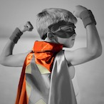

<image src="images/5.jpg" width="100%">

这是王哲峰的个人主页。2017 年我从上海大学数学系毕业。开始了在上海工作的日子。除了工作就是在家听音乐、看书、睡觉、学习。偶尔看看 Dota2，内心很想玩游戏，但是怕累。索性写写文章，写写笔记，记录生活，记录学习。

### 本站架构

- [R](https://www.r-project.org/)
- [blogdown](https://github.com/rstudio/blogdown)
- [GitHub](https://github.com)
- [Netlify](https://www.netlify.com/)
- [Vercel](https://vercel.com/)
- [Hugo Ivy 主题](https://github.com/yihui/hugo-ivy)
- [Disqus](https://disqus.com/)
- [Utterances](https://utteranc.es/)

### TODO:

- :black_square_button: Disqus 在一些页面不启用
- :black_square_button: 集成 Disqus 和 Utterances 到评论区
- :black_square_button: 首页内容更新
- :black_square_button: 弄懂后台 JS、HTML、CSS 的原理
- :black_square_button: 处理页面中标题的字体样式
- :black_square_button: 头像问题处理 
- :black_square_button: 部署到私有云服务器上
- :black_square_button: 图片的保存问题
- :black_square_button: 加载速度问题
- :black_square_button: 微信屏蔽问题

