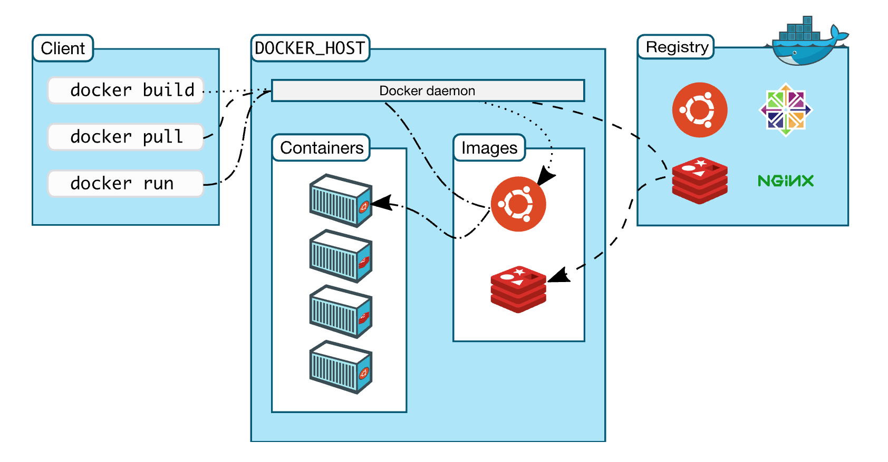

<style>
h1 {
  background-color: #2B90B6;
  background-image: linear-gradient(45deg, #4EC5D4 10%, #146b8c 20%);
  background-size: 100%;
  -webkit-background-clip: text;
  -moz-background-clip: text;
  -webkit-text-fill-color: transparent;
  -moz-text-fill-color: transparent;
}
h2 {
  background-color: #2B90B6;
  background-image: linear-gradient(45deg, #4EC5D4 10%, #146b8c 20%);
  background-size: 100%;
  -webkit-background-clip: text;
  -moz-background-clip: text;
  -webkit-text-fill-color: transparent;
  -moz-text-fill-color: transparent;
}
</style>

# 1.Docker 概述

## 1.1 Docker 历史

- Docker 历史

    - 2010 年, 几个搞 IT 的年轻人在美国成立了一加公司 dotCloud, 做一些 PASS 的云计算服务！LXC 有关的容器技术. 
      他们将自己的技术(容器化技术)命名就是 Docker. Docker 刚刚诞生的时候, 没有引起行业的注意, dotCloud 活不下去了. 
    - 2013 年 Docker 开源. Docker 的优点越来越多地被人发现. Docker 每个月都会更新一个版本！
    - 2014 年 4月9日, Docker 1.0 发布. 

       - Docker 为什么这么火？十分轻巧！
       - 在容器技术出来之前, 我们都是使用虚拟技术. 通过虚拟机可以虚拟出来一台或者多台电脑, 
         非常笨重. 虚拟机也是属于虚拟化技术, Docker 容器技术, 也是一种虚拟化技术. 

- Docker 是基于 Go 语言开发的一个开源项目

    - 管网: https://www.docker.com/
    - 文档: https://docs.docker.com/
    - 仓库: https://hub.docker.com/
    - 阿里云仓库: 

## 1.2 Docker 概述

### 1.2.1 Docker 能做什么

- Fast, consistent delivery of your applications
- Responsive deployment and scaling
- Running more workloads on the same hardware

### 1.2.2 Docker Platform

- Docker 提供了在完全隔离的环境中(容器)中打包和运行应用程序的功能, 隔离和安全性使得可以在给定服务器上同时运行多个容器.
- Docker 的容器是很轻巧的, 因为他们不需要虚拟机管理程序的额外负载, 而是直接在服务器主机的内核中运行.
- Docker 提供了工具和一个平台来管理容器的生命周期:

  - 使用容器来开发应用及其支持的组件
  - 容器成为分发和测试应用程序的单元
  - 将应用程序作为容器或协调服务部署到生产环境中, 生产环境可以是本地数据中心或云服务器

### 1.2.3 Docker Engine


Docker 是一个客户端-服务器应用程序, 具有以下组件:

- **Server**: Docker daemon

    - 一个长期运行的程序
    - `dockerd` 命令
    - Docker daemon 创建并管理 Docker object:

        - networs
        - containers
        - images
        - data volumes

- **REST API** 

    - 提供了外部程序与 Docker daemon 进行通信、交互的接口

- **Client**: Docker CLI

    - CLI 通过脚本或 CLI 命令, 使用 Docker REST API 控制 Docker daemon, 或与 Docker daemon 进行交互
    - `docker` 命令

### 1.2.4 Docker 架构

Docker 使用客户端-服务器架构:



Docker 客户端与 Docker 守护进程进行交互, 其中: 

- Docker 守护进程负责完成构建、运行、分发 Docker 容器的工作.
- Docker 客户端和守护进程可以运行在同一系统上, 也可以使用 Docker 客户端连接到远程的 Docker 守护进程.
- Docker 客户端与守护进程也可以使用 REST API 通过 UNIX sockets 或者其他网络接口进行交互.

1. Docker Client(客户端)--`docker`

    - Docker client 是 Docker 用户与 Docker 交互的主要途径, 当运行命令 `docker run`, 
      Docker client 会发送命令到 `docked` , `docker` 命令使用的是 Docker API.
    - Docker client 可以与多个 Docker daemon 进行通信.
    - Docker client 命令:
    
        - `docker build`
        - `docker pull`
        - `docker run`

2. DOCKER_HOST

- 2.1 Docker daemon(守护进程)--`docked`
    
    - Docker daemon 负责监听 Docker API 的请求, 并管理 Docker Object, 
    如 images, containers, networks, volumes
    - Docker daemon 也可以与其他 daemon 进行通信来管理 Docker Service

- 2.2 Docker Object(对象)

---
**NOTE** 

- 当使用 Docker 时, 用户会创建和使用 images、containers、networks、volumes、plugins 和其他对象.

---

- 2.2.1 Image

- Docker 镜像就是一个用于创建 Docker 容器的只读模板
   
    - 镜像 -> run -> 容器(提供服务器)

- 一个镜像通常基于另一个镜像, 只是多了一些额外的自定义配置, 比如: 可以构建一个基于 `ubuntu` 的镜像, 
   在该镜像的基础上安装 Apache web 服务和自己的应用程序, 还要其他的具体配置项
- 用户可以创建自己的镜像, 也可以使用其他人创建好的已经在 Docker 仓库中发布的镜像

    - 要构建自己的镜像, 需要先创建一个 Dockerfile, 以定义创建镜像并运行它所需的步骤, 
    Dockerfile 中的每条指令都会在镜像中创建一个层, 当更改 Dockerfile 并重新构建镜像时, 
    只需要重新构建那些已经更改的层即可

- 通过镜像可以创建多个容器, 最终服务运行或者项目运行就是在容器中
 
- 2.2.2 Container
 
    - 一个容器就是一个可运行的镜像实例, 可以通过 Docker API 或者 CLI 来创建、启动、停止、移动、删除容器
    - 一个容器可以连接到一个或多个网络, 并将存储空间赋予它, 甚至可以基于它的当前状态创建一个新的镜像
    - 默认情况下, 容器与其他容器及其主机之间的隔离度相对较高, 可以控制容器的网络、存储空间、或其他基础子系统与其他容器或主机的隔离程度
    - 容器由镜像、以及在创建或启动时为该镜像提供的任何配置选项定义, 删除容器后, 未存储在永久性存储空间中的状态将消失
    - Docker 利用容器技术, 独立运行一个或者一组应用
    - 可以把容器理解为就是一个简易的 Linux 系统

3. Docker Registry(仓库)
  
- Docker registry 存储 Docker images
- Docker registry 分为公有仓库、私有仓库

    - 公有仓库:
    
        - 国外: Docker Hub
        - 国内: 阿里云

    - 私有仓库

        - 可以使用 `docker pull` 或者 `docker run` 命令从配置的仓库中拉取镜像, 
           使用 `docker push` 命令会将镜像推送到配置的仓库

4. Docker Services

    - Docker Services 允许将 Containers 扩展在多个 Docker daemon 上, 这是一个拥有多个 managers 和 workers 的 swarm, 
    每一个 swarm 的成员都是一个 Docker daemon, 并且所有的 daemon 可以通过 Docker API 进行通信
    - Docker Service 允许你定义所需的状态, 比如, 在任何给定时间必须可用的服务副本的数量
    - Docker Service 是一个单独的应用程序
    - Docker Engine 在 Docker 1.12 及更高版本中开始支持集群模式

### 1.2.5 `docker run` 命令示例

- 运行一个 ubuntu 容器

```bash
$ docker run -i -t ubuntu /bin/bash
```

- 1.如果 ubuntu 在本地没有镜像, Docker 会从已配置的仓库中拉取, 等同于: `docker pull ubuntu`
- 2.Docker 会创建一个新容器, 等同于: `docker container create`
- 3.Docker 将一个读写文件系统分配给容器, 作为其最后一层. 这允许运行中的容器在其本地文件系统中创建或修改文件和目录
- 4.Docker 创建了一个网络接口, 将容器连接到默认网络, 因为您未指定任何网络选项. 这包括为容器分配 IP 地址. 默认情况下, 容器可以使用主机的网络连接连接到外部网络
- 5.Docker 启动容器并执行 `/bin/bash`. 因为容器是交互式运行的, 并且已附加到您的终端（由于 -i 和 -t 标志）, 所以您可以在输出记录到终端时使用键盘提供输入
- 6.当键入 `exit` 以终止 `/bin/bash` 命令时, 容器将停止但不会被删除. 您可以重新启动或删除它

### 1.2.6 Docker 底层技术

Docker 是一个 Client-Server 结构的系统, 
Docker 的守护进程(Docker daemon)运行在主机(Docker Server)上, 
通过 Socket 从客户端(Docker Client[docker CLI, REST API])访问, 
Docker Server 接收到 Docker Client 的指令, 就去执行这个命令.

Docker 用 Go 编程语言编写, 并利用 Linux 内核的多个功能来交付其功能.

- Namespaces

    - Docker 使用一种称为 namespaces 的技术提供了称为 container 的隔离工作空间, 
    当运行一个 container 时, Docker 会为这个 container 创建一系列 namespaces
    - Docker Engine 在 Linux 上使用以下名称空间: 
    
        - pid namespaces: 进程隔离, PID: Process ID
        - net namespaces: 管理网络接口, NET: Networking
        - ipc namespaces: 管理获取 IPC 资源的能力, IPC: InterProcess Communication
        - mnt namespaces: 管理文件系统节点, MNT: Mount
        - uts namespaces: 隔离内核和版本识别, UTS: Unix Timesharing System

- Control groups

    - Linux上的Docker引擎还依赖于另一种称为控制组 （cgroups）的技术. cgroup将应用程序限制为一组特定的资源. 控制组允许Docker Engine将可用的硬件资源共享给容器, 并有选择地实施限制和约束. 例如, 您可以限制特定容器可用的内存.

- Union file systems

    - 联合文件系统或UnionFS是通过创建图层进行操作的文件系统, 使其非常轻便且快速. Docker Engine使用UnionFS为容器提供构建模块. Docker Engine可以使用多个UnionFS变体, 包括AUFS, btrfs, vfs和DeviceMapper.
  
- Container format

    - Docker Engine将名称空间, 控制组和UnionFS组合到一个称为容器格式的包装器中. 默认容器格式为libcontainer. 将来, Docker可以通过与BSD Jails或Solaris Zones等技术集成来支持其他容器格式.

# 2.Docker 安装

## 2.1 环境查看

- Linux

```bash
# 系统内核
$ uname -a

# 系统配置
$ cat /etc/os-release
```

- macOS

```bash
$ uname -a
```

## 2.2 Dcoker 安装

- 安装目录: https://docs.docker.com/get-docker/

    - macOS: https://docs.docker.com/docker-for-mac/install/
    - Linux: https://docs.docker.com/engine/install/

### 2.2.1 macOS

1. 安装 Docker Desktop

   - 安装内容

      - Docker Engine
      - Docker CLI client
      - Docker Compose
      - Notary
      - Kubernetes
      - Credential Helper
   
   - https://docs.docker.com/docker-for-mac/install/
   - https://hub.docker.com/editions/community/docker-ce-desktop-mac/


2. 卸载 Docker Desktops

   - https://docs.docker.com/docker-for-mac/install/

### 2.2.2 Ubuntu

1. 删除旧版本

```bash
$ sudo apt-get remove docker docker-engine docker.io containerd runc
```

2. 设置存储库

```bash
# 1.更新apt软件包索引并安装软件包以允许apt通过HTTPS使用存储库
$ sudo apt-get update
$ sudo apt-get install apt-transport-https ca-certificates curl gnupg-agent software-properties-common

# 2.添加Docker的官方GPG密钥
$ curl -fsSL https://download.docker.com/linux/ubuntu/gpg | sudo apt-key add -
$ sudo apt-key fingerprint 0EBFCD88

# 3.设置稳定的存储库
$ sudo add-apt-repository "deb [arch=amd64] https://download.docker.com/linux/ubuntu $(lsb_release -cs) stable"
```
    
3. 安装 Docker Engine

```bash
# 1.更新apt软件包索引
$ sudo apt-get update

# 2.安装最新版本的Docker Engine和容器化的容器, 或转到下一步以安装特定版本
$ sudo apt-get install docker-ce docker-ce-cli containerd.io

# 3.查看可用的仓库版本(如果想安装特定版本的Docker Engine)
$ apt-cache madison docker-ce
$ sudo apt-get install \
    docker-ce=<VERSION_STRING> \
    docker-ce-cli=<VERSION_STRING> \
    containerd.io
```

4. 运行 hello-world

```bash
# 启动 Docker
$ systemctl start docker
$ docker version

# 运行 hello-world
$ docker run --help
$ sudo docker run hello-world

# 查看下载的 image
$ docker images
```

5. 升级 Docker Engine

```bash
# 按照安装说明进行
$ sudo apt-get update
```

6. 卸载 Docker Engine

- 卸载 Docker Engine, CLI, Containerd packages

```bash
$ sudo apt-get purge docker-ce docker-ce-cli containerd.io
```

- 删除 Images, containers, volumes

```bash
$ sudo rm -rf /var/lib/docker
```

---
**NOTE** 

customized configuration files 需要手动删除

---

### 2.2.3 Windows


## 2.3 Docker Desktop 使用入门

### 2.3.1 查看 Docker 版本

```bash
$ docker version
```

### 2.3.2 运行 hello-word 容器


```bash
$ docker run -d -p 80:80 docker/getting-started
# or
$ docker run -dp 80:80 docker/getting-started
```

- `-d`: 以 detached 模式(后台运行)运行容器
- `-p 80:80`: 将主机的 80 端口映射到容器的 80 端口
- `docker/getting-started`: 可用的镜像

### 2.3.3 构建 App 容器、镜像

2.1 下载 App

  - https://github.com/docker/getting-started/tree/master/app

2.2 构建 App 的容器镜像

- (1)在 package.json 所在目录下创建 `Dockerfile` 文件, 内容如下

```bash
FROM node:12-alpine
WORKDIR /app
COPY . .
RUN yarn install --production
CMD ["node", "src/index.js"]
```

- (2)构建容器镜像

```bash
$ docker build -t getting-started .
```

- `-t`: 为镜像打一个可读性好的标签
- `.`: Docker 在当前目录下寻找 `Dockerfile` 文件

2.3 启动 App 容器

- (1) 启动 App 容器

```bash
$ docker run -dp 3000:3000 getting-started
```

- (2)查看 App

    - http://localhost:3000/

2.4 更新 App

- (1)更改 App 源代码
- (2)重新构建更新后的镜像

```bash
$ docker build -t getting-started .
```

- (3)停止旧容器

    - 命令行模式:

    ```bash
    # 查看正在运行的容器 ID
    $ docker ps

    # Swap out <the-container-id> with the ID from docker ps
    $ docker stop <the-container-id>
    $ docker stop -f <the-container-id>
    ```

    - Docker Dashboard 模式

- (3)删除旧容器

    - 命令行模式

```bash
$ docker rm <the-container-id>
$ docker rm -f <the-container-id> 
```

    - Docker Dashboard 模式

- (4)开启新的容器

    ```bash
    $ docker run -dp 3000:3000 getting-started
    ```

- (5)查看 App

   - http://localhost:3000/

### 2.3.4 分享 App

3.1 创建一个 Repo

- (1) `Docker Hub <https://hub.docker.com/>`_ 
- (2) `Create a Repository`


3.2 Push 镜像

- (1)查看镜像

```bash
$ docker image ls
```

- (2)登录到 Docker Hub

```bash
$ docker login -u zfwang
```

- (3)为 `getting-started` 镜像创建一个新标签

```bash
$ docker tag getting-started zfwang/getting-started
```

- (4)Push 镜像

```bash
$ docker push zfwang/getting-started
```

3.3 在一个新的实例中运行镜像

- (1) `Play with Docker <https://labs.play-with-docker.com/>`_ 
- (2) 登录 Docker Hub 账号
- (3) `+ ADD NEW INSTANCE`
- (4) 运行容器

```bash
$ docker run -dp 3000:3000 YOUR-USER-NAME/getting-started
```

### 2.3.5 持久化数据库

4.1 容器的文件系统
4.2 启动一个 `ubuntu`容器, 并创建一个文件 `/data.txt`

```bash
$ docker run -d ubuntu zsh -c "shuf -i 1-10000 -n 1 -o /data.txt && tail -f /dev/null"
```

4.3 在 Docker Desktop 中代开 `ubuntu` 容器中的 CLI

```bash
$ cat /data.txt
```

---
**NOTE** 

- 或者在主机命令行中运行

---

```bash
$ docker exec <container-id> cat /data.txt
```

4.4 启动另一个 `ubuntu` 容器(使用同一个 image)

```bash
$ docker run -it ubuntu ls /
```

4.5 删除第一个容器

```bash
$ docker rm -f <container-id>
```

# 3.Docker 命令


## 3.1 docker help

- Docker 的版本信息

```bash
$ docker version
$ docker -f args
$ docker --kubeconfig args
```

- Docker 的系统信息, 包括镜像、容器的数量

```bash
$ docker info
```

- Docker 的帮助命令

```bash
$ docker <command> --help
```

## 3.2 docker 镜像命令

### 3.2.1 docker images 查看镜像

```bash
$ docker images
$ docker images -a
$ docker images -q
$ docker images -aq
```

### 3.2.2 docker search 搜索镜像

```bash
$ docker search mysql
$ docker search --filter=STARS=3000
```

### 3.2.3 docker pull 下载镜像

```bash
$ docker pull <image>
$ docker pull <image>:<tag/version>

# <adderss>: 镜像实际地址
$ docker pull <address>
```

---
**NOTE** 

- 如果不写 `tag`, 默认就是 `latest`
- docker 分层下载是 docker image 的核心, 联合文件系统

---

### 3.2.4 docker remove 删除镜像

```bash
# 删除指定容器
$ docker rmi -f <images-id>

# 删除多个容器
$ docker rmi -f <images-id> <images-id> <images-id>

# 删除全部镜像
$ docker rmi -f $(docker images -aq)
```

## 3.3 docker 容器命令

### 3.3.1 新建容器并使用

- 语法:

```bash
# 下载镜像
$ docker pull centos

# 启动并进入容器
$ docker run [可选参数] image
$ docker run -it centos /bin/bin
```

- 参数说明

    - `--name=Name`: 容器名字, 用来区分容器
    - `-d`: 后台运行方式
    - `-it`: 使用交互方式运行
    - `-p`: 指定容器的端口, -p 8080:8080
        - `-p ip:主机端口:容器端口`
        - `-p 主机端口:容器端口`: 常用
        - `-p 容器端口`
        - `-p`
    - `-p 随机指定端口`

### 3.3.2 退出容器

```bash
$ exit            # 从容器退回主机
$ Ctrl + P + Q    # 容器不停止退出
```

### 3.3.3 查看容器

```bash
$ docker ps       # 查看正在运行的容器
$ docker ps -a    # 列出当前正在运行的容器 + 带出历史运行过的容器
$ docker ps -n=?  # 最近创建的容器
$ docker ps -q    # 只显示容器的编号
```

### 3.3.4 删除容器

```bash
$ docker rm 容器id                 # 删除指定的容器, 不能删除正在运行的容器
$ docker rm -f ${docker ps -aq}   # 删除所有容器(包含正在运行的容器)
$ docker ps -a -q|xargs docker rm # 删除所有容器(包含正在运行的容器)
```

### 3.3.5 启动、停止容器

```bash
$ docker start 容器id
$ docker restart 容器id
$ docker stop 容器id
$ docker kill 容器id
```

## 3.4 其他常用命令

### 3.4.1 后台启动容器

```bash
$ docker run -d 镜像名
$ docker run -d centos
$ docker ps
```

---

**NOTE** 

docker ps 会有问题, 发现 `centos` 停止了:

- docker 容器使用后台运行, 就必须要有一个前台进程, docker 发现没有应用, 就会自动停止
- nginx 容器启动后, 发现自己没有提供服务, 就会立刻停止, 没有程序了

---

### 3.4.2 查看日志命令

```bash
$ docker logs --help
$ docker logs -tf --tail n 容器id

# 自己写一段脚本
$ docker run -d centos /bin/sh -C "while true;do echo wangzhefeng;sleep 1;done"
$ docker ps
$ docker logs -tf tail 10 容器id
```

- 参数说明
   
    - `-tf`: 显示日志
    - `--tail number`: 要显示日志条数


### 3.4.3 查看容器中的进程信息

```bash
$ docker top --help
$ docker top 容器id
```

### 3.4.4 查看容器的元命令

```bash
$ docker inspect --help
$ docker inspect 容器id
```

### 3.4.5 进入正在运行的容器

```bash
# 方式一: 新建一个命令行窗口
$ docker exec -it 容器id /bin/bash

# 方式二: 不新建一个命令行窗口
$ docker attach 容器id
```

### 3.4.6 从容器内拷贝文件到主机上

- 拷贝是一个手动过程, 可以使用 -v 卷技术将容器 `/home` 与 主机 `/home` 打通

```bash
$ docker cp 容器id:容器内路径 目的地主机地址
```

### 3.4.7 从主机内拷贝文件到容器上


```bash
$ todo
```


## 3.5 docker 命令练习

### 3.5.1 docker 安装 Nginx

1.搜索镜像

```bash
$ docker search nginx
```

2.下载镜像

```bash
$ docker pull nginx
```

3.查看镜像

```bash
$ docker images
```

4.启动容器

```bash
$ docker run -d --name nginx01 -p 3344:80 nginx
```

5.查看容器

```bash  
$ curl localhost:3344
```

6.端口暴露的概念

### 3.5.2 docker 安装 Tomcat

1.搜索镜像

```bash
$ docker search tomcat
```

2.下载镜像

```bash

$ docker pull tomcat

# 停止容器后, 容器还可以查到, 一般用来测试, 用完即删除
$ docker run -it --rm tomcat:9.0
```

3.查看镜像

```bash
$ docker images
```
4.启动容器

```bash
$ docker run -d --name tomcat01 -p 3355:8080 tomcat
```

5.查看容器

https://localhost:3355

6.进入容器, 查看 tomcat

```bash
$ docker exec -it tomcat01 /bin/bash
```

### 3.5.3 docker 安装 ES + Kibana

1. 搜索镜像

```bash
$ docker search elasticsearch
```

2. 下载镜像

```bash
$ docker pull elasticsearch
```

3. 查看镜像

```bash
$ docker images
```

4. 启动容器

```bash
$ docker run -d --name elasticsearch -p 9200:9200 -p 9300:9300 -e 
```

5. 查看容器

```bash
$ docker 
```

# 4.Docker 镜像


# 5.容器数据卷


# 6.DockerFile

   - https://mp.weixin.qq.com/s?__biz=MzAwMjg1NjY3Nw==&mid=2247518419&idx=2&sn=2e25da85a7dcf19fe6ca80484128deb3&chksm=9ac6cb59adb1424f76071ee35d0a01ba9635490b422b239290693851fc2f099bd3414af7792c&scene=132#wechat_redirect
   - Docker 可以通过读取 Dockerfile 中的指令自动构建镜像.
   - Dockerfile 是一个文本文档, 其中包含了用户创建镜像的所有命令和说明.

## 6.1 变量

   变量用 `$variable_name` 或者 `${variable_name} 表示:

      - `${variable:-word}` 表示如果 `variable` 设置, 则结果将是该值, 如果 `variable` 未设置,  `word` 则将是结果
      - `${variabel:+word}` 表示如果 `variable` 设置, 则为 `word` 结果, 否则为 空字符串

   变量前加 `\` 可以转义成普通字符串: `\$foo` 或者 `\${foo}` 表示转换为 `$foo` 和 `${foo}` 文本

## 6.2 FROM

初始化一个新的构建阶段, 并设置基础镜像:

```bash
FROM [--platform=<platform>] <image> [AS <name>]
FROM [--platform=<platform>] <image>[:<tag>] [AS <name>]
FROM [--platform=<platform>] <image>[@digest] [AS <name>]
```

- 单个 Dockfile 可以多次出现 `FROM` , 以使用之前的构建阶段作为另一个构建阶段的依赖项
- `AS <name>` 表示为构建阶段命名, 在后续 `FROM` 和 `COPY --from=` 说明中可以使用这个名词, 
 引用此阶段构建的镜像
- `digest` 其实就是根据镜像内容产生的一个 ID, 只要要镜像的内容不变 `digest` 也不会变
- `tag` 或 `digest` 值是可选的. 
  
  - 如果省略其中任何一个, 构建器默认使用一个 `latest` 标签
  - 如果找不到该 `tag` 值, 构建器将返回错误

- `--platform` 标志可用于在 `FROM` 引用多平台镜像的情况下指定平台. 
 例如, `linux/amd64`、 `linux/arm64` 、 或 `windows/amd64`

## 6.3 RUN


## 6.4 CMD

## 6.5 LABEL


## 6.6 EXPOSE


## 6.7 ENV


## 6.8 ADD


## 6.9 COPY


## 6.10 ENTRYPOINT


## 6.11 VOLUME


## 6.12 ARG


## 6.13 ONBUILD


## 6.14 STOPSIGNAL


## 6.15 HEALTHCHECK


## 6.16 SHELL


## 6.17 WORKDIR


## 6.18 USER

设置用户名(或 UID) 和可选的用户组(或 GID)

```bash
USER <user>[:<group>]
# or
USER <UID>[:GID]
```

# 7.Docker 网络原理


# 8.Docker Compose


# 9.Docker Swarm


# 10.CI/CD jenkins


# 11.IDEA 整合 Docker


# 12.Docker 安装环境

## 12.1 Docker 安装 Ubuntu

1.查看可用的 Ubuntu 版本

  - Ubuntu 镜像库地址 https://hub.docker.com/_/ubuntu?tab=tags&page=1

2.拉取最新版的 Ubuntu 镜像

```bash
docker pull ubuntu
docker pull ubuntu:latest
```

3.查看本地镜像

```bash
docker images
```

4.运行容器

  - 可以通过 `exec` 命令进入 ubuntu 容器

```bash
docker run -itd --name ubuntu-test ubuntu
```

5.安装成功

```bash
docker ps
```

## 12.2 Docker 安装 Python

## 12.3 Docker 安装 TensorFlow


## 12.4 Docker 安装 PyTorch


# 13.Docker 使用示例

## 13.1 公司工作站环境

1. 查看容器

```bash
$ sudo docker ps -a
```

2. 开启 TensorFlow 环境

```bash
$ sudo docker attach tf_env
```

3. 数据目录

```bash
$ cd /workspace/dataSets
```
  
4. 退出 TensorFlow Docker(容器还在运行)

```bash
$ Ctrl + P + Q
```

---
**NOTE** 

- tf 环境的 docker, name 是 tf_env, 已运行 jupyter notebook, 192.168.0.66:7777
- torch 环境的 docker, name 是 torch_env, 已运行 jupyter notebook, 192.168.0.66:6666
- 初次进入需要密码
- 挂载的目录都是 /workspace/dataSets 挂载宿主机 /mnt/dataSets

---

# 14.Kubernetes

Docker Desktop 包含一个可以在 Mac 上运行的 Kubernetes 服务器, 
因此可以在 Kubernetes 上部署 Docker 工作负载.

Kubernetes 的客户端命令是 `kubectl`

- 将 Kubernetes 指向 docker-desktop:

```bash
kubectl config get-contexts
kubectl config user-context docker-desktop
```
