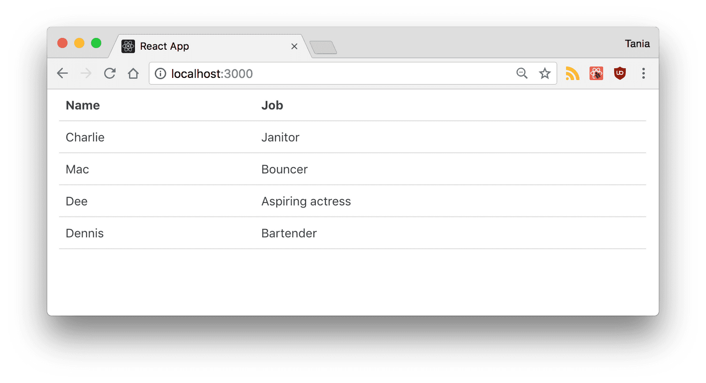
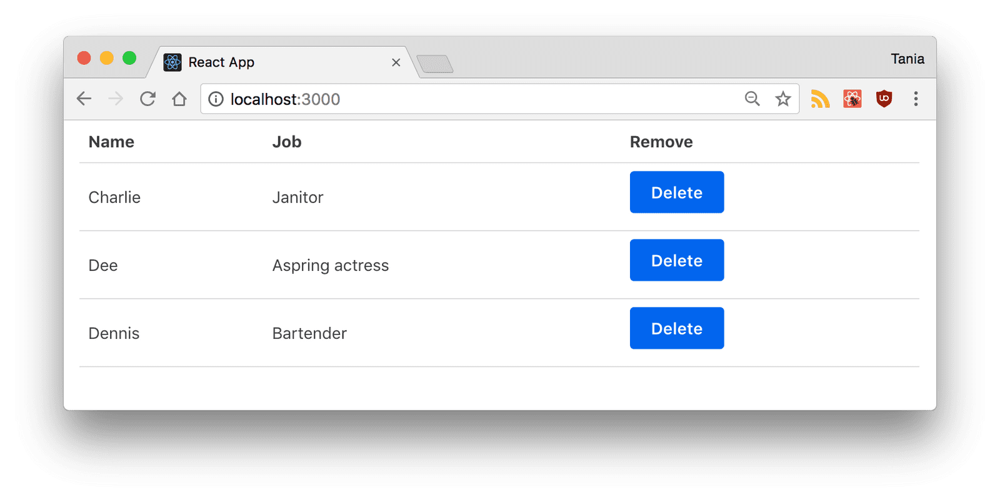

<style>
h1 {
  background-color: #2B90B6;
  background-image: linear-gradient(45deg, #4EC5D4 10%, #146b8c 20%);
  background-size: 100%;
  -webkit-background-clip: text;
  -moz-background-clip: text;
  -webkit-text-fill-color: transparent;
  -moz-text-fill-color: transparent;
}
h2 {
  background-color: #2B90B6;
  background-image: linear-gradient(45deg, #4EC5D4 10%, #146b8c 20%);
  background-size: 100%;
  -webkit-background-clip: text;
  -moz-background-clip: text;
  -webkit-text-fill-color: transparent;
  -moz-text-fill-color: transparent;
}

details {
    border: 1px solid #aaa;
    border-radius: 4px;
    padding: .5em .5em 0;
}

summary {
    font-weight: bold;
    margin: -.5em -.5em 0;
    padding: .5em;
}

details[open] {
    padding: .5em;
}

details[open] summary {
    border-bottom: 1px solid #aaa;
    margin-bottom: .5em;
}
</style>


<details><summary>目录</summary><p>

- [React 相关 js 库](#react-相关-js-库)
- [先决条件](#先决条件)
- [目标](#目标)
- [配置和安装](#配置和安装)
  - [静态 HTML File](#静态-html-file)
  - [Create React App](#create-react-app)
  - [React 开发者工具](#react-开发者工具)
- [JSX](#jsx)
  - [JSX 简介](#jsx-简介)
  - [JSX 原理](#jsx-原理)
- [组件](#组件)
  - [App 主组件](#app-主组件)
  - [其他类组件](#其他类组件)
  - [其他简单组件](#其他简单组件)
- [Props](#props)
- [State](#state)
- [开发表单](#开发表单)
- [提取 API 数据](#提取-api-数据)
- [构建和部署 React 应用程序](#构建和部署-react-应用程序)
  - [构建](#构建)
  - [部署](#部署)
    - [将 App 部署到 GitHub Page 上](#将-app-部署到-github-page-上)
    - [部署 App](#部署-app)
- [资料](#资料)
</p></details><p></p>


# React 相关 js 库

- ``babel.min.js``
    - ES6 => ES5
    - jsx => js
- ``prop-type.js``
- ``react.development.js``
    - 核心库
- ``react-dom.development.js``
    - 扩展库，操作 DOM

# 先决条件

* 熟悉 HTML、CSS、JavaScript 编程
* 熟悉基本的 DOM 知识
* 熟悉 ES6 语法和特性
* Node.js 和 npm 全局安装

# 目标

* 了解基本的 React 概念和相关术语，例如 Babel、Webpack、JSX、组件(components)、
  属性(props)、状态(state)和生命周期(lifecycle)
* 构建一个非常简单的 React 应用程序来演示上述概念

这是最终结果的源代码和现场演示:

* [在 GitHub 上查看源代码](https://github.com/wangzhefeng/react_tutorial)
* [查看演示]()


# 配置和安装

有很多种方式配置 React，这里介绍两种

## 静态 HTML File

如果不熟悉 Webpack， Babel 和 Node.js，可以使用这种方式

1. 新建一个 `index.html`
2. 在 `<head>` 中载入下面的库 
    - [React](https://reactjs.org/docs/react-api.html) - the React top level API
    - [React DOM](https://reactjs.org/docs/react-dom.html) - adds DOM-specific methods
    - [Babel](https://babeljs.io/) - a JavaScript compiler that lets us use ES6+ in old browsers
3. 最终的 `index.html` 如下:

```html
<!DOCTYPE html>
<html>
  <head>
    <meta charset="utf-8" />

    <title>Hello React!</title>
    <script src="https://unpkg.com/react@^16/umd/react.production.min.js"></script>
    <script src="https://unpkg.com/react-dom@16.13.0/umd/react-dom.production.min.js"></script>
    <script src="https://unpkg.com/babel-standalone@6.26.0/babel.js"></script>
  </head>
  <body>
    <div id="root"></div>
    <script type="text/babel">
      class App extends React.Component {
        render() {
          return <h1>Hello world!</h1>;
        } 
      }

      ReactDOM.render(<App />, document.getElementById("root"))
    </script>
  </body>
</html>
```

4. 在浏览器中打开 `index.html`


## Create React App

Facebook 创建了 Create React App，这是一个预先设置了构建 React 应用程序所需的一切环境:

* 创建一个实时开发服务器
* 使用 Webpack 自动编译 React、JSX 和 ES6
* 自动为 CSS 文件添加前缀
* 使用 ESLint 测试和警告代码中的错误

1. 创建项目，下面的命令会安装:

* npx
* react
* react-dom
* react-script with cra-template

```bash
$ npx create-react-app react-tutorial
```

2. 进入创建的目录并启动项目

```bash
$ cd react-tutorial && npm start
```

3. 项目启动后，会在浏览器的 `localhost:3000` 中打开一个新的窗口


4. 删除 `src/` 目录中除 `index.js` 和 `index.css` 的其他文件
5. 修改 `src/index.css`，从 [Primitive CSS](https://taniarascia.github.io/primitive/css/main.css) 中复制粘贴
6. 修改 `src/index.js`

```js
import React, {Component} from 'react';
import ReactDOM from 'react-dom/client';
import './index.css';


class App extends Component {
  render() {
    return (
      <div className='App'>
        <h1>Hello react!</h1>
      </div>
    );
  }
}

const root = ReactDOM.createRoot(document.getElementById('root'));
root.render(
  <React.StrictMode>
    <App />
  </React.StrictMode>
);
```

## React 开发者工具

* 下载 [React DevTools for Chrome](https://chrome.google.com/webstore/detail/react-developer-tools/fmkadmapgofadopljbjfkapdkoienihi)
* 打开 DevTools


# JSX

## JSX 简介

* JSX 全称 JavaScript XML
* React 定义的一种类似于 XML 的 JavaScript 扩展语法：JavaScript + XML
* JSX 实际上更接近 JavaScript，而不是 HTML，因此在编写时需要注意一些关键差异
    - `className`  用于替代 `class`
    - JSX 中的属性和方法都是驼峰式命名
    - 自闭合标签必须以斜杠结尾，例如 ``
* JavaScript 表达式也可以使用花括号 `{}` 嵌入到 JSX 中，包括变量、函数和属性，例如
    - `const name = "wangzf"`
    - `const heading = <h1>Hello, {name}</h1>`
* 作用：用来简化创建虚拟 DOM
    - a.写法：``val ele = <h1>Hello JSX!</h1>``
    - b.注意1：它不是字符串，也不是 HTML/XML 标签
    - c.注意2：它最终产生的就是一个 JavaScript 对象
* 标签名任意：HTML 标签或其他标签
* JSX 比在原生 JavaScript 中创建和添加许多更容易编写和理解的元素，这也是人们如此喜爱 React 的原因之一

## JSX 原理

使用 JSX 不是编写 React 的强制要求，
本质是 `React.createElement(component, props, ...children)` 方法的语法糖

* 使用 JSX:

```jsx
const heading = <h1 className="site-heading">Hello, React</h1>
```

* 没有使用 JSX 的等价 JavaScript:

```js
const heading = React.createElement(
  "h1", 
  {
    className: "site-heading"
  },
  "Hello, React"
)
```

# 组件

React 中几乎所有东西都是由组件组成，可以是类组件，也可以是简单的函数组件。
大多数 React 应用程序都有许多小组件，并且所有内容都记载到主 `App` 组件中。
组件也经常有自己的文件。

组件可以嵌套在其他组件中，简单和类组件可以混用。

## App 主组件

1. 删除 `src/index.js` 中的 `App` 类

```js
import React from 'react';
import ReactDOM from 'react-dom/client';
import App from './App'
import './index.css';

const root = ReactDOM.createRoot(document.getElementById('root'));
root.render(
  <React.StrictMode>
    <App />
  </React.StrictMode>
);
```

2. 新建 `src/App.js` 文件

```js
import React, {Component} from 'react';

class App extends Component {
  render() {
    return (
      <div className='App'>
        <h1>Hello react!</h1>
      </div>
    );
  }
}

export default App
```

## 其他类组件

> 一个类组件必须包含 `render()`，并且 `return` 只能返回一个父元素

1. 新建 `Table.js` 文件，用来创建一个表组件，并用数据填充

```js
import react, {Component} from 'react'

class Table extends Component {
  render() {
    return (
      <table>
        <thead>
          <tr>
            <th>Name</th>
            <th>Job</th>
          </tr>
        </thead>
        <tbody>
          <tr>
            <td>Charlie</td>
            <td>Janitor</td>
          </tr>
          <tr>
            <td>Mac</td>
            <td>Bouncer</td>
          </tr>
          <tr>
            <td>Dee</td>
            <td>Aspiring actress</td>
          </tr>
          <tr>
            <td>Dennis</td>
            <td>Bartender</td>
          </tr>
        </tbody>
      </table>
    )
  }
}

export default Table
```

2. 修改 `src/App.js`

```js
import React, {Component} from 'react'
import Table from './Table'

class App extends Component {
  render() {
    return (
      <div className="container">
        <Table />
      </div>
    )
  }
}

export default App
```

3. 页面效果



## 其他简单组件

React 中的另一类组件是简单组件，它是一个函数，不需要 `render()`，只需要 `return`

下面修改之前创建的 `Table` 组件:

1. 为 `Table` 创建表头组件

```js
const TableHeader = () => {
  return (
    <thead>
      <tr>
        <th>Name</th>
        <th>Job</th>
      </tr>
    </thead>
  )
}
```

2. 为 `Table` 创建表体组件

```js
const TableBody = () => {
  return (
    <tbody>
      <tr>
        <td>Charlie</td>
        <td>Janitor</td>
      </tr>
      <tr>
        <td>Mac</td>
        <td>Bouncer</td>
      </tr>
      <tr>
        <td>Dee</td>
        <td>Aspiring actress</td>
      </tr>
      <tr>
        <td>Dennis</td>
        <td>Bartender</td>
      </tr>
    </tbody>
  )
}
```

3. 修改 `Table` 类组件

```js
class Table extends Component {
  render() {
    return (
      <table>
        <TableHeader />
        <TableBody />
      </table>
    )
  }
}
```

# Props

React 的一大亮点是它如何处理数据，它使用属性(props)和状态(state)来处理数据

Props 是将现有数据传递给 React 组件的有效方式，但是组件不能更改 `props`，它们是只读的。

1. 从 `src/Table.js` 的 `TableBody` 组件中删除所有数据

```js
// src/Table.js
const TableBody = () => {
  return <tbody />
}
```

2. 将所有数据移动到一个对象数组中，就像引入了一个基于 JSON 的 API

```js
// src/App.js
class App extends Component {
  render() {
    const characters = [
      {
        name: 'Charlie',
        job: 'Janitor',
      },
      {
        name: 'Mac',
        job: 'Bouncer',
      },
      {
        name: 'Dee',
        job: 'Aspring actress',
      },
      {
        name: 'Dennis',
        job: 'Bartender',
      }
    ]

    return (
      <div className="container">
        <Table />
      </div>
    )
  }
}
```

3. 使用 `props` 将 `App` 组件中定义的数据传递给 `App` 的子组件 `Table`
    - 将要传递的 `props` 定义为 `characterData`
    - 要传递的数据 `character` 变量，因为 `character` 是一个 JavaScript 表达式，所以加上花括号 `{}`

```js
// src/App.js
class App extends Component {
  render() {
    const characters = [
      {
        name: 'Charlie',
        job: 'Janitor',
      },
      {
        name: 'Mac',
        job: 'Bouncer',
      },
      {
        name: 'Dee',
        job: 'Aspring actress',
      },
      {
        name: 'Dennis',
        job: 'Bartender',
      }
    ]

    return (
      <div className="container">
        <Table characterData={characters} />
      </div>
    )
  }
}
```

4. 现在数据已经传递到子组件 `Table`，现在在 `Table` 子组件中调用传递过去的 `props`

```js
// src/Table.js
class Table extends Component {
  render() {
    const {characterData} = this.props
    
    return (
      <table>
        <TableHeader />
        <TableBody characterData={characterData} />
      </table>
    )
  }
}
```

5. 现在打开 React DevTools 查看 `Table` 组件，可以看到 `Props` 中的名为 `characterData` 的 `Array` 数据。
   存储在这里的数据称为**虚拟 DOM(virtual DOM)**，这是一种与实际 DOM 快速、有效同步数据的方式


6. 现在数据传递到组件 `Table` 的子组件 `TableBody`。 在组件 `TableBody` 中，将 `props` 作为参数传递，
   并通过数组映射[Array.prototype.map()](https://developer.mozilla.org/en-US/docs/Web/JavaScript/Reference/Global_Objects/Array/map)以返回数组中每个对象的表的行。该映射将包含在 `rows` 变量中，最后将它作为表达式返回

```js
// src/Table.js
const TableBody = (props) => {
  const rows = props.characterData.map((row, index) => {
      return (
          <tr key={index}>
            <td>{row.name}</td>
            <td>{row.job}</td>
          </tr>
      )
  })

  return <tbody>{rows}</tbody>
}
```

# State

现在，数据已经存储在一个变量的数组中，并将其作为 `props` 传递。
使用 `props` 是一种单向的数据流，但使用 `state` 可以从一个组件中更新私有数据

可以将 `state` 视为应该被保存和修改的任何数据，而不必将其添加到数据库中

1. 在 `App` 组件中创建一个 `state` 对象。
   该对象将包含想要存储在 `state` 中的所有内容的属性，
   将之前创建的整个对象数组移动到 `state.characters` 中

```js
// src/App.js
class App extends Component {
    state = {
        characters: [
            {
                name: 'Charlie',
                job: 'Janitor',
            },
            {
                name: 'Mac',
                job: 'Bouncer',
            },
            {
                name: 'Dee',
                job: 'Aspring actress',
            },
            {
                name: 'Dennis',
                job: 'Bartender',
            }
        ]
    }

    render() {
        return (
            <div className="container">
                <Table characterData={characters} />
            </div>
        )
    }
}
```

2. 由于希望能够从表中删除一个字符，所以在类 `App` 中创建一个 `removeCharacter` 方法。
   要检索 `state`，将 `this.state.characters` 使用与之前相同的 ES6 方法。
   为了更新 `state`，将使用内置方法 `this.setState()` 用于操作状态

```js
// src/App.js
class App extends Component {
    state = {
        characters: [
            {
                name: 'Charlie',
                job: 'Janitor',
            },
            {
                name: 'Mac',
                job: 'Bouncer',
            },
            {
                name: 'Dee',
                job: 'Aspring actress',
            },
            {
                name: 'Dennis',
                job: 'Bartender',
            }
        ]
    }

    removeCharacter = (index) => {
        const { characters } = this.state

        this.setState({
            characters: characters.filter((character, i) => {
                return i !== index
            }),
        })
    }

    render() {
        return (
            <div className="container">
                <Table characterData={characters} />
            </div>
        )
    }
}
```

3. 现在将 `removeCharacter()` 方法传递给 `Table` 组件，
   并且将要向下传递给 `TableBody` 组件。
   这样 `removeCharacter()` 将被作为 `props` 传递

```js
// src/App.js
class App extends Component {
    state = {
        characters: [
            {
                name: 'Charlie',
                job: 'Janitor',
            },
            {
                name: 'Mac',
                job: 'Bouncer',
            },
            {
                name: 'Dee',
                job: 'Aspring actress',
            },
            {
                name: 'Dennis',
                job: 'Bartender',
            }
        ]
    }

    removeCharacter = (index) => {
        const { characters } = this.state

        this.setState({
            characters: characters.filter((character, i) => {
                return i !== index
            }),
        })
    }

    render() {
        const { characters } = this.state

        return (
            <div className="container">
                <Table characterData={characters} removeCharacter={this.removeCharacter} />
            </div>
        )
    }
}
```

4. 由于由于项目中的具有自己状态的组件是 `App` 和 `Form`，因此最好将 `Table` 组件转换为简单组件

```js
// src/Table.js
const Table = (props) => {
    const {characterData, removeCharacter} = this.props
    
    return (
      <table>
        <TableHeader />
        <TableBody characterData={characterData} removeCharacter={removeCharacter} />
      </table>
    )
}
```

5. 现在，在 `TableBody` 组件中创建一个带有 `onClick` 事件的按钮，
   并且 在 `TableBody` 组件中，将 'key/index' 通过参数进行传递，
   因此 `filter` 函数知道删除表中的哪个项目,
   这里的 `index` 就是 `removeCharacter()` 中定义的 `index` 的来源

```js
// src/Table.js
const TableBody = (props) => {
  const rows = props.characterData.map((row, index) => {
    return (
      <tr key={index}>
        <td>{row.name}</td>
        <td>{row.job}</td>
        <td>
          <button onClick={() => props.removeCharacter(index)}>Delete</button>
        </td>
      </tr>
    )
  })

  return (
    <tbody>{rows}</tbody>
  )
}
```

6. 效果如下



# 开发表单

现在已经将数据存储在了 `state` 中，并且可以从 `state` 中删除任何项目。

接下来，希望能够向 `state` 中添加数据

1. 首先，从 `state.characters` 中删除所有硬编码的数据，希望之后通过表单对其进行更新

```js
// src/App.js
class App extends Component {
    state = {
        characters: [],
    }

    removeCharacter = (index) => {
        const { characters } = this.state

        this.setState({
            characters: characters.filter((character, i) => {
                return i !== index
            }),
        })
    }

    render() {
        const { characters } = this.state

        return (
            <div className="container">
                <Table characterData={characters} removeCharacter={this.removeCharacter} />
            </div>
        )
    }
}
```

2. 创建一个 `Form` 组件 `Form.js`

```js
// src/Form.js
import React from 'react'

class Form extends React.Component {
  initialState = {
    name: '',
    job: '',
  }

  state = this.initialState
}
```

3. 这个表单的目标是在表单中每次一个字段被修改时更新 `Form` 的 `state`，
   并且，当提交表单数据时，所有数据都将传递给 `App` 组件的 `state`，
   然后更新 `Table` 组件


```js

```


# 提取 API 数据


# 构建和部署 React 应用程序

到目前为止，都是在开发环境中运行，编译、热加载、即时更新。
对于生产环境，希望加载静态文件，没有源代码

## 构建

构建将创建一个 `build` 目录来存放 App，

```js
$ npm run build
```

## 部署

### 将 App 部署到 GitHub Page 上

* 提交代码到 GitHub

### 部署 App


> 退出本地 React 环境，即代码当前未运行

1. 往 `package.json` 中添加 `homepage` 字段，其中包含希望应用程序存在的 URL

```js
{
    // ...
    "home": "https://wangzhefeng.github.io/react-tutorial",
}
```


2. 往 `package.json` 中的 `srcipt` 中添加

```js
"scripts": {
    // ...
    "predeploy": "npm run build",
    "deploy": "gh-pages -d build"
}
```

3. 添加 `gh-pages` 到 devDependencies

```js
$ npm install --save-dev gh-pages
```

4. 部署

```js
$ npm run deploy
```


# 资料

- React 官网: https://zh-hans.reactjs.org/
- React 官方教程: 
- React 教程 https://www.taniarascia.com/getting-started-with-react/
- React API: https://reactjs.org/docs/react-api.html
- React DOM API: https://reactjs.org/docs/react-dom.html
- Babel: https://babeljs.io/
- CSS: https://taniarascia.github.io/primitive/css/main.css

