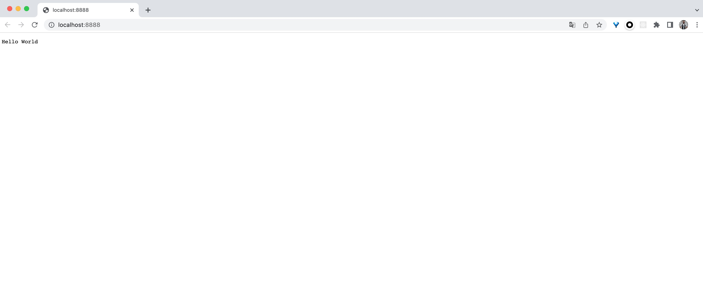

<style>
h1 {
  background-color: #2B90B6;
  background-image: linear-gradient(45deg, #4EC5D4 10%, #146b8c 20%);
  background-size: 100%;
  -webkit-background-clip: text;
  -moz-background-clip: text;
  -webkit-text-fill-color: transparent;
  -moz-text-fill-color: transparent;
}
h2 {
  background-color: #2B90B6;
  background-image: linear-gradient(45deg, #4EC5D4 10%, #146b8c 20%);
  background-size: 100%;
  -webkit-background-clip: text;
  -moz-background-clip: text;
  -webkit-text-fill-color: transparent;
  -moz-text-fill-color: transparent;
}

details {
    border: 1px solid #aaa;
    border-radius: 4px;
    padding: .5em .5em 0;
}

summary {
    font-weight: bold;
    margin: -.5em -.5em 0;
    padding: .5em;
}

details[open] {
    padding: .5em;
}

details[open] summary {
    border-bottom: 1px solid #aaa;
    margin-bottom: .5em;
}
</style>


<details><summary>目录</summary><p>

- [安装 Node.js 和 npm](#安装-nodejs-和-npm)
  - [安装 Node.js](#安装-nodejs)
  - [npm 安装和使用](#npm-安装和使用)
  - [npm 使用](#npm-使用)
- [Hello World](#hello-world)
- [一个完整的基于 Node.js 的 web 应用](#一个完整的基于-nodejs-的-web-应用)
  - [目标](#目标)
  - [应用模块分析](#应用模块分析)
  - [构建应用的模块](#构建应用的模块)
    - [一个基础的 HTTP 服务器](#一个基础的-http-服务器)
    - [创建一个用于启动应用的主文件](#创建一个用于启动应用的主文件)
    - [创建一个路由模块](#创建一个路由模块)
    - [创建请求处理模块](#创建请求处理模块)
- [总结与展望](#总结与展望)
  - [上面应用程序用到的技术点](#上面应用程序用到的技术点)
  - [未使用的技术](#未使用的技术)
- [参考资料](#参考资料)
</p></details><p></p>


# 安装 Node.js 和 npm

## 安装 Node.js

1. 从 `Node.js` [官网](https://nodejs.org/en/)下载平台对应的安装程序安装

2. 从终端进入 Node.js 交互环境

```bash
$ node -V
v14.16.0

$ node
Welcome to Node.js v14.16.0.
Type ".help" for more information.
>
```

## npm 安装和使用

npm 在 Node.js 安装的时候已经安装好了

## npm 使用

```bash
$ npm -v
npm
```

# Hello World

1. 新建一个 `helloworld.js` 文件

```js
// helloworld.js
console.log("Hello World");
```

2. 通过 Node.js 执行

```bash
$ node helloworld.js

Hello World
```

# 一个完整的基于 Node.js 的 web 应用

## 目标

* 用户可以通过浏览器使用应用
* 当用户请求 http://domain/start 时，可以看到一个欢迎页面，页面上有一个文件上传的表达
* 用户可以选择一个图片并提交表单，随后文件将被上传到 `http://domain/upload`，
  该页面完成上传后会把图片显示在页面上 

## 应用模块分析

为了实现上面的目标，需要实现以下部分:

* 需要提供 web 页面，因此需要一个 **HTTP 服务器**
* 对于不同的请求，根据请求的 URL，HTTP 服务器需要给予不同的响应，
  因此，需要一个**路由**，用于把请求对应到处理程序(request handler)
* 当请求被服务器接收并通过路由传递之后，需要可以对其进行处理，
  因此需要最终的**请求处理程序**
* 路由还应该处理 POST 数据，并且把数据封装成更友好的格式传递给请求处理程序，
  因此需要**请求数据处理功能**
* 不仅要处理 URL 对应的请求，还要把内容显示出来，
  这意味着需要一些**视图逻辑**供请求处理程序使用，以便将内容发送给用户的浏览器
* 最后，用户需要上传图片，所以需要**上传处理功能**来处理这方面的细节

使用 Node.js 时，不仅仅在实现一个应用，同时还实现了整个 HTTP 服务器。
事实上，这里要实现的 web 应用以及对应的 web 服务器基本上是一样的

## 构建应用的模块

1. 创建一个保存 HTTP 服务器代码的模块 `server.js`
2. 创建一个用于启动应用的主文件 `index.js`
2. 创建一个路由模块文件 `router.js`

### 一个基础的 HTTP 服务器

1. 创建一个保存 HTTP 服务器代码的模块 `server.js`
2. 在模块中写入以下内容:

```js
// server.js

// 请求 Node.js 自带的 http 模块 "http"
var http = require("http");

function start() {
    function onRequest(request, response) {
        console.log("Request received.");
        response.writeHead(
            200, 
            {
                "Content-Type": "text/plain"
            }
        );
        response.write("Hello World");
        response.end();
    }
    
    // 调用 http 模块提供的方法 createServer
    http.createServer(onRequest).listen(8888);  // 指定 HTTP 服务器监听的端口号
    console.log("Server has started.");
}

exports.start = start;
```

3. 用 Node.js 执行 `server.js` 脚本:

```bas
$ node server.js
```

4. 打开浏览器访问 [http://localhost:8888/](http://localhost:8888/):




### 创建一个用于启动应用的主文件

1. 创建一个用于启动应用的主文件 `index.js`

```js
// index.js
var server = require("./server");

server.start()
```

2. 现在可以用 Node.js 从主文件启动应用

```bash
$ node index.js
```

3. 打开浏览器访问 [http://localhost:8888/](http://localhost:8888/):


### 创建一个路由模块

1. 修改 `server.js` 模块，找出浏览器请求的 URL 路径。
   应用现在可以通过请求的 URL 路径来区别不同请求了，
   这使得得以使用路由来将请求以 URL 路径为基准映射到处理程序上

```js
// server.js

// 请求 Node.js 自带的 http 模块 "http"
var http = require("http");
var url = require("url");

function start() {
    function onRequest(request, response) {        
        var pathname = url.parse(request.url).pathname;
        console.log("Request for " + pathname + " received.");

        response.writeHead(
            200, 
            {
                "Content-Type": "text/plain"
            }
        );
        response.write("Hello World");
        response.end();
    }
    
    // 调用 http 模块提供的方法 createServer
    http.createServer(onRequest).listen(8888);  // 指定 HTTP 服务器监听的端口号
    console.log("Server has started.");
}

exports.start = start;
```

2. 创建一个路由模块文件 `router.js`

```js
// router.js
function route(pathname) {
    console.log("About to router a request for " + pathname);
}

exports.route = route;
```

3. 扩展 HTTP 服务器的 `start()` 函数，以便将路由函数作为参数传递过去

```js
// server.js

// 请求 Node.js 自带的 http 模块 "http"
var http = require("http");
var url = require("url");

function start(route) {
    function onRequest(request, response) {        
        var pathname = url.parse(request.url).pathname;
        console.log("Request for " + pathname + " received.");

        route(pathname);

        response.writeHead(
            200, 
            {
                "Content-Type": "text/plain"
            }
        );
        response.write("Hello World");
        response.end();
    }
    
    // 调用 http 模块提供的方法 createServer
    http.createServer(onRequest).listen(8888);  // 指定 HTTP 服务器监听的端口号
    console.log("Server has started.");
}

exports.start = start;
```

4. 扩展 `index.js`，使得路由函数可以被注入到 HTTP 服务器中

```js
// index.js

var server = require("./server");
var router = require("./router");

server.start(router.route);
```

5. 在浏览器中请求 [http://localhost:8888/foo](http://localhost:8888/foo)
6. 使用 Node.js 重新启动应用，如果看到应用输出相应的信息，表明 HTTP 服务器已经在使用路由模块了
   并会将请求到的路径传递给路由 

```bash
$ node index.js

Server has started.
Request for /foo received.
About to router a request for /foo
Request for /favicon.ico received.
About to router a request for /favicon.ico
```

### 创建请求处理模块

1. 创建一个请求处理模块 `requestHandlers.js`，
   并对每一个请求处理程序，添加一个展位函数，
   随后将这些函数作为模块的方法导出

```js
// requestHandlers.js

function start() {
    console.log("Request handler 'start' was called.");
}

function upload() {
    console.log("Request handler 'upload' was called.");
}

exports.start = start;
exports.upload = upload;
```

2. 将一系列请求处理程序通过对一个对象来传递，并且需要使用松耦合的方式将这个对象注入到 `route()` 函数中。
   首先将这个对象引入到主文件 `index.js` 中

```js
// index.js

var server = require("./server");
var router = require("./router");
var requestHandlers = require("./requestHandlers");

var handle = {};
handle["/"] = requestHandles.start;
handle["/start"] = requestHandles.start;
handle["/upload"] = requestHandles.upload;

server.start(router.route, handle);
```

3. 在完成请求处理对象的定义后，把它作为额外的参数传递给 HTTP 服务器，为此修改 `server.js`

```js
// server.js

// 请求 Node.js 自带的 http 模块 "http"
var http = require("http");
var url = require("url");

function start(route, handle) {
    function onRequest(request, response) {        
        var pathname = url.parse(request.url).pathname;
        console.log("Request for " + pathname + " received.");

        route(handle, pathname);

        response.writeHead(
            200, 
            {
                "Content-Type": "text/plain"
            }
        );
        response.write("Hello World");
        response.end();
    }
    
    // 调用 http 模块提供的方法 createServer
    http.createServer(onRequest).listen(8888);  // 指定 HTTP 服务器监听的端口号
    console.log("Server has started.");
}

exports.start = start;
```

4. 修改 `router.js` 中的 `route()` 函数

```js
// router.js

function route(handle, pathname) {
    console.log("About to router a request for " + pathname);
    if (typeof handle[pathname] === "function") {
        handle[pathname]();
    } else {
        console.log("No request handler found for " + pathname);
    }
}

exports.route = route;
```


# 总结与展望

## 上面应用程序用到的技术点

* 服务端 JavaScript
* 函数式编程
* 阻塞与非阻塞
* 回调
* 事件
* 内部和外部模块

## 未使用的技术

* 如何操作数据库
* 如何进行单元测试
* 如何开发 Node.js 的外部模块
* 如何获取 Get 请求的方法


# 参考资料

* [Node 入门](https://www.nodebeginner.org/index-zh-cn.html#analyzing-our-http-server)
* [Understanding node.js](http://debuggable.com/posts/understanding-node-js:4bd98440-45e4-4a9a-8ef7-0f7ecbdd56cb)
* [Inversion of Control Containers and the Dependency Injection pattern](https://martinfowler.com/articles/injection.html)

