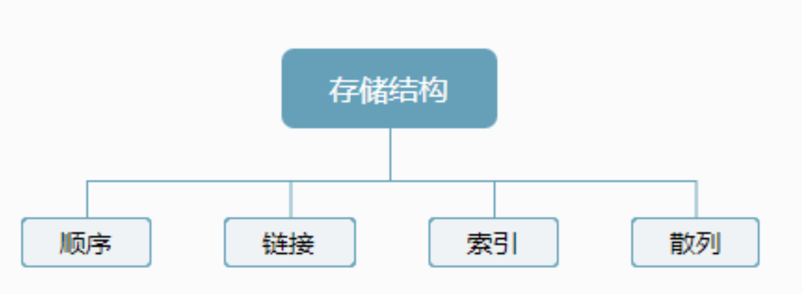
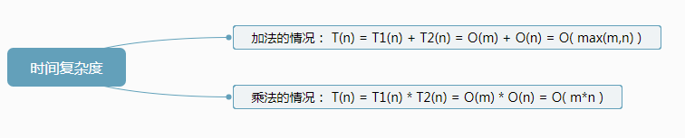

目录

- [日常生活中的算法](#日常生活中的算法)
- [算法是什么](#算法是什么)
    - [算法](#算法)
    - [数据结构](#数据结构)
    - [数据结构与算法的关系](#数据结构与算法的关系)
- [数据结构](#数据结构-1)
    - [逻辑结构](#逻辑结构)
    - [存储结构](#存储结构)
    - [时间复杂度](#时间复杂度)
    - [数组](#数组)
        - [顺序线性表 Array List](#顺序线性表-array-list)
    - [链表](#链表)
    - [树和图](#树和图)
    - [哈希表](#哈希表)
    - [大小跟堆和可并堆](#大小跟堆和可并堆)
    - [字符串](#字符串)

# 日常生活中的算法

1. 查字典：二分查找
2. 整理扑克：插入排序
3. 货币找零：贪心算法
4. ...

# 算法是什么

## 算法

算法（algorithm）是在有限时间内解决特定问题的一组指令或操作步骤，它具有以下特性：

1. 问题是明确的，包含清晰的输入和输出定义。
2. 具有可行性，能够在有限步骤、时间和内存空间下完成。
3. 各步骤都有确定的含义，在相同的输入和运行条件下，输出始终相同。

## 数据结构

数据结构（data structure）是计算机中组织和存储数据的方式，具有以下设计目标。

1. 空间占用尽量少，以节省计算机内存。
2. 数据操作尽可能快速，涵盖数据访问、添加、删除、更新等。
3. 提供简洁的数据表示和逻辑信息，以便算法高效运行。

数据结构设计是一个充满权衡的过程。如果想在某方面取得提升，往往需要在另一方面作出妥协。

* 链表相较于数组，在数据添加和删除操作上更加便捷，但牺牲了数据访问速度。
* 图相较于链表，提供了更丰富的逻辑信息，但需要占用更大的内存空间。

## 数据结构与算法的关系

数据结构与算法高度相关、紧密结合，具体表现在以下三个方面：

1. 数据结构是算法的基石。数据结构为算法提供了结构化存储的数据，以及操作数据的方法。
2. 算法是数据结构发挥作用的舞台。数据结构本身仅存储数据信息，结合算法才能解决特定问题。
3. 算法通常可以基于不同的数据结构实现，但执行效率可能相差很大，选择合适的数据结构是关键。

# 数据结构

数据结构的三要素：

* 逻辑结构
* 存储结构
* 运算

逻辑结构是独立于存储结构的，数据的存储结构是逻辑结构在计算机上的映射，不能独立于逻辑结构

## 逻辑结构

## 存储结构

## 时间复杂度

算法原地工作所需额外的辅助空间为一个常量，即 空间辅复杂度为 `$O(1)$`。
其实可以理解为只要这个辅助空间可以用一个确定的常数来表示，
与问题规模 `$n$` 无关，就算开辟 100 个空间在空间复杂度上也算作是 `$O(1)$`

求时间复杂度可以理解为求循环最深处一共执行循环的次数，记为 `$t$` 次循环。
最后解出 `$t$` 就为时间复杂度, 因为 `$t$` 是一共执行的次数，即时间复杂度

## 数组

### 顺序线性表 Array List

线性表是由同类型数据元素构成有序序列的线性结构，表中元素个数称为线性表的长度，
线性表中没有元素时，称为空表。表的其实位置称为表头，表结束位置称为表尾。

顺序线性表就是内存中连续存放的线性表，可以理解为它额存放地址是一个数组

## 链表

## 树和图

## 哈希表

散列表
HashTable Map  Dict

## 大小跟堆和可并堆

## 字符串

* 字典树
* 后缀树

