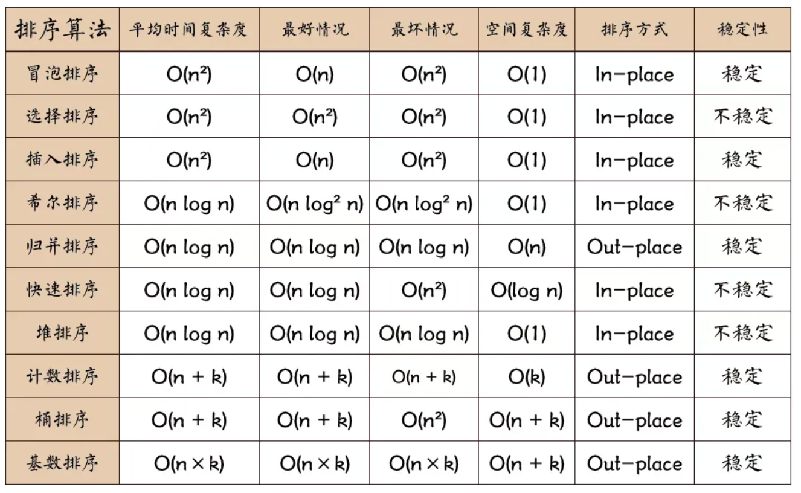

目录

- [排序算法概述](#排序算法概述)
    - [排序算法评价维度](#排序算法评价维度)
    - [理想排序算法](#理想排序算法)
- [选择排序](#选择排序)
- [冒泡排序](#冒泡排序)
- [插入排序](#插入排序)
- [快速排序](#快速排序)
- [归并排序](#归并排序)
- [堆排序](#堆排序)
- [桶排序](#桶排序)
- [计数排序](#计数排序)
- [基数排序](#基数排序)

# 排序算法概述

排序算法（sorting algorithm）用于对一组数据按照特定顺序进行排列。
排序算法有着广泛的应用，因为有序数据通常能够被更高效地查找、分析和处理。

如下图所示，排序算法中的数据类型可以是整数、浮点数、字符或字符串等。
排序的判断规则可根据需求设定，如数字大小、字符 ASCII 码顺序或自定义规则。

## 排序算法评价维度

* 运行效率：我们期望排序算法的时间复杂度尽量低，且总体操作数量较少（时间复杂度中的常数项变小）。
  对于大数据量的情况，运行效率显得尤为重要。
* 就地性：顾名思义，原地排序通过在原数组上直接操作实现排序，无须借助额外的辅助数组，
  从而节省内存。通常情况下，原地排序的数据搬运操作较少，运行速度也更快。
* 稳定性：稳定排序在完成排序后，相等元素在数组中的相对顺序不发生改变。
    - 稳定排序是多级排序场景的必要条件。假设我们有一个存储学生信息的表格，
      第 1 列和第 2 列分别是姓名和年龄。在这种情况下，
      非稳定排序可能导致输入数据的有序性丧失。
* 自适应性：自适应排序的时间复杂度会受输入数据的影响，
  即最佳时间复杂度、最差时间复杂度、平均时间复杂度并不完全相等。
    - 自适应性需要根据具体情况来评估。如果最差时间复杂度差于平均时间复杂度，
      说明排序算法在某些数据下性能可能劣化，因此被视为负面属性；
      而如果最佳时间复杂度优于平均时间复杂度，则被视为正面属性。
* 是否基于比较：基于比较的排序依赖比较运算符（`$<$`、`$=$`、`$>$`）来判断元素的相对顺序，
  从而排序整个数组，理论最优时间复杂度为 `$O(nlog n)$`。而非比较排序不使用比较运算符，
  时间复杂度可达 `$O(n)$`，但其通用性相对较差。

## 理想排序算法

运行快、原地、稳定、正向自适应、通用性好。
显然，迄今为止尚未发现兼具以上所有特性的排序算法。
因此，在选择排序算法时，需要根据具体的数据特点和问题需求来决定。

# 选择排序

# 冒泡排序

# 插入排序

# 快速排序

# 归并排序

# 堆排序

# 桶排序

# 计数排序

# 基数排序

