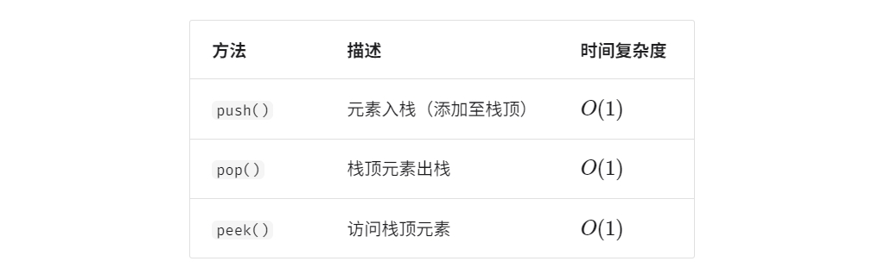
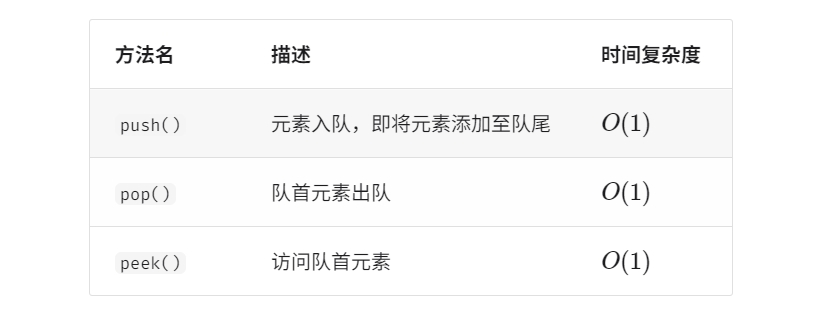
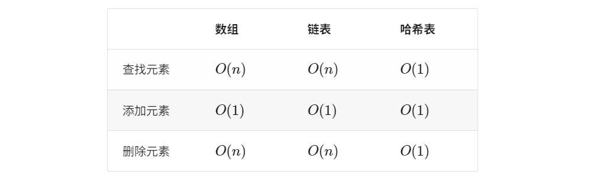

<style>
details {
    border: 1px solid #aaa;
    border-radius: 4px;
    padding: .5em .5em 0;
}
summary {
    font-weight: bold;
    margin: -.5em -.5em 0;
    padding: .5em;
}
details[open] {
    padding: .5em;
}
details[open] summary {
    border-bottom: 1px solid #aaa;
    margin-bottom: .5em;
}
img {
    pointer-events: none;
}
</style>

<details><summary>目录</summary><p>

- [数据结构分类](#数据结构分类)
    - [逻辑结构: 线性与非线性](#逻辑结构-线性与非线性)
    - [物理结构: 连续与分散](#物理结构-连续与分散)
- [基本数据类型](#基本数据类型)
- [数字编码](#数字编码)
- [字符编码](#字符编码)
- [数据结构-数组与链表](#数据结构-数组与链表)
    - [数组--array](#数组--array)
        - [数组常用操作](#数组常用操作)
            - [1 初始化数组](#1-初始化数组)
            - [2 访问元素](#2-访问元素)
            - [3 插入元素](#3-插入元素)
            - [4 删除元素](#4-删除元素)
            - [5 遍历数组](#5-遍历数组)
            - [6 查找元素](#6-查找元素)
            - [7 扩容数组](#7-扩容数组)
        - [数组的优点与局限性](#数组的优点与局限性)
        - [数组典型应用](#数组典型应用)
    - [链表-linked list](#链表-linked-list)
        - [链表常用操作](#链表常用操作)
            - [1 初始化链表](#1-初始化链表)
            - [2 插入节点](#2-插入节点)
            - [3 删除节点](#3-删除节点)
            - [4 访问节点](#4-访问节点)
            - [5 查找节点](#5-查找节点)
        - [数组 VS. 链表](#数组-vs-链表)
        - [常见链表类型](#常见链表类型)
        - [链表的典型应用](#链表的典型应用)
    - [列表--list](#列表--list)
        - [列表常用操作](#列表常用操作)
            - [1 初始化列表](#1-初始化列表)
            - [2 访问元素](#2-访问元素-1)
            - [3 插入与删除元素](#3-插入与删除元素)
            - [4 遍历列表](#4-遍历列表)
            - [5 拼接列表](#5-拼接列表)
            - [6 排序列表](#6-排序列表)
        - [列表实现](#列表实现)
    - [内存与缓存](#内存与缓存)
        - [计算机存储设备](#计算机存储设备)
        - [数据结构的内存效率](#数据结构的内存效率)
        - [数据结构的缓存效率](#数据结构的缓存效率)
- [数据结构-栈与队列](#数据结构-栈与队列)
    - [栈](#栈)
        - [栈的常用操作](#栈的常用操作)
        - [栈的实现](#栈的实现)
            - [基于链表的实现](#基于链表的实现)
            - [基于数组的实现](#基于数组的实现)
            - [两种实现对比](#两种实现对比)
        - [栈的典型应用](#栈的典型应用)
    - [队列](#队列)
        - [队列常用操作](#队列常用操作)
        - [队列实现](#队列实现)
            - [基于链表的实现](#基于链表的实现-1)
            - [基于数组的实现](#基于数组的实现-1)
        - [队列典型应用](#队列典型应用)
    - [双向队列](#双向队列)
- [数据结构-哈希表](#数据结构-哈希表)
    - [哈希表](#哈希表)
        - [哈希表常用操作](#哈希表常用操作)
            - [初始化哈希表](#初始化哈希表)
            - [添加操作](#添加操作)
            - [查询操作](#查询操作)
            - [删除操作](#删除操作)
            - [遍历方式](#遍历方式)
        - [哈希表简单实现](#哈希表简单实现)
        - [哈希冲突与扩容](#哈希冲突与扩容)
    - [哈希冲突](#哈希冲突)
    - [哈希算法](#哈希算法)
- [数据结构-树](#数据结构-树)
    - [二叉树](#二叉树)
    - [二叉树遍历](#二叉树遍历)
    - [二叉树数组表示](#二叉树数组表示)
    - [二叉搜索树](#二叉搜索树)
    - [AVL 树](#avl-树)
- [数据结构-堆](#数据结构-堆)
    - [堆](#堆)
    - [建堆操作](#建堆操作)
    - [Top-k 问题](#top-k-问题)
- [数据结构-图](#数据结构-图)
    - [图](#图)
    - [图基本操作](#图基本操作)
    - [图的遍历](#图的遍历)
- [图论简介](#图论简介)
- [图的表示](#图的表示)
- [图的遍历](#图的遍历-1)
    - [广度优先搜索](#广度优先搜索)
    - [深度优先搜索](#深度优先搜索)
- [最短路径算法](#最短路径算法)
    - [无权图](#无权图)
    - [有权图](#有权图)
        - [迪杰斯特拉算法 Dijkstra](#迪杰斯特拉算法-dijkstra)
        - [佛洛伊德算法 Floyd](#佛洛伊德算法-floyd)
- [最小生成树](#最小生成树)
- [网络流建模](#网络流建模)
</p></details><p></p>

# 数据结构分类

常见的数据结构包括：数组、链表、栈、队列、哈希表、树、堆、图，
它们可以从“逻辑结构”和“物理结构”两个维度进行分类。

## 逻辑结构: 线性与非线性

逻辑结构揭示了数据元素之间的逻辑关系：

* 在数组和链表中，数据按照一定顺序排列，体现了数据之间的线性关系；
* 在树中，数据从顶部向下按层次排列，表现出“祖先”与“后代”之间的派生关系；
* 图则由节点和边构成，反映了复杂的网络关系。

逻辑结构可分为 “线性” 和 “非线性” 两大类：线性结构比较直观，
指数据在逻辑关系上呈线性排列，元素之间是一对一的顺序关系；
非线性结构则相反，呈非线性排列，元素之间是一对多或多对多的关系。

* 线性数据结构：元素之间是一对一的顺序关系
    - 数组、链表、栈、队列、哈希表
* 非线性数据结构
    - 树形结构：元素之间是一对多的关系
        - 树、堆、哈希表
    - 网状结构：元素之间是多对多的关系 
        - 图


## 物理结构: 连续与分散

> 存储结构

当算法程序运行时，正在处理的数据主要存储在内存中。下图展示了一个计算机内存条，
其中每个黑色方块都包含一块内存空间。我们可以将内存想象成一个巨大的 Excel 表格，
其中每个单元格都可以存储一定大小的数据。系统通过内存地址来访问目标位置的数据。
计算机根据特定规则为表格中的每个单元格分配编号，确保每个内存空间都有唯一的内存地址。
有了这些地址，程序便可以访问内存中的数据。


内存是所有程序的共享资源，当某块内存被某个程序占用时，则无法被其他程序同时使用了。
因此在数据结构与算法的设计中，内存资源是一个重要的考虑因素。
比如，算法所占用的内存峰值不应超过系统剩余空闲内存；如果缺少连续大块的内存空间，
那么所选用的数据结构必须能够存储在分散的内存空间内。

如下图所示，物理结构反映了数据在计算机内存中的存储方式，
可分为连续空间存储（数组）和分散空间存储（链表）。
物理结构从底层决定了数据的访问、更新、增删等操作方法，
两种物理结构在时间效率和空间效率方面呈现出互补的特点。


值得说明的是，所有数据结构都是基于数组、链表或二者的组合实现的。
例如，栈和队列既可以使用数组实现，也可以使用链表实现；
而哈希表的实现可能同时包含数组和链表。

* 基于数组可实现：栈、队列、哈希表、树、堆、图、矩阵、张量（维度 `$\geq 3$` 的数组）等。
* 基于链表可实现：栈、队列、哈希表、树、堆、图等。

链表在初始化后，仍可以在程序运行过程中对其长度进行调整，因此也称“动态数据结构”。
数组在初始化后长度不可变，因此也称“静态数据结构”。值得注意的是，
数组可通过重新分配内存实现长度变化，从而具备一定的“动态性”。

# 基本数据类型 

当谈及计算机中的数据时，我们会想到文本、图片、视频、语音、3D 模型等各种形式。
尽管这些数据的组织形式各异，但它们都由各种基本数据类型构成。

基本数据类型是 CPU 可以直接进行运算的类型，在算法中直接被使用，主要包括以下几种：

* 整数类型
    - `byte`
    - `short`
    - `int`
    - `long`
* 浮点数类型：用于表示小数
    - `float`
    - `double`
* 字符类型：用于表示各种语言的字母、标点符号甚至表情符号等
    - `char`
* 布尔类型：用于表示“是”与“否”
    - `bool`

基本数据类型以二进制的形式存储在计算机中。一个二进制位即为 1 比特。在绝大多数现代操作系统中，
1 字节(byte)由 8 比特(bit)组成。

基本数据类型的取值范围取决于其占用的空间大小。下面以 Java 为例：

* 整数类型 `byte` 占用 1 字节 = 8 比特，可以表示 `$2^{8}$` 个数字
* 整数类型 `int` 占用 4 字节 = 32 比特，可以表示 `$2^{32}$` 个数字

# 数字编码


# 字符编码


# 数据结构-数组与链表

## 数组--array

数组（array）是一种线性数据结构，其将相同类型的元素存储在连续的内存空间中。
我们将元素在数组中的位置称为该元素的索引（index）。


### 数组常用操作

#### 1 初始化数组

可以根据需求选用数组的两种初始化方式：无初始值、给定初始值。
在未指定初始值的情况下，大多数编程语言会将数组元素初始化为 0。

```python
arr: list[int] = [0] *5
nums: list[int] = [1, 3, 2, 5, 4]
```

#### 2 访问元素

数组元素被存储在连续的内存空间中，这意味着计算数组元素的内存地址非常容易。
给定数组内存地址（首元素内存地址）和某个元素的索引，
我们可以使用下图所示的公式计算得到该元素的内存地址，从而直接访问该元素。


我们发现数组首个元素的索引为 0，这似乎有些反直觉，因为从 1 开始计数会更自然。
但从地址计算公式的角度看，索引本质上是内存地址的偏移量。首个元素的地址偏移量是 0，
因此它的索引为 0 是合理的。

```python
import random

def random_access(nums: list[int]) -> int:
    """
    随机访问元素
    """
    # 在区间 [0, len(num) - 1] 中随机抽取一个数字
    random_index = random.randint(0, len(nums) - 1)
    # 获取并返回随机元素
    random_num = nums[random_index]

    return random_num
```

#### 3 插入元素

数组元素在内存中是“紧挨着的”，它们之间没有空间再存放任何数据。
如下图所示，如果想在数组中间插入一个元素，则需要将该元素之后的所有元素都向后移动一位，
之后再把元素赋值给该索引。值得注意的是，由于数组的长度是固定的，
因此插入一个元素必定会导致数组尾部元素“丢失”。


```python
def insert(nums: list[int], num: int, index: int):
    """
    在数组的索引 index 处插入元素 num
    """
    # 把索引 index 以及之后的所有元素向后移动一位
    for i in range(len(nums) - 1, index, -1):
        nums[i] = nums[i - 1]
    # 将 num 赋给 index 处的元素
    nums[index] = num
```

#### 4 删除元素

若想删除索引 `$i$` 处的元素，则需要把索引 `$i$` 之后的元素都向前移动一位。
请注意，删除元素完成后，原先末尾的元素变得“无意义”了，所以我们无须特意去修改它。


```python
def remove(nums: list[int], index: int):
    """
    删除索引 index 处的元素
    """
    for i in range(index, len(nums) - 1):
        nums[i] = nums[i +1]
```

总的来看，数组的插入与删除操作有以下缺点。

* 时间复杂度高：数组的插入和删除的平均时间复杂度均为 `$O(n)$`，其中 `$n$` 为数组长度。
* 丢失元素：由于数组的长度不可变，因此在插入元素后，超出数组长度范围的元素会丢失。
* 内存浪费：我们可以初始化一个比较长的数组，只用前面一部分，这样在插入数据时，
  丢失的末尾元素都是“无意义”的，但这样做会造成部分内存空间浪费。

#### 5 遍历数组

在大多数编程语言中，我们既可以通过索引遍历数组，也可以直接遍历获取数组中的每个元素：

```python
def traverse(nums: list[int]):
    """
    遍历数组
    """
    count = 0
    # 通过索引遍历数组
    for i in range(len(nums)):
        count += nums[i]
    # 直接遍历数组元素
    for num in nums:
        count += num
    # 同时遍历数组索引和元素
    for i, num in enumerate(nums):
        count += num[i]
        count += num
```

#### 6 查找元素

在数组中查找指定元素需要遍历数组，每轮判断元素值是否匹配，若匹配则输出对应索引。
因为数组是线性数据结构，所以上述查找操作被称为“线性查找”。

```python
def find(nums: list[int], target: int) -> int:
    """
    在数组中查找指定元素
    """
    for i in range(len(nums)):
        if num[i] == target:
            return i
    return -1
```

#### 7 扩容数组

在复杂的系统环境中，程序难以保证数组之后的内存空间是可用的，从而无法安全地扩展数组容量。
因此在大多数编程语言中，数组的长度是不可变的。

如果我们希望扩容数组，则需重新建立一个更大的数组，然后把原数组元素依次复制到新数组。
这是一个 `$O(n)$` 的操作，在数组很大的情况下非常耗时。

```python
def extend(nums: list[int], enlarge: int) -> list[int]:
    """
    扩展数组长度
    """
    # 初始化一个扩展长度后的数组
    res = [0] * (len(nums) + enlarge)
    # 将原数组中的所有元素复制到新数组
    for i in range(len(nums)):
        res[i] = nums[i]
    # 返回扩展后的新数组
    return res
```

### 数组的优点与局限性

数组存储在连续的内存空间内，且元素类型相同。这种做法包含丰富的先验信息，
系统可以利用这些信息来优化数据结构的操作效率：

* 空间效率高：数组为数据分配了连续的内存块，无须额外的结构开销。
* 支持随机访问：数组允许在 `$O(1)$` 时间内访问任何元素。
* 缓存局部性：当访问数组元素时，计算机不仅会加载它，还会缓存其周围的其他数据，
  从而借助高速缓存来提升后续操作的执行速度。

连续空间存储是一把双刃剑，其存在以下局限性。

* 插入与删除效率低：当数组中元素较多时，插入与删除操作需要移动大量的元素。
* 长度不可变：数组在初始化后长度就固定了，扩容数组需要将所有数据复制到新数组，开销很大。
* 空间浪费：如果数组分配的大小超过实际所需，那么多余的空间就被浪费了。


### 数组典型应用

数组是一种基础且常见的数据结构，既频繁应用在各类算法之中，也可用于实现各种复杂数据结构：

* 随机访问：如果我们想随机抽取一些样本，那么可以用数组存储，并生成一个随机序列，根据索引实现随机抽样。
* 排序和搜索：数组是排序和搜索算法最常用的数据结构。快速排序、归并排序、二分查找等都主要在数组上进行。
* 查找表：当需要快速查找一个元素或其对应关系时，可以使用数组作为查找表。
  假如我们想实现字符到 ASCII 码的映射，则可以将字符的 ASCII 码值作为索引，
  对应的元素存放在数组中的对应位置。
* 机器学习：神经网络中大量使用了向量、矩阵、张量之间的线性代数运算，
  这些数据都是以数组的形式构建的。数组是神经网络编程中最常使用的数据结构。
* 数据结构实现：数组可以用于实现栈、队列、哈希表、堆、图等数据结构。
  例如，图的邻接矩阵表示实际上是一个二维数组。

## 链表-linked list

内存空间是所有程序的公共资源，在一个复杂的系统运行环境下，空闲的内存空间可能散落在内存各处。
我们知道，存储数组的内存空间必须是连续的，而当数组非常大时，内存可能无法提供如此大的连续空间。
此时链表的灵活性优势就体现出来了。

链表（linked list）是一种线性数据结构，其中的每个元素都是一个节点对象，各个节点通过“引用”相连接。
引用记录了下一个节点的内存地址，通过它可以从当前节点访问到下一个节点。
链表的设计使得各个节点可以分散存储在内存各处，它们的内存地址无须连续。


链表的组成单位是<span style='border-bottom:1.5px dashed red;'>节点（node）对象</span>。
每个节点都包含两项数据：<span style='border-bottom:1.5px dashed red;'>节点的“值”</span>和<span style='border-bottom:1.5px dashed red;'>指向下一节点的“引用”</span>。

* 链表的首个节点被称为 “头节点”，最后一个节点被称为 “尾节点”。
* 尾节点指向的是 “空”，它在 Java、C++ 和 Python 中分别被记为 `null`、`nullptr` 和 `None`。
* 在 C、C++、Go 和 Rust 等支持指针的语言中，上述 “引用” 应被替换为 “指针”。

在下面的链表节点 `ListNode` 除了包含值，还需额外保存一个引用（指针）。
因此在相同数据量下，链表比数组占用更多的内存空间。

```python
class ListNode:
    """
    链表节点类
    """
    def __init__(self, val: int):
        self.val: int = val  # 节点值
        self.next: ListNode | None = None
```

### 链表常用操作

#### 1 初始化链表

建立链表分为两步，第一步是初始化各个节点对象，第二步是构建节点之间的引用关系。
初始化完成后，我们就可以从链表的头节点出发，通过引用指向 `next` 依次访问所有节点。

```python
# 初始化链表 1 -> 3 -> 2 -> 5 -> 4

# 初始化各个节点
n0 = ListNode(1)
n1 = ListNode(3)
n2 = ListNode(2)
n3 = ListNode(5)
n4 = ListNode(4)

# 构建
n0.next = n1
n1.next = n2
n2.next = n3
n3.next = n4
```

数组整体是一个变量，比如数组 `nums` 包含元素 `nums[0]` 和 `nums[1]` 等，
而链表是由多个独立的节点对象组成的。我们通常将头节点当作链表的代称，
比如以上代码中的链表可记作链表 `n0`。

#### 2 插入节点

在链表中插入节点非常容易。假设我们想在相邻的两个节点 `n0` 和 `n1` 之间插入一个新节点 `P`，
则只需改变两个节点引用（指针）即可，时间复杂度为 `$O(1)$`。

相比之下，在数组中插入元素的时间复杂度为 `$O(n)$`，在大数据量下的效率较低。


```python
def insert(n0:ListNode, P: ListNode):
    """
    在链表的节点 n0 之后插入节点 P
    """
    n1 = n0.next
    P.next = n1
    n0.next = P
```

#### 3 删除节点

在链表中删除节点也非常方便，只需改变一个节点的引用（指针）即可。


```python
def remove(n0: ListNode):
    """
    删除链表的节点 n0 之后的首个节点
    """
    if not n0.next:
        return
    # n0 -> P -> n1
    P = n0.next
    n1 = P.next
    n0.next = n1
```

#### 4 访问节点

在链表中访问节点的效率较低。我们可以在 `$O(1)$` 时间下访问数组中的任意元素。
链表则不然，程序需要从头节点出发，逐个向后遍历，直至找到目标节点。
也就是说，访问链表的第 `$i$` 个节点需要循环 `$i-1$` 轮，时间复杂度为 `$O(n)$`。

```python
def access(head: ListNode, index: int) -> ListNode | None:
    """
    访问链表中索引为 index 的节点
    """
    for _ in range(index):
        if not head:
            return None
        head = head.next
    
    return head
```

#### 5 查找节点

遍历链表，查找其中值为 `target` 的节点，输出该节点在链表中的索引。此过程也属于线性查找。

```python
def find(head: ListNode, target: int) -> int:
    """
    在链表中查找值为 target 的首个节点
    """
    index = 0
    while head:
        if head.val == target:
            return index
        head = head.next
        index += 1
    return -1
```

### 数组 VS. 链表

总结了数组和链表的各项特点并对比了操作效率。由于它们采用两种相反的存储策略，
因此各种性质和操作效率也呈现对立的特点。

|         | 数组                        | 链表           |
|---------|-----------------------------|---------------|
| 存储方式 | 连续内存空间                 |  分散内存空间  |
| 容量扩展 | 长度不可变                   | 可灵活扩展     |
| 内存效率 | 元素占用内存少、但可能浪费空间 | 元素占用内存多 |
| 访问元素 | `$O(1)$`                    | `$O(n)$`      |
| 添加元素 | `$O(n)$`                    | `$O(1)$`      |
| 删除元素 | `$O(n)$`                    | `$O(1)$`      |

### 常见链表类型

常见的链表类型包括三种：

* 单向链表：即前面介绍的普通链表。单向链表的节点包含值和指向下一节点的引用两项数据。
  我们将首个节点称为头节点，将最后一个节点称为尾节点，尾节点指向空 `None`。
* 环形链表：如果我们令单向链表的尾节点指向头节点（首尾相接），则得到一个环形链表。
  在环形链表中，任意节点都可以视作头节点。
* 双向链表：与单向链表相比，双向链表记录了两个方向的引用。
  双向链表的节点定义同时包含指向后继节点（下一个节点）和前驱节点（上一个节点）的引用（指针）。
  相较于单向链表，双向链表更具灵活性，可以朝两个方向遍历链表，但相应地也需要占用更多的内存空间。


### 链表的典型应用

单向链表通常用于实现栈、队列、哈希表和图等数据结构：

* 栈与队列：当插入和删除操作都在链表的一端进行时，它表现出先进后出的特性，对应栈；
  当插入操作在链表的一端进行，删除操作在链表的另一端进行，它表现出先进先出的特性，对应队列。
* 哈希表：链式地址是解决哈希冲突的主流方案之一，在该方案中，所有冲突的元素都会被放到一个链表中。
* 图：邻接表是表示图的一种常用方式，其中图的每个顶点都与一个链表相关联，
  链表中的每个元素都代表与该顶点相连的其他顶点。

双向链表常用于需要快速查找前一个和后一个元素的场景：

* 高级数据结构：比如在红黑树、B 树中，我们需要访问节点的父节点，
  这可以通过在节点中保存一个指向父节点的引用来实现，类似于双向链表。
* 浏览器历史：在网页浏览器中，当用户点击前进或后退按钮时，
  浏览器需要知道用户访问过的前一个和后一个网页。双向链表的特性使得这种操作变得简单。
* LRU 算法：在缓存淘汰（LRU）算法中，我们需要快速找到最近最少使用的数据，
  以及支持快速添加和删除节点。这时候使用双向链表就非常合适。

环形链表常用于需要周期性操作的场景，比如操作系统的资源调度。

* 时间片轮转调度算法：在操作系统中，时间片轮转调度算法是一种常见的 CPU 调度算法，
  它需要对一组进程进行循环。每个进程被赋予一个时间片，当时间片用完时，CPU 将切换到下一个进程。
  这种循环操作可以通过环形链表来实现。
* 数据缓冲区：在某些数据缓冲区的实现中，也可能会使用环形链表。比如在音频、视频播放器中，
  数据流可能会被分成多个缓冲块并放入一个环形链表，以便实现无缝播放。

## 列表--list

列表（list）是一个抽象的数据结构概念，它表示元素的有序集合，
支持元素访问、修改、添加、删除和遍历等操作，无须使用者考虑容量限制的问题。
列表可以基于链表或数组实现。

* 链表天然可以看作一个列表，其支持元素增删查改操作，并且可以灵活动态扩容。
* 数组也支持元素增删查改，但由于其长度不可变，因此只能看作一个具有长度限制的列表。
    - 当使用数组实现列表时，长度不可变的性质会导致列表的实用性降低。
      这是因为我们通常无法事先确定需要存储多少数据，从而难以选择合适的列表长度。
      若长度过小，则很可能无法满足使用需求；若长度过大，则会造成内存空间浪费。

为解决此问题，我们可以使用<span style='border-bottom:1.5px dashed red;'>动态数组（dynamic array）</span>来实现列表。
它继承了数组的各项优点，并且可以在程序运行过程中进行动态扩容。

实际上，许多编程语言中的标准库提供的列表是基于动态数组实现的，
例如 Python 中的 list 、Java 中的 ArrayList 、C++ 中的 vector 和 C# 中的 List 等。
在接下来的讨论中，我们将把 “列表” 和 “动态数组” 视为等同的概念。

### 列表常用操作

#### 1 初始化列表

通常使用 “无初始值” 和 “有初始值” 这两种初始方法：

```python
# 初始化列表

# 无初始值
nums: list[int] = []

# 有初始值
nums: list[int] = [1, 3, 2, 5, 4]
```

#### 2 访问元素

列表本质上是数组，因此可以在 `$O(1)$` 时间内访问和更新元素，效率很高。

```python
# 访问元素
num: int = nums[1]  # 访问索引 1 处的元素

# 更新元素
nums[1] = 0  # 将索引 1 处的元素更新为 0
```

#### 3 插入与删除元素

相较于数组，列表可以自由地添加与删除元素。在列表尾部添加元素的时间复杂度为 `$O(1)$`，
但插入和删除元素的效率仍与数组相同，时间复杂度为 `$O(n)$`。

```python
# 清空列表
nums.clear()

# 在尾部添加元素
nums.append(1)
nums.append(3)
nums.append(2)
nums.append(5)
nums.append(4)

# 在中间插入元素
nums.insert(3, 6)  # 在索引 3 处插入数字 6

# 删除元素
nums.pop(3)  # 删除索引 3 处的元素
```

#### 4 遍历列表

与数组一样，列表可以根据索引遍历，也可以直接遍历各元素。

```python
# 通过索引遍历列表
count = 0
for i in range(len(nums)):
    count += nums[i]

# 直接遍历列表元素
for num in nums:
    count += num
```

#### 5 拼接列表

给定一个新列表 `nums1`，可以将其拼接到原列表的尾部。

```python
# 拼接两个列表
nums1: list[int] = [6, 8, 7, 10, 9]
nums += nums1  # 将列表 nums1 拼接到 nums 之后
```

#### 6 排序列表

完成列表的排序后，我们便可以使用在数组类算法题中经常考查的 “二分查找” 和 “双指针” 算法。

```python
# 排序列表
nums.sort()  # 排序后，列表元素从小到大排列
```

### 列表实现

许多编程语言内置了列表，例如 Java、C++、Python 等。它们的实现比较复杂，
各个参数的设定也非常考究，例如初始容量、扩容倍数等。

为了加深对列表工作原理的理解，我们尝试实现一个简易版列表，包括以下三个重点设计：

* 初始容量：选取一个合理的数组初始容量。在本示例中，我们选择 `10` 作为初始容量。
* 数量记录：声明一个变量 `size` ，用于记录列表当前元素数量，并随着元素插入和删除实时更新。
  根据此变量，我们可以定位列表尾部，以及判断是否需要扩容。
* 扩容机制：若插入元素时列表容量已满，则需要进行扩容。先根据扩容倍数创建一个更大的数组，
  再将当前数组的所有元素依次移动至新数组。在本示例中，我们规定每次将数组扩容至之前的 2 倍。

```python
class MyList:
    """
    列表类
    """

    def __init__(self):
        """
        构造方法
        """
        self._capacity: int = 10  # 列表容量
        self._arr: list[int] = [0] * self._capacity  # 数组（存储列表元素）
        self._size: int = 0  # 列表长度（当前元素数量）
        self._extend_ratio: int = 2  # 每次列表扩容倍数
    
    def size(self) -> int:
        """
        获取列表长度（当前元素数量）
        """
        return self._size
    
    def capacity(self) -> int:
        """
        获取列表容量
        """
        return self._capacity
    
    def get(self, index: int) -> int:
        """
        访问元素
        """
        # 索引如果越界，则抛出异常，下同
        if index < 0 or index > self._size:
            raise IndexError("索引越界")
        return self._arr[index]

    def set(self, num: int, index: int):
        """
        更新元素
        """
        if index < 0 or index >= self._size:
            raise IndexError("索引越界")
```

## 内存与缓存

物理结构在很大程度上决定了程序对内存和缓存的使用效率，进而影响算法程序的整体性能。

### 计算机存储设备

计算机中包括三种类型的存储设备：

* 硬盘（hard disk）
* 内存（random-access memory, RAM）
* 缓存（cache memory）

下表展示了它们在计算机系统中的不同角色和性能特点。


我们可以将计算机存储系统想象为下图所示的金字塔结构。
越靠近金字塔顶端的存储设备的速度越快、容量越小、成本越高。
这种多层级的设计并非偶然，而是计算机科学家和工程师们经过深思熟虑的结果。


* 硬盘难以被内存取代。
    - 首先，内存中的数据在断电后会丢失，因此它不适合长期存储数据；
    - 其次，内存的成本是硬盘的几十倍，这使得它难以在消费者市场普及。
* 缓存的大容量和高速度难以兼得。
    - 随着 L1、L2、L3 缓存的容量逐步增大，其物理尺寸会变大，
      与 CPU 核心之间的物理距离会变远，从而导致数据传输时间增加，元素访问延迟变高。
      在当前技术下，多层级的缓存结构是容量、速度和成本之间的最佳平衡点。

总的来说，硬盘用于长期存储大量数据，内存用于临时存储程序运行中正在处理的数据，
而缓存则用于存储经常访问的数据和指令，以提高程序运行效率。
三者共同协作，确保计算机系统高效运行。

如下图所示，在程序运行时，数据会从硬盘中被读取到内存中，供 CPU 计算使用。
缓存可以看作 CPU 的一部分，它通过智能地从内存加载数据，给 CPU 提供高速的数据读取，
从而显著提升程序的执行效率，减少对较慢的内存的依赖。


### 数据结构的内存效率

在内存空间利用方面，数组和链表各自具有优势和局限性：

* 一方面，内存是有限的，且同一块内存不能被多个程序共享，因此我们希望数据结构能够尽可能高效地利用空间。
  数组的元素紧密排列，不需要额外的空间来存储链表节点间的引用（指针），因此空间效率更高。
  然而，数组需要一次性分配足够的连续内存空间，这可能导致内存浪费，数组扩容也需要额外的时间和空间成本。
  相比之下，链表以“节点”为单位进行动态内存分配和回收，提供了更大的灵活性。
* 另一方面，在程序运行时，随着反复申请与释放内存，空闲内存的碎片化程度会越来越高，从而导致内存的利用效率降低。
  数组由于其连续的存储方式，相对不容易导致内存碎片化。相反，链表的元素是分散存储的，
  在频繁的插入与删除操作中，更容易导致内存碎片化。

### 数据结构的缓存效率

缓存虽然在空间容量上远小于内存，但它比内存快得多，在程序执行速度上起着至关重要的作用。
由于缓存的容量有限，只能存储一小部分频繁访问的数据，因此当 CPU 尝试访问的数据不在缓存中时，
就会发生<span style='border-bottom:1.5px dashed red;'>缓存未命中（cache miss）</span>，
此时 CPU 不得不从速度较慢的内存中加载所需数据。
显然，“缓存未命中” 越少，CPU 读写数据的效率就越高，程序性能也就越好。
我们将 CPU 从缓存中成功获取数据的比例称为<span style='border-bottom:1.5px dashed red;'>缓存命中率（cache hit rate）</span>，这个指标通常用来衡量缓存效率。

为了尽可能达到更高的效率，缓存会采取以下 <span style='border-bottom:1.5px dashed red;'>数据加载机制</span>：

* 缓存行：缓存不是单个字节地存储与加载数据，而是以缓存行为单位。
  相比于单个字节的传输，缓存行的传输形式更加高效。
* 预取机制：处理器会尝试预测数据访问模式（例如顺序访问、固定步长跳跃访问等），
  并根据特定模式将数据加载至缓存之中，从而提升命中率。
* 空间局部性：如果一个数据被访问，那么它附近的数据可能近期也会被访问。
  因此，缓存在加载某一数据时，也会加载其附近的数据，以提高命中率。
* 时间局部性：如果一个数据被访问，那么它在不久的将来很可能再次被访问。
  缓存利用这一原理，通过保留最近访问过的数据来提高命中率。

实际上，<span style='border-bottom:1.5px dashed red;'>数组</span>和<span style='border-bottom:1.5px dashed red;'>链表</span>对缓存的利用效率是不同的，主要体现在以下几个方面：

* 占用空间：链表元素比数组元素占用空间更多，导致缓存中容纳的有效数据量更少。
* 缓存行：链表数据分散在内存各处，而缓存是“按行加载”的，因此加载到无效数据的比例更高。
* 预取机制：数组比链表的数据访问模式更具“可预测性”，即系统更容易猜出即将被加载的数据。
* 空间局部性：数组被存储在集中的内存空间中，因此被加载数据附近的数据更有可能即将被访问。

总体而言，<span style='border-bottom:1.5px dashed red;'>数组具有更高的缓存命中率，
因此它在操作效率上通常优于链表。这使得在解决算法问题时，
基于数组实现的数据结构往往更受欢迎。</span>

需要注意的是，<span style='border-bottom:1.5px dashed red;'>高缓存效率并不意味着数组在所有情况下都优于链表。</span>
实际应用中选择哪种数据结构，应根据具体需求来决定。
例如，数组和链表都可以实现 “栈” 数据结构，但它们适用于不同场景。

* 在做算法题时，我们会倾向于选择基于数组实现的栈，
  因为它提供了更高的操作效率和随机访问的能力，代价仅是需要预先为数组分配一定的内存空间。
* 如果数据量非常大、动态性很高、栈的预期大小难以估计，那么基于链表实现的栈更加合适。
  链表能够将大量数据分散存储于内存的不同部分，并且避免了数组扩容产生的额外开销。

# 数据结构-栈与队列


## 栈

栈（stack）是一种遵循<span style='border-bottom:1.5px dashed red;'>先入后出</span>逻辑的<span style='border-bottom:1.5px dashed red;'>线性</span>数据结构。

可以将栈类比为桌面上的一摞盘子，如果想取出底部的盘子，则需要先将上面的盘子依次移走。
将盘子替换为各种类型的元素（如整数、字符、对象等），就得到了栈这种数据结构。
把堆叠元素的顶部称为 “栈顶”，底部称为 “栈底”。
将把元素添加到栈顶的操作叫作“入栈”，删除栈顶元素的操作叫作“出栈”。


### 栈的常用操作

栈的常用操作如下表所示，具体的方法名需要根据所使用的编程语言来确定。
在此，我们以常见的 `push()`、`pop()`、`peek()` 命名为例。



通常情况下，我们可以直接使用编程语言内置的栈类。然而，某些语言可能没有专门提供栈类，
这时我们可以将该语言的“数组”或“链表”当作栈来使用，并在程序逻辑上忽略与栈无关的操作。

```python
# Python 没有内置的栈类，可以把 list 当作栈来使用

# 初始化栈
stack: list[int] = []

# 元素入栈
stack.append(1)
stack.append(3)
stack.append(2)
stack.append(5)
stack.append(4)

# 访问栈顶元素
peek: int = stack[-1]

# 元素出栈
pop: int = stack.pop()

# 获取栈的长度
size: int = len(stack)

# 判断是否为空
is_empty: bool = len(stack) == 0
```

### 栈的实现

为了深入了解栈的运行机制，我们来尝试自己实现一个栈类。

栈遵循先入后出的原则，因此我们只能在栈顶添加或删除元素。
然而，数组和链表都可以在任意位置添加和删除元素，因此栈可以视为一种受限制的数组或链表。
换句话说，我们可以“屏蔽”数组或链表的部分无关操作，使其对外表现的逻辑符合栈的特性。

#### 基于链表的实现

使用链表实现栈时，我们可以将链表的头节点视为栈顶，尾节点视为栈底。
对于入栈操作，我们只需将元素插入链表头部，这种节点插入方法被称为 “头插法”。
而对于出栈操作，只需将头节点从链表中删除即可。


```python
class ListNode:
    """
    链表节点类
    """
    def __init__(self, val: int):
        self.val: int = val  # 节点值
        self.next: ListNode | None = None


class LinkedListStack:
    """
    基于链表实现的栈
    """

    def __init__(self):
        """
        构造方法
        """
        self._peek: ListNode | None = None
        self._size: int = 0
    
    def size(self) -> int:
        """
        获取栈的长度
        """
        return self._size
    
    def is_empty(self) -> bool:
        """
        判断栈是否为空
        """
        return not self._peek
    
    def push(self, val: int):
        """
        入栈
        """
        node = ListNode(val)
        node.next = self._peek
        self._peek = node
        self._size += 1
    
    def pop(self) -> int:
        """
        出栈
        """
        num = self.peek()
        self._peek = self._peek.next
        self._size -= 1
        return num
    
    def peek(self) -> int:
        """
        访问栈顶元素
        """
        if self.is_empty():
            raise IndexError("栈为空")
        return self._peek.val
    
    def to_list(self) -> list[int]:
        """
        转化为列表用于打印
        """
        arr = []
        node = self._peek
        while node:
            arr.append(node.val)
            node = node.next
        arr.reverse()
        return arr
```

#### 基于数组的实现

使用数组实现栈时，我们可以将数组的尾部作为栈顶。
入栈与出栈操作分别对应在数组尾部添加元素与删除元素，时间复杂度都为 `$O(1)$`。


```python
class ArrayStack:
    """
    基于数组实现的栈
    """

    def __init__(self):
        """
        构造方法
        """
        self._stack: list[int] = []
    
    def size(self) -> int:
        """
        获取栈的长度
        """
        return len(self._stack)
    
    def is_empty(self) -> bool:
        """
        判断栈是否为空
        """
        return self._stack == []
    
    def push(self, item: int):
        """
        入栈
        """
        self._stack.append(item)
    
    def pop(self) -> int:
        """
        出栈
        """
        if self.is_empty():
            raise IndexError("栈为空")
        return self._stack.pop()
    
    def peek(self) -> int:
        """
        访问栈顶元素
        """
        if self.is_empty():
            raise IndexError("栈为空")
        return self._stack[-1]
    
    def to_list(self) -> list[int]:
        """
        返回列表用于打印
        """
        return self._stack
```

#### 两种实现对比

* 支持操作
    - 两种实现都支持栈定义中的各项操作。数组实现额外支持随机访问，
      但这已超出了栈的定义范畴，因此一般不会用到。
* 时间效率
    - 在基于数组的实现中，入栈和出栈操作都在预先分配好的连续内存中进行，
      具有很好的缓存本地性，因此效率较高。然而，如果入栈时超出数组容量，
      会触发扩容机制，导致该次入栈操作的时间复杂度变为 `$O(n)$`。
    - 在基于链表的实现中，链表的扩容非常灵活，不存在上述数组扩容时效率降低的问题。
      但是，入栈操作需要初始化节点对象并修改指针，因此效率相对较低。
      不过，如果入栈元素本身就是节点对象，那么可以省去初始化步骤，从而提高效率。
    - 综上所述，当入栈与出栈操作的元素是基本数据类型时，例如 `int` 或 `double`，我们可以得出以下结论：
        - 基于数组实现的栈在触发扩容时效率会降低，但由于扩容是低频操作，因此平均效率更高。
        - 基于链表实现的栈可以提供更加稳定的效率表现。
* 空间效率
    - 在初始化列表时，系统会为列表分配“初始容量”，该容量可能超出实际需求；
      并且，扩容机制通常是按照特定倍率（例如 2 倍）进行扩容的，扩容后的容量也可能超出实际需求。
      因此，基于数组实现的栈可能造成一定的空间浪费。
    - 然而，由于链表节点需要额外存储指针，因此链表节点占用的空间相对较大。

综上，我们不能简单地确定哪种实现更加节省内存，需要针对具体情况进行分析。

### 栈的典型应用

* 浏览器中的后退与前进、软件中的撤销与反撤销。
    - 每当我们打开新的网页，浏览器就会对上一个网页执行入栈，这样我们就可以通过后退操作回到上一个网页。
      后退操作实际上是在执行出栈。如果要同时支持后退和前进，那么需要两个栈来配合实现。
* 程序内存管理。
    - 每次调用函数时，系统都会在栈顶添加一个栈帧，用于记录函数的上下文信息。
      在递归函数中，向下递推阶段会不断执行入栈操作，而向上回溯阶段则会不断执行出栈操作。

## 队列

队列（queue）是一种遵循先入先出规则的线性数据结构。顾名思义，队列模拟了排队现象，
即新来的人不断加入队列尾部，而位于队列头部的人逐个离开。
我们将队列头部称为 “队首”，尾部称为 “队尾”，将把元素加入队尾的操作称为 “入队”，
删除队首元素的操作称为 “出队”。


### 队列常用操作

队列的常见操作如下表所示。需要注意的是，不同编程语言的方法名称可能会有所不同。
我们在此采用与栈相同的方法命名。



```python
from collections import deque

# 初始化队列
# 在 Python 中，一般将双向队列类 deque 当作队列使用，
# 虽热 queue.Queue() 是纯正的队列类，但不太好用，因此不推荐
que: deque[int] = deque()

# 元素入队
que.append(1)
que.append(3)
que.append(2)
que.append(5)
que.append(4)

# 访问队首元素
front: int = que[0]

# 元素出队
pop: int = que.popleft()

# 获取队列的长度
size: int = len(que)

# 判断队列是否为空
is_empty: bool = len(que) == 0
```

### 队列实现

为了实现队列，我们需要一种数据结构，可以在一端添加元素，并在另一端删除元素，链表和数组都符合要求。

#### 基于链表的实现

可以将链表的“头节点”和“尾节点”分别视为“队首”和“队尾”，规定队尾仅可添加节点，队首仅可删除节点。


```python
class LinkedListQueue:
    """
    基于链表实现的队列
    """

    def __init__(self):
        """
        构造方法
        """
        self._front: ListNode | None = None  # 头节点 front
        self._rear: ListNode | Node = None  # 尾节点 rear
        self._size: int = 0
    
    def size(self) -> int:
        """
        获取队列的长度
        """
        return self._size
    
    def is_empty(self) -> bool:
        """
        判断队列是否为空
        """
        return not self._front
    
    def push(self, num: int):
        """
        入队
        """
        # 在尾节点后添加 num
        node = ListNode(num)
        # 如果队列为空，则令头、尾节点都指向该节点
        if self._front is None:
            self._front = node
            self._rear = node
        # 如果队列不为空，则将该节点添加到尾节点后
        else:
            self._rear.next = node
            self._rear = node
        self._size += 1
    
    def pop(self) -> int:
        """
        出队
        """
        num = self.peek()
        # 删除头节点
        self._front = self._front.next
        self._size -= 1
        return num

    def peek(self) -> int:
        """
        访问队首元素
        """
        if self.is_empty():
            raise IndexError("队列为空")
        return self._front.val

    def to_list(self) -> list[int]:
        """
        转化为列表用于打印
        """
        queue = []
        temp = self._front
        while temp:
            queue.append(temp.val)
            temp = temp.next
        return queue
```

#### 基于数组的实现

在数组中删除首元素的时间复杂度为 `$O(n)$`，这会导致出队操作效率较低。
然而，我们可以采用以下巧妙方法来避免这个问题。

我们可以使用一个变量 `front` 指向队首元素的索引，并维护一个变量 `size` 用于记录队列长度。
定义 `rear = front + size` ，这个公式计算出的 `rear` 指向队尾元素之后的下一个位置。
基于此设计，数组中包含元素的有效区间为 [front, rear - 1]，各种操作的实现方法如下图所示。

* 入队操作：将输入元素赋值给 rear 索引处，并将 size 增加 1 。
* 出队操作：只需将 front 增加 1 ，并将 size 减少 1 。

可以看到，入队和出队操作都只需进行一次操作，时间复杂度均为 `$O(1)$`。


```python

```

### 队列典型应用

* 淘宝订单。购物者下单后，订单将加入队列中，系统随后会根据顺序处理队列中的订单。
  在双十一期间，短时间内会产生海量订单，高并发成为工程师们需要重点攻克的问题。
* 各类待办事项。任何需要实现“先来后到”功能的场景，例如打印机的任务队列、餐厅的出餐队列等，
  队列在这些场景中可以有效地维护处理顺序。

## 双向队列


# 数据结构-哈希表

## 哈希表

哈希表（hash table），又称散列表，它通过建立键 `key` 与值 `value` 之间的映射，实现高效的元素查询。
具体而言，我们向哈希表中输入一个键 `key`，则可以在 `$O(1)$` 时间内获取对应的值 `value`。


除哈希表外，数组和链表也可以实现查询功能，它们的效率对比如下表所示：

* 添加元素：仅需将元素添加至数组（链表）的尾部即可，使用 `$O(1)$` 时间。
* 查询元素：由于数组（链表）是乱序的，因此需要遍历其中的所有元素，使用 `$O(n)$` 时间。
* 删除元素：需要先查询到元素，再从数组（链表）中删除，使用 `$O(n)$` 时间。



在哈希表中进行增删查改的时间复杂度都是 `$O(1)$`，非常高效。

### 哈希表常用操作

哈希表的常见操作包括：初始化、查询操作、添加键值对和删除键值对等。

#### 初始化哈希表

```python 
hmap: dict = {}
```

#### 添加操作

```python 
# 在哈希表中添加键值对 (key, value)
hmap[12836] = "小哈"
hmap[15937] = "小啰"
hmap[16750] = "小算"
hmap[13276] = "小法"
hmap[10583] = "小鸭"
```

#### 查询操作

```python
# 向哈希表中输入键 key，得到值 value
name: str = hmap[15937]
```

#### 删除操作

```python 
# 在哈希表中删除键值对 (key, value)
hmap.pop(10583)
```

#### 遍历方式

哈希表有三种常用的遍历方式：遍历键值对、遍历键和遍历值

```python
# 遍历键值对 key -> value
for key, value in hmap.items():
    print(key, "->", value)

# 单独遍历键 key
for key in hmap.keys():
    print(key)

# 单独遍历值 value
for value in hmap.values():
    print(value)
```

### 哈希表简单实现

考虑最简单的情况，仅用一个数组来实现哈希表。在哈希表中，将数组中的每个空位称为桶（bucket），
每个桶可存储一个键值对。因此，查询操作就是找到 `key` 对应的桶，并在桶中获取 `value`。

如果基于 `key` 定位对应的桶？这是通过哈希函数（hash function）实现的。
哈希函数的作用是将一个较大的输入空间映射到一个较小的输出空间。在哈希表中，
输入空间是所有 `key`，输出空间是所有桶（数组索引）。换句话说，输入一个 `key`，
我们可以通过哈希函数得到该 `key` 对应的键值对在数组中的存储位置。

输入一个 `key`，哈希函数的计算过程分为以下两步：

1. 通过某种哈希算法 `hash()` 计算得到哈希值；
2. 将哈希值对桶数量（数组长度）`capacity` 取模，从而获取该 `key` 对应的数组索引 `index`。


### 哈希冲突与扩容


## 哈希冲突


## 哈希算法


# 数据结构-树

## 二叉树

## 二叉树遍历


## 二叉树数组表示

## 二叉搜索树

## AVL 树


# 数据结构-堆

## 堆

## 建堆操作

## Top-k 问题

# 数据结构-图


## 图

## 图基本操作

## 图的遍历

# 图论简介

图论(Graph Theory)是数学的一个分支。它以图(Graph)为研究对象。
图论中的图是由若干给定的点及连接两点的线所构成的图形，
这种图形通常用来描述某些事物之间的某种特定关系，用点代表事物，
用连接两点的线表示相应两个事物间具有这种关系

图论是一种表示“多对多”的关系，图是由顶点和边组成的(可以无边，但至少包含一个顶点)：

* 一组顶点：通常用 V(vertex) 表示顶点集合
* 一组边：通常用 E(edge) 表示边的集合

图可以分为有向图和无向图，在图中：

* `$(v, w)$` 表示无向边，即 `$v$` 和 `$w$` 是互通的
* `$<v, w>$` 表示有向边，该边始于 `$v$`，终于 `$w$`

图可以分为有权图和无权图：

* 有权图：每条边具有一定的权重(weight)，通常是一个数字
* 无权图：每条边均没有权重，也可以理解为权为 1

图又可以分为连通图和非连通图：

* 连通图：所有的点都有路径相连
* 非连通图：存在某两个点没有路径相连

图中的顶点有度的概念：

* 度(degree)：所有与它连接点的个数之和
* 入度(in degree)：存在于有向图中，所有接入该点的边数之和
* 出度(out degree)：存在于有向图中，所有接出该点的边数之和

图的类型：

* 无向无权连通图
* 无向无权非联通图
* 无向有权连通图
* 无向有权非联通图
* 有向无权联通图
* 有向无权非连通图
* 有向有权连通图
* 有向有权非连通图

# 图的表示

图在程序中的表示一般有两种方式：

1. 邻接矩阵
    - 在 `$n$` 个顶点的图需要有一个 `$n \times n$` 大小的矩阵
    - 在一个无权图中，矩阵坐标中每个位置值为 1 代表两个点是相连的，0 表示两点是不相连的
    - 在一个有权图中，矩阵坐标中每个位置值代表该两点之间的权重，0 表示该两点不相连
    - 在无向图中，邻接矩阵关于对角线相等
2. 邻接链表
    - 对于每个点，存储着一个链表，用来指向所有与该点直接相连的点
    - 对于有权图来说，链表中元素值对应着权重

邻接矩阵与邻接链表示例：

* 无向无权图：

    

* 无向有权图中：

    

* 有向无权图：

    

邻接矩阵和链表对比：

* 邻接矩阵由于没有相连的边也占有空间，因此存在浪费空间的问题，
  而邻接链表则比较合理地利用空间
* 邻接链表比较耗时，牺牲很大的时间来查找，因此比较耗时，
  而邻接矩阵法相比邻接链表法来说，时间复杂度低

# 图的遍历

图的遍历就是要找出图中所有的点，一般有两种方法

* 深度优先搜索遍历(Depth First Search, DFS)
* 广度优先搜索遍历(Breadth First Search, BFS)

相当于在漆黑的夜里，你只能看清你站的位置和你前面的路，但你不知道每条路能够通向哪里。
搜索的任务就是，给出初始位置和目标位置，要求找到一条到达目标的路径

* 深度优先就是，从初始点出发，不断向前走，如果碰到死路了，就往回走一步，
  尝试另一条路，直到发现了目标位置。这种不撞南墙不回头的方法，
  即使成功也不一定找到一条好路，但好处是需要记住的位置比较少
* 广度优先就是，从初始点出发，把所有可能的路径都走一遍，如果里面没有目标位置，
  则尝试把所有两步能够到的位置都走一遍，看有没有目标位置；
  如果还不行，则尝试所有三步可以到的位置。这种方法，一定可以找到一条最短路径，
  但需要记忆的内容实在很多，要量力而行

## 广度优先搜索

广度优先搜索，可以被形象地描述为 "浅尝辄止"，它也需要一个队列以保持遍历过的顶点顺序，
以便按出队的顺序再去访问这些顶点的邻接顶点

实现思路：

1. 顶点 `$v$` 入队列
2. 当队列非空时则继续执行，否则算法结束
3. 出队列取得队头顶点 `$v$`；访问顶点 `$v$` 并标记顶点 `$v$` 已被访问
4. 查找顶点 `$v$` 的第一个邻接顶点 `$col$`
5. 若 v 的邻接顶点 `$col$` 未被访问过的，则 `$col$` 继续
6. 查找顶点 `$v$` 的另一个新的邻接顶点 `$col$`，转到步骤 5 入队列，
   直到顶点 `$v$` 的所有未被访问过的邻接点处理完。转到步骤 2 
 
要理解深度优先和广度优先搜索，首先要理解搜索步，一个完整的搜索步包括两个处理

1. 获得当前位置上，有几条路可供选择
2. 根据选择策略，选择其中一条路，并走到下个位置

## 深度优先搜索

基本思路：深度优先遍历图的方法是，从图中某顶点 `$v$` 出发

1. 访问顶点 `$v$`
2. 从 `$v$` 的未被访问的邻接点中选取一个顶点 `$w$`，从 `$w$` 出发进行深度优先遍历
3. 重复上述两步，直至图中所有和 `$v$` 有路径相通的顶点都被访问到

# 最短路径算法

## 无权图


## 有权图

在有权图中，常见的最短路径算法有

* 迪杰斯特拉(Dijkstra)算法
* 佛洛伊德(Floyd)算法

### 迪杰斯特拉算法 Dijkstra

单源最短路径

* [基于Dijkstra算法的武汉地铁路径规划](https://mp.weixin.qq.com/s?__biz=MzIyNjM2MzQyNg==&mid=2247543903&idx=1&sn=a8b6acf4fd762353437a8c0734780d40&chksm=e873fd12df04740490bee9aa4e3327de2e24ed451117be76eb3e749e1d7d3049cc08454b1a9b&cur_album_id=1610940301446037510&scene=189#wechat_redirect)

### 佛洛伊德算法 Floyd


# 最小生成树

# 网络流建模


