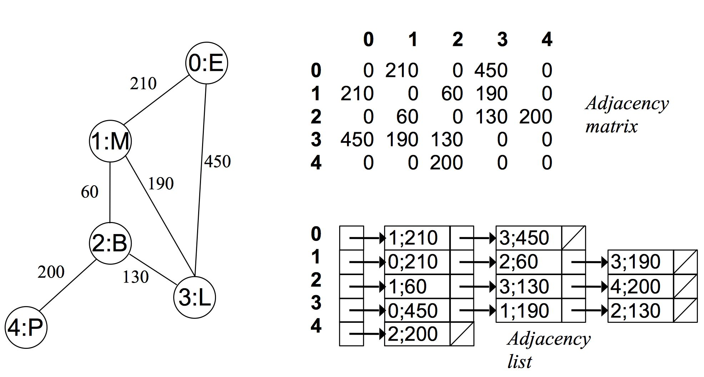

<style>
details {
    border: 1px solid #aaa;
    border-radius: 4px;
    padding: .5em .5em 0;
}
summary {
    font-weight: bold;
    margin: -.5em -.5em 0;
    padding: .5em;
}
details[open] {
    padding: .5em;
}
details[open] summary {
    border-bottom: 1px solid #aaa;
    margin-bottom: .5em;
}
img {
    pointer-events: none;
}
</style>

<details><summary>目录</summary><p>

- [数据结构分类](#数据结构分类)
    - [逻辑结构: 线性与非线性](#逻辑结构-线性与非线性)
    - [物理结构: 连续与分散](#物理结构-连续与分散)
- [基本数据类型](#基本数据类型)
- [数字编码](#数字编码)
- [字符编码](#字符编码)
- [数据结构-数组与链表](#数据结构-数组与链表)
    - [数组 array](#数组-array)
        - [数组常用操作](#数组常用操作)
            - [1 初始化数组](#1-初始化数组)
            - [2 访问元素](#2-访问元素)
            - [3 插入元素](#3-插入元素)
            - [4 删除元素](#4-删除元素)
            - [5 遍历数组](#5-遍历数组)
            - [6 查找元素](#6-查找元素)
            - [7 扩容数组](#7-扩容数组)
        - [数组的优点与局限性](#数组的优点与局限性)
        - [数组典型应用](#数组典型应用)
    - [链表](#链表)
        - [链表常用操作](#链表常用操作)
        - [数组 VS. 链表](#数组-vs-链表)
        - [常见链表类型](#常见链表类型)
        - [链表的典型应用](#链表的典型应用)
    - [列表](#列表)
    - [内存与缓存](#内存与缓存)
- [数据结构-栈与队列](#数据结构-栈与队列)
    - [栈](#栈)
    - [队列](#队列)
    - [双向队列](#双向队列)
- [数据结构-哈希表](#数据结构-哈希表)
    - [哈希表](#哈希表)
    - [哈希冲突](#哈希冲突)
    - [哈希算法](#哈希算法)
- [数据结构-树](#数据结构-树)
    - [二叉树](#二叉树)
    - [二叉树遍历](#二叉树遍历)
    - [二叉树数组表示](#二叉树数组表示)
    - [二叉搜索树](#二叉搜索树)
    - [AVL 树](#avl-树)
- [数据结构-堆](#数据结构-堆)
    - [堆](#堆)
    - [建堆操作](#建堆操作)
    - [Top-k 问题](#top-k-问题)
- [数据结构-图](#数据结构-图)
    - [图](#图)
    - [图基本操作](#图基本操作)
    - [图的遍历](#图的遍历)
- [图论简介](#图论简介)
- [图的表示](#图的表示)
- [图的遍历](#图的遍历-1)
    - [广度优先搜索](#广度优先搜索)
    - [深度优先搜索](#深度优先搜索)
- [最短路径算法](#最短路径算法)
    - [无权图](#无权图)
    - [有权图](#有权图)
        - [迪杰斯特拉算法 Dijkstra](#迪杰斯特拉算法-dijkstra)
        - [佛洛伊德算法 Floyd](#佛洛伊德算法-floyd)
- [最小生成树](#最小生成树)
- [网络流建模](#网络流建模)
</p></details><p></p>

# 数据结构分类

常见的数据结构包括：数组、链表、栈、队列、哈希表、树、堆、图，
它们可以从“逻辑结构”和“物理结构”两个维度进行分类。

## 逻辑结构: 线性与非线性

逻辑结构揭示了数据元素之间的逻辑关系：

* 在数组和链表中，数据按照一定顺序排列，体现了数据之间的线性关系；
* 在树中，数据从顶部向下按层次排列，表现出“祖先”与“后代”之间的派生关系；
* 图则由节点和边构成，反映了复杂的网络关系。

逻辑结构可分为 “线性” 和 “非线性” 两大类：线性结构比较直观，
指数据在逻辑关系上呈线性排列，元素之间是一对一的顺序关系；
非线性结构则相反，呈非线性排列，元素之间是一对多或多对多的关系。

* 线性数据结构：元素之间是一对一的顺序关系
    - 数组、链表、栈、队列、哈希表
* 非线性数据结构
    - 树形结构：元素之间是一对多的关系
        - 树、堆、哈希表
    - 网状结构：元素之间是多对多的关系 
        - 图


## 物理结构: 连续与分散

> 存储结构

当算法程序运行时，正在处理的数据主要存储在内存中。下图展示了一个计算机内存条，
其中每个黑色方块都包含一块内存空间。我们可以将内存想象成一个巨大的 Excel 表格，
其中每个单元格都可以存储一定大小的数据。系统通过内存地址来访问目标位置的数据。
计算机根据特定规则为表格中的每个单元格分配编号，确保每个内存空间都有唯一的内存地址。
有了这些地址，程序便可以访问内存中的数据。


内存是所有程序的共享资源，当某块内存被某个程序占用时，则无法被其他程序同时使用了。
因此在数据结构与算法的设计中，内存资源是一个重要的考虑因素。
比如，算法所占用的内存峰值不应超过系统剩余空闲内存；如果缺少连续大块的内存空间，
那么所选用的数据结构必须能够存储在分散的内存空间内。

如下图所示，物理结构反映了数据在计算机内存中的存储方式，
可分为连续空间存储（数组）和分散空间存储（链表）。
物理结构从底层决定了数据的访问、更新、增删等操作方法，
两种物理结构在时间效率和空间效率方面呈现出互补的特点。


值得说明的是，所有数据结构都是基于数组、链表或二者的组合实现的。
例如，栈和队列既可以使用数组实现，也可以使用链表实现；
而哈希表的实现可能同时包含数组和链表。

* 基于数组可实现：栈、队列、哈希表、树、堆、图、矩阵、张量（维度 `$\geq 3$` 的数组）等。
* 基于链表可实现：栈、队列、哈希表、树、堆、图等。

链表在初始化后，仍可以在程序运行过程中对其长度进行调整，因此也称“动态数据结构”。
数组在初始化后长度不可变，因此也称“静态数据结构”。值得注意的是，
数组可通过重新分配内存实现长度变化，从而具备一定的“动态性”。

# 基本数据类型 

当谈及计算机中的数据时，我们会想到文本、图片、视频、语音、3D 模型等各种形式。
尽管这些数据的组织形式各异，但它们都由各种基本数据类型构成。

基本数据类型是 CPU 可以直接进行运算的类型，在算法中直接被使用，主要包括以下几种：

* 整数类型
    - `byte`
    - `short`
    - `int`
    - `long`
* 浮点数类型：用于表示小数
    - `float`
    - `double`
* 字符类型：用于表示各种语言的字母、标点符号甚至表情符号等
    - `char`
* 布尔类型：用于表示“是”与“否”
    - `bool`

基本数据类型以二进制的形式存储在计算机中。一个二进制位即为 1 比特。在绝大多数现代操作系统中，
1 字节(byte)由 8 比特(bit)组成。

基本数据类型的取值范围取决于其占用的空间大小。下面以 Java 为例：

* 整数类型 `byte` 占用 1 字节 = 8 比特，可以表示 `$2^{8}$` 个数字
* 整数类型 `int` 占用 4 字节 = 32 比特，可以表示 `$2^{32}$` 个数字

# 数字编码


# 字符编码


# 数据结构-数组与链表

## 数组 array

数组（array）是一种线性数据结构，其将相同类型的元素存储在连续的内存空间中。
我们将元素在数组中的位置称为该元素的索引（index）。


### 数组常用操作

#### 1 初始化数组

可以根据需求选用数组的两种初始化方式：无初始值、给定初始值。
在未指定初始值的情况下，大多数编程语言会将数组元素初始化为 0。

```python
arr: list[int] = [0] *5
nums: list[int] = [1, 3, 2, 5, 4]
```

#### 2 访问元素

数组元素被存储在连续的内存空间中，这意味着计算数组元素的内存地址非常容易。
给定数组内存地址（首元素内存地址）和某个元素的索引，
我们可以使用下图所示的公式计算得到该元素的内存地址，从而直接访问该元素。


我们发现数组首个元素的索引为 0，这似乎有些反直觉，因为从 1 开始计数会更自然。
但从地址计算公式的角度看，索引本质上是内存地址的偏移量。首个元素的地址偏移量是 0，
因此它的索引为 0 是合理的。

```python
import random

def random_access(nums: list[int]) -> int:
    """
    随机访问元素
    """
    # 在区间 [0, len(num) - 1] 中随机抽取一个数字
    random_index = random.randint(0, len(nums) - 1)
    # 获取并返回随机元素
    random_num = nums[random_index]

    return random_num
```

#### 3 插入元素

数组元素在内存中是“紧挨着的”，它们之间没有空间再存放任何数据。
如下图所示，如果想在数组中间插入一个元素，则需要将该元素之后的所有元素都向后移动一位，
之后再把元素赋值给该索引。值得注意的是，由于数组的长度是固定的，
因此插入一个元素必定会导致数组尾部元素“丢失”。


```python
def insert(nums: list[int], num: int, index: int):
    """
    在数组的索引 index 处插入元素 num
    """
    # 把索引 index 以及之后的所有元素向后移动一位
    for i in range(len(nums) - 1, index, -1):
        nums[i] = nums[i - 1]
    # 将 num 赋给 index 处的元素
    nums[index] = num
```

#### 4 删除元素

若想删除索引 `$i$` 处的元素，则需要把索引 `$i$` 之后的元素都向前移动一位。
请注意，删除元素完成后，原先末尾的元素变得“无意义”了，所以我们无须特意去修改它。


```python
def remove(nums: list[int], index: int):
    """
    删除索引 index 处的元素
    """
    for i in range(index, len(nums) - 1):
        nums[i] = nums[i +1]
```

总的来看，数组的插入与删除操作有以下缺点。

* 时间复杂度高：数组的插入和删除的平均时间复杂度均为 `$O(n)$`，其中 `$n$` 为数组长度。
* 丢失元素：由于数组的长度不可变，因此在插入元素后，超出数组长度范围的元素会丢失。
* 内存浪费：我们可以初始化一个比较长的数组，只用前面一部分，这样在插入数据时，
  丢失的末尾元素都是“无意义”的，但这样做会造成部分内存空间浪费。

#### 5 遍历数组

在大多数编程语言中，我们既可以通过索引遍历数组，也可以直接遍历获取数组中的每个元素：

```python
def traverse(nums: list[int]):
    """
    遍历数组
    """
    count = 0
    # 通过索引遍历数组
    for i in range(len(nums)):
        count += nums[i]
    # 直接遍历数组元素
    for num in nums:
        count += num
    # 同时遍历数组索引和元素
    for i, num in enumerate(nums):
        count += num[i]
        count += num
```

#### 6 查找元素

在数组中查找指定元素需要遍历数组，每轮判断元素值是否匹配，若匹配则输出对应索引。
因为数组是线性数据结构，所以上述查找操作被称为“线性查找”。

```python
def find(nums: list[int], target: int) -> int:
    """
    在数组中查找指定元素
    """
    for i in range(len(nums)):
        if num[i] == target:
            return i
    return -1
```

#### 7 扩容数组

在复杂的系统环境中，程序难以保证数组之后的内存空间是可用的，从而无法安全地扩展数组容量。
因此在大多数编程语言中，数组的长度是不可变的。

如果我们希望扩容数组，则需重新建立一个更大的数组，然后把原数组元素依次复制到新数组。
这是一个 `$O(n)$` 的操作，在数组很大的情况下非常耗时。

```python
def extend(nums: list[int], enlarge: int) -> list[int]:
    """
    扩展数组长度
    """
    # 初始化一个扩展长度后的数组
    res = [0] * (len(nums) + enlarge)
    # 将原数组中的所有元素复制到新数组
    for i in range(len(nums)):
        res[i] = nums[i]
    # 返回扩展后的新数组
    return res
```

### 数组的优点与局限性

数组存储在连续的内存空间内，且元素类型相同。这种做法包含丰富的先验信息，
系统可以利用这些信息来优化数据结构的操作效率：

* 空间效率高：数组为数据分配了连续的内存块，无须额外的结构开销。
* 支持随机访问：数组允许在 `$O(1)$` 时间内访问任何元素。
* 缓存局部性：当访问数组元素时，计算机不仅会加载它，还会缓存其周围的其他数据，
  从而借助高速缓存来提升后续操作的执行速度。

连续空间存储是一把双刃剑，其存在以下局限性。

* 插入与删除效率低：当数组中元素较多时，插入与删除操作需要移动大量的元素。
* 长度不可变：数组在初始化后长度就固定了，扩容数组需要将所有数据复制到新数组，开销很大。
* 空间浪费：如果数组分配的大小超过实际所需，那么多余的空间就被浪费了。


### 数组典型应用

数组是一种基础且常见的数据结构，既频繁应用在各类算法之中，也可用于实现各种复杂数据结构：

* 随机访问：如果我们想随机抽取一些样本，那么可以用数组存储，并生成一个随机序列，根据索引实现随机抽样。
* 排序和搜索：数组是排序和搜索算法最常用的数据结构。快速排序、归并排序、二分查找等都主要在数组上进行。
* 查找表：当需要快速查找一个元素或其对应关系时，可以使用数组作为查找表。
  假如我们想实现字符到 ASCII 码的映射，则可以将字符的 ASCII 码值作为索引，
  对应的元素存放在数组中的对应位置。
* 机器学习：神经网络中大量使用了向量、矩阵、张量之间的线性代数运算，
  这些数据都是以数组的形式构建的。数组是神经网络编程中最常使用的数据结构。
* 数据结构实现：数组可以用于实现栈、队列、哈希表、堆、图等数据结构。
  例如，图的邻接矩阵表示实际上是一个二维数组。

## 链表

### 链表常用操作

### 数组 VS. 链表

### 常见链表类型

### 链表的典型应用

## 列表


## 内存与缓存


# 数据结构-栈与队列

## 栈


## 队列


## 双向队列


# 数据结构-哈希表

## 哈希表

## 哈希冲突


## 哈希算法


# 数据结构-树

## 二叉树

## 二叉树遍历


## 二叉树数组表示

## 二叉搜索树

## AVL 树


# 数据结构-堆

## 堆

## 建堆操作

## Top-k 问题

# 数据结构-图


## 图

## 图基本操作

## 图的遍历

# 图论简介

图论(Graph Theory)是数学的一个分支。它以图(Graph)为研究对象。
图论中的图是由若干给定的点及连接两点的线所构成的图形，
这种图形通常用来描述某些事物之间的某种特定关系，用点代表事物，
用连接两点的线表示相应两个事物间具有这种关系

图论是一种表示“多对多”的关系，图是由顶点和边组成的(可以无边，但至少包含一个顶点)：

* 一组顶点：通常用 V(vertex) 表示顶点集合
* 一组边：通常用 E(edge) 表示边的集合

图可以分为有向图和无向图，在图中：

* `$(v, w)$` 表示无向边，即 `$v$` 和 `$w$` 是互通的
* `$<v, w>$` 表示有向边，该边始于 `$v$`，终于 `$w$`

图可以分为有权图和无权图：

* 有权图：每条边具有一定的权重(weight)，通常是一个数字
* 无权图：每条边均没有权重，也可以理解为权为 1

图又可以分为连通图和非连通图：

* 连通图：所有的点都有路径相连
* 非连通图：存在某两个点没有路径相连

图中的顶点有度的概念：

* 度(degree)：所有与它连接点的个数之和
* 入度(in degree)：存在于有向图中，所有接入该点的边数之和
* 出度(out degree)：存在于有向图中，所有接出该点的边数之和

图的类型：

* 无向无权连通图
* 无向无权非联通图
* 无向有权连通图
* 无向有权非联通图
* 有向无权联通图
* 有向无权非连通图
* 有向有权连通图
* 有向有权非连通图

# 图的表示

图在程序中的表示一般有两种方式：

1. 邻接矩阵
    - 在 `$n$` 个顶点的图需要有一个 `$n \times n$` 大小的矩阵
    - 在一个无权图中，矩阵坐标中每个位置值为 1 代表两个点是相连的，0 表示两点是不相连的
    - 在一个有权图中，矩阵坐标中每个位置值代表该两点之间的权重，0 表示该两点不相连
    - 在无向图中，邻接矩阵关于对角线相等
2. 邻接链表
    - 对于每个点，存储着一个链表，用来指向所有与该点直接相连的点
    - 对于有权图来说，链表中元素值对应着权重

邻接矩阵与邻接链表示例：

* 无向无权图：

    

* 无向有权图中：

    

* 有向无权图：

    

邻接矩阵和链表对比：

* 邻接矩阵由于没有相连的边也占有空间，因此存在浪费空间的问题，
  而邻接链表则比较合理地利用空间
* 邻接链表比较耗时，牺牲很大的时间来查找，因此比较耗时，
  而邻接矩阵法相比邻接链表法来说，时间复杂度低

# 图的遍历

图的遍历就是要找出图中所有的点，一般有两种方法

* 深度优先搜索遍历(Depth First Search, DFS)
* 广度优先搜索遍历(Breadth First Search, BFS)

相当于在漆黑的夜里，你只能看清你站的位置和你前面的路，但你不知道每条路能够通向哪里。
搜索的任务就是，给出初始位置和目标位置，要求找到一条到达目标的路径

* 深度优先就是，从初始点出发，不断向前走，如果碰到死路了，就往回走一步，
  尝试另一条路，直到发现了目标位置。这种不撞南墙不回头的方法，
  即使成功也不一定找到一条好路，但好处是需要记住的位置比较少
* 广度优先就是，从初始点出发，把所有可能的路径都走一遍，如果里面没有目标位置，
  则尝试把所有两步能够到的位置都走一遍，看有没有目标位置；
  如果还不行，则尝试所有三步可以到的位置。这种方法，一定可以找到一条最短路径，
  但需要记忆的内容实在很多，要量力而行

## 广度优先搜索

广度优先搜索，可以被形象地描述为 "浅尝辄止"，它也需要一个队列以保持遍历过的顶点顺序，
以便按出队的顺序再去访问这些顶点的邻接顶点

实现思路：

1. 顶点 `$v$` 入队列
2. 当队列非空时则继续执行，否则算法结束
3. 出队列取得队头顶点 `$v$`；访问顶点 `$v$` 并标记顶点 `$v$` 已被访问
4. 查找顶点 `$v$` 的第一个邻接顶点 `$col$`
5. 若 v 的邻接顶点 `$col$` 未被访问过的，则 `$col$` 继续
6. 查找顶点 `$v$` 的另一个新的邻接顶点 `$col$`，转到步骤 5 入队列，
   直到顶点 `$v$` 的所有未被访问过的邻接点处理完。转到步骤 2 
 
要理解深度优先和广度优先搜索，首先要理解搜索步，一个完整的搜索步包括两个处理

1. 获得当前位置上，有几条路可供选择
2. 根据选择策略，选择其中一条路，并走到下个位置

## 深度优先搜索

基本思路：深度优先遍历图的方法是，从图中某顶点 `$v$` 出发

1. 访问顶点 `$v$`
2. 从 `$v$` 的未被访问的邻接点中选取一个顶点 `$w$`，从 `$w$` 出发进行深度优先遍历
3. 重复上述两步，直至图中所有和 `$v$` 有路径相通的顶点都被访问到

# 最短路径算法

## 无权图


## 有权图

在有权图中，常见的最短路径算法有

* 迪杰斯特拉(Dijkstra)算法
* 佛洛伊德(Floyd)算法

### 迪杰斯特拉算法 Dijkstra

单源最短路径

* [基于Dijkstra算法的武汉地铁路径规划](https://mp.weixin.qq.com/s?__biz=MzIyNjM2MzQyNg==&mid=2247543903&idx=1&sn=a8b6acf4fd762353437a8c0734780d40&chksm=e873fd12df04740490bee9aa4e3327de2e24ed451117be76eb3e749e1d7d3049cc08454b1a9b&cur_album_id=1610940301446037510&scene=189#wechat_redirect)

### 佛洛伊德算法 Floyd


# 最小生成树

# 网络流建模


