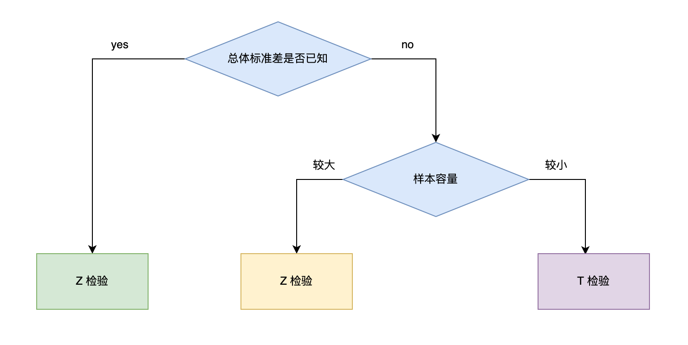
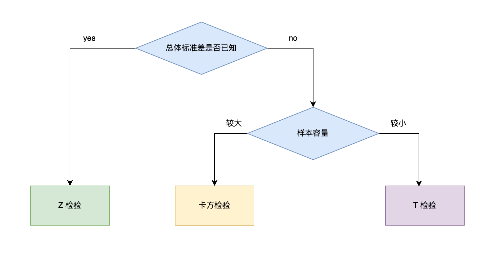
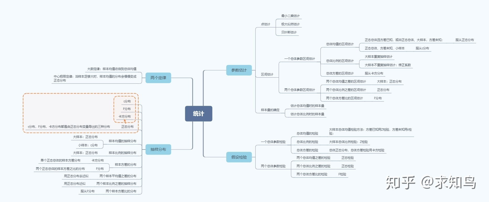

<style>
details {
    border: 1px solid #aaa;
    border-radius: 4px;
    padding: .5em .5em 0;
}
summary {
    font-weight: bold;
    margin: -.5em -.5em 0;
    padding: .5em;
}
details[open] {
    padding: .5em;
}
details[open] summary {
    border-bottom: 1px solid #aaa;
    margin-bottom: .5em;
}
</style>

<details><summary>目录</summary><p>

- [什么是 AB test?](#什么是-ab-test)
- [为什么需要 AB test?](#为什么需要-ab-test)
- [AB test 的误解](#ab-test-的误解)
- [一个 AB test 案例](#一个-ab-test-案例)
  - [试验设计](#试验设计)
    - [确定目标和假设](#确定目标和假设)
    - [选取评价指标和护栏指标](#选取评价指标和护栏指标)
    - [确定实验单位](#确定实验单位)
    - [最小样本量估算](#最小样本量估算)
      - [实践中计算样本量](#实践中计算样本量)
      - [实践中计算综合方差](#实践中计算综合方差)
      - [假设检验选择](#假设检验选择)
      - [估算实验组和对照组评价指标差值](#估算实验组和对照组评价指标差值)
  - [实施测试](#实施测试)
  - [结果分析](#结果分析)
- [如何做 AB test?](#如何做-ab-test)
  - [AB test 步骤](#ab-test-步骤)
  - [AB test 相关的统计学理论](#ab-test-相关的统计学理论)
    - [假设检验](#假设检验)
    - [Significance Level](#significance-level)
    - [Statistical power 和 Statistical Significance](#statistical-power-和-statistical-significance)
    - [Baseline Rate](#baseline-rate)
    - [Minimum Detectable Effect](#minimum-detectable-effect)
    - [假设检验还可以这样做](#假设检验还可以这样做)
  - [AB test 工具](#ab-test-工具)
- [如何用 Python 实现 AB test？](#如何用-python-实现-ab-test)
  - [实例背景简述](#实例背景简述)
  - [实例 AB test 步骤](#实例-ab-test-步骤)
- [面试题目](#面试题目)
  - [AB test 设计](#ab-test-设计)
- [参考](#参考)
</p></details><p></p>

# 什么是 AB test?

A/B test 是为同一个目标制定两个方案，在同一时间维度，分别让组成成分相同（相似）的用户群组随机的使用一个方案，
收集各群组的用户体验数据和业务数据，最后根据显著性检验分析评估出最好版本正式采用

A/B test 核心在于：对一个要素有两个版本(A/B)，并且有度量哪个更成功的指标的情况下，
将 A/B 两个版本同时做实验，然后根据度量结果决定哪个版本更好，从而决定在生产中真正使用哪个版本

> 关于 A/B test 相关的几个问题：
> 
> * 请详细描述运用 A/B test 提高转化率的例子
> * 最小样本量怎么确定
> * 实验效果不显著时该怎么做
> * 怎么选择实验组和对照组
> * 什么情况下不适合做 A/B test

# 为什么需要 AB test?

产品的改变并不总是意味着进步和提高，有时候是无法人为评判多种设计方案中哪一种更优秀，
这时利用 A/B test 可以回答两个问题: 

1. 哪个方案好?
2. 比较结果的可信度是多少?

A/B test 结果是基于用户得到的结果，用数据说话，而不是凭空想象去为用户代言，
并且通过一定的数据分析给出结果的可信度。但A/B test 需要几个前提: 

1. 多个方案并行测试
2. 每个方案只有一个变量不同
3. 能够以某种规则优胜劣汰

其中第 2 点暗示了 A/B test 的应用范围: A/B test 必须是单变量，但有的时候，
我们并不追求知道某个细节对方案的影响，而只想知道方案的整体效果如何，那么可以适当增加变量，
当然测试方案有非常大的差异时一般不太适合做 A/B测试，因为它们的变量太多了，
变量之间会有很多的干扰，所以很难通过 A/B test 的方法找出各个变量对结果的影响程度。
在满足上述前提时，便可以做 A/B test 了

# AB test 的误解

曾经以为 A/B test 就是设置两个版本，分别让两组用户使用，转化率高的胜出，然后就可以发布上线了。
但事实真是如此吗？这样做决策科学吗？如果 A/B test 如此简单，那为什么还是有很多互联网公司没有使用呢？

> 先举个例子，一个详情页版本 A 转化率是 1.76%，版本 B 转化率是 2.07%。
  如果你是产品经理你会选用哪个版本呢？假如再有版本 C，转化率是 2.76% 呢？再有版本 D，
  转化率是 11.76% 呢？按照“哪个版本转化率高就上线哪个版本”的决策模式，我们应该立即上线版本 D。
  过去我也是这么认为的，但实际上是错误地理解了 A/B test

在刚才举的例子中，存在三个问题：

* 第一，试验只是抽取了一部分用户得出了结论，不是全部用户；
  那么当全部用户都使用版本 D 时，转化率还会是 11.76% 吗？
* 第二，版本 B、C 和 D 的转化率分别是 2.07%、2.76% 和 11.76%，
  相对于版本 A 的提升分别是 0.31%、1% 和 10%。是差异越大，
  我们上线这个版本的信心指数就会越高吗？显然不是，还需要考虑，
  0.31%、1% 和 10% 的提升是实际存在的，还是试验误差导致的？
* 第三，当差异多大时，我们才能下判断呢？换句话说，如果上线版本 B，
  它是否确实能带来转化率的提升呢？实际的提升会是多少呢？

由于这三个问题缺少数据支持，所以无法回答，因此就没法做出是上线版本 A 还是上线版本 B 的决策。
从上文可以看出，A/B test 并没有想象中的简单，它是一项科学试验，涉及到抽样、显著性检验、软件工程、心理学等方方面面。
重点要关注试验过程是否科学严谨，试验结果是否可信，依据这样的 A/B test 结果做决策才真正的能推动业务的发展

# 一个 AB test 案例

运营想提高完成首单用户的复购率，于是提出想法：在用户完成首单后，
让优惠券的展示更加醒目，以促进用户使用。但是这个想法却不被产品经理认可。
主要有以下几方面的原因：

* 首先，现有版本已经有了优惠券展示模块
* 其次，整体优惠券使用率不高，而且分析历史数据得知优惠券对促进用户再次购买的效果并不理想
* 最后，也是最重要的一点，现有版本有“分享有赏”功能，用户将课程以海报形式分享到朋友圈，
  其好友通过该海报购买后，该用户能够得到返现。通过这种形式也能促成复购，还有拉新效果

运营和产品经理各有理由，所以在双方互相不能说服的情况下，就决定用 A/B test 来解决这一问题，
而试验结果也让大家颇感意外

## 试验设计

接下来就是按照 A/B test 的规范流程来设计试验了：

1. 明确目标和假设
    - 目标是增加复购
    - 零假设是实验组复购率与控制组没有差异
2. 确定指标
    - 用复购率作为衡量指标，同时考虑新用户数和营收。
      复购率 = 已支付订单数大于等于两单的用户数 / 已支付订单数等于一单的用户数
3. 确定试验单位
    - 使用 uid(用户 ID) 作为试验单位
4. 确定样本量
    - 将实验组与控制组的差值设置为 0.6%，这个差值也有其他叫法，
      比如最小可检测效应、实际显著性。算出来最少需要 8074 个样本

### 确定目标和假设

首先，要明确，做 A/B test 肯定是为了解决业务上遇到的问题，而绝不是为了做而做。
所以，找到了要解决的业务问题，也就基本找到了 A/B test 目标

核心点：把产品业务变化当作原因，把业务目标当作结果，就把业务问题转化为因果思维

> 案例一：在每个专辑/歌单播放完成后，自动播放下一个专辑/歌单的功能，可以提高下个月的续订率
> 
> 此案例同时满足三个条件：
> 
> * 明确可能的原因和结果
> * 可被证伪
> * 定量指标

> 案例二：我们的产品可以打入高端市场
> 
> 此案例有如下特点：
> 
> * 原因和结果不明确
> * 很难被证伪
> * 定性指标

### 选取评价指标和护栏指标

评价指标是指：可以直接评价 A/B test 结果的指标，比如点击率，转化率，人均购买时长。
有了评价指标，就可以保证 A/B test 的成功了吗？显然不是的。很多时候，我们可能考虑得不够全面，
忽略了测试本身的合理性，不确定测试是否会对业务有负面效果，因此很可能得出错误的结论。
所以，我们还需要从产品长远发展的角度出发，找到护栏指标。护栏指标指：辅助 A/B test ，保障 A/B test 质量

> 举个例子。如果为了优化一个网页的点击率，就给网页添加了非常酷炫的动画效果。
  结果点击率是提升了，网页加载时间却增加了，造成了不好的用户体验。
  长期来看，这就不利于业务的发展

通常来说评价指标具备以下特性：

* 可归因性：续订率的变化可归因为自动播放功能
* 可量化：续订率而不是用户满意度
* 敏感性和稳定性：实验变量变化，评价指标敏感做出变化；无关变量变化，评价指标表现相当稳定性

### 确定实验单位

先明确概念：

* 用户层面
    - 用户 ID：手机号，邮箱等
    - 匿名 ID：如用户浏览网页时的 cookies
    - 设备 ID：一旦出厂就不可更改
    - IP 地址
* 访问层面
    - session：当用户在访问应用程序（WEB、APP 等）内的页面内容的时候，
      存储在 session 中的值不会丢失和变更（这个值相当于一次访问的唯一ID一样），
      如果用户一直访问，session 的值就会一直存在下去。
    - 如果以访问 ID 作为实验单位，那么用户很可能交叉出现在实验组对照组中
* 页面层面
    - 相同的页面，如果被相同的人在不同的时间浏览也会被算作不同的页面

如果一项 A/B test ，用户容易感知，本应选择用户 ID 作为实验对象，但由于时间紧，
业务方采用访问 ID 作为实验单位，最后发现结论和常识相反。这时候，就是实验单位错选导致结论错误

保持用户体验的连贯性就是实验组用户不会出现在对照组中：如果变化用户容易感知，
就要选择用户层面作为实验对象。大多数实验都考虑用户体验的连续性，故而都选择用户 ID 作为实验单位

实验单位和评价指标单位保持一致：A/B test 的前提是实验单位独立同分布，
如果评价指标=收到专辑用户数/推送用户数，那么实验单位就必须选用户层面而不能选择访问层面

### 最小样本量估算

在 A/B test 中，样本量太小，得出的结论不靠谱，容易受到偶然因素影响；样本量太大，试错成本就大。
根据测试样本总量以及每天得到的样本量可以大致估算一次 A/B test 所需要的时间(天) = 总样本量 / 每天可以得到的样本量。
其中，总样本量理论上可以用下面的方法计算：

`$$n = (Z_{1-\alpha} + Z_{1-\beta})^{2} \times \frac{\sigma^{2}}{\delta^{2}}$$`

其中：

* `$Z_{1-\alpha}$` 为显著性水平，一般取 1.96，`$\alpha$` 取 0.05
* `$Z_{1-\beta}$` 为检验效能，一般取 0.84，`$\beta$` 取 0.2
* `$\sigma^{2}$` 为实验组、对照组之间的综合方差
* `$\delta$` 为实验组和对照组评价指标的差值

假设实验组与对照组样本量相同，实际推出评价指标不同的概率就是 `$\alpha$`，
那么 `$1-\alpha$` 就是推测实验组和对照组评价指标相同的概率，
称为置信水平。想要第一类错误率越小，结果越精确，就需要更大的样本量

假设实验组和对照组不同，实际推出评价指标相同的概率就是 `$\beta$`，那么 `$1-\beta$` 就是检验效能，
即推出实验组和对照组评价指标不同的概率。A/B test 就是检验效能越大越好

#### 实践中计算样本量

在实验中，显著性水平通常设置为 5%，检验效能能通常设置为 20%，那么最小样本量可以简化为：

`$$n = \frac{8\sigma^{2}}{\delta^{2}}$$`

如果 A/B test 的实验组和对照组样本量相等，那么总样本量为：

`$$n = \frac{16\sigma^{2}}{\delta^{2}}$$`

这里补充一点，很多面试官喜欢问为什么实验组和对照组样本量 `$1:1$` 均分，如果不均分将会产生什么影响？

> 一个常见的误解是，如果实验组的样本量大一些，对照组的样本量小一些（比如按照 80%/20% 分配），
  就能更快地获得统计上显著的结果。其实现实正好相反：两组不均分的话反而会延长测试的时间。
  为什么会这样呢？因为我们计算的达到统计显著性的最小样本量，是以每组为单位的，并不是以总体为单位。
  也就是说，在非均分的情况下，只有相对较小组的样本量达到最小样本量，实验结果才有可能显著，
  并不是说实验组越大越好，因为瓶颈是在样本量较小的对照组上

相对于 50%/50% 的均分，非均分会出现两种结果，这两种结果均对业务不利：

* 准确度降低。如果保持相同的测试时间不变，那么对照组样本量就会变小，
  测试的检验效能也会变小，测试结果的准确度就会降低
* 延长测试时间。如果保持对照组的样本量不变，那么就需要通过延长测试时间来收集更多的样本

#### 实践中计算综合方差

综合方差的计算主要是选取历史数据，根据不同的评价指标的类型来选择相应的统计方法进行计算。
评价指标的类型主要分为概率类和均值类这两种

概率类指标在统计上通常是二项分布，综合方差为：

`$$\sigma^{2} = p_{test}(1 - p_{test}) + p_{control}(1 - p_{control})$$`

其中：

* `$p_{test}$` 为实验组发生的概率
* `$p_{control}$` 为对照组发生的概率，一般可以通过历史数据计算出来
* `$p_{test} = p_{control} + \delta$`

> 概率类指标一般服从二项分布，二项分布总体方差不需要知道每个数，所以可以用样本数据获得总体方差，
> 并且 A/B test 中样本量远大于 30，所以使用 Z 检验

均值类指标通常是正态分布，在样本量大的情况下，根据中心极限定理，综合方差为：

`$$\sigma^{2} = \frac{\sum_{i = 1}^{n}(x_{i} - \bar{x})^{2}}{n-1} \times 2$$`

其中：

* `$n$` 为历史数据样本大小

> 均值类指标一般服从正态分布，正态分布的总体方差需要知道总体各个值，这一般很难获得，
> 所以我们只能获得样本数据，均值类指标用 T 检验

#### 假设检验选择

设总体 `$X \sim N(\mu, \sigma^{2})$`，`$X_{1}, X_{2}, \ldots, X_{n}$` 为取自该总体 `$X$` 的样本。
`$n$` 为样本量，`$\bar{X}$` 为样本均值，`$S^{2}$` 为样本方差，`$\mu$` 为总体均值，`$\sigma^{2}$` 为总体方差

Z 检验：一般用于大样本（即样本容量大于 30）平均值差异性检验的方法。
它是用标准正态分布的理论来推断差异发生的概率，从而比较两个平均数的差异是否显著。
在国内也被称作 u 检验，其假设检验的统计量 U 如下：

`$$U = \frac{\bar{X} - \mu}{\sigma}\sqrt{n} \sim N(0, 1)$$`

T 检验：主要用于样本含量较小（例如 `$n < 30$`），总体标准差 `$\sigma$` 未知的正态分布。
T 检验是用 t 分布理论来推论差异发生的概率，从而比较两个平均数的差异是否显著。其假设检验的统计量 `$T$` 如下：

`$$T = \frac{\bar{X} - \mu}{S} \sqrt{n} \sim t(n - 1)$$`

卡方检验：卡方检验是统计样本的实际观测值与理论推断值之间的偏离程度，
实际观测值与理论推断值之间的偏离程度就决定卡方值的大小，如果卡方值越大，
二者偏差程度越大；反之，二者偏差越小；若两个值完全相等时，卡方值就为 0，表明理论值完全符合。
其假设检验的统计量 `$\chi^{2}$` 如下：

`$$\chi^{2} = \frac{(n-1)S^{2}}{\sigma^{2}} \sim \chi^{2}(n-1)$$`

假设检验方法的选择规则如下：



TODO：



#### 估算实验组和对照组评价指标差值

第一种方法是从收益和成本的角度进行估算。业务 / 产品上的任何变化都会产生相应的成本，
包括但不限于人力成本、时间成本、维护成本、机会成本，那么变化带来的总收益能否抵消掉成本，达到净收益为正呢？

> 举个例子，我们现在想要通过优化注册流程来增加某 App 的用户注册率。
  假设优化流程的成本大约是 3 万元（主要是人力和时间成本），优化前的注册率为 60%，
  每天开始注册的人数为 100 人，每个新用户平均花费 10 元。如果优化后的注册率提升为 70%，
  这样一年下来就多了 3.65 万元（`$(70\%-60\%) \times 100 \times 10 \times 365 = 36500$`）的收入，
  这样的话一年之内的净收益就为正的，这就说明此次优化流程不仅回本，
  而且还带来了利润，也就证明 10% 的差值是一个理想的提升

第二种方法是，如果收益和成本不好估算的话，我们可以从历史数据中寻找蛛丝马迹算出这些评价指标的平均值和波动范围，
从而估算一个大概的差值

> 比如说我们的评价指标是点击率，通过历史数据算出点击率的平均值为 5%，波动范围是[3.5%, 6.5%]，
  那么我们对实验组评价指标的期望值就是至少要大于这个波动范围，比如 7%，那么这时 `$\delta$` 就等于 2%（7%–5%）

## 实施测试

经过对历史数据的分析，用户分享率和领取优惠券的领取率没有明显的周期性变化，
因此按照样本量与流量确定了试验时长。做好准备后，开发开始使用自建的分流系统，上线测试

## 结果分析

进入试验的用户有 17652 人，在功效 80%，置信度 95% 时，置信区间不收敛，
并且 P 值大于 0.05，不拒绝原假设。我们又试验了一段时间，发现依然如此。
因此判断实验组并不比原版本效果好

可以借助 Python 对结果进行分析，demo 如下

```python
from scipy import stats
import numpy as np
import numpy as np
import seaborn as sns

A = np.array([1, 4, 2, 3, 5, 5, 5, 7, 8, 9, 10, 18])
B = np.array([1, 2, 5, 6, 8, 10, 13, 14, 17, 20, 13, 8])
print('策略 A 的均值是：', np.mean(A))
print('策略 B 的均值是：', np.mean(B))
```

```
策略A的均值是：6.416666666666667
策略B的均值是：9.75
```

```python
import scipy.stats

t, p_value = scipy.stats.ttest_ind(B,A)  #表示 B-A
print(t, p_value)
```

```
1.556783470104261 0.13379164919826217
```

# 如何做 AB test?

## AB test 步骤

一个完整的 A/B test 主要包括以下几部分：

1. 确定测试目标。即建立实验方案好坏的评估标准
2. 设计分流方案
3. 实验方案的部署
4. 数据收集及统计
5. 结果分析，得出结论

需要做/可以做的事：

1. 需要知道在放弃之前需要进行多长时间的测试。过早或过晚放弃都是不对的
2. 注意给相同访客呈现出相同版本，特别是一些价格什么敏感信息。(可以用 cookie 之类的技术追踪用户)
3. 在整个网站中保持 A/B test 的一致性，不要在 X 页面显示 A 中测试元素，而在 Y 页面显示 B 种测试元素
4. 做很多的 A/B test (为了达到既定的目标)

不需要做/不可以做的事：

1. 只有在测试了你能控制 A/B 两种版本之后，才开始你的测试；
   不要一段时间测试 A 版本，一段时间测试 B 版本，而是应该同时进行，将流量分散为 A/B 两类
2. 不要过早地下结论，需要事先预估一个 A/B test 的周期
3. 不要令常来的访客惊讶(或困惑)，如果是测试一个核心功能，最好只对新用户进行测试
4. 不要让个人的喜好影响测试的结果，因为不一定是看起来更合理(或更漂亮)的版本会获得 A/B test 的胜利，
   结果是什么就是什么，数据说话，保持客观

## AB test 相关的统计学理论



随机将测试用户群分为 2 部分，用户群 1 使用 A 方案，用户群 2 使用 B 方案，
经过一定测试时间后，根据收集到的两方案样本观测数据，根据显著性检验结果选取最好方案。
为了下文方便说明，不妨设 A 方案为参考方案（或旧方案），B 方案为实验方案（或新方案）

假设 A 方案的样本数为 `$N_{a}$`，B 方案的样本数为 `$N_{b}$`，`$N_{a} = N_{b} = N$`，
由于每次实验结果要么转化成功、要么失败，所以 A、B 的分布可看作是伯努利分布：

`$$A \sim B(N, \lambda_{a})$$`
`$$B \sim B(N, \lambda_{b})$$`

其中：

* `$\lambda_{a}$` 为
* `$\lambda_{b}$` 为

> 当 `$N \to \infty$` 时，二项分布近似服从正态分布，
> 其均值、方差分别为：`$\mu = np$`、`$\sigma^{2}=np(1-p)$`

由样本计算出 A、B 方案的签到率：`$\hat{\lambda}_{a}$`，`$\hat{\lambda}_{b}$`

### 假设检验

* Statistical power（`$1-\beta$`）
* Significance Level（`$\alpha$`）
* Statistical Significance（`$1-\alpha$`）
* Baseline rate（conversation rate）
* Minimum detectable effect

按照假设检验的套路，`$H1$` 是我们想要的结果的假设，`$H0$` 是要拒绝的假设：

`$$H0: \lambda_{b} - \lambda_{a} \leq 0$$`
`$$H1: \lambda_{b} - \lambda_{a} > 0$$`

由于是双样本均值显著性检验，可以用 Z 检验，Z 检验的检验统计量为：

`$$Z_{c} = \frac{\hat{\lambda}_{b} - \hat{\lambda}_{a}}{\sqrt{\frac{\sigma_{b}^{2}}{N} + \frac{\sigma_{a}^{2}}{N}}}$$`

其中：

* `$\sigma_{a}$`
* `$\sigma_{b}$`
* `$\lambda_{a}$`
* `$\lambda_{b}$`

> 上面这些都是业务沉淀获得的先验数据，或是先做一次测试对这些值进行估计

如果进行单侧检验值，当显著性水平为 0.05 时，`$Z_{a} = 1.645$`，
当 `$Z_{a} > Z_{c}$` 时，不能拒绝原假设，反之则拒绝原假设

### Significance Level

如果真实情况是实验组和对照组没有区别，而 A/B test 判断是有区别的，
由于判断错了，把这类错误叫做第一类错误(Type I error)，把第一类错误出现的概率用 `$\alpha$` 表示。
这个 `$\alpha$`，就是 Significance Level(显著性水平)，一般选择 5%，
即保证第一类错误的概率不超过 5%

### Statistical power 和 Statistical Significance

如果实验判断正确，把做出这类正确判断的概率叫做 Statistical Power(统计效能)，这一个一般要大

如果真实情况是实验组和对照组有区别，而 A/B test 判断是没有区别的，
判断又错了。这类错误叫做第二类错误（Type II error），用 `$\beta$` 表示。
根据条件概率的定义，可以计算出 `$\beta$`

总结一下，对于我们的实验：

* 第一类错误 `$\alpha$` 不超过 5%。也就是说 Statistical Significance `$= 1-\alpha=95\%$`
* 第二类错误 `$\beta$` 不超过 20%。也就是说，Statistical Power `$= 1 - \beta = 80\%$`

对 `$\alpha$` 与 `$\beta$` 的理解：

* 对两类错误上限的选取（`$\alpha$` 是 5%，`$\beta$` 是 20%），
  可以了解到 A/B test 的重要理念：宁肯砍掉 4 个好的产品，也不应该让 1 个不好的产品上线

### Baseline Rate

* 这个看的是在实验开始之前，对照组本身的表现情况。在我们的实验里，Baseline 就是旧方案的点击率。
  这个参数越小，你需要的样本量越大（分母越大，这个参数越小）；这个参数越大，你需要的样本量越小
* 在工作中，这个参数完全是历史数据决定的。在我们的实验中，我们假定，实验开始之前的历史点击率是 5%。所以 Baseline Rate=5%。

### Minimum Detectable Effect

顾名思义，这个参数衡量了我们对实验的判断精确度的最低要求

* 参数越大（比如 10%），说明我们期望实验能够检测出 10% 的差别即可。
  检测这么大的差别当然比较容易（power 变大），所以保持 power 不变的情况下，所需要的样本量会变小
* 参数越小（比如1%），说明我们希望实验可以有能力检测出 1% 的细微差别。
  检测细微的差别当然更加困难（power 变小）所以样本量越大，所以如果要保持 power 不变的话，需要的样本量会增加

在工作中，这个参数的选定往往需要和业务方一起拍板。在我们的实验中，
我们选定 Minimum Detectable Effect=5%。这意味着，如果“签到赚钱”真的提高了点击率 5 个百分点以上，
我们希望实验能够有足够把握检测出这个差别。如果低于 5 个百分点，
我们会觉得这个差别对产品的改进意义不大（可能是因为点击率不是核心指标），能不能检测出来也就无所谓了

### 假设检验还可以这样做

某公司想知道产品优化是否有效，设立实验组与对照组收集一周点击率，请检验产品优化是否有效

* 实验组 7 天点击率分别为：0.72,0.75,0.7,0.75,0.73,0.72,0.71
* 对照组 7 天点击率分别为：0.7,0.76,0.69,0.75,0.7,0.69,0.68

由于不同统计日之间是有随机波动的差异，而且实验组和对照组流量相等且随机，
可以认为样本来自同一个总体，实验组是对同一天的对照组进行优化的结果，所以可以采用相关样本 t 检验。

Step 1：

* H0：功能优化之后与优化前没有差异（`$\mu_{2}-\mu_{1}=0$`）
* H1：功能优化之后与优化前有差异（`$\mu_{2}-\mu_{1} \neq 0$`）

其中：`$\mu$` 为点击率

Step2：确定显著性水平α=0.05

Step3：计算统计量，相关样本t检验是以每一组数据的差值作为检验的，所以以点击率差作检验
day1：0.72-0.7=0.02 …… day7：0.71-0.68=0.03
Md为七组差值的均值，经计算为0.0157；样本方差（0.02-0.016）^2+……+（0.03- 0.016）^2/（7-1）=0.000262，开根号得到标准误=0.0161最后代入t分数：t=（0.0157-0）*sqrt(n-1)/0.0161=2.38
Step4：查表，按α=0.05，df=6，确定临界值，2.447。Step3中的t=2.38在临界值内，接受零假设，认为功能优化没有效果。

## AB test 工具

* Web
    - Google Website Optimilzer
    - Visual Website Optimilzer
    - Vertster
    - Preess9 A/B Testing Joomla Plugin
    - Amazon Mechanical Turk
    - Split Test Calculator
    - ABtests.com
* Mobile App
    - clutch.io
    - pathmapp


# 如何用 Python 实现 AB test？

## 实例背景简述

某司业务接入了的新推荐算法，新推荐策略算法开发完成后，在全流量上线之前要评估新推荐策略的优劣，
所用的评估方法是 A/B test，具体做法是在全量中抽样出两份小流量，分别走新推荐策略分支和旧推荐策略分支，
通过对比这两份流量下的指标（这里按用户点击衡量）的差异，可以评估出新策略的优劣，进而决定新策略是否全适合全流量

## 实例 AB test 步骤

* 指标：CTR
* 变体：新的推荐策略
* 假设：新的推荐策略可以带来更多的用户点击
* 收集数据：以下 B 组数据为我们想验证的新的策略结果数据，A 组数据为旧的策略结果数据，均为伪造数据

我们是想证明新开发的策略 B 效果更好，所以可以设置原假设和备择假设分别是:

* `$H0：A >= B$`
* `$H1：A < B$`

借助 Python 对结果进行分析：

```python
from scipy import stats
import numpy as np
import numpy as np
import seaborn as sns

A = np.array([1, 4, 2, 3, 5, 5, 5, 7, 8, 9, 10, 18])
B = np.array([1, 2, 5, 6, 8, 10, 13, 14, 17, 20, 13, 8])
print('策略 A 的均值是：', np.mean(A))
print('策略 B 的均值是：', np.mean(B))
```

```
策略A的均值是：6.416666666666667
策略B的均值是：9.75
```

```python
import scipy.stats

t, p_value = scipy.stats.ttest_ind(B,A)  #表示 B-A
print(t, p_value)
```

```
1.556783470104261 0.13379164919826217
```

利用 Python 中的 `scipy.stats.ttest_ind(x, y)` 做关于两组数据的双边 t 检验，
为了得到单边检验的结果，需要将计算出来的 P-Value 除于 2 取单边的结果(这里取阈值为 0.05）

求得 `pvalue=0.13462981561745652`，`p/2 > alpha(0.05)`，
所以不能够拒绝假设，暂时不能够认为策略 B 能带来多的用户点击

# 面试题目

## AB test 设计

某网站优化了商品详情页，现在新旧两个版本同时运行，新版页面覆盖了 10% 的用户，旧版覆盖 90% 的用户。
现在需要了解，新版页面是否能够提高商品详情页到支付页的转化率，并决定是否要覆盖旧版，
你能为决策提供哪些信息，需要收集哪些指标，给出统计方法及过程？

解答：

使用A/B测试模型，分析两个版本在一段时间期限内，详情页面到支付页面的转化率变化，
并计算转化率变化后引起的的 GMV 变化

* 可选择的决策：
    - (1) 确定发布新版本
    - (2) 调整分流比例继续测试
    - (3) 优化迭代方案重新开发
* 要统计的指标：
    - 期限内新版本商品详情页到支付页转化率
    - 期限内旧版本商品详情页到支付页转化率
    - 期限内的支付金额
* 要衡量的指标：
    - 转化率变化 `$t$` 在是可接受的置信区间内是否显著
    - 同时参考收益提升率
* 指标计算方法：
    - 转化率=从某详情页到支付页用户数/浏览该商品详情页用户数（取日平均和标准差）
    - 支付金额=从某详情页到支付页到支付成功路径用户的本次支付金额（取日平均）

采用决策(1)的情况：本次页面改进在显著性水平内，证明了‘转化率提升的假设’。并且收益提升率达到预期水平

采用决策(2)的情况：本次页面改进在显著性水平内，无法证明‘转化率提升的假设’。分析原因可能是新版本样本空间不足

采用决策(3)的情况：本次页面改进在显著性水平内，证明了‘转化率提升的假设’。但是收益提升率没有达到预期水平

# 参考

* [详解 AB 测试](https://mp.weixin.qq.com/s?__biz=Mzg3MjIwNzk4Mg==&mid=2247484514&idx=1&sn=25b39850ff110468225826b767d6becb&chksm=cef38763f9840e7515309208aea7fbb48604073e63bfa575acc799c4cb023f126ef5b25e60ca&cur_album_id=1850129385429794822&scene=189#wechat_redirect)
* [如何做一个 AB test](https://zhuanlan.zhihu.com/p/75762862)
* [抽样分布-AB test 的理论基础](https://mp.weixin.qq.com/s/Y7iuiG145-aaF1HLBTQmkw)

