<style>
details {
    border: 1px solid #aaa;
    border-radius: 4px;
    padding: .5em .5em 0;
}
summary {
    font-weight: bold;
    margin: -.5em -.5em 0;
    padding: .5em;
}
details[open] {
    padding: .5em;
}
details[open] summary {
    border-bottom: 1px solid #aaa;
    margin-bottom: .5em;
}
img {
    pointer-events: none;
}
</style>

<details><summary>目录</summary><p>

- [用户画像介绍](#用户画像介绍)
  - [用户画像的作用](#用户画像的作用)
  - [用户流量的问题](#用户流量的问题)
  - [用户画像](#用户画像)
    - [用户角色](#用户角色)
    - [用户画像](#用户画像-1)
  - [用户标签和用户画像](#用户标签和用户画像)
    - [用户标签](#用户标签)
    - [用户画像](#用户画像-2)
  - [用户群组和用户标签](#用户群组和用户标签)
    - [用户群组](#用户群组)
    - [用户标签](#用户标签-1)
    - [群组是标签的一种应用方式](#群组是标签的一种应用方式)
- [建立标签和标签体系](#建立标签和标签体系)
  - [标签的分类](#标签的分类)
    - [统计类标签](#统计类标签)
    - [规则类标签](#规则类标签)
    - [机器学习挖掘类标签](#机器学习挖掘类标签)
  - [标签建设流程](#标签建设流程)
    - [需求收集与分析](#需求收集与分析)
    - [产出标签需求文档](#产出标签需求文档)
    - [标签的开发](#标签的开发)
    - [标签发布与效果追踪](#标签发布与效果追踪)
- [用户画像产品化](#用户画像产品化)
  - [用户画像产品系统架构](#用户画像产品系统架构)
    - [数据采集](#数据采集)
    - [数据接入](#数据接入)
    - [数据整合和标签计算](#数据整合和标签计算)
    - [标签应用](#标签应用)
  - [用户画像铲平功能模块](#用户画像铲平功能模块)
    - [系统看板](#系统看板)
    - [标签管理](#标签管理)
    - [单用户画像](#单用户画像)
    - [用户分群和用户群画像](#用户分群和用户群画像)
    - [BI 分析](#bi-分析)
    - [OpenAPI](#openapi)
- [用户画像应用](#用户画像应用)
  - [经营分析](#经营分析)
    - [流量分析](#流量分析)
    - [用户分析](#用户分析)
    - [商品分析](#商品分析)
    - [订单分析](#订单分析)
    - [渠道分析](#渠道分析)
    - [产品分析](#产品分析)
  - [精准营销](#精准营销)
    - [短信/邮件/push营销](#短信邮件push营销)
    - [客服话术](#客服话术)
  - [个性化推荐与服务](#个性化推荐与服务)
- [用户画像实践案例](#用户画像实践案例)
  - [AB 人群效果测试](#ab-人群效果测试)
    - [案例背景](#案例背景)
    - [用户画像切入点](#用户画像切入点)
    - [效果分析](#效果分析)
  - [女神节定向营销](#女神节定向营销)
    - [案例背景](#案例背景-1)
    - [实现逻辑](#实现逻辑)
  - [新安装未注册用户实时营销](#新安装未注册用户实时营销)
    - [案例背景](#案例背景-2)
    - [用户画像切入点](#用户画像切入点-1)
  - [某电商再营销广告](#某电商再营销广告)
    - [案例背景](#案例背景-3)
    - [实现逻辑](#实现逻辑-1)
</p></details><p></p>

# 用户画像介绍

## 用户画像的作用

用户画像承载了两个业务目标：

1. 如何准确地了解现有用户
2. 如何在茫茫人海中通过广告营销获取类似画像特征的新用户

具体应用场景举例：

* 在了解用户的基础上明确产品定位，"投其所好”，获取一个新用户、新订单
* 产品售前的精准营销；售中的个性化推荐匹配；售后的增值服务

## 用户流量的问题

> 认知用户

* 用户是谁？
   - 用户画像与特征
      - 现存客户(Existing Customer)
         - 我的现存客户是什么样？
         - 他们喜欢什么？
         - 什么消费习惯？
         - 哪些客户最值钱？
      - 潜在客户(Prospect Customer)
         - 我的潜在客户在哪？
         - 他们喜欢什么？
         - 通过什么渠道获取？
         - 获取客户的成本是多少？
* 用户从哪来？
   - 用户来源渠道、效果
* 用户到哪去？
   - 用户流失与召回

## 用户画像

随着用户的一切行为数据可以被企业追踪到，企业的关注点日益聚焦在如何利用大数据为经营分析和精准营销服务，
而要做精细化运营，首先要建立本企业的用户画像

提到用户画像的概念，我们区分下用户角色（Persona）和用户画像（Profile）

### 用户角色

用户角色本质是一个用以沟通的工具，当我们讨论产品、需求、场景、用户体验的时候，为了避免在目标用户理解上的分歧，
用户角色应运而生。用户角色建立在对真实用户深刻理解，及高精准相关数据的概括之上，虚构的包含典型用户特征的人物形象

如下是一个典型的用户角色：


### 用户画像

用户画像更多被运营和数据分析师使用，精准营销、经营分析、个性化推荐都是基于用户画像的应用。
用户画像是各类描述用户数据的变量集合，能够准确描述任何一个真实用户

如下是一个简化的用户画像：

```
{  
    "ID": 123456,   
    "姓名": "张建国",   
    "性别": "男",   
    "出生年月": 631123200,   
    "籍贯": "北京",   
    "居住地": "北京",   
    "教育背景":
    {  
        "学校":"北京大学",       
        "专业": "CS",       
        "入学年月":1220198400   
    }
}
```

## 用户标签和用户画像

### 用户标签

用户标签，即对用户某个维度属性的描述，具有相互独立、可枚举穷尽的特点

采集业务、日志、埋点等数据后，经过不同统计方式计算出用户属性、用户行为、用户消费、风险控制、社交等维度标签。
例如：性别、年龄、近 30 日访问次数、购买水平、经常活跃时间段等

### 用户画像

构建用户画像，就是给用户打上各种维度的标签。从业务价值来说，标签和画像是类似中间层的系统模块，
为数据驱动运营奠定了基础，可以帮助大数据“走出”数据仓库，针对用户进行个性化推荐、精准营销等多样化服务

## 用户群组和用户标签

用户标签和用户群组是两个容易混淆、具有迷惑的概念

### 用户群组

需要用户属性和行为组合，才能圈选出全面的目标群体。只有行为数据，只能看到这个人做过什么事，
但这个人是男是女、年龄多大、注册多久 、购买能力如何等信息都不知道，
这样圈选出的用户群是有缺陷的，一般不会直接应用于精准营销场景

### 用户标签

建立用户标签，不用非要组合用户属性和行为事件，单用用户属性可以，单用行为事件也可以。
基于用户属性、行为事件计算出的用户标签，本质也是用户属性，或者说用户属性本身就是标签

### 群组是标签的一种应用方式

标签作为一个中间层系统模块，在精准营销场景，往往不会只使用一个标签进行推送，
更多情况下需要组合多个标签来满足业务上对人群的定义，见下图

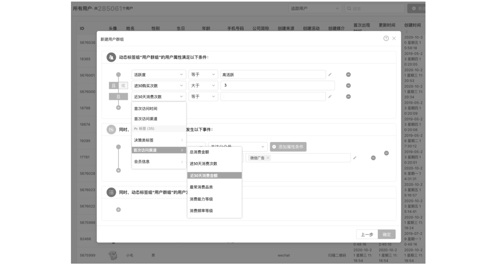

这里通过一个场景来介绍基于用户标签圈选用户群组的应用。某女装大促活动期间，
渠道运营人员需要筛选出平台上的优质用户，并通过短信、邮件、Push 等渠道进行营销

* 第 1 步：通过圈选“浏览”“收藏”“加购”“购买”“搜索”与该女装相关品类的标签来筛选出可能对该女装感兴趣的潜在用户
* 第 2 步：组合其他标签（如“性别”“消费金额”“活跃度”等）筛选出对应的高质量用户群，推送到对应渠道。

因此，将用户属性、行为事件数据抽象成标签后，可通过组合标签方式找到目标潜在用户人群。
从这个角度理解，用户群组是用户标签应用的一种方式

# 建立标签和标签体系

用户画像一般按照业务属性划分为多个类别模块，具体的画像还要看产品的形态，
比如：金融领域，电商领域都会有各自不同的画像类型 

一些常见的用户画像标签：

- 人口统计
   - 基本属性
      - 姓名
      - 性别
      - 出生年月
      - 籍贯
      - 婚姻
      - 学历
   - 注册属性
      - 手机
      - 邮箱
      - 注册渠道
      - 注册方式
      - 注册时间
- 社会属性
   - 家庭属性
      - 家庭组ID
      - 家庭类型
      - 家庭人数
      - 家庭小孩标签
      - 家庭老人标签
      - 家庭汽车标签
   - 公司属性
      - 公司ID
      - 工作地点
      - 公司行业
      - 公司职位
      - 收入
   - 终端设备属性
      - 手机设备ID
      - 手机类型
- 用户消费
   - 消费属性
      - 消费金额
      - 消费次数
      - 消费广度
      - 首次消费时间
      - 最后一次消费时间
      - 消费间隔频次
   - 价值属性
      - 价格指数
      - 流失指数
      - 忠诚指数
   - 消费周期
      - 潜在用户标签
      - 新课标签
      - 老客标签
      - VIP用户标签
      - 流失用户标签
- 用户行为
   - 活跃属性
      - 登录次数
      - 登录时长
      - 登录深度
   - 行为属性
      - 评论数
      - 点赞数
      - 收藏数
      - 浏览数
   - 偏好属性
      - 价格偏好
      - 类目偏好
      - 特征偏好
      - 下单时间偏好
   - 风险属性
      - 欺诈风险
      - 退换货风险
      - 黄牛风险

## 标签的分类

标签本身会有很多分类方式，但从标签的实现规则来看，大致可以分为以下三种类型：

1. 统计类标签
2. 规则类标签
3. 机器学习挖掘类标签

### 统计类标签

这类标签是最为基础也最为常见的标签类型，例如，对于某个用户来说，其性别、年龄、城市、星座、
近 7 日活跃时长、近 7 日活跃天数、近 7 日活跃次数等字段可以从用户注册数据、用户访问、消费数据中统计得出。
该类标签构成了用户画像的基础

### 规则类标签

该类标签基于用户行为、用户属性和确定的规则产生。例如，对平台上“消费活跃”用户这一口径的定义为“近 30 天交易次数 ≥ 2”。
在实际开发画像的过程中，由于运营人员对业务更为熟悉，而数据人员对数据的结构、分布、特征更为熟悉，
因此规则类标签的规则由运营人员和数据人员共同协商确定

### 机器学习挖掘类标签

该类标签通过机器学习挖掘产生，用于对用户的某些属性或某些行为进行预测判断。
例如，根据一个用户的行为习惯判断该用户是男性还是女性、根据一个用户的消费习惯判断其对某商品的偏好程度。
该类标签需要通过算法挖掘产生

在项目工程实践中，一般统计类和规则类的标签即可以满足应用需求，在开发中占有较大比例。
机器学习挖掘类标签多用于预测场景，如判断用户性别、用户购买商品偏好、用户流失意向等。
一般地，机器学习标签开发周期较长，开发成本较高，因此其开发所占比例较小

事实上，最终标签体系中是以用户视角定义的，需要结合具体的业务。比如某电商业务标签分类，
用户属性维度标签、用户行为维度标签、用户消费维度标签、风险控制维度标签、社交属性维度标签

## 标签建设流程

下图是一个标签建设流程，会侧重产品经理视角，主要描述需求的分析过程和产出文档，同时对标签的开发原理进行简单总结

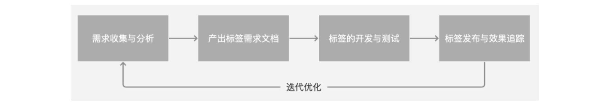

### 需求收集与分析

在需求收集与分析环节，可以按以下步骤进行：


某服装零售商，通过布局线上商城和线下实体店来扩大经营。线上的话，主要是通过微信公众号引流到小程序，
然后在小程序完成交易。下面通过该服装零售案例，具体描述下，如何进行标签需求的收集与分析：

1. 识别分析业务流程和业务场景触点

用户画像是基于业务的，因此，构建标签的第一个步骤就是识别与分析用户的决策流程和业务场景，以便快速熟悉业务。
参考下方案例业务流程的还原：

首先是通过各种场景被吸引来的微信用户关注公众号成为了粉丝，
然后公众号运营人员会给微信粉丝推送图文消息进行粉丝运营，
同时把粉丝引流到小程序商城，公众号粉丝最终会在小程序商城成交转化。
在整个过程中，公众号运营人员会持续进行微信粉丝的维护和流失粉丝的挽回等运营工作

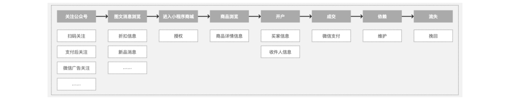

此处推荐：《有效需求分析》中详细需求篇业务功能支持主线需求分析方法

2. 明确每个业务场景触点的商业目的

这一步基于之前对业务流程的梳理，洞察业务问题，明确想要达到什么商业目的，并对商业目的进行拆分。参考下方案例从明确整体商业目标，到商业目标拆解和量化的过程：

O：假设该服装零售商线上的布局已经比较完善，现阶段的首要商业目的就是提升销售金额，因此“提升销售金额”就是该零售电商的北极星指标，那么提升流量、提升转化率、提升客单价、提升复购率就是拆解后的核心指标。

S：此处假设想要提升进入小程序商城的流量，可以采取的策略也很多。比如，通过扫码关注后推送优惠券方式吸引更多的微信用户关注成为粉丝；再比如，产出更高质量微信图文，更好的运营微信私域流量。

M：紧接上一步，针对推送优惠券吸引用户关注公众号这个策略，我们可以重点关注通过扫码方式关注公众号比率、取关的比率，新旧粉丝的比率

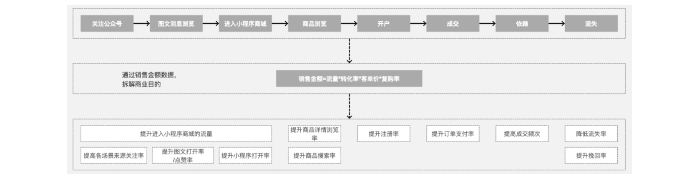

此处推荐：

* OSM 模型（Objective、Strategy、Measurement）
* 销售公式=流量*转化率*客单价*复购率

3. 从商业目的导向运营策略设计及用户标签需求

针对不同商业目的，对标签体系的建设也是不一样的，因此要从运营策略推导出标签。
比如业务部门要做个性化推荐，做关于物或者人的兴趣、偏好的标签会比较有价值；
但是如果要做精细化运营，关于用户的留存、活跃标签会更有价值。参考下方用户标签选用的案例：

把提升扫码方式关注率作为量化的目标，选用的运营策略是通过推送优惠券方式吸引微信用户扫码，
新粉丝扫码关注后推送 100 元优惠券，老粉丝扫码后推送50元优惠券，
那么执行运营策略过程中需要用到“是否新粉丝”这个标签

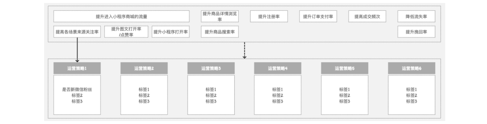

在此阶段，可以准备一个简单的记录沟通内容的 Excel 模板，列表头包括标签名、标签规则、使用场景等，
和业务方一起把沟通内容记录下来

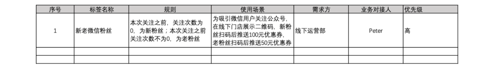

4. 组织标签

关于组织标签，需要基于对业务和策略的理解，以用户视角进行分类管理。下面是一个参考框架：

* 用户属性类标签：性别、年龄、省份、城市、注册日期、手机号码等
* 用户行为类标签：近 30 日访问次数、近 30 日客单价、近 30 日活跃天数、近 30 日访问时长、平均访问深度等
* 用户消费类标签：收入状况、购买力水平、已购商品、购买渠道偏好、最后购买时间、购买频次等
* 商品品类类标签：高跟鞋、靴子、衬衫、法式连衣裙、牛仔裤等
* 社交属性类标签：经常活跃的时间段、活跃地点、单身、评价次数、好评度等

### 产出标签需求文档

经过前面的需求收集与分析，已明确了业务方的标签需求。为了顺利交付研发，接下来还需要：

**撰写标签体系文档 —> 根据标签规则确定埋点 —> 撰写数据需求文档**

1. 撰写标签体系文档。在此环节，数据产品经理需要根据前期和业务方的沟通内容，产出具体的标签体系文档：
    - 标签 ID：例如，ATTRITUBE_U_01_001，其中 “ATTRITUBE” 为人口属性主题，
      “_” 后面的 ”U” 为 userid 维度，“_” 后面 “01” 为一级归类，
      最后面的 “001” 为该一级标签下的标签明细
    - 标签名称：英文格式名称，例如，famale
    - 标签汉语：女
    - 标签主题：描述标签所属的主题，例如，用户属性维度标签、用户行为维度标签、用户消费维度标签
    - 标签层级ID：标签所属的层级，一般会分为2级
    - 名称：与ID对应的名称
    - 标签类型：统计类标签、规则类标签、机器学习算法类标签
    - 更新频率：实时更新、离线T+1更新、单次计算
    - 标签算法规则：需要描述选择哪张数据表中的具体哪个字段，若需要多张表做关联，还需要说明通过什么字段进行 join
      具体的算法逻辑和统计周期，比如“近7天支付次数”，就是需要统计近7天支付的总次数
    - 使用场景描述
    - 排期
    - 开发人
    - 需求方
    - 优先级
2. 根据标签规则确定埋点
    - 前面已经明确了标签的算法规则，接下来要进一步确定应该埋哪些点来采集所需的数据，下面是一个具体案例：
      针对“购买商品品类偏好”这个标签，会用到点击下单按钮事件数据，以及商品名称、商品分类等事件属性数据，
      那么就需要对点击下单按钮事件进行埋点
3. 撰写数据需求文档。埋点取哪些数据已经确定了，就需要产出具体的数据需求文档，交付负责埋点的开发同事进行埋点取数了。
   在数据需求文档，应该明确以下内容：
    - 埋点名：click_order
    - 埋点显示名：点击下单按钮
    - 上报时机：根据实际情况，选择是何时进行上报。比如对于点击下单事件，可以选择点击了下单按钮时就进行上报
    - 埋点形式：根据实际情况，选择是客户端埋点，还是服务端埋点。比如“购买商品品类偏好”标签的下单按钮点击事件，
      因为只是想判断用户对购买商品的偏好，用户点击按钮后已经能说明是否有偏好了，不需要等服务端返回是否成功的提醒，
      因此适合采用客户端埋点形式
    - 属性名：事件属性的名称，比如点击下单按钮事件的商品名称属性
    - 属性值：比如衬衫
    - 备注

实际工作中，撰写标签体系文档、根据标签规则确定埋点、撰写数据需求文档，会是一个互相完善补充的过程

### 标签的开发

在整个工程化方案中，系统依赖的基础设施包括 Spark、Hive、HBase、Airflow、MySQL、Redis、Elasticsearch。
除去基础设施外，系统主体还包括ETL作业、用户画像主题建模、标签结果数据在应用端的存储 3 个重要组成部分。
如图所示是用户画像数仓架构图，下面对其进行简单介绍

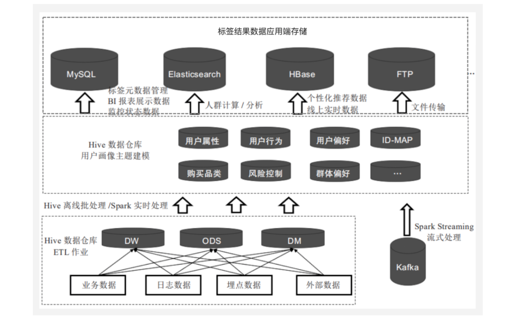

1. Hive 数据仓库 ETL 作业
    - 下方虚线框中为常见的数据仓库 ETL 加工流程，也就是将每日的业务数据、日志数据、埋点数据等经过 ETL 过程，
      加工到数据仓库对应的 ODS 层、DW 层、DM 层中
2. Hive数据仓库用户画像主题建模
    - 中间的虚线框即为用户画像建模的主要环节，会对基于数据仓库 ODS 层、DW 层、DM 层中与用户相关数据进行二次建模加工
3. 标签结果数据在应用端的存储
    - 在用户画像主题建模过程中，会将用户标签计算结果写入 Hive，由于不同数据库有不同的应用场景，下面分别进行描述：
        - MySQL：作为关系型数据库，在用户画像中可用于元数据管理、监控预警数据、结果集存储等应用中。
          下面详细介绍这 3 个应用场景：
            - 元数据管理：MySQL具有更快的读写速度，平台标签视图中（Web 端产品）的标签元数据可以维护在 MySQL 关系数据库中，
              便于标签的编辑、查询和管理
            - 监控预警数据：在对画像的数据监控中，调度流每跑完相应的模块，就将该模块的监控数据插入 MySQL 中，
              当校验任务判断达到触发告警阈值时，就触发告警
            - 结果集存储：存储多维透视分析用的标签、圈人服务用的用户标签、当日记录各标签数量等。
        - HBase
            - 与 Hive 不同的是，HBase 能够在数据库上实时运行，而不是跑 MapReduce 任务，适合进行大数据的实时查询。
              下面通过一个案例来介绍 HBase 在画像系统中的应用场景和工程化实现方式：
              某渠道运营人员为促进未注册的新安装用户注册、下单，
              计划通过 App 首页弹窗发放红包或优惠券的方式进行引导。
              每天画像系统的 ETL 调度完成后对应人群数据就被推送到广告系统（HBase 数据库进行存储）。
              满足条件的新用户来访 App 时，由在线接口读取 HBase 数据库，在查询到该用户时为其推送该弹窗
        - Elasticsearch
            - 是一个开源的分布式全文检索引擎，可以近乎实时地存储、检索数据。
              对于用户标签查询、用户人群计算、用户群多维透视分析这类对响应时间要求较高的场景，
              也可以考虑选用 Elasticsearch 进行存储

### 标签发布与效果追踪

通过开发测试，上线后需要持续追踪标签应用效果及业务方反馈，调整优化模型及相关权重配置

# 用户画像产品化

从业务价值来说，标签和画像类似一个为前台服务提供数据支持的中间层系统模块。
开发完画像标签数据，如果只是“躺在”数据仓库中，并不能发挥更大的业务价值。
只有将画像数据产品化后才能以标准方式提升数据处理链路上各个环节的效率，同时也更便于业务方使用。
下面分别从产品化后涵盖的标签生产架构和功能模块两个角度进行总结

## 用户画像产品系统架构

下图是一个用户画像产品系统的结构图，数据是从左到右的，
主要包括数据采集、数据接入、数据整合/标签计算、标签应用 4 个层级。
下面尝试对其进行简单描述：

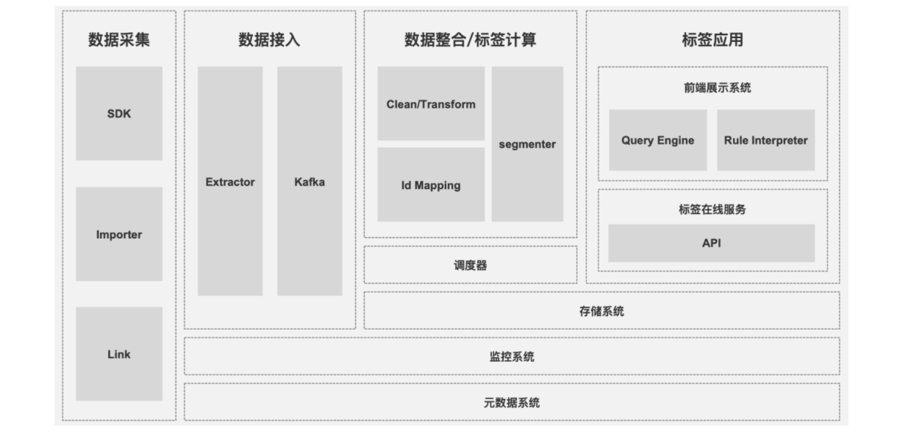

### 数据采集

在数据采集模块，主要通过客户端/服务端 SDK、导入、对接第三方应用3种埋点方式进行日志数据、业务数据、第三方数据的采集

1. SDK
    - 客户端 SDK：通过客户端 SDK 埋点，可以采集 iOS、Android、小程序、网站等各种客户端的用户行为数据和用户属性信息
    - 服务端 SDK：若数据已经存在数据库、数据仓库，比如订单信息，可以使用对应开发语言的服务端 SDK 进行数据的采集
2. Importer
    - 可以根据运行环境、源数据格式、导入数据量的大小等影响因素，选择不同大导入方式，把历史文件数据导进用户画像产品系统
3. Link
    - 针对不同第三方产品 OpenAPI 的特点，采用接收事件消息推送、或主动轮询方式采集用户在不同第三方应用系统的个人属性和行为事件数据

### 数据接入

埋点数据先大量进入 Kafka，然后慢慢消费接入后续的数据整合存储系统

### 数据整合和标签计算

在用户画像系统中，主要使用 Hive 作为数据仓库，进行 ETL 处理，
开发相应的用户属性表和用户行为表，以及标签的计算

1. 数据整合

各种渠道接进来的数据，存在孤立、空值、格式不对应、超过极限范围等数据质量问题，
因此需要进行脏数据清洗、格式转换、用户识别与合并等整合工作：

* (1) Clean/Transform
    - Clean：比如，某个用户的出生年月时间是未来的某个日期时刻，因此就需要把这类脏数据给过滤掉
    - Transform：比如，通过某个第三方应用 API 获取到的所有用户的地区信息是 IPB 标准编码形式，
      为了能和其他渠道的信息一起进行分析，就需要根据 IPB 标准编码转换成标准的省、市格式
* (2) Id Mapping
    - 各个渠道接进来的用户属性数据、行为事件数据等都是孤立的，为了能计算用户的全方位的综合标签，
      就需要做用户的识别合并，比如通过 unionID，识别合并绑定在同一微信开放平台的公众号、小程序、
      网站的同一个用户的信息

经过数据整合处理，数据会进入下面的数据模型中：

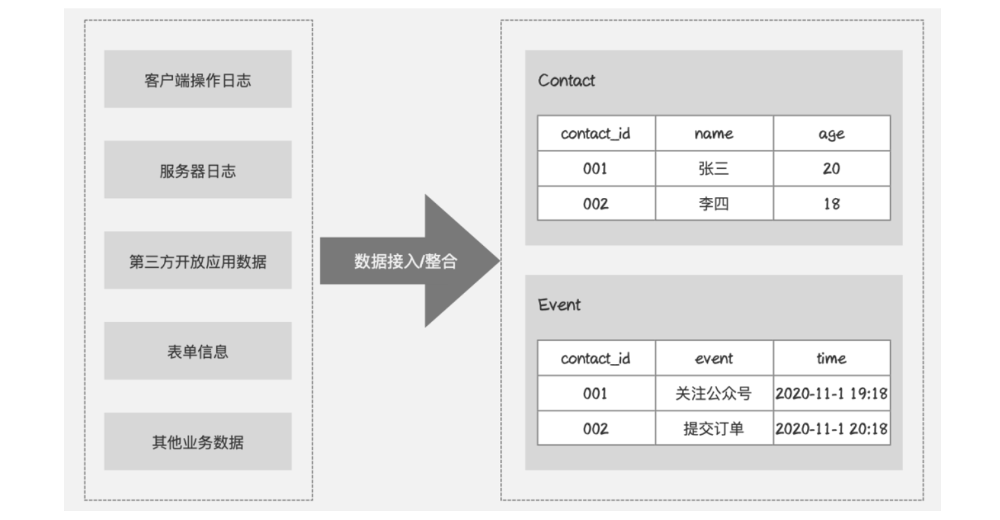

2. 标签计算

在用户画像系统，会做一套批量离线的标签处理引擎，依赖的是底层比较稳定的数据结构。
这个标签引擎一边读事件数据，一边读用户的属性数据，再配合上特定的标签规则，
做一个批量计算，最后生成用户标签

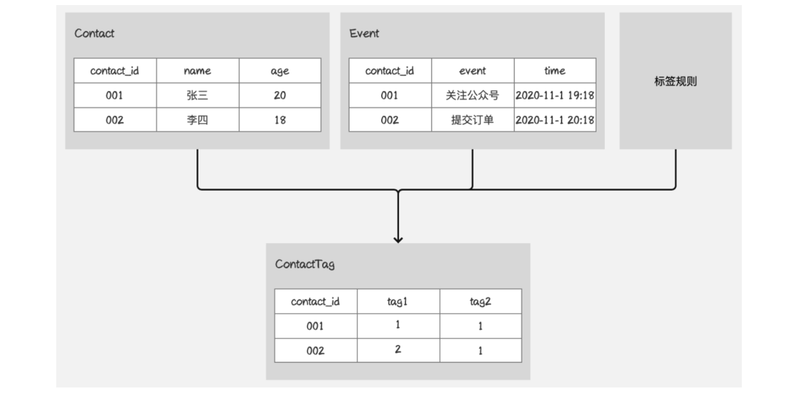

### 标签应用

标签的应用主要分为前端画像展示、通过API接入其他系统两大类应用方式

## 用户画像铲平功能模块

### 系统看板

通常用户画像系统的数据看板，以可视化形式展示企业的核心用户数据资产情况或者重点关注的人群数据。
旨在建立和统一使用者对企业数据资产或者核心人群数据的基础认知，主要分成以下几类：

1. 用户量级及变化趋势：不同设备类型 ID 量级、不同类型用户量级(如注册与非注册用户、付费与非付费用户等)
2. 标签资产：按主要类目统计标签个数等 
3. 核心用户标签：展示固有或自定义人群的关键标签画像数据等

### 标签管理

供业务人员进行标签的增、删、改、查等操作，包含：标签分类、新建标签、标签审核、标签上下架、标签覆盖人数监控等。
基于用户行为数据、用户属性数据，通过设置标签规则创建标签

### 单用户画像

主要能力包含通过输入用户 ID，来查看单用户画像的详情数据，如用户的属性信息、用户行为等数据

### 用户分群和用户群画像

1. 用户分群

用户分群功能主要是面向业务人员使用。产品经理、运营、客服等业务人员在应用标签时，
可能不仅仅只查看某一个标签对应的人群情况，更多地可能需要组合多个标签来满足其在业务上对人群的定义。
例如：组合“过去 7 天领取优惠券次数大于 1 次”、“活动活跃度等于高和极高”、“女性”用户这 3 个标签定义目标人群，
查看该类人群覆盖的用户量

2. 用户群画像

和用户分群功能相似，用户群画像功能首先也需要组合标签圈定用户群体，
不同之处在于用户群画像功能支持从多个维度去分析圈定用户群体的特征，
而用户分群功能侧重的是将筛选出来的用户群推送到各业务系统中，提供服务支持

### BI 分析

BI 平台和这些数据打通后，可以丰富数据的维度，支持通过多种分析模型进行更加丰富和深层的分析及对比

### OpenAPI

OpenAPI 能够保障画像系统数据与各系统之间打通，如 push 推送系统、营销系统、广告系统、推荐系统、BI 等平台，
并且保证各系统数据的实时更新，避免同源不同数的问题

# 用户画像应用

用户画像的应用：

- 精准营销
   - 方法：从粗放式到精细化，将用户群体切割成更细的粒度
   - 辅助手段：短信、推送、邮件、活动等
   - 营销策略：关怀、挽回、激励等
- 数据应用
   - 推荐系统
   - 广告系统
- 用户分析
   - 产品早期，PM们通过用户调研和访谈的形式了解用户。在产品用户量扩大后，
     调研的效用降低，这时候会辅以用户画像配合研究。新增的用户有什么特征，
     核心用户的属性是否变化等
- 数据分析
   - 用户画像可以理解为业务层面的数据仓库，各类标签是多维分析的天然要素
   - 数据查询平台会和这些用户数据相连通

## 经营分析

用户画像系统的标签数据通过 API 进入分析系统后，可以丰富分析数据的维度，支持进行多种业务对象的经营分析。
下面总结的是一些市场、运营、产品人员分析时会关注的指标：

### 流量分析

1. 流量来源
2. 流量数量：UV、PV
3. 流量质量：浏览深度（UV、PV）、停留时长、来源转化、ROI（投资回报率，return on investment）

### 用户分析

1. 用户数量：新用户数、老用户数、新/老用户数量比
2. 用户质量：新增用户数（App 启动）、活跃用户数（App 启动）、用户留存（App 启动-App 启动）、用户参与度、沉睡、客单价

### 商品分析

1. 商品动销：GMV、客单价、下单人数、取消购买人数、退货人数、各端复购率、购买频次分布、运营位购买转化
2. 商品品类：支付订单情况（次数、人数、趋势、复购）、访购情况、申请退货情况、取消订单情况、关注情况

### 订单分析

1. 订单指标：总订单量、退款订单量、订单应付金额、订单实付金额、下单人数
2. 转化率指标：新增订单/访问 UV、有效订单/访问 UV

###  渠道分析

1. 用户活跃
    - 活跃用户：UV、PV
    - 新增用户：注册量、注册同环比
2. 用户质量
    - 留存：次日/7日/30日留存率
3. 渠道收入
    - 订单：订单量、日均订单量、订单同环比
    - 营收：付费金额、日均付费金额、金额同环比
    - 用户：人均订单量、人均订单金额

### 产品分析

1. 搜索功能：搜索人数/次数、搜索功能渗透率、搜索关键词
2. 关键路径漏斗等产品功能设计分析

## 精准营销

### 短信/邮件/push营销

日常生活中我们经常会从许多渠道接收到营销来的信息。
一条关于红包到账的短信消息推送可能会促使用户打开已经很久没访问的 App，
一条关于心愿单里面图书降价的邮件消息推送可能会刺激用户打开推送链接直接下单购买。
具体有哪些类型的营销方式呢？大致可以分为以下 4 类：

1. 基于行为营销：产品浏览、加入购物车、门店扫码、订单取消、订单退货等
2. 基于位置营销：周边门店、周边活动、常去区域等
3. 基于节日营销：生日、春节、双十一、双十二、圣诞等
4. 基于会员营销：欢迎入会、卡券提醒、积分变更、等级变化、会员礼遇等

### 客服话术

当我们在向某平台的客服部门投诉、咨询或反馈意见时，客服人员可以准确的说出我们在平台的购买情况，
上一次咨询问题的处理结果等信息，针对性的提出解决方法，对于高价值用户提供 VIP 客服通道等专项服务

## 个性化推荐与服务

应用的运营者，可以通过个推用户画像中的性别、年龄段、兴趣爱好、浏览购买行为等标签，给用户推荐不同的内容。
如今日头条上的个性化文章内容推荐、抖音上基于用户画像做的个性化视频内容推荐、
淘宝上基于用户浏览行为等画像数据做的个性化商品推荐等

# 用户画像实践案例

基于画像系统去做多方面的数据分析、触达用户的运营方案，可以快速地将标签数据应用到服务层（T+1、实时应用），
通过效果分析得到用户反馈后，帮助迭代营销策略或产品设计。下面通过一些实践案例来场景化复现用户画像的应用点和应用方式

## AB 人群效果测试

### 案例背景

某零食类快消商品为在大促活动期间获得较好的销量，计划通过消息推送的方式种草新上市产品、产品的保健功能等系列文章，
为大促活动造势，激发销量转化。为了精准定位目标人群流量，渠道运营人员现在计划做两个 A/B 人群效果测试： 

1. 不同内容标题对流量的影响 
2. 精准推送相比普通推送带来的流量提升

### 用户画像切入点

整个项目中需要梳理清楚如何切分 AB 组流量，如何设计好 AB 组人群规则和效果监测。
下面分步骤介绍画像系统如何切入 AB 人群测试中 

1. 对 AB 组用户做切分 
    - 为了做 A/B 组测试，首先需要做好流量的切分，可以使用 A/B 分配随机分流的形式，将用户划分为 A/B 人群
2. 测试文案标题对流量影响的方案 
    - 某平台渠道运营人员为在大促活动期间召回更多用户来访 App，计划在活动预热期选取少量用户做一版文案标题的 AB 效果测试


在该测试方案中，控制组 A 选取了 A 路径、近 x 天来访过，且近 x 天内浏览/收藏/加购过该零食的用户群，
给该批用户推送零售文案 A；对照组 B 选取了 B 路径、近 x 天来访过，且近 x 天内浏览/收藏/加购过该零食的用户群，
给该批用户推送零食文案 B。控制组和对照组的用户量相同，但文案不同，后续监控两组人群的点击率大小，
进而分析不同文案对用户点击的影响 

例如，通过用户群组功能圈选出 A 组的用户，见下图：

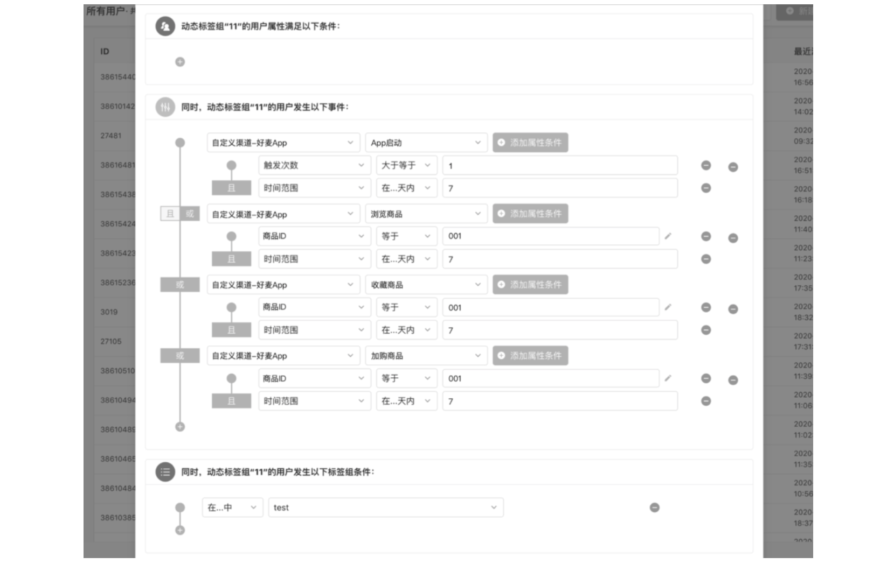

3. 精准推送相比普通推送带来的流量提升的测试方案 

在使用画像系统精细化推送人群前，某平台对用户采用无差别推送消息的形式进行推送。
为了测试精细化运营人群相比无差别运营带来的流量提升，
渠道运营人员决定在近期重点运营的零食营销会场做一个 AB 效果测试 

该测试方案中，控制组 A 选取了 A 路径、近 x 天来访过，近 x 天内浏览/收藏/加购过该零食的用户群；
对照组 B 选取了 B 路径、近 x 天来访过，且没有类目偏好的用户群。对 AB 组用户群都消息推送相同的文案，
后续监控两组人群的点击率大小，进而分析精准营销推送带来的增长点大小

### 效果分析

在 AB 组人群消息推送上线后，后续需要搭建监控报表来监测控制组和测试组的流量和转化情况，
主要关注下方列表中的指标：

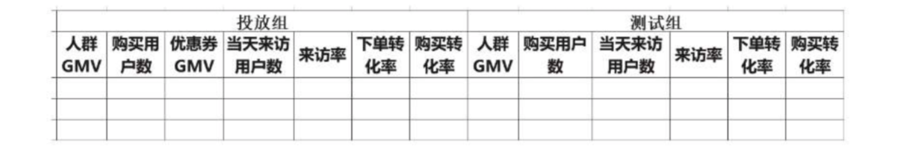

例如，使用事件分析模型搭建的 AB 人群的 GMV 对比报表，见下图：

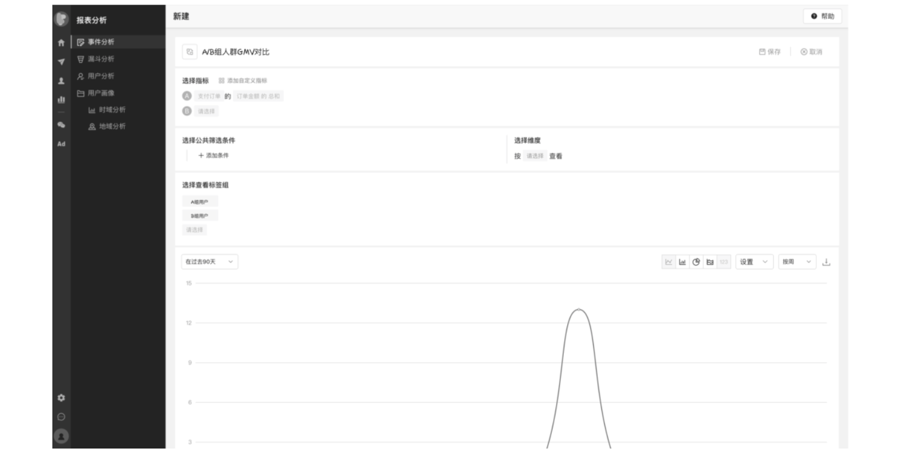

## 女神节定向营销

### 案例背景

某主打女士商品的品牌商，计划在女神节对不同品类偏好的女神进行定向营销。
营销信息会分两次推送，首次是在当天的 10:00 推送促销信息，第二次是在当天晚上的 10:00 再统一来一波促销提醒。
最后通过追踪目标受众的当日支付订单完成率来评估营销效果

### 实现逻辑

首先基于用户性别标签、年龄标签圈选出 18~40 岁，女性的用户。然后统一延时至 2020－03－08 上午 10:00，
根据用户品类偏好标签定向推送不同的营销内容，比如给品类偏好=彩妆护肤的人群推送春日美妆节类的营销信息。
第二波推送会延时至 2020－03－08 下午 10:00 进行推送，推送信息为统一的促销提醒

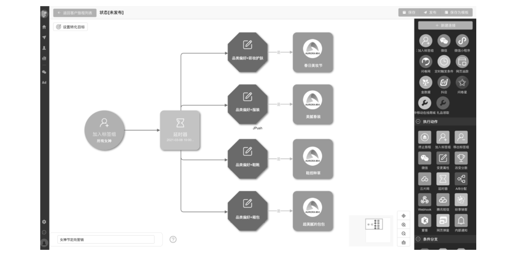

## 新安装未注册用户实时营销

### 案例背景

某零食商城 App 运营人员为促进未注册的新安装用户注册、下单，制定了运营规则：新安装未注册用户打开 App 时，
通过 App 弹窗方式为其推送优惠券进行营销。比如，用户安装 App 后未进行注册，
用户改天打开后立马对其推送 App 弹窗优惠券，以更好地引导用户完成注册、下单

### 用户画像切入点

渠道运营人员通过组合用户标签（如“未注册用户”和“安装距今天数”小于××天）筛选出对应的用户群，
然后选择将对应人群推送到“广告系统”。这样每天画像系统的 ETL 调度完成后对应人群数据就被推送到 HBase 数据库进行存储。
满足条件的新用户来访 App 时，由在线接口读取 HBase 数据库，在查询到该用户时为其推送该弹窗

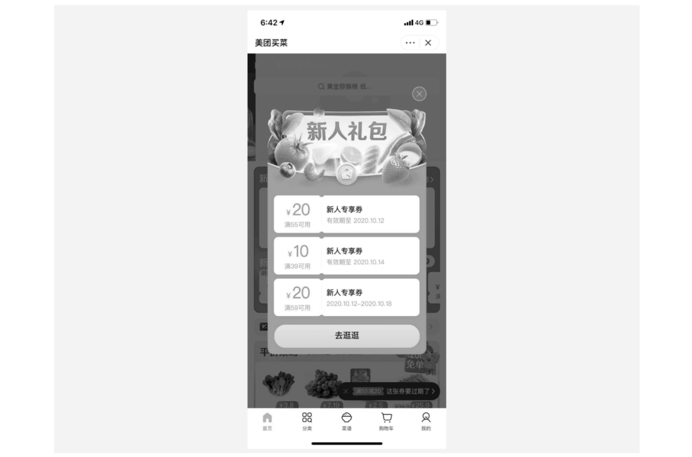

## 某电商再营销广告

### 案例背景

某电商 App 的商品运营团队欲提升电子产品的老客复购率、新客下单率，于是选择了和头条合作投放再营销广告。
比如，某用户在该电商 App 看了 vivo 手机，第二天刷今日头条的时候，就看到了对应手机的广告信息

### 实现逻辑

首先需要保证该电商 App 和今日头条的 API 已经打通，
然后基于用户在 App 内行为（浏览、收藏、加购、搜索等）进行算法挖掘产生用户商品偏好的标签。
当今日头条捕获用户设备信息后，就会向该电商发送一个请求，询问是否需要对这个用户展示广告。
这个时候电商平台会判断该用户是否是自己的用户，如果是自己用户，就会对今日头条返回一个推荐结果，
那么用户就会在今日头条看到之前浏览过的商品信息了，点击后就可以跳转到电商 App 内的商品详情页了

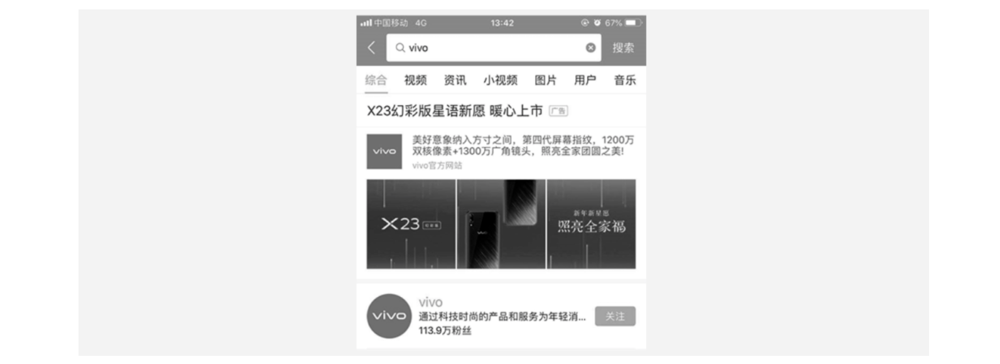

