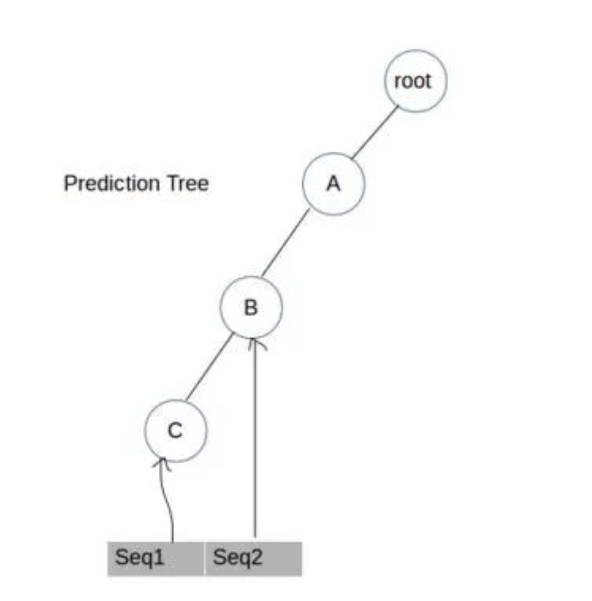

<style>
details {
    border: 1px solid #aaa;
    border-radius: 4px;
    padding: .5em .5em 0;
}
summary {
    font-weight: bold;
    margin: -.5em -.5em 0;
    padding: .5em;
}
details[open] {
    padding: .5em;
}
details[open] summary {
    border-bottom: 1px solid #aaa;
    margin-bottom: .5em;
}
img {
    pointer-events: none;
}
</style>

<details><summary>目录</summary><p>

- [序列预测](#序列预测)
- [CPT 算法](#cpt-算法)
  - [CPT 数据结构](#cpt-数据结构)
    - [预测树](#预测树)
    - [倒排索引](#倒排索引)
    - [查找表](#查找表)
  - [CPT 训练](#cpt-训练)
    - [第一步: 插入序列 ABC](#第一步-插入序列-abc)
    - [插入序列 AB](#插入序列-ab)
    - [插入序列 ABDC](#插入序列-abdc)
    - [插入序列 BC](#插入序列-bc)
  - [CPT 预测](#cpt-预测)
    - [第一步：查找与目标序列相似的序列](#第一步查找与目标序列相似的序列)
    - [第二步：查找与目标序列相似的后续序列](#第二步查找与目标序列相似的后续序列)
    - [第三步：将相应的元素添加到“计数词典”中，同时添加它们的分值](#第三步将相应的元素添加到计数词典中同时添加它们的分值)
    - [第四步：利用Counttable的值进行预测](#第四步利用counttable的值进行预测)
- [CPT 应用](#cpt-应用)
  - [CPT 源码](#cpt-源码)
- [示例](#示例)
</p></details><p></p>

# 序列预测

当可以预测某个特定事件可能会在另一个事件之后发生时，就需要进行序列预测，而且我们需要预测整个事件。
序列预测是一类广泛应用于各个行业的重要问题，例如：

* 网页预取-给定用户访问的网页序列，浏览器可以预测用户访问的最有可能的页面并预加载它。这会节省时间和改善用户体验。
* 产品推荐-根据用户将产品添加到其购物列表中的顺序来推荐用户可能感兴趣的产品。
* 临床事件的序列预测--鉴于病人的病史，可以利用序列预测对未来的疾病进行鉴别诊断。
* 天气预报-根据先前的天气情况，预测下一时间的天气。

解决这类问题，LSTMS/RNN 已经成为顺序数据建模的热门选择，无论是文本、音频等。然而，他们有两个基本问题：

* 训练时间太长，通常需要几十个小时
* 当序列中包含在以前的训练迭代中没有看到的项目时，需要重新训练。
  这个过程代价特别高，在经常遇到新项目的情况下是不可行的

实现序列预测的方法多种多样，如机器学习域的马尔可夫模型、有向图等、深度学习域的 RNNS/LSTM 等等

# CPT 算法

紧致预测树 Compact Prediction Tree (CPT) 用来执行序列预测。这是一个令人惊讶的简单技术，
它比一些非常著名的方法比如：Markov 方法、有向图等等更为强大

## CPT 数据结构

CPT 算法使用了三种基本的数据结构

### 预测树

预测树基本上是一种 TRIE 数据结构，它将整个训练数据压缩成一棵树的形式。
对于下面的序列：

* 序列 1: A - B - C
* 序列 2: A - B - D

TRIE 数据结构从序列 A - B - C 的第一个元素 A 开始，并将其添加到根节点 Root，
然后元素 B 被添加到 A，C 被添加到 B 中。序列 A、B、D 则从 B 开始，D 被添加到 B 中。
产生的数据结构如下图，这就是预测树如何有效地对训练数据进行压缩


预测树带有多个节点，每个节点有三个数据元素，例如：

* 数据项存储在节点中的实际数据项
* 子节点：该节点是所有子节点的列表
* 父节点：指向此节点的父节点的链接或引用

### 倒排索引

倒排索引是一种字典，其中的键(key)是训练集中的数据项，值(value)是该项出现的序列 ID 的集合，例如：

* 序列 1: A - B - C - D
* 序列 2: B - C
* 序列 3: A - B

```python
II = {
    "A": {"Seq1", "Seq3"},
    "B": {"Seq1", "Seq2", "Seq3"},
    "C": {"Seq1", "Seq2"},
    "D": {"Seq1"}
}
```

### 查找表

查找表是一个字典，带有序列 ID 和预测树中的序列的终端节点和键(key)，例如：

* 序列 1: A - B - C
* 序列 2: A - B - D 

```python
LT = {
    "Seq1": "C",
    "Seq2": "D"
}
```

## CPT 训练

示例数据集：

|     |   |   |   |   |
|-----|---|---|---|---|
| Seq1 | A | B | C |   |
| Seq2 | A | B |   |   |
| Seq3 | A | B | D | C |
| Seq4 | B | C |   |   |

训练阶段包括同时建立预测树、倒排索引(II)、查找表(LT)

### 第一步: 插入序列 ABC

预测树：


倒排索引：

| Item | Seq1 |
|----|----|
| A | 1 |
| B | 1 |
| C | 1 |

```python
II = {
    "A": {"Seq1"},
    "B": {"Seq1"},
    "C": {"Seq1"}
}
```

查找表：

1. 已经有一个根节点 Root 和一个初始设置为根节点的当前节点 A。
   从 A 开始，检查作为根节点的子节点 A 是否存在。如果没有，
   将 A 添加到根节点的子列表中，在带有值为 Seq1 的倒排索引中添加一个 A 的条目，
   然后将当前节点移到 A
2. 查看下一项，即 B，看看 B 是否作为当前节点的子节点存在，即 A。
   如果不存在，将 B 添加到 A 的子列表中，在带有 Seq1 值的倒排索引中添加 B 的条目，然后将当前节点移动到 B
3. 重复上面的过程，直到完成添加 Seq1 的最后一个元素为止。
   最后，使用 key=“Seq1” 和 value=node(C) 将 Seq1 的最后一个节点 C 添加到查找表中

```python
LT = {
    "Seq1": "C"
}
```

### 插入序列 AB

预测树：



倒排索引：

| Item | Seq1 | Seq2 |
|------|------|------|
| A    | 1    | 1    |
| B    | 1    | 1    |
| C    | 1    | 0    |

```python
II = {
    "A": {"Seq1", "Seq2"},
    "B": {"Seq1", "Seq2"},
    "C": {"Seq1"}
}
```

查找表：

```python
LT = {
    "Seq1": "C",
    "Seq2": "B"
}
```

### 插入序列 ABDC

预测树：


倒排索引：

| Item | Seq1 | Seq2 | Step3 |
|------|------|------|-------|
| A    | 1    | 1    | 1     | 
| B    | 1    | 1    | 1     | 
| C    | 1    | 0    | 1     | 
| D    | 0    | 0    | 1     | 

```python
II = {
    "A": {"Seq1", "Seq2", "Seq3"},
    "B": {"Seq1", "Seq2", "Seq3"},
    "C": {"Seq1", "Seq3"},
    "D": {"Seq3"}
}
```

查找表：

```python
LT = {
    "Seq1": "C",
    "Seq2": "B",
    "Seq3": "C",
}
```

### 插入序列 BC

预测树：


倒排索引：

| Item | Seq1 | Seq2 | Step3 | Step4 |
|------|------|------|-------|-------|
| A    | 1    | 1    | 1     | 0     |
| B    | 1    | 1    | 1     | 1     |
| C    | 1    | 0    | 1     | 1     |
| D    | 0    | 0    | 1     | 0     |

```python
II = {
    "A": {"Seq1", "Seq2", "Seq3"},
    "B": {"Seq1", "Seq2", "Seq3", "Seq4"},
    "C": {"Seq1", "Seq3", "Seq4"},
    "D": {"Seq3"}
}
```

查找表：

```python
LT = {
    "Seq1": "C",
    "Seq2": "B",
    "Seq3": "C",
    "Seq4": "C",
}
```

一直这样做下去，直到穷尽训练数据集中的每一行(记住，一行表示单个序列)。
现在，已经准备好了所有必需的数据结构，可以开始对测试数据集进行预测

## CPT 预测

预测阶段包括以迭代的方式对测试集中的每个数据序列进行预测。
对于单个行，使用倒排索引(II)找到与该行相似的序列。
然后，找出类似序列的结果，并将其添加到可计数字典中的数据项中，并给出它们的分值。
最后，使用“计数”返回得分最高的项作为最终预测

目标序列：A - B - C

### 第一步：查找与目标序列相似的序列

利用倒排索引找到与目标序列相似的序列。通过以下来识别：

* 找到目标序列中唯一的数据项
* 查找存在特定唯一数据项的序列 ID 集
* 然后，取所有唯一数据项集合的交集

### 第二步：查找与目标序列相似的后续序列

对于每个相似的序列，后续序列定义为在类似序列中目标序列最后一项发生后，
减去目标序列中存在的项之后的最长子序列。注意，这与开发人员在他们的研究论文中提到的不尽相同，
但我的这种实现方式似乎比他们的实现方式更适合

```python
# 目标序列
target_sequence = ["A", "B", "C"]
# 相似序列
similar_sequence = [
    ["X", "A", "Y", "B", "C", "E", "A", "F"]
]
# 目标序列中的最后一项
last_item_target_sequence = "C"
# Longest Sub-Sequence after last occurrence of "C" in Similar Sub-Sequence 
similar_sub_sequence = ["E", "A", "F"]
# 后续序列
consequent = ["E", "F"]
```

### 第三步：将相应的元素添加到“计数词典”中，同时添加它们的分值

将每个相似序列的后继元素与分数一起添加到字典中。例如上面的示例。随后的 `["E", "F"]` 项的得分计算如下：

```python
# 计算字典
counttable = {}
for item in consequent:
    if item not in counttable.keys():
        score = 1 + 1 / len(similar_sequence) + 1 / (len(counttable) + 1) * 0.001
        counttable[item] = score
    else:
        score = (1 + 1 / len(similar_sequence) + 1 / (len(counttable) + 1) * 0.001) * counttable[item]
        counttable[item] = score

counttable = {
    "E": 2.001,
    "F": 2.0005,
}

score["E"] = 1 + (1 / 1) + 1 / (0 + 1) * 0.001 = 2.001
score["F"] = 1 + (1 / 1) + 1 / (1 + 1) * 0.001 = 2.0005
```

### 第四步：利用Counttable的值进行预测

最后，返回作为预测值的 Counttable 数值最大的关键字。在上述示例中，E 作为预测返回

# CPT 应用

* [项目 GitHub](* 项目地址：https://github.com/NeerajSarwan/CPT)
* [介绍文章](https://mp.weixin.qq.com/s/ED_ogFw-LQx_92QFULkK4w)


## CPT 源码

* PredictionTree.py

```python
class PredictionTree():

    Item = None
    Parent = None
    Children = None
    
    def __init__(self, itemValue = None):
        self.Item = itemValue
        self.Children = []
        self.Parent = None
        
    def addChild(self, child):
        newchild = PredictionTree(child)
        newchild.Parent = self
        self.Children.append(newchild)
        
    def getChild(self,target):
        for chld in self.Children:
            if chld.Item == target:
                return chld
        return None
    
    def getChildren(self):
        return self.Children
        
    def hasChild(self,target):
        found = self.getChild(target)
        if found is not None:
            return True
        else:
            return False
        
    def removeChild(self,child):
        for chld in self.Children:
            if chld.Item == child:
                self.Children.remove(chld)
```

* CPT.py

```python
from PredictionTree import *
import pandas as pd
from tqdm import tqdm


class CPT():

    alphabet = None  # A set of all unique items in the entire data file
    root = None  # Root node of the Prediction Tree
    II = None  # Inverted Index dictionary, where key : unique item, value : set of sequences containing this item
    LT = None  # A Lookup table dictionary, where key : id of a sequence(row), value: leaf node of a Prediction Tree

    def __init__(self):
        self.alphabet = set()
        self.root = PredictionTree()
        self.II = {}
        self.LT = {}

    def load_files(self, train_file, test_file, merge = False):
        """
        This function reads in the wide csv file of sequences separated by commas and returns a list of list of those
        sequences. The sequences are defined as below.
        seq1 = A,B,C,D
        seq2  B,C,E
        Returns: [[A,B,C,D],[B,C,E]]
        """
        train = [] # List of list containing the entire sequence data using which the model will be trained.
        test = [] # List of list containing the test sequences whose next n items are to be predicted

        if train_file is None:
            return train_file

        training = pd.read_csv(train_file)

        for index, row in training.iterrows():
            train.append(row.values)

        if test_file is None:
            return train, test_file

        testing = pd.read_csv(test_file)

        for index, row in testing.iterrows():
            if merge:
                train.append(row.values)
            test.append(row.values)

        return train,test

    def train(self, train):
        """
        This functions populates the Prediction Tree, Inverted Index and LookUp Table for the algorithm.
        Input: The list of list training data
        Output : Boolean True
        """
        cursornode = self.root

        for seqid,row in enumerate(train):
            for element in row:
                # adding to the Prediction Tree
                if element == element: #different length sequence support
                    if cursornode.hasChild(element) == False:
                        cursornode.addChild(element)
                        cursornode = cursornode.getChild(element)
                    else:
                        cursornode = cursornode.getChild(element)
                    # Adding to the Inverted Index
                    if self.II.get(element) is None:
                        self.II[element] = set()
                    self.II[element].add(seqid)
                    self.alphabet.add(element)
            self.LT[seqid] = cursornode
            cursornode = self.root

        return True

    def score(self, counttable, key, length, target_size, number_of_similar_sequences, number_items_counttable):
        """
        This function is the main workhorse and calculates the score to be populated against an item. Items are predicted
        using this score.
        Output: Returns a counttable dictionary which stores the score against items. This counttable is specific for a
        particular row or a sequence and therefore re-calculated at each prediction.
        """
        weight_level = 1/ number_of_similar_sequences
        weight_distance = 1 / number_items_counttable
        score = 1 + weight_level + weight_distance * 0.001
        if counttable.get(key) is None:
            counttable[key] = score
        else:
            counttable[key] = score * counttable.get(key)

        return counttable

    def predict(self, train, test, k, n = 1):
        """
        Here target is the test dataset in the form of list of list,
        k is the number of last elements that will be used to find similar sequences and,
        n is the number of predictions required.
        Input: training list of list, target list of list, k,n
        Output: max n predictions for each sequence
        """
        predictions = []
        for each_target in tqdm(test):
            # different size sequence support
            i = 0
            while i < len(each_target) and each_target[i] == each_target[i]: # find NaN start
                i = i + 1
            l = i - k - 1
            if l < 0:
                l = 0
            each_target = each_target[l:i]
            intersection = set(range(0,len(train)))
            for element in each_target:
                if self.II.get(element) is None:
                    continue
                intersection = intersection & self.II.get(element)

            similar_sequences = []
            for element in intersection:
                currentnode = self.LT.get(element)
                tmp = []
                while currentnode.Item is not None:
                    tmp.append(currentnode.Item)
                    currentnode = currentnode.Parent
                similar_sequences.append(tmp)

            for sequence in similar_sequences:
                sequence.reverse()

            counttable = {}
            for  sequence in similar_sequences:
                try:
                    index = next(i for i,v in zip(range(len(sequence) - 1, 0, -1), reversed(sequence)) if v == each_target[-1])
                except:
                    index = None
                if index is not None:
                    count = 1
                    for element in sequence[index+1:]:
                        if element in each_target:
                            continue
                        counttable = self.score(
                            counttable,
                            element,
                            len(each_target),
                            len(each_target),
                            len(similar_sequences),
                            count
                        )
                        count += 1
            pred = self.get_n_largest(counttable, n)
            predictions.append(pred)

        return predictions

    def get_n_largest(self,dictionary,n):
        """
        A small utility to obtain top n keys of a Dictionary based on their values.
        """
        largest = sorted(dictionary.items(), key = lambda t: t[1], reverse = True)[:n]
        return [key for key, _ in largest]
```

# 示例

```python
from CPT import CPT

# data
train, test = mode..load_files("./data/train.csv", "./data/test.csv", merge = True)

# model
model = CPT()

# model train
model.train(train)

# model predict
predictions = model.predict(train, test, k, n)
```

