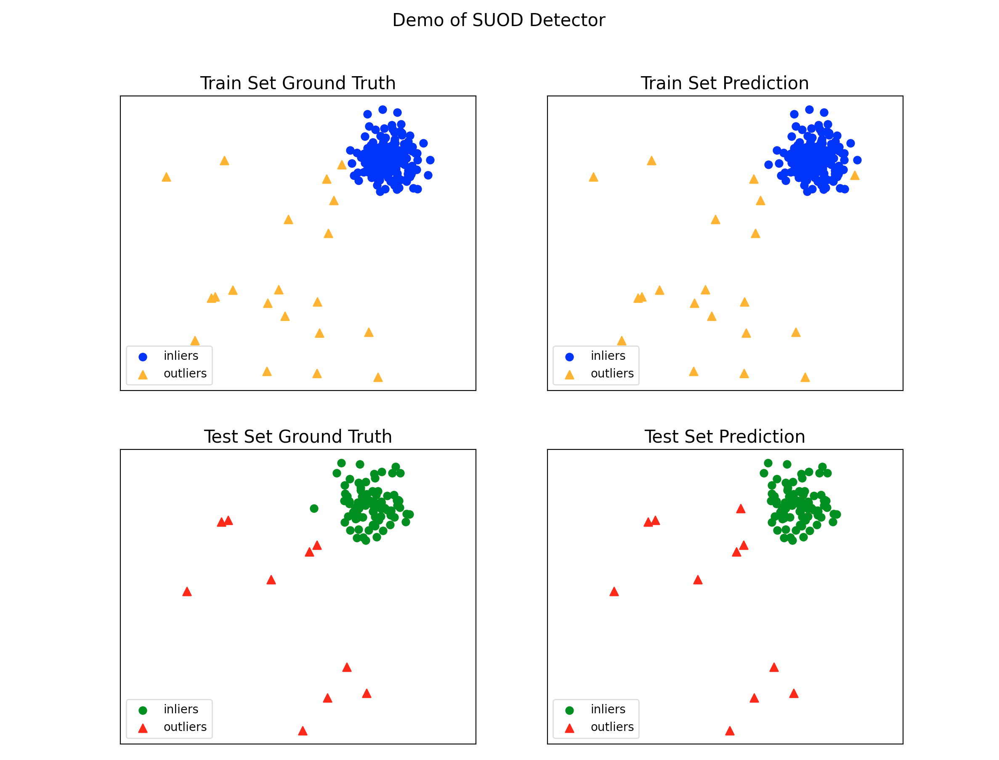
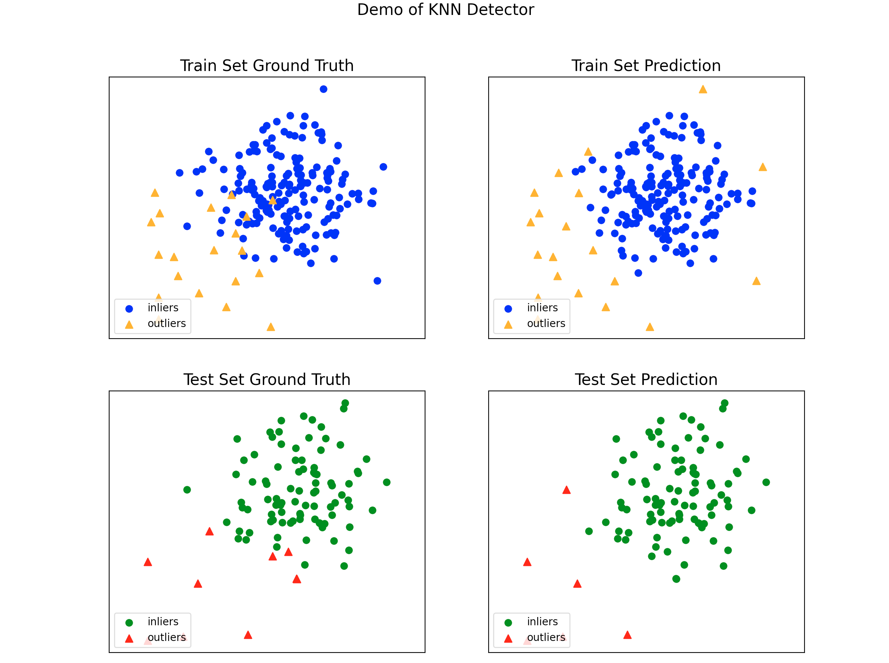

<style>
details {
    border: 1px solid #aaa;
    border-radius: 4px;
    padding: .5em .5em 0;
}
summary {
    font-weight: bold;
    margin: -.5em -.5em 0;
    padding: .5em;
}
details[open] {
    padding: .5em;
}
details[open] summary {
    border-bottom: 1px solid #aaa;
    margin-bottom: .5em;
}
</style>

<details><summary>目录</summary><p>

- [PyOD 简介](#pyod-简介)
  - [PyOD 的特点](#pyod-的特点)
  - [PyOD 异常值检测](#pyod-异常值检测)
- [PyOD 使用](#pyod-使用)
  - [安装](#安装)
  - [核心 API](#核心-api)
    - [模型拟合核心方法](#模型拟合核心方法)
    - [拟合模型的核心属性](#拟合模型的核心属性)
    - [工具函数](#工具函数)
    - [模型保存和加载](#模型保存和加载)
    - [使用 SUDO 加速训练](#使用-sudo-加速训练)
  - [模型融合](#模型融合)
  - [使用示例](#使用示例)
- [参考](#参考)
</p></details><p></p>

* 时间序列异常检测：TODS
* 图形异常检测：PyGOD
* PyOD

# PyOD 简介

PyOD 是最全面和可扩展的 Python 库，用于检测多变量数据中的离群对象。
PyOD 包括 40 多种检测算法，从经典的 LOF(SIGMOD 2000)到最新的 ECOD(TKDE 2022)

## PyOD 的特点

* 跨各种算法的统一 API、详细文档和交互式示例
* 高级模型，包括经典的距离和密度估计、最新的深度学习方法以及 ECOD 等新兴算法
* 使用 numba 和 joblib 使用 JIT 和并行化优化性能
* 使用 SUOD 进行快速训练和预测

## PyOD 异常值检测

离群值检测广义上是指识别在给定样本分布的情况下可能被视为异常的观察结果的任务。
属于分布的任何观察值都称为内点，任何离群点都称为异常值

在机器学习的背景下，有三种常见的方法来完成这项任务：

1. 无监督异常值检测
    - 训练数据（未标记）包含正常和异常观察
    - 该模型在拟合过程中识别异常值
    - 当异常值被定义为数据中低密度区域中存在的点时，将采用这种方法
    - 任何不属于高密度区域的新观测值都被视为异常值
2. 半监督新颖性检测
    - 训练数据仅包含描述正常行为的观察结果
    - 该模型适合训练数据，然后用于评估新的观察结果
    - 当异常值被定义为与训练数据分布不同的点时，就会采用这种方法
    - 任何与阈值内的训练数据不同的新观察结果，即使它们形成高密度区域，也被视为异常值
3. 监督异常值分类
    - 每个观察的基本事实标签（内点与外点）是已知的
    - 该模型适用于不平衡的训练数据，然后用于对新观察结果进行分类
    - 当基本事实可用时采用这种方法，并且假设异常值将遵循与训练集中相同的分布
    - 使用该模型对任何新观察结果进行分类

PyOD 中的算法侧重于前两种方法，这两种方法在训练数据的定义方式和模型输出的解释方式方面有所不同

# PyOD 使用

## 安装

```bash
$ pip install pyod
$ pip install --upgrade pyod
```

## 核心 API

### 模型拟合核心方法

* `pyod.models.base.BaseDetector.fit(X)`: Fit detector. y is ignored in unsupervised methods.
* `pyod.models.base.BaseDetector.decision_function(X)`: Predict raw anomaly score of X using the fitted detector.
* `pyod.models.base.BaseDetector.predict(X)`: Predict if a particular sample is an outlier or not using the fitted detector.
* `pyod.models.base.BaseDetector.predict_proba(X)`: Predict the probability of a sample being outlier using the fitted detector.
* `pyod.models.base.BaseDetector.predict_confidence(X)`: Predict the model's sample-wise confidence (available in predict and predict_proba).

### 拟合模型的核心属性

* `pyod.models.base.BaseDetector.decision_scores_`: The outlier scores of the training data. 
  The higher, the more abnormal. Outliers tend to have higher scores.
* `pyod.models.base.BaseDetector.labels_`: The binary labels of the training data. 
  0 stands for inliers and 1 for outliers/anomalies

### 工具函数

* `generate_data()`：Synthesized data generation; normal data is generated by a multivariate Gaussian 
  and outliers are generated by a uniform distribution
* `generate_data_clusters`：Synthesized data generation in clusters; 
  more complex data patterns can be created with multiple clusters
* `wpearsonr`：Calculate the weighted Pearson correlation of two samples
* `get_label_n`：Turn raw outlier scores into binary labels by assign 1 to top n outlier scores
* `precision_n_scores`：calculate precision @ rank n

### 模型保存和加载

joblib：

```python
from joblib import dump, load

# 模型保存
dump(clf, "clf.joblib")
# 模型加载
clf = load("clf.joblib")
```

pickle：

```python
import pickle
```

### 使用 SUDO 加速训练

```python
from pyod.models.suod import SUOD
from pyod.models.lof import LOF
from pyod.models.iforest import IForest
from pyod.models.copod import COPOD
from pyod.utils.utility import standardizer
from pyod.utils.data import (
    generate_data, 
    evaluate_print,
)
from pyod.utils.example import visualize

# ------------------------------
# data
# ------------------------------
contamination = 0.1
n_train = 200
n_test = 100
X_train, X_test, y_train, y_test = generate_data(
    n_train = n_train,
    n_test = n_test,
    n_features = 2,
    contamination = contamination,
    random_state = 42,
)

# ------------------------------
# model training
# ------------------------------
# train SUOD
clf_name = "SUOD"

# 初始化异常检测器
detector_list = [
    LOF(n_neighbors = 15),
    LOF(n_neighbors = 20),
    LOF(n_neighbors = 25),
    LOF(n_neighbors = 35),
    COPOD(),
    IForest(n_estimators = 100),
    IForest(n_estimators = 200),
]

# 模型选择
clf = SUOD(
    base_estimators = detector_list,
    n_jobs = 2,
    combination = "average",
    verbose = False,
)
clf.fit(X_train)

# ------------------------------
# model validation
# ------------------------------
# train prediction
y_train_pred = clf.labels_
y_train_scores = clf.decision_scores_

# test prediction
y_test_pred = clf.predict(X_test)
y_test_scores = clf.decision_function(X_test)

# model evaluate
print("\nOn Training Data:")
evaluate_print(clf_name, y_train, y_train_scores)
print("\nOn Test Data:")
evaluate_print(clf_name, y_test, y_test_scores)

# visualize result
visualize(
    clf_name, 
    X_train, y_train, 
    X_test, y_test, 
    y_train_pred, y_test_pred,
    show_figure = True,
    save_figure = False,
)
```

```
[Parallel(n_jobs=2)]: Using backend LokyBackend with 2 concurrent workers.
[Parallel(n_jobs=2)]: Done   2 out of   2 | elapsed:    2.1s remaining:    0.0s
[Parallel(n_jobs=2)]: Done   2 out of   2 | elapsed:    2.1s finished
[Parallel(n_jobs=2)]: Using backend LokyBackend with 2 concurrent workers.

[Parallel(n_jobs=2)]: Done   2 out of   2 | elapsed:    1.9s remaining:    0.0s
[Parallel(n_jobs=2)]: Done   2 out of   2 | elapsed:    1.9s finished
[Parallel(n_jobs=2)]: Using backend LokyBackend with 2 concurrent workers.
[Parallel(n_jobs=2)]: Done   2 out of   2 | elapsed:    2.0s remaining:    0.0s
[Parallel(n_jobs=2)]: Done   2 out of   2 | elapsed:    2.0s finished
[Parallel(n_jobs=2)]: Using backend LokyBackend with 2 concurrent workers.
[Parallel(n_jobs=2)]: Done   2 out of   2 | elapsed:    1.0s remaining:    0.0s
[Parallel(n_jobs=2)]: Done   2 out of   2 | elapsed:    1.0s finished


On Training Data:
SUOD ROC:0.9994, precision @ rank n:0.95

On Test Data:
SUOD ROC:1.0, precision @ rank n:1.0
```



## 模型融合

由于离群值检测其无监督的性质，通常会遇到模型不稳定的问题。因此，建议结合各种检测器输出，例如，通过平均，以提高其鲁棒性。
检测器组合是异常值集合的一个子领域

四种模型组合机制：

* 平均(Average)
    - 所有检测器的平均分数
* 最大化(Maximization)
    - 所有检测器的最大分数
* Average of Maximum (AOM)
    - 将基本检测器分成子组，并为每个子组取最大分数。最终得分是所有子组得分的平均值
* Maximum of Average (MOA)
    - 将基本检测器分成子组，并取每个子组的平均分数。最终得分是所有子组得分中的最大值

```python
import os
import sys

import numpy as np
from sklearn.model_selection import train_test_split
from scipy.io import loadmat

from pyod.models.knn import KNN
from pyod.models.combination import average, maximization, median, aom, moa
from pyod.utils.data import (
    generate_data,
    evaluate_print,
)
from pyod.utils.utility import standardizer

# ------------------------------
# data
# ------------------------------
# data
mat_file = "cardio.mat"
try:
    mat = loadmat(os.path.join("./data/", mat_file))
except TypeError:
    print(f"{mat_file} does not exist. Use generated data")
    X, y = generate_data(train_only = True)
except IOError:
    print(f"{mat_file} does not exist. Use generated data")
    X, y = generate_data(train_only = True)
else:
    X = mat["X"]
    y = mat["y"].ravel()

# data split
X_train, X_test, y_train, y_test = train_test_split(X, y, test_size = 0.4)

# data normalize
X_train_norm, X_test_norm = standardizer(X_train, X_test)

# ------------------------------
# model
# ------------------------------
# init 20 base detectors
k_list = [
    10, 20, 30, 40, 50, 60, 70, 80, 90, 100, 
    110, 120, 130, 140, 150, 160, 170, 180, 190, 200,
]
n_clf = len(k_list)
print(f"Combining {n_clf} KNN detectors.")

# model training
train_scores = np.zeros([X_train.shape[0], n_clf])
test_scores = np.zeros([X_test.shape[0], n_clf])
for i in range(n_clf):
    clf = KNN(n_neighbors = k_list[i], method = "largest")
    clf.fit(X_train_norm)
    # train predict
    train_scores[:, i] = clf.decision_scores_
    test_scores[:, i] = clf.decision_function(X_test_norm)
print(f"Train scores:\n {train_scores}") 
print(f"Test scores:\n {test_scores}")

# model fusion
train_scores_norm, test_scores_norm = standardizer(
    train_scores, 
    test_scores
)

# Average
y_by_average = average(test_scores_norm)
evaluate_print(
    "Combination by Average", 
    y_test, y_by_average
)

# Max
y_by_maximization = maximization(test_scores_norm)
evaluate_print(
    "Combination by Maximization", 
    y_test, y_by_maximization
)

# Median
y_by_median = median(test_scores_norm)
evaluate_print(
    "Combination by Median", 
    y_test, y_by_median
)

# AMO
y_by_amo = aom(test_scores_norm, n_buckets = 5)
evaluate_print(
    "Combination by AOM", 
    y_test, y_by_amo
)

# moa
y_by_moa = moa(test_scores_norm, n_buckets = 5)
evaluate_print(
    "Combination by MOA", 
    y_test, y_by_moa
)
```

```python
cardio.mat does not exist. Use generated data
Combining 20 KNN detectors.
Train scores:
 [[0.07758374 0.11117122 0.12700992 ... 0.28999643 0.3063015  0.31426076]
 [0.06965579 0.09859055 0.11830615 ... 0.2852145  0.29312071 0.30672878]
 [0.07998738 0.12162217 0.14101134 ... 0.36651443 0.38557107 0.39445855]
 ...
 [0.07338022 0.08507774 0.100417   ... 0.25252673 0.26269931 0.27104673]
 [0.06514019 0.08936249 0.11501848 ... 0.30072538 0.31577217 0.32631849]
 [1.6243678  2.06745002 2.33029375 ... 3.44393071 3.45977167 3.47095197]]
Test scores:
 [[0.05863882 0.06929374 0.08521178 ... 0.23460348 0.23866103 0.24917708]
 [0.04631379 0.07169637 0.09059142 ... 0.25617416 0.2665715  0.27859403]
 [0.05198585 0.06253092 0.08658812 ... 0.25015136 0.25415969 0.26028354]
 ...
 [0.12542185 0.15172466 0.17628163 ... 0.4233464  0.43598998 0.44401226]
 [0.05233674 0.0790186  0.10726025 ... 0.24306416 0.25533511 0.26223868]
 [0.05633652 0.07503149 0.0882696  ... 0.22870689 0.23389429 0.24129911]]
Combination by Average ROC:0.9996, precision @ rank n:0.973
Combination by Maximization ROC:0.999, precision @ rank n:0.973
Combination by Median ROC:0.9996, precision @ rank n:0.973
Combination by AOM ROC:0.9995, precision @ rank n:0.973
Combination by MOA ROC:0.9995, precision @ rank n:0.973
```

## 使用示例

```python
from pyod.models.knn import KNN
from pyod.utils.data import evaluate_print

# ------------------------------
# model train and valid
# ------------------------------
# train KNN detector
clf_name = "KNN"
clf = KNN()
clf.fit(X_train)

# 训练数据的 prediction labels 和 outlier score
y_train_pred = clf.labels_  # binary labels (0:inliers, 1:outliers)
y_train_scores = clf.decision_scores_  # raw outlier scores

# 测试数据的 prediction
y_test_pred = clf.predict(X_test)  # outlier labels (0, 1)
y_test_scores = clf.decision_function(X_test)  # outlier scores

# 测试数据 prediction confidence
y_test_pred, y_test_pred_confidence = clf.predict(
    X_test, 
    return_confidence = True
)  # outlier labels (0 or 1) and confidence in the range of [0,1]

# ------------------------------
# model evaluate
# ------------------------------
# results
print("\nOn Training Data:")
evaluate_print(clf_name, y_train, y_train_scores)
print("\nOn Test Data:")
evaluate_print(clf_name, y_test, y_test_scores)

# visualize
visualize(
    clf_name, 
    X_train, y_train, 
    X_test, y_test, 
    y_train_pred, y_test_pred, 
    show_figure = True, 
    save_figure = False
)
```

```
(200, 2) (100, 2)
(200,) (100,)

On Training Data:
KNN ROC:0.9997, precision @ rank n:0.95

On Test Data:
KNN ROC:1.0, precision @ rank n:1.0
```



# 参考

* [PyOD GitHub](https://github.com/yzhao062/Pyod)
* [PyOD Doc](https://pyod.readthedocs.io/en/latest/)
* [PyOD 作者知乎](https://www.zhihu.com/people/breaknever/posts?page=3)
* [PyOD 作者 Blog](https://www.andrew.cmu.edu/user/yuezhao2/)
* [Anomaly Detection Learning Resources](https://github.com/yzhao062/anomaly-detection-resources)
* [anomatools GitHub](https://github.com/Vincent-Vercruyssen/anomatools)
