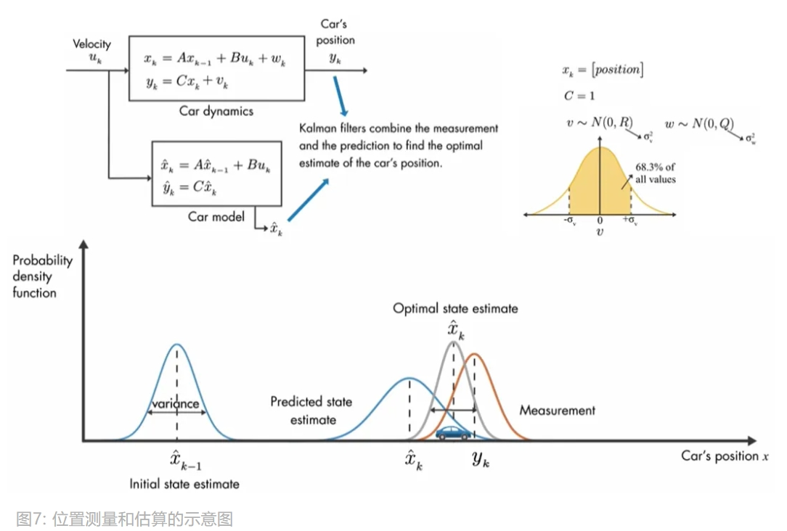
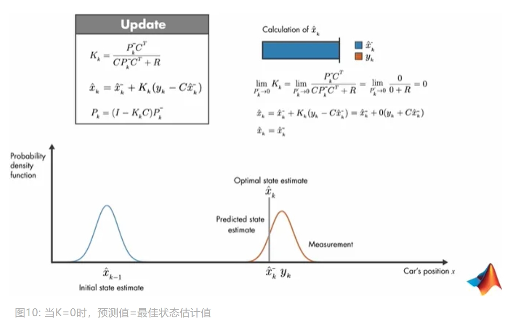
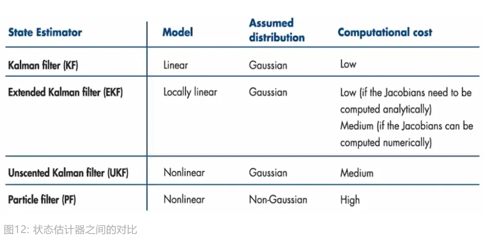
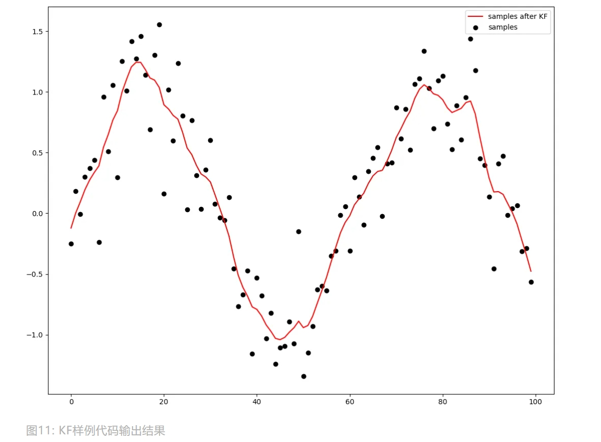

<style>
details {
    border: 1px solid #aaa;
    border-radius: 4px;
    padding: .5em .5em 0;
}
summary {
    font-weight: bold;
    margin: -.5em -.5em 0;
    padding: .5em;
}
details[open] {
    padding: .5em;
}
details[open] summary {
    border-bottom: 1px solid #aaa;
    margin-bottom: .5em;
}
img {
    pointer-events: none;
}
</style>

<details><summary>目录</summary><p>

- [卡尔曼滤波简介](#卡尔曼滤波简介)
- [状态观察器](#状态观察器)
    - [场景-观察火箭喷射器的内部温度](#场景-观察火箭喷射器的内部温度)
    - [应用-状态观察器](#应用-状态观察器)
- [最佳状态估计器](#最佳状态估计器)
    - [场景-估算隧道内汽车的位置](#场景-估算隧道内汽车的位置)
    - [应用-最佳状态估计器](#应用-最佳状态估计器)
    - [最佳状态估计器算法](#最佳状态估计器算法)
- [其他滤波算法](#其他滤波算法)
- [Python API](#python-api)
- [参考](#参考)
</p></details><p></p>

# 卡尔曼滤波简介

**卡尔曼滤波(Kalman Filter, KF)** 是一种优化估算算法(Optimal Estimation Algorithm)，
常用于制导与导航控制系统、计算机视觉系统和信号处理领域。
实际作用主要是：**从受误差影响的传感器测量中估算出最佳的系统状态**。

* 什么是卡尔曼滤波？
    - 可以在任何含有不确定信息的动态系统中使用卡尔曼滤波，
      对系统下一步的走向做出有根据的预测，即使伴随着各种干扰，
      卡尔曼滤波总是能指出真实发生的情况；
    - 在连续变化的系统中使用卡尔曼滤波是非常理想的，
      它具有占内存小的优点(除了前一个状态量外，不需要保留其它历史数据)，
      而且速度很快，很适合应用于实时问题和嵌入式系统。
* 算法的核心思想:
    - 根据仪器的 **当前测量值** 和 **上一刻的预测值** 和 **误差值**，计算得到 **当前的最优量**，再 **预测下一刻的量**；
    - 核心思想比较突出的观点是把误差纳入计算，而且分为 **预测误差** 和 **测量误差** 两种，统称为噪声；
    - 核心思想还有一个非常大的特点是: **误差独立存在，始终不受测量数据的影响**。

# 状态观察器

**状态观察器(State Observers)** 用于优化估算一些无法直接测量但可以间接测量的状态。

## 场景-观察火箭喷射器的内部温度

现在有一只火箭要从地球飞往火星，火箭使用液态氢作为燃料，但过高温度会导致火箭喷射器的机械部件损坏，
因此监控喷射器内部温度就十分重要，可传感器不支持放置在喷射器内部，否则会被融化掉。
但可以在喷射器外部的放置温度传感器，间接测量内部温度，但 **间接测量值** 和 **真实值** 存在 **误差**，
为此，可以 **使用状态观察器去基于间接测量值估算出真实值**。

## 应用-状态观察器

状态观察器怎么 “观察” 出火箭喷射器的内部温度状态呢？

已知火箭燃料流量是 `$W_{\text{fuel}}$`，测量的外部温度是 `$T_{\text{ext}}$`，
假设有个 **数学模型** 可以基于 `$W_{\text{fuel}}$` 估算出外部温度 `$\hat{T}_{\text{ext}}$`，
那么，只要将估计的外部温度 `$\hat{T}_{\text{ext}}$` 与测量的外部温度 `$T_{\text{ext}}$` 相匹配上，
数学模型就会收敛到 **真实系统的模型**，相应地，数据模型估算的内部温度 `$\hat{T}_{\text{in}}$` 也能逼近真实的内部温度。


可以通过下图的控制器 `$K$`，控制 **测量** 和 **估计** 的外部温度之间的误差为 0。


现在，透过数学公式来解释下状态观察器，如下图。为了方便理解公式，先解释下变量：

* `$u$`：控制向量。这里是燃料流量，它控制了温度
* `$B$`：控制矩阵
* `$A$` 和 `$C$`：矩阵 `$A$` 和 `$C$`
* `$\dot{x}$`：内部温度对时间的导数
* `$x$` 和 `$y$`：测量的内部温度和外部温度
* 加了 `^` 的变量都是预测的变量


> 由于官方视频直接带过了 `$e_{\text{obs}}(t)$` 的求解过程，这里进行补充下，
> 由于 `$\dot{e}_{\text{obs}}$` 是内部温度误差对时间的导数，
> 所以如果要获取内部温度误差随时间变化的函数 `$e_{\text{obs}}(t)$`，
> 只要微分就好了，公式拆解如下：
> 
> `$$\dot{e}_{obs}(t)=d(e_{\text{obs}}(t))$$`
> `$$d(e_{\text{obs}}(t)) = (A-KC)e_{\text{obs}}(t)$$`
> 
> 结合视频说 `$e_{\text{obs}}(t)$` 是个指数函数，因此可以联想到：
> 
> `$$\begin{align}
> e_{\text{obs}}(t) 
> &= (A-KC)e^{(A-KC)t} \\
> &= (A-KC)e^{(A-KC)\times 0} \times e^{(A-KC)t} \\
> &= e_{\text{obs}}(0)\times e^{(A-KC)t} \\
> &= (A-KC)e^{(A-KC)t}
> \end{align}$$`
> 
> 现在再对 `$e_{\text{obs}}(t)$` 求导，可得到上图的结果：
> 
> `$$\begin{align}
> \dot{e}_{\text{obs}}(t) 
> &= \frac{d((A-KC)e^{(A-KC)t})}{dx} \\
> &= (A-KC)(A-KC)e^{(A-KC)t} \\
> &= (A-KC)e_{\text{obs}}(t)
> \end{align}$$`

现在知道 `$e_{\text{obs}}(t)$` 是一个指数函数，
`$(A-KC)$` 是控制指数函数衰减的系数，但不能没有 `$KC$` 项，
因为在状态观察器中，核心的控制变量是 `$K$`，由 `$K$` 来调控误差函数的衰减速度。

# 最佳状态估计器

**最佳状态估计器(Optimal State Estimator)**：从受误差影响的传感器测量中估算出最佳的系统状态。
卡尔曼滤波本身便是一个最佳状态估计器，它跟前面讲的状态观察器差不多，
不同的是卡尔曼滤波是为 **随机系统** 设计的。

区别如下：

* 状态观察器(State observer)、动态系统(Deterministic system)：

    `$$\hat{x}_{k+1} = A\hat{x}_{k}+Bu_{k}+K(y_{k} - C\hat{x}_{k})$$`

* 卡尔曼滤波(Kalman filter)、随机系统(Stochastic system)：

    `$$\hat{x}_{k} = A\hat{x}_{k-1}+Bu_{k}+K_{k}(y_{k} - C(A\hat{x}_{k-1} + Bu_{k}))$$`

## 场景-估算隧道内汽车的位置

如果汽车进入隧道，汽车上的 GPS 接收器很难接收到卫星信号。
如果在周围有高建筑物遮挡的街道上行驶，因为多路径效应(Multipath Effect，即信号失真)，
导致定位噪声很大。可以简单看作这是一个 **传感器测量受误差影响** 的案例，
如果想估算出汽车真实的位置状态，建议使用卡尔曼滤波。


## 应用-最佳状态估计器

接下来，看下最佳状态估计器是如何估算汽车下一时间点会定位在哪的。
如下图所示，**卡尔曼滤波的目标**是将 **GPS 测量值(Measurement)** 和 **数学模型预测值(Prediction)** 相结合，
去找到 **汽车位置的最优估计状态(即汽车位置)**。



同样地，我先解释下图中的变量：

* `$u_{k}$`：时刻 `$k$` 下的控制向量。这里是速度
* `$x$` 和 `$y$`：测量的位置和真正的位置
* `$w$`：过程噪声，随机变量，可以代表风的影响或汽车速度的变化。
  服从正态分布 `$w \sim N(0, Q)$`，`$Q$` 为协方差
* `$v$`：测量误差，随机变量，服从正态分布 `$v \sim N(0, R)$`，
  `$R$` 为测量值的协方差，由于这里是单输出系统，
  协方差 `$R$` 等同于测量误差的方差
* `$A$`、`$B$` 和 `$C$`：矩阵变量
* 加了 `^` 的变量都是预测的变量

在上图中，用了概率密度函数去描述卡尔曼滤波的中心思想，
假设用数据模型得到时间点 `$k-1$` 下汽车状态 `$\hat{x}_{k-1}$`，
由于是预估值，所以会存在一定的方差，
现在使用汽车数学模型再次预测时间 `$k$` 下的位置 `$\hat{x}_{k}$`，
由于误差累积，`$\hat{x}_{k}$` 会有更大方差，同时也可以获取到测量值 `$\hat{y}_{k}$`。

现在有了 **预测(`$\hat{x}_{k}$`)** 和 **测量(`$y_{k}$`)**，
便可以通过概率密度函数相乘的方式得到最优状态估计函数，
而新的概率密度函数的平均值便是最优状态估计值(即综合测量值和预测值得到的最佳定位点)。

## 最佳状态估计器算法

现在，来详细看下卡尔曼滤波是如何实现最佳状态估计器算法。如下图所示，先解释下各变量:

* `$\hat{x}^{-}$`：先验状态，即预测值
* `$\hat{x}$`：后验状态，即最佳状态估计值
* `$P^{-}$`：先验协方差，即预测值的协方差
* `$P$`：后验协方差，即最佳状态估计值的协方差
* `$R$`：测量值噪声的协方差
* `$Q$`：过程噪声的协方差
* `$K$`：卡尔曼增益
* `$A$`、`$B$` 和 `$C$`：矩阵


卡尔曼滤波步骤如下:

1. 初始化 `$\hat{x}_{k-1}$`、`$P_{k-1}$`、`$u_{k}$`、`$A$`、`$B$`、`$C$`、`$Q$` 和 `$R$`。
2. 先执行 Prediction，得到 `$\hat{x}_{k}^{-}$` 和 `$P_{k}^{-}$`。
3. 将 Prediction 结果输入到 Update 模块，求得 `$K_{k}$`，再基于 `$K_{k}$` 求最佳估计值 `$\hat{x}_{k}$`。
4. 将 Update 求出的 `$P_{k}$` 和 `$\hat{x}_{k}$` 再输入给 Prediction。
5. 重复以上步骤，不断调整卡尔曼增益，使更新后的状态值 `$\hat{x}$` 误差协方差 `$P$` 最小。

最后，深入看下卡尔曼增益 K 是怎么权衡测量值和预测值的决策比重的：

1. **当 `$K=1/C$`  时，测量值等于最佳状态估计值**

若测量值等于最佳状态估计值，说明测量值协方差 `$R$` 趋向于 0，那么如下图所示。


2. **当 `$K=0$` 时，预测值等于最佳状态估计值**

若预测值等于最佳状态估计值，说明预测值协方差趋向于 0，那么如下图所示。



# 其他滤波算法

卡尔曼滤波是线性的，而实际中，很多数据模型是非线性的，此时可以考虑扩展卡尔曼滤波，
另外，有兴趣的朋友也可以去了解无迹卡尔曼滤波和粒子滤波，如图12所示。



# Python API

```python
import numpy as np
import matplotlib.pyplot as plt
import simdkalman


def make_shifted_matrix(vec):
    """
    Define shifted matrix
    """
    matrix = []
    size = len(vec)
    for i in range(size):
        row = [0] * i + vec[:size-i]
        matrix.append(row)
    
    return np.array(matrix)


def make_state_vector(T, size):
    """
    Define state vector
    """
    vector = [1, 0]
    step = 2
    for i in range(size - 2):
        if i % 2 == 0:
            vector.append(T)
            T *= T / step
            step += 1
        else:
            vector.append(0)

    return vector


def make_noise_vector(noise, size):
    """
    Define noise vector
    """
    noise_vector = []
    for i in range(size):
        if i > 0 and i % 2 == 0:
            noise *= 0.5
        noise_vector.append(noise)
    
    return noise_vector


# KF 的参数，可用 optuna 去做搜索
T = 1
size = 4
noise = 2.1714133956113952e-06
obs_noise = 1.719317114286542e-05

# 获取 State transition matrix A
vec = make_state_vector(T, size)
state_transition = make_shifted_matrix(vec)

# 获取 Process noise (state transition covariance) matrix Q
process_noise = np.diag(make_noise_vector(noise, size)) + np.ones(size) * 1e-9

# 获取 Observation model (measurement model) matrix C
observation_model = np.array([[1] + [0] * (size - 1)])

# 获取 Observation noise (measurement noise covariance) matrix R
observation_noise = np.diag([obs_noise] * 1) + np.ones(1) * 1e-9


kf = simdkalman.KalmanFilter(
    state_transition = state_transition,
    process_noise = process_noise,
    observation_model = observation_model,
    observation_noise = observation_noise
)


# 随机化一组样例数据
x = np.linspace(0, 10, 100)
y = np.sin(x)
data = np.array([v + np.random.normal(0.1, 0.3, 1) for v in y])
data = data.reshape(1, len(data), 1)

smoothed = kf.smooth(data)
smoothed_data = smoothed.states.mean[0, :, 0]

# 可视化
fig = plt.figure()
plt.scatter(range(len(data[0,:,0])), data[0,:,0], c = 'black', label = 'samples')
plt.plot(range(len(smoothed_data)), smoothed_data, c = 'r', label = 'samples after KF')
plt.legend()
plt.show()
```



# 参考

* [卡尔曼滤波](https://mp.weixin.qq.com/s?__biz=MzUyNzA1OTcxNg==&mid=2247486294&idx=1&sn=5c84f404cd77f2742b12d30c1fb5427d&chksm=fa04153dcd739c2b3f9c70a5aa1674a8c523fb885635f6854df4015c9dd2df72bf0017d5a66f&scene=178&cur_album_id=1577157748566310916#rd)
* MathWorks 制作的《Understanding Kalman Filters》视频
    - 英文视频: https://ww2.mathworks.cn/videos/series/understanding-kalman-filters.html。
    - 翻译视频: https://www.zhihu.com/question/23971601
* Bzarg 写的《How a Kalman filter works, in pictures》博文
    - 英文博文: http://www.bzarg.com/p/how-a-kalman-filter-works-in-pictures/#mathybits。
    - 翻译博文: https://www.zhihu.com/question/23971601
* Automatic Addison 写的《Extended Kalman Filter (EKF) With Python Code Example》[博文](https://automaticaddison.com/extended-kalman-filter-ekf-with-python-code-example/)
* [《如何通俗并尽可能详细地解释卡尔曼滤波？》](https://www.zhihu.com/question/23971601)
* [《Understanding Kalman Filters》- MathWorks，系列视频](https://ww2.mathworks.cn/videos/series/understanding-kalman-filters.html)
* [卡尔曼滤波库 simdkalman Github](https://github.com/oseiskar/simdkalman)
* [《Kalman filter - hyperparameter search with BO》-Trinh Quoc Anh，代码](https://www.kaggle.com/tqa236/kalman-filter-hyperparameter-search-with-bo)
