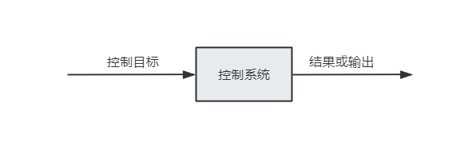
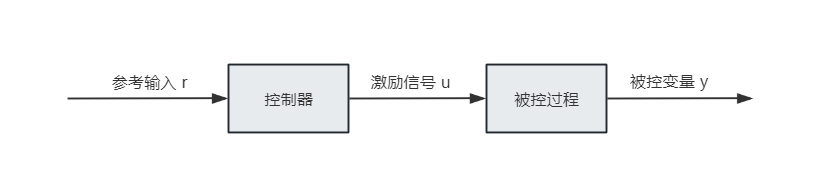
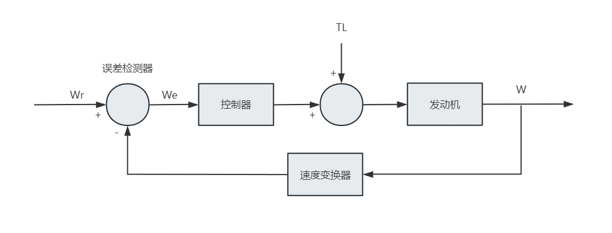
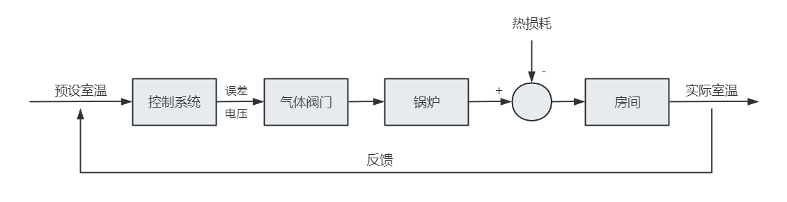
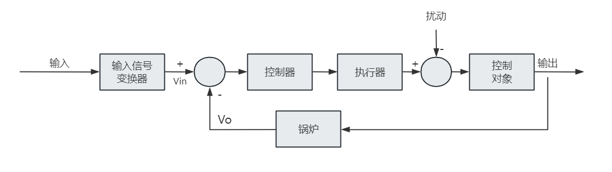
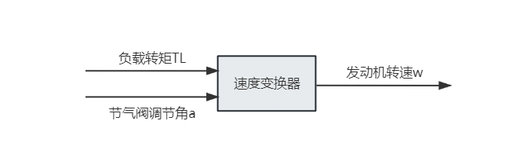

<style>
details {
    border: 1px solid #aaa;
    border-radius: 4px;
    padding: .5em .5em 0;
}
summary {
    font-weight: bold;
    margin: -.5em -.5em 0;
    padding: .5em;
}
details[open] {
    padding: .5em;
}
details[open] summary {
    border-bottom: 1px solid #aaa;
    margin-bottom: .5em;
}
img {
    pointer-events: none;
}
</style>

<details><summary>目录</summary><p>

- [控制算法概述](#控制算法概述)
  - [什么是控制算法](#什么是控制算法)
  - [控制系统的基本组成](#控制系统的基本组成)
  - [开环与闭环](#开环与闭环)
  - [控制算法的分类](#控制算法的分类)
- [控制系统基础](#控制系统基础)
  - [控制框图](#控制框图)
  - [典型应用场景](#典型应用场景)
  - [设计控制器时关注什么](#设计控制器时关注什么)
- [经典控制算法：PID](#经典控制算法pid)
  - [PID 的核心思想](#pid-的核心思想)
  - [如何理解 PID](#如何理解-pid)
    - [1. 从“追目标”来理解](#1-从追目标来理解)
    - [2. 从“开车”来理解](#2-从开车来理解)
    - [3. 从“公式的单位”来理解](#3-从公式的单位来理解)
  - [比例控制 P](#比例控制-p)
  - [积分控制 I](#积分控制-i)
  - [微分控制 D](#微分控制-d)
  - [离散 PID 公式](#离散-pid-公式)
  - [用例子理解 PID](#用例子理解-pid)
    - [水缸加水的例子](#水缸加水的例子)
    - [刹车的例子](#刹车的例子)
    - [一句话总结这三个项](#一句话总结这三个项)
  - [PID Python 实现示例](#pid-python-实现示例)
  - [PID 的优缺点](#pid-的优缺点)
  - [PID 调参经验](#pid-调参经验)
- [智能控制算法：模糊控制](#智能控制算法模糊控制)
  - [为什么需要模糊控制](#为什么需要模糊控制)
  - [模糊控制的基本思想](#模糊控制的基本思想)
  - [模糊控制器的组成](#模糊控制器的组成)
    - [1. 模糊化](#1-模糊化)
    - [2. 知识库](#2-知识库)
    - [3. 模糊推理](#3-模糊推理)
    - [4. 解模糊](#4-解模糊)
  - [模糊 PID](#模糊-pid)
  - [模糊控制的优缺点](#模糊控制的优缺点)
  - [一个温度控制的模糊规则示例](#一个温度控制的模糊规则示例)
- [如何选择控制算法](#如何选择控制算法)
- [参考](#参考)
</p></details><p></p>

## 控制算法概述

### 什么是控制算法

控制算法的目标，是让系统输出 `$y$` 按照期望值 `$r$` 变化，并在扰动、噪声和模型不确定性存在时尽可能保持稳定、快速、准确。

从工程角度看，控制算法主要解决四个问题：

* 系统是否稳定
* 响应是否足够快
* 超调和振荡是否可接受
* 稳态误差是否足够小

### 控制系统的基本组成

控制系统通常由以下部分组成：

1. 参考输入或目标值
2. 控制器
3. 执行机构
4. 被控对象
5. 传感器与反馈通道

其基本关系可用下图表示：



控制器根据参考输入与实际输出之间的误差，计算控制量 `$u$`，再由执行机构作用于被控对象，从而改变系统输出。

### 开环与闭环

**开环控制**不使用反馈，结构简单、成本低，但难以抵抗扰动。



**闭环控制**利用输出反馈来修正误差，精度更高、鲁棒性更好，是现代控制系统更常见的形式。



闭环控制的一般过程是：

1. 采集系统输出
2. 与目标值比较得到误差
3. 控制器根据误差生成控制信号
4. 被控对象响应后再次反馈

### 控制算法的分类

常见控制算法大致可分为：

* 经典控制：P、PI、PD、PID
* 现代控制：状态反馈、最优控制、LQR、MPC
* 智能控制：模糊控制、神经网络控制、专家控制
* 特殊结构控制：前馈控制、自适应控制、鲁棒控制

本文聚焦最常见且最实用的两类方法：**PID** 和 **模糊控制**。

## 控制系统基础

### 控制框图

控制框图是描述控制系统最常见的图形工具，它将复杂系统拆成若干功能模块，并明确输入、输出和反馈关系。



在分析和设计控制系统时，经常会出现这些元素：

* 比较器：计算误差 `$e(t)=r(t)-y(t)$`
* 控制器：根据误差产生控制量
* 执行器：把控制信号转为实际动作
* 被控对象：需要被调节的系统
* 传感器：测量输出并回传
* 扰动：外界对系统的未知影响

典型控制框图如下：



### 典型应用场景

控制算法广泛应用于：

* 电机转速控制
* 无人机姿态控制
* 机器人关节位置控制
* 温度、压力、流量过程控制
* 汽车巡航、怠速与转向系统

以汽车怠速控制为例，节气门开度和负载扰动共同影响发动机转速，控制器需要在负载突变时尽快把转速拉回目标值。



### 设计控制器时关注什么

控制器设计通常围绕以下指标展开：

* 稳定性：系统不能发散
* 上升时间：达到目标附近的速度
* 超调量：是否冲过目标过多
* 调节时间：多久能稳定下来
* 稳态误差：最终是否仍有偏差
* 鲁棒性：参数变化和外部扰动下是否仍可靠

如果对象模型清晰、线性特征明显，PID 往往已经足够；如果对象非线性强、难以精确建模，模糊控制更有价值。

## 经典控制算法：PID


### PID 的核心思想

PID 是比例（Proportional）、积分（Integral）、微分（Derivative）三种控制规律的组合。

其核心思想是：既看当前误差，也看历史误差累计，还看误差变化趋势。

连续形式可写为：

`$$u(t) = K_{p}e(t) + K_{i}\int e(t)dt + K_{d}\frac{de(t)}{dt}$$`

其中：

* `$K_p$` 为比例系数
* `$K_i$` 为积分系数
* `$K_d$` 为微分系数

### 如何理解 PID

理解 PID，建议不要一上来就盯着公式，而是按下面的顺序去看：

1. 先看“误差”是什么
2. 再看控制器面对误差会做什么
3. 最后再看 P、I、D 三项分别在解决什么问题

可以把 PID 想成一个“有经验的操作员”：

* 比例项 P 看当前偏差有多大，偏差大就立刻加大动作
* 积分项 I 看过去累计偏差有多少，只要长期没调到位，就继续补偿
* 微分项 D 看偏差变化有多快，如果系统冲得太快，就提前刹车

如果只记一句话，可以记成：

* P 管现在
* I 管过去
* D 管未来趋势

对初学者来说，有三种直观理解方式最有效：

#### 1. 从“追目标”来理解

假设目标值是 1.0，当前输出是 0.2，那么误差就是 0.8。

* P 会说：差得这么远，赶紧多推一点
* I 会说：你已经偏了很久了，不能只看这一次，得继续补偿
* D 会说：你现在冲得太快了，小心过头

#### 2. 从“开车”来理解

开车跟车或停车时：

* 距离前车很远，就该多给油，这像 P
* 如果长期跟不上，就要持续多给一点油，这像 I
* 如果接近前车的速度过快，就要提前减速，这像 D

#### 3. 从“公式的单位”来理解

如果误差单位是“摄氏度”：

* P 对应“按当前误差直接调节”
* I 对应“误差随时间累计后再调节”
* D 对应“误差变化速度引起的调节”

这样就能理解，为什么积分会越积越大，为什么微分会对变化快的情况特别敏感。

### 比例控制 P

比例控制直接按当前误差大小输出控制量：

`$$u = K_{p}e$$`

误差越大，控制作用越强，因此响应快、实现简单。

但单独使用比例控制通常存在两个问题：

* 系统可能存在稳态误差
* 比例系数过大时容易引起振荡甚至失稳

从直觉上说，比例控制像“看到差多少，就立刻补多少”。它最大的优点是反应快，但由于它只看当前误差，不看历史，也不看变化趋势，所以很难独立完成高质量控制。

### 积分控制 I

积分控制对误差随时间进行累计：

`$$u_I(t)=K_{i}\int e(t)dt$$`

它的主要作用是消除稳态误差。只要误差长期存在，积分项就会持续增加，从而推动输出逼近目标。

但积分项过强也会带来副作用：

* 响应变慢
* 超调增大
* 容易出现积分饱和

积分项可以理解为“记账”。只要误差一直存在，积分项就一直记着这笔账，直到把长期偏差补回来。因此 I 项特别擅长消除稳态误差。

### 微分控制 D

微分控制关注误差变化速度：

`$$u_D(t)=K_{d}\frac{de(t)}{dt}$$`

它相当于“提前刹车”，在误差变化过快时提前施加修正，因此常用于：

* 抑制超调
* 减少振荡
* 改善动态响应

但微分项对噪声比较敏感，实际工程中通常会配合低通滤波使用。

微分项可以理解为“趋势判断”。它不是看你现在偏了多少，而是看你偏差变化得有多快，所以它本质上是一种提前量。

### 离散 PID 公式

在数字控制器中，更常见的是离散形式：

`$$u(k)=K_{p}e(k)+K_{i}\sum_{n=0}^{k}e(n)+K_{d}\big(e(k)-e(k-1)\big)$$`

这也是 MCU、PLC 和上位机程序里最常见的实现方式。

从作用分工看：

* P 负责快速响应当前误差
* I 负责消除长期偏差
* D 负责预测趋势、抑制振荡

### 用例子理解 PID

#### 水缸加水的例子

假设目标是让水缸水位始终保持在 1 米，当前水位只有 0.2 米，那么误差是：

`$$error = 1.0 - 0.2 = 0.8$$`

如果只用比例控制：

`$$u = K_{p} \times error$$`

假设 `$K_p = 0.5$`：

* 第一次控制时，`$u = 0.5 \times 0.8 = 0.4$`，水位从 0.2 上升到 0.6
* 第二次控制时，误差变成 0.4，`$u = 0.5 \times 0.4 = 0.2$`，水位上升到 0.8

这样看起来系统会逐步接近目标值。

但如果水缸存在漏水，比如每次都会漏掉 0.1 米的水，那么当水位达到 0.8 时：

* 当前误差是 0.2
* 比例项控制量是 `$0.5 \times 0.2 = 0.1$`
* 恰好和漏水量相抵消

此时水位会停在 0.8，不再变化。这就是**稳态误差**。

这时引入积分项就有意义了。因为系统“记住了”之前一直没达到目标，所以会继续增加控制量，最终把水位推到 1.0 附近。

#### 刹车的例子

微分项更适合用刹车来理解。

开车接近红灯时：

* 如果只看当前位置误差，可能会刹车太晚
* 如果看到“与目标距离正在快速缩小”，就应该提前减速

这就是微分项的作用。它关心的是：

* 误差变化速度快不快
* 系统是不是正在快速逼近目标

因此 D 项常被理解成“提前刹车”。

#### 一句话总结这三个项

* P：离目标远，就多推一点
* I：长期没到位，就持续补一点
* D：如果冲得太快，就提前压一点

### PID Python 实现示例

下面是一个简单的 PID Python 示例，用于帮助理解离散 PID 的编程实现方式：

```python
# -*- coding: utf-8 -*-

import time

import matplotlib.pyplot as plt
import numpy as np
from scipy.interpolate import make_interp_spline


class PID:

    def __init__(self, P, I, D) -> None:
        self.Kp = P
        self.Ki = I
        self.Kd = D
        self.sample_time = 0.0
        self.current_time = time.time()
        self.last_time = self.current_time
        self.clear()

    def clear(self):
        self.setpoint = 0.0
        self.P_term = 0.0
        self.I_term = 0.0
        self.D_term = 0.0
        self.last_error = 0.0
        self.output = 0.0

    def update(self, feedback_value):
        self.current_time = time.time()
        delta_time = self.current_time - self.last_time

        error = self.setpoint - feedback_value
        delta_error = error - self.last_error

        if delta_time >= self.sample_time:
            self.P_term = self.Kp * error
            self.I_term += error * delta_time
            self.D_term = delta_error / delta_time if delta_time > 0.0 else 0.0

            self.last_time = self.current_time
            self.last_error = error
            self.output = self.P_term + (self.Ki * self.I_term) + (self.Kd * self.D_term)

    def set_sample_time(self, sample_time):
        self.sample_time = sample_time

    @staticmethod
    def visual(time_list, feedback_list, setpoint_list, end):
        fig = plt.figure()
        time_smooth = np.linspace(min(time_list), max(time_list), 300)
        feedback_smooth = make_interp_spline(time_list, feedback_list)(time_smooth)
        plt.plot(time_list, setpoint_list, "r")
        plt.plot(time_smooth, feedback_smooth, "b-")
        plt.xlim((0, end))
        plt.ylim((min(feedback_list) - 0.5, max(feedback_list) + 0.5))
        plt.xlabel("time (s)")
        plt.ylabel("PID (PV)")
        plt.title("PID test", fontsize=15)
        plt.grid(True)
        plt.show()


def test_pid(P, I, D, end):
    pid = PID(P, I, D)
    pid.setpoint = 1.1
    pid.set_sample_time(sample_time=0.01)
    time_list = list(range(1, end))
    feedback = 0.5

    feedback_list = []
    setpoint_list = []

    for _ in time_list:
        pid.update(feedback_value=feedback)
        feedback += pid.output
        time.sleep(0.01)
        feedback_list.append(feedback)
        setpoint_list.append(pid.setpoint)

    pid.visual(time_list, feedback_list, setpoint_list, end)


def main():
    test_pid(P=1.2, I=1, D=0.001, end=20)


if __name__ == "__main__":
    main()
```

这个实现可以重点看 `update()` 方法，它正好对应离散 PID 的三部分：

* `self.P_term = self.Kp * error` 对应比例项
* `self.I_term += error * delta_time` 对应积分项
* `self.D_term = delta_error / delta_time` 对应微分项

如果你在读代码时容易混乱，可以只盯住这一条主线：

1. 先算误差 `error`
2. 再算误差累计 `I_term`
3. 再算误差变化速度 `D_term`
4. 最后把三项加起来得到输出

从“代码如何对应公式”这个角度看 PID，通常比直接背公式更容易理解。

### PID 的优缺点

PID 的优点：

* 原理简单，易于工程实现
* 不依赖高精度数学模型
* 对大多数单输入单输出对象都有效
* 调参经验成熟，工业应用最广

PID 的局限：

* 对强非线性、时变系统效果有限
* 参数整定依赖经验
* 对大滞后、多变量耦合对象不一定理想
* 微分项易受测量噪声影响

### PID 调参经验

实际调参通常遵循“先 P，再 I，后 D”的顺序：

1. 先增大 `$K_p$`，让系统有足够响应速度
2. 再加入 `$K_i$`，消除稳态误差
3. 最后增加 `$K_d$`，抑制超调和振荡

常见经验包括：

* 输出响应太慢：适当增大 `$K_p$`
* 稳态误差明显：增大 `$K_i$`
* 超调大、振荡强：增大 `$K_d$` 或减小 `$K_p$`
* 积分饱和严重：限制积分项或引入抗积分饱和机制

## 智能控制算法：模糊控制

### 为什么需要模糊控制

PID 在很多线性、低阶、时不变系统中很好用，但当系统具有以下特征时，单纯 PID 往往不够理想：

* 数学模型难以准确建立
* 系统非线性明显
* 参数随工况变化
* 存在强耦合、强扰动或纯滞后

这类问题在空调温控、车辆控制、机器人、化工过程等场景中很常见。此时，工程师往往会把经验规则写成控制策略，这就是模糊控制的出发点。

### 模糊控制的基本思想

模糊控制并不要求对象有精确数学模型，而是把人的控制经验表达为“如果......那么......”的规则。

例如，在温度控制中，人通常不会说：

* 误差等于 2.37 摄氏度时，输出增加 13.5%

而更可能说：

* 如果温度偏低很多，就大幅增加加热
* 如果温度略低，就小幅增加加热
* 如果已经接近目标，就减小动作避免过冲

这种“偏低很多”“略低”“接近目标”就是模糊语言变量。

模糊控制的一般流程为：

1. 将精确输入量转换为模糊量
2. 根据模糊规则进行推理
3. 将推理结果再转换为精确控制量

### 模糊控制器的组成

一个典型模糊控制器一般由四部分组成：

1. 模糊化
2. 知识库
3. 模糊推理
4. 解模糊

#### 1. 模糊化

模糊化是把精确输入映射到模糊集合中。常见输入包括：

* 误差 `$e$`
* 误差变化率 `$\Delta e$`

这些量通常被划分为若干语言等级，例如：

* NB：Negative Big，负大
* NM：Negative Medium，负中
* NS：Negative Small，负小
* ZO：Zero，零
* PS：Positive Small，正小
* PM：Positive Medium，正中
* PB：Positive Big，正大

#### 2. 知识库

知识库包括：

* 数据库：隶属函数、量化因子、比例因子等
* 规则库：工程经验形成的模糊规则

规则通常写成：

* 如果 `$e$` 是 PB，且 `$\Delta e$` 是 PS，那么控制输出 `$u$` 是 PB

#### 3. 模糊推理

模糊推理根据当前输入落在哪些模糊集合上，并结合规则库进行推断。常见方法包括：

* Mamdani 推理
* Sugeno 推理

Mamdani 形式直观，适合知识表达；Sugeno 形式更适合计算和工程实现。

#### 4. 解模糊

经过模糊推理后，得到的是模糊输出集合，需要通过解模糊转换成精确控制量。

常见方法有：

* 重心法
* 最大隶属度法
* 加权平均法

其中重心法最常用，因为输出较平滑。

### 模糊 PID

模糊控制在工程中最常见的落地方式之一，是**模糊 PID**。

模糊 PID 不是完全替代 PID，而是用模糊规则在线调整 PID 参数，使 `$K_p$`、`$K_i$`、`$K_d$` 随工况变化而变化。

常见设计思路是：

* 输入：误差 `$e$` 与误差变化率 `$\Delta e$`
* 输出：`$\Delta K_p$`、`$\Delta K_i$`、`$\Delta K_d$`

其基本逻辑是：

* 误差很大时，增大 `$K_p$`，让系统快速逼近目标
* 误差中等且变化较快时，增大 `$K_d$`，抑制超调
* 误差较小时，适当增大 `$K_i$`，减小稳态误差

模糊 PID 的优势在于：

* 保留 PID 结构简单、易落地的优点
* 补足固定参数 PID 对工况变化适应性差的问题
* 特别适用于非线性、慢时变对象

因此，模糊 PID 常用于：

* 温度与恒温系统
* 电机速度控制
* 车辆纵向与横向控制
* 无人机姿态控制
* 化工过程控制

### 模糊控制的优缺点

模糊控制的优点：

* 不强依赖精确数学模型
* 能直接利用人工经验
* 对非线性和参数变化系统适应性较好
* 设计直观，便于和 PID 结合

模糊控制的局限：

* 规则库设计依赖经验，主观性较强
* 输入输出维度增加后，规则数量迅速膨胀
* 稳定性分析通常不如经典控制直观
* 参数、隶属函数和量化因子仍需调试

### 一个温度控制的模糊规则示例

设输入为温度误差 `$e$` 和误差变化率 `$\Delta e$`，输出为加热功率调节量 `$u$`。

可以构造如下几条规则：

* 如果 `$e$` 是 PB，且 `$\Delta e$` 是 ZO，那么 `$u$` 是 PB
* 如果 `$e$` 是 PS，且 `$\Delta e$` 是 PS，那么 `$u$` 是 PS
* 如果 `$e$` 是 ZO，且 `$\Delta e$` 是 ZO，那么 `$u$` 是 ZO
* 如果 `$e$` 是 NS，且 `$\Delta e$` 是 NS，那么 `$u$` 是 NS
* 如果 `$e$` 是 NB，且 `$\Delta e$` 是 ZO，那么 `$u$` 是 NB

这些规则表达的是一种符合直觉的经验：

* 偏差越大，动作越强
* 接近目标时，动作应减弱
* 如果误差正在快速减小，应避免控制过猛

## 如何选择控制算法

工程中没有“最好的控制算法”，只有“更适合当前对象的控制算法”。

可以按如下思路选择：

* 对象简单、模型相对稳定：优先尝试 PID
* 需要快速落地、实现成本低：优先 PID 或 PI
* 非线性较强、模型难建：优先模糊控制或模糊 PID
* 工况变化大但仍希望保留 PID 结构：选择模糊 PID
* 多变量、强约束、高性能场景：考虑更高级的现代控制方法

在多数实际项目里，常见路线不是“PID 或模糊控制二选一”，而是：

1. 先用 PID 建立可工作的基线系统
2. 再通过模糊规则、自适应策略或前馈补偿提升性能

## 参考

* [PID控制算法原理(抛弃公式，从本质上真正理解PID控制)](https://zhuanlan.zhihu.com/p/39573490)
* [串讲：控制理论：PID控制（经典控制理论）](https://zhuanlan.zhihu.com/p/147800110)
* [PID控制算法原理](https://cloud.tencent.com/developer/article/1456305)
