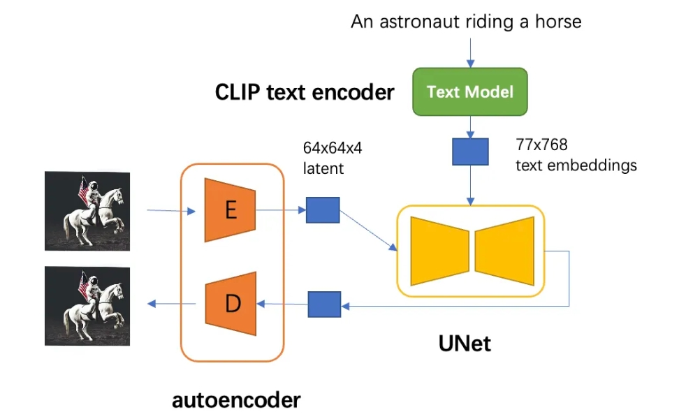

目录

- [Stable Diffusion 简介](#stable-diffusion-简介)
- [Stable Diffusion 模型](#stable-diffusion-模型)
- [Python API](#python-api)
- [参考](#参考)

# Stable Diffusion 简介

Stable Diffusion 是 CompVis、Stability AI 和 LAION 等公司研发的一个文生图模型，
它的模型和代码是开源的，而且训练数据 `LAION-5B` 也是开源的。
由于Stable Diffusion 是一个完全开源的模型（代码、数据、模型），而且是它的参数量只有 1B 左右，
因此大部分人可以在普通的显卡上进行推理甚至精调模型。
Stable Diffusion 的出现和开源对 AIGC 的火热和发展有巨大的推动作用，
因为它让更多的人能快地上手 AI 作画。

Stable Diffusion 是一个基于 `latent` 的扩散模型，它在 `UNet` 中引入 `text condition` 来实现基于文本生成图像。
Stable Diffusion 的核心来源于 Latent Diffusion。常规的扩散模型是基于 `pixel` 的生成模型，
而 Latent Diffusion 是基于 `latent` 的生成模型，它先采用一个 `autoencoder` 将图像压缩到 `latent` 空间，
然后用扩散模型来生成图像的 `latents`，最后送入 `autoencoder` 的 `decoder` 模块就可以得到生成的图像。

基于 `latent` 的扩散模型的优势在于计算效率更高效，因为图像的 `latent` 空间要比图像 `pixel` 空间要小，
这也是 Stable Diffusion 的核心优势。文生图模型往往参数量比较大，
基于 `pixel` 的方法往往限于算力只生成 64x64 大小的图像，比如 OpenAI 的 DALL-E2 和谷歌的 Imagen，
然后再通过超分辨模型将图像分辨率提升至 256x256 和 1024x1024；
而基于 `latent` 的 Stable Diffusion 是在 latent 空间操作的，它可以直接生成 256x256 和 512x512 甚至更高分辨率的图像。

# Stable Diffusion 模型

Stable Diffusion 模型的主体结构如上图所示，主要包括三个模型：

* **autoencoder**：encoder 将图像压缩到 latent 空间，而 decoder 将 latent 解码为图像；
* **CLIP text encoder**：提取输入 text 的 text embeddings，
  通过 cross attention 方式送入扩散模型的 UNet 中作为condition；
* **UNet**：扩散模型的主体，用来实现文本引导下的 latent 生成。

对于 Stable Diffusion 模型，其 autoencoder 模型参数大小为 84M(8400000)，
CLIP text encoder 模型大小为 123M(123000000)，而 UNet 参数大小为 860M(86000000)，
所以 Stable Diffusion 模型的总参数量约为 1B。

# Python API

* Huggging Face `diffusers` 库

# 参考

* [The Illustrated Stable Diffusion](https://jalammar.github.io/illustrated-stable-diffusion/)
* [硬核解读Stable Diffusion（系列一）](https://mp.weixin.qq.com/s?__biz=MzUyMjE2MTE0Mw==&mid=2247500109&idx=1&sn=6f63e1959ebb44d8699e83adc0a888ad&chksm=f9d29fd5cea516c34e451b45ef6fa22b7506b49c8bb1e8bbe5a05b837e6edd763656f8d1c0bc&scene=21#wechat_redirect)
* [硬核解读Stable Diffusion（系列二）](https://mp.weixin.qq.com/s?__biz=MzUyMjE2MTE0Mw==&mid=2247500110&idx=1&sn=8f2d05b2b6fd38f6243d8f823bb4376a&chksm=f9d29fd6cea516c035b2481211c7b5413485e883051ab161a8b252dbbb2a1a5a9c812d3644fe&scene=21#wechat_redirect)
* [硬核解读Stable Diffusion（系列三）](https://mp.weixin.qq.com/s?__biz=MzUyMjE2MTE0Mw==&mid=2247500111&idx=1&sn=3fe96b6ffdd132b99f53b3f6c74dbb26&chksm=f9d29fd7cea516c13860c612807e1e38d26b99a55dae9ba050963e9ab6f038c9923b2f8185d6&scene=21#wechat_redirect)
* [深入理解生成模型VAE](https://mp.weixin.qq.com/s?__biz=MzUyMjE2MTE0Mw==&mid=2247496548&idx=1&sn=2e5fcc3140891581fa1c8b112ecc6730&chksm=f9d2adfccea524ead15a9f93e5c89f053ec67d0803a2223e2751013e5ca99f432a5055fa6a18&scene=21#wechat_redirect)