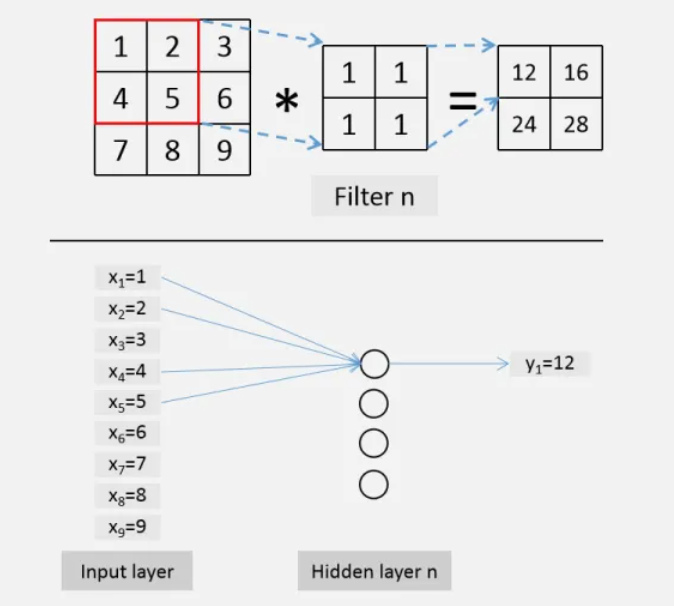
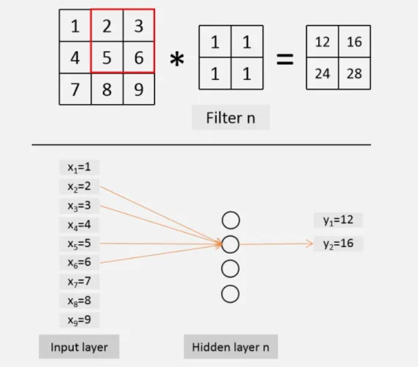
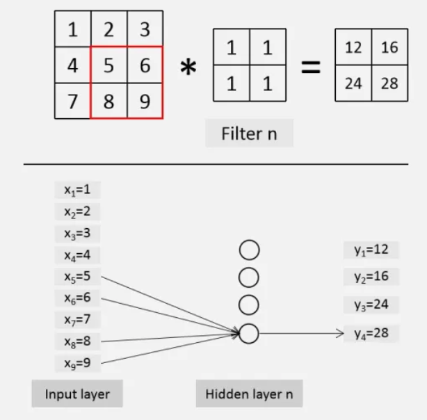
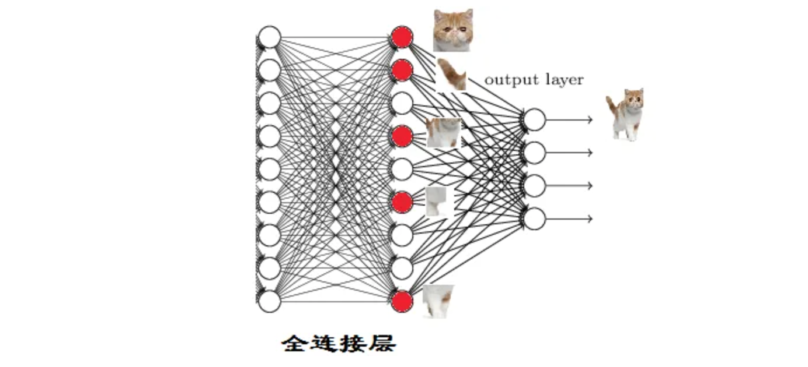

<style>
details {
    border: 1px solid #aaa;
    border-radius: 4px;
    padding: .5em .5em 0;
}
summary {
    font-weight: bold;
    margin: -.5em -.5em 0;
    padding: .5em;
}
details[open] {
    padding: .5em;
}
details[open] summary {
    border-bottom: 1px solid #aaa;
    margin-bottom: .5em;
}
img {
    pointer-events: none;
}
</style>

<details><summary>目录</summary><p>

- [CNN 直观理解](#cnn-直观理解)
- [卷积](#卷积)
  - [卷积介绍](#卷积介绍)
  - [图像锐化](#图像锐化)
- [CNN 结构分析](#cnn-结构分析)
  - [全连接层](#全连接层)
  - [池化层](#池化层)
  - [卷积层](#卷积层)
  - [卷积层与池化层级联](#卷积层与池化层级联)
  - [完整结构](#完整结构)
- [卷积层](#卷积层-1)
  - [RGB 图像](#rgb-图像)
  - [卷积计算](#卷积计算)
- [池化层](#池化层-1)
  - [池化层介绍](#池化层介绍)
  - [池化层性质](#池化层性质)
  - [池化层作用](#池化层作用)
- [激活函数](#激活函数)
- [全连接层](#全连接层-1)
  - [全连接层与卷积层的关系](#全连接层与卷积层的关系)
  - [第一个全连接层](#第一个全连接层)
    - [示例](#示例)
  - [第二个全连接层](#第二个全连接层)
    - [示例](#示例-1)
  - [对模型的影响](#对模型的影响)
- [图像在 CNN 网络中的变化](#图像在-cnn-网络中的变化)
  - [数据](#数据)
  - [模型](#模型)
  - [一个卷积层](#一个卷积层)
  - [一个池化层](#一个池化层)
  - [激活函数](#激活函数-1)
  - [新卷积层](#新卷积层)
  - [新采样层](#新采样层)
  - [新激活函数](#新激活函数)
  - [将激活函数 relu 修改为 sigmoid](#将激活函数-relu-修改为-sigmoid)
  - [将激活函数 relu 修改为 tanh](#将激活函数-relu-修改为-tanh)
  - [新增两个卷积层和激活函数](#新增两个卷积层和激活函数)
  - [全连接层](#全连接层-2)
  - [不同 kernel size 对比](#不同-kernel-size-对比)
- [参考](#参考)
</p></details><p></p>

# CNN 直观理解

2014 年 Zeiler 等人在 ECCV 上发表了一篇基于可视化角度理解 CNN 的经典论文, 从可视化的角度观察 CNN 每一层在图像识别过程中到底都学到了什么。
可谓是卷积神经网络可视化的开山之作 [Visualizing and Understanding Convolutional Networks, 2014](https://link.springer.com/chapter/10.1007/978-3-319-10590-1_53)

CNN 在学习过程中是 **逐层对图像特征进行识别和检验** 的, CNN 的不同层负责检测输入图像的不同层级的图像特征。在 CNN 中：

* 前几层网络用于检测 **图像的边缘特征**, 包括图像的基本轮廓
    - 边缘检测的目的就是检测出图像中亮度变化和特征较为明显的点和线
* 中间网络层用于检测 **图像中物体的部分区域**
* 后几层网络用于检测 **图像中完整的物体**

# 卷积

## 卷积介绍

卷积(Convolution)公式：

`$$\int_{-\infty}^{\infty}f(\tau)g(x- \tau)d \tau$$`

卷积的物理意义大概可以理解为：

* 系统某一时刻的输出是由多个输入共同作用(叠加)的结果

卷积放在图像分析里：

* `$f(x)$` 可以理解为原始像素点(source pixel)，所有的原始像素点叠加起来，就是原始图像了
* `$g(x)$` 可以称为作用点，所有作用点合起来称为卷积核(convolution kernel)

卷积核上所有作用点依次作用于原始像素点后(乘起来)，线性叠加的输出结果，
即是最终卷积的输出，也是我们想要的结果，称为特征像素(destination pixel)


## 图像锐化

图像的锐化和边缘检测很像，先检测边缘，然后把边缘叠加到原来的边缘上，
原本图像边缘的值如同被加强了一般，亮度没有变化，但是更加锐利，
仔细想想卷积的物理意义，是不是仿佛有点卷积的感觉

对于一维函数 `$f(x)$`，其一、二阶微分定义如下：

一阶微分的基本定义是差值：

`$$\frac{\partial f}{\partial x} = f(x + 1) - f(x)$$`

二阶微分为如下差分：

`$$\frac{\partial ^{2} f}{\partial x^{2}} = f(x + 1) + f(x - 1) - 2f(x)$$`

假设 `$f(x)$` 为图像边缘像素值(`$x$`)的灰度函数，
图像边缘的灰度分布图以及将 `$f(x)$` 的一、二阶微分作用于图像边缘上灰度的变化。
可以看到，在边缘(也就是台阶处)，二阶微分值非常大，其他地方值比较小或者接近 0。 
那就会得到一个结论，微分算子的响应程度与图像在用算子操作的这一点的突变程度成正比，
这样，图像微分增强边缘和其他突变(如噪声)，而削弱灰度变化缓慢的区域。
也就是说，微分算子(尤其是二阶微分)，对边缘图像非常敏感


很多时候，我们最关注的是一种各向同性的滤波器，这种滤波器的响应与滤波器作用的图像的突变方向无关。
也就是说，各向同性滤波器是旋转不变的，即将原图像旋转之后进行滤波处理，与先对图像滤波再旋转的结果应该是相同的。
可以证明，最简单的各向同性微分算子是拉普拉斯算子

一个二维图像函数 `$f(x, y)$` 的拉普拉斯算子定义为：

`$$\nabla^{2} f(x, y) = \frac{\partial^{2} f}{\partial x^{2}} + \frac{\partial^{2} f}{\partial y^{2}}$$`

那么对于一个二维图像 `$f(x, y)$`，可以用如下方法找到这个拉普拉斯算子：

`$$\frac{\partial^{2} f}{\partial x^{2}} = f(x + 1, y) + f(x - 1, y) - 2f(x, y)$$`

`$$\frac{\partial^{2} f}{\partial y^{2}} = f(x, y + 1) + f(x, y - 1) - 2f(x, y)$$`

因此：

`$$\begin{align}\nabla^{2} f(x, y) 
&= \frac{\partial^{2} f}{\partial x^{2}} + \frac{\partial^{2} f}{\partial y^{2}} \\
&= f(x + 1, y) + f(x - 1, y) + f(x, y + 1) + f(x, y - 1)- 4f(x, y)
\end{align}$$`

这个结果看起来太复杂，用别的方式重新表达一下，如果以 `$x, y$` 为坐标轴中心点，算子如下。
这个有点和上面提到的卷积核(convolutional kernel)有点像了

`$$\begin{bmatrix}
0 & 1 & 0 \\
1 & -4 & 1 \\
0 & 1 & 0
\end{bmatrix}$$`

由于拉普拉斯是一种微分算子，因此其应用强调的是图像中的灰度突变。
将原图像和拉普拉斯图像算子叠加在一起，从而得到锐化后的结果，于是模版就变为：

`$$\begin{bmatrix}
0 & -1 & 0  \\
-1 & 5 & -1  \\
0 & -1 & 0 
\end{bmatrix}$$`

上面这个，就是一个锐化卷积核模板了。原始边缘与它卷积，
得到的就是强化了的边缘(destination pixel)，图像变得更加锐利

> 如果所使用的模板定义有负的中心系数，那么必须将原图像减去经拉普拉斯变换后的图像，而不是加上他

另外，同样提取某个特征，经过不同卷积核卷积后效果也不一样，因为 CNN 里面卷积核的大小是有讲究的。
可以发现同样是锐化，下图 5x5 的卷积核要比上图 3x3 的卷积核效果细腻不少


综上，可以说明：

1. 原始图像通过与卷积核的数学运算，可以提取出图像的某些指定特征
2. 不同卷积核，提取的特征也是不一样的
3. 提取的特征一样，不同的卷积核，效果也不一样

CNN 实际上也就是一个不断提取特征，进行特征选择，然后进行分类的过程，
卷积在 CNN 里，就是充当前排步兵，首先对原始图像进行特征提取。
所以我们首先要弄懂卷积在干什么，才能弄懂 CNN

# CNN 结构分析

## 全连接层

正常情况下，人眼看某张灰色图像，立马就能识别出图像中的对象，机器看某张图像，
实际上就是把所有像素(pixels)全放进一个神经网络，让神经网络去处理这些像素，
这个神经网络先叫全连接层


抛开准确率不说，上图的网络结构大概会得到：
`$3 \times 32 \times 32 \times 1024 + 1024 \times 512 + 512 \times 10 + $` `$1024(bias) + 512(bias) = 3676672$` 个参数，
这些参数量是非常大的了，而这仅仅是一个 `$32 \times 32$` 的图像，
运算量非常大了。同时，由于参数过多，极其容易产生过拟合

## 池化层

当我们仔细观察图像时，肉眼其实也是有选择性的，我们并不太关心上图中灰色的区域，
以及图像中对象的的黑色区域，我们更关心图像中对象与灰色区域的相交的边缘，
因为这才是我们判断一个对象是什么的主要依据

那我们也可以在计算机里也这么做，主要提取边缘特征，对于灰色和黑色这种冗余或者不重要的的区域特征，
我们尽量丢弃或者少保留，那么这样可能会减少参数或者减少提参数的过程。
既然这样，那可以在在全连接层前面，对输入图像进行一个预处理吧，把那些没用的统统扔掉。
于是我们加了个采集模块，只保留那些我们想要的或者相对比较重要的像素，叫做池化层或采样层。
所以，得到下面这个网络


## 卷积层

如果把图像分成块，一块一块看，仍然能识别图像中的对象，也就是说人的大脑会把这些分散的图片组合起来进行识别。
如果把分割的块进行位置调换，就基本识别不出来了，也就是说我们发现了两个现象：

* 如果只知道局部的图片，以及局部的相对位置，只要能将它正确组合起来，也可以对物体进行识别
* 局部与局部之间关联性不大，也就是局部的变化，很少影响到另外一个局部

还要解决两个问题：

1. 输入的只是原始图片，还没有提取图片的特征
2. 目前要处理的参数仍然非常多，需要对原始输入进行降维或者减少参数

卷积的作用就是提取图像中的特征，卷积再加上一些人眼识别图像的性质，
那么就会发现，卷积加上就可以得到如下神经网络：


## 卷积层与池化层级联

实际上，我们还会遇到两个问题：

* 一张图片特征这么多，一个卷积层提取的特征数量有限的，提取不过来
* 如何知道最后采样层选出来的特征是不是重要的呢？

> 级联分类器(cascade of classifiers)大概意思就是从一堆弱分类器里面，
> 挑出一个最符合要求的弱分类器，用着这个弱分类器把不想要的数据剔除，
> 保留想要的数据。然后再从剩下的弱分类器里，再挑出一个最符合要求的弱分类器，
> 对上一级保留的数据，把不想要的数据剔除，保留想要的数据。
> 最后，通过不断串联几个弱分类器，进过数据层层筛选，最后得到我们想要的数据

那么，针对刚才的问题，也可以级联一个卷积层和采样层，
最简单的一个卷积神经网络，就诞生了：


## 完整结构


CNN 主要由三种模块构成：

* 卷积层
    - 负责提取特征
* 采样层(池化层)
    - 负责特征选择
* 全连接层
    - 负责分类

大致上可以理解为：

1. 通过第一个卷积层提取最初特征，输出特征图(feature map)
2. 通过第一个采样层(池化层)对最初的特征图(feature map)进行特征选择，去除多余特征，重构新的特征图
3. 第二个卷积层是对上一层的采样层的输出特征图(feature map)进行二次特征提取
4. 第二个采样层(池化层)也对上层输出进行二次特征选择
5. 全连接层就是根据得到的特征进行分类

# 卷积层

> 卷积层(Convolution Layer)如何提取特征？

## RGB 图像

正常情况下，输入图像是 RGB 格式的，分别对应红(R)、绿(G)、蓝(B)三个颜色。
RGB 格式就是通过对红(R)、绿(G)、蓝(B)三个颜色通道的变化，
以及它们相互之间的叠加来得到各式各样的颜色，这三个颜色通道叠加之后，
就是看到的 RGB 图片了


## 卷积计算

假设已经有合适的滤波器(卷积核, convolution kernel)了，接下来就是利用卷积核提取特征。
图像和卷积核卷积运算就可以得到特征值(destination value)。
卷积核放在神经网络里，就代表对应的权重(weight)，卷积核和图像进行点乘(dot product)，
就代表卷积核里的权重单独对相应位置的像素(pixel)进行作用。
这里强调一下点乘，虽说称为卷积，实际上是位置一一对应的点乘，不是真正意义的卷积。至于为什么要把点乘完所有结果加起来，
实际上就是把所有作用效果叠加起来，就好比前面提到的 RGB 图片，红绿蓝分量叠加起来产生了一张真正意义的图像

假设 RGB 三个分量的像素表示和对应的三个卷积核分别如下，卷积核里的数字相当于权重。
现在知道输入，知道神经元的权重了，根据神经网络公式进行卷积计算：

`$$y = \sum_{i}\omega_{i}x_{i} + b$$`


卷积可以提取特征，但是也不能随机找图像的像素(pixels)进行卷积。
卷积输出的特征图(feature map)，除了特征值本身外，还包含相对位置信息，
即提取出的相应的特征值也是按照顺序排列的。所以，卷积的方式也希望按照正确的顺序，
因此，实现卷积运算最后的方式就是从左到右，每隔 `$x$` 列像素(pixel)，
向右移动一次卷积核进行卷积(`$x$` 可以自己定义)

下图中 黄->蓝->紫，就是卷积核移动的顺序，这里 `$x = 1$`：


当已经到最右，再从上到下，每隔 `$x$` 行像素(pixel)，向下移动一次卷积核，移动完成，
再继续如上所述，从左到右进行


就这样，先从左到右，再从上到下，直到所有 pixels 都被卷积核过了一遍，完成输入图片的第一层卷积层的特征提取。
这里的 `$x$` 叫作步长(stride)，如果 `$x = 2$`，就是相当每隔两行或者两列进行卷积

另外，分量的 pixel 外面还围了一圈 `$0$`，称为补 `$0$`(zero-padding)。
因为添了一圈 0，实际上什么信息也没有添加，但是同样是步长 `$x=1$` 的情况下，补 0 比原来没有添 0 的情况下进行卷积，
从左到右、从上到下都多赚了两次卷积，这样第一层卷积层输出的特征图(feature map)仍然为 `$5x5$`，
和输入图片的大小一致。这样的好处如下：

1. 获得的更多更细致的特征信息，上面那个例子我们就可以获得更多的图像边缘信息
2. 可以控制卷积层输出的特征图的尺寸，从而可以达到控制网络结构的作用，还是以上面的例子，
   如果没有做 zero-padding 以及第二层卷积层的卷积核仍然是 3x3, 
   那么第二层卷积层输出的特征图就是 1x1，CNN 的特征提取就这么结束了。
   同样的情况下加了 zero-padding 的第二层卷积层输出特征图仍然为 5x5，
   这样我们可以再增加一层卷积层提取更深层次的特征

# 池化层

> 池化层，Pooling Layer，也叫采样层 Subsample Layer

## 池化层介绍

卷积层输出的特征图(feature map)到了池化层(pooling)，池化层实际上就是一个特征选择的过程

* max pooling
    - 通过 pooling 滤波器选取特征图(特征值矩阵)中的最大值，
      这个最大值可以理解为能代表这个特征的程度，
      比如上一层卷积层的滤波器是边缘滤波器，那这个最大值就代表在这个区域，
      这一块部位最符合边缘特征，max pooling 就是在这个区域内选出最能代表边缘的值，
      然后丢掉那些没有多大用的信息
    - 如果不进行 pooling，会过拟合，并且参数过多导致运算量大，
      可能还会难以平衡上一次卷积层或下一层卷积层的关系，无法满足模型结构需求
* average pooling
    - 通过 pooling 滤波器选取特征图(特征值矩阵)中的平均值

## 池化层性质

池化层还有一些性质，比如它可以一定程度提高空间不变性，
比如说平移不变性、尺度不变性、形变不变性。为什么会有空间不变性呢？
因为上一层卷积本身就是对图像一个区域一个区域去卷积，因此对于 CNN 来说，
重要是单独区域的特征，以及特征之间的相对位置(而不是绝对位置)图像细微的变换。
经过卷积层，池化层之后，输出结果和原来差别可能不算大，或者没有差别

池化层说到底还是一个特征选择，信息过滤的过程，也就是说损失了一部分信息，
这是一个和计算性能的一个妥协，随着运算速度的不断提高，这个妥协会越来越小

## 池化层作用

特征提取的误差主要来自两个方面：

1. 邻域大小受限
2. 卷积层权值参数误差

目前主流观点认为对于 average pooling 和 max pooling 的主要区别在于：

* average pooling 能减小第一种误差，更多的保留图像的背景信息
* max pooling 能减小第二种误差，更多的保留纹理信息

# 激活函数

> Activation Function

各种激活函数层出不穷，各有优点，比如下面这些：


每个激活函数都要考虑输入、输出以及数据变化，所以谨慎选择：

* Sigmoid 只会输出正数，以及靠近 0 的输出变化率最大
* tanh 和 Sigmoid 不同的是，tanh 输出可以是负数
* ReLU 是输入也只能是正数，如果输入含有负数，ReLU 就不适合。比如：如果输入是图片格式，ReLU 就挺常用的

激活函数对于提高模型鲁棒性、增加非线性表达能力、缓解梯度消失问题，
将特征图映射到新的特征空间从而更有利于训练、加速模型收敛等问题都有很好的帮助

# 全连接层

> 全连接层，Fully Connected Layer，FC Layer

全连接层之前的作用是提取特征，全连接层的作用是分类

## 全连接层与卷积层的关系

实际上，卷积运算相当于 FC 中的隐藏层所做的运算(为便于介绍主要原理，以下忽略了激活函数部分的运算过程)，
大小为 `$3*3$` 的图像与 `$2*2$` 的卷积核进行卷积，步长为 1，卷积过程等效为以下四个图所反映的过程

可以看到，卷积核中的参数相当于神经元中进行线性运算的权重，且图中隐藏层中的各个神经元都采用这些权重（即“权值共享”），
且对于每个神经元来说，仅需计算部分的输入数据，这体现出“稀疏连接”的特点（相较于全连接 FC）








## 第一个全连接层

假设下图为经过 ReLU 激活函数之后的输出(右边)：


然后开始进入全连接层，如果不考虑激活函数和 bias，全连接层中的每一层是由许多神经元组成的(1x4096)的平铺结构。
下图为全连接层的结构：


下图更加明显一点：


先看第一个问题：如何把 3x3x5 的输出，转换成 1x4096 的形式？


可以理解为在中间做了一个卷积：


从上图可以看出，用一个 3x3x5 的卷积核去卷积激活函数的输出，得到的结果就是第一个全连接层的一个神经元的输出，这个输出就是一个值。
因为有 4096 个神经元，实际就是用一个 3x3x5x4096 的卷积层去卷积激活函数的输出。这一步卷积一个非常重要的作用，
就是把分布式特征表示映射到样本标记空间。即它把特征表示整合到一起，输出为一个值，
这样做的一个好处就是大大减少特征位置对分类带来的影响

### 示例


从上图可以看出，猫在不同的位置，输出的特征值相同，但是位置不同。
对于电脑来说，特征值相同，但是特征值位置不同，那分类结果也可能不一样。
而这时全连接层 filter 的作用就相当于

猫在哪我不管，我只要猫，于是我让 filter 去把这个猫找到。
实际就是把 feature map 整合成一个值，这个值大，有猫；
这个值小，那就可能没猫，和这个猫在哪关系不大了有没有，
鲁棒性有大大增强了有没有。因为空间结构特性被忽略了，
所以全连接层不适合用于在方位上找 Pattern 的任务，比如 segmentation

## 第二个全连接层


在很多情况下会发现有些全连接层有两层 1x4096 全连接层平铺结构(有些网络结构有一层的，或者二层以上的，但是大部分是两层以上)。
这里的全连接层中一层的一个神经元就可以看成一个多项式，用许多神经元去拟合数据分布，但是只用一层全连接层有时候没法解决非线性问题，
而如果有两层或以上全连接层就可以很好地解决非线性问题了(好比用泰勒公式就是用多项式函数去拟合光滑函数)

### 示例

全连接层之前的作用是提取特征，全理解层的作用是分类，现在的任务是去区分下面这张图片是不是猫：


现在，假设这个神经网络模型已经训练完了，全连接层已经知道，当我们得到以下特征，我就可以判断这个东东是猫了


因为全连接层的作用主要就是实现分类，从下图可以看出：红色的神经元表示这个特征被找到了（激活了），
同一层的其他神经元，要么猫的特征不明显，要么没找到。当把这些找到的特征组合在一起，发现最符合要求的是猫，
ok，我认为这是猫了



那我们现在往前走一层，那们现在要对子特征分类，也就是对猫头，猫尾巴，猫腿等进行分类。比如我们现在要把猫头找出来：


猫头有这么些个特征，于是我们下一步的任务，就是把猫头的这么些子特征找到，比如眼睛啊，耳朵啊：


道理和区别猫一样，当我们找到这些特征，神经元就被激活了（上图红色圆圈）。这细节特征又是怎么来的？
就是从前面的卷积层，下采样层来的

## 对模型的影响

全连接层参数特多(可占整个网络参数 80% 左右)，近期一些性能优异的网络模型如 ResNet 和 GoogLeNet 
等均用全局平均池化(Global Average Pooling，GAP)取代全连接层来融合学到的深度特征。
需要指出的是，用 GAP 替代全连接层的网络通常有较好的预测性能

全连接层对模型影响的参数有三个：

1. 全连接层的总层数(长度)
2. 单个全连接层的神经元数(宽度)
3. 激活函数

如果全连接层宽度不变，增加长度：

* 优点：神经元个数增加，模型复杂度提升；
  全连接层数加深，模型非线性表达能力提高。
  理论上都可以提高模型的学习能力

如果全连接层长度不变，增加宽度：

* 优点：神经元个数增加，模型复杂度提升。理论上可以提高模型的学习能力

难度长度和宽度都是越多越好？肯定不是。有以下缺点：

* 学习能力太好容易造成过拟合
* 运算时间增加，效率变低

那么怎么判断模型学习能力如何？

* 看 Training Curve 以及 Validation Curve，在其他条件理想的情况下，
  如果 Training Accuracy 高，Validation Accuracy 低，也就是过拟合了，
  可以尝试去减少层数或者参数。如果 Training Accuracy 低，说明模型学的不好，
  可以尝试增加参数或者层数。至于是增加长度和宽度，这个又要根据实际情况来考虑了。
  很多时候设计一个网络模型，不光考虑准确率，
  也常常得在 Accuracy/Efficiency 里寻找一个好的平衡点

# 图像在 CNN 网络中的变化

> CNN 前向传播 forward propagation

图像数据经过卷积层发生了什么变化，经过采样层发生了什么变化，
经过激活层发生了什么变化，相当于实现了前向传播

```python
import numpy as np
import cv2

import tensorflow as tf
from tensorflow.keras import backend as K
from tensorflow.keras.layers import Conv2D, MaxPooling2D, Activation, Flatten
from tensorflow.keras.layers import BatchNormalization, Dropout, UpSampling2D
from tensorflow.keras.layers import Input, add
from tensorflow.keras.models import Model, Sequential, load_model

print(f"tensorflow version: {tf.__version__}")
```

## 数据

数据读取及查看：

```python
girl = cv2.imread("girl.jpg")
print(f"girl shape: {girl.shape}")

while True:
    cv2.imshow("image", girl)
    if cv2.waitKey(1) & 0xFF == 27:
        break
cv2.destoryAllWindows()
```


数据增维：

```python
# 由于 keras 只能按批处理数据，因此需要把单个数据提高一个维度
# (575, 607, 3) -> (1, 575, 607, 3)
girl_batch = np.expand_dims(girl, axis = 0)
print(f"girl_batch shape: {girl_batch.shape}")
```

图像数据可视化函数：

```python
def visualize(img, filter_, kernel_width, kernel_height, name):
    # 数据降维
    img = np.squeeze(img, axis = 0)
    # import pdb
    # pdb.set_trace()
    max_img = np.max(img)
    min_img = np.min(img)
    img = img - min_img
    img = img / (max_img - min_img)
    img = img * 255
    # img = img.reshape(img.shape[:2])
    cv2.imwrite(
        f"{name}_filter{str(filter_)}_\
        {str(kernel_width)}x{kernel_height}.jpg", 
        img
    )
```

## 模型

```python
kernel_width = 3
kernel_height = 3
filter_ = 3

model = Sequential()
model.add(Conv2D(filter_, kernel_width, kernel_height, input_shape = girl.shape, name = "conv_1"))  # 卷积层，filter 数量为 3，卷积核 size 为 (3,3)
model.add(MaxPooling2D(pool_size = (3, 3)))  # pooling 层，size 为 (3, 3)
model.add(Activation("relu"))  # 激活函数, 只保留大于 0 的值

model.add(Conv2D(filter_, kernel_width, kernel_height, input_shape = girl.shape, name = "conv_2"))
model.add(MaxPooling2D(pool_size = (2, 2)))
model.add(Activation("relu"))

model.add(Conv2D(filter_, kernel_width, kernel_height, input_shape = girl.shape, name = "conv_3"))
model.add(Activation("relu"))

model.add(Conv2D(filter_, kernel_width, kernel_height, input_shape = girl.shape, name = "conv_4"))
model.add(Activation("relu"))

model.add(Flatten())  # 把上层输出平铺
model.add(Dense(8, activation = "relu", name = "dens_1"))  # 加入全连接层，分为 8 类

# 因为 `Conv2d` 这个函数对于权值是随机初始化的，
# 每运行一次程序权值就变了，权值变了就没有比较意义了，
# 而我们不用 pretrained model，所以我们要保存第一次初始化的权值
model.save_weights("girl.h5")
```

## 一个卷积层

```python
model = Sequential()
model.add(Conv2D(3, 3, 3, input_shape = girl.shape, name = "conv_1"))

model.load_weights("girl.h5", by_name = True)
```

`by_name` 表示只给和保存模型相同卷积层名字的卷积层导入权值，
这里就是把上一步 `conv_1` 的权值导入这一步 `conv_1`，当然结构得相同

查看卷积层的输出-特征图：

```python
# 前向传播
conv_girl = model.predict(girl_batch)
girl_img = np.squeeze(conv_girl, axis = 0)
visualize(
    girl_img, 
    filter_ = 3, 
    kernel_width = 3, 
    kernel_height = 3, 
    name = "conv_girl"
)
```


可以看到图像的一些纹理，边缘，或者颜色信息被一定程度上提取出来了，shape 也发生了变化

## 一个池化层

```python
model = Sequential()
model.add(Conv2D(3, 3, 3, input_shape = girl.shape, name = "conv_1"))
model.add(MaxPooling2D(pool_size = (2, 2)))

model.load_weights("girl.h5", by_name = True)
```

查看卷积层的输出-特征图：

```python
# 前向传播
conv_pooling_girl = model.predict(girl_batch)
girl_img = np.squeeze(conv_pooling_girl, axis = 0)
visualize(
    girl_img, 
    filter_ = 3, 
    kernel_width = 3, 
    kernel_height = 3, 
    name = "conv_pooling_girl"
)
```


从上图可以明显的看到特征更加明显，并且 shape 减为三分之一了

## 激活函数

```python
model = Sequential()
model.add(Conv2D(3, 3, 3, input_shape = girl.shape, name = 'conv_1'))
model.add(MaxPooling2D(pool_size = (3, 3)))
model.add(Activation('relu'))  # 只保留大于 0 的值

model.load_weights("girl.h5", by_name = True)
```

查看结果：

```python
# 前向传播
conv_pooling_girl = model.predict(girl_batch)
girl_img = np.squeeze(conv_pooling_girl, axis = 0)
visualize(
    girl_img, 
    filter_ = 3, 
    kernel_width = 3, 
    kernel_height = 3, 
    name = "conv_pooling_relu_girl"
)
```

可以看到只有一些边缘的特征被保留下来了

## 新卷积层

```python
model = Sequential()
model.add(Conv2D(3, 3, 3, input_shape = girl.shape, name = "conv_1"))  # 卷积层，filter 数量为 3，卷积核 size 为 (3,3)
model.add(MaxPooling2D(pool_size = (3, 3)))  # pooling 层，size 为 (3, 3)
model.add(Activation("relu"))  # 激活函数, 只保留大于 0 的值

model.add(Conv2D(3, 3, 3, input_shape = girl.shape, name = "conv_2"))
model.load_weights("girl.h5", by_name = True)
```

查看结果：

```python
# 前向传播
conv_pooling_girl = model.predict(girl_batch)
girl_img = np.squeeze(conv_pooling_girl, axis = 0)
visualize(
    girl_img, 
    filter_ = 3, 
    kernel_width = 3, 
    kernel_height = 3, 
    name = "conv_pooling_relu_conv_girl"
)
```

纹理的信息更明显了

## 新采样层

```python
model = Sequential()
model.add(Conv2D(3, 3, 3, input_shape = girl.shape, name = "conv_1"))  # 卷积层，filter 数量为 3，卷积核 size 为 (3,3)
model.add(MaxPooling2D(pool_size = (3, 3)))  # pooling 层，size 为 (3, 3)
model.add(Activation("relu"))  # 激活函数, 只保留大于 0 的值

model.add(Conv2D(3, 3, 3, input_shape = girl.shape, name = "conv_2"))
model.add(MaxPooling2D(pool_size = (2, 2)))

model.load_weights("girl.h5", by_name = True)
```

查看结果：

```python
# 前向传播
conv_pooling_girl = model.predict(girl_batch)
girl_img = np.squeeze(conv_pooling_girl, axis = 0)
visualize(
    girl_img, 
    filter_ = 3, 
    kernel_width = 3, 
    kernel_height = 3, 
    name = "conv_pooling_relu_conv_pooling_girl"
)
```

## 新激活函数

```python
model = Sequential()
model.add(Conv2D(3, 3, 3, input_shape = girl.shape, name = "conv_1"))  # 卷积层，filter 数量为 3，卷积核 size 为 (3,3)
model.add(MaxPooling2D(pool_size = (3, 3)))  # pooling 层，size 为 (3, 3)
model.add(Activation("relu"))  # 激活函数, 只保留大于 0 的值

model.add(Conv2D(3, 3, 3, input_shape = girl.shape, name = "conv_2"))
model.add(MaxPooling2D(pool_size = (2, 2)))
model.add(Activation("relu"))

model.load_weights("girl.h5", by_name = True)
```

查看结果：

```python
# 前向传播
conv_pooling_girl = model.predict(girl_batch)
girl_img = np.squeeze(conv_pooling_girl, axis = 0)
visualize(
    girl_img, 
    filter_ = 3, 
    kernel_width = 3, 
    kernel_height = 3, 
    name = "conv_pooling_relu_conv_pooling_relu_girl"
)
```

## 将激活函数 relu 修改为 sigmoid

```python
model = Sequential()
model.add(Conv2D(3, 3, 3, input_shape = girl.shape, name = 'conv_1'))
model.add(MaxPooling2D(pool_size = (3, 3)))
model.add(Activation('sigmoid'))

model.add(Conv2D(3, 3, 3, input_shape = girl.shape, name = 'conv_2'))
model.add(MaxPooling2D(pool_size = (2, 2)))
model.add(Activation('sigmoid'))

model.load_weights("girl.h5", by_name = True)
```

查看结果：

```python
# 前向传播
conv_pooling_girl = model.predict(girl_batch)
girl_img = np.squeeze(conv_pooling_girl, axis = 0)
visualize(
    girl_img, 
    filter_ = 3, 
    kernel_width = 3, 
    kernel_height = 3, 
    name = "conv_pooling_sigmoid_conv_pooling_sigmoid_girl"
)
```

## 将激活函数 relu 修改为 tanh

```python
model = Sequential()
model.add(Conv2D(3, 3, 3, input_shape = girl.shape, name = 'conv_1'))
model.add(MaxPooling2D(pool_size = (3, 3)))
model.add(Activation('tanh'))

model.add(Conv2D(3, 3, 3, input_shape = girl.shape, name = 'conv_2'))
model.add(MaxPooling2D(pool_size = (2, 2)))
model.add(Activation('tanh'))

model.load_weights("girl.h5", by_name = True)
```

查看结果：

```python
# 前向传播
conv_pooling_girl = model.predict(girl_batch)
girl_img = np.squeeze(conv_pooling_girl, axis = 0)
visualize(
    girl_img, 
    filter_ = 3, 
    kernel_width = 3, 
    kernel_height = 3, 
    name = "conv_pooling_tanh_conv_pooling_tanh_girl"
)
```

## 新增两个卷积层和激活函数

```python
model = Sequential()
model.add(Conv2D(3, 3, 3, input_shape = girl.shape, name = "conv_1"))  # 卷积层，filter 数量为 3，卷积核 size 为 (3,3)
model.add(MaxPooling2D(pool_size = (3, 3)))  # pooling 层，size 为 (3, 3)
model.add(Activation("relu"))  # 激活函数, 只保留大于 0 的值

model.add(Conv2D(3, 3, 3, input_shape = girl.shape, name = "conv_2"))
model.add(MaxPooling2D(pool_size = (2, 2)))
model.add(Activation("relu"))

model.add(Conv2D(3, 3, 3, input_shape = girl.shape, name = "conv_3"))
model.add(Activation("relu"))

model.add(Conv2D(3, 3, 3, input_shape = girl.shape, name = "conv_4"))
model.add(Activation("relu"))

model.load_weights("girl.h5", by_name = True)
```

查看结果：

```python
# 前向传播
conv_pooling_girl = model.predict(girl_batch)
girl_img = np.squeeze(conv_pooling_girl, axis = 0)
visualize(
    girl_img, 
    filter_ = 3, 
    kernel_width = 3, 
    kernel_height = 3, 
    name = "conv_pooling_tanh_conv_pooling_tanh_conv2_conv2_girl"
)
```

## 全连接层

```python
model = Sequential()
model.add(Conv2D(3, 3, 3, input_shape = girl.shape, name = "conv_1"))  # 卷积层，filter 数量为 3，卷积核 size 为 (3,3)
model.add(MaxPooling2D(pool_size = (3, 3)))  # pooling 层，size 为 (3, 3)
model.add(Activation("relu"))  # 激活函数, 只保留大于 0 的值

model.add(Conv2D(3, 3, 3, input_shape = girl.shape, name = "conv_2"))
model.add(MaxPooling2D(pool_size = (2, 2)))
model.add(Activation("relu"))

model.add(Conv2D(3, 3, 3, input_shape = girl.shape, name = "conv_3"))
model.add(Activation("relu"))

model.add(Conv2D(3, 3, 3, input_shape = girl.shape, name = "conv_4"))
model.add(Activation("relu"))

model.add(Flatten())  # 把上层输出平铺
model.add(Dense(8, activation = "relu", name = "dens_1"))  # 加入全连接层，分为 8 类

model.load_weights("girl.h5", by_name = True)
```

查看结果：

```python
# 前向传播
conv_pooling_girl = model.predict(girl_batch)
girl_img = np.squeeze(conv_pooling_girl, axis = 0)
visualize(
    girl_img, 
    filter_ = 3, 
    kernel_width = 3, 
    kernel_height = 3, 
    name = "conv_pooling_tanh_conv_pooling_tanh_conv2_conv2_girl"
)
```

## 不同 kernel size 对比

```python
model = Sequential()
model.add(Conv2D(
    3, 3, 3, 
    kernel_initializer = keras.initializers.Constant(value = 0.12), input_shpae = girl.shape, 
    name = "conv_333"
))
```

查看卷积层的输出-特征图：

```python
# 前向传播
conv_girl = model.predict(girl_batch)
girl_img = np.squeeze(conv_girl, axis = 0)
visualize(
    girl_img, 
    filter_ = 3, 
    kernel_width = 3, 
    kernel_height = 3, 
    name = "conv_333"
)
```

```python
model = Sequential()
model.add(Conv2D(
    3, 2, 2, 
    kernel_initializer = keras.initializers.Constant(value = 0.12), input_shpae = girl.shape, 
    name = "conv_322"
))
```

查看卷积层的输出-特征图：

```python
# 前向传播
conv_girl = model.predict(girl_batch)
girl_img = np.squeeze(conv_girl, axis = 0)
visualize(
    girl_img, 
    filter_ = 3, 
    kernel_width = 2, 
    kernel_height = 2, 
    name = "conv_322"
)
```

```python
model = Sequential()
model.add(Conv2D(
    3, 24, 24, 
    kernel_initializer = keras.initializers.Constant(value = 0.12), input_shpae = girl.shape, 
    name = "conv_32424"
))
```

查看卷积层的输出-特征图：

```python
# 前向传播
conv_girl = model.predict(girl_batch)
girl_img = np.squeeze(conv_girl, axis = 0)
visualize(
    girl_img, 
    filter_ = 3, 
    kernel_width = 24, 
    kernel_height = 24, 
    name = "conv_32424"
)
```

# 参考

* [如何理解卷积神经网络的结构](https://zhuanlan.zhihu.com/p/31249821)
* [什么是卷积](https://zhuanlan.zhihu.com/p/30994790)
* [图像卷积与滤波的一些知识点](https://blog.csdn.net/zouxy09/article/details/49080029)
* [卷积层是如何提取特征的](https://zhuanlan.zhihu.com/p/31657315)
* [什么是采样层](https://zhuanlan.zhihu.com/p/32299939)
* [什么是激活函数](https://zhuanlan.zhihu.com/p/32824193)
* [什么是全连接层](https://zhuanlan.zhihu.com/p/33841176)
* [图片在卷积神经网络中是怎么变化的](https://zhuanlan.zhihu.com/p/34222451)
