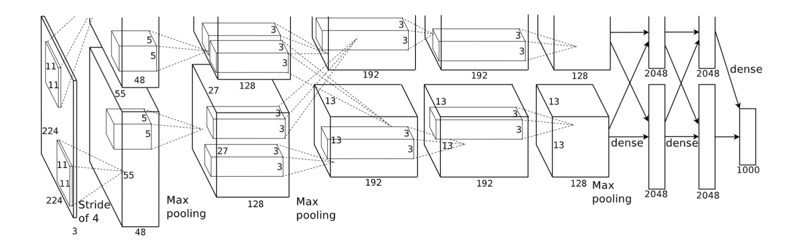

目录

- [AlexNet 简介](#alexnet-简介)
- [AlexNet 网络结构](#alexnet-网络结构)
- [参考](#参考)

# AlexNet 简介

2012年，深度学习三巨头之一的 Geoffrey Hinton 的学生 Alex Krizhevsky 率先提出了 AlexNet，
并在当年度的 ILSVRC(ImageNet 大规模视觉挑战赛)以显著的优势获得当届冠军，top-5 的错误率降至了 16.4%，
相比于第二名 26.2% 的错误率有了极大的提升。这一成绩引起了学界和业界的极大关注，
计算机视觉也开始逐渐进入深度学习主导的时代。

# AlexNet 网络结构

AlexNet 继承了 LeNet-5 的思想，将卷积神经网络发展到很宽很深的网络中，
相较 LeNet-5 的 6 万个参数，AlexNet 包含了 6 亿 3 千万条连接，
6 千万个参数和 65 万个神经元。

AlexNet 共有 8 层(输入输出层不计入层数，池化层与卷积层算 1 层)：

> * layer input:输入 
> * layer 1：卷积-池化 
> * layer 2：卷积-池化
> * layer 3：卷积
> * layer 4：卷积
> * layer 5：卷积-池化
> * layer 6：全连接
> * layer 7：全连接
> * layer 8：全连接
> * layer output：输出

原始论文中的结构：

# 参考

* [ImageNet Classification with Deep Convolutional Neural Networks](https://proceedings.neurips.cc/paper/2012/file/c399862d3b9d6b76c8436e924a68c45b-Paper.pdf?ref=blog.paperspace.com)