<style>
details {
    border: 1px solid #aaa;
    border-radius: 4px;
    padding: .5em .5em 0;
}
summary {
    font-weight: bold;
    margin: -.5em -.5em 0;
    padding: .5em;
}
details[open] {
    padding: .5em;
}
details[open] summary {
    border-bottom: 1px solid #aaa;
    margin-bottom: .5em;
}
img {
    pointer-events: none;
}
</style>

<details><summary>目录</summary><p>

- [目标检测概述](#目标检测概述)
- [目标检测发展](#目标检测发展)
    - [传统方法](#传统方法)
    - [R-CNN](#r-cnn)
    - [YOLO](#yolo)
- [目标检测网络框架](#目标检测网络框架)
    - [主干网络(backbone network)](#主干网络backbone-network)
    - [颈部网络(neck network)](#颈部网络neck-network)
    - [检测头(detection head)](#检测头detection-head)
- [目标检测数据集](#目标检测数据集)
    - [PASCAL VOC](#pascal-voc)
    - [MS COCO](#ms-coco)
- [目标检测性能指标](#目标检测性能指标)
    - [IoU](#iou)
    - [AP 和 mAP](#ap-和-map)
    - [FPS](#fps)
- [两部走算法系列](#两部走算法系列)
- [一步走算法系列](#一步走算法系列)
- [目标检测框架](#目标检测框架)
    - [目标检测实现框架](#目标检测实现框架)
- [参考](#参考)
</p></details><p></p>

# 目标检测概述

> 图像分类、检测、分割是计算机视觉领域的三大任务。

**图像分类**模型是将图像划分为单个类别，通常对应于图像中最突出的物体：

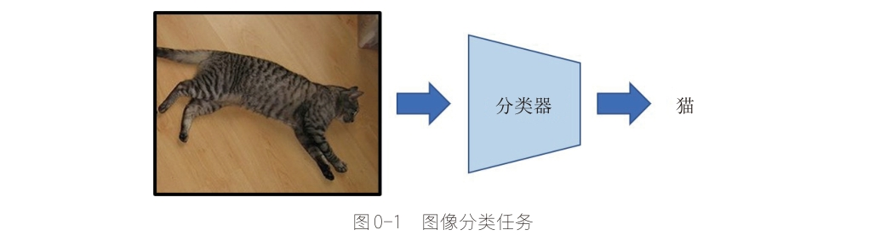

现实世界的很多图片通常包含不只一个物体，
此时如果使用图像分类模型为图像分配一个单一标签其实是非常粗糙的，并不准确。
对于这样的情况，就需要 **目标检测模型**。目标检测模型可以识别一张图片的多个物体，
并可以定位出不同物体(给出边界框)。目标检测在很多场景有用，如无人驾驶和安防系统。

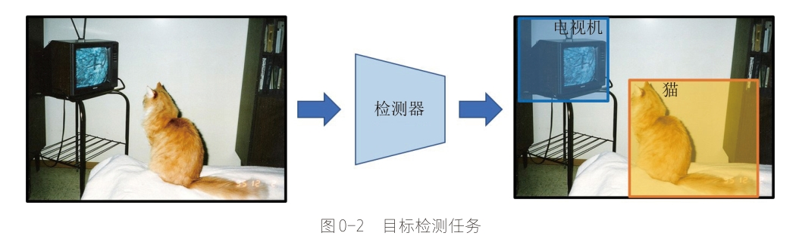

> 在深度学习正式成为计算机视觉领域的主题之前，**传统的手工特征图像算法**一直是目标检测的主要方法。
> 在早期计算资源不发达的背景下，研究人员的图像特征表达方法有限，
> 只能尽可能的设计更加多元化的检测算法来进行弥补，
> 包括早期的 **SIFT 检测算法**、**HOG 检测算法**和后来著名的 **DPM 模型**等；
> 
> 深度学习之前的早期目标检测算法的发展历程如下图所示(左边浅蓝色部分):
> 
> 
> 
> 2013 年之后，**神经网络和深度学习**逐渐取代了传统的图像检测算法而成为目标检测的主流方法。
> 
> 
> 
> 纵观这几年的深度学习目标检测发展历程，基于深度学习算法的一系列目标检测算法大致可以分为两大流派:
> 
> * **two-stage 检测算法**：将检测问题划分为两个阶段，
>   这类算法的典型代表是基于 region proposal 的 R-CNN 系算法，
>   如 R-CNN、Fast R-CNN、Faster R-CNN 等
>     - 首先产生候选区域(region proposals)
>     - 然后对候选区域分类，如 CNN 分类(一般还需要对位置精修)
> * **one-stage 检测算法**：不需要 region proposal 阶段，
>   直接对输入图像应用算法并输出类别概率和位置的定位(坐标值)，
>   比较典型的算法如 YOLO 和 SSD

# 目标检测发展

## 传统方法

在深度学习时代到来之前，研究者们对目标检测的研究路线基本可以分为两个阶段，
先从图像中提取人工视觉特征（如 HOG），再将这些视觉特征输入一个分类器（如支持向量机）中，
最终输出检测结果。从现在的技术眼光来看，这种方法十分粗糙。想做出一个可靠的通过目标检测器，
识别更多、更复杂的物体，则存在很大的困难，
造成这种困难的最根本的原因是难以用一套精准的语言或数学方程来定义世间万物。
显然，要检测的物体种类越多，模型要学会的特征就越多，仅靠人的先验所设计出的特征算子似乎无法满足任务需求了。

## R-CNN

2014 年，著名的 R-CNN 问世，不仅大幅提升了当时的基准数据 PASCAL VOC 的 mAP 指标，
同时也吹响了深度学习进军基于视觉的目标检测(object detection)领域的号角。从整体上来看，
R-CNN 的思路是先使用一个 **搜索算法** 从图像中提取出若干 **感兴趣区域(region of interest, RoI)**，
然后使用一个 **卷积神经网络(Convolutional Neural Network, CNN)** 分别处理每一个感兴趣区域，
提取特征，最后用一个支持向量机来完成最终的分类。

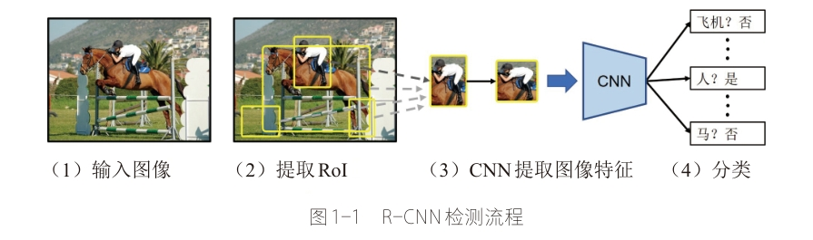

通常，搜索算法会先给出约 2000 个感兴趣区域，然后交给后续的 CNN 去分别提取每一个感兴趣区域的特征，
这一过程会十分耗时。为了解决这一问题，在 R-CNN 工作的基础上，
先后诞生了 Fast R-CNN 和 Faster R-CNN 这两个工作，迭代改进了 R-CNN 这一检测框架的各种弊端，
不断完善 R-CNN “先提取，后识别” 的检测范式。这一检测范式后被称为 “两阶段(two-stage)” 检测，
即 **先提取出可能包含目标的区域，再依次对每个区域进行识别，最后经过处理得到最终的检测结果**。

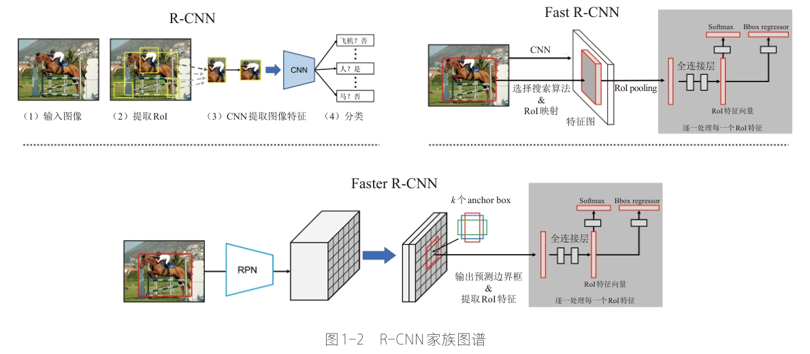

## YOLO

2015 年，YOLO(You Only Look  Once)问世。不同于 R-CNN 的两阶段检测范式，YOLO 的作者团队任务，
提取候选区域（定位）和逐一识别（分类）完全可由一个单独的网络来同时完成，无须分成两个阶段，
不需要对每一个特征区域进行依次分类，从而能够减少处理过程中的大量冗余操作。显然，YOLO 只需要对输入图像处理一次，
即可获得最终的检测结果，因而 YOLO 在检测速度上具有天然的优势。
YOLO 所采用的这种端到端的的检测方式将定位和分类耦合在一起，同步完成，因此，这类工作被称为 “单阶段(one-stage)” 检测。
显然，相较于以 R-CNN 为代表的两阶段检测范式，YOLO 这类单阶段检测框架理应更加高效、简洁。

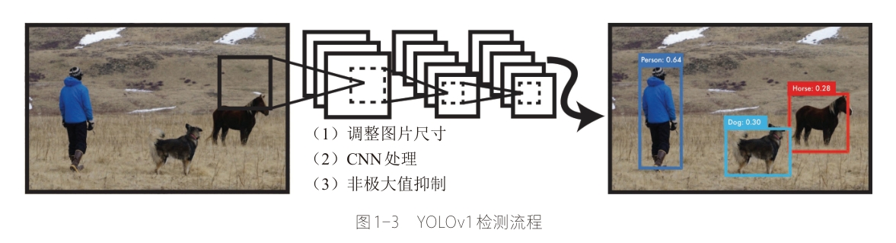

通常情况下，two-stage 框架往往检测精度搞而检测速度却较慢，one-stage 框架则恰恰相反，
往往检测精度较低但检测速度较快。随着检测框架的发展，
如今的 one-stage 检测框架几乎兼具了性能和速度两方面的优势，实现了极为出色的性能上的平衡。

# 目标检测网络框架

从深度学习时代开始，目标检测网络的框架也逐渐被确定下来。一个常见的目标检测网络往往可以分为三大部分：

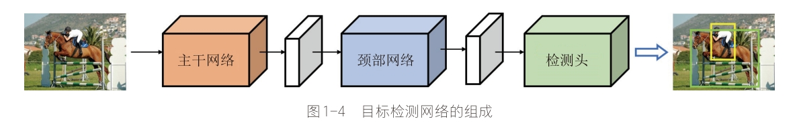

## 主干网络(backbone network)

主干网络是目标检测网络中最核心的部分，其关键作用就是提取输入图像中的高级特征，
减少图像中的冗余信息，以便于后续的网络去做深入的处理。在大多数情况下，
主干网络选的成败对检测性能的影响是十分巨大的。

常用的主干网络模型：

* VGG 网络
    - VGG-16
* ResNet 网络
    - ResNet-50
    - ResNet-101
* DarkNet 网络
    - DarkNet-19
    - DarkNet-53
* MobileNet 网络
    - MobileNet-v1
    - MobileNet-v2
    - MobileNet-v3
* ShuffleNet 网络
    - ShuffleNet-v1
    - ShuffleNet-v2

## 颈部网络(neck network)

颈部网络的主要作用是将由主干网络输出的特征进行二次处理。
其整合方式有很多，最为常见的就是 **特征金字塔网络(feature pyramid network, FPN)**，
其核心是将不同尺度的特征进行充分的融合，以提升检测器的多尺度检测的性能。
除此之外，还有很多单独的、可即插即用的模块，如 RFB、ASPP 和 YOLOv4 所使用的 SPP 模块等，
这些模块都可以添加在主干网络滞后，以进一步地处理和丰富特征信息，扩大模型地感受野。

常见的颈部网络

* 特征金字塔(feature pyramid network, FPN)

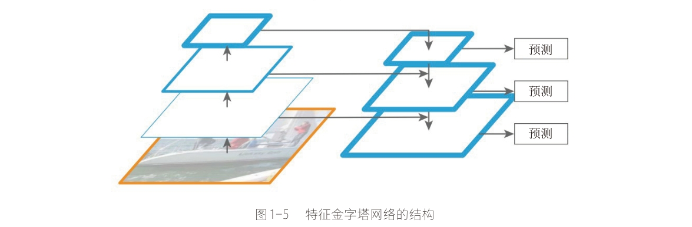

* 空间金字塔池化模块(spatial pyramid pooling, SPP)

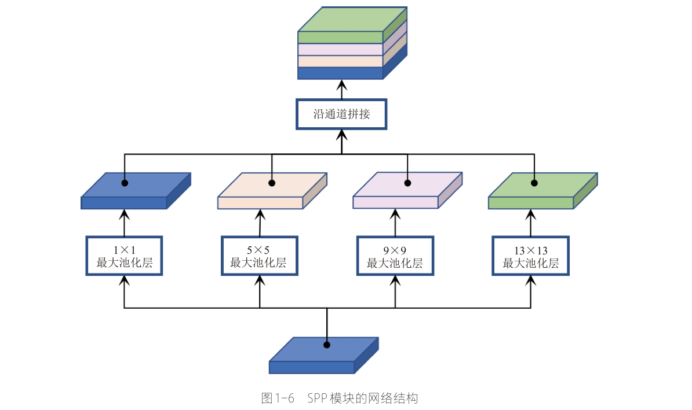

## 检测头(detection head)

检测头地结构相对简答，其主要作用就是提取类别信息和位置信息，输出最终的预测结果。
在某些工作里，检测头也被称为 **解码器(decoder)**，这种称呼不无道理，
因为检测头的作用就是从两个部分所输出的特征中提取并预测图像中的目标的 **空间位置** 和 **类别**，
它相当于一个解码器。

RetinaNet 采用了“解耦”结构的检测头，这是当前目标检测网络中常用的一种检测头结构，
它由两条并行的分支组成，每一条分支都包含若干层普通卷积、非线性激活函数以及用于最终预测的线性卷积层。

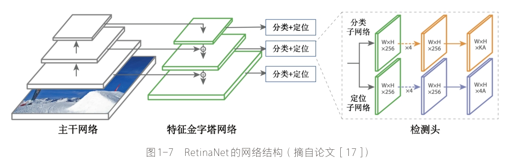


# 目标检测数据集

目标检测常用的数据集包括 PASCAL VOC、ImageNet、MS COCO 等数据集，
这些数据集用于研究者测试算法性能或者用于竞赛。

## PASCAL VOC

> PASCAL Visual Object Classes

数据下载：

```bash
$ sh VOC2007.sh
$ sh VOC2012.sh
```

数据介绍：

* 目标类别数量：20
* 图像数量：10000 多
* 常用数据集
    - `VOCxxxx` 数据结构 
        - JPEGImages：数据集图像
        - Annotations：每张图像的标注文件
        - SegmentationClass：用于语义分割和实例分割任务
        - SegmentationObject：用于语义分割和实例分割任务
        - ImageSets/Layout：用来划分数据集
            - test.txt
            - train.txt
            - trainval.txt
            - val.txt
    - 训练数据：16551
        - VOC2007：`trainval`
        - VOC2012：`trainval`
    - 测试数据：4952
        - VOC2007：`test`

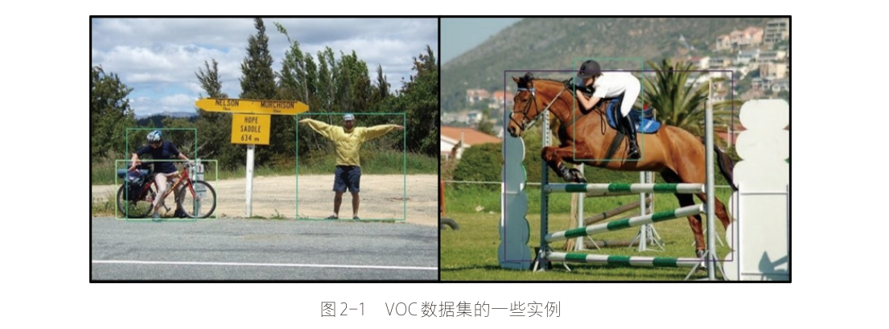

## MS COCO

> Microsoft Common Object in Context, COCO

数据下载：

```bash
$ sh COCO2017.sh
```

数据介绍：

* 训练数据图像：
    - 80 个类别
    - 11 万余张
* 目标物体
    - 小物体：32x32
    - 中物体：32x32 -> 96x96
    - 大物体：others

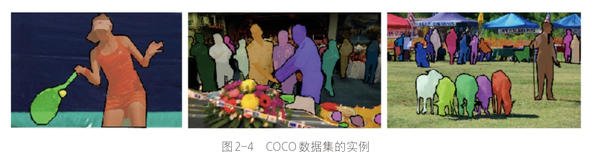
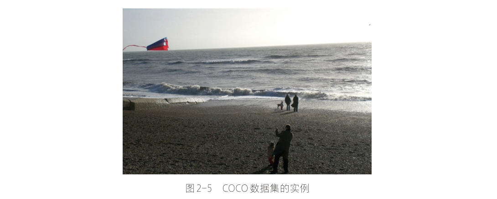

# 目标检测性能指标

目标检测模型的主要性能指标是检测**准确度**和**速度**。
对于**准确度**，目标检测要考虑物体的定位准确性，而不单单是分类准确度。
**一般情况下，two-stage 算法在准确度上有优势，而 one-stage 算法在速度上有优势。**
不过，随着研究的发展，两类算法都在两个方面做改进。

准确度(accuracy)和速度(speed)是一对矛盾体，
如何更好地平衡它们一直是目标检测算法研究的一个重要方向。

## IoU

目标检测问题同时是一个回归和分类问题。

首先，为了评估定位精度，需要计算 IoU(Intersection over Union，介于 0 到 1 之间)，
其表示预测框与真实框(ground-truth box)之间的重叠程度。
IoU 越高，预测框的位置越准确。


因而，在评估预测框时，通常会设置一个 IoU 阈值(如 0.5)，只有当预测框与真实框的 IoU 值大于这个阈值时，
该预测框才被认定为真阳性(True Positive，TP)，反之就是假阳性(False Positive，FP)。

## AP 和 mAP

对于二分类，AP(Average Precision)是一个重要的指标，这是信息检索中的一个概念，
基于 precision-recall 曲线计算出来，详情见[这里](https://link.zhihu.com/?target=https%3A//en.wikipedia.org/w/index.php%3Ftitle%3DInformation_retrieval%26oldid%3D793358396%23Average_precision)。

对于目标检测，首先要单独计算各个类别的 AP 值，这是评估检测效果的重要指标。
取各个类别的 AP 的平均值，就得到一个综合指标 mAP(Mean Average Precision)，
mAP 指标可以避免某些类别比较极端化而弱化其它类别的性能这个问题。

对于目标检测，mAP 一般在某个固定的 IoU 上计算，但是不同的 IoU 值会改变 TP 和 FP 的比例，
从而造成 mAP 的差异。

* COCO 数据集提供了[官方的评估指标](https://link.zhihu.com/?target=https%3A//github.com/cocodataset/cocoapi)，
  它的 AP 是计算一系列 IoU 下(0.5:0.05:0.9，见[说明](https://link.zhihu.com/?target=http%3A//cocodataset.org/%23detection-eval))AP 的平均值，这样可以消除 IoU 导致的 AP 波动。
* 对于 PASCAL VOC 数据集也是这样，Facebook 的 Detectron 上的有比较清晰的[实现](https://link.zhihu.com/?target=https%3A//github.com/facebookresearch/Detectron/blob/05d04d3a024f0991339de45872d02f2f50669b3d/lib/datasets/voc_eval.py%23L54)。

## FPS

除了检测准确度，目标检测算法的另外一个重要性能指标是速度，只有速度快，才能实现实时检测，这对一些应用场景极其重要。

评估速度的常用指标是每秒帧率(Frame Per Second，FPS)，即每秒内可以处理的图片数量。
当然要对比 FPS，需要在同一硬件上进行。另外也可以使用处理一张图片所需时间来评估检测速度，
时间越短，速度越快。

# 两部走算法系列

> two-stage

* R-CNN

    

    - R-CNN 作为将深度学习引入目标检测算法的开山之作，在目标检测算法发展历史上具有重大意义。
      R-CNN 算法是两步走方法的代表，即先生成候选区域(region proposal)，
      然后再利用 CNN 进行识别分类。由于候选框对于算法的成败起着关键作用，
      所以该方法就以 Region 开头首字母 R 加 CNN 进行命名。
    - 相较于传统的滑动卷积窗口来判断目标的可能区域，
      R-CNN 采用 selective search 的方法来预先提取一些较可能是目标物体的候选区域，
      速度大大提升，计算成本也显著缩小。总体而言，R-CNN 方法分为四个步骤:
        1. 生成候选区域
        2. 对候选区域使用 CNN 进行特征提取
        3. 将提取的特征送入 SVM 分类器
        4. 最后使用回归器对目标位置进行修正
    - 虽然 R-CNN 在 2013年的当时可谓横空出世，但也存在许多缺陷：
      selective search 方法生成训练网络的正负样本候选区域在速度上非常慢，
      影响了算法的整体速度；CNN 需要分别对每一个生成的候选区域进行一次特征提取，
      存在着大量的重复运算，制约了算法性能。 
* SPP-Net
    - 针对 R-CNN 的问题，提出 ResNet 的何恺明大佬提出了 SPP-Net。
      该算法通过在网络的卷积层和全连接层之间加入空间进字体池化层 (Spatial Pyramid Pooling) ，
      来对利用 CNN 进行卷积特征提取之前的候选区域进行裁剪和缩放使 CNN 的输入图像尺寸一致。
    - 空间金字塔池化解决了输入候选区域尺寸不一致的问题，但更重要的意义在于减少了 R-CNN 中的重复计算，
      大大提高的算法的速度和性能。
    - SPP-Net 的缺点在于经过空间金字塔层的处理后，虽然 CNN 的输入尺寸一致了，
      但候选框的感受野因而也变得很大，使得卷积神经网络在训练时无法有效更新模型权重。 
* Fast R-CNN

    

    - 针对 SPP-Net 的问题，2015年微软研究院在借鉴了 SPP-Net 的空间金字塔层的基础之上，
      对 R-CNN 算法进行了有效的改进。
    - Fast R-CNN 的结构如上图所示。Fast R-CNN 的改进之处在于设计了一种 ROI Pooling 的池化层结构，
      有效解决了 R-CNN 算法必须将图像区域剪裁、缩放到相同尺寸大小的操作。提出了多任务损失函数，
      每一个 ROI 都有两个输出向量：softmax 概率输出向量和每一类的边界框回归位置向量。
    - Fast R-CNN 虽然借鉴了 SPP-Net 的思想，但对于 R-CNN 的 selective search 的候选框生成方法依然没做改进，
      这使得 Fast R-CNN 依然有较大的提升空间。 
* Faster R-CNN

    

* Mask R-CNN

    


# 一步走算法系列

> one-stage

纵然两步走的目标检测算法在不断进化，检测准确率也越来越高，但两步走始终存在的速度的瓶颈。
在一些实时的目标检测需求的场景中，R-CNN 系列算法终归是有所欠缺。
因而一步走 (one-stage) 算法便应运而生了，其中以 yolo 算法系列为代表，
演绎了一种端到端的深度学习系统的实时目标检测效果。

yolo 算法系列的主要思想就是直接从输入图像得到目标物体的类别和具体位置，
不再像 R-CNN 系列那样产生候选区域。这样做的直接效果便是快。

* YOLOv1
    - 论文：You Only Look Once: Unified, Real-Time Object Detection
    - [yolo v1 pytorch 参考](https://github.com/xiongzihua/pytorch-YOLO-v1)
* YOLOv2：yolo9000
    - 论文：YOLO9000: Better, Faster, Stronger
    - [yolo 9000 源码参考](https://github.com/philipperemy/yolo-9000)
* YOLOv3
    - 论文：YOLOv3: An Incremental Improvement
    - [yolo v3 源码参考](https://github.com/ayooshkathuria/pytorch-yolo-v3)
* YOLOv4
    - [Blog](https://mp.weixin.qq.com/s/87aeQpJ_3yW2BYUJpE4I7w)
* YOLOX
* YOLOv7
* YOLOv9
    - [Paper](https://arxiv.org/pdf/2402.13616.pdf)
    - [GitHub](https://github.com/WongKinYiu/yolov9)
    - [Blog](https://mp.weixin.qq.com/s/ymIPPTmKUf8BLLhl2TO3_g)
* SSD
    - 论文：SSD: Single Shot MultiBox Detector
    - [SSD TensorFlow 源码参考](https://github.com/balancap/SSD-TensorFlow)

# 目标检测框架

* DETR
* YOLOF
* FCOS

## 目标检测实现框架

* Google 在 2017 年开源了 [TensorFlow Object Detection API](https://link.zhihu.com/?target=https%3A//github.com/tensorflow/models/tree/master/research/object_detection)，
  并对主流的 Faster R-CNN、R-FCN 及 SSD 三个算法在 MS COCO 数据集上的性能做了细致对比(见 Huang et al. 2017)，
  如下图所示：

    
    <center>Faster R-CNN，R-FCN 及 SSD 算法在 MS COCO 数据集上的性能对比</center>

* 近期，Facebook 的 FAIR 也开源了基于 Caffe2 的目标检测平台 [Detectron](https://link.zhihu.com/?target=https%3A//github.com/facebookresearch/Detectron)，
  其实现了最新的 Mask R-CNN，RetinaNet 等检测算法，
  并且给出了这些算法的 [Baseline Results](https://link.zhihu.com/?target=https%3A//github.com/facebookresearch/Detectron/blob/master/MODEL_ZOO.md) 。

# 参考

* 论文：Rich feature hierarchies for accurate object detection and semantic segmentation
* [R-CNN TensorFlow 实现参考](https://github.com/yangxue0827/RCNN)
* 论文：Spatial Pyramid Pooling in Deep Convolutional Networks for Visual Recognition
* [SPP-Net TensorFlow 实现参考](https://github.com/chengjunwen/spp_net)
* 论文：Fast R-CNN
* [Fast R-CNN caffe 源码参考](https://github.com/rbgirshick/fast-rcnn)