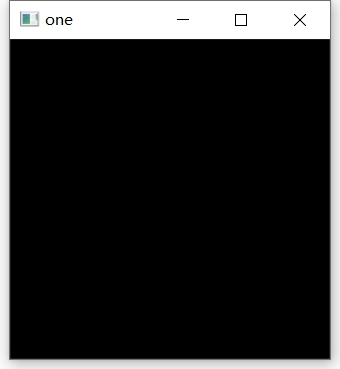
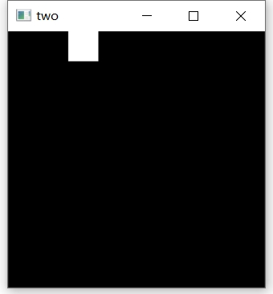
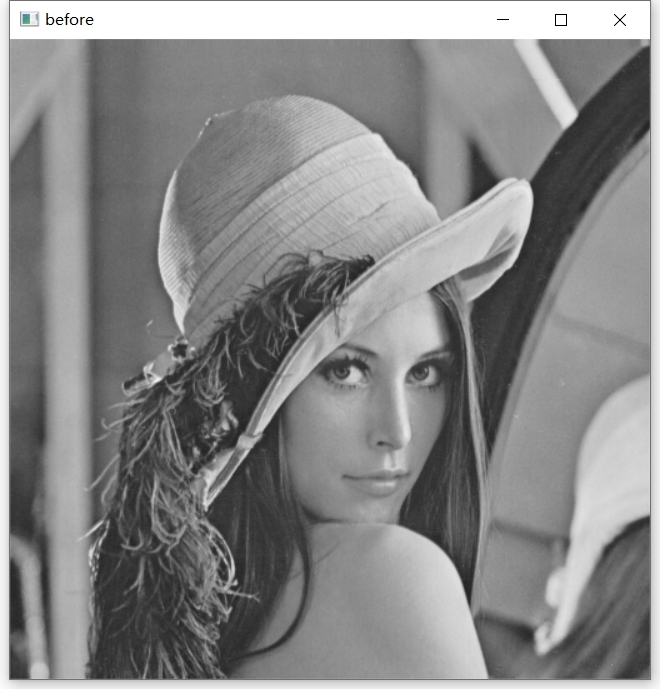
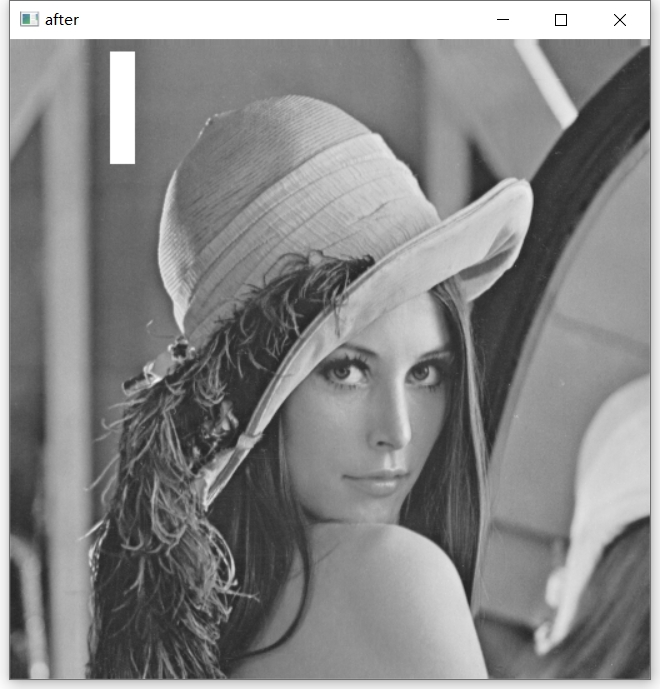
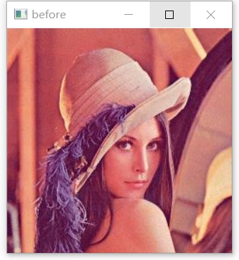
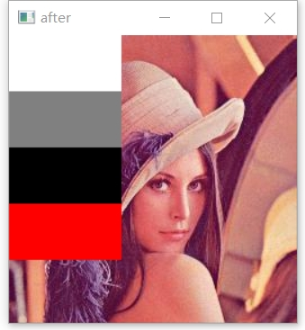

<style>
details {
    border: 1px solid #aaa;
    border-radius: 4px;
    padding: .5em .5em 0;
}
summary {
    font-weight: bold;
    margin: -.5em -.5em 0;
    padding: .5em;
}
details[open] {
    padding: .5em;
}
details[open] summary {
    border-bottom: 1px solid #aaa;
    margin-bottom: .5em;
}
img {
    pointer-events: none;
}
</style>

<details><summary>目录</summary><p>

- [OpenCV 简介](#opencv-简介)
    - [OpenCV 基本信息](#opencv-基本信息)
    - [IPPICV 加速](#ippicv-加速)
- [OpenCV-Python](#opencv-python)
    - [OpenCV-Python 依赖](#opencv-python-依赖)
    - [OpenCV-Python 安装](#opencv-python-安装)
        - [使用预构建的二进制文件和源代码](#使用预构建的二进制文件和源代码)
        - [使用非官方的 Python 预构建 OpenCV 包](#使用非官方的-python-预构建-opencv-包)
    - [OpenCV-Python 调用](#opencv-python-调用)
- [OpenCV 图像基本操作](#opencv-图像基本操作)
    - [图像读取](#图像读取)
        - [API](#api)
        - [示例](#示例)
    - [图像显示](#图像显示)
        - [API](#api-1)
        - [Jupyter Notebook](#jupyter-notebook)
        - [Python Script](#python-script)
    - [图像保存](#图像保存)
        - [API](#api-2)
        - [示例](#示例-1)
    - [像素处理](#像素处理)
        - [二值图像及灰度图像](#二值图像及灰度图像)
        - [彩色图像](#彩色图像)
    - [通道处理](#通道处理)
        - [通道拆分](#通道拆分)
        - [通道合并](#通道合并)
    - [调整图像大小](#调整图像大小)
    - [掩模](#掩模)
    - [色彩处理](#色彩处理)
    - [滤波处理](#滤波处理)
    - [形态学](#形态学)
    - [图像变换](#图像变换)
        - [图像翻转](#图像翻转)
    - [在图像上绘图](#在图像上绘图)
        - [基本流程](#基本流程)
        - [直线](#直线)
        - [矩形](#矩形)
        - [圆圈](#圆圈)
    - [在图像上写文字](#在图像上写文字)
        - [API](#api-3)
        - [示例](#示例-2)
- [OpenCV 收集图片数据集](#opencv-收集图片数据集)
    - [初始化](#初始化)
    - [示例](#示例-3)
    - [参考](#参考)
- [OpenCV 图像投影变换](#opencv-图像投影变换)
    - [投影变换(仿射变换)](#投影变换仿射变换)
        - [投影变换矩阵](#投影变换矩阵)
        - [投影变换](#投影变换)
    - [示例](#示例-4)
- [OpenCV BGR 像素强度图](#opencv-bgr-像素强度图)
    - [图像属性、像素属性](#图像属性像素属性)
    - [BGR 像素强度线(计数图)](#bgr-像素强度线计数图)
- [参考](#参考-1)
</p></details><p></p>


# OpenCV 简介

## OpenCV 基本信息

> OpenCV (Open Source Computer Vision Library)，一个开源的计算机视觉库，
> 官方网站为 [http://opencv.org](http://opencv.org/)。它提供了很多函数，
> 这些函数非常高效地实现了计算机视觉算法，从最基本的滤波到高级的物体检测皆有涵盖。
>
> 1999 年，Gary Bradski(加里·布拉德斯基)当时在英特尔任职，
> 怀着通过为计算机视觉和人工智能的从业者提供稳定的基础架构并以此来推动产业发展的美好愿景，
> 他启动了 OpenCV 项目。

* OpenCV 的一个目标是提供易于使用的计算机视觉接口，从而帮助人们快速建立精巧的视觉应用；
* OpenCV 设计用于进行高效的计算，十分强调实时应用的开发。它由 C++ 语言编写并进行了深度优化，
  从而可以享受多线程处理的优势。同时也提供了 Python、Java、MATLAB 等语言的接口；
* OpenCV 是跨平台的，可以在 Windows、Linux、macOS、Android、iOS 等系统上运行；
* OpenCV 库包含从计算机视觉各个领域衍生出来的 500 多个函数，
  包括工业产品质量检验、医学图像处理、安保领域、交互操作、相机校正、双目视觉以及机器人学。
  OpenCV 的应用非常广泛，包括图像拼接、图像降噪、产品质检、人机交互、人脸识别、动作识别、动作跟踪、无人驾驶等；
* 因为计算机视觉和机器学习经常在一起使用，所以 OpenCV 也包含一个完备的、具有通用性的机器学习库(ML模块)。
  这个子库聚焦于统计模式识别以及聚类。ML 模块对 OpenCV 的核心任务(计算机视觉)相当有用，
  但是这个库也足够通用，可以用于任意机器学习问题。

## IPPICV 加速

- 如果希望得到更多在英特尔架构上的自动优化，可以购买英特尔的集成性能基元(IPP)库，
  该库包含了许多算法领域的底层优化程序。在库安装完毕的情况下 OpenCV 在运行的时候会自动调用合适的 IPP 库
- 从 OpenCV 3.0 开始，英特尔许可 OpenCV 研发团队和 OpenCV 社区拥有一个免费的 IPP 库的子库(称 IPPICV)，
  该子库默认集成在 OpenCV 中并在运算时发挥效用。如果你使用的是英特尔的处理器，那么 OpenCV 会自动调用 IPPICV。
- IPPICV 可以在编译阶段链接到 OpenCV，这样一来，
  会替代相应的低级优化的 C 语言代码(在 cmake 中设置 `WITH_IPP=ON/OFF` 来开启或者关闭这一功能，默认情况为开启)。
  使用 IPP 获得的速度提升非常可观

# OpenCV-Python

OpenCV-Python 是用于 OpenCV 的 Python API，结合了 OpenCV C++ API 和 Python 的最佳特性。

OpenCV-Python 依赖于 Numpy 库，所有的 OpenCV 数组结构都能够与 Numpy 数组相互转换，
这也使得使用 OpenCV 与 Numpy 的其他库的集成变得更加容易。

## OpenCV-Python 依赖

* OpenCV 3.x
* Python 3
* Numpy
* Matplotlib

## OpenCV-Python 安装

### 使用预构建的二进制文件和源代码

- [Ubuntu doc](https://mp.weixin.qq.com/s?__biz=MzU2NTUwNjQ1Mw==&mid=2247484077&idx=1&sn=f8ac89b218addfe8b4110b8dfa121938&scene=19#wechat_redirect)
- [Windows doc](https://docs.opencv.org/3.0-beta/doc/py_tutorials/py_setup/py_setup_in_windows/py_setup_in_windows.html)
- [macOS doc](https://www.pyimagesearch.com/2016/12/19/install-opencv-3-on-macos-with-homebrew-the-easy-way/)

### 使用非官方的 Python 预构建 OpenCV 包 

在 macOS、Windows、Linux 环境中安装:

- 如果只需要主模块(main module)

```bash
$ pip install opencv-python
```

- 如果需要主模块(main module)和 contrib 模块

```bash
$ pip install opencv-contrib-python
```

## OpenCV-Python 调用

> `cv2` 模块内采用的是面向对象的编程方式，而 `cv` 模块内更多采用的是面向过程的编程方式。

```python
import cv2 as cv
print(cv.__version__)
```

# OpenCV 图像基本操作

* 键盘上的 Escape 键(`0xFF == 27`)
    - 如果按下了退出键，则循环将中断并且程序停止
* `cv2.destroyAllWindow()`
    - 如果要销毁任何特定窗口，将确切的窗口名称作为参数传递

## 图像读取

### API

* `cv2.imread(filename, flags)`
    - `filename`：要读取的图像的完整文件名
    - `flags`：读取标记。用来控制读取文件的类型
        - `flag = cv2.IMREAD_UNCHANGED`
            - 加载图像，保持原始格式不变，包括 alpha 通道
            - 参数编码：`-1`
        - `flag = cv2.IMREAD_GRAYSCALE`
            - 将图像调整为单通道的灰度图像
            - 参数编码：`0`
        - `flag = cv2.IMREAD_COLOR`
            - 将图像调整为三通道的 BGR 彩色图像，任何图像的透明度都会被忽视，默认选项 
            - 参数编码：`1`  

### 示例

```python
import cv2

img = cv2.imread(
    "D:/projects/computer_vision/cvproj/data/images/lena.jpg"
)

print(type(img))
print(img.shape)
print(img)
```

```
<class 'numpy.ndarray'>
(256, 256, 3)
[[[121 135 223]
  [123 137 225]
  [124 138 226]
  ...
  [132 144 238]
  [136 152 241]
  [120 137 224]]

 [[123 137 225]
  [122 139 226]
  [125 139 227]
  ...
  [134 142 235]
  [134 144 232]
  [114 124 211]]

 [[122 138 227]
  [120 138 227]
  [123 139 228]
  ...
  [148 149 239]
  [142 143 229]
  [119 121 205]]

 ...

 [[ 61  27  91]
  [ 66  32  96]
  [ 70  34 100]
  ...
  [ 74  51 136]
  [ 81  62 149]
  [ 84  67 154]]

 [[ 57  26  87]
  [ 62  28  92]
  [ 67  31  97]
  ...
  [ 82  60 148]
  [ 85  67 156]
  [ 85  69 157]]

 [[ 53  22  83]
  [ 58  24  88]
  [ 62  26  92]
  ...
  [ 94  75 162]
  [ 96  78 169]
  [ 92  75 166]]]
```

## 图像显示

### API

1. `cv2.imshow(winname, mat)`

* `winname`：窗口名称
* `mat`：要显示的图像
* 使用 `cv.imshow` 显示图像时，显示图像的窗口自动适合图像尺寸

2. `cv2.waitKey(delay)` 

* 用来等待按键，当用户按下按键后，该语句会被执行，并获取返回值。
  在实践中，通常使用该函数实现暂停功能。当程序运行到该语句时，会按照参数 `delay` 指定的值等待特定时长。
* 语法：

    ```python
    res = cv2.waitKey(delay)
    ```

    - `res`：表示返回值
        - 若在等待时间（由参数 `delay` 指定）内，有按键被按下，则返回该按键的 ASCII 码；
        - 若在等待时间内，没有按键被按下，则返回 `-1` 
    - `delay`：表示等待键盘触发的时间，单位是 ms(毫秒)，该值默认值为 0
        - 若 `delay` 的值为空、0、负数，则程序会一直等待直到按键被按下。在按键事件发生时，会返回该按键的 ASCII 码，
          继续执行后续程序； 
        - 若 `delay` 值为正数，则在这段时间内，程序等待按键被按下
            - 在按键事件发生时，返回该按键的 ASCII 码，继续执行后续程序语句；
            - 若在 `delay` 参数所指定的时间内一直没有键盘被按下，则在超过等待时间后返回 -1，继续执行后续程序。
 
`cv2.destroyAllWindows()` 


* 作用：用来释放创建的所有窗口
* 语法：

    ```python
    None = cv2.destroyAllWindows()
    ```

<div class="warning" style='background-color:#E9D8FD; color: #69337A; border-left: solid #805AD5 4px; border-radius: 4px; padding:0.7em;'>
    <span>
        <p style='margin-top:1em; text-align:left'>
            <b>Note</b>
        </p>
        <p style='margin-left:1em;'>
            由于 OpenCV 和 Matplotlib 具有不同的原色顺序，
            OpenCV 以 BGR 的形式读取图像, Matplotlib 以 RGB 的形式读取图像，
            因此为了正常显示图像，在用 Matplotlib 显示图像时，
            需要将图像转换为 Matplotlib 的形式。
        </p>
        <p style='margin-bottom:1em; margin-right:1em; text-align:right; font-family:Georgia'> 
            <b></b> 
            <i></i>
        </p>
    </span>
</div>


### Jupyter Notebook

OpenCV 显示图像：

```python
import cv2

# 读取图像
img_bgr = cv2.imread("img.jpg")

# 显示图像
cv2.imshow("image", img_bgr)
cv2.waitKey(0)
cv2.destroyAllWindows()
```

Matplotlib 显示图像：

```python
import matplotlib.pyplot as plt
import cv2

# 读取图像
img_bgr = cv2.imread("img.jpg")

# 将 opencv 图像转换为 matplotlib 的形式
img_rgb = cv2.cvtColor(img_bgr, cv2.COLOR_BGR2RGB)
plt.imshow("image", img_rgb)
cv2.waitKey(0)
cv2.destroyAllWindows()
```

### Python Script

```python
import cv2

img = cv2.imread("img.jpg")

while True:
    cv2.imshow("image", img)
    if cv2.waitKey(1) & 0xFF == 27:
        break
cv2.destroyAllWindows()
```

## 图像保存

### API

`cv2.imwrite()`

* 语法：

    ```python
    res = cv2.imwrite(filename, img)
    ```

    - `res`：返回值，保存成功返回 `True`，否则返回 `False`
    - `filename`：要保存的目标文件的完整路径名，包括文件扩展名
    - `img`：被保存图像的名称

### 示例

```python
import cv2

img = cv2.imread("img.jpg")
cv2.imwrite("final_image.png", img)
```

## 像素处理

像素是图像构成的基本单位，像素处理是图像处理的基本操作，可以通过索引对图像内的元素进行访问和处理。

### 二值图像及灰度图像

OpenCV 中的最小的数据类型是无符号的 8 位二进制数，其最小值是 0，最大值是 255。
其使用 8 位二进制数的最小值 0 表示二值图像中的黑色，
使用 8 位二进制数的最大值 255 表示二值图像中的白色。
因此，可以将二值图像理解为特殊的灰度图像，其像素值仅有最大值 255 和最小值 0。
因此，下文仅考虑灰度图像的读取和修改等，不再单独对二值图像进行讨论。

可以将图像理解为一个矩阵，在面向 Python 的 OpenCV 中，图像就是 Numpy 库中的数组（`numpy.ndarray`），
一个灰度图象是一个二位数组，可以通过索引访问其中的像素值。

示例 1：

为了方便理解，首先使用 Numpy 库来生成一个 `$8 \times 8$` 大小的数组，用来模拟一个黑色图像，并对其及进行简单处理。

```python
import numpy as np
import cv2

# 生成 8×8 的黑色图像
img = np.zeros((8, 8), dtype = np.uint8)
print(f"img=\n{img}")
cv2.imshow("one", img)

print(f"读取像素点 img[0, 3]={img[0, 3]}")
img[0, 3] = 255
print(f"修改后 img=\n{img}")

print(f"读取修改后像素点 img[0, 3]={img[0, 3]}")
cv2.imshow("two", img)
cv2.waitKey()
cv2.destroyAllWindows()
```

```
img=
[[0 0 0 0 0 0 0 0]
 [0 0 0 0 0 0 0 0]
 [0 0 0 0 0 0 0 0]
 [0 0 0 0 0 0 0 0]
 [0 0 0 0 0 0 0 0]
 [0 0 0 0 0 0 0 0]
 [0 0 0 0 0 0 0 0]
 [0 0 0 0 0 0 0 0]]
```



```
读取像素点 img[0, 3]=0

修改后 img=
[[  0   0   0 255   0   0   0   0]
 [  0   0   0   0   0   0   0   0]
 [  0   0   0   0   0   0   0   0]
 [  0   0   0   0   0   0   0   0]
 [  0   0   0   0   0   0   0   0]
 [  0   0   0   0   0   0   0   0]
 [  0   0   0   0   0   0   0   0]
 [  0   0   0   0   0   0   0   0]]

读取修改后像素点 img[0, 3]=255
```



示例 2：

```python
img = cv2.imread("D:/projects/computer_vision/cvproj/data/images/lena_gray.bmp", 0)
cv2.imshow("before", img)

print(f"img 尺寸：{img.shape}")
print(f"img[50, 90] 原始值：{img[50, 90]}")
img[10:100, 80:100] = 255
print(f"img[50, 90] 修改值：{img[50, 90]}")
cv2.imshow("after", img)

cv2.waitKey()
cv2.destroyAllWindows()
```



```
img 尺寸：(512, 512)
img[50, 90] 原始值：105
img[50, 90] 修改值：255
```




### 彩色图像

OpenCV 在处理 RGB 模式的彩色图像时，会按照行方向依次分别读取该 RGB 图像像素点的 B 通道、
G 通道、R 通道的像素值，并将像素值以行为单位存储在 `ndarray` 的列中。

例如，有一幅大小为 R 行 `$\times$` C 列的原始 RGB 图像，其在 OpenCV 内以 BGR 模式的三维数组形式存储，
可以使用表达式访问数组内的值。可以使用 `image[0, 0, 0]` 访问 `image` 图像 B 通道内第 0 行第 0 列上的像素点，
其中：

* 第一个索引表示第 0 行；
* 第二个索引表示第 0 列；
* 第三个索引表示第 0 个颜色通道（B 通道）。

示例：

```python
import cv2

img = cv2.imread("D:/projects/computer_vision/cvproj/data/images/lean.png")
cv2.imshow("before", img)

print(f"访问 img[0, 0] = {img[0, 0]}")
print(f"访问 img[0, 0, 0] = {img[0, 0, 0]}")
print(f"访问 img[0, 0, 1] = {img[0, 0, 1]}")
print(f"访问 img[0, 0, 2] = {img[0, 0, 2]}")
print(f"访问 img[50, 0] = {img[50, 0]}")
print(f"访问 img[100, 0] = {img[100, 0]}")

# 区域 1：白色
img[0:50, 0:100, 0:3] = 255

# 区域 2：灰色
img[50:100, 0:100, 0:3] = 128

# 区域 3：黑色
img[100:150, 0:100, 0:3] = 0

# 区域 4：红色
img[150:200, 0:100] = [0, 0, 255]

cv2.imshow("after", img)
print(f"修改后 img[0, 0] = {img[0, 0]}")
print(f"修改后 img[0, 0, 0] = {img[0, 0, 0]}")
print(f"修改后 img[0, 0, 1] = {img[0, 0, 1]}")
print(f"修改后 img[0, 0, 2] = {img[0, 0, 2]}")
print(f"修改后 img[50, 0] = {img[50, 0]}")
print(f"修改后 img[100, 0] = {img[100, 0]}")

cv2.waitKey()
cv2.destroyAllWindows()
```



```
访问 img[0, 0] = [121 135 223]
访问 img[0, 0, 0] = 121
访问 img[0, 0, 1] = 135
访问 img[0, 0, 2] = 223
访问 img[50, 0] = [ 70  49 151]
访问 img[100, 0] = [ 87  70 181]
```



```
修改后 img[0, 0] = [255 255 255]
修改后 img[0, 0, 0] = 255
修改后 img[0, 0, 1] = 255
修改后 img[0, 0, 2] = 255
修改后 img[50, 0] = [128 128 128]
修改后 img[100, 0] = [0 0 0]
```

## 通道处理

RGB 图像是由 R 通道、G 通道、B 通道三个通道构成的。
需要注意的是，OpenCV 中的通道是按照 B->G->R 通道的顺序存储的。
在图像处理过程中，可以根据需要对通道进行拆分和合并。

### 通道拆分


### 通道合并


## 调整图像大小


## 掩模


## 色彩处理


## 滤波处理


## 形态学

## 图像变换

图像变换包括:

* 平移
* 旋转
* 缩放
* 裁剪
* 翻转

### 图像翻转

```python
import matplotlib.pyplot as plt
import cv2

img = cv2.imread("img.jpg")
cv2.flip()
```

## 在图像上绘图

### 基本流程

1. 读取或创建一个图像作为模板

```python
import numpy as np
import matplotlib.pyplot as plt

# 创建简单图像
img_blank = np.zeros(shape = (512, 512, 3), dtype = np.int16)
plt.imshow(img_blank)
plt.show()

# 读取图像
img_bgr = cv2.imread("img.jpg")
img_rgb = cvtColor(img_bgr, cv2.COLOR_BGR2RGB)
plt.imshow(img_rgb)
plt.show()
```


2. 功能与属性

在图像上绘制形状的通用函数是 `cv2.shape()`:

```python
import cv2

cv2.shape(img, pt1, pt2, color, thickness, lineType)
```

参数:

- `cv2.shape()`: shape 可以是 line, rectangle, ...
- `img`: 被绘制形状的图像
- `pt1`, `pt2`: 形状从左下角(pt1)到右下角(pt2)的坐标
- `color`: 要绘制的形状的颜色, 如 (255, 0, 0) 表示灰度
- `thickness`: 几何图形的厚度
- `lineType`: 线类型

### 直线

```python
import matplotlib.pyplot as plt
import cv2

img_line = cv2.line(
    img = img_blank, 
    pt1 = (0, 0), 
    pt2 = (511, 511), 
    color = (255, 0, 0), 
    thickness = 5, 
    lineType = 8
)
plt.imshow(img_line)
plt.show()
```


### 矩形

```python
import matplotlib.pyplot as plt
import cv2

img_rectangle = cv2.rectangle(
    img = img_blank, 
    pt1 = (384, 0),
    pt2 = (510, 128), 
    color = (0, 0, 255), 
    thickness = 5,
    lineType = 8,
)
plt.imshow(img_rectangle)
plt.show()
```


### 圆圈

```python
import matplotlib.pyplot as plt
import cv2

img_circle = cv2.circle(
    img = img_blank, 
    center = (447, 63), 
    radius = 63, 
    color = (0, 0, 255), 
    thickness = -1,
    lineType = 8,
)
plt.imshow(img_circle)
plt.show()
```


## 在图像上写文字

### API

```python
cv2.putText(
    img, 
    text, 
    org, 
    fontFace, 
    fontScale, 
    color, 
    thickness, 
    lineType
)
```

主要参数：

- `img`: 文字背景图像
- `text`: 文字内容
- `org`: 文字的坐标，从左下角开始
- `fontFace`: 文字字体
- `fontScale`: 文字大小比例
- `color`: 文字颜色
- `thickness`: 文字字体粗细
- `lineType`: 文字线条类型

### 示例

```python
import matplotlib.pyplot as plt
import cv2

font = cv2.FONT_HERSHEY_SCRIPT_SIMPLEX
img_text = cv2.putText(
    img = img_blank,             # 图像
    text = "OpenCV",             # 文字内容
    org = (150, 200),              # 文字坐标
    fontFace = font,             # 文字字体
    fontScale = 2,               # 文字比例
    color = (255, 255, 255),     # 文字颜色
    thickness = 5,               # 文字字体粗细
    lineType = cv2.LINE_AA,      # 文字线条类型
)
plt.imshow(img_text)
plt.show()
```


# OpenCV 收集图片数据集

通过视频截取图像来创建图像数据集是收集和格式化图像数据的最简单方法之一。
建议在有一面空白墙壁来收集数据，以确保框架中没有外部噪音

## 初始化

创建一个 VideoCapture 对象，该对象从系统的网络摄像头实时捕获视频

* `flag_collecting`：这是一个布尔变量，用作暂停/恢复按钮
* `images_collected`：这是一个整数变量，用于指示系统中收集和保存的图像数量
* `images_required`：这是一个整数变量，用于指示我们打算收集的图像数量

## 示例

```python
import os
import cv2

# 创建 VideoCapture 对象
cap = cv2.VideoCapture(0)

flag_collecting = False
images_collected = 0
images_required = 50

# 创建项目目录
directory = os.path.join(os.path.dirname(__file__), "demo")
if not os.path.exists(directory):
    os.mkdir(directory)

# 收集和格式化图像数据集
while True:
    # 
    ret, frame = cap.read()
    frame = cv2.flip(frame, 1)

    # 设置收集图像的数据量    
    if images_collected == images_required:
        break

    # 绘制矩形    
    cv2.rectangle(frame, (380, 80), (620, 320), (0, 0, 0), 3)

    if flag_collecting == True:
        sliced_frame = frame[80:320, 380:620]
        save_path = os.path.join(directory, f'{images_collected + 1}.jpg')
        cv2.imwrite(save_path, sliced_frame)
        images_collected += 1
    
    cv2.putText(
        frame, 
        f"Saved Images: {images_collected}", 
        (400, 50), 
        cv2.FONT_HERSHEY_SIMPLEX, 
        0.7,
        (0, 0, 0),
        2
    )
    cv2.imshow("Data Collection", frame)

    k = cv2.waitKey(10)
    if k == ord("s"):
        flag_collecting = not flag_collecting
    if k == ord("q"):
        break

print(images_collected, "images saved to directory")
cap.release()
cv2.destroyAllWindows()
```

## 参考

* [Capture Video from Camera](https://docs.opencv.org/4.x/dd/d43/tutorial_py_video_display.html)
* [使用 OpenCV 收集数据](https://mp.weixin.qq.com/s/R9uBQaVl2Zlr2rZ5kaq4Rw)

# OpenCV 图像投影变换

## 投影变换(仿射变换)

在数学中，线性变换是将一个向量空间映射到另一个向量空间的函数，通常由矩阵实现。
如果映射保留向量加法和标量乘法，则映射被认为是线性变换

要将线性变换应用于向量(即，一个点的坐标，在图像中就是像素的 `$x$` 和 `$y$`值)，
需要将该向量乘以表示线性变换的矩阵。作为输出，将获得一个坐标转换后的向量

### 投影变换矩阵

投影变换可以用下面的矩阵表示

`$$
\left[
    \begin{array}{c}
        a_{1} & a_{2} & b_{1}\\
        a_{3} & a_{4} & b_{2}\\
        c_{1} & c_{2} & 1\\
    \end{array}
\right]$$`

其中:

`$$
\left[
    \begin{array}{c}
        a_{1} & a_{2}\\
        a_{3} & a_{4}\\
    \end{array}
\right]$$`

是一个旋转矩阵，该矩阵定义了将要执行的变换类型: 缩放、旋转等

`$$
\left[
    \begin{array}{c}
        b_{1}\\
        b_{2}\\
    \end{array}
\right]$$`

是一个平移向量，它只移动点

`$$
\left[
    \begin{array}{c}
        c_{1} & c_{2}\\
    \end{array}
\right]$$`

是投影向量，对于仿射变换，该向量的所有元素始终等于 0

### 投影变换

如果 `$x$` 和 `$y$` 是一个点的坐标，则可以通过简单的乘法进行变换

`$$
\left[
    \begin{array}{c}
        a_{1} & a_{2} & b_{1}\\
        a_{3} & a_{4} & b_{2}\\
        c_{1} & c_{2} & 1\\
    \end{array}
\right] \times
\left[
    \begin{array}{c}
        x\\
        y\\
        1\\
    \end{array}
\right] =
\left[
    \begin{array}{c}
        x^{'}\\
        y^{'}\\
        1\\
    \end{array}
\right]$$`

其中: `$x^{'}$` 和 `$y^{'}$` 是变换点的坐标

## 示例

1. 读取源图像并获取源图像的大小

```python
import numpy as np
import matplotlib.pyplot as plt
import cv2

# 源图像
img_src = cv2.imread("source_image.jpg", cv2.IMREAD_COLOR)

# 源图像大小参数
h, w, c = img_src.shape

# 获取源图像的参数: [[left,top], [left,bottom], [right, top], [right, bottom]]
img_src_coordinate = np.array([
    [0, 0],
    [0, h],
    [w, 0],
    [w, h],
])
```

2. 读取目标图像

```python
img_dest = cv2.imread("dest_image.jpg", cv2.IMREAD_COLOR)
img_dest_copy = img_dest.copy()
```

3. 获取目标图像中的坐标，源图像将被粘贴到改坐标

```python
def get_paste_position(img_dest_copy, event, x, y, flags, paste_coorinate_list):
    """
    点击目标图像中的四个点后，将四个点保存到一个列表中
    """
    cv2.imshow("collect coordinate", img_dest_copy)
    if event == cv2.EVENT_LBUTTONUP:
        # draw circle right in click position
        cv2.circle(img_dest_copy, (x, y), 2, (0, 0, 225), -1)
        # append new clicked coordinate to paste_coordinate_list
        paste_coordinate_list.append([x, y])

# 获取目标图像中的坐标
paste_coordinate = []
cv2.namedWindow("collect coordinate")
cv2.setMouseCallback(
    "collect coordinate", 
    get_paste_position, 
    paste_coordinate
)
while True:
    cv2.waitKey(1)
    if len(paste_coordinate) == 4:
        break
paste_coordinate = np.array(paste_coordinate)

# 计算投影变换矩阵
matrix, _ = cv2.findHomography(img_src_coordinate, paste_coordinate, 0)
print(f"matrix: {matrix}")

# 将源图像转换为具有目标图像大小的透视图像
perspective_img = cv2.warpPerspective(
    img_src, 
    matrix, 
    (img_dest.shape[1], img_dest.shape[0]),
)
cv2.imshow("img", perspective_img)

# 将源图像粘贴到目标图像中的选定坐标中
cv2.copyTo(
    src = perspective_img, 
    mask = np.tile(perspective_img, 1), 
    dst = img_dest
)
cv2.imshow("result", img_dest)

cv2.waitKey()
cv2.destroyAllWindows()
```

# OpenCV BGR 像素强度图

## 图像属性、像素属性

```python
import numpy as np
import matplotlib.pyplot as plt

import cv2

img = cv2.imread("./data/img.jpg")
print(f"Image shape: {img.shape}")
print(f"Pixels num: {img.size}")
print(f"First pixel: {img[0][0]}")
```

## BGR 像素强度线(计数图)

```python
colors = ("blue", "green", "red")
label = ("Blue", "Green", "Red")
for count, color in enumerate(colors):
    histogram = cv2.calcHist(
        images = [img], 
        channels = [count], 
        mask = None, 
        histSize = [256], 
        ranges = [0, 256]
    )
    plt.plot(
        histogram, 
        color = color, 
        label = label[count] + str(" Pixels")
    )
    plt.title("Histogram Showing Number Of Pixels Belonging To Respective Pixel Intensity", color = "crimson")
    plt.ylabel("Number Of Pixels", color="crimson")
    plt.xlabel("Pixel Intensity", color="crimson")
    plt.legend(numpoints=1, loc="best")
    plt.show()
```


# 参考

* [图像上的 OpenCV 算术运算](https://mp.weixin.qq.com/s/6hCjjUi9H5RiP_ijdTuFIA)
