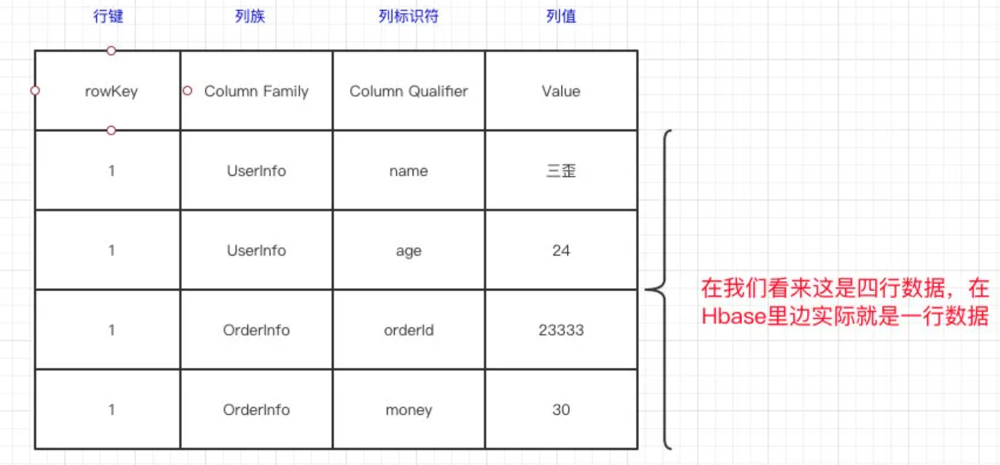
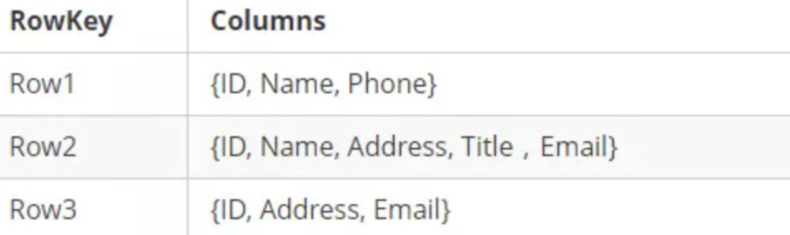
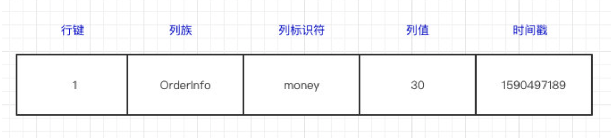
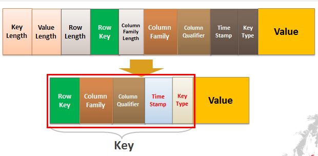
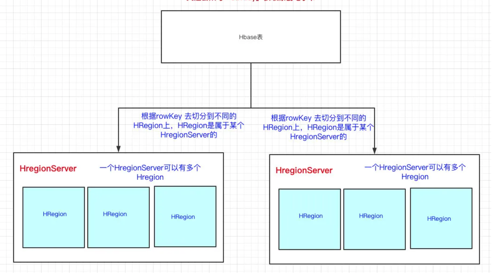
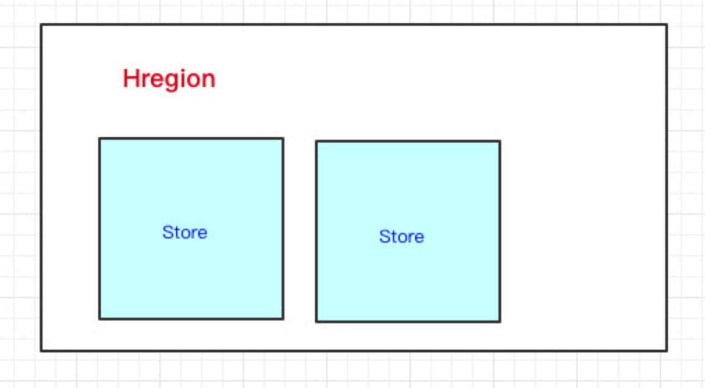
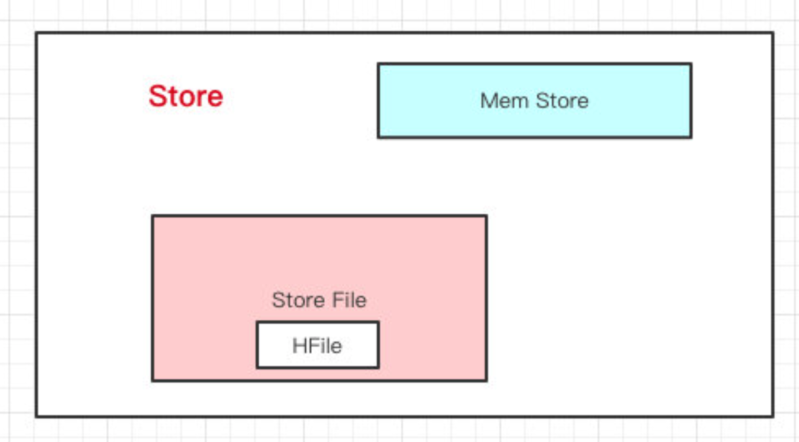

目录

- [HBase 介绍](#hbase-介绍)
  - [HBase 简介](#hbase-简介)
  - [为什么需要 HBase](#为什么需要-hbase)
- [HBase 详解](#hbase-详解)
  - [列式存储](#列式存储)
  - [数据模型](#数据模型)
    - [列族和列](#列族和列)
    - [版本](#版本)
    - [Key-Value](#key-value)
  - [Hbase 架构](#hbase-架构)
    - [HRegionServer](#hregionserver)
    - [HMaster](#hmaster)
- [RowKey 的设计](#rowkey-的设计)
  - [根据一个 RowKey 查询](#根据一个-rowkey-查询)
  - [根据 RowKey 范围查询](#根据-rowkey-范围查询)
- [参考](#参考)

# HBase 介绍

## HBase 简介

> * Apache HBase is the Hadoop database, a distributed, scalable, big data store.
> * HBase is a type of "NoSQL" database.

HBase 是依赖 Hadoop 的，因为 HBase 是在 HDFS 的基础之上构建的，
这也是为什么 HBase 能存储海量数据的原因

总结起来，HBase 就是：

* NoSQL 数据库
* 数据存储在 HDFS 上
* 提供了高并发的随机写
* 支持实时查询
* 以低成本存储海量数据
* 存储的数据结构非常灵活
    - 列式存储

## 为什么需要 HBase

* MySQL 数据库是用得最多的数据存储方式，但众所周知，MySQL 是单机的。
  MySQL 能存储多少数据，取决于那台服务器的硬盘大小。以现在互联网的数据量，
  很多时候 MySQL 是没法存储那么多数据的。比如有个系统，一天就能产生 1TB 的数据，
  这数据是不可能存 MySQL的，如此大的量数据，现在的做法是先写到 Kafka，然后落到 Hive 中
* Kafka 主要用来处理消息的(解耦异步削峰)，数据到 Kafka，Kafka 会将数据持久化到硬盘中，
  并且 Kafka 是分布式的(很方便的扩展)，理论上 Kafka 可以存储很大的数据。
  但是 Kafka 的数据我们不会单独取出来。持久化了的数据，最常见的用法就是重新设置 offset，做回溯操作
* Redis 是缓存数据库，所有的读写都在内存中，速度贼快。AOF/RDB 存储的数据都会加载到内存中，
  Redis 不适合存大量的数据(因为内存太贵了)
* Elasticsearch 是一个分布式的搜索引擎，主要用于检索。理论上 Elasticsearch 也是可以存储海量的数据(毕竟分布式)，
  也可以将数据用索引来取出来，似乎已经是非常完美的中间件了。但是如果我们的数据没有经常检索的需求，
  其实不必放到 Elasticsearch，数据写入 Elasticsearch 需要分词，无疑会浪费资源
* 显然 HDFS 是可以存储海量的数据的，它就是为海量数据而生的。它也有明显的缺点：不支持随机修改，
  查询效率低，对小文件支持不友好

HDFS 是分布式文件系统，而 HBase 是数据库(数据库是一个以某种有组织的方式存储的数据集合)，
其实也没什么可比性，可以把 HBase 当做是 MySQL，把 HDFS 当做是硬盘。
HBase 只是一个 NoSQL 数据库，把数据存在 HDFS 上。
HBase 在 HDFS 之上提供了高并发的随机写和支持实时查询，这是 HDFS 不具备的

如果仅仅看上面的”对比“，可以发现 HBase 可以以低成本来存储海量的数据，
并且支持高并发随机写和实时查询。但 HBase 还有一个特点就是：存储数据的”结构“可以地非常灵活

# HBase 详解

## 列式存储

可以很简单的发现，HBase 列式存储无非就是把每列抽出来，然后关联上 Id。
转换后的数据还是一行一行的。很明显以前一行记录多个属性(列)，有部分的列是空缺的，
但是还是需要空间去存储。现在把这些列全部拆开，有什么就存什么，这样空间就能被我们充分利用

这种形式的数据更像是 Key-Value，那该怎么理解 HBase 所谓的列式存储和 Key-Value 结构呢？

## 数据模型

在看 HBase 数据模型的时候，其实最好还是不要用「关系型数据库」的知识去理解它

HBase 里边也有表、行和列的概念：

* 表没什么好说的，就是一张表
* 一行数据由一个行键和一个或多个相关的列以及它的值所组成

在 HBase 里边，定位一行数据会有一个唯一的值，这个叫做行键(RowKey)。
而在 HBase 的列不是我们在关系型数据库所想象中的列。
HBase 的列(Column)都得归属到列族(Column Family)中。
在 HBase 中用列修饰符(Column Qualifier)来标识每个列

### 列族和列

在 HBase 里边，先有**列族**，后有**列**。列族可以简单理解为：列的属性类别。
在列族下用**列修饰符**来标识一列

HBase 表的每一行中，列的组成都是灵活的，行与行之间的列不需要相同。
换句话说：一个列族下可以任意添加列，不受任何限制

### 版本

数据写到 HBase 的时候都会被记录一个时间戳，这个时间戳被当做一个版本。
比如说，修改或者删除某一条的时候，本质上是往里边新增一条数据，记录的版本加一了而已

比如现在有一条记录：

现在要把这条记录的值改为 `40`，实际上就是多添加一条记录，在读的时候按照时间戳读最新的记录。
在外界看起来就是把这条记录改了

### Key-Value

HBase 本质上其实就是 `Key-Value` 的数据库，`Key-Value` 结构图如下：

Key 由 RowKey(行键) + ColumnFamily(列族) + Column Qualifier(列修饰符) + 
TimeStamp(时间戳--版本) + KeyType(类型)组成，而 Value 就是实际上的值

对比上面的例子，其实很好理解，因为修改一条数据其实上是在原来的基础上增加一个版本的，
那要准确定位一条数据，那就得(RowKey + Column + 时间戳)

上面只说了修改的情况，如果要删除一条数据怎么做？
实际上也是增加一条记录，只不过在 KeyType 里边设置为 `Delete` 就可以了

## Hbase 架构

> HBase 更多的是列族存储(Column Family)

HBase 架构图如下：

1. Client 客户端
    - 它提供了访问 HBase 的接口，并且维护了对应的 cache 来加速 HBase 的访问
2. Zookeeper
    - 存储 HBase 的元数据(meta 表)，无论是读还是写数据，
      都是去 Zookeeper 里边拿到 meta 元数据告诉给客户端去哪台机器读写数据
3. HRegionServer
    - 它是处理客户端的读写请求，负责与 HDFS 底层交互，是真正干活的节点

总结大致的流程就是：

Client 发送请求到 Zookeeper，然后 Zookeeper 返回 HRegionServer 地址给 Client。
Client 得到 Zookeeper 返回的地址去请求 HRegionServer，
HRegionServer 读写数据后返回给 Client

### HRegionServer

HBase 可以存储海量的数据，HBase 是分布式的。所以可以断定：HBase 一张表的数据会分到多台机器上的。
那 HBase 是怎么切割一张表的数据的呢？用的就是 RowKey 来切分，其实就是表的横向切割。
说白了就是一个 HRegion 上存储 HBase 表的一部分数据

* HRegion: 

一个 HBase 表首先要定义列族，然后列是在列族之下的，列可以随意添加。
一个列族的数据是存储在一起的，所以一个列族的数据是存储在一个 Store 里边的。
其实可以认为 HBase 是基于列族存储的(毕竟物理存储，一个列族是存储到同一个 Store 里的)

* Store:

HRegion 下面有 Store，Store 里有 `MemStore`、`Store File`、`HFile`

HBase 在写数据的时候，会先写到 Mem Store，当 MemStore 超过一定阈值，
就会将内存中的数据刷写到硬盘上，形成 StoreFile，而 StoreFile 底层是以 HFile 的格式保存，
HFile 是 HBase 中 Key-Value 数据的存储格式

所以说：Mem Store 可以理解为内存 buffer，HFile 是 HBase 实际存储的数据格式，
而 StoreFile 只是 HBase 里的一个名字

* HLog:

HBase 在写数据的时候是先写到内存的，为了防止机器宕机，内存的数据没刷到磁盘中就挂了。
在写 Mem store 的时候还会写一份 HLog。这个 HLog 是顺序写到磁盘的，所以速度还是挺快的

### HMaster

HMaster 会处理元数据的变更和监控 RegionServer 的状态

HMaster 会处理 HRegion 的分配或转移。如果 HRegion 的数据量太大的话，
HMaster 会对拆分后的 HRegion 重新分配 HRegionServer。如果发现失效的 HRegion，
也会将失效的 HRegion 分配到正常的 HRegionServer 中

# RowKey 的设计

要保证 RowKey 是唯一的，毕竟它是行键，有了它才可以唯一标识一条数据。
在 HBase 里提供了三种查询方式：

1. 全局扫描
2. 根据一个 RowKey 进行查询
3. 根据 RowKey 过滤的范围查询

##  根据一个 RowKey 查询

首先要知道的是 RowKey 是会按字典序排序的，HBase 表会用 RowKey 来横向切分表。
无论是读和写都是用 RowKey 去定位到 HRegion，然后找到 HRegionServer。
这里有一个很关键的问题：那怎么知道这个 RowKey 是在这个 HRegion 上的？

HRegion 上有两个很重要的属性：start-key 和 end-key。在定位 HRegionServer 的时候，
实际上就是定位这个 RowKey 在不在这个 HRegion 的 start-key 和 end-key 范围之内，
如果在，说明就找到了。这个时候会带来一个问题：由于 RowKey 是以字典序排序的，
如果对 RowKey 没有做任何处理，那就有可能存在热点数据的问题。
如果是这种情况，要做的就是对 RowKey 散列，分配到 HRegion 的时候就比较均匀，少了热点的问题

> HBase优化手册：
> 建表申请时的预分区设置，对于经常使用HBase的小伙伴来说,HBase管理平台里申请HBase表流程必然不陌生了。
> '给定 split 的 RowKey 组例如: aaaaa,bbbbb,ccccc; 或给定例如: startKey=00000000,endKey=xxxxxxxx,regionsNum=x'
> * 第一种方式: 是自己指定 RowKey 的分割点来划分 region 个数. 比如有一组数据 RowKey 为 `[1,2,3,4,5,6,7]`, 
>   此时给定 split RowKey 是 3,6, 那么就会划分为 `[1,3),[3,6),[6,7)` 的三个初始 region 了.
>   如果对于 RowKey 的组成及数据分布非常清楚的话, 可以使用这种方式精确预分区
> * 第二种方式: 如果只是知道 RowKey 的组成大致的范围, 可以选用这种方式让集群来均衡预分区, 设定始末的 RowKey,
>   以及根据数据量给定大致的 region 数,一般建议 region 数最多不要超过集群的 rs 节点数, 
>   过多 region 数不但不能增加表访问性能, 反而会增加 master 节点压力. 如果给定始末 RowKey 范围与实际偏差较大的话, 
>   还是比较容易产生数据热点问题
> 
> 最后: 生成 RowKey 时, 尽量进行加盐或者哈希的处理, 这样很大程度上可以缓解数据热点问题

## 根据 RowKey 范围查询

上面的情况是针对通过 RowKey 单个查询的业务的，如果是根据 RowKey 范围查询的，那没必要上面那样做

HBase 将 RowKey 设计为字典序排序，如果不做限制，那很可能类似的 RowKey 存储在同一个 HRegion 中。
那正好有这个场景上的业务，那我查询的时候不是快多了吗？在同一个 HRegion 就可以拿到我想要的数据了

举个例子： 业务需要间隔几秒就采集直播间热度，将这份数据写到 HBase 中，
然后业务方经常要把主播的一段时间内的热度给查询出来。
我设计好的 RowKey 会将该主播的一段时间内的热度都写到同一个 HRegion 上，
拉取的时候只要访问一个 HRegionServer 就可以得到全部我想要的数据了，
那查询的速度就快很多

# 参考

* [我终于看懂了HBase](https://zhuanlan.zhihu.com/p/145551967)

