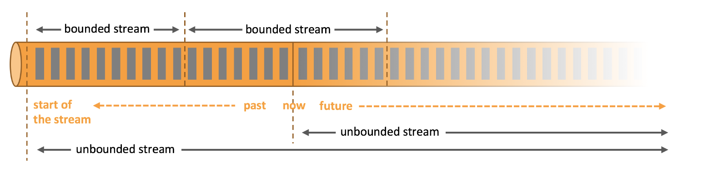

<style>
details {
    border: 1px solid #aaa;
    border-radius: 4px;
    padding: .5em .5em 0;
}
summary {
    font-weight: bold;
    margin: -.5em -.5em 0;
    padding: .5em;
}
details[open] {
    padding: .5em;
}
details[open] summary {
    border-bottom: 1px solid #aaa;
    margin-bottom: .5em;
}
</style>

<details><summary>目录</summary><p>

- [TODO](#todo)
  - [事件/流](#事件流)
  - [有状态](#有状态)
- [Flink 介绍](#flink-介绍)
- [Apache Flink 是什么](#apache-flink-是什么)
  - [架构](#架构)
    - [处理无界和有界数据](#处理无界和有界数据)
    - [部署应用到任意地方](#部署应用到任意地方)
    - [运行任意规模应用](#运行任意规模应用)
    - [利用内存性能](#利用内存性能)
  - [应用](#应用)
    - [流处理应用的基本组件](#流处理应用的基本组件)
      - [流](#流)
      - [状态](#状态)
      - [时间](#时间)
    - [分层 API](#分层-api)
      - [ProcessFunction](#processfunction)
      - [DataStream API](#datastream-api)
      - [SQL & Table API](#sql--table-api)
    - [库](#库)
  - [运维](#运维)
- [Flink 应用场景](#flink-应用场景)
  - [时间驱动型应用](#时间驱动型应用)
  - [数据分析应用](#数据分析应用)
  - [数据管道应用](#数据管道应用)
</p></details><p></p>

# TODO

## 事件/流

## 有状态


# Flink 介绍

> Apache Flink® — Stateful Computations over Data Streams


# Apache Flink 是什么

## 架构

Apache Flink 是一个框架和分布式处理引擎，
用于在 **无边界** 和 **有边界** 数据流上进行 **有状态的计算**。
Flink 能在所有常见集群环境中运行，并能以内存速度和任意规模进行计算

### 处理无界和有界数据

Apache Flink 擅长处理无界和有界数据集。
精确的时间控制和状态化使得 Flink 的运行时(runtime)能够运行任何处理无界流的应用。
有界流则由一些专为固定大小数据集特殊设计的算法和数据结构进行内部处理，产生了出色的性能

任何类型的数据都可以形成一种事件流。信用卡交易、传感器测量、机器日志、网站或移动应用程序上的用户交互记录，
所有这些数据都形成一种流。数据可以被作为 无界 或者 有界 流来处理



1. 无界流：有定义流的开始，但没有定义流的结束
    - 无界流的数据必须持续处理，即数据被摄取后需要立刻处理
    - 不能等到所有数据都到达再处理，因为输入是无限的，在任何时候输入都不会完成
    - 处理无界数据通常要求以特定顺序摄取事件，例如事件发生的顺序，以便能够推断结果的完整性
2. 有界流：有定义流的开始，也有定义流的结束
    - 有界流可以在摄取所有数据后再进行计算 
    - 有界流所有数据可以被排序，所以并不需要有序摄取。有界流处理通常被称为批处理

### 部署应用到任意地方

Apache Flink 是一个分布式系统，它需要计算资源来执行应用程序。
Flink 集成了所有常见的集群资源管理器，例如 Hadoop YARN、 Apache Mesos 和 Kubernetes，
但同时也可以作为独立集群运行

### 运行任意规模应用

Flink 旨在任意规模上运行有状态流式应用。因此，应用程序被并行化为可能数千个任务，
这些任务分布在集群中并发执行。所以应用程序能够充分利用无尽的 CPU、内存、磁盘和网络 IO。
而且 Flink 很容易维护非常大的应用程序状态。其异步和增量的检查点算法对处理延迟产生最小的影响，
同时保证精确一次状态的一致性

* 处理每天处理数万亿的事件
* 应用维护几TB大小的状态
* 应用在数千个内核上运行

### 利用内存性能


有状态的 Flink 程序针对本地状态访问进行了优化。
任务的状态始终保留在内存中，如果状态大小超过可用内存，则会保存在能高效访问的磁盘数据结构中。
任务通过访问本地（通常在内存中）状态来进行所有的计算，从而产生非常低的处理延迟。
Flink 通过定期和异步地对本地状态进行持久化存储来保证故障场景下精确一次的状态一致性

## 应用

Flink 自底向上在不同的抽象级别提供了多种 API，并且针对常见的使用场景开发了专用的扩展库

### 流处理应用的基本组件

可以由流处理框架构建和执行的应用程序类型是由框架对 流、状态、时间 的支持程度来决定的

#### 流

显而易见，(数据)流是流处理的基本要素。然而，流也拥有着多种特征。
这些特征决定了流如何以及何时被处理。Flink 是一个能够处理任何类型数据流的强大处理框架

* 有界和无界的数据流
    - Flink 在无界的数据流处理上拥有诸多功能强大的特性，
      同时也针对有界的数据流开发了专用的高效算子
* 实时和历史记录的数据流
    - 所有的数据都是以流的方式产生，但用户通常会使用两种截然不同的方法处理数据。
      或是在数据生成时进行实时的处理；亦或是先将数据流持久化到存储系统中

#### 状态

只有在每一个单独的事件上进行转换操作的应用才不需要状态，换言之，每一个具有一定复杂度的流处理应用都是有状态的。
任何运行基本业务逻辑的流处理应用都需要在一定时间内存储所接收的事件或中间结果，
以供后续的某个时间点（例如收到下一个事件或者经过一段特定时间）进行访问并进行后续处理

应用状态是 Flink 中的一等公民，Flink 提供了许多状态管理相关的特性支持，其中包括：

* 多种状态基础类型
* 插件化的 State Backend
* 精确的一次语义
* 超大数据量状态
* 可弹性伸缩的应用

#### 时间

时间是流处理应用另一个重要的组成部分。因为事件总是在特定时间点发生，
所以大多数的事件流都拥有事件本身所固有的时间语义。进一步而言，
许多常见的流计算都基于时间语义，例如窗口聚合、会话计算、
模式检测和基于时间的 join。流处理的一个重要方面是应用程序如何衡量时间，
即区分事件时间（event-time）和处理时间（processing-time）

Flink 提供了丰富的时间语义支持：

* 事件时间模式
* Watermark 支持
* 迟到数据处理
* 处理时间模式

### 分层 API


#### ProcessFunction

ProcessFunction 是 Flink 所提供的最具表达力的接口。
ProcessFunction 可以处理一或两条输入数据流中的单个事件或者归入一个特定窗口内的多个事件。
它提供了对于时间和状态的细粒度控制。开发者可以在其中任意地修改状态，
也能够注册定时器用以在未来的某一时刻触发回调函数。因此，
你可以利用 ProcessFunction 实现许多有状态的事件驱动应用所需要的基于单个事件的复杂业务逻辑

在 KeyedStream 上利用 KeyedProcessFunction 对标记为 START 和 END 的事件进行处理。
当收到 START 事件时，处理函数会记录其时间戳，并且注册一个时长4小时的计时器。
如果在计时器结束之前收到 END 事件，处理函数会计算其与上一个 START 事件的时间间隔，
清空状态并将计算结果返回。否则，计时器结束，并清空状态

```java
public static class StartEndDuraion 
    extends KeyedProcessFunction<String, Tuple2<String, String>, Tuple2<String, Long>> {
    // TODO
    private ValueState<Long> startTime;
    
    @Override
    public void open(Configuration conf) {
        // obtain state handle
        startTime = getRuntimeContext()
            .getState(new ValueStateDescriptor<Long>("startTime", Long.class));
    }

    @Override
    public void processElement(
        Tuple2<String, String> in,
        Context ctx,
        Collector<Tuple2<String, Long>> out) throws Exception {
            switch (in.f1) {
                case "START":
                    // set the start time if we receive a start event.
                    startTime.update(ctx.timestamp());
                    // register a timer in four hours from the start event.
                    ctx.timerService().registerEventTimeTimer(ctx.timestamp() + 4 * 60 * 60 * 1000);
                    break;
                case "END":
                    // emit the duration between start and end event
                    Long sTime = startTime.value();
                    if (sTime != null) {
                        out.collect(Tuple2.of(in.f0, ctx.timestmap() - sTime));
                        // clear the state
                        startTime.clear();
                    }
                defalut:
                    // do nothing
            }
        }

    @Override
    public void onTimer(
        long timestamp,
        OnTimerContext ctx,
        Collector<Tuple2<String, Long>> out) {
            // Timeout interval exceeded. Cleaning up the state.
            startTime.clear();
        }
    }
```


#### DataStream API


#### SQL & Table API


### 库

## 运维


# Flink 应用场景

## 时间驱动型应用


## 数据分析应用


## 数据管道应用

