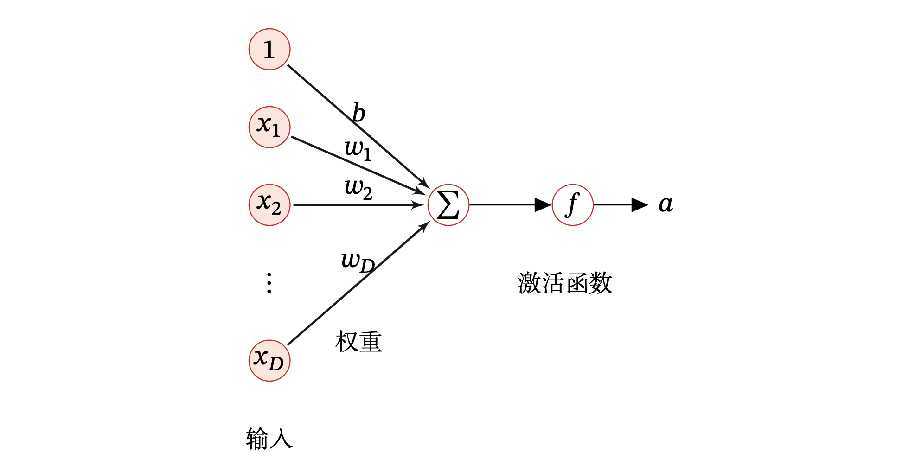
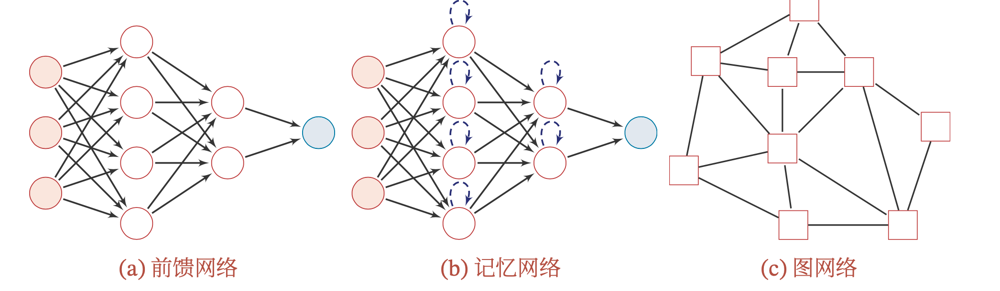

目录

- [深度学习](#深度学习)
- [神经元](#神经元)
- [人工神经网络](#人工神经网络)
  - [前馈网络](#前馈网络)
  - [记忆网络](#记忆网络)
  - [图网络](#图网络)

# 深度学习

**机器学习** 就是从历史数据中探索和训练出数据的普遍规律，将其归纳为相应的数学模型，并对未知的数据进行预测的过程。
在这个过程中会碰到各种各样的问题，比如下面一系列关乎机器学习模型生死的问题：数据质量、模型评价标准、训练优化方法、过拟合

在机器学习中，有很多已经相当成熟的模型，在这些机器学习模型中，**人工神经网络** 就是一种比较厉害的模型；
人工神经网络从早期的感知机发展而来，对任何函数都有较好的拟合性。但自上个世纪 90 年代一直到 2012 年深度学习集中爆发前夕，
神经网络受制于计算资源的限制和较差的可解释性，一直处于发展的低谷阶段。之后大数据兴起，计算资源也迅速跟上，
加之 2012 年 ImageNet 竞赛冠军采用的 AlexNet 卷积神经网络一举将图片预测的 top5 错误率降至 16.4%，
震惊了当时的学界和业界。从此之后，原本处于研究边缘状态的神经网络又迅速热了起来，深度学习也逐渐占据了计算机视觉的主导地位

以神经网络为核心的深度学习理论是机器学习的一个领域分支，所以深度学习其本质上也必须遵循一些机器学习的基本要义和法则。
从机器学习的角度来开，神经网络一般可以看作一个非线性模型，其基本组成单元为具有非线性激活函数的神经元，通过大量神经元之间的连接，
使得神经网络成为一种高度非线性的模型。神经元之间的连接权重就是需要学习的参数，可以在机器学习的框架下通过梯度下降方法来进行学习

# 神经元

人工神经元(Artificial Neuron)，简称神经元(Neuron)，是构成神经网络(ANN)的基本单元，接收一组输入信号并产生输出

现代神经网络中的神经元和 MP 神经元的结构并无太多变化。不同的是，MP 神经元中的激活函数 `$f$` 为 0 或 1 的阶跃函数，
而现代神经元中的激活函数通常要求是连续可导的函数

假设一个神经元接收 `$D$` 个输入 `$x_{1}, x_{2}, \ldots, x_{D}$`，
令向量 `$\boldsymbol{x}=[x_{1}; x_{2}; \ldots; x_{D}]$` 来表示这组输入，
并用净输入(Net Input) `$\textbf{z} \in \mathbb{R}$` 表示一个神经元所获得的输入信号 `$x$` 的加权和

`$$\begin{aligned}
\textbf{z} &= \sum_{d=1}^{D}\omega_{d}x_{d} + b \\
           &=\boldsymbol{\omega}^{T}\boldsymbol{x}+b
\end{aligned}$$`

其中：

* `$\boldsymbol{\omega} = [\omega_{1}; \omega_{2}; \ldots; \omega_{D}] \in \mathbb{R}^{D}$` 是 `$D$` 维的权重向量
* `$b \in \mathbb{R}$` 是偏置

净输入 `$\textbf{z}$` 在经过一个非线性函数 `$f(\cdot)$` 后，得到神经元的活性值(Activation) 

`$$a = f(\textbf{z})$$`

其中非线性函数 `$f(\cdot)$` 称为激活函数(Activation Function)

# 人工神经网络

> Artificial Neural Network，ANN

深度神经网络设计：

1. 选择优化模型
2. 选择损失函数
3. 选择输出单元形式
4. 选择用于计算隐藏层值激活函数(activation function)
5. 设计网络的结构, 包括
    - 网络应该包含多少层
    - 层与层之间应该如何连接
    - 每一层包含多少单元
6. 反向传播(back propagation)算法和推广

## 前馈网络

> forward feedward Neural Network, FFNN

前馈网络中各个神经元按接收信息的先后分为不同的组。每一组可以看作一个神经层。每一层中的神经元接收前一层神经元的输出，
并输出到下一层神经元。整个网络中的信息是朝一个方向传播，没有反向的信息传播，可以用一个有向无环路图表示。
前馈网络包括全连接前馈网络(FCFNN)和卷积神经网络(CNN)等

前馈网络可以看作一个函数，通过简单非线性函数的多次复合，实现输入空间到输出空间的复杂映射。
这种网络结构简单，易于实现

## 记忆网络

记忆网络，也称为反馈网络，网络中的神经元不但可以接收其他神经元的信息，也可以接收自己的历史信息。
和前馈网络相比，记忆网络中的神经元具有记忆功能，在不同的时刻具有不同的状态。
记忆神经网络中的信息传播可以是单向或双向传递，因此可用一个有向循环图或无向图来表示。
记忆网络包括循环神经网络(RNN)、Hopfield 网络、玻尔兹曼机、受限玻尔兹曼机等.

记忆网络可以看作一个程序，具有更强的计算和记忆能力

为了增强记忆网络的记忆容量，可以引入外部记忆单元和读写机制，用来保存一些网络的中间状态，
称为记忆增强神经网络(Memory Augmented Neural Network，MANN)，比如神经图灵机和记忆网络

## 图网络

前馈网络和记忆网络的输入都可以表示为向量或向量序列。但实际应用中很多数据是图结构的的数据，
比如知识图谱、社交网络、分子(Molecular)网络等。前馈网络和记忆网络很难处理图结构的数据

图网络是定义在图结构数据上的神经网络。图中每个节点都由一个或一组神经元构成。节点之间的连接可以是有向的，
也可以是无向的。每个节点可以收到来自相邻节点或自身的信息

图网络是前馈网络和记忆网络的泛化，包含很多不同的实现方式，比如图卷积网络(Graph Convolutional Netword，GCN)、
图注意力网络(Graph Attention Network，GAT)、消息传递神经网络(Message Passing Neural Network，MPNN)等

