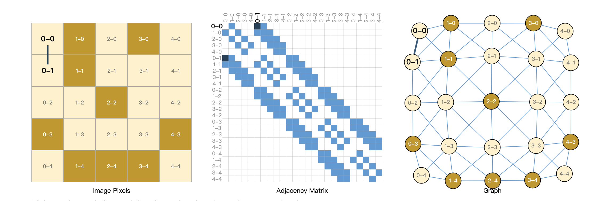
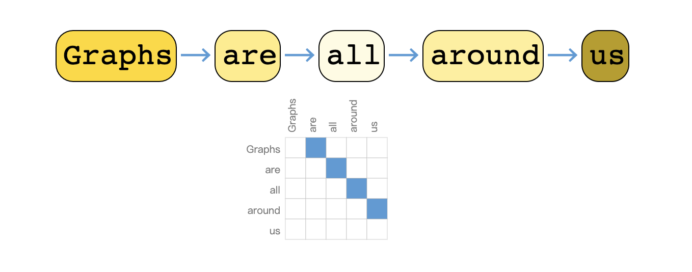

<style>
details {
    border: 1px solid #aaa;
    border-radius: 4px;
    padding: .5em .5em 0;
}
summary {
    font-weight: bold;
    margin: -.5em -.5em 0;
    padding: .5em;
}
details[open] {
    padding: .5em;
}
details[open] summary {
    border-bottom: 1px solid #aaa;
    margin-bottom: .5em;
}
</style>

<details><summary>目录</summary><p>

- [TODO](#todo)
- [GNN 解决什么问题](#gnn-解决什么问题)
- [图](#图)
  - [图介绍](#图介绍)
  - [图表示](#图表示)
    - [邻接矩阵](#邻接矩阵)
    - [邻接列表](#邻接列表)
- [神经网络特点](#神经网络特点)
- [节点特征的表达学习](#节点特征的表达学习)
- [消息传递](#消息传递)
- [节点嵌入的计算](#节点嵌入的计算)
- [附录](#附录)
  - [图表示实现](#图表示实现)
- [参考](#参考)
</p></details><p></p>

# TODO

* [终于有人总结了图神经网络](https://mp.weixin.qq.com/s/HDXfbP7jZp3qONKFcmrTbA)

# GNN 解决什么问题

近十年来(从 2012 年 AlexNet 开始计算)，深度学习在计算机视觉(CV)和自然语言处理(NLP)等领域得到的长足的发展，
深度神经网络对于图像和文字等欧几里得数据(Euclidean data)可以进行较好的处理，之所以被称为欧几里得数据，
是由于这类数据位于 `$n$` 维欧几里得空间 `$\mathbb{R}^{n}$` 中(如 AlexNet 将所有图像的尺寸都预处理成 224x224x3)。
常见的有表格二维的欧几里得数据，RGB 图像数据是三维欧几里得数据，长宽两个维度加一个颜色/通道维度，如果再加上 batch，就是四维

然而，现实世界是复杂的，如社交网络，一个人的朋友数量是不固定的，也很难排个顺序，
这类复杂的非欧几里得数据(non-Euclidean)，没有上下左右，没有顺序，没有坐标参考点，
难以用方方正正的(grid-like)矩阵/张量表示，为了把不规则的脚(非欧数据)穿进标准的鞋(神经网络)里，
之前干了不少削足适履的事，效果不太好，于是，问题变成了：能否设计一种新的鞋，使它能适合不规则的脚呢？

非欧数据的场景很多，除了上面提到的社交网络，其他例子如：计算机网络，病毒传播路径，
交通运输网络(地铁网络)，食物链，粒子网络(物理学家描述基本粒子生存的关系，有点类似家谱)，
说到家谱，家谱也是，(生物)神经网络(神经网络本来就是生物学术语，现在人工神经网络 ANN 太多，
鸠占鹊巢了)，
基因控制网络，分子结构，知识图谱，推荐系统，论文引用网络等等。
这些场景的非欧数据用图(Graph)来表达是最合适的，但是，
经典的深度学习网络(ANN, CNN, RNN)却难以处理这些非欧数据，于是，
图神经网络(GNN)应运而生，GNN 以图作为输入，输出各种下游任务的预测结果

下游任务包括但不限于：

* 节点分类：预测某一节点的类型
* 边预测：预测两个节点之间是否存在边
* 社区预测：识别密集连接的节点所形成的簇
* 网络相似性: 两个(子)网络是否相似

# 图

## 图介绍

图(Graph)是图论的研究对象，图论是欧拉在研究哥尼斯堡七桥问题过程中，创造出来的新数学分支

网络(Graph / Network)视为一个系统，以 `$G(N, E)$` 表示，由两种元素组成：
顶点/节点(Vertex/Node)，以 `$N$` 表示，和边/链接(Edge/Link)，以 `$E$` 表示。
顶点和边具有属性(Attribute)，边可能有方向(有向图 Directed Graph)。
社交网络中，人是顶点，人和人之间的关系是边，人/顶点的属性比如年龄、性别、职业、爱好等构成了一个向量，类似的，边也可用向量来表示

](images/graph.png)

* 微信好友是双向的，你我互为好友(不考虑拉黑/屏蔽)，对应于无向图(Undirected Graph)
* 微博的关注是单向的，我粉你，你未必粉我，对应有向图，也可以将无向图视为双向的有向图

## 图表示

图本身也具有表达其自身的全局属性，来描述整个图

### 邻接矩阵

如何用数学表示图中顶点的关系呢？最常见的方法是邻接矩阵(Adjacency Matrix)，
下图中 A 和 B、C、E 相连，故第一行和第一列对应的位置为 1，其余位置为 0


如果将图片的像素表达为图，下左图表示图片的像素值，深色表示 1，浅色表示 0，
右图为该图片对应的图，中间为对应的邻接矩阵，蓝色表示 1，白色表示 0。
随着图的顶点数(`$n$`)增多，邻接矩阵矩阵的规模(`$n^{2}$`)迅速增大，
一张百万(`$10^{6}$`)像素的照片，
对应的邻接矩阵的大小就是(`$10^{6} \times 10^{6} = 10^{12}$`)，
计算时容易内存溢出，而且其中大多数值为 0，很稀疏



文本也可以用邻接矩阵表示，但是问题也是类似的，很大很稀疏：



### 邻接列表

也可以选用边来表示图，即邻接列表(Adjacency List)，这可以大幅减少对空间的消耗，因为实际的边比所有可能的边(邻接矩阵)数量往往小很多


类似的例子有很多：

* CNN(局部连接)和全连接神经网络的关系；
* 大脑 860 亿个神经元，每个神经元大约与 1000 个神经元相连(而不是 860 亿个)
* 你真正保持联系的人并不太多，邓巴数告诉我们：一个人经常联系的人数大约 150 个，
  这是人类脑容量所决定的，不可能也没必要和 70 亿人都产生直接联系，小世界理论(6 度理论)又说，
  只要不超过 6 个人，你就可以连接上世界上的任何人。2016年，Facebook，不对，应该叫 Meta 了，
  研究发现社交网络使这个间隔降低到 4.57，这也可以理解，社交网络上可能有些你不太熟悉的人，
  你的微信好友大概率不止 150，但其中很多人联系并不多，联系的频率符合幂律分布，
  这是复杂系统的特点。随着 COVID-19 的载毒量下降，死亡率接近千分之一，
  疫苗接种普遍，蜕变为大号流感，国外的一个段子说，如果你的朋友圈没有人感染 COVID-19，
  那说明你没有朋友。社交网络和病毒传播路径均可以图来表示

# 神经网络特点

# 节点特征的表达学习

# 消息传递

# 节点嵌入的计算


# 附录

## 图表示实现

```python
class Vertex:
    def __init__(self, vertex):
        self.name = vertex
        self.neighbors = []
        
    def add_neighbor(self, neighbor):
        if isinstance(neighbor, Vertex):
            if neighbor.name not in self.neighbors:
                self.neighbors.append(neighbor.name)
                neighbor.neighbors.append(self.name)
                self.neighbors = sorted(self.neighbors)
                neighbor.neighbors = sorted(neighbor.neighbors)
        else:
            return False
        
    def add_neighbors(self, neighbors):
        for neighbor in neighbors:
            if isinstance(neighbor, Vertex):
                if neighbor.name not in self.neighbors:
                    self.neighbors.append(neighbor.name)
                    neighbor.neighbors.append(self.name)
                    self.neighbors = sorted(self.neighbors)
                    neighbor.neighbors = sorted(neighbor.neighbors)
            else:
                return False
        
    def __repr__(self):
        return str(self.neighbors)


class Graph:
    def __init__(self):
        self.vertices = {}
    
    def add_vertex(self, vertex):
        if isinstance(vertex, Vertex):
            self.vertices[vertex.name] = vertex.neighbors

            
    def add_vertices(self, vertices):
        for vertex in vertices:
            if isinstance(vertex, Vertex):
                self.vertices[vertex.name] = vertex.neighbors
            
    def add_edge(self, vertex_from, vertex_to):
        if isinstance(vertex_from, Vertex) and isinstance(vertex_to, Vertex):
            vertex_from.add_neighbor(vertex_to)
            if isinstance(vertex_from, Vertex) and isinstance(vertex_to, Vertex):
                self.vertices[vertex_from.name] = vertex_from.neighbors
                self.vertices[vertex_to.name] = vertex_to.neighbors
                
    def add_edges(self, edges):
        for edge in edges:
            self.add_edge(edge[0],edge[1])          
    
    def adjacencyList(self):
        if len(self.vertices) >= 1:
                return [str(key) + ":" + str(self.vertices[key]) for key in self.vertices.keys()]  
        else:
            return dict()
        
    def adjacencyMatrix(self):
        if len(self.vertices) >= 1:
            self.vertex_names = sorted(g.vertices.keys())
            self.vertex_indices = dict(zip(self.vertex_names, range(len(self.vertex_names)))) 
            import numpy as np
            self.adjacency_matrix = np.zeros(shape=(len(self.vertices),len(self.vertices)))
            for i in range(len(self.vertex_names)):
                for j in range(i, len(self.vertices)):
                    for el in g.vertices[self.vertex_names[i]]:
                        j = g.vertex_indices[el]
                        self.adjacency_matrix[i,j] = 1
            return self.adjacency_matrix
        else:
            return dict()              

                     
def graph(g):
    """
    Function to print a graph as adjacency list and adjacency matrix.
    """
    return str(g.adjacencyList()) + '\n' + '\n' + str(g.adjacencyMatrix())

##############################################################################
a = Vertex('A')
b = Vertex('B')
c = Vertex('C')
d = Vertex('D')
e = Vertex('E')

a.add_neighbors([b, c, e]) 
b.add_neighbors([a, c])
c.add_neighbors([b, d, a, e])
d.add_neighbor(c)
e.add_neighbors([a, c])
        
g = Graph()
print(graph(g))
print()
g.add_vertices([a,b,c,d,e])
g.add_edge(b,d)
print(graph(g))
```

```
[
    "A:['B', 'C', 'E']", 
    "C:['A', 'B', 'D', 'E']", 
    "B:['A', 'C', 'D']", 
    "E:['A', 'C']", 
    "D:['B', 'C']"
]

[[ 0.  1.  1.  0.  1.]
 [ 1.  0.  1.  1.  0.]
 [ 1.  1.  0.  1.  1.]
 [ 0.  1.  1.  0.  0.]
 [ 1.  0.  1.  0.  0.]]
```

# 参考

* [理解图神经网络：从CNN到GNN](https://zhuanlan.zhihu.com/p/463666907)
* [Directed and Undirected Graph](https://sites.google.com/a/cs.christuniversity.in/discrete-mathematics-lectures/graphs/directed-and-undirected-graph)
* [Implementing Undirected Graphs in Python](https://pythonandr.com/tag/example/)
* [A Gentle Introduction to Graph Neural Networks](https://distill.pub/2021/gnn-intro/#graph-to-tensor)

