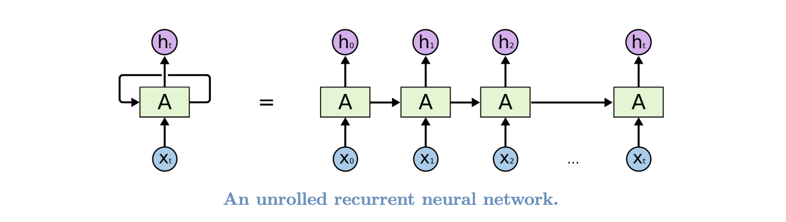
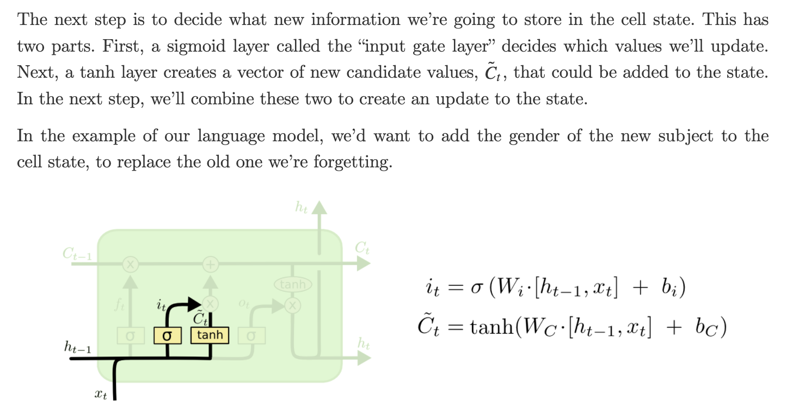

LSTM-让RNN具备更好的记忆机制

# RNN 网络

# LSTM 网络

梯度爆炸和梯度消失对 RNN 的影响非常大, 当 RNN 加深时, 因为梯度消失的问题使得前层的网络权重得不到更新, RNN 的记忆性就很难生效. 
在传统的 RNN 基础上, 研究人员给出了一些著名的改进方案, 即 RNN 变种网络, 比较著名的是 GRU(循环门控单元)和 LSTM(长短期记忆网络); 
GRU 和 LSTM 二者的结构基本一致, 但有些许不同.

Long Short Term Memory networks, LSTM, 是一种特殊的 RNN 网络, 能够学习序列数据中的信息的长期依赖关系。
LSTM 由 [Hochreiter＆Schmidhuber (1997) ](http://www.bioinf.jku.at/publications/older/2604.pdf)  提出的, 
并在随后的工作中被许多人进行提炼和推广. LSTM 在传统的 RNN 结构上做了相对复杂的改进, 
这些改进使得 LSTM 相对于经典的 RNN 能够很好地解决梯度爆炸和梯度消失的问题, 让 RNN 具备更好的记忆性能, 
这也是 LSTM 的价值所在. LSTM 在各种各样的序列处理问题上都表现出色, 现在已被广泛使用。

LSTM 的设计明确避免了长期依赖的问题, 长时间记住信息实际上是它们的默认行为, 而不是它们努力学习的东西。
所有的 RNN 都具有神经网络的重复模块链的形式。在标准的 RNN 中, 此重复模块将具有非常简单的结构, 例如单个 tanh 层:

LSTM 也具有上面的这种链状结构, 但是重复模块具有不同的结构, 而不是只有一个神经网络层, 而是有四个非常特殊的方式进行交互的层:

**NOTE**

# LSTML 核心思想

## LSTM cell state

LSTM 最关键的部分是 LSTM 单元的最上层有一条水平贯穿的关于记忆细胞(remember cell) `$c_{t-1}$` 到 `$c_{t}$` 
的箭头直线 cell state, 这个单元状态有点像传送带, 它在整个链中一直沿直线运行, 只有一些较小的线性相互作用, 信息很容易不加改动地流动, 
这样贯穿的直线表现记忆信息在网络各层之间保持下去很容易:

LSTM 确实具有删除信息或将信息添加到 cell state 的能力, 这些信息由称为 gate(门) 的结构调节, 
gate 是一种选择性地让信息通过的方式, 它们由 Sigmoid 神经网络层和逐点乘法运算组成:

Sigmoid 层的输出数值结果是在 `$[0, 1]$` 之间的数, 描述了每个组件应该允许通过多少信息, 
 值为 0 表示 "不让任何信息通过", 值为 1 表示 "让所有信息通过".

## LSTM 分步分解

- 记忆细胞(remember cell, cell state)

- 遗忘门(forget gate)
   - 遗忘门就是要决定从记忆细胞中是否丢弃某些信息, 通过一个 Sigmoid 函数进行处理, 
   可以看到, 遗忘门接受来自输入 `$x_{t}$` 和上一层隐状态 `$h_{t-1}$` 的值进行加权计算处理.
   

- 更新门/输入门(update/input gate)
   - 更新门确定什么信息能存入记忆细胞状态中, 除了计算更新门之外, 还需要通过 `$tanh$` 计算记忆细胞的候选值 `$\tilde{C}_{t}$`.
   然后, LSTM 结合遗忘门 `$f_{t}$`、更新门 `$i_{t} * \tilde{C}_{t}$`、
   上一层记忆细胞值和记忆细胞候选值 `$C_{t-1}$` 来共同决定和更新当前细胞状态 `$C_{t}$`.
   

- 输出门(output gate)
   - LSTM 提供了单独的输出门

# LSTM 变形

## LSTM + peephole connections

   

## LSTM + coupled & input gates

## GRU, Gated Recurrent Unit

# 参考文章

- http://colah.github.io/posts/2015-08-Understanding-LSTMs/
- http://karpathy.github.io/2015/05/21/rnn-effectiveness/
- http://www.bioinf.jku.at/publications/older/2604.pdf
- [狗熊会课程](https://mp.weixin.qq.com/s?__biz=MzA5MjEyMTYwMg==&mid=2650243045&idx=1&sn=e77f19bf316268813dcdd572a0b49213&chksm=88722088bf05a99e6ce2759808781884aa69c8de831cd4c27fc8198698b42289923ee41eee33&scene=21#wechat_redirect)
- https://blog.csdn.net/qq_28743951/article/details/78974058
