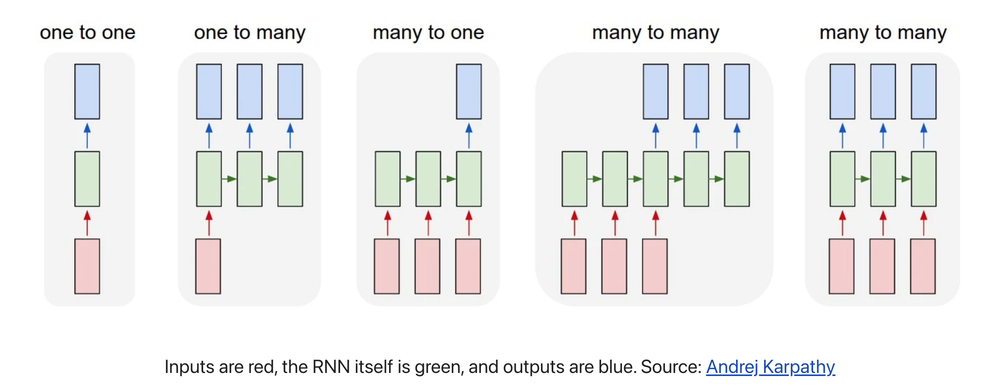

<style>
details {
    border: 1px solid #aaa;
    border-radius: 4px;
    padding: .5em .5em 0;
}
summary {
    font-weight: bold;
    margin: -.5em -.5em 0;
    padding: .5em;
}
details[open] {
    padding: .5em;
}
details[open] summary {
    border-bottom: 1px solid #aaa;
    margin-bottom: .5em;
}
</style>

<details><summary>目录</summary><p>

- [RNN 网络简介](#rnn-网络简介)
  - [RNN 介绍](#rnn-介绍)
  - [RNN 与 HMM](#rnn-与-hmm)
  - [RNN 序列数据](#rnn-序列数据)
  - [RNN 应用](#rnn-应用)
  - [RNN 表现形态](#rnn-表现形态)
  - [RNN 模型](#rnn-模型)
  - [普通神经网络和循环神经网络的区别](#普通神经网络和循环神经网络的区别)
- [RNN 网络架构](#rnn-网络架构)
  - [RNN 网络架构概览](#rnn-网络架构概览)
  - [RNN 网络架构详解](#rnn-网络架构详解)
    - [RNN 单元结构和两次计算](#rnn-单元结构和两次计算)
    - [多个 RNN 单元结构组合在一起就是 RNN 结构](#多个-rnn-单元结构组合在一起就是-rnn-结构)
  - [RNN 变种结构模型](#rnn-变种结构模型)
- [RNN 示例](#rnn-示例)
  - [Sentiment Analysis task](#sentiment-analysis-task)
  - [RNN 模型说明](#rnn-模型说明)
  - [构建 RNN](#构建-rnn)
    - [数据预处理](#数据预处理)
- [参考文章](#参考文章)
</p></details><p></p>

# RNN 网络简介

## RNN 介绍

循环神经网路(Recurrent Neural Networks, RNNs) 是一种专门用来处理序列数据的神经网络. 
RNN 经常应用于 NLP, 因为它能有效地处理文本. 一般来说, RNN 有两种表现形态, 
分别指时间递归和结构递归

相比于其它神经网络只能采用固定大小的输入并产生固定大小的输出, 如 CNN。
RNN 可以将长度可变的序列作为输入和输出, 以下是 RNN 的一些示例:



RNN 这种处理序列的能力非常有用, 比如(除一对一):

* 一对一(1 vs 1)
    - CNN
* 一对多(1 vs N)
    - 将图像转化为一行文字
    - 根据类别生成对应音乐
* 多对一(N vs 1)
    - 文本情感分类, 测量一段话是正面还是负面的情绪
* 多对多(N vs M)
    - seq2seq, 机器翻译, 语音识别...
    - 输入和输出之间存在时差
* 多对多(N vs N)
    - 命名实体识别
    - 给一个录像中的每一帧贴标签
    - 输入和输出之间没有时差

## RNN 与 HMM

RNN 的本质是一个数据推断(inference)机器，只要数据足够多，
就可以得到从 `$x(t)$` 到 `$y(t)$` 的概率分布函数，
寻找到两个时间序列之间的关联，从而达到推断和预测的目的

这里我们无疑会想到另一个做时间序列推断的神器-HMM，隐马尔科夫模型，
在 HMM 里，也有一个输入 `$x$` 和输出 `$y$`，和一个隐变量 `$h$`，
而这的 `$h$` 和 RNN 里的 `$h$` 区别是迭代法则:

* HMM 通过跃迁矩阵把此刻的 `$h$` 和下一刻的 `$h$` 联系在一起。跃迁矩阵随时间变化
  RNN 中没有跃迁矩阵的概念，取而代之的是神经元之间的连接矩阵
* HMM 本质是一个贝叶斯网络， 因此每个节点都是有实际含义的，
  而 RNN 中的神经元只是信息流动的枢纽而已，并无实际对应含义

两者还是存在千丝万缕的联系:

* 首先隐马能干的活 RNN 几乎也是可以做的，比如语言模型，但是就是 RNN 的维度会更高，
  在这些任务上 RNN 事实上是用它的网络表达了隐马的跃迁矩阵。
* 在训练方法上，隐马可以通过类似 EM 来自最大后验概率的算法得出隐变量和跃迁矩阵最可能的值。
  而 RNN 可以通过一般的梯度回传算法训练

## RNN 序列数据

* 文本(单词序列、字符序列)数据
* 时间序列数据
* 一般的序列数据

## RNN 应用

* 文档分类
* 语音识别
* 自然语言处理
* 时间序列预测

## RNN 表现形态

* 循环
* 递归
    - 时间递归
    - 结构递归

## RNN 模型

* RNN (Recurrent Neural Network) 循环神经网络
* 1D Convnet 一维卷积神经网路
* LSTM (Long Short-Term Memory) 长短期记忆网络
* GRU (Gate Recurrent Unit) 门控循环单元

## 普通神经网络和循环神经网络的区别


首先，要看 RNN 和对于图像等静态类变量处理立下神功的卷积网络 CNN 的结构区别来看，
“循环”两个字，已经点出了 RNN 的核心特征，即系统的输出会保留在网络里，
和系统下一刻的输入一起共同决定下一刻的输出。这就把动力学的本质体现了出来，
循环正对应动力学系统的反馈概念，可以刻画复杂的历史依赖。

另一个角度看也符合著名的图灵机原理。即此刻的状态包含上一刻的历史，又是下一刻变化的依据。 
这其实包含了可编程神经网络的核心概念，即，当你有一个未知的过程，但你可以测量到输入和输出，
你假设当这个过程通过 RNN 的时候，它是可以自己学会这样的输入输出规律的，而且因此具有预测能力。
在这点上说， RNN是图灵完备的

对于序列数据, 其他神经网络模型不可行的理由:

* 输入、输出的长度是否相等以及输入大小不固定的问题
    - 在语音识别问题中，输入音频序列和输出文本序列很少情况下是长度相等的, 普通网络难以处理这种问题
* 普通神经网络结构不能共享从文本不同位置上学到的特征
    - 简单来说就是，如果神经网络已经从位置 `1` 学到了 `louwill` 是一个人名, 
      那么如果 `louwill` 出现在其他位置, 神经网络就可以自动识别它就是已经学习过的人名, 
      这种共享可以减少训练参数和提高网络效率, 普通网络不能达到这样的目的

# RNN 网络架构

## RNN 网络架构概览

RNN 网络是由一系列重复的单元结构组成的神经网络重复模块链的形式

RNN 单元结构:


RNN 神经网络重复模块链:


在标准的 RNN 中, 此重复模块具有非常简单的结构, 例如单个 tanh 层:


RNN 单元结构的具体形式:


## RNN 网络架构详解

下面是 RNN 的基本结构, 左边是一个统一的表现形式, 右边则是左边展开的图解 


在这样的 RNN 中, 当预测 `$y_t$` 时, 不仅要使用 `$x_t$` 的信息, 
还要使用 `$x_{t-1}$` 的信息, 因为在横轴路径上的隐状态激活信息 `$h_{t-1}$` 可以帮助预测 `$y_t$`

### RNN 单元结构和两次计算


RNN 单元结构通常需要两次计算:

- 一次是结合上一个时间步的隐状态值 `$W_{aa} a^{<t-1>}$` 和输入 `$W_{ax}x^{<t>} + b_a$` 的计算
- 另一次是基于当前隐状态值 `$W_{ya}a^{<t>} + b_y$` 的输出计算

RNN 单元结构数学表达式:

`$$\alpha^{<t>} = tanh(W_{ax}x^{<t>} + W_{aa} a^{<t-1>} + b_a)$$`

`$$\hat{y}^{<t>} = softmax(W_{ya}a^{<t>} + b_y)$$`

其中:

- 隐藏层的激活函数一般采用 `$tanh(\cdot)$`
- 输入、输出层的激活函数一般使用 `$sigmoid(\cdot)$` 或 `$softmax(\cdot)$` 函数

```
这里的 h 就是hidden variable 隐变量，即整个网络每个神经元的状态，x 是输入， y 是输出，
注意着三者都是高维向量。

隐变量 h，就是通常说的神经网络本体，也正是循环得以实现的基础，因为它如同一个可以储存无穷历史信息(理论上)的水库，
一方面会通过输入矩阵 `$W_xh$` 吸收输入序列 x 的当下值，
一方面通过网络连接 `$W_hh$` 进行内部神经元间的相互作用(网络效应，信息传递)，
因为其网络的状态和输入的整个过去历史有关，最终的输出又是两部分加在一起共同通过非线性函数 tanh。
整个过程就是一个循环神经网络“循环”的过程。 

`$W_hh$` 理论上可以可以刻画输入的整个历史对于最终输出的任何反馈形式，从而刻画序列内部，或序列之间的时间关联，这是 RNN 强大的关键
```


### 多个 RNN 单元结构组合在一起就是 RNN 结构


## RNN 变种结构模型

带有时间和记忆属性的神经网路模型使得深度学习可以胜任语音识别和自然语言处理等序列建模问题. 
当然, 上面介绍的 RNN 结构是最基础、最经典的网络结构, 在这个结构的基础上, RNN 针对输入输
出序列的长度异同和记忆强度有各种各样的变种模型:


# RNN 示例

## Sentiment Analysis task
    
- 二分类问题, 使用 "N vs 1" RNN
- [dataset](https://github.com/vzhou842/rnn-from-scratch/blob/master/data.py) 


## RNN 模型说明


- `$x_{i}$`: 文本中一个单词的向量表示
- `$y$`: 包含两个数值的向量, 两个数值分别代表正面、负面
    - 输出激活函数使用 `$Softmax$` 函数将输出值转换为概率, 并确定正负

## 构建 RNN

### 数据预处理

数据:

```python
# 数据
train_data = {
    'good': True,
    'bad': False,
    # ... more data
}

test_data = {
    'this is happy': True,
    'i am good': True,
    # ... more data
}
```

构建一个数据中存在所有单词的词汇表

```python
from data import train_data, test_data

# 建立词汇表
vocab = list(set([
    w for text in train_data.keys() for w in text.split(" ")
]))
vocab_size = len(vocab)
print("%d unique words found" % vocab_size)
```

# 参考文章

- [狗熊会课程](https://mp.weixin.qq.com/s?__biz=MzA5MjEyMTYwMg==&mid=2650243006&idx=1&sn=331cf61b127724223d3bc5d796db853d&chksm=887220d3bf05a9c51078f6cf5cb7a8decbd59a0f9a91e65db3812bb669c80c26f45c41aae13f&scene=21#wechat_redirect) 
- https://victorzhou.com/blog/intro-to-rnns/
- https://gist.github.com/karpathy/d4dee566867f8291f086
- http://karpathy.github.io/2015/05/21/rnn-effectiveness/
- https://mkffl.github.io/2019/07/08/minimalist-RNN.html
- https://github.com/JY-Yoon/RNN-Implementation-using-NumPy/blob/master/RNN%20Implementation%20using%20NumPy.ipynb
- https://zhuanlan.zhihu.com/p/22930328
- https://towardsdatascience.com/recurrent-neural-networks-rnns-3f06d7653a85