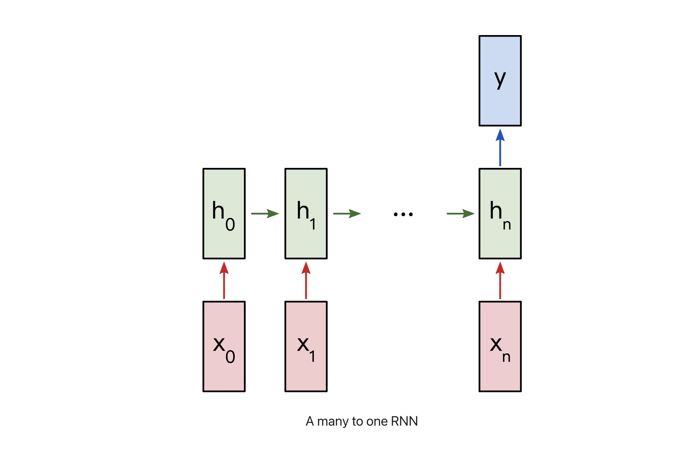

RNN
============================================

1.序列模型 RNN
--------------------------------------------

1.1 RNN 简介
~~~~~~~~~~~~~~~~~~~~~~~~~~~~~~~~~~~~~~~~~

   循环神经网路(Recurrent Neural Networks, RNNs) 是一种专门用来序列数据的神经网络. 
   RNN 经常应用于 NLP, 因为它能有效地处理文本. 一般来说, RNN 有两种表现形态, 
   分别指时间递归和结构递归.

   相比于其它神经网络只能采用固定大小的输入并产生固定大小的输出, 如 CNN. 
   RNN 可以将长度可变的序列作为输入和输出, 以下是 RNN 的一些示例:

      

   - RNN 这种处理序列的能力非常有用, 比如(除一对一):

      - 一对一(1 vs 1)

         - CNN

      - 一对多(1 vs N)

         - 将图像转化为一行文字
         - 根据类别生成对应音乐

      - 多对一(N vs 1)

         - 文本情感分类, 测量一段话是正面还是负面的情趣

      - 多对多(N vs M)

         - seq2seq, 机器翻译, 语音识别...
         - 输入和输出之间存在时差
      
      - 多对多(N vs N)

         - 命名实体识别
         - 给一个录像中的每一帧贴标签
         - 输入和输出之间没有时差

   - 序列类数据类型

      - 文本(单词序列、字符序列)数据
      - 时间序列数据
      - 一般的序列数据

   - RNN 应用
      
      - 文档分类
      - 语音识别
      - 自然语言处理
      - 时间序列预测

   - RNN 表现形态

      - 循环
      - 递归

         - 时间递归
         - 结构递归
   
   - RNN 模型
   
      - RNN (Recurrent Neural Network) 循环神经网络
      - 1D Convnet 一维卷积神经网路
      - LSTM (Long short-term memory) 长短期记忆网络
      - GRU (Gate Recurrent Unit) 门控循环单元

.. note:: 

   - 普通神经网络和循环神经网络的区别

      

   - 对于序列数据, 其他神经网络模型不可行的理由:

      - 输入、输出的长度是否相等以及输入大小不固定的问题. 
         
         - 在语音识别问题中, 输入音频序列和输出文本序列很少情况下是长度相等的, 普通网络难以处理这种问题

      - 普通神经网络结构不能共享从文本不同位置上学到的特征

         - 简单来说就是如果神经网络已经从位置 1 学到了 louwill 是一个人名, 那么如果 louwill 出现在其他位置, 
           神经网络就可以自动识别它就是已经学习过的人名, 这种共享可以减少训练参数和提高网络效率, 普通网咯不能达到这样的目的

.. note:: 

   不管是哪个方向的应用, 只要它是属于监督机器学习性质的深度学习问题, 都可以将其归纳为一个从输入到输出的有监督机器学习问题.

1.2 RNN 网络架构
~~~~~~~~~~~~~~~~~~~~~~~~~~~~

   - 使用 RNN 面临的问题场景梳理:

      - 假设在进行语音识别时, 给定了一个输入音频片段 `$X$`, 要求输入一个文本片段 `$y$`, 
         其中输入 `$X$` 是一个按照时间播放的音频片段, 输出 `$Y$` 是一个按照顺序排列的单词组成的一句话, 
         所以在RNN中输入、输出都是序列性质的. 针对这样的输入、输出 `$(X, Y)$` 的有监督学习, 
         最适合的神经网络结构就是 RNN. 

1.2.1 RNN 基本结构
^^^^^^^^^^^^^^^^^^^^^^^^^^^^^

   下面是 RNN 的基本结构, 左边是一个统一的表现形式, 右边则是左边展开的图解. 

      
   
   在这样的 RNN 中, 当预测 `$y_t$` 时, 不仅要使用 `$x_t$` 的信息, 
   还要使用 `$x_{t-1}$` 的信息, 因为在横轴路径上的隐状态激活信息 `$h_{t-1}$` 得以帮助预测 `$y_t$`.

1.2.2 RNN 单元结构
^^^^^^^^^^^^^^^^^^^^^^^^^^^^^

   - RNN 单元结构和两次计算:

      

      - RNN 单元结构通常需要两次计算:

         - 一次是结合上一个时间步的隐状态值 `$W_{aa} a^{<t-1>}$` 和输入 `$W_{ax}x^{<t>} + b_a$` 的计算
         - 另一次是基于当前隐状态值 `$W_{ya}a^{<t>} + b_y$` 的输出计算

      - RNN 单元结构数学表达式:

            `$$\alpha^{<t>} = tanh(W_{ax}x^{<t>} + W_{aa} a^{<t-1>} + b_a)$$`
            
            `$$\hat{y}^{<t>} = softmax(W_{ya}a^{<t>} + b_y)$$`

         其中:

            - 隐藏层的激活函数一般采用 `$tanh(\cdot)$`
            - 输入、输出层的激活函数一般使用 `$sigmoid(\cdot)$` 或 `$softmax(\cdot)$` 函数

   - 多个 RNN 单元结构组合在一起就是 RNN 结构

      

1.2.3 RNN 变种结构模型
^^^^^^^^^^^^^^^^^^^^^^^^^^^^^

   - 带有时间和记忆属性的神经网路模型使得深度学习可以胜任语音识别和自然语言处理等序列建模问题. 
      当然, 上面介绍的 RNN 结构是最基础、最经典的网络结构, 在这个结构的基础上, RNN 针对输入输
      出序列的长度异同和记忆强度有各种各样的变种模型:

   .. code-block:: python
   
      class RNN:

         def step(self, x):
            # update the hidden state
            self.h = np.tanh(np.dot(self.W_hh, self.h) + np.dot(self.W_xh, x))
            # compute the output vector
            y = np.dot(self.W_hy, self.h)

            return y

1. RNN 示例
-----------------------------------

   - Sentiment Analysis task
      
      - 二分类问题, 使用 "N vs 1" RNN
      - [dataset](https://github.com/vzhou842/rnn-from-scratch/blob/master/data.py) 

         - 

   - RNN 模型说明

      

      - `$x_{i}$`: 文本中一个单词的向量表示
      - `$y$`: 包含两个数值的向量, 两个数值分别代表正面、负面
         
         - 输出激活函数使用 `$Softmax$` 函数将输出值转换为概率, 并确定正负

   - 构建 RNN

      - 1.数据预处理

         - 1.1 数据
         
            .. code-block:: python

               # 数据
               train_data = {
                  'good': True,
                  'bad': False,
                  # ... more data
               }

               test_data = {
                  'this is happy': True,
                  'i am good': True,
                  # ... more data
               }

         - 1.2 构建一个数据中存在所有单词的词汇表

            .. code-block:: python

               from data import train_data, test_data

               # 建立词汇表
               vocab = list(set([w for text in train_data.keys() for w in text.split(" ")]))
               vocab_size = len(vocab)
               print("%d unique words found" % vocab_size)

3.参考文章
----------------------

   - [狗熊会课程](https://mp.weixin.qq.com/s?__biz=MzA5MjEyMTYwMg==&mid=2650243006&idx=1&sn=331cf61b127724223d3bc5d796db853d&chksm=887220d3bf05a9c51078f6cf5cb7a8decbd59a0f9a91e65db3812bb669c80c26f45c41aae13f&scene=21#wechat_redirect) 
   - https://victorzhou.com/blog/intro-to-rnns/
