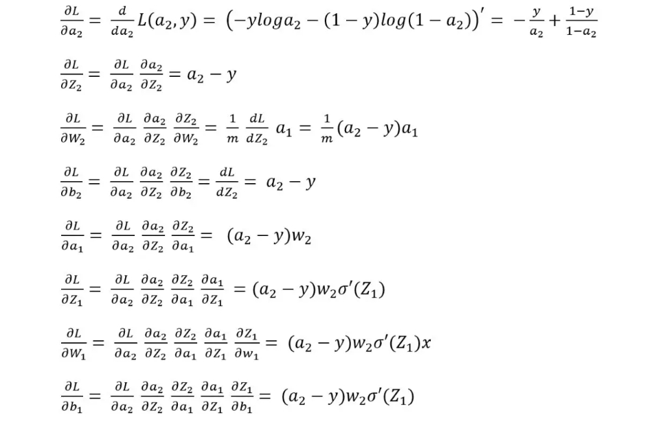
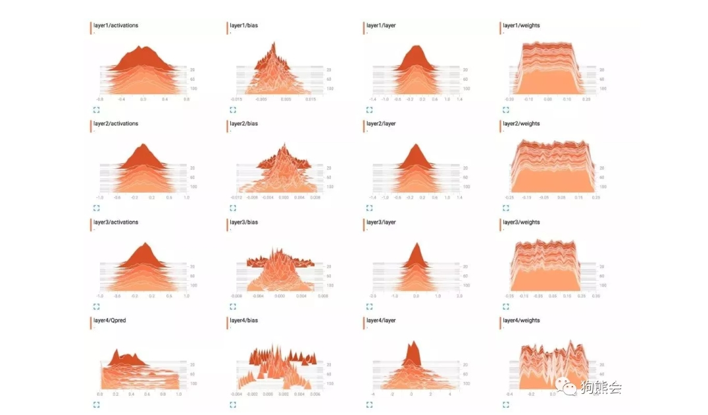

目录

- [计算图](#计算图)
- [反向传播算法](#反向传播算法)
    - [正向传播](#正向传播)
    - [反向传播](#反向传播)
    - [链式法则](#链式法则)
    - [参数更新](#参数更新)
    - [总结](#总结)
- [梯度爆炸与梯度消失](#梯度爆炸与梯度消失)
    - [现象解释](#现象解释)
    - [出现机制](#出现机制)
    - [解决方法](#解决方法)
- [参考](#参考)

# 计算图

> computational graph

计算图将计算过程用图形表示出来，这里的图形是指数据结构图，通过多个节点和边表示。
用计算图解题时，需要按如下流程进行:

- 构建计算图
- 在计算图上从左到右进行计算(正向传播，forward propagation)
- 在计算图上从右到左进行计算(反向传播，backward propagation)
    - 将上游传过来的值乘以节点的局部导数 `$\frac{\partial y}{\partial x}$`，
      然后将结果传递给下一个节点

计算图的优点：

- 局部计算：无论全局多么复杂的计算，都可以通过局部计算使各个节点致力于简单的计算，从而简化问题
- 利用计算图可以将中间的计算结果保存起来
- 可以通过反向传播高效计算导数

综上，可以通过正向传播和反向传播高效地计算各个变量的导数值。

# 反向传播算法

反向传播算法（Error BackPropagation，也叫误差逆传播），作为神经网络的训练算法，
反向传播算法可谓是目前最成功的神经网络学习算法了。
通常说的 **BP 神经网络**也就是指**应用反向传播算法进行训练的神经网络模型**。

假设以一个两层（即单隐藏层）网络为例（见下图），推导一下反向传播的基本过程。

<!--  -->

## 正向传播

假设输入层为 `$X$`，输出层与隐藏层之间的权值和偏置分别为 `$W_{1}$` 和 `$b_{1}$`，
线性加权计算结果为：

`$$Z_{1} = W_{1}X + b_{1}$$`

采用 Sigmoid 激活函数，隐藏层激活输出为：

`$$a_{1}=\sigma(Z_{1})$$`

而隐藏层到输出层的权值和偏置分别为 `$W_{2}$` 和 `$b_{2}$`，线性加权计算结果为：

`$$Z_{2} = W_{2}a_{1}+b_{2}$$`

激活输出为：

`$$a_{2}=\sigma(Z_{2})$$`

所以这个两层网络的前向计算过程为：

`$$X \rightarrow Z_{1} \rightarrow a_{1} \rightarrow Z_{2} \rightarrow a_{2}$$`

假设这里采用**交叉熵损失函数**：

`$$L(y, a) = -y log a + (1-y)log(1-a)$$`

## 反向传播

所以，反向传播的直观理解就是将上述前向计算过程反过来，但必须是梯度计算的方向反过来。
反向传播时基于**梯度下降**策略的，主要是**以目标参数的负梯度方向对参数进行更新**，
所以，基于损失函数对前向计算过程中各个变量进行梯度计算就是非常必要的了。

将前向计算过程反过来，那基于损失函数的梯度计算顺序就是：

`$$d a_{2} \rightarrow d Z_{2} \rightarrow d W_{2} \rightarrow d b_{2} \rightarrow d a_{1} \rightarrow d Z_{1} \rightarrow d W_{1} \rightarrow d b_{1}$$`

## 链式法则

> chain rule

> 计算图的正向传播将计算结果正向(从左到右)传递，而反向传播将局部导数向正方向的反方向(从右到左)传递。
> 
> * **复合函数:**
>     - 复合函数是由多个函数构成的函数
> * **链式法则:**
>     - 如果某个函数由复合函数表示，则该复合函数的导数可以用构成复合函数的各个函数的导数的乘积表示

根据上面基于损失函数的梯度计算顺序，进行链式求导操作。

1. 从输出 `$a_{2}$` 开始进行反向推导，输出层激活输出为 `$a_{2}$`，
   那首先计算损失函数 `$L(y, a)$` 关于 `$a_{2}$` 的微分 `$d a_{2}$`。
   那影响输出 `$a_{2}$` 的是谁呢？由前向传播可知 `$a_{2}$` 是由 `$Z_{2}$` 经激活函数激活计算出来的，
   所以计算损失函数关于 `$Z_{2}$` 的导数 `$d Z_{2}$` 必须经由 `$a_{2}$` 进行复合函数求导，
   即微积分上常说的链式求导法则。
2. 然后，继续往前推，影响 `$Z_{2}$` 的又是哪些变量呢？由前向计算 `$Z_{2}=W_{2}a_{1}+b_{2}$` 可知，
   影响 `$Z_{2}$` 的有 `$W_{2}$`、`$a_{1}$` 和 `$b_{2}$`；
3. 继续按照链式求导法则进行求导即可。
4. 最终，以交叉熵损失函数为代表的两层神经网络的反向传播向量化求导计算公式如下所示：

## 参数更新

在有了梯度计算结果后，便可根据权值更新公式对权值和偏置参数进行更新了，具体计算公式如下，
其中 `$\eta$` 为学习率，是个超参数，需要在训练时手动指定，当然也可以对其进行调参取得最优超参数。

`$$W = W - \eta d W$$`

## 总结

以上便是 BP 神经网络模型和算法的基本工作流程，简单而言就是前向计算得到输出，反向传播调整参数，
最后以得到损失最小时的参数为最优学习参数。神经网络的基本总结流程如下图所示：

# 梯度爆炸与梯度消失

## 现象解释

在神经网络训练的过程中，当网络结构变深时，神经网络在训练时会碰到梯度爆炸或者梯度消失的情况。
那么什么是梯度爆炸和梯度消失呢？它们又是怎么产生的呢？

由于神经网络的训练机制，不管是哪种类型的神经网络，其训练都是通过反向传播计算梯度来实现**权重更新**的。
通过设定损失函数，建立损失函数关于各层网络输入、输出的梯度计算，当网络训练开动起来的时候，
系统便按照反向传播机制来不断更新网络各层参数直到停止训练。但当网络层数加深时，这个训练系统并不是很稳定，
经常会出现一些问题，其中梯度爆炸和梯度消失便是最大的两个问题。

* 梯度爆炸
    - 在神经网络训练过程中，梯度变得越来越大，使得神经网络权重得到疯狂更新的情形，这种情况很容易发现，
      因为梯度过大，计算更新得到的参数也会大到崩溃，这时候我们可能看到更新的参数值中有很多的 `NaN`，
      这说明梯度爆炸已经使得参数更新出现**数值溢出**。
* 梯度消失
    - 与梯度爆炸相反的是梯度消失，梯度消失就是在神经网络训练过程中梯度变得越来越小，
      以至于梯度得不到更新的一种情形。当网络加深时，
      网络深处的误差因为梯度的减小很难影响到前层网络的权重更新，
      一旦权重得不到有效的更新计算，神经网络的训练机制也就失效了。

## 出现机制

神经网络训练过程中梯度怎么就会变得越来越大或者越来越小呢？

以上面的神经网络反向传播推导公式为例来解释，下面的公式是一个两层网络的反向传播参数更新公式推导过程:

离输出层相对较远的是**输入**到**隐藏层**的权重参数，可以看到损失函数对于隐藏层输出 `$a_{1}$` 的导数，
会输入到隐藏层权重 `$W_{1}$` 和偏置 `$b_{1}$` 的梯度计算公式，
一般而言都会转换从下一层的权重乘以激活函数求导后的式子。

如果激活函数求导后的结果和下一层权重的乘积大于 1 或者说远远大于 1 的话，
在网络层数加深时，层层递增的网络在做梯度更新时往往就会出现**梯度爆炸**的情况。

如果激活函数求导和下一层权重的乘积小于 1 的话，在网络加深时，
浅层的网络梯度计算结果会越来越小往往就会出现**梯度消失**的情况。

所以可以说是**反向传播的机制本身造就梯度爆炸和梯度消失这两种不稳定因素**。

比如说一个 100 层的深度神经网络，假设每一层的梯度计算值都为 1.1，
经过由输出到输入的反向传播梯度计算可能最后的梯度值就变成 `$1.1^{100} = 13780.61234$`，
这是一个极大的梯度值了，足以造成计算溢出问题。

若是每一层的梯度计算值为 0.9，反向传播输入层的梯度计算值则可能为 `$0.9^{100} = 0.000026561398$`，
足够小到造成梯度消失。例子只是一个简化的假设情况，实际反向传播计算要更为复杂。 

所以总体来说，神经网络的训练中梯度过大或者过小引起的参数过大过小都会导致神经网络失效，
那我们的目的就是要让梯度计算回归到正常的区间范围，不要过大也不要过小，
这也是解决这两个问题的一个思路。下图是一个 4 层网络的训练过程各参数的取值范围:

## 解决方法

那么梯度爆炸和梯度消失怎么解决呢？

梯度爆炸并不麻烦，在实际训练的时候对梯度进行修剪即可，
但是梯度消失的处理就比较麻烦了，由上述的分析知道梯度消失一个关键在于激活函数。
Sigmoid 激活函数本身就更容易产生这种幺蛾子，所以一般而言，
我们换上更加鲁棒的 ReLu 激活函数以及给神经网络加上**归一化激活函数层**，
一般问题都能得到很好的解决，但也不是任何情形下都管用，比如说 RNN 网络。

# 参考

* [深度学习简介和感知机原理与实现](https://mp.weixin.qq.com/s?__biz=MzA5MjEyMTYwMg==&mid=2650242548&idx=1&sn=7ec07dd1cfc18fdfd0615a25b697c5f2&chksm=88722299bf05ab8f22b68b42c8128f3f333fe91b7c87b1353172b9e00ec5ef0f70fb93cab102&scene=21#wechat_redirect)
* [写一篇人人都能看得懂的LSTM](https://mp.weixin.qq.com/s?__biz=MzA5MjEyMTYwMg==&mid=2650243045&idx=1&sn=e77f19bf316268813dcdd572a0b49213&chksm=88722088bf05a99e6ce2759808781884aa69c8de831cd4c27fc8198698b42289923ee41eee33&scene=21#wechat_redirect)
* [一文弄懂神经网络中的反向传播法——BackPropagation](https://www.cnblogs.com/charlotte77/p/5629865.html#!comments)
* [Understanding Automatic Differentiation in 30 lines of Python](https://vmartin.fr/understanding-automatic-differentiation-in-30-lines-of-python.html)
* [Backpropagation](https://cedar.buffalo.edu/~srihari/CSE574/Chap5/Chap5.3-BackProp.pdf)
