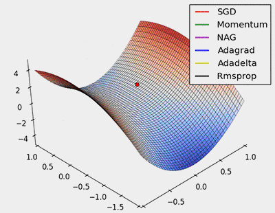

<style>
details {
    border: 1px solid #aaa;
    border-radius: 4px;
    padding: .5em .5em 0;
}
summary {
    font-weight: bold;
    margin: -.5em -.5em 0;
    padding: .5em;
}
details[open] {
    padding: .5em;
}
details[open] summary {
    border-bottom: 1px solid #aaa;
    margin-bottom: .5em;
}
img {
    pointer-events: none;
}
</style>

<details><summary>目录</summary><p>

- [神经网络的学习](#神经网络的学习)
    - [优化算法](#优化算法)
    - [学习步骤](#学习步骤)
- [梯度算法](#梯度算法)
- [梯度下降算法](#梯度下降算法)
- [梯度下降算法改进](#梯度下降算法改进)
    - [随机梯度下降](#随机梯度下降)
        - [mini-batch GD](#mini-batch-gd)
        - [SGD](#sgd)
    - [动量梯度下降](#动量梯度下降)
- [SGD](#sgd-1)
    - [SGD 的数学表示](#sgd-的数学表示)
    - [SGD 推导](#sgd-推导)
    - [SGD 的 Python 实现](#sgd-的-python-实现)
    - [SGD 的优缺点](#sgd-的优缺点)
- [SGDM](#sgdm)
    - [SGDM 数学表示](#sgdm-数学表示)
    - [SGDM 实现](#sgdm-实现)
    - [SGDM 优缺点](#sgdm-优缺点)
- [AdaGrad SGD](#adagrad-sgd)
    - [AdaGrad SGD 数学表示](#adagrad-sgd-数学表示)
    - [AdaGrad SGD 实现](#adagrad-sgd-实现)
    - [AdaGrad SGD 优缺点](#adagrad-sgd-优缺点)
- [RMSProp](#rmsprop)
    - [RMSProp 数学表示](#rmsprop-数学表示)
    - [RMSProp 实现](#rmsprop-实现)
    - [RMSProp 优缺点](#rmsprop-优缺点)
- [AdaDelta](#adadelta)
    - [AdaDelta 数学表示](#adadelta-数学表示)
    - [AdaDelta 优缺点](#adadelta-优缺点)
    - [AdaDelta 实现](#adadelta-实现)
- [Adam](#adam)
    - [Adam 数学表示](#adam-数学表示)
    - [Adam 优缺点](#adam-优缺点)
    - [Adam 实现](#adam-实现)
- [Nadam](#nadam)
    - [Nadam 的数学表示](#nadam-的数学表示)
    - [Nadam 的 Python 实现](#nadam-的-python-实现)
    - [Nadam 的优缺点](#nadam-的优缺点)
- [NAG](#nag)
    - [NAG 数学表示](#nag-数学表示)
    - [NAG 实现](#nag-实现)
    - [NAG 优缺点](#nag-优缺点)
- [总结](#总结)
- [参考资料](#参考资料)
</p></details><p></p>

# 神经网络的学习

深度学习算法在很多种情况下都涉及优化，在深度学习涉及的诸多优化问题中，
最难的是**神经网络训练**。神经网络需要使用训练数据训练合适的权重和偏置，
调整权重和偏置以便拟合训练数据的过程称为 **“学习”**。
这里的**学习**就特指神经网络训练中的优化问题。

## 优化算法

优化算法的功能是通过改善训练方式，来最小化（或最大化）损失函数 `$E(x)$`。

模型内部有些参数，是用来计算测试集中目标值 `$Y$` 的真实值和预测值的偏差程度的，
基于这些参数就形成了损失函数 `$E(x)$`。比如说，权重(`$W$`)和偏差(`$b$`)就是这样的内部参数，
一般用于计算输出值，在训练神经网络模型时起到主要作用。

在有效地训练模型并产生准确结果时，模型的内部参数起到了非常重要的作用。
这也是为什么应该用各种优化策略和算法来更新和计算影响模型训练和模型输出的网络参数，
使其逼近或达到最优值。

优化算法分为两大类：

1. 一阶优化算法

算法使用各参数的梯度值来最小化或最大化损失函数 `$E(x)$`。最常用的一阶优化算法是**梯度下降**。

> 函数梯度：导数 `$dy/dx$` 的多变量表达式，用来表示 `$y$` 相对于 `$x$` 的瞬时变化率。
> 往往为了计算多变量函数的导数时，会用梯度取代导数，并使用偏导数来计算梯度。
> 梯度和导数之间的一个主要区别是函数的梯度形成了一个向量场。

因此，对单变量函数，使用导数来分析；而梯度是基于多变量函数而产生的。

2. 二阶优化算法

二阶优化算法使用了二阶导数(也叫做 Hessian 方法)来最小化或最大化损失函数。
由于二阶导数的计算成本很高，所以这种方法并没有广泛使用。

## 学习步骤

* 步骤 1：mini-batch
    - 从训练数据中随机选出一部分数据，这部分数据称为 mini-batch。目标是减小 mini-batch 的损失函数的值
* 步骤 2：计算梯度
    - 为了减小 mini-batch 的损失函数的值，需要求出各个权重参数的梯度，梯度表示损失函数的值减小最多的方向
* 步骤 3：更新参数
    - 将权重参数沿梯度方向进行微小更新
* 步骤 4：重复
    - 重复步骤 1、步骤 2、步骤 3

# 梯度算法

机器学习和神经网络的学习都是**从训练数据集中学习时寻找最优参数(权重和偏置)**，
这里的最优参数就是损失函数取最小值时的参数。

在梯度算法中，函数的取值从当前位置沿着梯度方向前进一段距离，然后在新的地方重新求梯度，
再沿着新梯度方向前进，如此反复，不断地沿着梯度方向前进，逐渐减小函数的值。
虽然梯度的方向并不一定指向最小值，但沿着它的方向能够最大限度地减小函数的值。
因此，在寻找损失函数的最小值(或者尽可能小的值)的位置的任务中，要以梯度的信息为线索，
决定前进的方向。

* 梯度法
    - 一般而言，损失函数很复杂，参数空间庞大，
      通过使用梯度来寻找损失函数最小值(或尽可能小的值)的方法就是梯度法（梯度下降算法）。
* 梯度
    - 梯度表示的是一个函数在各点处的函数值减小最多的方向，
      因此，无法保证梯度所指的方向就是函数的最小值或者真正应该前进的方向
    - 实际上在复杂的函数中，梯度指示的方向基本上都不是函数值最小处。
* 梯度等于 0 的点
    - 函数的极小值，最小值，鞍点(saddle point)的地方，梯度为 0
    - 最小值是指全局最小值
    - 极小值是指局部最小值，也就是限定在某个范围内的最小值
    - 鞍点是从某个方向上看是极大值，从另一个方向上看则是极小值的点

# 梯度下降算法

在训练和优化神经网络模型时，梯度下降算法是一种重要的技术和基础。梯度下降算法的功能是：
通过寻找最小值，控制方差，更新模型参数，最终使模型收敛。

梯度算法可以分为两种：梯度下降算法(gradient descent method)、梯度上升算法(gradient ascent method)，
但常用的是梯度下降算法。梯度下降法算法的数学表示：

`$$\omega_i^{(t+1)} = \omega_i^{(t)} - \eta^{(t)} \frac{\partial l}{\partial \omega_i^{(t)}}$$`

其中：

* `$l$`：损失函数
* `$\omega_i^{(t)}$`：在第 `$t$` 轮迭代时的第 `$i$` 个参数
* `$\eta^{(t)}$`：第 `$t$` 轮迭代时的学习率 (learning rate)，决定在一次学习中，应该学习多少，
  以及在多大程度上更新参数; 实验表明，设定一个合适的 learning rate 是一个很重要的问题：
    - 学习率过大，会发散成一个很大的值
    - 学习率过小，基本上没怎么更新就结束了

梯度下降算法的算法框架如下：

> * 首先，定义待优化的参数为 `$\omega$`，目标函数为 `$f(x)$`，初始学习率为 `$\eta$`
> * 然后，开始进行迭代优化。在每个 epoch `$t$`：
> 
>    1. 计算目标函数关于当前参数的梯度： 
>       `$$g_{t} = \nabla f(\omega_{t})$$`
>    2. 根据历史梯度计算一阶动量和二阶动量： 
>       `$$m_{t}=\Phi(g_{1}, g_{2}, \ldots, g_{t})$$`
>       `$$v_{t}=\Psi(g_{1}, g_{2}, \ldots, g_{t})$$`
>    3. 计算当前时刻的下降梯度：
>       `$$G_{t}=\eta \cdot \frac{m_{t}}{\sqrt{v_{t}}}$$`
>    4. 根据下降梯度进行更新：
>       `$$w_{t+1}=w_{t} - G_{t}$$`

# 梯度下降算法改进

在深度学习实际的算法调优中，原始的梯度下降法一般不大好用。
通常来说，工业环境下深度学习所处理的数据量都是相当大的。
这时若直接使用原始版本的梯度下降，可能训练速度和运算效率会非常低。
这时候就需要采取一些策略对原始的梯度下降法进行调整来加速训练过程。

传统的批量梯度下降将计算整个数据集梯度，但只会进行一次更新，
因此在处理大型数据集时速度很慢且难以控制，甚至导致内存溢出。
权重更新的快慢是由学习率 `$\eta$` 决定的，并且可以在凸面误差曲面中收敛到全局最优值，
在非凸曲面中可能趋于局部最优值。使用标准形式的批量梯度下降还有一个问题，
就是在训练大型数据集时存在冗余的权重更新。标准梯度下降的上述问题在随机梯度下降方法中得到了解决。

深度学习梯度优化算法大致经历了以下的发展历程：

`GD -> SGD -> SGDM -> NAG -> AdaGrad -> AdaDelta(RMSprop) -> Adam -> Nadam`

1. 梯度下降算法(Gradient Descent, GD) 
2. 小批量梯度下降算法(mini-batch Gradient Descent) 
3. 随机梯度下降算法(Stochastic Gradient Descent, SGD)
4. 带动量的梯度下降算法(Gradient Descent with Momentum)
5. 自适应矩估计(Adaptive Moment Estimation, Adam)
6. 加速梯度下降算法(RMSprop)

## 随机梯度下降

> 随机梯度下降：从 GD 到 mini-batch GD，到 SGD。

在深度学习模型的实际训练中，选择一个合适的 batch-size 是一个比较重要的问题，
一般而言需要视训练的数据量来定，也需要不断的试验。
    
* 通常而言，batch-size 过小会使得算法偏向 SGD 一点，失去向量化带来的加速效果，算法也不容易收敛
* 但若是盲目增大 batch-size，一方面会比较吃内存，另一方面是梯度下降的方向很难再有变化，进而影响训练精度

所以一个合适的 batch-size 对于深度学习的训练来说就非常重要，合适的 batch-size 会提高内存的利用率，
向量化运算带来的并行效率提高，跑完一次 epoch 所需要的迭代次数也会减少，训练速度会加快。
这便是小批量梯度下降(mini-batch GD) batch-size 的作用。

无论是梯度下降法(GD)、小批量梯度下降法(mini-batch GD)，还是随机梯度下降法(SGD)，
它们的本质都是基于梯度下降的算法策略，三者的区别即在于执行一次运算所需要的样本量。

### mini-batch GD

mini-batch GD：将训练数据划分为小批量(mini-batch)进行训练。

将训练集划分为一个个子集的小批量数据，相较于原始的整体进行梯度下降的方法，
整个神经网络的训练效率会大大提高。在实际的数据应用场景，
直接对大批量数据执行梯度下降法训练模型时，机器处理数据的速度会非常缓慢，
这时将训练数据集分割成小一点的子集进行多次训练非常重要。
这个被分割成的小的训练数据子集就做 mini-batch，意为小批量。
对每个小批量数据集同时执行梯度下降法会大大提高训练效率。

在实际利用代码实现的时候，小批量梯度下降算法通常包括两个步骤：

* 充分打乱数据(shuffle)
* 分组组合数据(partition, 分区)

使用小批量梯度下降的优点是：

* 可以减少参数更新的波动，最终得到效果更好和更稳定的收敛。
* 还可以使用最新的深层学习库中通用的矩阵优化方法，使计算小批量数据的梯度更加高效。
* 通常来说，小批量样本的大小范围是从 50 到 256，可以根据实际问题而有所不同。
* 在训练神经网络时，通常都会选择小批量梯度下降算法。

### SGD

SGD：如果批量足够小，小到一批只有一个样本，这时算法就是随机梯度下降(SGD)算法。

随机梯度下降(Stochastic gradient descent, SGD)对每个训练样本进行参数更新，
每次执行都进行一次更新，且执行速度更快。

使用随机梯度下降算法，模型训练起来会很灵活，数据中的噪声也会得到减小。
频繁的更新使得参数间具有高方差，损失函数会以不同的强度波动。
这实际上是一件好事，因为它有助于我们发现新的和可能更优的局部最小值，
而标准梯度下降将只会收敛到某个局部最优值。

但是随机梯度下降会有一个劣势就是失去了向量化运算带来的训练加速度，
另外，由于频繁的更新和波动，最终将收敛到最小限度，并会因波动频繁存在超调量，
算法较难收敛。

使用梯度下降及其变体时面临的挑战：

1. 很难选择出合适的学习率。太小的学习率会导致网络收敛过于缓慢，
   而学习率太大可能会影响收敛，并导致损失函数在最小值上波动，甚至出现梯度发散。
2. 此外，相同的学习率并不适用于所有的参数更新。如果训练集数据很稀疏，
   且特征频率非常不同，则不应该将其全部更新到相同的程度，但是对于很少出现的特征，
   应使用更大的更新率。
3. 在神经网络中，最小化非凸误差函数的另一个关键挑战是避免陷于多个其他局部最小值中。
   实际上，问题并非源于局部极小值，而是来自鞍点，即一个维度向上倾斜且另一维度向下倾斜的点。
   这些鞍点通常被相同误差值的平面所包围，这使得 SGD 算法很难脱离出来，因为梯度在所有维度上接近于零。

## 动量梯度下降

> 动量梯度下降：从 Momentum SGD(SGDM) 到 Adam

SGD 方法中的高方差振荡使得网络很难稳定收敛，
所以有研究者提出了一种称为 **动量(Momentum)** 的技术，
通过优化相关方向的训练和弱化无关方向的振荡，来加速 SGD 训练。
换句话说，这种新方法将上个步骤中更新向量的分量添加到当前更新向量。

`$$V(t) = \gamma V(t-1)+\eta\Delta(\theta)J(\theta)$$`

最后通过 `$\theta = \theta - V(t)$` 来更新参数，动量项 `$\gamma$` 通常设定为 0.9，或相似的某个值。

这里的动量与经典物理学中的动量是一致的，就像从山上投出一个球，在下落过程中收集动量，小球的速度不断增加。
在参数更新过程中，其原理类似：

1. 使网络能更优和更稳定的收敛；
2. 减少振荡过程。

当其梯度指向实际移动方向时，动量项 `$\gamma$` 增大；当梯度与实际移动方向相反时，`$\gamma$` 减小。
这种方式意味着动量项只对相关样本进行参数更新，减少了不必要的参数更新，从而得到更快且稳定的收敛，
也减少了振荡过程。

# SGD

## SGD 的数学表示

`$$W \leftarrow W - \eta \frac{\partial L}{\partial W}$$`

其中：

- `$W$`：需要更新的权重参数
- `$\frac{\partial L}{\partial W}$`：损失函数关于权重参数 `$W$` 的梯度
- `$\eta$`：学习率(learning rate)，事先决定好的值，比如：0.001，0.01

## SGD 推导

由于 SGD 没有动量的概念，因此：

* 一阶动量：

`$$m_{t} = g_{t}$$`

* 二阶动量

`$$v_{t} = I^{2}$$`

将一阶、二阶动量带入算法框架步骤 3，可以看到下降的梯度就是最简单的：

`$$G_{t}=\eta \cdot g_{t}$$`

因此 SGD 参数更新方式为：

`$$\omega_{t+1} = \omega_{t} - \eta \cdot g_{t}$$`

## SGD 的 Python 实现

```python
class SGD:
    
    def __init__(self, lr = 0.01):
        self.lr = lr

    def update(self, params, grads):
        for key in params.keys():
            params[key] -= self.lr * grads[key]
```

## SGD 的优缺点

- 低效
    - 如果损失函数的形状非均向(anisotropic)，比如呈延伸状，搜索的路径就会非常低效
    - SGD 低效的根本原因是：梯度的方向并没有指向最小值的方向
- SGD 最大的缺点是下降速度慢，而且可能会在沟壑的两边持续震荡，停留在一个局部最优点

# SGDM

> SGD with Momentum，SGDM，动量随机梯度下降算法

为了抑制 SGD 的震荡，SGDM 认为梯度下降过程可以加入惯性。
在下坡的时候，如果发现是陡坡，那么就利用惯性跑得快一点

## SGDM 数学表示

`$$\upsilon \leftarrow \alpha \upsilon - \eta \frac{\partial L}{\partial W}$$`
`$$W \leftarrow W + \upsilon$$`

其中：

- `$W$`：需要更新的权重参数
- `$\frac{\partial L}{\partial W}$`： 损失函数关于权重参数 `$W$` 的梯度
- `$\eta$`：学习率(learning rate)，事先决定好的值，比如：0.001，0.1
- `$\upsilon$`：对应物理上的速度，`$\upsilon$` 的更新表示了物体在梯度方向上受力，
  在这个力的作用下，物体的速度增加
- `$\alpha \upsilon$`：对应了物理上的地面摩擦或空气阻力，表示在物体不受任何力时，
  该项承担使物体逐渐减速的任务(`$\alpha$` 一般设定为0.9)

SGDM 在 SGD 的基础上引入了一阶动量：

`$$m_{t}=\beta_{1} \cdot m_{t-1} + (1 - \beta_{1}) \cdot g_{t}$$`

一阶动量是各个时刻梯度方向的指数移动平均值，
约等于最近 `$\frac{1}{1 - \beta_{1}}$` 个时刻的梯度向量和的平均值

也就是说，`$t$` 时刻的下降方向，不仅由当前点的梯度方向决定，而且由此前累积的下降方向决定。
`$\beta_{1}$` 的经验值 为 0.9，这就意味着下降方向主要是在此前累积的下降方向，
并略微偏向当前时刻的下降方向

当前时刻的下降梯度为:

`$$G_{t} = \eta \cdot m_{t}$$`

因此，SGDM 的参数更新方式为:

`$$m_{t} = \beta_{1} \cdot m_{t-1} + (1 - \beta_{1}) \cdot g_{t}$$`

`$$\omega_{t+1} = \omega_{t} + G_{t}$$`

## SGDM 实现

```python
class SGDM:

    def __init__(self, lr = 0.01, momentum = 0.9):
        self.lr = lr
        self.momentum = momentum
        self.v = None

    def update(self, params, grads):
        if self.v is None:
            self.v = {}
        
        for key, val in params.items():
            self.v[key] = np.zeros_like(val)

        for key in params.keys():
            self.v[key] = self.momentum * self.v[key] - self.lr * self.grads[key]
            params[key] += self.v[key]
```

## SGDM 优缺点

* 优点
* 缺点

# AdaGrad SGD

在神经网络的学习中，学习率(learning rate，lr or `$\eta$`)的值很重要。
学习率过小，会导致学习花费过多的时间；学习率过大，会导致学习发散而不能正确进行

学习率衰减(learning rate decay)：

* 随着学习的进行，使学习率逐渐减小。逐渐减小学习率的想法，相当于将“全体”参数的学习率一起降低


> * AdaGrad 发展了学习率衰减的想法，针对一个一个的参数，赋予其“定制”的值
> * AdaGrad 会为参数的每个元素适当地调整学习率，与此同时进行学习

## AdaGrad SGD 数学表示

`$$h \leftarrow h + \frac{\partial L}{\partial W} \odot \frac{\partial L}{\partial W}$$`
`$$W \leftarrow W - \eta \frac{1}{\sqrt{h}} \frac{\partial L}{\partial W}$$`

其中:

- `$W$`：需要更新的权重参数; 
- `$\frac{\partial L}{\partial W}$`：损失函数关于权重参数 `$W$` 的梯度; 
- `$\eta$`：学习率(learning rate)，事先决定好的值，比如：0.001，0.01; 
- `$h$`：保存了以前所有梯度值的平方和，然后，在更新参数时，通过乘以 `$\frac{1}{\sqrt{h}}$` 就可以调整学习的尺度
    - 参数的元素中变动较大(被大幅更新)的元素的学习率将变小，也就是说，可以按照参数的元素进行学习率衰减，使变动的参数的学习率逐渐减小; 

## AdaGrad SGD 实现

```python
class AdaGrad:

    def __init__(self, lr = 0.01):
    self.lr = lr
    self.h = None

    def update(self, params, grads):
    if self.h is None:
        self.h = {}
        for key, val in params.items():
            self.h[key] = np.zeros_like(val)

    for key in params.keys():
        self.h[key] += grads[key] * grads[key]
        param[key] -= self.lr * grads[key] / (np.sqrt(self.h[key]) + 1e-7)
```

## AdaGrad SGD 优缺点

- AdaGrad 会记录过去所有梯度的平方和。因此，学习越深入，更新的幅度就越小。
  实际上，如果无止境地学习，更新量就会变为 0，完全不再更新
- 为了改善这个问题，可以使用 RMSProp 方法。RMSProp 方法并不是将过去所有的梯度一视同仁地相加，
  而是逐渐地遗忘过去的梯度，在做加法运算时将新的梯度的信息更多地反映出来。
  这种操作从专业上讲，称为“指数移动平均”，呈指数函数式地减小过去的梯度的尺度

# RMSProp

## RMSProp 数学表示

## RMSProp 实现

## RMSProp 优缺点

# AdaDelta

> 考虑了二阶动量，与 RMSprop 类似，但是更加复杂一些，自适应性更强

## AdaDelta 数学表示

## AdaDelta 优缺点

## AdaDelta 实现

# Adam

> Adam，Adaptive Moment Estimation

> * Adam 融合了 Momentum 和 AdaGrad 的方法，通过组合两个方法的优点，
>   有希望实现参数空间的高效搜索。并且 Adam 会进行超参数的“偏置校正”。
> * Adam 同时考虑了一阶动量和二阶动量，可以看成 RMSprop 上进一步考虑了一阶动量
> * 一句话结论：Adam 逃离鞍点很快，但是不能像 SGD 一样擅长寻找泛化好的 flat minima。

## Adam 数学表示

Adam 自从在 ICLR2015 上发表以来，到 2022 年就已经收获了超过 10 万次引用，
正在成为深度学习时代最有影响力的几个工作之一。

所有机器学习都涉及到梯度下降(GS)和随机梯度下降(SGD)两个优化方法，它们大体上都可以写成如下的形式：

`$$\theta_{t}=\theta_{t-1}-\eta\frac{\partial{L}}{\partial{\theta_{t-1}}}$$`

其中：

* `$\theta_{t}$` 是第 `$t$` 此迭代时的模型参数
* `$\eta$` 是学习率
* `$\frac{\partial{L}}{\partial{\theta}}$` 是梯度或随机梯度

定性地理解 Adam 很容易，简单来说就是：

`$$Adam = Momentum + Adaptive Learning Rate$$`

其中：

* Momentum 实际上就用过去梯度的 moving average 来更新参数
* Adaptive Learning Rate 则是利用过去梯度 second moment 信息来确定各个方向的学习率的大小，
  loss landscape 越平坦的方向用越大的学习率来更新模型参数

所以，一般就把 Adam 算法写成如下形式：

`$$g_{t}=\nabla \hat{L}(\theta_{t})$$`
`$$m_{t}=\beta_{1}m_{t-1}+(1-\beta_{1})g_{t}$$`
`$$\upsilon_{t}=\beta_{2}\upsilon_{t-1}+(1-\beta_{2})g_{t}^{2}$$`
`$$\hat{m}_{t}=\frac{m_{t}}{1-\beta_{1}^{t}}$$`
`$$\hat{\upsilon}_{t}=\frac{\upsilon_{t}}{1-\beta_{2}^{t}}$$`
`$$\theta_{t+1}=\theta_{t}-\frac{\eta}{\sqrt{\hat{\upsilon}_{t}}+\epsilon}\hat{m}_{t}$$`

## Adam 优缺点

## Adam 实现

# Nadam

> Nadam 在 Adam 基础上进一步考虑了 Nesterov Acceleration

## Nadam 的数学表示

## Nadam 的 Python 实现

## Nadam 的优缺点

# NAG

> * SGD with Nesterov Acceleration
> * NAG，Nesterov Acceleration Gradient，是在 SGD、SGDM 的基础上的进一步改进

SGD 还有一个问题是困在局部最优的沟壑里面震荡。想象一下你走到一个盆地，四周都是略高的小山，
你觉得没有下坡的方向，那就只能待在这里了。可是如果你爬上高地，就会发现外面的世界还很广阔。
因此，我们不能停留在当前位置去观察未来的方向，而要向前一步、多看一步、看远一些。

## NAG 数学表示

由于在时刻 `$t$` 的主要下降方向是由累积动量决定的，自己的梯度方向说了也不算，
那与其看当前梯度方向，不如先看看如果跟着累积动量走了一步，那个时候再怎么走。
因此，NAG 不计算当前位置的梯度方向，而是计算如果按照累积动量走了一步，那个时候的下降方向

`$$g_{t} = \nabla f(\omega_{t} - \eta \cdot \frac{m_{t-1}}{\sqrt{v_{t-1}}})$$`

然后用下一个点的梯度方向，与历史累积动量相结合计算当前时刻的累计动量

## NAG 实现

## NAG 优缺点


# 总结

> 应该使用哪种优化器？

从下面的动画可以看出，自适应算法能很快收敛，并快速找到参数更新中正确的目标方向；
而标准的 SGD、NAG 和动量项等方法收敛缓慢，且很难找到正确的方向。



在构建神经网络模型时，选择出最佳的优化器，以便快速收敛并正确学习，
同时调整内部参数，最大程度地最小化损失函数。

* **Adam 在实际应用中效果良好，超过了其他的自适应技术。**
* 如果**输入数据集比较稀疏**，SGD、NAG 和动量项等方法可能效果不好。
  因此对于稀疏数据集，应该使用某种**自适应学习率**的方法，
  且另一好处为不需要人为调整学习率，使用默认参数就可能获得最优值。
* 如果**想使训练深层网络模型快速收敛**或**所构建的神经网络较为复杂**，
  则应该使用 Adam 或其他自适应学习速率的方法，因为这些方法的实际效果更优。

# 参考资料

* [一个框架看懂优化算法之异同 SGD/AdaGrad/Adam](https://zhuanlan.zhihu.com/p/32230623)
* [理解 Adam 算法](https://www.zhihu.com/question/323747423/answer/2576604040?utm_source=com.tencent.wework&utm_medium=social&utm_oi=813713649603600384)
* [梯度下降算法综述](https://mp.weixin.qq.com/s/8b6WpNCSMeFo5nHsUljvEA)
* [从梯度下降到 Adam！一文看懂各种神经网络优化算法](https://mp.weixin.qq.com/s/5ceSksIGl4Z2_vv3rdlG1w)
* [Adam: A Method for Stochastic Optimization](https://arxiv.org/pdf/1412.6980v9)
