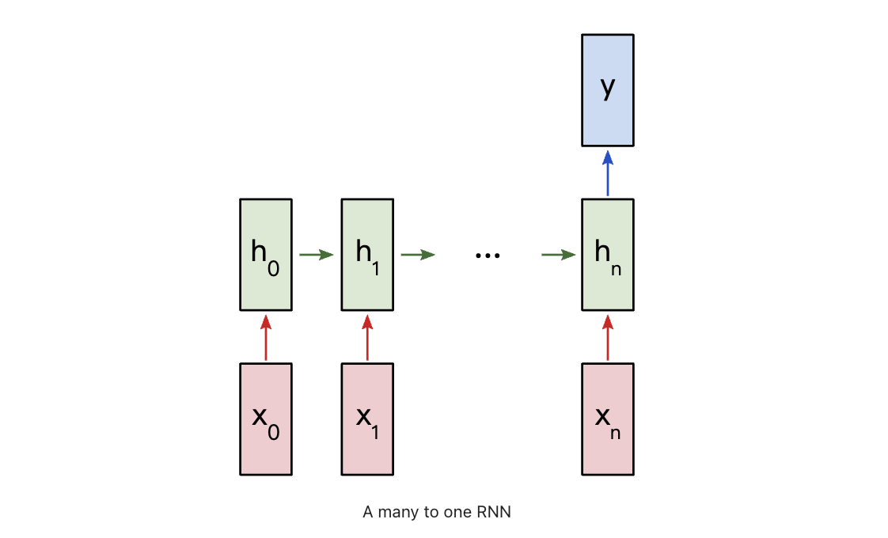
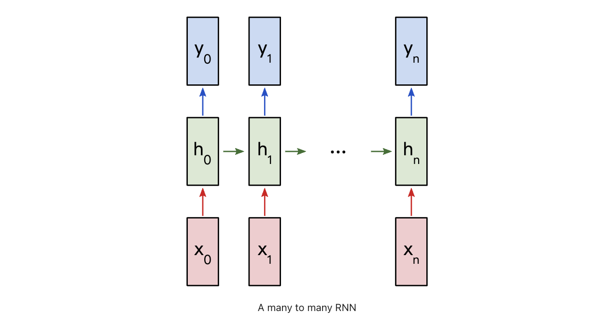

目录

- [RNN 简介](#rnn-简介)
  - [普通 NN 和 RNN 的区别](#普通-nn-和-rnn-的区别)
  - [给网络增加记忆能力](#给网络增加记忆能力)
    - [TDNN](#tdnn)
    - [NARX](#narx)
    - [RNN](#rnn)
- [RNN 网络架构](#rnn-网络架构)
  - [RNN 网络架构概览](#rnn-网络架构概览)
  - [RNN 网络架构详解](#rnn-网络架构详解)
    - [RNN 基本结构](#rnn-基本结构)
    - [RNN 单元结构](#rnn-单元结构)
  - [RNN 前向传播](#rnn-前向传播)
    - [RNN 前向传播模型](#rnn-前向传播模型)
    - [RNN 激活函数](#rnn-激活函数)
  - [RNN 反向传播](#rnn-反向传播)
    - [RNN 损失函数](#rnn-损失函数)
    - [RNN 梯度下降算法](#rnn-梯度下降算法)
    - [RNN 完整结构](#rnn-完整结构)
  - [RNN 模式](#rnn-模式)
  - [RNN 数据类型](#rnn-数据类型)
  - [RNN 表现形态](#rnn-表现形态)
  - [RNN 模型](#rnn-模型)
  - [RNN 应用](#rnn-应用)
- [RNN 情感分析示例](#rnn-情感分析示例)
  - [问题分析](#问题分析)
  - [数据处理](#数据处理)
  - [RNN 前向传播](#rnn-前向传播-1)
  - [RNN 后向传播](#rnn-后向传播)
  - [RNN 训练](#rnn-训练)
- [参考文章](#参考文章)

一般地，各种 RNN 序列模型层(RNN、GRU、LSTM 等)可以用函数表示如下:

`$$h_t = f(h_{t-1},i_t)$$`

这个公式的含义是：`$t$` 时刻循环神经网络的输出向量 `$h_t$`，
由 `$t-1$` 时刻的输出向量 `$h_{t-1}$` 和 `$t$` 时刻的输入 `$i_t$` 变换而来

# RNN 简介

前馈神经网络可以看作一个复杂的函数，每次输入都是独立的，即网络的输出只依赖于当前的输入。
但是在很多现实任务中，网络的输出不仅和当前时刻的输入相关，也和其过去一段时间的输出相关。
比如 一个有限状态自动机，其下一个时刻的状态(输出)不仅仅和当前输入相关，也和当前状态(上一个时刻的输出)相关。
此外，前馈网络难以处理时序数据，比如视频、语音、文本等时序数据的长度一般是不固定的，
而前馈神经网络要求输入和输出的维数都是固定的，不能任意改变。
因此，当处理这一类和时序数据相关的问题时，就需要一种能力更强的模型

循环神经网络(Recurrent Neural Network，RNN)是一类具有 **短期记忆能力** 的神经网络。
在循环神经网络中，神经元不但可以接受其他神经元的信息，也可以接受自身的信息，形成具有环路的网络结构。
和前馈神经网络相比，循环神经网络更加符合生物神经网络的结构。
循环神经网络已经被广泛应用在语音识别、语言模型以及自然语言生成等任务上

循环神经网络的参数学习可以通过 **随时间反向传播算法** 来学习。随时间反向传播算法按照时间的逆序将错误信息一步步地往前传递。
当输入序列比较长时，会存在梯度爆炸和消失问题，也称为长程依赖问题。为了解决这个问题，人们对循环神经网络进行了很多的改进，
其中最有效的改进方式引入门控机制(Gating Mechanism)

此外，循环神经网络可以很容易地扩展到两种更广义的记忆网络模型：递归神经网络和图网络

## 普通 NN 和 RNN 的区别

首先，根据 RNN 和 CNN 的结构区别，“循环”两个字已经点出了 RNN 的核心特征，即系统的输出会保留在网络里，
和系统下一刻的输入一起共同决定下一刻的输出。这就把动力学的本质体现了出来，循环正对应动力学系统的反馈概念，
可以刻画复杂的历史依赖

另一个角度看也符合著名的图灵机原理。即此刻的状态包含上一刻的历史，又是下一刻变化的依据。 
这其实包含了可编程神经网络的核心概念，即，当你有一个未知的过程，但你可以测量到输入和输出，
假设当这个过程通过 RNN 的时候，它是可以自己学会这样的输入输出规律的，而且因此具有预测能力。
在这点上说， RNN是图灵完备的

对于序列数据，其他神经网络模型不可行的理由：

* 输入、输出的长度是否相等以及输入大小不固定的问题
    - 在语音识别问题中，输入音频序列和输出文本序列很少情况下是长度相等的，普通网络难以处理这种问题
* 普通神经网络结构不能共享从文本不同位置上学到的特征
    - 简单来说就是，如果神经网络已经从位置 `1` 学到了 `louwill` 是一个人名，
      那么如果 `louwill` 出现在其他位置，神经网络就可以自动识别它就是已经学习过的人名，
      这种共享可以减少训练参数和提高网络效率，普通网络不能达到这样的目的

## 给网络增加记忆能力

为了处理时序数据并利用其历史信息，需要让网络具有短期记忆能力。而前馈网络是一种静态网络，不具备这种记忆能力

一般来讲，可以通过一下三种方法来给网络增加短期记忆能力

### TDNN

> 延时神经网络，Time Delay Neural Network，TDNN

一种简单的利用历史信息的方法是建立一个额外的延时单元，用来存储网络的历史信息(可以包括输入、输出、隐状态等)。
比较有代表性的模型是延时神经网络(Time Delay Neural Network，TDNN)

延时神经网络是在前馈网络中的非输出层都添加一个延时器，记录神经元的最近几次活性值。
在第 `$t$` 个时刻，第 `$l$` 层神经元的活性值依赖于第 `$l - 1$` 层神经元的最近 `$\mathbf{K}$` 个时刻的活性值。
通过延时器，前馈网络就具有了短期记忆的能力。即

`$$h_{t}^{(l)} = f(h_{t}^{(l-1)}, h_{t-1}^{(l-1)}, \ldots, h_{t-\mathbf{K}}^{(l-1)})$$`

其中：

* `$h_{t}^{(l)} \in \mathbb{R}^{M_{l}}$` 表示第 `$l$` 层神经元在时刻 `$t$` 的活性值
* `$M_{l}$` 为第 `$l$` 层神经元的数量

延时神经网络在时间维度上共享权值，以降低参数数量。因此对于序列输入来讲，延时神经网络就相当于卷积神经网络

### NARX

> 有外部输入的非线性自回归模型，Nonlinear AutoRegressive with Exogenous Inputs Model，NARX

自回归模型(AutoRegressive Model, AR)是统计学上常用的一类时间序列模型，
用一个变量 `$y_{t}$` 的历史信息来预测自己

`$$y_{t} = \omega_{0} + \sum_{k=1}^{K}\omega_{k}y_{t-k}+\epsilon_{t}$$`

其中：

* `$K$` 为超参数
* `$\omega_{0}, \omega_{1}, \ldots, \omega_{K}$` 为可学习参数
* `$\epsilon_{t} \sim \mathcal{N}(0, \sigma^{2})$` 为第 `$t$` 个时刻的噪声，方差 `$\sigma^{2}$` 和时间无关

有外部输入的非线性自回归模型(Nonlinear AutoRegressive with Exogenous Inputs Model, NARX)是自回归模型的扩展，
在每个时刻 `$t$` 都有一个外部输入 `$x_{t}$` 产生一个输出 `$y_{t}$`。
NARX 通过一个延时器记录最近 `$K_{x}$` 次的外部输入 `$(x_{t-1}, \ldots, x_{t-K_{x}})$` 和最近 `$K_{y}$` 次的输出 `$(y_{t-1}, y_{t-2}, \ldots, y_{t-K_{y}})$`，第 `$t$` 个时刻的输出 `$y_{t}$` 为

`$$y_{t}=f(x_{t}, x_{t-1}, \ldots, x_{t-K_{x}}, y_{t-1}, y_{t-2}, \ldots, y_{t-K_{y}})$$`

其中：

* `$f(\cdot)$` 表示非线性函数，可以是一个前馈网络
* `$K_{x}$` 和 `$K_{y}$` 为超参数

### RNN

循环神经网络(Recurrent Neural Network, RNN)通过使用带自反馈的神经元，能够处理任意长度的时序数据。
下图给出了循环神经网络的示例，其中“延时器”为一个虚拟单元，记录神经元的最近一次(或几次)活性值

给定一个输入序列 `$\mathbf{x} = (x_{1}, x_{2}, \ldots, x_{t}, \ldots, x_{T})$`，
循环神经网络通过下面公式更新带反馈边的隐藏层的活性值 `$h_{t}$`：

`$$h_{t} = f(h_{t-1}, x_{t}), t = 1, 2, \ldots, T$$`

其中：

* `$h_{0} = 0$`
* `$f(\cdot)$` 为一个非线性函数，可以是一个前馈网络

由于循环神经网络具有短期记忆能力，相当于存储装置，因此其计算能力十分强大。
理论上，循环神经网络可以近似任意的非线性动力系统。
前馈神经网络可以模拟任何连续函数，而循环神经网络可以模拟任何程序

# RNN 网络架构

## RNN 网络架构概览

RNN 网络是由一系列重复的 RNN 单元结构组成的神经网络重复模块链的形式

RNN 单元结构：

RNN 神经网络重复模块链：

在标准的 RNN 中，此重复模块具有非常简单的结构，例如单个 tanh 层：

RNN 单元结构的具体形式：

## RNN 网络架构详解

### RNN 基本结构

下面是 RNN 的基本结构，左边是一个统一的表现形式，右边则是左边展开的图解 

在这样的 RNN 中，当预测 `$y_t$` 时，不仅要使用 `$x_t$` 的信息，
还要使用 `$x_{t-1}$` 的信息，因为在横轴路径上的隐状态激活信息 `$h_{t-1}$` 可以帮助预测 `$y_t$`

### RNN 单元结构

假设一个 RNN 网络使用输入 `$\{x_{0}, x_{1}, \ldots, x_{n}\}$` 产生输出 `$\{y_{0}, y_{1}, \ldots, y_{m}\}$`。
这里 `$x_{i}(i = 0, 1, \ldots, n)$` 和 `$y_{j}(j=0, 1, \ldots, m)$` 均为任意维度的向量。
RNN 通过迭代更新隐藏层变量 `$h$`，`$h$` 在特定迭代步 `$t$` 中也同样是任意维度的向量

在特定的迭代中，RNN 单元结构通常需要两次计算：

* 一次是结合上一个时间步的隐状态值 `$W_{hh} h_{t-1}$` 和输入 `$W_{xh}x_{t}$` 及偏置 `$b_{h}$`，
  计算当前迭代的隐藏状态 `$h_{t}$`
* 另一次是基于当前隐状态值 `$W_{hy}h_{t}$` 和输出偏置 `$b_{y}$` 计算输出 `$y_{t}$`

RNN 单元结构数学表达式：

`$$h_{t} = tanh(W_{xh}x_{t} + W_{hh} h_{t-1} + b_{h})$$`
`$$y_{t} = softmax(W_{hy}h_{t} + b_{y})$$`

其中：

* `$h$` 就是隐变量(hidden variable)，即整个网络每个神经元的状态，`$x$` 是输入，`$y$` 是输出，注意这三者都是高维向量
* 隐藏层的激活函数一般采用 `$tanh(\cdot)$` 激活函数
* 输入、输出层的激活函数一般使用 `$sigmoid(\cdot)$` 或 `$softmax(\cdot)$` 激活函数

> 隐变量 `$h$` 就是通常说的神经网络本体，也正是循环得以实现的基础，因为它如同一个可以储存无穷历史信息(理论上)的水库，
> 一方面会通过输入矩阵 `$W_{xh}$` 吸收输入序列 `$x$` 的当下值。
> 另一方面通过网络连接 `$W_{hh}$` 进行内部神经元间的相互作用(网络效应，信息传递)，
> 因为其网络的状态和输入的整个过去历史有关，最终的输出又是两部分加在一起共同通过非线性函数 `$tanh$`。
> 整个过程就是一个循环神经网络“循环”的过程 
> 
> `$W_{hh}$` 理论上可以可以刻画输入的整个历史对于最终输出的任何反馈形式，从而刻画序列内部，
> 或序列之间的时间关联，这是 RNN 强大的关键

## RNN 前向传播

### RNN 前向传播模型

`$$h_{t} = tanh(W_{xh}x_{t} + W_{hh} h_{t-1} + b_{h})$$`
`$$y_{t} = softmax(W_{hy}h_{t} + b_{y})$$`

### RNN 激活函数

tanh 激活函数:

`$$\sigma(x) = \frac{e^{x} - e^{-x}}{e^{x} + e^{-x}}$$`

tanh 的导函数：

`$$\frac{d \sigma(x)}{dx} = 1 - tanh^{2}(x)$$`

Softmax 激活函数:

`$$\sigma(a;k) = \frac{e^{a_{k}}}{\sum_{i=1}^{n}e^{a_i}}$$`

其中:

* `$n$`: 是输出层神经元的个数
* `$k$`: 是指第 `$k$` 个神经元
* `$a$`: 是输入信号

## RNN 反向传播

以下面的 RNN 结构为例进行推导

### RNN 损失函数

交叉熵损失(cross-entropy loss)：

`$$\begin{align}
L(y; W_{xh}, b_{h}, W_{hh}, b_{y})
&= -ln(p_{c}) \\
&= -ln(Softmax(y_{c})) \\
&= -ln\Bigg(\frac{e^{y_{k}}}{\sum_{i}e^{y_{i}}}\Bigg)
\end{align}$$`

其中：

* `$p_{c}$` 是 RNN 对正确类别的预测概率
* `$c$` 是正例标签

### RNN 梯度下降算法

> 随时间反向传播算法，Backpropagation Through Time，BPTT

易知损失函数 `$L$` 对输出 `$y$` 的梯度为：

`$$\frac{\partial L}{\partial y_{i}} = \begin{cases}
p_{i}, \quad i \neq c \\
p_{i} - 1, \quad i = c
\end{cases}$$`

在 "many-to-one" RNN 中，由于 `$h_{n}$` 是最后一个隐藏层状态，已知

`$$y = W_{hy}h_{n} + b_{y}$$`

计算损失函数对于 `$W_{hy}$` 的梯度：

`$$\begin{align}
\frac{\partial L}{\partial W_{hy}} 
&= \frac{\partial L}{\partial y} \times \frac{\partial y}{\partial W_{hy}} \\
&= \frac{\partial L}{\partial y} \times h_{n}
\end{align}$$`

计算损失函数对于 `$b_{y}$` 的梯度：

`$$\begin{align}
\frac{\partial L}{\partial b_{y}} 
&= \frac{\partial L}{\partial y} \times \frac{\partial y}{\partial b_{y}} \\
&= \frac{\partial L}{\partial y} \times 1
\end{align}$$`

下面计算损失函数对于 `$W_{hh}$`、`$W_{xh}$` 和 `$b_{h}$` 的梯度，它们在 RNN 的每一步迭代中都要用到。
因为 `$W_{xh}$` 的改变会影响每个 `$h_{t}$`，进而影响 `$y$` 和 `$L$`，为了计算 `$W_{xh}$` 的梯度，
需要计算反向传播中的每个时间步

`$$h_{t} = tanh(W_{xh}x_{t} + W_{hh} h_{t-1} + b_{h})$$`

`$$\begin{align}
\frac{\partial L}{\partial W_{xh}} 
&= \frac{\partial L}{\partial y}\sum_{t}\Big(\frac{\partial y}{\partial h_{t}} \times \frac{\partial h_{t}}{\partial W_{xh}}\Big) \\
&= \frac{\partial L}{\partial y}\sum_{t}\Big(\frac{\partial y}{\partial h_{t}} \times (1-h_{t}^{2})x_{t} \Big) \\
\end{align}$$`

同理：

`$$\begin{align}
\frac{\partial L}{\partial W_{hh}} 
&= \frac{\partial L}{\partial y}\sum_{t}\Big(\frac{\partial y}{\partial h_{t}} \times \frac{\partial h_{t}}{\partial W_{hh}}\Big) \\
&= \frac{\partial L}{\partial y}\sum_{t}\Big(\frac{\partial y}{\partial h_{t}} \times (1-h_{t}^{2})h_{t-1} \Big) \\
\end{align}$$`

`$$\begin{align}
\frac{\partial L}{\partial b_{h}} 
&= \frac{\partial L}{\partial y}\sum_{t}\Big(\frac{\partial y}{\partial h_{t}} \times \frac{\partial h_{t}}{\partial b_{h}}\Big) \\
&= \frac{\partial L}{\partial y}\sum_{t}\Big(\frac{\partial y}{\partial h_{t}} \times (1-h_{t}^{2}) \Big) \\
\end{align}$$`

最后计算输出 `$y$` 关于 `$h_{t}$` 的梯度，需要通过递归的方法进行计算

`$$\begin{align}
\frac{\partial y}{\partial h_{t}} 
&= \frac{\partial y}{\partial h_{t+1}} \times \frac{\partial h_{t+1}}{h_{t}} \\
&= \frac{\partial y}{\partial h_{t+1}}(1-h_{t}^{2})W_{hh}
\end{align}$$`

`$$\frac{\partial y}{\partial h_{n}} = W_{hy}$$`

### RNN 完整结构

多个 RNN 单元结构组合在一起就是 RNN 结构：

## RNN 模式

带有时间和记忆属性的神经网路模型使得深度学习可以胜任语音识别和自然语言处理等序列建模问题。
当然, 上面介绍的 RNN 结构是最基础、最经典的网络结构，在这个结构的基础上，RNN 针对输入输
出序列的长度异同和记忆强度有各种各样的变种模型

相比于其它神经网络只能采用固定大小的输入并产生固定大小的输出，如 CNN。
RNN 可以将长度可变的序列作为输入和输出，以下是 RNN 的一些示例：

RNN 这种处理序列的能力非常有用，比如(除一对一)：

* 一对一(1 vs 1)
    - CNN
* 一对多(1 vs N)
    - 将图像转化为一行文字
    - 根据类别生成对应音乐
* 多对一(N vs 1)
    - 文本情感分类，测量一段话是正面还是负面的情绪
* 多对多(N vs M)
    - seq2seq，机器翻译，语音识别...
    - 输入和输出之间存在时差
* 多对多(N vs N)
    - 命名实体识别
    - 给一个录像中的每一帧贴标签
    - 输入和输出之间没有时差

循环神经网络可以应用到很多不同类型的机器学习任务。根据这些任务的特点可以分为以下几种模式:

* 序列到类别模式

* 同步的序列到序列模式

* 异步的序列到序列模式

## RNN 数据类型

* 文本(单词序列、字符序列)数据
* 时间序列数据
* 一般的序列数据

## RNN 表现形态

* 循环
* 递归
    - 时间递归
    - 结构递归

## RNN 模型

* RNN (Recurrent Neural Network) 循环神经网络
* 1D Convnet 一维卷积神经网路
* LSTM (Long Short-Term Memory) 长短期记忆网络
* GRU (Gate Recurrent Unit) 门控循环单元

## RNN 应用

* 文档分类
* 语音识别
* 自然语言处理
* 时间序列预测

# RNN 情感分析示例

> RNn Sentiment Analysis：determining whether a given text string is positive or negative

## 问题分析

这是一个分类问题，使用 "many-to-one" RNN，它和 "many-to-many" RNN 比较相似，
只不过 "many-to-one" 仅适用最后一个隐藏层 `$h_{n}$` 生成输出 `$y$`

RNN 中的每一个 `$x_{i}, i=0, 1, \ldots, n$` 都是一个从文本生成的向量表示，输出 `$y$` 是一个包含两个数值的向量，
一个表示正例，另一个表示负例。最后使用 Softmax 激活函数讲输出 `$y$` 的数值转换为概率，并最终在正负之间做出选择

## 数据处理

数据可以在[这里](https://github.com/vzhou842/rnn-from-scratch/blob/master/data.py)下载

将数转换为可用的形式，第一步先构建数据中存在的所有词汇的词汇表(字典)

使用 One-Hot 向量化表示将输入转换为词向量

## RNN 前向传播

## RNN 后向传播

## RNN 训练

数据处理：

模型训练：

# 参考文章

* [狗熊会课程](https://mp.weixin.qq.com/s?__biz=MzA5MjEyMTYwMg==&mid=2650243006&idx=1&sn=331cf61b127724223d3bc5d796db853d&chksm=887220d3bf05a9c51078f6cf5cb7a8decbd59a0f9a91e65db3812bb669c80c26f45c41aae13f&scene=21#wechat_redirect) 
* [An Introduction to Recurrent Neural Networks for Beginners](https://victorzhou.com/blog/intro-to-rnns/)
* [The Unreasonable Effectiveness of Recurrent Neural Networks](http://karpathy.github.io/2015/05/21/rnn-effectiveness/)
* [Minimalist Recurrent Neural Network](https://mkffl.github.io/2019/07/08/minimalist-RNN.html)
* [RNN Implementation using NumPy](https://github.com/JY-Yoon/RNN-Implementation-using-NumPy/blob/master/RNN%20Implementation%20using%20NumPy.ipynb)
* [min char rnn](https://gist.github.com/karpathy/d4dee566867f8291f086)
* [循环神经网络RNN打开手册](https://zhuanlan.zhihu.com/p/22930328)
* [Recurrent Neural Networks (RNNs)](https://towardsdatascience.com/recurrent-neural-networks-rnns-3f06d7653a85)
