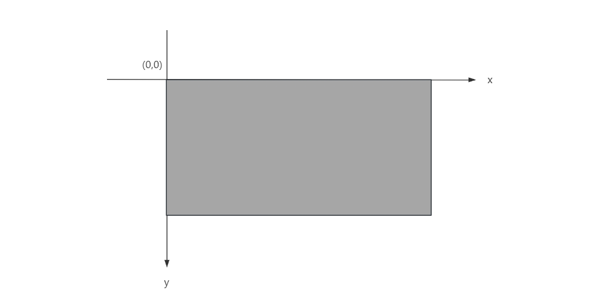

目录

- [数字图像概述](#数字图像概述)
    - [图像表示](#图像表示)
        - [二值数字图像](#二值数字图像)
        - [灰度数字图像](#灰度数字图像)
        - [二值数字图像的处理](#二值数字图像的处理)
        - [像素值的范围](#像素值的范围)
        - [图像索引](#图像索引)
        - [彩色图像的表示](#彩色图像的表示)
    - [应用基础](#应用基础)
        - [量化](#量化)
        - [特征](#特征)
        - [距离](#距离)
        - [图像识别](#图像识别)
        - [信息隐藏](#信息隐藏)
    - [智能图像处理](#智能图像处理)
        - [传统方法](#传统方法)
        - [机器学习方法](#机器学习方法)
        - [深度学习方法](#深度学习方法)
- [图像处理概述](#图像处理概述)
    - [图像处理基本操作](#图像处理基本操作)
        - [图像读取](#图像读取)
        - [图像显示](#图像显示)
        - [图像保存](#图像保存)
        - [边缘填充](#边缘填充)
        - [调整尺寸](#调整尺寸)
        - [图像旋转](#图像旋转)
        - [图像反转](#图像反转)
        - [图像翻转](#图像翻转)
        - [图像裁剪](#图像裁剪)
        - [图像灰度处理](#图像灰度处理)
        - [改变图片亮度、明暗、色调](#改变图片亮度明暗色调)
        - [图像调节对比度](#图像调节对比度)
        - [图像调节锐度](#图像调节锐度)
        - [图像模糊化](#图像模糊化)
        - [图像透视](#图像透视)
        - [图像仿射](#图像仿射)
        - [图像调色](#图像调色)
        - [图像曝光](#图像曝光)
        - [图像均衡](#图像均衡)
        - [图像增强](#图像增强)
        - [图像琐碎的广域增广](#图像琐碎的广域增广)

# 数字图像概述

相比于直观的数据处理，图像处理更抽象和复杂。因为在处理数据时，我们和计算机处理的是同一个对象--数据。
与处理数据相比，处理图像的情况稍显复杂。我们擅长理解图像，而计算机擅长理解数值。

在处理图像时，我们要把图像转换为数值，再交给计算机来处理。这意味着，我们要从自身擅长的领域，
转换到我们不太擅长的领域，转换为枯燥无味的数值，然后让计算机处理这些数值，
最后让计算机把处理好的数值转换为图像交给我们。改过程是图像处理的核心内容。

## 图像表示

数字图像的存储、显示与十字绣等作品的制作具有异曲同工之妙，
数字图像是由一个又一个的点构成的，这些点别成为像素。

### 二值数字图像

计算机使用不同的数值来表示不同的颜色。

对于一个二值图像，
该图像是由若干个像素点构成，这些像素点分为两种颜色，即黑色和白色。
该图像被存储在计算机中时，白色的像素点被存储为“1”，黑色的像素点被存储为“0”。

对于比较简单的由少量像素点（如 `$8\times 8$` 个像素点）表示的图像，
通常用来表示数字、字母等简单信息，被广泛应用在仪表盘等场景下。
如果图像包含更多像素点，那么图像将能够呈现更细微的变化与差别。
表示一幅图像的像素点越多，图像呈现的细节信息越丰富，图像越逼真。
这个衡量图像清晰度的重要标准被称为分辨率。
通常情况下，图像的分辨率越高，单位面积内包含的像素点越多，图像越清晰。

### 灰度数字图像

二值图像仅仅能够表示黑白两种颜色，色彩比较单一，因此呈现的信息不够丰富。
如果使用更多的颜色来呈现图像，就可以让图像具有更丰富的层次。
如果图像不再仅有黑白两种颜色，而是具有更多不同程度的灰度级。

通常情况下，使用一个字节，即 8 个二进制位，来表示一个像素点。
一个 8 位的二进制数能够表示的数据范围是 `$0000 0000 \sim 1111 1111$`，
即 `$0 \sim 2^{8}$`，也就是 `$[0, 255]$`。因此使用 8 位二进制数能够表示 256 种不同的颜色，
这里的颜色为黑、白、灰三种。二值图像指仅具有黑色、白色两种不同颜色的图像。
上述具有更多灰度级的图像被称为 灰度图像。
一般情况下，使用灰度级来表示色彩的范围，使用 8 位二进制数表示的灰度图像具有 256 个灰度级。
通常所说的灰度图像，是指具有 256 个灰度级的图像。一般用 8 位二进制数表示灰度图像，被称为 8 位位图。 

在灰度图像中，使用数值“0”表示纯黑色，使用数值“256”表示纯白色，使用其他值分别表示不同程度的灰色。
数值越小，灰度越深；数值越大，灰度越浅。

### 二值数字图像的处理

二值图像仅有黑色和白色，因此可以仅使用一个比特位来表示一个像素点，用数值“1”表示白色，用数值“0”表示黑色。
在计算机中，字节是存储的基本单位。与此相对应，8 位位图是一种应用最广泛的图像。
因此，在实践中，为了处理上的方便及一致性，通常用 8 位位图来表示二值图像。

在 8 位位图构成的灰度图像中，用数值“255”表示白色，用数值“0”表示黑色，其他数值分别表示深浅不同的灰色。
在使用包含 256 个灰度级的 8 位位图来表示仅包含黑色和白色的二值图像时，用数值“255”表示白色，用数值“0”表示黑色。
不存在其他值。

在实践中，通常会将其他形式的图像（如灰度图像）处理为二值图像再进行运算。
一方面是由于二值图像运算更简单方便，另一方面是由于二值图像能够保留原始图像（如灰度图像）中的重要特征信息。
因此，二值图像是图像处理过程中的关键图像，在实践中发挥着非常重要的作用。

### 像素值的范围

通常情况下，采用一个字节来描述灰度图像中的一个像素点的像素值。一个字节表示的范围是 `$[0, 255]$`。
在处理图像的过程中，像素点的像素值的处理结果可能会超过 255，此时应该如何处理该值呢？

实际上，在显示数据时，存在两种不同的处理方式：

* 取模处理：也可以称为“循环取余”
    - 比如：电表、水表、手表等显示数据，这些表的终点和起点是重叠的，到达终点后，就是一个新的起点。
* 饱和处理：把越界的数值处理位最大值，也被称为“截断处理”。
    - 比如：骑车仪表盘，当汽车速度超过仪表盘能显示的最大值时，仪表盘显示的就是最大值，不会从 0 开始重新计数。

在图像处理过程中，也常采用上述两种方式对图像的运算结果进行处理，以 8 位位图为例来进行说明：

* 取模处理

`$$result = mod(ov, 255)$$`

* 饱和处理

`$$result = \begin{cases}
255, ov > 255 \\
ov, else 
\end{cases}$$`

### 图像索引

数字图像在计算机中是存储在一个矩阵（数组）内的。矩阵中的每个元素都有一个位置值，
该位置值用来表示元素所在位置的行号和列号。这个位置通常被称为索引。

有时还需要使用坐标系表示 OpenCV 内的图像的位置。
需要注意的是，OpenCV 中图像坐标原点在其左上角，该点坐标值为 `$(0, 0)$`。
自原点向右，`$x$` 值不断增加；自原点向下，`$y$` 值不断增加。OpenCV 中的图像坐标见下图：

坐标和矩阵的应用场景不同。在运算中，需要额外注意坐标和矩阵之间的关系。
在图像处理中经常用到图像的行（row）、列（column）、宽度（width）、高度（height）信息。

### 彩色图像的表示

神经生理学实验发现，视网膜上存在的颜色感受器能够感受三种不同的颜色，即：红色、绿色、蓝色，这就是三基色。
自然界中常见的各种色光都可以通过将三基色按照一定比例混合得到。
从光学的角度出发，可以将颜色解析为：主波长、纯度、明度等；
从心里学和视觉角度出发，可以将颜色解析为：色调、饱和度、亮度等；
通常将上述采用的不同方式表述颜色的模式称为色彩空间（颜色空间、颜色模式等）。

虽然不同的色彩空间具有不同的表示方式，但是各种色彩空间之间可以根据需要按公式进行转换。
在计算机中，RGB 模式是一种被广泛采用的模式，
该模式采用 R(Red, 红色)、G(Green, 绿色)、B(Blue, 蓝色)三个分量来表示不同颜色。
R、G、B 分别对应三种颜色分量的大小，每个分量值得取值范围都是 `$[0, 255]$`。
因此，可以用一个三维数组来表示一幅 RGB 色彩空间得彩色图像。

通常情况下，在计算机中存储 RGB 模式的像素点时，不是把三个色彩分量的值保存在一起。
而是单独存放每个色彩分量的值。RGB 色彩空间中存在 R 通道、G 通道和 B 通道三个通道。
每个色彩通道值得范围都是 `$[0, 255]$`，我们用这三个色彩通道的组合表示颜色。

## 应用基础

### 量化

图像处理的一个关键问题是将其量化，计算机不能直接理解图像，
只有将图像处理为数值，计算机才能通过数值理解图像。

量简单的量化就是直接获取图像各像素点的像素值。但是，实践中面对的往往是比较复杂图像，
如果直接对图像内所有像素点进行运算，那么运算量是非常庞大的，有时难以实现实效果。

例如，在视频监控场景中，可以通过对比一个摄像头先后拍摄的两幅相片是否一致，
判断是否有人闯入。此时，简单地对每一个像素点的像素值进行对比，难以获得很好的效果。
一方面是因为像素点过多，运算量过大；另一方面是因为树叶晃动等微小的变化也会对运算果造成影响。
基于此，通常要把最能代表图像的本质特征提取出来（量化），以便进行后续作。

### 特征

在一定程度上，特征是指图像核心、本质的特点。只有从图像中提取出其特征，
才能更高效地处理图像。图像的特征可能是非常直观的、可视化的，也可能是不易观察的、隐藏的。
在提取图像特征时，需要细心观察，特征既要体现本图像的特点，还要体现其与其他图像的差别。

### 距离

为了更好地对图像进行区分、识别，通常使用距离来衡量图像之间的差异。

### 图像识别

看一个人脸识别的例子。要进行人脸识别：

1. 首先，需要找到一个可以用简洁且具有差异性的方式准确反映人脸特征的模型；
2. 然后，采用该模型提取已知人脸的特征，得到特征集合 `$T$`；
3. 再采用该模型提取待识别人脸的特征，得到特征值 `$X$`；
4. 将特征识别人脸的特征值 `$X$` 与特征集合 `$T$` 中的人脸特征一一对比，
   计算距离，并将其识别为距离最近的人脸；

### 信息隐藏

通过图像像素值的奇偶性来实现图像信息的隐藏。

## 智能图像处理

### 传统方法

以上介绍的都是使用传统方法来实现图像处理的。传统方法涉及的核心问题有：

* 选择合适的特征，要高度概括图像特点，体现不同图像间的差异；
* 合适的量化方式：将特征量化为合理的数值；
* 距离计算：选用合适的距离计算方式计算距离。

传统方法的特点是，需要提取图像的特征，并手动对特征进行分析、处理。
在对特征进行分析、处理的过程中，距离的计算是非常关键的。
为实现图像的分类、识别等，人们提出了很多距离计算方式。
在图像处理早期阶段，传统处理方式解决了非常多的问题。

### 机器学习方法

为了更高效地处理图像，人们引入了机器学习。机器学习方法的首要工作仍是进行特征的提取和量化，
但机器学习提供了更多对特征值进行处理的方式，让我们能够根据需要对特征进行不同维度的分析、处理，
从而得到对图像的分析处理结果。

简单来说，在传统方法中，我们常使用特征的距离来实现对图像的分析处理（如图像识别等）。
在使用机器学习处理图像时，机器学习提供了更多关于如何使用特征来完成图像处理工作的成熟方案。
我们可以直接采用已知的具体成熟方案来完成对特征的分析、处理工作，从而实现对图像的识别、分类等。
也就是说，在传统方式中，我们需要自己提取特征，然后选取一种有效的特征处理方式，
如通过计算距离并对比结果等完成对特征的处理工作。而在机器学习中，我们要做的工作只是提取特征，
在提取完特征后，直接把特征交给机器学习算法来处理即可。

机器学习提供了强大且多样的特征处理方案。这里将介绍使用 OpenCV 通过 K 近邻算法、支持向量机、
K 均值聚类等方式实现手写数字识别等工作。

机器学习让我们只需关注特征提取，无须关注如何处理特征，与传统图像处理方式相比，工作量减少了一半。
但是，特征提取其实是一件非常困难的事，主要体现在如下两方面。

1. 如何选取特征

图像的特征有很多，多到我们无法想象。因为从根本上讲，任何像素之间的排列组合都能作为特征。
那么哪些特征有用，哪些特征没用呢？有些特征是能够一眼捕捉的，在这种情况下直接拿来用就好了。
但是，有些特征可能并不直观，属于图像隐含的高层次特征，无法直接被观察到，
在这种情况下就无法直接提取出这些特征。因此选取有效的特征一直是图像处理过程中面临的一个非常复杂的问题。
即使在机器学习阶段，特征的选取仍是一个重要的研究方向。人们在这方面取得了很多突破，
并提出了非常多的有效特征提取方式，如 SIFT、HOG、SURF 等。
但是，通过这些方式提取的特征具有很强的针对性，在不同的场景下，如何选取有效特征成为一个难题。

2. 如何处理特征

在找到合适的特征后，如何处理特征是一个非常棘手的问题。
即使使用机器学习也面临从众多算法中选择合适的算法来处理特征的问题。
即使获取了有效特征、选用了合适的算法，特征值的计算量也是巨大的。
因此，即使机器学习能够自动处理特征，同样需要对特征进行有效的预处理，以减少计算量。
这有点复杂，针对特征值的预处理，好像又让我们回到了传统图像处理方式上，
仍需要对特征进行复杂的处理工作。

### 深度学习方法

机器学习中的这两个问题一直困扰着图像处理工作者，他们不断寻找突破点，
在这种情况下，他们提出使用深度学习来处理图像。

在深度学习中，不需要直接提取特征，而是通过卷积操作等提取图像的高层次特征，
这些特征往往能够更清晰地表述图像的高层语义，甚至有可能包含我们不能直接理解或观察到的特征。
在深度学习中，我们重点关注卷积操作，通过变换卷积操作提取不同特征。
通过卷积操作，可以提取到图像的高层次特征，利用这些特征可以更好地进行图像分析与处理。
例如，识别图像内的猫时，直接提取特征提取的可能是线条、边角等基础特征。
而在深度学习中，通过卷积可以提取猫所特有的形态、外观、姿势等高层次特征，
甚至可能包含不能被观察到的、尚未被掌握的，甚至不能理解的更高层次、更抽象的特征。

卷积运算在深度学习中发挥着非常关键的作用，下文将专门对卷积神经网络的基本方法和逻辑进行介绍。

# 图像处理概述

推荐使用 OpenCV 而不是 Pillow 和 Matplotlib，因为 OpenCV 具有更多的功能。
但是，只在显示图像或进行批量图像处理时使用 Pillow。
当在 Jupyter Notebook 中显示图像时，建议使用 Matplotlib。

## 图像处理基本操作

* 图像读取: read
* 图像显示: show
* 图像保存: save
* 边缘填充: pad
* 调整尺寸: resize
* 图像旋转: rotation
* 图像反转: invert
* 图像翻转: flip
    - 水平翻转: horizontal flip
    - 垂直翻转: vertical flip
* 图像裁剪: crop  
    - 中心裁剪: center crop
    - 五个裁剪: five crop
        - top_left
        - top_right
        - bottom_left
        - bottom_right
        - center
    - 随机裁剪: random crop
    - 随机尺寸裁剪: random resized crop
* 图像灰度处理: gray scale
* 改变图片亮度、明暗、色调: color jitter
    - 亮度: brightness
    - 饱和度: saturation
    - ...
* 图像调节对比度: adjust contrast
* 图像调节锐度: adjust sharpness
* 图像模糊化: Blur
    - Gaussian
* 图像透视: perspective
* 图像仿射: affine
* 图像调色(改变每个通道的颜色值): posterize
* 图像曝光: solarize
* 图像均衡: equalize
* 图像增强: augment 增强
* 图像琐碎的广域增广: trivial augment wide

### 图像读取
### 图像显示
### 图像保存
### 边缘填充
### 调整尺寸
### 图像旋转
### 图像反转
### 图像翻转
### 图像裁剪
### 图像灰度处理
### 改变图片亮度、明暗、色调
### 图像调节对比度
### 图像调节锐度
### 图像模糊化
### 图像透视
### 图像仿射
### 图像调色
### 图像曝光
### 图像均衡
### 图像增强
### 图像琐碎的广域增广

