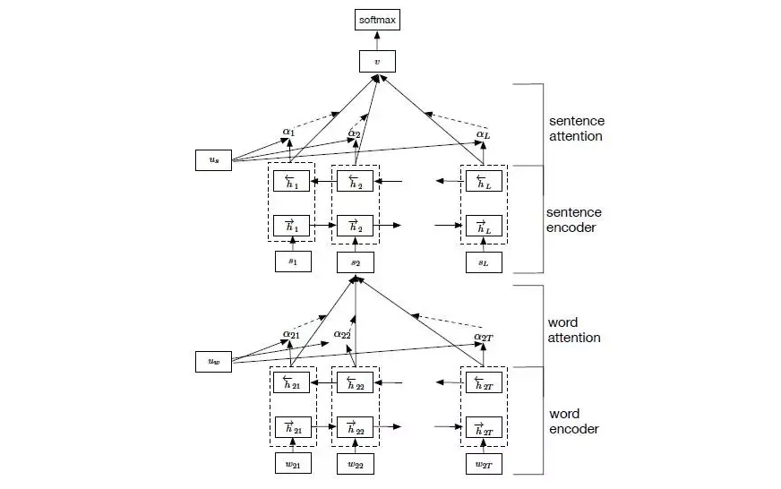
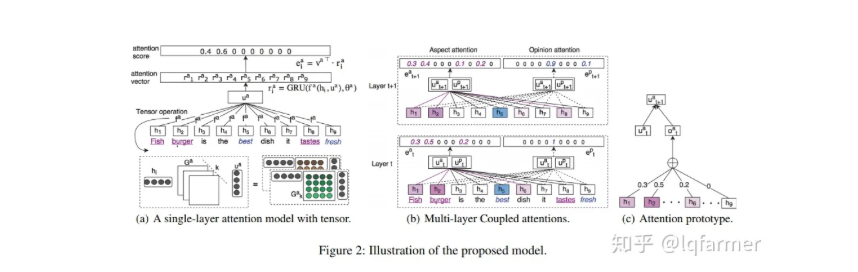

目录

- [为什么需要 Attention](#为什么需要-attention)
- [Attention 机制](#attention-机制)
  - [Attention 要解决的问题](#attention-要解决的问题)
  - [Attention 机制原理](#attention-机制原理)
- [Attention 类型](#attention-类型)
  - [Soft-Attention 和 Hard-Attention](#soft-attention-和-hard-attention)
  - [Global-Attention 和 Local-Attention](#global-attention-和-local-attention)
    - [Global-Attention](#global-attention)
    - [Local-Attention](#local-attention)
  - [Self-Attention](#self-attention)
  - [Hierarchical Attention](#hierarchical-attention)
  - [Attention over Attention](#attention-over-attention)
  - [Multi-step Attention](#multi-step-attention)
  - [Multi-dimensional Attention](#multi-dimensional-attention)
  - [Memory-based Attention](#memory-based-attention)
- [Attention 应用场景](#attention-应用场景)
  - [机器翻译](#机器翻译)
  - [图像标注](#图像标注)
  - [蕴含关系推理](#蕴含关系推理)
  - [语音识别](#语音识别)
  - [文字摘要生成](#文字摘要生成)
- [Attention 带来的算法改进](#attention-带来的算法改进)
- [参考](#参考)

# 为什么需要 Attention

让我们从循环神经网络的老大难问题——机器翻译问题入手。我们知道，普通的用目标语言中的词语来代替原文中的对应词语是行不通的，
因为从语言到另一种语言时词语的语序会发生变化。比如英语的 “red” 对应法语的 “rouge”，英语的 “dress” 对应法语 “robe”，
但是英语的 “red dress” 对应法语的 “robe rouge”

为了解决这个问题，创造了 Encoder-Decoder 结构的循环神经网络。它先通过一个 Encoder 循环神经网络读入所有的待翻译句子中的单词，
得到一个包含原文所有信息的中间隐藏层，接着把中间隐藏层状态输入 Decoder 网络，一个词一个词的输出翻译句子。
这样子无论输入中的关键词语有着怎样的先后次序，由于都被打包到中间层一起输入后方网络，
Encoder-Decoder 网络都可以很好地处理这些词的输出位置和形式了

但是问题在于，中间状态由于来自于输入网络最后的隐藏层，一般来说它是一个大小固定的向量。
既然是大小固定的向量，那么它能储存的信息就是有限的，当句子长度不断变长，
由于后方的 Decoder 网络的所有信息都来自中间状态，中间状态需要表达的信息就越来越多。
如果句子的信息是在太多，Decoder 网络就有点把握不住了

比如现在你可以尝试把下面这句话一次性记住并且翻译成中文：

> It was the best of times, it was the worst of times, it was the age of wisdom, 
> it was the age of foolishness, it was the epoch of belief, it was the epoch of incredulity, 
> it was the season of Light, it was the season of Darkness, it was the spring of hope, 
> it was the winter of despair, we had everything before us, we had nothing before us, 
> we were all going direct to Heaven, we were all going direct the other way — in short, 
> the period was so far like the present period, that some of its noisiest authorities insisted on its being received, 
> for good or for evil, in the superlative degree of comparison only. -- A Tale of Two Cities, Charles Dickens.

别说翻译了，对于人类而言，光是记住这个句子就有着不小的难度。如果不能一边翻译一边回头看，我们想要翻译出这个句子是相当不容易的。
Encoder-Decoder 网络就像我们的短时记忆一样，存在着容量的上限，在语句信息量过大时，中间状态就作为一个信息的瓶颈阻碍翻译了

可惜我们不能感受到 Encoder-Decoder 网络在翻译这个句子时的无奈。
但是我们可以从人类这种翻译不同句子时集中注意力在不同的语句段的翻译方式中受到启发，
得到循环神经网络中的 Attention 机制

# Attention 机制

Attention 是一种用于提升基于 RNN(LSTM 或 GRU) 的 Encoder-Decoder 模型的效果的的机制，
一般称为 Attention Mechanism，注意力机制

Attention Mechanism 目前非常流行，广泛应用于机器翻译、语音识别、图像标注(Image Caption)等很多领域，
之所以它这么受欢迎，是因为 Attention 给模型赋予了区分辨别的能力，例如，在机器翻译、语音识别应用中，
为句子中的每个词赋予不同的权重，使神经网络模型的学习变得更加灵活(soft)，同时 Attention 本身可以作为一种对齐关系，
解释翻译输入/输出句子之间的对齐关系，解释模型到底学到了什么知识，为我们打开深度学习的黑箱，提供了一个窗口

Attention Mechanism 与人类对外界事物的观察机制很类似，当人类观察外界事物的时候，一般不会把事物当成一个整体去看，
往往倾向于根据需要选择性的去获取被观察事物的某些重要部分，比如我们看到一个人时，往往先 Attention 到这个人的脸，
然后再把不同区域的信息组合起来，形成一个对被观察事物的整体印象。
因此，Attention Mechanism 可以帮助模型对输入的 `$X$` 每个部分赋予不同的权重，
抽取出更加关键及重要的信息，使模型做出更加准确的判断，同时不会对模型的计算和存储带来更大的开销，
这也是 Attention Mechanism 应用如此广泛的原因

## Attention 要解决的问题

论文《Sequence to Sequence Learning with Neural Networks》介绍了一种基于 RNN(LSTM) 的 Seq2Seq 模型，
基于一个 Encoder-Decoder 来构建基于神经网络的 End-to-End 的机器翻译模型，
其中，Encoder 把输入 `$X$` 编码成一个固定长度的隐向量 `$Z$`，Decoder 基于隐向量 `$Z$` 解码出目标输出 `$Y$`。
这是一个非常经典的序列到序列的模型，但是却存在两个明显的问题：

1. 把输入 `$X$` 的所有信息有压缩到一个固定长度的隐向量 `$Z$`，忽略了输入输入 `$X$` 的长度，当输入句子长度很长，
   特别是比训练集中最初的句子长度还长时，模型的性能急剧下降
2. 把输入 `$X$` 编码成一个固定的长度，对于句子中每个词都赋予相同的权重，这样做是不合理的，
   比如，在机器翻译里，输入的句子与输出句子之间，往往是输入一个或几个词对应于输出的一个或几个词。
   因此，对输入的每个词赋予相同权重，这样做没有区分度，往往是模型性能下降

同样的问题也存在于图像识别领域，卷积神经网络 CNN 对输入的图像每个区域做相同的处理，这样做没有区分度，
特别是当处理的图像尺寸非常大时，问题更明显。因此，2015 年，
Dzmitry Bahdanau 等人在《Neural machine translation by jointly learning to align and translate》提出了 Attention Mechanism，
用于对输入 `$X$` 的不同部分赋予不同的权重，进而实现软区分的目的

## Attention 机制原理

要介绍 Attention Mechanism 结构和原理，首先需要介绍下 Seq2Seq 模型的结构。
基于 RNN 的 Seq2Seq 模型主要由两篇论文介绍，只是采用了不同的 RNN 模型。
Ilya Sutskever 等人与 2014 年在论文《Sequence to Sequence Learning with Neural Networks》中使用 LSTM 来搭建 Seq2Seq 模型。
随后，2015年，Kyunghyun Cho 等人在论文《Learning Phrase Representations using RNN Encoder–Decoder for Statistical Machine Translation》提出了基于 GRU 的 Seq2Seq 模型。两篇文章所提出的 Seq2Seq 模型，想要解决的主要问题是，如何把机器翻译中，
变长的输入 `$X$` 映射到一个变长输出 `$Y$` 的问题。其主要结构如下图所示：

其中，Encoder 把一个变长的输入序列 `$x_{1}, x_{2}, \ldots x_{t}$` 编码成一个固定长度隐向量(背景向量，或上下文向量(context vector)) `$c$`，
`$c$` 有两个作用：

1. 作为初始向量初始化 Decoder 的模型，作为 Decoder 模型预测 `$y_{1}$` 的初始向量
2. 作为背景向量，指导 `$y$` 序列中每一个 step(`$1, 2, \ldots, T'$`) 的 `$y$` 的产出

Decoder 主要基于背景向量 `$c$` 和上一步的输出 `$y_{t-1}$` 解码得到该时刻 `$t$` 的输出 `$y_{t}$`，
直到碰到结束标志(`<EOS>`)为止

如上文所述，传统的 Seq2Seq 模型对输入序列 `$X$` 缺乏区分度，因此，2015年，
Kyunghyun Cho 等人在论文《Learning Phrase Representations using RNN Encoder–Decoder for Statistical Machine Translation》中，
引入了 Attention Mechanism 来解决这个问题，他们提出的模型结构如下图所示：

在该模型中，定义了一个条件概率：

`$$P(y_{i}|y_{1}, \ldots, y_{i-1}, x) = g(y_{i-1}, s_{i}, c_{i})$$`

其中：

`$s_{i}$` 是 Decoder 中 RNN 在 `$i$` 时刻的隐状态，其计算公式为：

`$$s_{i} = f(s_{i-1}, y_{i-1}, c_{i})$$`

背景向量 `$c_{i}$` 的计算方式，与传统的 Seq2Seq 模型直接累加的计算方式不一样，
这里的 `$c_{i}$` 是一个权重化(Weighted)之后的值，其表达式如下：

`$$c_{i} = \sum_{j=1}^{T_{x}}\alpha_{ij}h_{j}$$`

其中：

- `$i$` 表示 Dncoder 端的第 `$i$` 个词
- `$h_{j}$` 表示 Encoder 端的第 `$j$` 个词的隐向量，`$j=1,2,\ldots, T$`
- `$\alpha_{ij}$` 表示 Encoder 端的第 `$j$` 个词与 Decoder 端的第 `$i$` 个词之间的权值，
  表示 source 端第 `$j$` 个词对 target 端第 `$i$` 个词的影响程度
  
`$\alpha_{ij}$` 是一个 Softmax 模型输出，概率值的和为 1，计算公式如下：

`$$\alpha_{ij}=\frac{exp(e_{ij})}{\sum_{k=1}^{T_{x}}exp(e_{ik})}$$`

`$$e_{ij}=a(s_{i-1}, h_{j})$$`

`$e_{ij}$` 表示一个对齐模型，用于衡量 Encoder 端的位置 `$j$` 个词对于 Decoder 端的位置 `$i$` 个词的对齐程度(影响程度)，
换句话说：Decoder 端生成位置 `$i$` 的词时，有多少程度受 Encoder 端的位置 `$j$` 的词影响。
对齐模型 `$e_{ij}$` 的计算方式有很多种，不同的计算方式，代表不同的 Attention 模型。
常见的对齐计算方式如下：

`$$score(h_{t}, \bar{h}_{s}) =\begin{cases}
h_{t}^{T}\bar{h}_{s}, \quad \quad \quad \quad \quad \text{dot product} \\
h_{t}^{T}W_{a}\bar{h}_{s}, \quad \quad \quad \quad \text{general}\\
\upsilon_{a}^{T} tanh\big(W_{a}[h_{t};\bar{h}_{s}]\big), \text{concat}
\end{cases}$$`

其中：

<!-- * `$score(h_{t}, h_{s}) = a_{ij}$` 表示 source 端与 target 端单词对齐程度 -->
* 点乘矩阵(dot product) 是最简单且最常用的的对齐模型，
  即把 target 端的输出隐状态 `$h_{t}$` 与 source 端的输出隐状态 `$\bar{h}_{s}$` 进行矩阵乘
* 权值网络映射(general)
* 拼接映射(concat)

# Attention 类型

## Soft-Attention 和 Hard-Attention

Kelvin Xu 等人与 2015 年发表论文《Show, Attend and Tell: Neural Image Caption Generation with Visual Attention》，
在 Image Caption 中引入了 Attention，当生成第 `$i$` 个关于图片内容描述的词时，用 Attention 来关联与 `$i$` 个词相关的图片的区域。
Kelvin Xu 等人在论文中使用了两种 Attention Mechanism，即 Soft Attention 和 Hard Attention。
我们之前所描述的传统的 Attention Mechanism 就是 Soft Attention

Soft Attention 是参数化的(Parameterization)，因此可导，可以被嵌入到模型中去，直接训练。
梯度可以经过 Attention Mechanism 模块，反向传播到模型其他部分

相反，Hard Attention 是一个随机的过程。Hard Attention 不会选择整个 Encoder 的输出作为其输入，
Hard Attention 会依概率 `$S_{i}$` 来采样输入端的隐状态一部分来进行计算，而不是整个 Encoder 的隐状态。
为了实现梯度的反向传播，需要采用蒙特卡洛采样的方法来估计模块的梯度

两种 Attention Mechanism 都有各自的优势，但目前更多的研究和应用还是更倾向于使用 Soft Attention，
因为其可以直接求导，进行梯度反向传播

## Global-Attention 和 Local-Attention

### Global-Attention

与传统的 Attention model 一样。所有的 hidden state 都被用于计算 context vector 的权重，
即变长的对齐向量 `$a_{t}$`，其长度等于 Encoder 端输入句子的长度。结构如下图所示

在 `$t$` 时刻，首先基于 Decoder 的隐状态 `$h_{t}$` 和 source 端的隐状态 `$h_{s}$`，
计算一个变长的隐对齐权值向量 `$a_{t}$`，其计算公式如下：

`$$\begin{align}
a_{t}(s) &= align(h_{t}, \bar{h}_{s}) \\
&= \frac{exp(score(h_{t}, \bar{h}_{s}))}{\sum_{s'}exp(score(h_{t}, \bar{h}_{s'}))}
\end{align}$$`

其中，`$score$` 是一个用于评价 `$h_{t}$` 与 `$h_{s}$` 之间关系的函数，即对齐函数，一般有三种计算方式，在上文中已经提到了。
得到对齐向量 `$a_{t}$` 之后，就可以通过加权平均的方式，得到上下文向量 `$c_{t}$`

### Local-Attention

Global Attention 有一个明显的缺点就是，每一次，Encoder 端的所有 hidden state 都要参与计算，这样做计算开销会比较大，
特别是当 Encoder 的句子偏长，比如，一段话或者一篇文章，效率偏低。因此，为了提高效率，Local Attention 应运而生

Local Attention 是一种介于 Kelvin Xu 所提出的 Soft Attention 和 Hard Attention 之间的一种 Attention 方式，即把两种方式结合起来。
其结构如下图所示：

Local Attention 首先会为 Decoder 端当前的词，预测一个 source 端对齐位置(aligned position) `$p_{t}$`，
然后基于 `$p_{t}$` 选择一个窗口，用于计算背景向量 `$c_{t}$`。Position `$p_{t}$` 的计算公式如下：

`$$p_{t}=S \cdot sigmoid(\upsilon_{p}^{T}tanh(W_{p}h_{t}))$$`

其中，`$S$` 是 Encoder 端句子长度，`$\upsilon_{p}$` 和 `$W_{p}$` 是模型参数。
此时，对齐向量 `$a_{t}$` 的计算公式如下：

`$$a_{t}(s) = align(h_{t}, \bar{h}_{s})exp\Big(-\frac{(s - p_{t})^{2}}{2 \sigma^{2}}\Big)$$`

总之，Global Attention 和 Local Attention 各有优劣，在实际应用中，Global Attention 应用更普遍，
因为 Local Attention 需要预测一个位置向量 `$p$`，这就带来两个问题：

1. 当 Encoder 句子不是很长时，相对 Global Attention，计算量并没有明显减小
2. 位置向量 `$p_{t}$` 的预测并不非常准确，这就直接计算的到的 local Attention 的准确率

## Self-Attention

Self Attention 与传统的 Attention 机制非常的不同：
传统的 Attention 是基于 source 端和 target 端的隐变量(hidden state)计算 Attention 的，
得到的结果是 source 端的每个词与 target 端每个词之间的依赖关系

但 Self Attention 不同，它分别在 source 端和 target 端进行，
仅与 source input 或者 target input 自身相关的 Self Attention，
捕捉 source 端或 target 端自身的词与词之间的依赖关系；
然后再把 source 端的得到的 Self Attention 加入到 target 端得到的 Self Attention 中，
捕捉 source 端和 target 端词与词之间的依赖关系

因此，Self Attention 比传统的 Attention Mechanism 效果要好，主要原因之一是，
传统的 Attention 机制忽略了 source 端或 target 端句子中词与词之间的依赖关系，
相对比，Self Attention 可以不仅可以得到 source 端与 target 端词与词之间的依赖关系，
同时还可以有效获取 source 端或 target 端自身词与词之间的依赖关系，如下图所示：

Transfromer(All Attention) 的模型结构如下图所示：

Encoder 的 inputs 和 Decoder 的 outputs，加上 Position Embedding，作为各自的最初的输入，那么问题来了，
Self Attention 具体是怎么实现的呢？

从 All Attention(Transformer) 的结构示意图可以发现，Encoder 和 Decoder 是层叠多个类似的 Multi-Head Attention 单元构成，
而每一个 Multi-Head Attention 单元由多个结构相似的 Scaled Dot-Product Attention 单元组成，结构如下图所示：

Self Attention 也是在 Scaled Dot-Product Attention 单元里面实现的，如上图左图所示，
首先把输入 Input 经过线性变换分别得到 `$Q$`、`$K$`、`$V$`(注意，`$Q$`、`$K$`、`$V$` 都来自于 Input，
只不过是线性变换的矩阵的权值不同而已)。然后把 `$Q$` 和 `$K$` 做 dot product 相乘，
得到输入 Input 词与词之间的依赖关系，然后经过尺度变换(Scale)、掩码(Mask)和 Softmax 操作，
得到最终的 Self Attention 矩阵。尺度变换是为了防止输入值过大导致训练不稳定，Mask 则是为了保证时间的先后关系

最后，把 Encoder 端 Self Attention 计算的结果加入到 Decoder 作为 `$K$` 和 `$V$`，结合 Decoder 自身的输出作为 `$Q$`，
得到 Encoder 端的 Attention 与 Decoder 端 Attention 之间的依赖关系

## Hierarchical Attention

Zichao Yang 等人在论文《Hierarchical Attention Networks for Document Classification》提出了 Hierarchical Attention 用于文档分类。Hierarchical Attention 构建了两个层次的 Attention Mechanism：

* 第一个层次是对句子中每个词的 Attention，即 Word Attention
* 第二个层次是针对文档中每个句子的 Attention，即 Sentence Attention

网络结构如下图所示：

整个网络结构由四个部分组成：

1. 一个由双向 RNN(GRU)构成的 word sequence encoder，
2. 然后是一个关于词的 word-level 的 attention layer
3. 基于 word attention layar 之上，是一个由双向 RNN 构成的 sentence encoder
4. 最后的输出层是一个 sentence-level 的 attention layer

## Attention over Attention

Yiming Cui 与 2017 年在论文《Attention-over-Attention Neural Networks for Reading Comprehension》中提出了 Attention Over Attention 的 Attention 机制，结构如下图所示：

两个输入，一个 Document 和一个 Query，分别用一个双向的 RNN 进行特征抽取，得到各自的隐状态 `$h(doc)$` 和 `$h(query)$`，
然后基于 query 和 doc 的隐状态进行 dot product，得到 query 和 doc 的 attention 关联矩阵。
然后按列(column)方向进行 Softmax 操作，得到 query-to-document 的 Attention 值 `$a(t)$`；
按照行(row)方向进行 Softmax 操作，得到 document-to-query 的 Attention 值 `$b(t)$`，
再按照列方向进行累加求平均得到平均后的 Attention 值 `$b(t)$`。最后再基于上一步 Attention 操作得到 `$a(t)$` 和 `$b(t)$`，
再进行 Attention 操作，即 Attention Over Attention 得到最终 query 与 document 的关联矩阵

## Multi-step Attention

2017 年，FaceBook 人工智能实验室的 Jonas Gehring 等人在论文《Convolutional Sequence to Sequence Learning》提出了完全基于 CNN 来构建 Seq2Seq 模型，除了这一最大的特色之外，论文中还采用了多层 Attention Mechanism，来获取 Encoder 和 Decoder 中输入句子之间的关系，
结构如下图所示

完全基于 CNN 的 Seq2Seq 模型需要通过层叠多层来获取输入句子中词与词之间的依赖关系，
特别是当句子非常长的时候，我曾经实验证明，层叠的层数往往达到 10 层以上才能取得比较理想的结果。
针对每一个卷记得 step(输入一个词) 都对 Encoder 的 hidden state 和 Decoder 的 hidden state 进行 dot product 计算得到最终的 Attention 矩阵，
并且基于最终的 Attention 矩阵去指导 Decoder 的解码操作

## Multi-dimensional Attention

传统的 Attention 往往是一维的，如下图所示(a)所示。
《Coupled Multi-Layer Attentions for Co-Extraction of Aspect and Opinion Terms》提出了 Multi-dimensional Attention 把一维的 Attention 扩展到多维，如下图(b)所示

多维 Attention 可以捕捉输入多个维度重要性，具有更强的描述能力。如上图所示，
输入序列 “Fish burger is the best dish it tastes fresh”，
每个输入 token 的 Attention 由两个部分 concat 而成，比如，
计算 h8(tastes)关于 Aspect 的 Attention 时，
Attention 分为 Aspect 的 Attention u(t~a)和 Opinion 的 Attention u(t~p)，计算公式如下

`$$f^{m}(h_{i}, u^{a}, u^{p}) = tanh\Big(h_{i}^{T}G^{m}u^{m}:h_{i}^{T}D^{m}u^{\bar{m}}\Big)$$`

当 `$m=a$` 时，`$m-=p$`；当 `$m=p$` 时，`$m-=a$`

Attention 同时考虑了输入 token 作为 Aspect 和 Opinion 的重要程度。
Multi-dimension Attention 捕捉多维度的 Attention，为了避免 Attention 过于集中，
对 Attention 加入 F 范数约束：

`$$||AA^{T}-I||_{F}^{2}$$`

使 Attention 集中序列的不同部分

## Memory-based Attention

Memory 机制在 NLP 中应用也比较广泛，比如对话系统中。Memory-based Attention 借用了这一思想，
假设输入为 `$Q$`，Memory 中以 `$(K，V)$` 形式存储着我们需要的上下文。
基于 Attention 的计算公式，得出 Memory-based Attention 的计算公式如下：

`$$e_{i}=a(q, k_{i}), \text{address memory}$$`
`$$\alpha_{i} = \frac{}{}, \text{normalize}$$`
`$$c=\sum_{i}\alpha_{i}\upsilon_{i}, \text{read contents}$$`

例如在 QA 问题中，Memory-based Attention 可以通过不停地迭代地更新 Memory 来将注意力转移到答案所在的位置，
如下图所示：

初始 `$q$` 为问题 question，然后计算 `$a$` 与 memory 中 `$k$` 的 Attention 关系，
得到此时最相关的 `$C$`，将 `$q$` 与 `$c$` 拼接到一起作为新的 `$q$`，再次计算 `$C$`，
不停地迭代，直到得到最终的答案

# Attention 应用场景

## 机器翻译

给定一个法语句子做为输入序列，翻译并输出一个英文句子做为输出序列。
Attention 用于关联输出序列中每个单词与输入序列中的某个特定单词的关联程度

“我们扩展了传统的编码器-解码器结构，赋予 Decoder，在生成目标端(target)的词时，
可以自动(软)搜索一组与之相关的输入序列的能力。这使得模型不必将整个源句子编码成一个固定长度的向量，
并且还使模型只关注源端与下一个目标词的生成有关的信息。” -- Dzmitry Bahdanau等人，《Neural machine translation by jointly learning to align and translate》，2015。

通过 Attention 来解释法语到英语单词之间的对应关系。摘自 Dzmitry Bahdanau 的论文

## 图像标注

基于序列的 Attention Mechanism 可以应用于计算机视觉问题，
以帮助理解如何最好地利用卷积神经网络来省长一段关于图片内容的描述，也称为 Caption

给定输入图像，输出图像的英文描述。使用 Attention 是为输出序列中的每个单词关注图像中不同部分

“我们提出了一种基于 Attention Mechanism 的方法，
并在在三个标准数据集上都取得了最好的成绩...我们还展示了如何利用学到的 Attention 来提供更多对模型生成过程的解释，
并且证明 Attention 学习到的对齐与人类视觉感知非常一致。” -- Kelvin Xu 等人，《Attend and Tell: Neural Image Caption Generation with Visual Attention》, 2016

基于 Attention 来解释，生成英文描述中某一个词时，与图片中某一区域的高度依赖关系

## 蕴含关系推理

> Entailment Reasoning
> 
> 给定一个用英语描述前景描述(premise scenario)和假设(hypothesis)，判读假设(premise)与假设(hypothesis)的关系：矛盾，相关或包含。
> 
> 例如：
> 
> 前提：“一场婚礼中拍照”
> 
> 假设：“有人结婚”

Attention 被用来把假设中的每个单词与前提中的单词联系起来，反之亦然。

“我们提出了一个基于 LSTM 的神经模型，它一次读取两个句子来确定两个句子之间的蕴含关系，而不是将每个句子独立映射到一个语义空间。
我们引入逐字的(word-by-word) Attention Mechanism 来扩展这个模型，来强化模型对单词或短语对的关系推理能力。
该模型比传统的仅基于 LSTM 的模型高 2.6 个百分点，取得了一个最高成就” -- Tim Rocktäschel，《Reasoning about Entailment with Neural Attention》, 2016

基于 Attention 来解释前提和假设中词与词之间的对应关系

## 语音识别

> 给定一段英语语音片段做为输入序列，输出对应的音素序列

Attention 被用联将输出序列中的每个音素与输入序列中的特定音频帧相关联。

“基于混合 Attention 机制的新型端到端可训练语音识别体系结构，其结合内容和位置信息帮助选择输入序列中的下一个位置用于解码。
所提出的模型的一个理想特性就是它可以识别比训练集中句子的更长的句子。” -- Jan Chorowski，《Attention-Based Models for Speech Recognition》, 2015.。

基于 Attention 来解释输出音素与输入端的声音片段的对应关系

## 文字摘要生成

> 给定一篇英文文章做为输入顺序，输出一个总结英文文章注意内容的摘要句子

Attention 用于将输出摘要中的每个单词与输入文档中的特定单词相关联。

“将基于 Attention 的神经网络用语摘要抽取。我们将这个概率模型与可以产生准确的摘要的生成算法相结合。” -- Alexander M. Rush，《A Neural Attention Model for Abstractive Sentence Summarization》, 2015

基于 Attention 来解释输入 Sentence 与输出 Summary 之间单词的对应关系

# Attention 带来的算法改进

Attention 机制为机器翻译任务带来了曙光，具体来说，它能够给机器翻译任务带来以下的好处：

* Attention 显著地提高了翻译算法的表现。它可以很好地使 Decoder 网络注意原文中的某些重要区域来得到更好的翻译
* Attention 解决了信息瓶颈问题。原先的 Encoder-Decoder 网络的中间状态只能存储有限的文本信息，
  在它已经从繁重的记忆任务中解放出来了，它只需要完成如何分配注意力的任务即可
* Attention 减轻了梯度消失问题。Attention 在网络后方到前方建立了连接的捷径，使得梯度可以更好的传递
* Attention 提供了一些可解释性。通过观察网络运行过程中产生的注意力的分布，我们可以知道网络在输出某句话时都把注意力集中在哪里；
  而且通过训练网络，我们还得到了一个免费的翻译词典(soft alignment)！尽管我们未曾明确地告诉网络两种语言之间的词汇对应关系，
  但是显然网络依然学习到了一个大体上是正确的词汇对应表

Attention 代表了一种更为广泛的运算。我们之前学习的是 Attention 机制在机器翻译问题上的应用，但是实际上 Attention 还可以使用于更多任务中。
我们可以这样描述 Attention 机制的广义定义：

> 给定一组向量 Value 和一个查询 Query，Attention 是一种分配技术，它可以根据 Query 的需求和内容计算出 Value 的加权和。
  Attention 在这种意义下可以被认为是大量信息的选择性总结归纳，或者说是在给定一些表示(Query)的情况下，
  用一个固定大小的表示来表示任意许多其他表示集合的方法(Key)

# 参考

* [图解 Attention](https://zhuanlan.zhihu.com/p/265182368)
* [Visualizing A Neural Machine Translation Model (Mechanics of Seq2seq Models With Attention)](https://jalammar.github.io/visualizing-neural-machine-translation-mechanics-of-seq2seq-models-with-attention/)
* [深度学习中 Attention Mechanism 详细介绍](https://zhuanlan.zhihu.com/p/31547842)
