<style>
details {
    border: 1px solid #aaa;
    border-radius: 4px;
    padding: .5em .5em 0;
}
summary {
    font-weight: bold;
    margin: -.5em -.5em 0;
    padding: .5em;
}
details[open] {
    padding: .5em;
}
details[open] summary {
    border-bottom: 1px solid #aaa;
    margin-bottom: .5em;
}
</style>

<details><summary>目录</summary><p>

- [BERT 介绍](#bert-介绍)
  - [BERT 简介](#bert-简介)
  - [句子分类](#句子分类)
  - [BERT 模型架构](#bert-模型架构)
    - [模型输入](#模型输入)
    - [模型输出](#模型输出)
    - [BERT 和卷积网络](#bert-和卷积网络)
  - [Word Embedding](#word-embedding)
    - [Word Embedding 回顾](#word-embedding-回顾)
    - [ELMo](#elmo)
  - [ULM-FiT](#ulm-fit)
  - [Transformer](#transformer)
  - [OpenAI Transformer](#openai-transformer)
  - [Transfer Learning to Downstream Tasks](#transfer-learning-to-downstream-tasks)
  - [BERT: From Decoders to Encoders](#bert-from-decoders-to-encoders)
    - [Masked Language Model](#masked-language-model)
    - [Two-sentence Tasks](#two-sentence-tasks)
    - [特殊的 NLP 任务](#特殊的-nlp-任务)
    - [BERT 用作特征提取](#bert-用作特征提取)
    - [如何使用 BERT](#如何使用-bert)
- [BERT 预训练模型库](#bert-预训练模型库)
- [bert-serving-server](#bert-serving-server)
  - [简介](#简介)
  - [安装](#安装)
    - [环境要求](#环境要求)
    - [安装服务端和客户端](#安装服务端和客户端)
  - [启动 BERT 服务](#启动-bert-服务)
    - [下载预训练模型](#下载预训练模型)
    - [启动服务](#启动服务)
    - [调用 BERT 进行应用](#调用-bert-进行应用)
- [参考](#参考)
</p></details><p></p>

# BERT 介绍

> [Bert：Pre-training of Deep Bidirectional Transformers for Language Understanding](https://arxiv.org/abs/1810.04805)

## BERT 简介

2018 年可谓是自然语言处理(NLP)的元年，在如何以最能捕捉潜在语义关系的方式来辅助计算机对句子概念性的理解这方面取得了极大的发展进步。
此外，NLP 邻域的一些开源社区已经发布了很多强大的组件，我们可以在自己的模型训练过程中免费下载使用(可以说今年是 NLP 的 ImageNet 时刻，
因为这和几年前计算机视觉的发展很相似)


上图中，最新发布的 BERT 是一个 NLP 任务的里程碑式模型，它的发布势必会带来一个 NLP 的新时代。
BERT 是一个算法模型，它的出现打破了大量的自然语言处理任务的记录。在 BERT 的论文发布不久后，
Google 的研发团队还开放了该模型的代码，并提供了一些在大量数据集上预训练好的算法模型下载方式。
Google 开源这个模型，并提供预训练好的模型，这使得所有人都可以通过它来构建一个涉及 NLP 的算法模型，
节约了大量训练语言模型所需的时间，精力，知识和资源


BERT 集成了最近一段时间内 NLP 领域中的一些顶尖的思想，
包括但不限于 [Semi-supervised Sequence Learning](https://arxiv.org/abs/1511.01432), 
[ELMo](https://arxiv.org/abs/1802.05365), 
[ULMFiT](https://arxiv.org/abs/1801.06146), 
和 [OpenAI 的 Transformer](https://s3-us-west-2.amazonaws.com/openai-assets/research-covers/language-unsupervised/language_understanding_paper.pdf), 
以及 [Google 的 Transformer](https://arxiv.org/pdf/1706.03762.pdf)

需要注意一些事情才能恰当的理解 BERT 的内容，不过，在介绍模型涉及的概念之前可以使用BERT的方法

## 句子分类

使用 BERT 最简单的方式就是构建一个文本分类模型，这样的模型结构如下图所示：


为了训练一个这样的模型，(主要是训练一个分类器)，在训练阶段 BERT 模型发生的变化很小。
该训练过程称为微调(fine-tune)，并且源于 Semi-supervised Sequence Learning 和 ULMFiT

为了更方便理解，我们下面举一个分类器的例子。分类器是属于监督学习领域的，
这意味着你需要一些标记的数据来训练这些模型。对于垃圾邮件分类器的示例，
标记的数据集由邮件的内容和邮件的类别两部分组成(类别分为“垃圾邮件”或“非垃圾邮件”)


类似上面这样的使用例子还有：

* 情感分析(Sentiment analysis)
    - 输入：电影/产品审核。输出：该审核结果是正面的还是负面的
    - 示例数据集：[SST](https://nlp.stanford.edu/sentiment/)
* 事实核验(Fact-checking)
    - 输入：句子。输出："Claim" 或者 "Not Claim"
    - 输入：索赔判决。输出："True" 或者 "假"
    - Full Fact 是一个为公众构建自动事实核查工具的组织。他们管道的一部分是一个分类器，
      可以阅读新闻文章并检测索赔(将文本归类为“索赔”或“不索赔”)，
      这些索赔以后可以进行事实检查(现在由人类检查，希望以后有 ML)

## BERT 模型架构

现在已经了解了如何使用 BERT 的示例，让我们仔细了解一下他的工作原理


BERT 的论文中介绍了两种版本：

* BERT BASE：与 OpenAI Transformer 的尺寸相当，以便比较性能
* BERT LARGE：一个非常庞大的模型，它完成了本文介绍的最先进的结果

BERT 的基础集成单元是 Transformer 中的 Encoder：

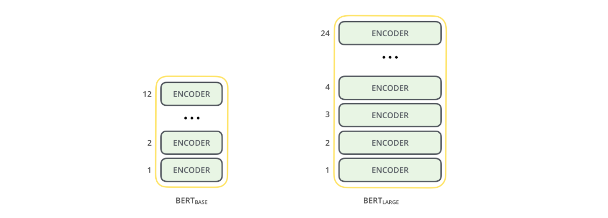

两个 BERT 的模型都有一个很大的 Encoder 层数(论文里面将此称为 Transformer Blocks)。基础版本就有 12 层，进阶版本有 24 层。
同时它也有很大的前馈神经网络：

* 768 和 1024 个隐藏层神经元
* 还有很多(12-16 个) Attention heads

这超过了 Transformer 中的参考配置参数：

* 6 个 Encoder
* 512 个隐藏层单元
* 8 个 Attention heads

### 模型输入

输入的第一个字符为 `[CLS]`，在这里字符 `[CLS]` 表达的意思很简单：`Classification(分类)`


BERT 与 Transformer 的编码方式一样。将固定长度的字符串作为输入，数据由下而上传递计算，
每一层都用到了 self-attention，并通过前馈神经网络传递其结果，将其交给下一个 Encoder

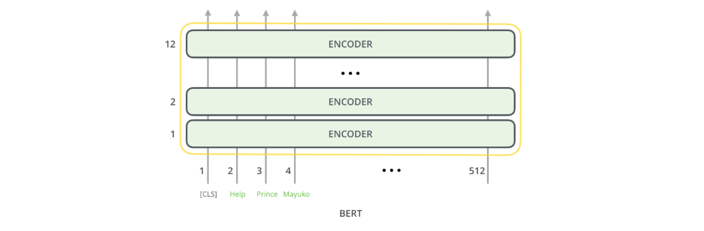

这样的架构，似乎是沿用了 Transformer 的架构(除了层数，不过这是可以设置的参数)。
那么 BERT 与 Transformer 不同之处在哪里呢？可能在模型的输出上

### 模型输出

每个位置返回的输出都是一个隐藏层大小的向量(基本版本 BERT 为 768)。以文本分类为例，
我们重点关注第一个位置上的输出(第一个位置是分类标识 `[CLS]`)。如下图


该向量现在可以用作为我们选择的分类器的输入，论文中说使用单层神经网络作为分类器就可以取得很好的效果。
原理如下：


例子中只有垃圾邮件和非垃圾邮件，如果要分类为更多的类别，只需要增加输出神经元的个数即可，另外把最后的激活函数换成 Softmax 即可

### BERT 和卷积网络

对于具有计算机视觉背景的人来说，这个矢量切换应该让人联想到 VGGNet 等网络的卷积部分与网络末端的完全连接的分类部分之间发生的事情。
你可以这样理解，实质上这样理解也很方便

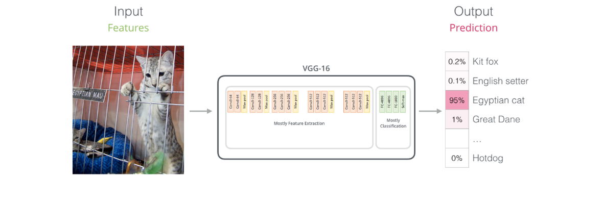

## Word Embedding

BERT 的开源随之而来的是一种词嵌入的更新。到目前为止，词嵌入已经成为 NLP 模型处理自然语言的主要组成部分。
诸如 word2vec 和 Glove 等方法已经广泛的用于处理这些问题，在我们使用新的词嵌入之前，我们有必要回顾一下其发展

### Word Embedding 回顾

为了让机器可以学习到文本的特征属性，我们需要一些将文本数值化的表示的方式。word2vec 算法通过使用一组固定维度的向量来表示单词，
计算其方式可以捕获到单词的语义及单词与单词之间的关系。使用 word2vec 的向量化表示方式可以用于判断单词是否相似、对立，
或者说判断 "男人" 与 "女人" 的关系就如同 "国王" 与 "王后"。另外还能捕获到一些语法的关系，这个在英语中很实用。
例如 "had" 与 "has" 的关系如同 "was" 与 "is" 的关系

这样的做法，我们可以使用大量的文本数据来预训练一个词嵌入模型，而这个词嵌入模型可以广泛用于其他 NLP 的任务，
这是个好主意，这使得一些初创公司或者计算资源不足的公司，也能通过下载已经开源的词嵌入模型来完成 NLP 的任务

下面是一个使用 GloVe Embedding 将词 "stick" 嵌入到一个长度为 200 的向量的例子：

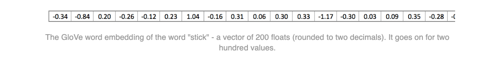

由于这些很大，而且充满了数字，所以下文以下下面的四个格子的形状来显示矢量：


上面介绍的词嵌入方式有一个很明显的问题，因为使用预训练好的 GloVe 词向量模型，那么无论上下文的语境关系如何，
每个单词("stick")都只有一个唯一的且已经固定保存的向量化形式。但是 "stick" 其实在不同的语境中有很多其他不同的意思。
那么为什么不能给出一个基于词的上下文的词嵌入去同时捕捉该词在当时上下文中的含义，以及其他上下文信息呢？

这和中文的同音字其实也类似，用这个举一个例子吧，"长" 这个字，在 "长度" 这个词中表示度量，
在 '长高' 这个词中表示增加。那么为什么我们不通过 "长" 周围是度或者是高来判断它的读音或者它的语义呢？
这个问题就派生出语境化的词嵌入模型(contextualized word-embeddings)

### ELMo

> 语境/上下文很重要

EMLo 改变 Word2vec 类的将单词固定为指定长度的向量的处理方式，它是在为每个单词分配词向量之前先查看整个句子，
然后使用 bi-directional LSTM 来训练它对应的词向量


ELMo 为解决 NLP 的语境问题作出了重要的贡献，它的 LSTM 可以使用与我们任务相关的大量文本数据来进行训练，
然后将训练好的模型用作其他 NLP 任务的词向量的基准

ELMo 的秘密是什么？

ELMo 会训练一个模型，这个模型接受一个句子或者单词的输入，输出最有可能出现在后面的一个单词。
输入法就是这样的道理。这个在 NLP 中也称作 Language Modeling。这样的模型很容易实现，
因为我们拥有大量的文本数据且我们可以在不需要标签的情况下去学习

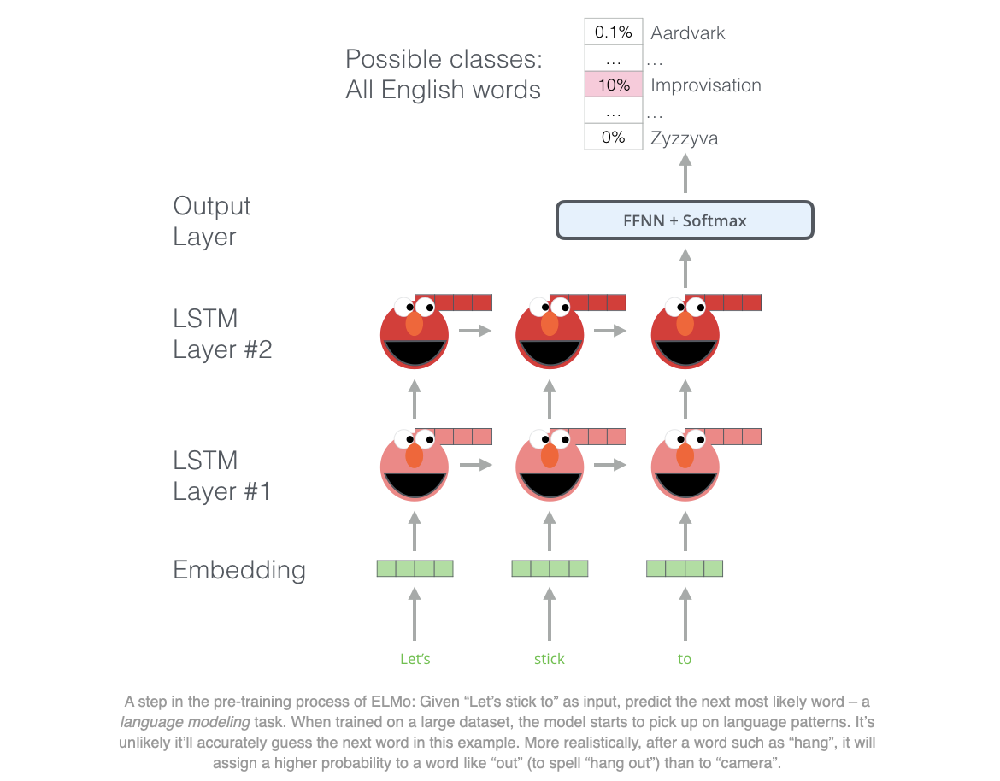

上图介绍了 ELMo 预训练的过程的步骤的一部分：我们需要完成一个这样的任务：输入 "Lets stick to"，
预测下一个最可能出现的单词，如果在训练阶段使用大量的数据集进行训练，
那么在预测阶段我们可能准确的预测出我们期待的下一个单词。比如输入 "机器"，
在 "学习" 和 "买菜" 中它最有可能的输出会是 "学习" 而不是 "买菜"。从上图可以发现，每个展开的 LSTM 都在最后一步完成预测。

真正的 ELMo 会更进一步，它不仅能判断下一个词，还能预测前一个词(Bi-directional-LSTM)：


ELMo 通过下图的方式将 hidden states(初始的嵌入)组合起来提炼出具有语境意义的词嵌入方式(全连接后加权求和)：

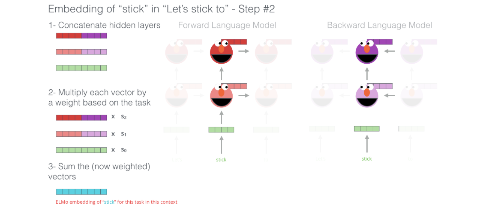

## ULM-FiT

> NLP 领域应用迁移学习

ULM-FiT 机制让模型的预训练参数得到更好的利用。所利用的参数不仅限于 embeddings，也不仅限于语境 embedding，
ULM-FiT 引入了 Language Model 和一个有效微调该 Language Model 来执行各种 NLP 任务的流程。
这使得 NLP 任务也能像计算机视觉一样方便的使用迁移学习

## Transformer

> 超越 LSTM 的结构

Transformer 论文和代码的发布，以及其在机器翻译等任务上取得的优异成果，让一些研究人员认为它是 LSTM 的替代品，
事实上却是 Transformer 比 LSTM 更好的处理 long-term dependancies(长程依赖)问题。
Transformer Encoding-Decoding 的结构非常适合机器翻译，但是怎么利用他来做文本分类的任务呢？
实际上你只用使用它来预训练可以针对其他任务微调的语言模型即可

## OpenAI Transformer

> 用于语言模型的 Transformer 解码器预训练

事实证明，我们并不需要一个完整的 Transformer 结构来使用迁移学习和一个很好的语言模型来处理 NLP 任务。
我们只需要 Transformer 的 Decoder 就行了。

> The decoder is a good choice because it’s a natural choice for 
> language modeling (predicting the next word) since it’s built to 
> mask future tokens – a valuable feature when it’s generating a translation word by word.


该模型堆叠了十二个 Decoder 层。 由于在该设置中没有 Encoder，
因此这些 Decoder 将不具有 Transformer Decoder 层具有的 Encoder-Decoder attention 层。
然而，取而代之的是一个 self attention 层(masked so it doesn’t peak at future tokens)

通过这种结构调整，我们可以继续在相似的语言模型任务上训练模型：使用大量的未标记数据集训练，
来预测下一个单词。举个列子：你那 7000 本书喂给你的模型(书籍是极好的训练样本，比博客和推文好很多)训练框架如下：

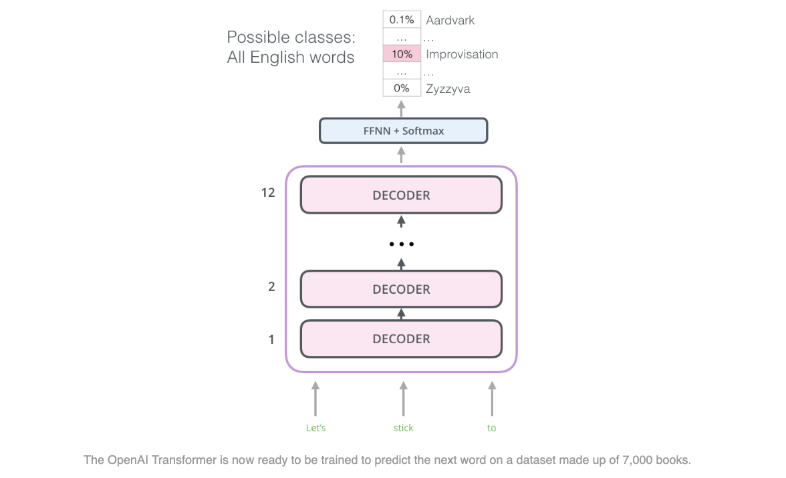

## Transfer Learning to Downstream Tasks

通过 OpenAI 的 Transformer 的预训练和一些微调后，就可以将训练好的模型用于其他下游 NLP 任务。
比如训练一个语言模型，然后拿他的 hidden state 来做分类。下面就介绍一下这种操作。
还是如上面例子：分为垃圾邮件和非垃圾邮件

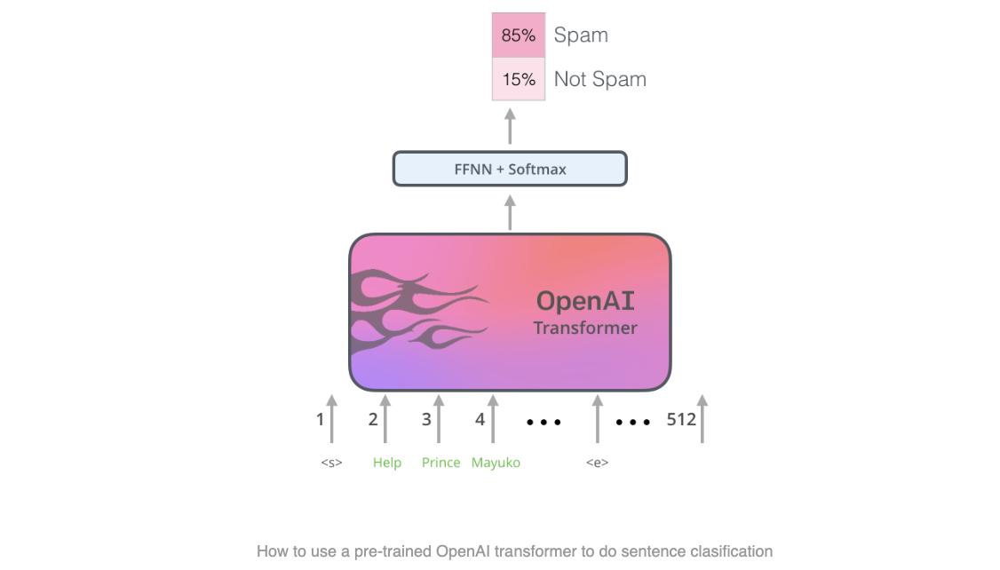

OpenAI 论文概述了许多 Transformer 使用迁移学习来处理不同类型 NLP 任务的例子。如下图例子所示：

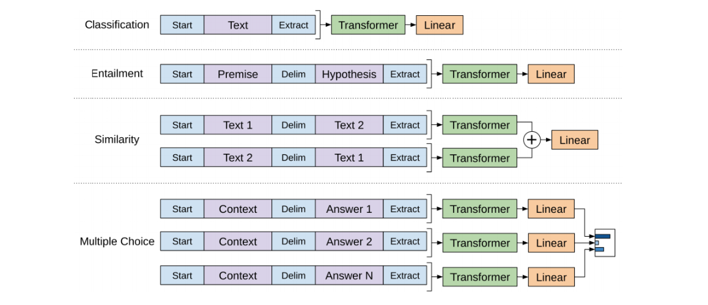

## BERT: From Decoders to Encoders

OpenAI Transformer 为我们提供了基于 Transformer 的精密的预训练模型。但是从 LSTM 到 Transformer 的过渡中，
我们发现少了些东西。ELMo 的语言模型是双向的，但是 OpenAI 的 Transformer 是前向训练的语言模型。
我们能否让我们的 Transformer 模型也具有 Bi-LSTM 的特性呢？可以的：R-BERT

### Masked Language Model

> 解释一下 mask：语言模型会根据前面单词来预测下一个单词，但是 self-attention 的注意力只会放在自己身上，
> 那么这样 100% 预测到自己，毫无意义，所以用 mask 把需要预测的词给挡住


### Two-sentence Tasks

我们回顾一下 OpenAI Transformer 处理不同任务的输入转换，你会发现在某些任务上我们需要两个句子作为输入，
并做一些更为智能的判断，比如是否相似，比如给出一个维基百科的内容作为输入，同时在放入一条针对该条目的问题，
那么我们的算法模型能够处理这个问题吗？

为了使 BERT 更好的处理两个句子之间的关系，预训练的过程还有一个额外的任务：给定两个句子(A 和 B)，A 与 B是否相似？(0 或者 1)

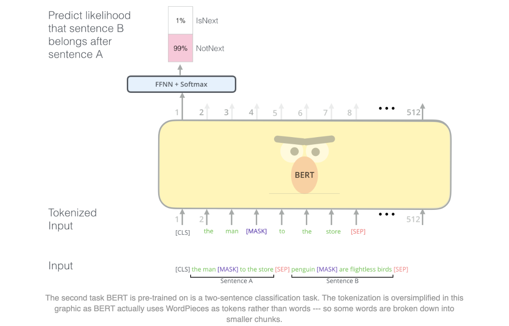

### 特殊的 NLP 任务

BERT 的论文为我们介绍了几种 BERT 可以处理的 NLP 任务：

* 短文本相似 
* 文本分类
* QA 机器人
* 语义标注

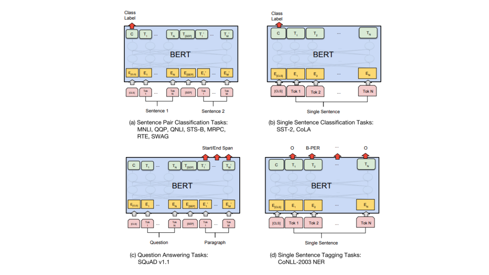

### BERT 用作特征提取

微调方法并不是使用 BERT 的唯一方法，就像 ELMo 一样，你可以使用预选训练好的 BERT 来创建语境化词嵌入。
然后你可以将这些嵌入提供给现有的模型


哪个向量最适合作为上下文嵌入？我认为这取决于任务。本文考察了六种选择(与微调模型相比，得分为96.4)：

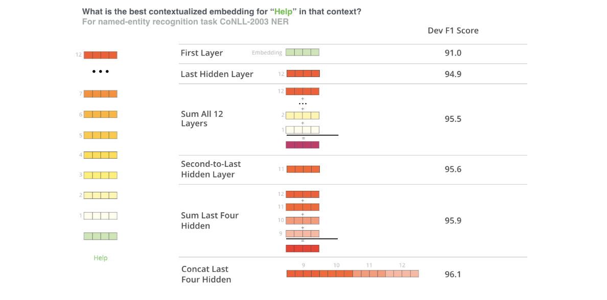

### 如何使用 BERT

使用 BERT 的最佳方式是通过 [BERT FineTuning with Cloud TPUs](https://colab.research.google.com/github/tensorflow/tpu/blob/master/tools/colab/bert_finetuning_with_cloud_tpus.ipynb) 谷歌云上托管的笔记。如果你未使用过谷歌云 TPU 可以试试看，这是个不错的尝试。
另外 BERT 也适用于 TPU、CPU 和 GPU

下一步是查看 [BERT GitHub 代码](https://github.com/google-research/bert)：

1. 该模型在 `modeling.py`(`class BertModel`)中构建，与 vanilla Transformer 编码器完全相同
2. `run_classifier.py` 是微调(fine-tuning)过程的一个示例。它还构建了监督模型的分类层。
   如果要构建自己的分类器，请查看该文件中的 `create_model()` 方法
3. 可以下载几种预先训练的模型。涵盖 102 种语言的多语言模型，这些语言都是在维基百科的数据基础上训练而成的。
4. BERT 不会将单词视为 tokens。相反，它注重 WordPieces。 [`tokenization.py`](https://github.com/google-research/bert/blob/master/tokenization.py) 是将你的单词转换为适合 BERT 的 wordPieces 的 tokensizer

还可以查看 [BERT 的 PyTorch 实现](https://github.com/huggingface/transformers)

[AllenNLP](https://github.com/allenai/allennlp) 库使用此实现[允许将 BERT 嵌入与任何模型一起使用](https://github.com/allenai/allennlp/pull/2067)

# BERT 预训练模型库

* 哈工大讯飞联合实验室
    - 基于 TensorFlow/PyTorch + Transformers
    - https://github.com/ymcui/Chinese-BERT-wwm
* CLUE 预训练模型
    - 基于 TensorFlow/PyTorch + Transformers
    - https://github.com/CLUEbenchmark/CLUEPretrainedModels
* 百度预训练模型 ERNIE/BERT
    - 基于 PaddlePaddle
    - https://www.paddlepaddle.org.cn/modelbasedetail/ERNIE
* 阿里云预训练模型 BERT 等
    - 基于 PAI-TensorFlow
    - https://www.yuque.com/easytransfer/cn/xfe19v
* 百度 ernie
    - PyTorch 实现
    - https://huggingface.co/nghuyong/ernie-1.0

# bert-serving-server 

> 搭建 BERT 词向量服务

## 简介

BERT 工具能够快速得到词向量表示, 叫做: bert-as-service, 只要调用该服务就能够得到想要的向量表示

## 安装

### 环境要求

* Python>=3.5
* TensorFlow>=1.10

### 安装服务端和客户端

```bash
$ $ pip install -i https://pypi.tuna.tsinghua.edu.cn/simple bert-serving-server bert-serving-client
```

## 启动 BERT 服务

### 下载预训练模型

* [GitHub 地址](https://github.com/google-research/bert/)
    - `BERT-Large, Uncased (Whole Word Masking)` 
        - 24-layer, 1024-hidden, 16-heads, 340M parameters
    - `BERT-Large, Cased (Whole Word Masking)`
        - 24-layer, 1024-hidden, 16-heads, 340M parameters
    - `BERT-Base, Uncased`
        - 12-layer, 768-hidden, 12-heads, 110M parameters
    - `BERT-Large, Uncased`
        - 24-layer, 1024-hidden, 16-heads, 340M parameters
    - `BERT-Base, Cased`
        - 12-layer, 768-hidden, 12-heads , 110M parameters
    - `BERT-Large, Cased`
        - 24-layer, 1024-hidden, 16-heads, 340M parameters
    - `BERT-Base, Multilingual Cased (New, recommended)`
        - 104 languages, 12-layer, 768-hidden, 12-heads, 110M parameters
    - `BERT-Base, Multilingual Uncased (Orig, not recommended)`
        - (Not recommended, use Multilingual Casedinstead)
        - 102 languages, 12-layer, 768-hidden, 12-heads, 110M parameters
    - `BERT-Base, Chinese`: Chinese Simplified and Traditional
        - 12-layer, 768-hidden, 12-heads, 110M parameters
* 下载 `BERT-Base, Chinese`, 放在项目根目录下

### 启动服务

解压缩后, 运行如下命令进行启动, 目录换成解压后的路径

```bash
$ bert-serving-start -model_dir /path/to/model -num_worker=4
$ bert-serving-start -model_dir /Users/zfwang/project/machinelearning/deeplearning/datasets/NLP_data/chinese_L-12_H-768_A-12 -num_worker=4
```

其中：

* `-num_worker`: 指定使用多少个 CPU

### 调用 BERT 进行应用

```python
from bert_serving.client import BertClient
bc = BertClient(
    ip = "localhost", 
    check_version = False, 
    check_length = False
)
vec = bc.encode(["学习"])
print(vec)
```

# 参考

* [Illustrated BERT](https://jalammar.github.io/illustrated-bert/)
* [万字长文带你纵览 BERT 家族](https://mp.weixin.qq.com/s/ejWRhjYDFSNkAVMyMzwpOQ)
* [Bert 系列之模型参数计算](https://mp.weixin.qq.com/s/D7T0Pdqr01viicJfAWdIMQ)
* [BERT 代码从零解读](https://mp.weixin.qq.com/s/vUcryYyedxlbe0WhAOZhIA)
* [BERT 预训练模型系列总结](https://mp.weixin.qq.com/s/HHVMYv66nJ_vHZgit81gdQ)
* [BERT meet Knowledge Graph：预训练模型与知识图谱相结合的研究进展](https://mp.weixin.qq.com/s?__biz=MzI3MTA0MTk1MA==&mid=2652088025&idx=4&sn=909d52eada0f70bf4826bb218d3291ad&chksm=f120d228c6575b3e1e4c28dfbba41cac4e3db300efe546e05977b7b90742d00f4afe963c0ae6&mpshare=1&scene=1&srcid=12010etKB71ivFrNo8lrZknY&sharer_sharetime=1606810826557&sharer_shareid=d02c7b7d24f901d5f03e661b5ee5c1e5&version=3.0.36.6180&platform=mac#rd)
* [BERT 的分词预处理、输入 Embedding、中间编码与输出向量解析](https://mp.weixin.qq.com/s/LglV7qE5vP9hmDL2azvnfg)
* [BERT 详解](https://zhuanlan.zhihu.com/p/103226488)
* [Bert Github](https://github.com/google-research/bert/)
* [bert-as-service](https://bert-as-service.readthedocs.io/en/latest/#)
* [bert-serving-server搭建bert词向量服务](https://www.jianshu.com/p/61323d366f7c)
* [Google BERT模型原理详解](https://zhuanlan.zhihu.com/p/46652512)
* [预训练模型与知识图谱相结合的研究进展](https://mp.weixin.qq.com/s?__biz=MzI3MTA0MTk1MA==&mid=2652088025&idx=4&sn=909d52eada0f70bf4826bb218d3291ad&chksm=f120d228c6575b3e1e4c28dfbba41cac4e3db300efe546e05977b7b90742d00f4afe963c0ae6&mpshare=1&scene=1&srcid=12010etKB71ivFrNo8lrZknY&sharer_sharetime=1606810826557&sharer_shareid=d02c7b7d24f901d5f03e661b5ee5c1e5&version=3.0.36.6180&platform=mac#rd)
* [BERT fine-tune 终极实践教程](https://www.jianshu.com/p/aa2eff7ec5c1)
* [Tensorflow版BERT中文模型踩坑总结](https://zhuanlan.zhihu.com/p/51762599)
