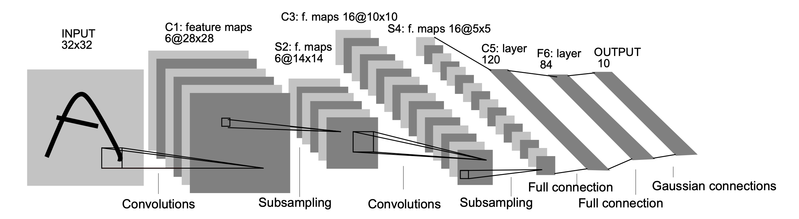

<style>
details {
    border: 1px solid #aaa;
    border-radius: 4px;
    padding: .5em .5em 0;
}
summary {
    font-weight: bold;
    margin: -.5em -.5em 0;
    padding: .5em;
}
details[open] {
    padding: .5em;
}
details[open] summary {
    border-bottom: 1px solid #aaa;
    margin-bottom: .5em;
}
</style>

<details><summary>目录</summary><p>

- [LeNet-5 架构](#lenet-5-架构)
- [LeNet-5 Code](#lenet-5-code)
  - [PyTorch](#pytorch)
- [参考](#参考)
</p></details><p></p>

# LeNet-5 架构


<!--  -->


As the name indicates, LeNet5 has 5 layers with two convolutional and three fully connected layers. Let's start with the input. LeNet5 accepts as input a greyscale image of 32x32, indicating that the architecture is not suitable for RGB images (multiple channels). So the input image should contain just one channel. After this, we start with our convolutional layers

The first convolutional layer has a filter size of  5x5 with 6 such filters. This will reduce the width and height of the image while increasing the depth (number of channels). The output would be 28x28x6. After this, pooling is applied to decrease the feature map by half, i.e, 14x14x6. Same filter size (5x5) with 16 filters is now applied to the output followed by a pooling layer. This reduces the output feature map to 5x5x16.

After this, a convolutional layer of size 5x5 with 120 filters is applied to flatten the feature map to 120 values. Then comes the first fully connected layer, with 84 neurons. Finally, we have the output layer which has 10 output neurons, since the MNIST data have 10 classes for each of the represented 10 numerical digits.

# LeNet-5 Code

## PyTorch

```python
import torch
import torch.nn as nn
import torch.nn.functional as F


class LeNet_5(nn.Module):

    def __init___(self):
        super(LeNet_5, self).__init__()
        # 6@5x5 conv
        self.conv1 = nn.Conv2d(1, 6, 5)  # 6@28x28
        # 16@5x5
        self.conv2 = nn.Conv2d(6, 16, 5)  # 6@14x14
        # 16@5x5
        # 120@5x5 affine: y = Wx + b
        self.fc1 = nn.Linear(16 * 5 * 5, 120)  # 120
        self.fc2 = nn.Linear(120, 84)  # 84
        self.fc3 = nn.Linear(84, 10) # 10
    
    def forward(self, x):
        """
        shape of x: 1x32x32
        """
        # 2x2 max pooling
        x = F.max_pool2d(F.relu(self.conv1(x)), (2, 2))
        x = F.max_pool2d(F.relu(self.conv2(x)), 2)
        x = torch.flatten(x, 1)
        x = F.relu(self.fc1(x))
        x = F.relu(self.fc2(x))
        x = self.fc3(x)
        return x

net = LeNet_5()
print(net)
```


# 参考

* [Gradient-Based Learning Applied to Document Recognition](http://yann.lecun.com/exdb/publis/pdf/lecun-01a.pdf)
