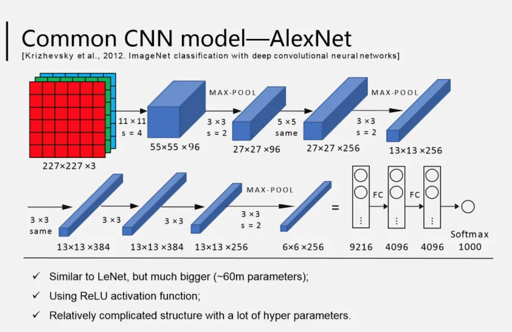

# AlexNet 架构

AlexNet 是一个深度卷积网络，由 Alex Krizhevsky 等在 2012 年提出。被用在 ImageNet LSVRC-2010 比赛进行图像分类，
并获得较好的效果

# 参考

* [ImageNet Classification with Deep Convolutional Neural Networks](https://proceedings.neurips.cc/paper/2012/file/c399862d3b9d6b76c8436e924a68c45b-Paper.pdf?ref=blog.paperspace.com)