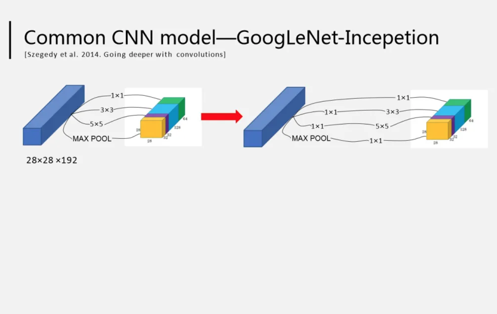

# GoogLeNet 简介

GoogLeNet(Going Deeper with Convolutions，2014) 在借鉴此前 1x1 卷积思想的基础上，
通过滤波器组合构建 Inception 模块，使得网络可以走向更深且表达能力更强。
从 2014 年获得当届 ILSVRC 
冠军的 Inception v1 到现在，光 Inception 网络就已经更新到 v4 了，而后基于 Inception
模块和其他网络结构的组合而成的网络就更多了，比如说 Inception Resnet

通常在构建卷积结构时，需要考虑是使用 1x1 卷积、3x3 卷积还是 5x5 卷积及其是否需要添加池化操作。
而 GoogLeNet 的 Inception 模块就是帮你决定采用什么样的卷积结构。简单而言，Inception 模块就是分别采用了 1x1 卷积、
3x3 卷积和 5x5 卷积构建了一个卷积组合，然后输出也是一个卷积组合后的输出。如下图所示:

对于 28x28x192 的像素输入，分别采用 1x1 卷积、3x3 卷积和 5x5 卷积以及最大池化四个滤波器对输入进行操作，
将对应的输出进行堆积，即 32+32+128+64=256，最后的输出大小为 28x28x256

所以，Inception 网络的基本思想就是不需要人为的去决定使用哪个卷积结构或者池化，而是由网络自己决定这些参数，决定有哪些滤波器组合。
构建好 Inception 模块后，将多个类似结构的 Inception 模块组合起来便是一个 Inception 网络

# GoogLeNet 网络结构 

# 参考

