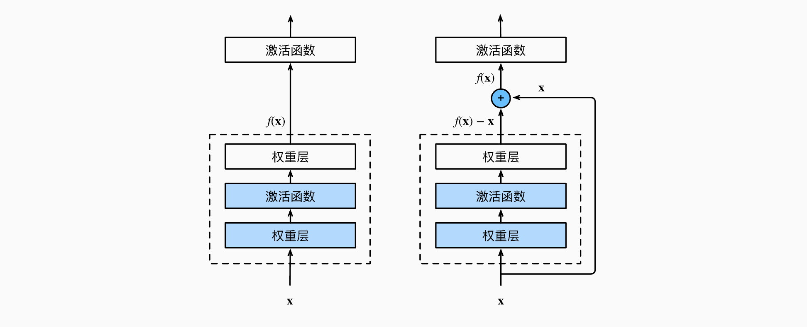
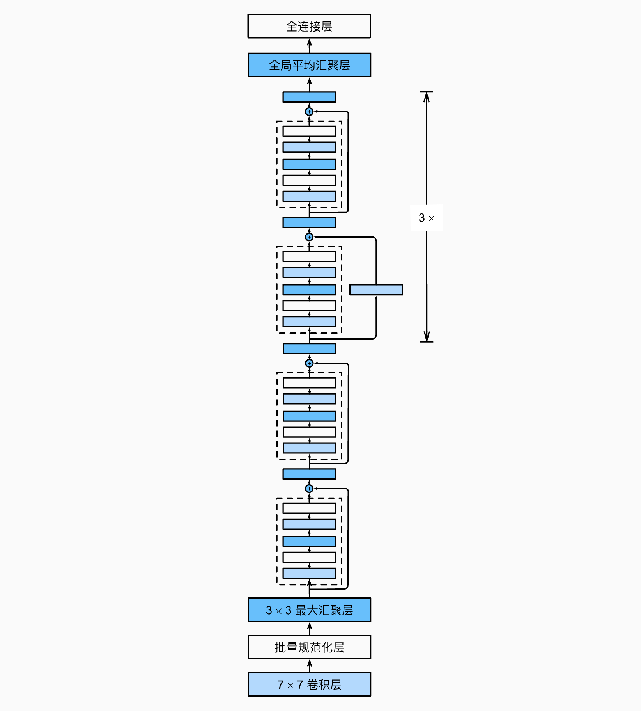

目录

- [ResNet 简介](#resnet-简介)
  - [梯度消失和爆炸](#梯度消失和爆炸)
  - [ResNet 提出](#resnet-提出)
- [ResNet 网络结构](#resnet-网络结构)
  - [ResNet 残差块](#resnet-残差块)
  - [ResNet 完整结构](#resnet-完整结构)
  - [ResNet 的有效性](#resnet-的有效性)
- [参考](#参考)

# ResNet 简介

## 梯度消失和爆炸

深度卷积网络一开始面临的最主要的问题是梯度消失和梯度爆炸。那什么是梯度消失和梯度爆炸呢？所谓梯度消失，
就是在深层神经网络的训练过程中，计算得到的梯度越来越小，使得权值得不到更新的情形，这样算法也就失效了。
而梯度爆炸则是相反的情况，是指在神经网络训练过程中梯度变得越来越大，权值得到疯狂更新的情形，
这样算法得不到收敛，模型也就失效了

当然，其间通过设置 ReLU 和归一化激活函数层等手段使得很好的解决这些问题。但当将网络层数加到更深时却发现训练的准确率在逐渐降低。
这种并不是由过拟合造成的神经网络训练数据识别准确率降低的现象称之为退化(degradation) 

## ResNet 提出

随着我们设计越来越深的网络，深刻理解“新添加的层如何提升神经网络的性能”变得至关重要。
更重要的是设计网络的能力，在这种网络中，添加层会使网络更具表现力

何恺明等人提出了残差网络 ResNet， 它在 2015 年的 ImageNet 图像识别挑战赛夺魁，并深刻影响了后来的深度神经网络的设计。
残差网络的核心思想是：每个附加层都应该更容易地包含原始函数作为其元素之一。 于是，残差块（residual blocks）便诞生了，
这个设计对如何建立深层神经网络产生了深远的影响。要理解残差网络，就必须理解残差块(residual block) 这个结构，
因为残差块是残差网络的基本组成部分

回忆一下我们之前学到的各种卷积网络结构(LeNet-5、AlexNet、VGG)，通常结构就是卷积池化再卷积池化，
中间的卷积池化操作可以很多层。类似这样的网络结构何恺明在论文中将其称为普通网络(Plain Network)，
何凯明认为普通网络解决不了退化问题，我们需要在网络结构上作出创新

何恺明给出的创新在于给网络之间添加一个捷径(shortcuts)或者也叫跳跃连接(skip connection)，
可以让捷径之间的网络能够学习一个恒等函数，使得在加深网络的情形下训练效果至少不会变差

# ResNet 网络结构

## ResNet 残差块

让我们聚焦于神经网络局部：如下图所示，假设我们的原始输入为 `$x$`，而希望学出的理想映射为 `$f(x)$`（作为图上方激活函数的输入）。
下图左图虚线框中的部分需要直接拟合出该映射 `$f(x)$`，而右图虚线框中的部分则需要拟合出残差映射 `$f(x) - x$`。
残差映射在现实中往往更容易优化。 以恒等映射作为我们希望学出的理想映射 `$f(x)$`，只需将右图虚线框内上方的加权运算（如仿射）的权重和偏置参数设成 0，
那么 `$f(x)$` 即为恒等映射。 实际中，当理想映射 `$f(x)$` 极接近于恒等映射时，残差映射也易于捕捉恒等映射的细微波动。 
右图是 ResNet 的基础架构–残差块(residual block)。 在残差块中，输入可通过跨层数据线路更快地向前传播

ResNet 沿用了 VGG 完整的 `$3 \times 3$` 卷积层设计。 残差块里首先有 2 个有相同输出通道数的 `$3 \times 3$` 卷积层。 
每个卷积层后接一个批量规范化层和ReLU激活函数。 然后我们通过跨层数据通路，跳过这 2 个卷积运算，将输入直接加在最后的 ReLU 激活函数前。
这样的设计要求 2 个卷积层的输出与输入形状一样，从而使它们可以相加。 如果想改变通道数，
就需要引入一个额外的 `$1 \times 1$` 卷积层来将输入变换成需要的形状后再做相加运算

## ResNet 完整结构

当很多个具备类似结构的这样的残差块组建到一起时，残差网络就顺利形成了。残差网络能够顺利训练很深层的卷积网络，
其中能够很好的解决网络的退化问题。ResNet 的网络结构如下：

## ResNet 的有效性

或许你可能会问凭什么加了一条从输入到输出的捷径网络就能防止退化训练更深层的卷积网络？或是说残差网络为什么能有效？
将上述残差块的两层输入输出符号改为和，相应的就有:

`$$a^{[l+2]} = g(z^{[l+2]} + a^{[l]})$$`

加入的跳跃连接后就有:

`$$a^{[l+2]} = g(W^{[l+2]}a^{[l+1]} + b^{[l+2]} + a^{[l]})$$`

在网络中加入 L2 正则化进行权值衰减或者其他情形下，l+2 层的权值 W 是很容易衰减为零的，假设偏置同样为零的情形下就有 =。
深度学习的试验表明学习这个恒等式并不困难，这就意味着，在拥有跳跃连接的普通网络即使多加几层，其效果也并不逊色于加深之前的网络效果。
当然，我们的目标不是保持网络不退化，而是需要提升网络表现，当隐藏层能够学到一些有用的信息时，残差网络的效果就会提升。
所以，残差网络之所以有效是在于它能够很好的学习上述那个恒等式，而普通网络学习恒等式都很困难，残差网络在两者相较中自然胜出

# 参考

* [Deep Residual Learning for Image Recognition](https://arxiv.org/pdf/1512.03385.pdf?ref=blog.paperspace.com)
