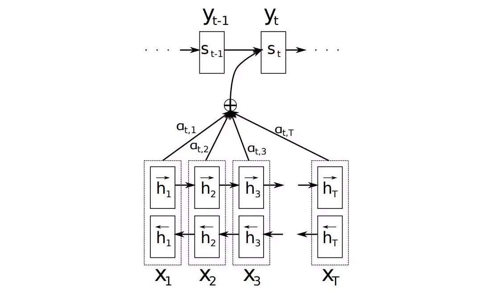

目录

- [为什么需要 Attention](#为什么需要-attention)
- [Attention 机制](#attention-机制)
  - [Attention 机制原理](#attention-机制原理)
    - [Attention 主要需要解决的问题](#attention-主要需要解决的问题)
    - [Attention 机制原理](#attention-机制原理-1)
- [Attention 类型](#attention-类型)
  - [Soft-Attention 和 Hard-Attention](#soft-attention-和-hard-attention)
  - [Global-Attention](#global-attention)
  - [Local-Attention](#local-attention)
  - [Self-Attention](#self-attention)
- [Attention 带来的算法改进](#attention-带来的算法改进)
- [参考](#参考)

# 为什么需要 Attention

让我们从循环神经网络的老大难问题——机器翻译问题入手。我们知道，普通的用目标语言中的词语来代替原文中的对应词语是行不通的，
因为从语言到另一种语言时词语的语序会发生变化。比如英语的 “red” 对应法语的 “rouge”，英语的 “dress” 对应法语 “robe”，
但是英语的 “red dress” 对应法语的 “robe rouge”

为了解决这个问题，创造了 Encoder-Decoder 结构的循环神经网络。它先通过一个 Encoder 循环神经网络读入所有的待翻译句子中的单词，
得到一个包含原文所有信息的中间隐藏层，接着把中间隐藏层状态输入 Decoder 网络，一个词一个词的输出翻译句子。
这样子无论输入中的关键词语有着怎样的先后次序，由于都被打包到中间层一起输入后方网络，
Encoder-Decoder 网络都可以很好地处理这些词的输出位置和形式了

但是问题在于，中间状态由于来自于输入网络最后的隐藏层，一般来说它是一个大小固定的向量。
既然是大小固定的向量，那么它能储存的信息就是有限的，当句子长度不断变长，
由于后方的 Decoder 网络的所有信息都来自中间状态，中间状态需要表达的信息就越来越多。
如果句子的信息是在太多，Decoder 网络就有点把握不住了

比如现在你可以尝试把下面这句话一次性记住并且翻译成中文：

> It was the best of times, it was the worst of times, it was the age of wisdom, 
> it was the age of foolishness, it was the epoch of belief, it was the epoch of incredulity, 
> it was the season of Light, it was the season of Darkness, it was the spring of hope, 
> it was the winter of despair, we had everything before us, we had nothing before us, 
> we were all going direct to Heaven, we were all going direct the other way — in short, 
> the period was so far like the present period, that some of its noisiest authorities insisted on its being received, 
> for good or for evil, in the superlative degree of comparison only. -- A Tale of Two Cities, Charles Dickens.

别说翻译了，对于人类而言，光是记住这个句子就有着不小的难度。如果不能一边翻译一边回头看，我们想要翻译出这个句子是相当不容易的。
Encoder-Decoder 网络就像我们的短时记忆一样，存在着容量的上限，在语句信息量过大时，中间状态就作为一个信息的瓶颈阻碍翻译了

可惜我们不能感受到 Encoder-Decoder 网络在翻译这个句子时的无奈。
但是我们可以从人类这种翻译不同句子时集中注意力在不同的语句段的翻译方式中受到启发，
得到循环神经网络中的 Attention 机制

# Attention 机制

Attention 是一种用于提升基于 RNN(LSTM 或 GRU) 的 Encoder-Decoder 模型的效果的的机制(Mechanism)，
一般称为 Attention Mechanism。Attention Mechanism 目前非常流行，
广泛应用于机器翻译、语音识别、图像标注(Image Caption)等很多领域，之所以它这么受欢迎，
是因为 Attention 给模型赋予了区分辨别的能力，例如，在机器翻译、语音识别应用中，为句子中的每个词赋予不同的权重，
使神经网络模型的学习变得更加灵活(soft)，同时 Attention 本身可以做为一种对齐关系，
解释翻译输入/输出句子之间的对齐关系，解释模型到底学到了什么知识，为我们打开深度学习的黑箱，提供了一个窗口

Attention Mechanism 与人类对外界事物的观察机制很类似，当人类观察外界事物的时候，一般不会把事物当成一个整体去看，
往往倾向于根据需要选择性的去获取被观察事物的某些重要部分，比如我们看到一个人时，往往先 Attention 到这个人的脸，
然后再把不同区域的信息组合起来，形成一个对被观察事物的整体印象。
因此，Attention Mechanism 可以帮助模型对输入的 `$X$` 每个部分赋予不同的权重，
抽取出更加关键及重要的信息，使模型做出更加准确的判断，同时不会对模型的计算和存储带来更大的开销，
这也是 Attention Mechanism 应用如此广泛的原因

## Attention 机制原理

### Attention 主要需要解决的问题

《Sequence to Sequence Learning with Neural Networks》介绍了一种基于 RNN(LSTM) 的 Seq2Seq 模型，
基于一个 Encoder 和一个 Decoder 来构建基于神经网络的 End-to-End 的机器翻译模型，
其中，Encoder 把输入 `$X$` 编码成一个固定长度的隐向量 `$Z$`，Decoder 基于隐向量 `$Z$` 解码出目标输出 `$Y$`。
这是一个非常经典的序列到序列的模型，但是却存在两个明显的问题：

1. 把输入 `$X$` 的所有信息有压缩到一个固定长度的隐向量 `$Z$`，忽略了输入输入 `$X$` 的长度，当输入句子长度很长，
   特别是比训练集中最初的句子长度还长时，模型的性能急剧下降
2. 把输入 `$X$` 编码成一个固定的长度，对于句子中每个词都赋予相同的权重，这样做是不合理的，
   比如，在机器翻译里，输入的句子与输出句子之间，往往是输入一个或几个词对应于输出的一个或几个词。
   因此，对输入的每个词赋予相同权重，这样做没有区分度，往往是模型性能下降

同样的问题也存在于图像识别领域，卷积神经网络 CNN 对输入的图像每个区域做相同的处理，这样做没有区分度，
特别是当处理的图像尺寸非常大时，问题更明显。因此，2015 年，
Dzmitry Bahdanau 等人在《Neural machine translation by jointly learning to align and translate》提出了 Attention Mechanism，
用于对输入 `$X$` 的不同部分赋予不同的权重，进而实现软区分的目的

### Attention 机制原理

要介绍 Attention Mechanism 结构和原理，首先需要介绍下 Seq2Seq 模型的结构。
基于 RNN 的 Seq2Seq 模型主要由两篇论文介绍，只是采用了不同的 RNN 模型。
Ilya Sutskever 等人与 2014 年在论文《Sequence to Sequence Learning with Neural Networks》中使用 LSTM 来搭建 Seq2Seq 模型。
随后，2015年，Kyunghyun Cho 等人在论文《Learning Phrase Representations using RNN Encoder–Decoder for Statistical Machine Translation》提出了基于 GRU 的 Seq2Seq 模型。两篇文章所提出的 Seq2Seq 模型，想要解决的主要问题是，如何把机器翻译中，
变长的输入 `$X$` 映射到一个变长输出 `$Y$` 的问题。其主要结构如下图所示：

其中，Encoder 把一个变长的输入序列 `$x_{1}, x_{2}, \ldots x_{t}$` 编码成一个固定长度隐向量(背景向量，或上下文向量 context) `$c$`，
`$c$` 有两个作用：

1. 作为初始向量初始化 Decoder 的模型，作为 Decoder 模型预测 `$y_{1}$` 的初始向量
2. 作为背景向量，指导 `$y$` 序列中每一个 step(`$1, 2, \ldots, T'$`) 的 `$y$` 的产出

Decoder 主要基于背景向量 `$c$` 和上一步的输出 `$y_{t-1}$` 解码得到该时刻 `$t$` 的输出 `$y_{t}$`，
直到碰到结束标志(`<EOS>`)为止

如上文所述，传统的 Seq2Seq 模型对输入序列 `$X$` 缺乏区分度，因此，2015年，
Kyunghyun Cho 等人在论文《Learning Phrase Representations using RNN Encoder–Decoder for Statistical Machine Translation》中，
引入了 Attention Mechanism 来解决这个问题，他们提出的模型结构如下图所示：

在该模型中，定义了一个条件概率：

`$$P(y_{i}|y_{1}, \ldots, y_{i-1}, x) = g(y_{i-1}, s_{i}, c_{i})$$`

其中：

* `$s_{i}$` 是 Decoder 中 RNN 在 `$i$` 时刻的隐状态，其计算公式为：

    `$$s_{i} = f(s_{i-1}, y_{i-1}, c_{i})$$`

* 背景向量 `$c_{i}$` 的计算方式，与传统的 Seq2Seq 模型直接累加的计算方式不一样，
  这里的 `$c_{i}$` 是一个权重化(Weighted)之后的值，其表达式如下：

    `$$c_{i} = \sum_{j=1}^{T_{x}}\alpha_{ij}h_{j}$$`

    - 其中：
        - `$i$` 表示 Encoder 端的第 `$i$` 个词
        - `$h_{j}$` 表示 Encoder 端的第 `$j$` 个词的隐向量
        - `$\alpha_{ij}$` 表示 Encoder 端的第 `$j$` 个词与 Decoder 端的第 `$i$` 个词之间的权值，
          表示源端第 `$j$` 个词对目标端第 `$i$` 个词的影响程度，`$\alpha_{ij}$` 的计算公式如下

            `$$\alpha_{ij}=\frac{exp(e_{ij})}{\sum_{k=1}^{T_{x}}exp(e_{ik})}$$`
            `$$e_{ij}=a(s_{i-1}, h_{j})$$`

`$\alpha_{ij}$` 是一个 Softmax 模型输出，概率值的和为 1。`$e_{ij}$` 表示一个对齐模型，
用于衡量 Encoder 端的位置 `$j$` 个词，对于 Decoder 端的位置 `$i$` 个词的对齐程度(影响程度)，
换句话说：Decoder 端生成位置 `$i$` 的词时，有多少程度受 Encoder 端的位置 `$j$` 的词影响。
对齐模型 `$e_{ij}$` 的计算方式有很多种，不同的计算方式，代表不同的 Attention 模型，
最简单且最常用的的对齐模型是 dot product 乘积矩阵，即把 target 端的输出隐状态 `$h_{t}$` 与 source 端的输出隐状态进行矩阵乘。
常见的对齐计算方式如下：

`$$$$`

# Attention 类型

* Soft-Attention
* Hard-Attention
* Global-Attention
* Local-Attention
* Self-Attention

## Soft-Attention 和 Hard-Attention

Kelvin Xu 等人与 2015 年发表论文《Show, Attend and Tell: Neural Image Caption Generation with Visual Attention》，
在 Image Caption 中引入了 Attention，当生成第 `$i$` 个关于图片内容描述的词时，用 Attention 来关联与 `$i$` 个词相关的图片的区域。
Kelvin Xu 等人在论文中使用了两种 Attention Mechanism，即 Soft Attention 和 Hard Attention。
我们之前所描述的传统的 Attention Mechanism 就是 Soft Attention。Soft Attention 是参数化的(Parameterization)，
因此可导，可以被嵌入到模型中去，直接训练。梯度可以经过 Attention Mechanism 模块，反向传播到模型其他部分

相反，Hard Attention 是一个随机的过程。Hard Attention 不会选择整个 Encoder 的输出做为其输入，
Hard Attention 会依概率 `$S_{i}$` 来采样输入端的隐状态一部分来进行计算，而不是整个 Encoder 的隐状态。
为了实现梯度的反向传播，需要采用蒙特卡洛采样的方法来估计模块的梯度

两种 Attention Mechanism 都有各自的优势，但目前更多的研究和应用还是更倾向于使用 Soft Attention，
因为其可以直接求导，进行梯度反向传播

## Global-Attention

## Local-Attention

## Self-Attention

# Attention 带来的算法改进

Attention 机制为机器翻译任务带来了曙光，具体来说，它能够给机器翻译任务带来以下的好处：

* Attention 显著地提高了翻译算法的表现。它可以很好地使 Decoder 网络注意原文中的某些重要区域来得到更好的翻译
* Attention 解决了信息瓶颈问题。原先的 Encoder-Decoder 网络的中间状态只能存储有限的文本信息，
  在它已经从繁重的记忆任务中解放出来了，它只需要完成如何分配注意力的任务即可
* Attention 减轻了梯度消失问题。Attention 在网络后方到前方建立了连接的捷径，使得梯度可以更好的传递
* Attention提供了一些可解释性。通过观察网络运行过程中产生的注意力的分布，我们可以知道网络在输出某句话时都把注意力集中在哪里；
  而且通过训练网络，我们还得到了一个免费的翻译词典(soft alignment)！还是如下图所示，尽管我们未曾明确地告诉网络两种语言之间的词汇对应关系，
  但是显然网络依然学习到了一个大体上是正确的词汇对应表

Attention 代表了一种更为广泛的运算。我们之前学习的是 Attention 机制在机器翻译问题上的应用，但是实际上Attention还可以使用于更多任务中。
我们可以这样描述 Attention 机制的广义定义：

给定一组向量 Value 和一个查询 Query，Attention 是一种分配技术，它可以根据 Query 的需求和内容计算出 Value 的加权和。
Attention，在这种意义下可以被认为是大量信息的选择性总结归纳，或者说是在给定一些表示（query）的情况下，
用一个固定大小的表示（）来表示任意许多其他表示集合的方法（Key）

# 参考

* [图解 Attention](https://zhuanlan.zhihu.com/p/265182368)
* [Visualizing A Neural Machine Translation Model (Mechanics of Seq2seq Models With Attention)](https://jalammar.github.io/visualizing-neural-machine-translation-mechanics-of-seq2seq-models-with-attention/)
* [Attention Is All You Need](https://arxiv.org/pdf/1706.03762.pdf) 
