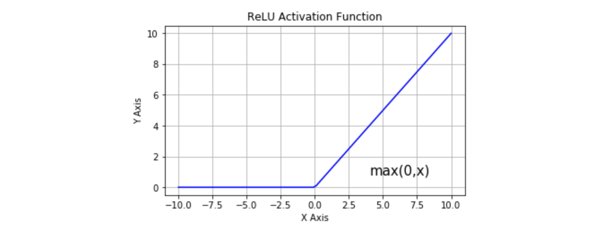
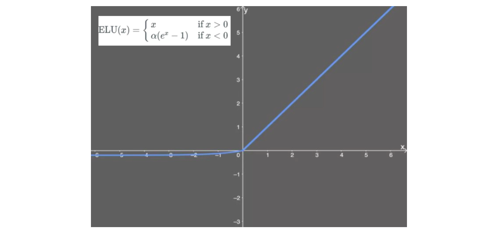

目录

- [机器学习与深度学习](#机器学习与深度学习)
- [神经元](#神经元)
  - [现代神经元与 MP 神经元](#现代神经元与-mp-神经元)
  - [激活函数](#激活函数)
    - [Sigmoid](#sigmoid)
      - [Logistic 函数](#logistic-函数)
      - [Tanh 函数](#tanh-函数)
      - [Hard-Logistic 函数和 Hard-Tanh 函数](#hard-logistic-函数和-hard-tanh-函数)
    - [ReLU](#relu)
      - [Leaky ReLU](#leaky-relu)
      - [ELU](#elu)
      - [SELU](#selu)
    - [Softmax](#softmax)
    - [swish](#swish)
    - [GELU](#gelu)
- [网络结构](#网络结构)
  - [前馈网络](#前馈网络)
    - [深度前馈网络概念](#深度前馈网络概念)
    - [线性模型的局限性及克服](#线性模型的局限性及克服)
  - [记忆网络](#记忆网络)
  - [图网络](#图网络)
- [输出层的设计](#输出层的设计)
  - [输出层激活函数](#输出层激活函数)
    - [恒等函数](#恒等函数)
    - [Softmax 函数](#softmax-函数)
  - [输出层的神经元数量](#输出层的神经元数量)
- [参考](#参考)

# 机器学习与深度学习

**机器学习** 就是从历史数据中探索和训练出数据的普遍规律, 
将其归纳为相应的数学模型, 并对未知的数据进行预测的过程; 
在这个过程中会碰到各种各样的问题, 
比如如下等一系列关乎机器学习模型生死的问题:

* 数据质量
* 模型评价标准
* 训练优化方法
* 过拟合

在机器学习中, 有很多已经相当成熟的模型, 在这些机器学习模型中, 
**人工神经网络** 就是一种比较厉害的模型; 
人工神经网络从早期的感知机发展而来, 对任何函数都有较好的拟合性.

但自上个世纪 90 年代一直到 2012 年深度学习集中爆发前夕, 
神经网络受制于计算资源的限制和较差的可解释性, 一直处于发展的低谷阶段. 
之后大数据兴起,计算资源也迅速跟上, 
加之 2012 年 ImageNet 竞赛冠军采用的 AlexNet 卷积神经网络一举将图片预测的 top5 错误率降至 16.4%, 
震惊了当时的学界和业界. 从此之后, 原本处于研究边缘状态的神经网络又迅速热了起来, 
深度学习也逐渐占据了计算机视觉的主导地位.

以神经网络为核心的深度学习理论是机器学习的一个领域分支, 
所以深度学习其本质上也必须遵循一些机器学习的基本要以和法则.

从机器学习的角度来开，神经网络一般可以看作一个非线性模型，
其基本组成单元为具有非线性激活函数的神经元，通过大量神经元之间的连接，
使得神经网络成为一种高度非线性的模型。神经元之间的连接权重就是需要学习的参数，
可以在机器学习的框架下通过梯度下降方法来进行学习.

# 神经元

人工神经元(Artificial Neuron)，简称神经元(Neuron)，
是构成神经网络的基本单元，接收一组输入信号并产生输出

## 现代神经元与 MP 神经元

现代神经网络中的神经元和 MP 神经元的结构并无太多变化。
不同的是，MP 神经元中的激活函数 `$f$` 为 0 或 1 的阶跃函数，
而现代神经元中的激活函数通常要求是连续可导的函数

假设一个神经元接收 `$D$` 个输入 `$x_{1}, x_{2}, \ldots, x_{D}$`，
令向量 `$\boldsymbol{x}=[x_{1}; x_{2}; \ldots; x_{D}]$` 来表示这组输入，
并用净输入(Net Input) `$\textbf{z} \in \mathbb{R}$` 表示一个神经元所获得的输入信号 `$x$` 的加权和

`$$\begin{aligned}
\textbf{z} &= \sum_{d=1}^{D}\omega_{d}x_{d} + b \\
           &=\boldsymbol{\omega}^{T}\boldsymbol{x}+b
\end{aligned}$$`

其中：

* `$\boldsymbol{\omega} = [\omega_{1}; \omega_{2}; \ldots; \omega_{D}] \in \mathbb{R}^{D}$` 是 `$D$` 维的权重向量
* `$b \in \mathbb{R}$` 是偏置

净输入 `$\textbf{z}$` 在经过一个非线性函数 `$f(\cdot)$` 后，得到神经元的活性值(Activation) `$a$`

`$$a = f(\textbf{z})$$`

其中非线性函数 `$f(\cdot)$` 称为激活函数(Activation Function)

## 激活函数

激活函数在深度学习中扮演着非常重要的角色，它给神经网络赋予了非线性，
从而使得神经网络能够拟合任意复杂的函数。如果没有激活函数，无论多么复杂的网络，
都等价于单一的线性变换，无法对非线性函数进行拟合

为了增强网络的表示能力和学习能力，激活函数需要具备以下几点性质：

1. 连续并可导(允许少数点上不可导)的非线性函数。可导的激活函数可以直接利用数值优化的方法来学习网络参数
2. 激活函数及其导函数要尽可能的简单，有利于提高网络的计算效率
3. 激活函数的导函数的值域要在一个合适的区间内，不能太大也不能太小，否则会影响训练的效率和稳定性

目前，深度学习中最流行的激活函数是 ReLU，但也有新推出的激活函数，例如 swish、GELU，
据称效果优于 ReLU 激活函数

### Sigmoid

Sigmoid 型函数是指一类 S 型曲线函数，为两端饱和函数。
常用的 Sigmoid 型函数有 Logistic 函数和 Tanh 函数

Tanh 函数的输出是零中心化(Zero-Centered)，而 Logistic 函数的输出恒大于 0。
非零中心化的输出会使得其后一层的神经元的输入发生偏置偏移(Bias Shift)，
并进一步使得梯度下降的收敛速度变慢

#### Logistic 函数

Logistic 型函数将实数压缩到 `$(0, 1)$` 区间内。
一般只在二分类的最后输出层使用，主要缺陷为存在梯度消失问题，
计算复杂度高，输出不以 0 为中心

Logistic 函数定义:

`$$\sigma(x) = \frac{1}{1+e^{-x}}$$`

其中:

* `$e$` 是纳皮尔常数 `$2.7182...$`

#### Tanh 函数

Tanh(Hyperbolic Tangent)函数，双曲正切函数，也是一种 Sigmoid 型函数。
Tanh 函数可以看作放大并平移的 Logistic 函数，将实数压缩到 `$[-1, 1]$` 区间内，
输出期望为 0。主要缺陷为存在梯度消失问题，计算复杂度高

Tanh 函数定义:

`$$\begin{aligned}
tanh(x) &= \frac{e^{x} - e^{-x}}{e^{x} + e^{-x}} \\
&=2\sigma(2x)-1 
\end{aligned}$$`

#### Hard-Logistic 函数和 Hard-Tanh 函数

Logistic 函数和 Tanh 函数都是 Sigmoid 型函数，具有饱和性，但是计算开销
较大.因为这两个函数都是在中间(0 附近)近似线性，两端饱和. 
因此，这两个函数可以通过分段函数来近似

`$$\begin{aligned}
hard-logistic(x) &= \begin{cases}
                        1, g_{l}(x) \geq 1 \\
                        g_{l}, 0 \leq g_{l}(x) \leq 1 \\
                        0, g_{l}(x) \leq 0
                    \end{cases} \\
                 &=max(min(g_{l}(x), 1), 0) \\
                 &= max(min(0.25x + 0.5, 1), 0)
\end{aligned}$$`

其中：

* `$g_{l}(x)\approx \sigma(0) + x \times \sigma^{'}(0) = 0.25 x + 0.5$` 为 Logistic 函数在 0 附近的一阶泰勒展开

`$$\begin{aligned}
hard-tanh(x) &= max(min(g_{t}, 1), -1) \\
                &= max(min(x, 1), -1)
\end{aligned}$$`

其中：

* `$g_{t}(x)\approx tanh(0) + x \times tanh^{'}(0) = x$` 是 Tanh 函数在 0 附近的一阶泰勒展开

### ReLU

在神经网络发展的历史上, Sigmoid 激活函数很早就开始使用了, 
而在现代神经网络中, 默认推荐的是使用 ReLU(Rectified Linear Unit 整流线性单元)函数

* 优点
* 缺点

ReLU 函数形式:

`$$\begin{aligned}
h(x) &= \begin{cases}
x    &      & {x \geq 0}    \\
0    &      & {x < 0}
\end{cases} \\
&=max\{0, x\}
\end{aligned}$$`

#### Leaky ReLU

Leaky ReLU，对修正线性单元的改进，解决了死亡 ReLU 问题

Leaky ReLU 函数形式:

`$$Leaky ReLU(x) = max(0.1 * x, x$$`

#### ELU

ELU，指数线性单元，对 ReLU 的改进，能够缓解死亡 ReLU 问题

ELU 函数形式:

`$$ELU(x) = \left \{
\begin{array}{rcl}
x    &      & {x > 0}    \\
\alpha (e^{x} - 1)   &      & {x \leq 0} \\
\end{array} \right.$$`

#### SELU

SELU，扩展型指数线性单元，在权重用 LeCun Normal 初始化的前提下能够对神经网络进行自归一化。
不可能出现梯度爆炸或者梯度消失问题。需要和 Dropout 的变种 AlphaDropout 一起使用

ELU 函数形式:

`$$SELU(x) = \lambda \left \{
\begin{array}{rcl}
x    &      & {x > 0}    \\
\alpha (e^{x} - 1)    &      & {x \leq 0} \\
\end{array} \right.$$`

### Softmax

Sigmoid 的多分类扩展，一般只在多分类问题的最后输出层使用

Softmax 函数形式:

`$$y_k = \frac{e^{a_{k}}}{\sum_{i=1}^{n}e^{a_i}}$$`

其中:

* `$n$`: 是输出层神经元的个数
* `$k$`: 是指第 `$k$` 个神经元
* `$a$`: 是输入信号

Softmax 函数针对溢出问题的改进:

`$$y_k = \frac{e^{a_k+C}}{\sum_{n}^{i=1}e^{a_i+C}}$$`

<!-- TODO -->

### swish

swish，自门控激活函数，谷歌出品，相关研究指出用 swish 替代 ReLU 将获得轻微效果提升

swish 函数形式:

`$$\sigma(x) = \frac{x}{1 + e^{-x}}$$`

### GELU

GELU，高斯误差线性单元激活函数，在 Transformer 中表现最好

GELU 函数形式:

`$$GELU(x) = 0.5 x \Big(1 + tanh(\sqrt{\frac{2}{\pi}} (x + 0.044715 x^{3}))\Big)$$`

# 网络结构

## 前馈网络

### 深度前馈网络概念

**深度学习模型:**

* 前馈神经网络 (Feedforward Neural Network)
    - 深度前馈网络 (Deep Feedforward Network)
    - 多层感知机 (Multilayer Perceptron, MLP)
* 反馈神经网络 (FeedBack Neural Network)
   - 循环神经网络 (Recurrent Neural Network)

**神经网络结构:**

* 深度
* 宽度
* 第一层,第二层,...
* 隐藏层
* 输出层

**深度前馈网络介绍:**

* 深度前馈网络的目标是: 近似某个函数 `$f^{*}$`.
    - 深度前馈网络定义了一个映射 `$y = f(x; \theta)$`, 并且学习参数 `$\theta` 的值, 
      使它能够得到最佳的函数近似 `$f^{*}$`.
* 深度前馈网络之所以被称为 **前馈(feedforward)** 的, 是因为信息流过 `$x$` 的函数, 流经用于定义 `$f` 的中间计算过程, 
  最终到达输出 `$y$`. 在模型的输出和模型本身之间没有 **反馈(feedback)** 连接. 当深度前馈网络被扩展成包含反馈连接时, 
  被称为 **循环神经网络(Recurrent Reural Network, RNN)**.
* 深度前馈网络之所以被称为 **网络(network)**, 是因为它们通常用许多不同函数复合在一起来表示, 
  该模型与一个有向无环图相关联, 而图描述了函数是如何复合在一起的. 网络链的全长称为模型的 **深度(depth)**。

`$$f(x) = f^{(3)}(f^{(2)}(f^{(1)}(x)))$$`
    
其中:

- `$f^{(1)}$`: 网络的第一层(first layer)
- `$f^{(2)}$`: 网络的第二层(second layer)
    - 隐藏层(hidden layer)    
- ...
- `$f^{(3)}$`: 网络的输出层(output layer)

深度前馈网络之所以被称为 **神经网路**, 是因为他们或多或少地受到神经科学的启发. 
网络中每个隐藏层通常都是向量值的. 这些隐藏层的维数决定了模型的 **宽度(width)**. 
向量的每个元素都可以被视为起到类似一个神经元的作用. 
除了将层想象成向量到向量的单个函数, 也可以把层想象成由许多并行操作 **单元(unit)** 组成, 
每个单元表示一个向量到标量的函数. 每个单元在某种意义上类似一个神经元, 
它接收的输入来源于许多其他的单元, 并计算自己的激活值.

**深度前馈网络设计:**

- 选择优化模型
- 选择代价函数
- 选择输出单元形式
- 选择用于计算隐藏层值激活函数(activation function)
- 设计网络的结构, 包括
    - 网络应该包含多少层
    - 层与层之间应该如何连接
    - 每一层包含多少单元
- 反向传播(back propagation)算法和推广

### 线性模型的局限性及克服

线性模型的局限性:

- 线性模型,如逻辑回归和线性回归, 是非常吸引人的, 因为无论是通过闭解形式还是使用凸优化, 它们都能高效且可靠地拟合.
  线性模型也有明显的缺陷: 模型的能力被局限在线性函数里, 所以无法理解任何两个输入变量之间的相互作用.

克服线性模型的局限性:

- 为了扩展线性模型来表示 `$x$` 的非线性函数,可以不把线性模型用于
  `$x$` 本身,而是用在一个变换后的输入 `$\phi(x)$` 上,这里
  `$\phi$` 是一个非线性学习算法,可以认为 `$\phi$` 提供了一组描述
  `$x$` 的特征,或者认为它提供了 `$x$` 的一个新的表示.

如何选择映射 `$\phi$`?

1. 其中一种选择是使用一个通用的 `$\phi$`, 例如无限维的 `$\phi$`, 它隐含地用在基于 RBF 核的核机器上.
2. 另一种选择是手动设计 `$\phi$`, 传统的机器学习模型.
3. 深度学习的策略是去学习 `$\phi$`. 在这种方法中, 有一个模型 `$y=f(x;\theta,\omega)= \phi(x;\theta)^{T}\omega$`, 现在有两种参数: 
    - 用于从一大类函数中学习 `$\phi$` 的参数 `$\theta`
    - 用于将 `$\phi(x)$` 映射到所需的输出的参数 `$\omega$`. 
    - `$\phi$` 定义了一个隐藏层, 即: 通过学习特征来改善模型.

## 记忆网络

## 图网络

# 输出层的设计

* 神经网络可以用在分类和回归问题上, 不过需要根据情况改变输出层的激活函数
* 一般而言,回归问题用 `恒等函数`, 分类问题用 `softmax` 函数

## 输出层激活函数

### 恒等函数

恒等函数的形式

`$$\sigma(x) = x$$`

### Softmax 函数

softmax函数的形式

`$$y_k = \frac{e^{a_{k}}}{\sum_{i=1}^{n}e^{a_i}}$$`

其中:

- `$n`: 是输出层神经元的个数
- `$k`: 是指第 `$k` 个神经元
- `$a`: 是输入信号

softmax函数针对 `溢出` 问题的改进

`$$y_k = \frac{e^{a_k+C}}{\sum_{n}^{i=1}e^{a_i+C}}$$`

## 输出层的神经元数量

* 输出层的神经元数量需要根据待解决的问题决定
* 对于分类问题, 输出层的神经元数量一般设定为类别的数量

# 参考

* https://zhuanlan.zhihu.com/p/98472075
* https://zhuanlan.zhihu.com/p/98863801

