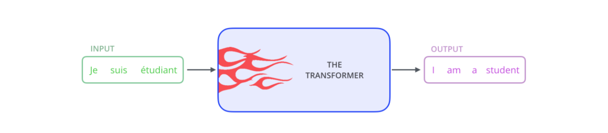
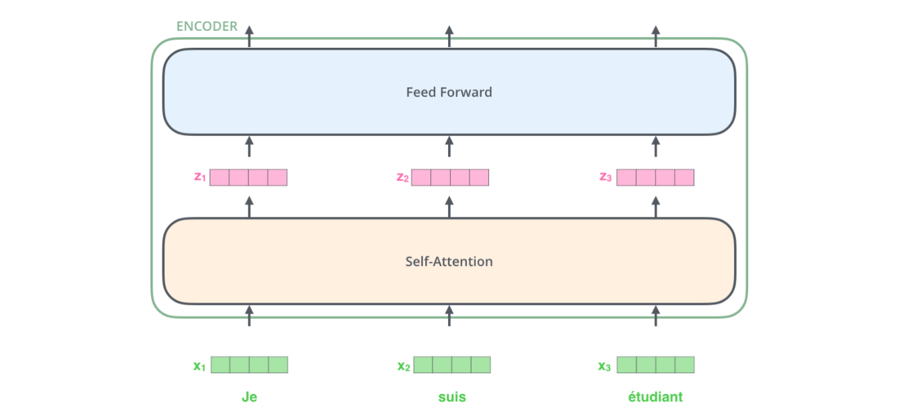

目录

- [Transformer 整体架构](#transformer-整体架构)
- [加入张量看 Transformer](#加入张量看-transformer)
- [编码](#编码)
- [从高处看 Self-attention](#从高处看-self-attention)
- [从细节看 Self-attention](#从细节看-self-attention)
- [Self-attention 的矩阵计算](#self-attention-的矩阵计算)
- [多头野兽](#多头野兽)
- [使用位置编码表征序列顺序](#使用位置编码表征序列顺序)
- [残差项](#残差项)
- [解码器](#解码器)
- [最后的Linear和Softmax层](#最后的linear和softmax层)
- [训练概要](#训练概要)
- [损失函数](#损失函数)
- [时间序列 Transformer](#时间序列-transformer)
- [参考](#参考)

Transformer 是 Google 在 2017 年提出的一个 NLP 模型，适用于机器翻译任务。
它不依赖于使用 CNN 和 RNN，而是基于关注机制(Attention)构建网络结构

# Transformer 整体架构

如果把 Transformer 模型当作黑盒，在机器翻译任务里，模型接受一种语言的句子，输出另一种语言的翻译句子

打开中间这个 Transformer 结构，我们能看到一个编码模块和一个解码模块，且它们互相连接

编码模块有多个编码器堆叠而成 (论文堆了 6 个，数字 6 没有特别规定，可以自行修改进行实验)，
解码模块也堆叠了 6 个解码器

编码器之间都是相同结构，但不共享权重。每个编码器有两层：

编码器的输入首先流入一个自关注层 (self-attention layer) - 当编码器对某个特定单词进行编码时，
该层会帮助编码器关注输入句子中的其它单词。后续会详细讲这块

自关注层的输出会被喂入前馈神经网络 (feed-forward neural network)，每个输入位置上都有一个前馈神经网络，
它们之间是相互独立的 (补充: 论文说前馈神经网络是 point-wise)

解码器也有编码器的这两层，但是在它们中间还有个关注层，帮助解码器关注输入句子的相关部分 (跟 seq2seq 模型里的关注机制类似)

# 加入张量看 Transformer

我们已经看过模型的主要模块，现在来看下，向量/张量是如何在这些模块中，从输入到输出。
以 NLP 常见应用的为例，我们用一个 Embedding 算法将每个输入词转化为一个向量：

Word Embedding 只发生在编码器的最底端，对于所有编码器来说，它们会接收一个 list，list 内含有多个长度为 512 的词向量。
但对其他编码器来说，它们的输入会是上一层编码器的输入。list 的长度是可调整的超参，一般为训练集中最长句子的长度

对输入序列进行词向量化后，每个词向量会依次流入下面编码器中的两个子层

现在，我们来看下 Transformer 的一个重要特性 - 句子中的每个对应位置上的词是按照它自有路径流入编码器的，
在 self-attention 层这些路径是相互依赖的。但 Feed-forward 层不存在依赖性，
因此，当 self-attention 层的输入流入 feed-forward 层，这些独立的路径可以并行

接下来，我们将目光转向一个更短的句子，我们看下在编码器每个子层里发生了什么？

# 编码

# 从高处看 Self-attention

# 从细节看 Self-attention

# Self-attention 的矩阵计算

# 多头野兽

# 使用位置编码表征序列顺序

# 残差项

# 解码器

# 最后的Linear和Softmax层

# 训练概要

# 损失函数

# 时间序列 Transformer

* https://mp.weixin.qq.com/s/OjK7Q7DSoTM_p1MLye9RWw

# 参考

* [Transformer的一家](https://mp.weixin.qq.com/s/ArzUQHQ-imSpWRPt6XG9FQ)
* [Transformer](https://mp.weixin.qq.com/s?__biz=MzUyNzA1OTcxNg==&mid=2247486160&idx=1&sn=2dfdedb2edbca76a0c7b110ca9952e98&chksm=fa0414bbcd739dad0ccd604f6dd5ed99e8ab7f713ecafc17dd056fc91ad85968844e70bbf398&scene=178&cur_album_id=1577157748566310916#rd)
* [Hugging Face](https://huggingface.co/docs/transformers/quicktour)
* [🤗 Transformers 教程：pipeline一键预测](https://mp.weixin.qq.com/s/1dtk5gCa7C-wyVQ9vIuRYw)
