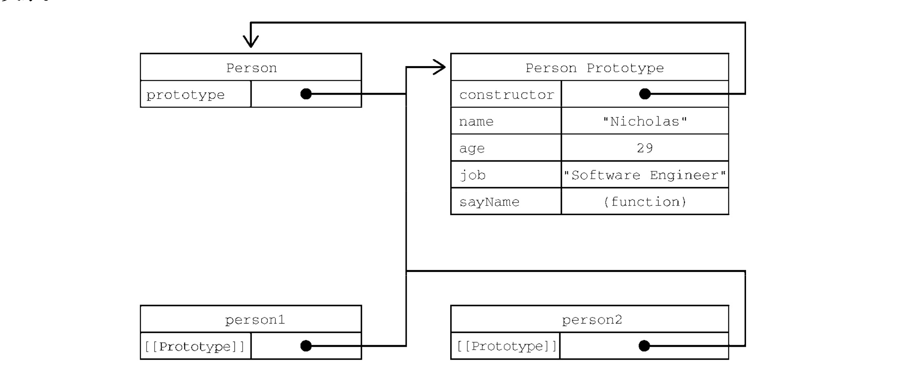
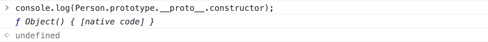
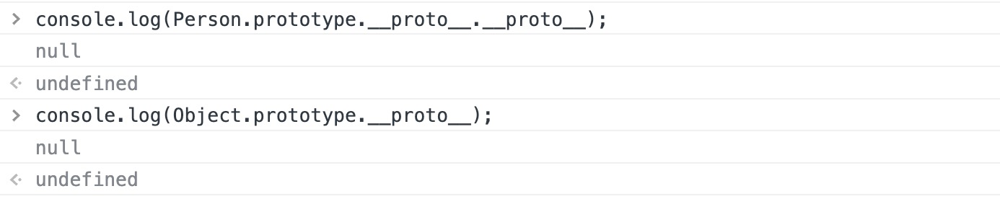

<style>
h1 {
  background-color: #2B90B6;
  background-image: linear-gradient(45deg, #4EC5D4 10%, #146b8c 20%);
  background-size: 100%;
  -webkit-background-clip: text;
  -moz-background-clip: text;
  -webkit-text-fill-color: transparent;
  -moz-text-fill-color: transparent;
}
h2 {
  background-color: #2B90B6;
  background-image: linear-gradient(45deg, #4EC5D4 10%, #146b8c 20%);
  background-size: 100%;
  -webkit-background-clip: text;
  -moz-background-clip: text;
  -webkit-text-fill-color: transparent;
  -moz-text-fill-color: transparent;
}

details {
    border: 1px solid #aaa;
    border-radius: 4px;
    padding: .5em .5em 0;
}

summary {
    font-weight: bold;
    margin: -.5em -.5em 0;
    padding: .5em;
}

details[open] {
    padding: .5em;
}

details[open] summary {
    border-bottom: 1px solid #aaa;
    margin-bottom: .5em;
}
</style>

<details><summary>目录</summary><p>

- [理解对象](#理解对象)
  - [创建对象](#创建对象)
    - [Object() 构造函数](#object-构造函数)
    - [对象字面量](#对象字面量)
  - [属性的类型](#属性的类型)
    - [数据属性](#数据属性)
    - [访问器属性](#访问器属性)
  - [定义多个属性](#定义多个属性)
  - [读取属性的特性](#读取属性的特性)
  - [合并对象](#合并对象)
  - [对象标识及相等判定](#对象标识及相等判定)
  - [增强的对象语法](#增强的对象语法)
    - [属性值的简写](#属性值的简写)
    - [可计算属性](#可计算属性)
    - [简写方法名](#简写方法名)
  - [对象解构](#对象解构)
    - [对象解构介绍](#对象解构介绍)
      - [不使用对象解构](#不使用对象解构)
      - [使用对象解构](#使用对象解构)
      - [让变量直接使用属性的名称](#让变量直接使用属性的名称)
      - [解构赋值不一定与对象的属性匹配](#解构赋值不一定与对象的属性匹配)
      - [可以在解构赋值的同时定义默认值](#可以在解构赋值的同时定义默认值)
      - [ToObject()](#toobject)
      - [解构并不要求变量必须在解构表达式中声明](#解构并不要求变量必须在解构表达式中声明)
    - [嵌套解构](#嵌套解构)
      - [通过解构复制对象属性](#通过解构复制对象属性)
    - [解构赋值使用嵌套结构](#解构赋值使用嵌套结构)
    - [部分解构](#部分解构)
    - [参数上下文匹配](#参数上下文匹配)
- [创建对象](#创建对象-1)
  - [工厂模式](#工厂模式)
  - [构造函数模式](#构造函数模式)
    - [构造函数模式解释](#构造函数模式解释)
    - [构造函数模式原理](#构造函数模式原理)
    - [constructor](#constructor)
    - [构造函数用函数表达式创建](#构造函数用函数表达式创建)
    - [构造函数实例化](#构造函数实例化)
    - [构造函数也是函数](#构造函数也是函数)
    - [构造函数的问题](#构造函数的问题)
      - [问题](#问题)
      - [解决方法](#解决方法)
  - [原型模式](#原型模式)
    - [理解原型](#理解原型)
    - [原型层级](#原型层级)
    - [原型和 in 操作符](#原型和-in-操作符)
      - [单独使用](#单独使用)
      - [在 for-in 循环中使用](#在-for-in-循环中使用)
    - [属性枚举顺序](#属性枚举顺序)
  - [对象迭代](#对象迭代)
    - [其他原型语法](#其他原型语法)
    - [原型的动态性](#原型的动态性)
    - [原生对象类型](#原生对象类型)
    - [原型的问题](#原型的问题)
- [继承](#继承)
  - [原型链](#原型链)
    - [原型链的实现](#原型链的实现)
    - [默认原型](#默认原型)
    - [原型与继承关系](#原型与继承关系)
    - [关于方法](#关于方法)
    - [原型链的问题](#原型链的问题)
  - [盗用构造函数](#盗用构造函数)
    - [传递参数](#传递参数)
    - [盗用构造函数的问题](#盗用构造函数的问题)
  - [组合继承](#组合继承)
  - [原型式继承](#原型式继承)
  - [寄生式继承](#寄生式继承)
  - [寄生式组合继承](#寄生式组合继承)
- [类](#类)
  - [类定义](#类定义)
    - [类的定义](#类的定义)
    - [类的构成](#类的构成)
  - [类构造函数](#类构造函数)
    - [实例化](#实例化)
  - [实例、原型和类成员](#实例原型和类成员)
    - [实例成员](#实例成员)
    - [原型方法与访问器](#原型方法与访问器)
    - [静态类方法](#静态类方法)
    - [非函数原型和类成员](#非函数原型和类成员)
    - [迭代器与生成器方法](#迭代器与生成器方法)
  - [继承](#继承-1)
    - [继承基础](#继承基础)
    - [构造函数、HomeObject 和 super()](#构造函数homeobject-和-super)
    - [抽象基类](#抽象基类)
    - [继承内置类型](#继承内置类型)
    - [类混入](#类混入)
</p></details><p></p>


ECMA-262 将对象定义为一组属性的无序集合。
严格来说，这意味着对象就是一组没有特定顺序的值。
对象的每个属性或方法都由一个名称来标识，这个名称映射到一个值。
可以把 ECMAScript 的对象想象成一张散列表，其中的内容就是一组名/值对，
值可以是数据或函数

# 理解对象

* `Object()`: 创建对象
* `Object.defineProperty()`: 获取对象属性特性，定义访问器属性
* `Object.defineProperties()`: 定义对象的多个属性
* `Object.getOwnPropertyDescriptor()`: 获取指定属性的属性特性描述符
* `Object.getOwnPropertyDescriptors()`: 获取每个自有属性的特性描述符
* `Object.assign()`: 合并对象
* `Object.is()`: 对象标识及相等判定

## 创建对象

### Object() 构造函数

创建自定义对象的通常方式是创建 Object 的一个新实例，然后再给它添加属性和方法

```js
let person = new Object();

person.name = "Nicholas";
person.age = 29;
person.job = "Software Engineer";
person.sayName = function() {
    console.log(this.name);  // this 指 person 对象
};
```

### 对象字面量

更流行的方式是使用对象字面量

```js
let person = {
    name: "Nicholas";
    age: 29;
    job: "Software Engineer";
    sayName() {
        console.log(this.name);  // this 指 person 对象
    }
};
```

## 属性的类型

ECMA-262 使用一些**内部特性**来描述**属性的特征**。
这些特性是由为 JavaScript 实现引擎的规范定义的，
因此，开发者不能在 JavaScript 中直接访问这些特性，
为了将某个特性表示为内部特性，
规范会用两个中括号把特性的名称括起来。属性分两种:

* 数据属性
* 访问器属性

### 数据属性

数据属性包含一个保存数据值的位置。值会从这个位置读取，也会写入到这个位置。
数据属性有 4 个特性描述它们的行为。将属性显式添加到对象之后，
`[[Configurable]]`、`[[Enumerable]]`、`[[Writable]]` 都会被设置为 `true`，
而 `[[Value]]` 特性会被设置为指定的值

* `[[Configurable]]`
    - 表示属性是否可以通过 `delete` 删除并重新定义，是否可以修改它的特性，
      以及是否可以把它改为访问器属性。默认值为 `true`
        - `true`：非严格模式下删除没有效果
        - `ture`：严格模式下会报错
    - 一个属性别定义为不可配置后，就不能再变回可配置的了
* `[[Enumerable]]`
    - 表示属性是否可以通过 `for-in` 循环返回。默认值为 `true`
* `[[Writable]]`
    - 表示属性的值是否可以被修改。默认值为 `true`
        - `true`：非严格模式下会忽略修改
        - `ture`：严格模式下会报错
* `[[Value]]`
    - 包含属性实际的值。默认值为 `undefined`

要修改属性的默认特性，就必须使用 `Object.defineProperty()` 方法，这个方法接收 3 个参数：

* 要给其添加属性的对象
* 属性的名称
* 描述符对象，描述符对象上的属性可以包含: `configurable`、`enumerable`、
  `writable`、`value`，跟相关特性的名称一一对应

```js
let person = {};

Object.defineProperty(
    person, 
    "name",
    {
        writalbe: false,
        value: "Nicholas"
    }
)
console.log(person.name); // "Nicholas"
person.name = "Greg";
console.log(person.name); // "Nicholas"
```

```js
let person = {};

Object.defineProperty(person, "name", {
    configurable: false,
    value: "Nicholas"
});
console.log(person.name);  // "Nicholas"
delete person.name;
console.log(person.name);  // "Nicholas"
```

```js
let person = {};

Object.defineProperty(person, "name", {
    configurable: false,
    value: "Nicholas"
});

// 抛出错误
Object.defineProperty(perosn, "name", {
    configurable: true,
    value: "Nicholas"
});
```


> * 虽然可以对同一个属性多次调用 `Object.defineProperty()`，
>   但在把 `configurable` 设置为 `false` 之后就会受限制了
> * 在调用 `Object.defineProperty()` 时，`configurable`、`enumerable` 和 `writable` 的值如果不指定，
>   则都默认为 `false`。多数情况下，可能都不需要 `Object.defineProperty()` 提供的这些强大的设置，
>   但要理解 JavaScript 对象，就要理解这些概念

### 访问器属性

访问器属性不包含数据值。相反，它们包含一个**获取(getter)函数**和一个**设置(setter)函数**，
不过这两个函数不是必需的

* 在读取访问器属性时，会调用 `getter` 函数，这个函数的责任就是返回一个有效的值
* 在写入访问器属性时，会调用 `setter` 函数并传入新值，这个函数必需决定对数据做出什么修改

访问器属性有 4 个特性描述它们的行为：

* `[[Configurable]]`
    - 表示属性是否可以通过 `delete` 删除并重新定义，是否可以修改它的特性以及，
      以及是否可以把它改为数据属性。默认值为 `true`
* `[[Enumerable]]`
    - 表示属性是否可以通过 `for-in` 循环返回。默认值为 `true`
* `[[Get]]`
    - 获取函数，在读取属性时调用，默认值为 `undefined`
* `[[Set]]`
    - 设置函数，在写入属性时调用，默认值为 `undefined`

访问器属性是不能直接定义的，必需使用 `Object.defineProperty()`:

* 获取函数和设置函数不一定都要定义，只定义获取函数意味着属性是只读的，
  尝试修改属性会被忽略
* 在严格模式下，尝试写入只定义了获取函数的属性会抛出错误。
  类似地，只有一个设置函数的属性是不能读取的，非严格模式下读取会返回 `undefined`，
  严格模式下回抛出错误
* 在不支持 `Object.definedProperty()` 的浏览器中没有办法修改 `[[Configurable]]` 和 `[[Enumerable]]`

```js
// 定义一个对象，包含私有成员 year_ 和公共成员 edition
let book = {
    year_: 2017, // 数据属性，不希望在对象方法的外部被访问
    edition: 1,  // 数据属性
};

Object.defineProperty(
    book,		 // 对象
    "year",      // 访问器属性
    {
        get() {
            return this.year_;
        },
        set(newValue) {
            if (newValue > 2017) {
                this.year_ = newValue;
                this.edition += newValue - 2017;
            }
        }
    }
);
book.year = 2018;
console.log(book.edition); // 2
```

## 定义多个属性

ECMAScript 提供了 `Object.defineProperties()` 方法，
这个方法可以通过多个描述符一次性定义多个属性。它接收两个参数：

* 要为之添加或修改属性的对象
* 另一个描述符对象，其属性与要添加或修改的属性一一对应

```js
// 定义一个对象，在对象上同时定义连个数据数据 year_ 和 edition，还有一个访问器属性 year
// 并且，数据属性的 configurable、enumerable、writable特性的值都是 false
let book = {};

Object.defineProperties(
    book, 
    {
        // 数据属性
        year_: {
            value: 2017
        },
        edition: {
            value: 1
        },
        // 访问器属性
        year: {
            get() {
                return this.year_;
            },
            set(newValue) {
                if (newValue > 2017) {
                    this.year_ = newValue;
                    this.edition += newValue - 2017;
                }
            }
        }
    }
);
```

## 读取属性的特性

使用 `Object.getOwnPropertyDescriptor()` 方法可以取得指定属性的属性描述符。
这个方法接收两个参数：

* 属性所在的对象
* 要取得其描述符的属性名

该方法返回值是一个对象:

* 对于数据属性包含 configurable、enumerable、writable、value 属性
* 对于访问器属性包含 configurable、enumerable、get、set 属性

```js
// 定义对象
let book = {};

// 为对象 book 定义多个属性
Object.defineProperties(book, {
    year_: {   // 数据属性
        value: 2017
    },
    edition: { // 数据属性
        value: 1
    },
    year: {    // 访问器属性
        get: function() {
            return this.year_;
        },
        set: function(newValue) {
            if (newValue > 2017) {
                this.year_ = newValue;
                this.edition += newValue - 2017;
            }
        }
    }
});

let descriptor = Object.getOwnPropertyDescriptor(book, "year_");
console.log(descriptor.value);  // 2017
console.log(descriptor.configurable);  // false
console.log(typeof descriptor.get);  // "undefined"

let descriptor = Object.getOwnPropertyDescriptor(book, "year");
console.log(descriptor.value);  // undefined
console.log(descriptor.enumerable);  //false
console.log(typeof descriptor.get);  // "function"，get 是一个指向获取函数的指针
```

ECMAScript 2017 新增了 `Object.getOwnPropertyDescriptors()` 静态方法，
这个方法实际上会在每个自有属性上调用 `Object.getOwnPropertyDescriptor()` 并在一个新对象中返回它们

```js
// 定义对象
let book = {};

// 为对象 book 定义多个属性
Object.defineProperties(book, {
    year_: {   // 数据属性
        value: 2017 
    },
    edition: { // 数据属性
        value: 1
    },
    year: {    // 访问器属性
        get: function() {
            return this.year_;
        },
        set: function(newValue) {
            if (newValue > 2017) {
                this.year_ = newValue;
                this.edition += newValue - 2017;
            }
        }
    }
});

console.log(Object.getOwnPropertyDescriptors(book));
// {
//    edition: {
//      configurable: false,
//      enumerable: false,
//      value: 1,
//      writable: false
//	  },
//    year: {
//      configurable: false,
//      enumerable: false,
//      get: f(),
//      set: f(newValue),
//    },
//    year_: {
//      configurable: false,
//      enumerable: false,
//      value: 2017,
//      writable: false
//    }
// }
```

## 合并对象

**合并(merge)**，就是把源对象所有的本地属性一起复制到目标对象上，
也称为**混入(mixin)**，因为目标对象通过混入源对象的属性得到了增强

ECMAScript 6 专门为合并提供了 `Object.assign()` 方法。
这个方法接收一个目标对象和多个源对象作为参数，
然后将每个**源对象**中可枚举和自有属性复制到**目标对象**。

以字符串和符号为键的属性会被复制。对每个符合条件的属性，
`Object.assign()` 会使用**源对象**上的 `[[Get]]` 取得属性的值，
然后使用**目标对象**上的 `[[Set]]` 设置属性的值

* 可枚举(`Object.propertyIsEnumerable()` 返回 `true`)
* 自有(`Object.hasOwnProperty()` 返回 `true`)

```js
let dest, src, result;

/********************************
 * 1.简单复制
 ********************************/
dest = {};
src = { id: "src" };
result = Object.assign(dest, src);
// Ojbect.assign 修改目标对象，也会返回修改后的目标对象
console.log(dest === result); // true
consoel.log(dest !== src);    // true
console.log(result); 	      // { id: src }
console.log(dest); 	          // { id: src }

/********************************
 * 多个源对象
 ********************************/
dest = {};
result = Object.assign(
    dest, 
    { a: "foo" }, 
    { b: "bar" }
);
console.log(result); // { a: foo, b: bar }

/********************************
 * 获取函数与设置函数
 ********************************/
dest = {
    set a(val) {
        console.log(`Invoked dest setter with param ${val}`);
    }
};
src = {
    get a() {
        console.log('Invoked src getter');
        return 'foo';
    }
};
Object.assign(dest, src);
// 调用 src 的获取 get 方法
// 调用 dest 的设置 set 方法并传入参数 "foo"
// 因为这里的设置函数不执行赋值操作,所以实际上并没有把值转移过来
console.log(dest); 	       // { set a(val) {...} }
```

`Object.assign()` 实际上对每个源对象执行的是浅复制
    
* 如果多个源对象都有相同的属性，则使用最后一个复制的值
* 从源对象访问器属性取得的值，比如获取函数，会作为一个静态值赋给目标对象。
  换句话说，不能在两个对象间转移获取函数和设置函数

```js
let dest, src, result;

/********************************
 * 覆盖属性
 ********************************/
dest = { id: "dest" };
result = Object.assign(
    dest, 
    { 
        id: "src1", 
        a: "foo" 
    }, 
    { 
        id: "src2",
        b: "bar"
    }
);
// Object.assign 会覆盖重复的属性
console.log(result); // { id: src2, a: foo, b: bar }

// 可以通过目标对象上的设置函数观察到覆盖的过程
dest = {
    set id(x) {
        console.log(x);
    }
};
Object.assign(
    dest,
    {
        id: "first"
    },
    {
        id: "second"
    },
    {
        id: "third"
    }
);
// first
// second
// third

/********************************
 * 对象引用
 ********************************/
dest = {};
src = { a: {} };
Object.assign(dest, src);

// 浅复制意味着只会复制对象的引用
console.log(dest);              // { a: {} }
console.log(dest.a === src.a);  // true
```

如果赋值期间出错，则操作会中止并退出，同时抛出错误。
`Object.assign()` 没有"回滚"之前赋值的概念，
因此它是一个尽力而为、可能只会完成部分复制的方法

```js
let dect, src, result;

/********************************
 * 错误处理
 ********************************/
dest = {};
src = {
    a: "foo",
    get b() {
        // Object.assign() 在调用这个获取函数时会抛出错误
        throw new Error();
    },
    c: "bar"
};

try {
    Object.assign(dest, src);
} catch(e) {}

// Object.assign() 没办法回滚已经完成的修改
// 因此在抛出错误之前，目标对象上已经完成的修改会继续存在:
console.log(dest);  // { a: foo }
```

## 对象标识及相等判定

在 ECMAScript 6 之前，对于有些对象相等的判定的特殊情况即使是 `===` 操作符也无能为力
为了改善这类情况，ECMAScript 6 规范新增了 `Object.is()` 方法

```js
// === 符合预期的情况
console.log(true === 1); // false
console.log({} === {});  // false
console.log("2" === 2);  // false

// 在不同 JavaScript 引擎中表现不同，但仍被认为相等
console.log(+0 === -0);  // ture
console.log(+0 === 0);   // true
console.log(-0 === 0);   // true

// 要确定 NaN 的相等性，必须使用极为讨厌的 isNaN()
console.log(NaN === NaN); // false
consoel.log(isNaN(NaN));  // true
```

```js
console.log(Object.is(true, 1)); // false
console.log(Object.is({}, {}));  // false
console.log(Object.is("2", 2));  // false

// 正确的 0、-0、+0 相等/不相等判定
console.log(Object.is(+0 -0)); // false
console.log(Object.is(+0, 0)); // true
console.log(Object.is(-0, 0)); // false

// 正确的 NaN 相等判定
console.log(Object.is(NaN, NaN)); // true

// 要检查超过两个值，递归地利用相等性传递即可
function recursivelyCheckEqual(x, ...rest) {
    return Object.is(x, rest[0]) && (rest.length < 2 || recursivelyCheckEqual(...rest));
}
```

## 增强的对象语法

ECMAScript 6 为定义和操作对象新增了很多极其有用的语法糖特性，
这些特性都没有改变现有引擎的行为，但极大地提升了处理对象的方便程度。
这里的所有对象语法同样适用于 ECMAScript 6 的类

### 属性值的简写

在给对象添加变量的时候，开发者经常会发现属性名和变量名是一样的。
为此，简写属性名语法出现了。简写属性名只要使用变量名(不用再写冒号)就会自动被解释为同名的属性键，
如果没有找到同名变量，则会抛出 ReferenceError

```js
// 一般语法
let name = "Matt";
let person = {
    name: name
};
console.log(person); // { name: "Matt" }


// 属性值简写
let name = "Matt";
let person = {
    name
};
console.log(person); // { name: "Matt" }
```

代码压缩程序会在不同作用域间保留属性名，以防止找不到引用

```js
// 即使参数标识符只限定于函数作用域，编译器也会保留初始的 name 标识符
function makePerson(name) {
    return {
        name
    };
}
let perosn = makePerson("Matt");
console.log(person.name); // Matt

// 如果用 Google Closure 编译器压缩，那么函数参数会被缩短，而属性名不变
function makePerson(a) {
    return {
        name: a
    };
}
var person = makePerson("Matt");
console.log(person.name);      // Matt
```

### 可计算属性

在引入可计算属性之前，如果想使用变量的值作为属性，那么必须先声明对象，
然后使用中括号语法来添加属性，换句话说，不能在对象字面量中直接动态命名属性

```js
const nameKey = "name";
const ageKey = "age";
const jobKey = "job";

let person = {};
person[nameKey] = "Matt";
person[ageKey] = 27;
person[jobKey] = "Software engineer";

console.log(person);
// { name: "Matt", age: 27, job: "Software engineer" }
```

有了可计算属性，就可以在对象字面量中完成动态属性的赋值。
中括号包围的对象属性键告诉运行时将其作为 JavaScript 表达式而不是字符串来求值

```js
const nameKey = "name";
const ageKey = "age";
const jobKey = "job";

let person = {
    [nameKey]: "Matt",
    [ageKey]: 27,
    [jobKey]: "Software engineer"
};
console.log(person);
// { name: "Matt", age: 27, job: "Software engineer" }
```

因为中括号包围的对象属性键被当作 JavaScript 表达式求值，
所以可计算属性本身可以是复杂的表达式，在实例化时再求值

```js
const nameKey = "name";
const ageKey = "age";
const jobKey = "job";
let uniqueToken = 0;

function getUniqueKey(key) {
    return `${key}_{uniqueToken++}`;
}

let person = {
    [getUniqueKey(nameKey)]: "Matt",
    [getUniqueKey(ageKey)]: 27,
    [getUniqueKey(jobKey)]: "Software engineer"
};
console.log(person); // { name_0: "Matt", age_1: 27, job_2: "Software engineer" }
```

> 可计算属性表达式中抛出任何错误都会中断对象创建。
> 如果计算属性的表达式有副作用，那就要小心了，因为如果表达式抛出错误，
> 那么之前完成的计算是不能回滚的

### 简写方法名

- 在给对象定义方法时，通常都要写一个方法名、冒号，然后再引用一个匿名函数表达式

```js
let person = {
    sayName: function(name) {
        console.log(`My name is ${name}`);
    }
}
person.sayName("Matt"); // My name is Matt
```

- 简写方法名 

```js
// 放弃给函数表达式命名
let person = {
    sayName(name) {
        console.log(`My name is ${name}`);
    }
};
person.sayName("Matt"); // My name is Matt
```

```js
// 简写方法名对获取函数和设置函数也是适用的
let person = {
    name_: '',
    get name() {
        return this.name_;
    },
    set name(name) {
        this.name_ = name;
    },
    sayName() {
        console.log(`My name is ${this.name_}`);
    }
};
person.name = "Matt";
person.sayName(); 		// My name is Matt
```

```js
// 简写方法名与可计算属性相互兼容
const methodKey = "sayName";
let person = {
    [methodKey](name) {
        console.log(`My name is ${name}`);
    }
};
person.sayName("Matt"); // My name is Matt
```

## 对象解构

ECMAScript 6 新增了对象解构语法，可以在一条语句中使用嵌套数据实现一个或多个赋值操作。
简单地说，对象解构就是使用与对象匹配的结构来实现对象属性赋值。

### 对象解构介绍

#### 不使用对象解构

```js
let person = {
    name: "Matt",
    age: 27
};
let personName = person.name,
    personAge = person.age;
console.log(personName); // Matt
console.log(personAge);  // 27
```

#### 使用对象解构
    
使用对象解构，可以在一个类似对象字面量的结构中，声明多个变量，
同时执行多个赋值操作

```js
let person = {
    name: "Matt",
    age: 27
};
// 对象解构
let { name: personName, age: personAge } = person;
console.log(personName); // Matt
console.log(personAge); // 27
```

#### 让变量直接使用属性的名称

让变量直接使用属性的名称，可以使用简单语法

```js
let person = {
    name: "Matt",
    age: 27
}

let { name, age } = person;
console.log(name); // Matt
console.log(age);  // 27
```

#### 解构赋值不一定与对象的属性匹配

解构赋值不一定与对象的属性匹配。赋值的时候可以忽略某些属性，
而如果引用的属性不存在，则该变量的值就是 `undefined`

```js
let person = {
    name: "Matt",
    age: 27
};

let { name, job } = person;
console.log(name); // Matt
console.log(job);  // undefined
```

#### 可以在解构赋值的同时定义默认值

可以在解构赋值的同时定义默认值，适用于引用的属性不存在于源对象中的情况

```js
let person = {
    name: "Matt",
    age: 27
};

let { name, job = "Software engineer" } = person;
console.log(name);  // Matt
console.log(job);  // Software engineer
```

#### ToObject()

解构在内部使用函数 `ToObject()` (不能在运行时环境中直接访问)把源数据解构转换为对象。
这意味着在对象解构的上下文中，原始值会被当成对象，
这也意味着 null 和 undefined 不能被解构，否则会抛出错误

```js
let { lenght } = "foobar";
console.log(length); // 6

let { constructor: c } = 4;
console.log(c === Number);  // true

let { _ } = null; 	   // TypeError
let { _ } = undefined;  // TypeError
```

#### 解构并不要求变量必须在解构表达式中声明

解构并不要求变量必须在解构表达式中声明，不过，如果是给事先声明的变量赋值，
则赋值表达式必须包含在一对括号中

```js
let personName, personAge;
let person = {
    name: "Matt",
    age: 27
};
({name: personName, age: personAge} = person);
console.log(personName, personAge);  // Matt, 27
```

### 嵌套解构

#### 通过解构复制对象属性

解构对于引用嵌套的属性或赋值目标没有限制。
为此，可以通过解构来复制对象属性

```js
let person = {
    name: "Matt",
    age: 27,
    job: {
        title: "Software engineer"
    }
};
let personCopy = {};

({
    name: personCopy.name,
    age: personCopy.age,
    job: personCopy.job
} = person);

// 因为一个对象的引用被赋值给 personCopy，所以修改
// person.job 对象的属性也会影响 personCopy
person.job.title = "Hacker";

console.log(person);
// { name: "Matt", age: 27, job: { title: "Hacker" } }

console.log(personCopy);
// { name: "Matt", age: 27, job: { title: "Hacker" } }
```

### 解构赋值使用嵌套结构

解构赋值可以使用嵌套结构，以匹配嵌套的属性

```js
let person = {
    name: "Matt",
    age: 27,
    job: {
        "title": "Software engineer"
    }
};

// 声明 title 变量并将 person.job.title 的值赋给它
let { job: { title } } = person;
console.log(title);  // Software engineer
```

在外层属性没有定义的情况下不能使用嵌套解构。无论源对象还是目标对象都一样

```js
let person = {
    job: {
        title: "Software engineer"
    }
};
let personCopy = {};

// foo 在源对象上是 undefined
({
    foo: {
        bar: personCopy.bar
    }
} = person);
// TypeError: Cannot destructure property 'bar' of 'undefined' or 'null'.

// job 在目标对象上是 undefined
({
    job: {
        title: personCopy.job.title
    }
} = person);
// TypeError: Cannot set property 'title' of undefined
```

### 部分解构

涉及多个属性的解构赋值是一个输出无关的顺序化操作。
如果一个解构表达式涉及多个赋值，开始的赋值成功而后面的赋值出错，
则整个解构赋值只会完成一部分

```js
let person = {
    name: "Matt",
    age: 27
};
let personName, personBar, personAge;

try {
    // person.foo 是 undefined，因此会抛出错误
    ({
        name: personName, 
        foo: {
            bar: personBar
        },
        age: personAge
    } = person);
} catch(e) {}

console.log(personName, personBar, personAge);
// Mat, undefined, undefined
```

### 参数上下文匹配

在函数参数列表中也可以进行解构赋值。对参数的解构赋值不会影响 `arguments` 对象，
但可以在函数签名中声明在函数体内使用局部变量

```js
let person = {
    name: "Matt",
    age: 27
};

function printPerson(foo, {name, age}, bar) {
    console.log(arguments);
    console.log(name, age);
}

function printPerson2(foo, {name: personName, age: personAge}, bar) {
    console.log(arguments);
    console.log(personName, personAge);
}

printPerson("lst", person, "2nd");
// ['1st', {name: "Matt", age: 27}, '2nd']
// 'Matt', 27

printPerson2('1st', person, '2nd');
// ['1st', {name: "Matt", age: 27}, '2nd']
// 'Matt', 27
```

# 创建对象

使用 Object 构造函数、对象字面量可以方便地创建对象，但是这些方式也有明显不足：
创建具有同样接口的多个对象需要重复编写很多代码

- ECMAScript 5.1 并没有正式支持面向对象的结构，比如类或继承，
  但是通过巧妙地运用原型继承可以成功地模拟同样的行为
- ECMAScript 6 开始正式支持类和继承。ES6 的类旨在完全涵盖之前规范设计的基于原型的继承模式。
  不过，无论从哪方面看，ES6 的类都仅仅是封装了 ES 5.1 构造函数加原型继承的语法糖而已

> S6 的类定义本 身就相当于对原有结构的封装。因此，
  在介绍 ES6 的类之前，本书会循序渐进地介绍被类取代的那些底层概念:

## 工厂模式

工厂模式是一种众所周知的设计模式，用于抽象创建特定对象的过程

工厂模式虽然可以解决创建多个类似对象的问题，
但没有解决对象标识问题(即新创建的对象是什么类型)

```js
// 按照特定接口创建对象的方式
function createPerson(name, age, job) {
    let o = new Object();
    o.name = name;
    o.age = age;
    o.job = job;
    o.sayName = function() {
        console.log(this.name);
    };
    return o;
}

let person1 = createPerson("Nicholas", 29, "Software Engineer");
let person2 = createPerson("Greg", 27, "Doctor");
```

## 构造函数模式

ECMAScript 中的构造函数是用于创建特定类型对象的。
像 Object 和 Array 这样的原生构造函数，运行时可以直接在执行环境中使用。
也可以自定义构造函数，以函数的形式为自己的对象类型定义属性和方法

```js
function Person(name, age, job) {
    this.name = name;
    this.age = age;
    this.job = job;
    this.sayName = function() {
        console.log(this.name);
    };
}

let person1 = new Person("Nicholas", 29, "Software Engineer");
let person2 = new Person("Greg", 27, "Doctor");

person1.sayName(); // Nicholas
person2.sayName(); // Greg
```

### 构造函数模式解释

构造函数模式相比于工厂模式，有如下区别

* 没有显式地创建对象
* 属性和方法直接赋值给 `this`
* 没有 `return`
* 函数名首字母大写，按照惯例，构造函数名称的首字母都要大写，
  非构造函数则以小写字母开头，这是从面向对象编程语言哪里借鉴的，
  有助于区分构造函数和普通函数，毕竟 ECMAScript 的构造函数就是能创建对象的函数

### 构造函数模式原理

构造函数模式创建的实例对象时使用 `new` 操作符，以这种方式调用构造函数会执行如下操作:

1. 在内存中创建一个新对象
2. 这个新对象内部的 `[[Prototype]]` 特性被赋值为构造函数的 `prototype` 属性
3. 构造函数内部的 `this` 被赋值为这个新对象(即 `this` 指向新对象)
4. 执行构造函数内部的代码(给新对象添加属性)
5. 如果构造函数返回非空对象，则返回该对象；否则，返回刚创建的新对象

### constructor

`constructor` 本来是用于标识对象类型的。不过，一般认为 `instanceof` 操作符是确定对象类型更可靠的方式。
定义自定义构造函数可以确保实例被表示为特定类型，相比于工厂模式，这是一个很大的好处

下面的示例中每个对象都是 Object 的实例，同时也是 Person 的实例:

```js
function Person(name, age, job) {
    this.name = name;
    this.age = age;
    this.job = job;
    this.sayName = function() {
        console.log(this.name);
    };
}

let person1 = new Person("Nicholas", 29, "Software Engineer");
let person2 = new Person("Greg", 27, "Doctor");

person1.sayName(); // Nicholas
person2.sayName(); // Greg

console.log(person1.constructor == Person);  // true
console.log(person2.constructor == Person);  // true

console.log(person1 instanceof Object);  // true
console.log(person1 instanceof Person);  // true
console.log(person2 instanceof Object);  // true
console.log(person2 instanceof Person);  // true
```

### 构造函数用函数表达式创建

构造函数不一定要写成函数声明的形式。赋值给变量的函数表达式也可以表示构造函数

```js
let Person = function(name, age, job) {
    this.name = name;
    this.age = age;
    this.job = job;
    this.sayName = function() {
        console.log(this.name);
    };
};

let person1 = new Person("Nicholas", 29, "Software Engineer");
let person2 = new Person("Greg", 27, "Doctor");

person1.sayName();  // Nicholas
person2.sayName();  // Greg

console.log(person1 instanceof Object);  // true
console.log(person1 instanceof Person);  // true
console.log(person2 instanceof Object);  // true
console.log(person2 instanceof Person);  // true
```

### 构造函数实例化

在实例化时，如果不想传参数，那么构造函数后面的括号可加可不加。
只要有 `new` 操作符，就可以调用相应的构造函数

```js
function Person() {
    this.name = "Jake";
    this.sayName = function() {
        console.log(this.name);
    };
}

let person1 = new Person();
let person2 = new Person;

person1.sayName();  // Jake
person2.sayName();  // Jake

console.log(person1 instanceof Object);  // true
console.log(person1 instanceof Person);  // true
console.log(person2 instanceof Object);  // true
console.log(person2 instanceof Person);  // true
```

### 构造函数也是函数

构造函数与普通函数唯一的区别就是调用方式不同。除此之外，构造函数也是函数。
并没有把某个函数定义为构造函数的特殊语法。任何函数只要使用 `new` 操作符调用就是构造函数，
而不使用 `new` 操作符调用的函数就是普通函数

```js
function Person(name, age, job) {
    this.name = name;
    this.age = age;
    this.job = job;
    this.sayName = function() {
        console.log(this.name);
    };
}

// 作为构造函数
let person = new Person("Nicholas", 29, "Software Engineer");
person.sayName();  // Nicholas

// 作为函数调用
// 在用用一个函数而没有明确设置 this 值的情况下(即没有作为对象的方法调用，
// 或者没有使用 call()/apply() 调用)，
// this 始终指向 Global 对象(在浏览器中就是 window 对象)
Person("Greg", 27, "Doctor");  // 添加到 window 对象
window.sayName();  // Greg

// 在另一个对象的作用域中调用
let o = new Object();
Person.call(o, "Kristen", 25, "Nurse");
o.sayName();  // Kristen
```

### 构造函数的问题

构造函数的主要问题在于，其定义的方法会在每个实例上都创建一遍

#### 问题

```js
function Person(name, age, job) {
    this.name = name;
    this.age = age;
    this.job = job;
    this.sayName = function() {
        console.log(this.name);
    };
}

let person1 = new Person("Nicholas", 29, "Software Engineer");
let person2 = new Person("Greg", 27, "Doctor");

person1.sayName();  // Nicholas
person2.sayName();  // Greg
```

上面的例子中，`person1` 和 `person2` 都有名为 `sayName()` 的方法，
但这两个方法不是同一个 `Function()` 实例。

ECMAScript 中的函数是对象，因此每次定义函数时，都会初始化一个对象。
逻辑上讲，这个构造函数实际上是下面这样的。这样理解这个构造函数可以更清楚地知道，
每个 `Person` 实例都会有自己的 `Function` 实例用于显示 `name` 属性。

```js
function Person(name, age, job) {
    this.name = name;
    this.age = age;
    this.job = job;
    this.sayName = new Function("console.log(this.name)"); // 逻辑等价
}
```

以这种方式创建函数会带来不同的作用域链和标识符解析。
但创建新 `Function` 实例的机制是一样的。因此不同实例上的函数虽然同名却不相等

```js
console.log(person1.sayName == person2.sayName);  // false
```

#### 解决方法

因为都是做一样的事，所以没必要定义两个不同的 `Function` 实例。
况且，`this` 对象可以把函数与对象的绑定推迟到运行时。
要解决这个问题，可以把函数定义转移到构造函数外部

```js
function Person(name, age, job) {
    this.name = name;
    this.age = age;
    this.job = job;
    // sayName 属性等于全局 sayName() 函数
    // sayName 属性中包含的只是一个指向外部函数的指针
    this.sayName = sayName;
}

function sayName() {
    console.log(this.name);
}

let person1 = new Person("Nicholas", 29, "Software Engineer");
let person2 = new Person("Greg", 27, "Doctor");


// person1 和 person2 共享了定义在全局作用域上的 sayName() 函数
person1.sayName();  // Nicholas
person2.sayName();  // Greg
```

这样虽然解决了相同逻辑的函数重复定义的问题，但全局作用域也因此被搞乱了，
因为那个函数实际上只能在一个对象上调用。如果这个对象需要多个方法，
那么就要在全局作用域中定义多个函数。这会导致自定义类型引用的代码不能很好地聚集一起。
这个新问题可以通过原型模式来解决

## 原型模式

每个函数都会创建一个 `prototype` 属性，这个属性是一个对象，
包含应该由特定引用类型的实例共享的属性和方法。
实际上这个对象就是通过调用构造函数创建的**对象的原型**

使用原型对象的好处是，在它上面定义的属性和方法可以被对象实例共享。
原来在构造函数中直接给对象实例的值，可以直接赋值给它们的原型

* 函数声明

```js
function Person() {}
Person.prototype.name = "Nicholas";
Person.prototype.age = 29;
Person.prototype.job = "Software Engineer";
Person.prototype.sayName = function() {
    console.log(this.name);
};

let person1 = new Person();
person1.sayName(); // "Nicholas"

let person2 = new Person();
person2.sayName(); // "Nicholas"

console.log(person1.sayName == person2.sayName); // true
```

* 函数表达式

```js
let Person = function() {};

Person.prototype.name = "Nicholas";
Person.prototype.age = 29;
Person.prototype.job = "Software Engineeer";
Person.prototype.sayName = function() {
    console.log(this.name);
};

let person1 = new Person();
person1.sayName();  // Nicholas

let person2 = new Person();
person2.sayName();  // Nicholas

console.log(person1.sayName == person2.sayName);  // true
```

### 理解原型

> * 函数、构造函数
>     - `Person.prototype` 属性 -> 指向 `Person` 的原型对象
>     - `Person.prototype.__proto__` 属性 -> 浏览器在实例对象上暴露的属性，可以访问构造函数的原型
> * 原型对象
>     - `Person.prototype.constructor` 属性 -> 指向关联的构造函数 `Person`
>     - `Person.prototype.__proto__` 属性 -> 浏览器在实例对象上暴露的属性，可以访问构造函数的原型
> * 实例
>     - `person` 的 `[[Prototype]]` 指针 -> 赋值为构造函数的原型对象 `Person.prototype`
>     - 脚本中没有访问 `[[Prototype]]` 特性的标准方式，但浏览器在每个对象上暴露 `__proto__` 属性，
>       通过这个属性可以访问对象的原型 
>     - 实例通过 `__proto__` 链接到原型对象，它实际上指向隐藏特性 `[[Prototype]]`
>     - 实例 `person` 与构造函数原型 `Person.prototype` 之间有直接的联系，但实例 `person` 与构造函数 `Person` 之间没有



* 构造函数、实例

```js
// let Person = function() {};
// or
function Person() {}
Person.prototype.name = "Nicholas";
Person.prototype.age = 29;
Person.prototype.job = "Software Engineer";
Person.prototype.sayName = function() {
    console.log(this.name);
};

let person1 = new Person();
let person2 = new Person();
```

* 构造函数 `Person` 声明之后，就有了一个与之关联的原型对象 `Person.prototype`

```js
console.log(typeof Person.prototype);
// object
```

```js
console.log(Person.prototype);
```


* 构造函数有一个 `prototype` 属性，引用其原型对象，
  而这个原型对象也有一个 `constructor` 属性，引用这个构造函数。
  换句话说，两者循环引用

```js
console.log(Person.prototype.constructor === Person);  // true
```

```js
console.log(Person.prototype.constructor);
```


* 正常的原型链都会终止于 Object 的原型对象，Object 原型的原型是 `null`

```js
// Person 的原型 与 Object 的原型相等
console.log(Person.prototype.__proto__ === Object.prototype);  // ture
console.log(Person.prototype.__proto__);
console.log(Object.prototype);
```


```js
// Person 的原型对象的构造函数是 Object
console.log(Person.prototype.__proto__.constructor === Object);  // true
console.log(Object.prototype.__proto__.constructor);
```



```js
// 原型链都会终止于 Object 的原型对象, Object 原型的原型是 null
console.log(Person.prototype.__proto__.__proto__ === null);  // true
console.log(Person.prototype.__proto__.__proto__);
console.log(Object.prototype.__proto__);
```



* 构造函数、原型对象、实例是 3 个完全不同的对象

```js
console.log(person1 !== Person);  // true
console.log(person1 !== Person.prototype);  // true
console.log(Person.prototype !== Person);  // true
```

* 实例通过 `__proto__` 链接到原型对象，它实际上指向隐藏特性 `[[Prototype]]`
* 构造函数通过 `prototype` 属性链接到原型对象
* 实例与构造函数没有直接联系，与原型对象有直接联系，
  两个实例虽然都没有属性和方法，但实例可以调用构造函数原型上的属性和方法，
  这是由于属性查找机制的原因

```js
console.log(person1.__proto__ === Person.prototype);  // true
consoel.log(person1.__proto__.constructor === Person);  // true
```

* 同一个构造函数创建的两个实例共享同一个原型对象

```js
console.log(person1.__proto__ === person2.__proto__);  // true
```

* `instanceof` 检查实例的原型链中是否包含指定的构造函数的原型

```js
console.log(person1 instanceof Person);  // true
console.log(person1 instanceof Object);  // true
console.log(Person.prototype instanceof Object);  // true
```

* 虽然不是所有实现都对外暴露了 `[[Prototype]]`，
  但可以使用 `isPrototypeOf()` 方法确定两个对象之间的关系，
  本质上，`isPrototypeOf()` 会在传入参数的 `[[Prototype]]` 指向调用它的对象时返回 true

```js
console.log(Person.prototype.isPrototypeOf(person1));  // true
console.log(Person.prototype.isPrototypeOf(person2));  // true
```

* ECMAScript 的 Object 类型有一个方法 `Object.getPrototypeOf()`，
  返回参数的内部特性 `[[Prototype]]` 的值。
  使用 `Object.getPrototypeOf()` 可以方便地取得一个对象的原型，
  而这在通过原型实现继承时显得尤为重要

```js
console.log(Object.getPrototypeOf(person1) == Person.prototype);  // true
console.log(Object.getPrototypeOf(person2).name);  // Nicholas
```

* Object 类型还有一个 `setPrototypeOf()` 方法，
  可以向实例的私有特性 `[[Prototype]]` 写入一个新值。
  这样就可以重写一个对象的原型继承关系

```js
let biped = {
    numLegs: 2
};
let person = {
    name: "Matt"
};

Object.setPrototype(person, biped);
console.log(person.name);  // Matt
console.log(person.numLegs);  // 2
console.log(Object.getPrototypeOf(person) == biped);  // true
```

* `Object.setPrototypeOf()` 可能会严重影响代码性能，
  所以可以通过 `Object.create()` 来创建一个新对象，同时为其指定原型

```js
let biped = {
    numLegs: 2
};
let person = Object.create(biped);
person.name = "Matt";

console.log(person.name);  // Matt
console.log(person.numLegs);  // 2
console.log(Object.getPrototypeOf(person) === biped);  // true
```

### 原型层级

在通过对象访问属性时，会按照这个属性的名称开始搜索。搜索开始于对象实例本身。
如果在这个实例上发现了给定的名称，则返回该名称对应的值。如果没有找到这个属性，
则搜索会沿着指针进入原型对象，然后在原型对象上找到属性后，再返回对应的值。

> 例如：在调用 `person1.sayName()` 时，会发生两步搜索：
> 
> * 首先，JavaScript 引擎会问 “`person1` 实例有 `sayName` 属性吗？” 答案是没有
> * 然后，继续搜索并问：“`person1` 的原型有 `sayName` 属性吗？” 答案是有。于是就返回保存在原型上的这个函数
> 
> 在调用 `person2.sayName()` 时，会发生同样的搜索过程，而且也会返回相同的结果。
> 这就是原型用于在多个对象实例间共享属性和方法的原理

* 虽然可以通过实例读取原型对象上的值，但不可能通过实例重写这些值。
  如果在实例上添加了一个原型对象中同名的属性，那就会在实例上创建这个属性。
  只要给对象实例添加一个属性，这个属性就会**遮蔽(shadow)**原型对象上的同名属性，
  也就是虽然不会修改它，但会屏蔽对它的访问。即使在实例上把这个属性设置为 `null`，
  也不会恢复它和原型的联系。不过，使用 `delete` 操作符可以完全删除实例上的这个属性

```js
function Person() {}

Person.prototype.name = "Nicholas";
Person.prototype.age = 29;
Person.prototype.job = "Software Engineer";
Person.prototype.sayName = function() {
    console.log(this.name);
};

let person1 = new Person();
let person2 = new Person();

person1.name = "Greg";
console.log(person1.name);  // "Greg"，来自实例
console.log(person2.name);  // "Nicholas"，来自原型

delete person1.name;
console.log(person1.name);  // "Nicholas"，来自原型
```

* `hasOwnProperty()` 方法用于确定某个属性是在实例上还是在原型上。
  这个方法是继承自 Object 的，会在属性存在于调用它的对象实例上返回 `true`

```js
function Person() {}

Person.prototype.name = "Nicholas";
Person.prototype.age = 29;
Person.prototype.job = "Software Engineer";
Person.prototype.sayName = function() {
    console.log(this.name);
};

let person1 = new Person();
let person2 = new Person();

console.log(person1.hasOwnProperty("name"));  // false

person1.name = "Greg";
console.log(person1.name);  // "Greg"，来自实例
console.log(person1.hasOwnProperty("name"));  // true

console.log(person2.name);  // "Nicholas"，来自原型
console.log(person2.hasOwnProperty("name"));  // false

delete person1.name;
console.log(person1.name);  // "Nicholas"，来自原型
console.log(person1.hasOwnProperty("name"));  // false
```

### 原型和 in 操作符

有两种方式使用 `in` 操作符：

* 单独使用
* 在 `for-in` 循环中使用

#### 单独使用

在单独使用时，`in` 操作符会在可以通过对象访问指定属性时返回 `true`，
无论该属性是在实例上还是在原型上

```js
function Person() {}

Person.prototype.name = "Nicholas";
Person.prototype.age = 29;
Person.prototype.job = "Software Engineer";
Person.prototype.sayName = function() {
    console.log(this.name);
};

let person1 = new Person();
let person2 = new Person();

console.log(person1.name);  // Nicholas， 来自原型
console.log(person1.hasOwnProperty("name"));  // false
console.log("name" in person1);  // true

person1.name = "Greg";
console.log(person1.name);  // "Greg"，来自实例
console.log(person1.hasOwnProperty("name"));  // true
console.log("name" in person1);  // true

console.log(person2.name);  // Nicholas， 来自原型
console.log(person2.hasOwnProperty("name"));  // false
consoel.log("name" in person2);  // true

delete person1.name;
console.log(person1.name);  // "Nicholas"，来自原型
console.log(person1.hasOwnProperty("name"));  // false
console.log("name" in person1);  // true
```

如果要确定某个属性是否存在于原型上，则可以同时使用 `hasOwnProperty()` 和 `in` 操作符

```js
function hasPrototypeProperty(object, name) {
    return !object.hasOwnProperty(name) && (name in object);
}
```

#### 在 for-in 循环中使用

在 `for-in` 循环中使用 `in` 操作符，可以通过对象访问且可以被枚举的属性都会返回，
包括实例属性和原型属性。遮蔽原型中不可枚举属性的实例属性也会在 `for-in` 循环中返回，
因为默认情况下开发者定义的属性都是可枚举的

要获得对象上所有可枚举的实例属性，可以使用 `Object.keys()` 方法。
这个方法接收一个对象作为参数，返回包含该对象所有可枚举属性名字的字符串数组

```js
function Person() {}

Person.prototype.name = "Nicholas";
Person.prototype.age = 29;
Person.prototype.job = "Software Engineer";
Person.prototype.sayName = function() {
    console.log(this.name);
};

let keys = Object.keys(Person.prototype);
console.log(keys);  // "name, age, job, sayName"

let person1 = new Person();
person1.name = "Rob";
person1.age = 31;

let person1keys = Object.keys(person1);
console.log(person1keys);  // "[name,age]"
```

如果想要列出所有实例属性，无论是否可以枚举，都可以使用 `Object.getOwnPropertyNames()`。
`Objet.keys()` 和 `Object.getOwnPropertyNames()` 在适当的时候都可用来替代 `for-in` 循环

```js
let keys = Object.getOwnPropertyNames(Person.prototype);
console.log(keys);  // "[constructor,name,age,job,sayName]"
```

在 ECMAScript 新增符号类型之后，相应地出现了增加一个 `Object.getOwnPropertyNames()` 的兄弟方法的需求，
因为以符号为键的属性没有名称的概念。因此，`Object.getOwnPropertySymbols()` 方法就出现了，
这个方法与 `Objcet.getOwnPropertyNames()` 类似，只是针对符号而已

```js
let k1 = Symbol("k1");
let k2 = Symbol("k2");

let o = {
    [k1]: "k1",
    [k2]: "k2",
};

console.log(Object.getOwnPropertySymbols(o));
// [Symbol(k1), Symbol(k2)]
```

### 属性枚举顺序

在属性枚举顺序方面有很大的区别：

* 不确定，取决于 JavaScript 引擎，可能因浏览器而异
    - `for-in` 循环
    - `Object.keys()` 
* 枚举顺序是确定性的，先以升序枚举数值键，然后以插入顺序枚举字符和符号键 
    - `Object.getOwnPropertyNames()`
    - `Object.getOwnPropertySymbol()`
    - `Object.assign()`

在对象字面量中定义的键以它们逗号分隔的顺序插入


```js
let k1 = Symbol("k1");
let k2 = Symbol("k2");
let o = {
    1: 1,
    first: "first",
    [k1]: "sym2",
    second: "second",
    0: 0
};

o[k2] = "sym2";
o[3] = 3;
o.third = "third";
o[2] = 2;

console.log(Object.getOwnPropertyNames(o));
// ["0", "1", "2", "3", "first", "second", "third"]

console.log(Object.getOwnPropertySymbols(o));
// [Symbol(k1), Symbol(k2)]
```

## 对象迭代

在 JavaScript 有史以来的大部分时间内，迭代对象属性都是一个难题。

ECMAScript 2017 新增了两个静态方法，用于将**对象内容**转换为**序列化的格式(可迭代的)**。
这两个静态方法都接收一个对象，返回它们内容的数组。非字符串属性会被转换为字符串输出

* `Object.values()`
    - 返回对象值的数组
* `Object.entries()`
    - 返回键/值对的数组

```js
const o = {
    foo: "bar",
    baz: 1,
    qux: {}
};

console.log(Object.values(o));
// ["bar", 1, {}]

console.log(Object.entries(o));
// [["foo", "bar"], ["baz", 1], ["qux", {}]]
```

方法执行对象的浅复制:

```js
const o = {
    qux: {}
};

console.log(Object.values(o)[0] === o.qux);  // true
console.log(Object.entries(o)[0][1] === o.qux);  // true
```

符号属性会被忽略:

```js
const sym = Symbol();
const o = {
    [sym]: "foo"
};

console.log(Object.values(o));  // []
console.log(Object.entries(o));  // []
```

### 其他原型语法

直接通过一个包含所有属性和方法的对象字面量来重写原型

只有一个问题，这样重写之后，`Person.prototype` 的 `constructor` 属性就不指向 `Person` 了。

在创建函数时，也会创建它的 `prototype` 对象，同时会自动给这个原型的 `constructor` 属性赋值。
完全重写了默认的 `prototype` 对象，因此其 `constructor` 属性也指向了完全不同的新对象(Object 构造对象)，
不再指向原来的构造函数。虽然 `instanceof` 操作符还能可靠地返回值，但不能再依靠 `constructor` 属性来识别类型了

```js
function Person() {}

Person.prototype = {
    constructor: Person,
    name: "Nicholas",
    age: 29,
    job: "Software Engineer",
    sayName() {
        console.log(this.name);
    }
};

let friend = new Person();
console.log(friend instanceof Object);  // true
console.log(friend instanceof Person);  // true
console.log(friend.constructor == Person);  // false
console.log(friend.constructor == Object);  // true
```

如果 `constructor` 的值很重要，可以在重写原型对象时专门设置一个值

```js
function Person() {}

Person.prototype = {
    constructor: Person,
    name: "Nicholas",
    age: 29,
    job: "Software Engineer",
    sayName() {
        console.log(this.name);
    }
};
```

但要注意，已这种方式恢复 `constructor` 属性会创建一个 `[[Enumerable]]` 为 `true` 的属性。
而原生 `constructor` 属性默认是不可枚举的。因此，如果使用的是兼容 ECMAScript 的 JavaScript 引擎，
那可能会改为使用 `Object.defineProperty()` 方法来定义 `constructor` 属性

```js
function Person() {}

Person.prototype = {
    name: "Nicholas",
    age: 29,
    job: "Software Engineer",
    sayName() {
        console.log(this.name);
    }
};

// 恢复 constructor 属性
Object.defineProperty(Person.prototype, "constructor", {
    enumerable: false,
    value: Person
});
```

### 原型的动态性

因为从原型上搜索值的过程是动态的，所以即使实例在修改原型之前已经存在，
任何时候对原型对象所做的修改也会在实例上反映出来。之所以会这样，
主要原因是实例域原型之间松散的联系

* 在调用实例方法 `friend.sayHi()` 时，首先会从这个实例中搜索名为 `sayHi` 的属性。
  在没有找到的情况下，运行时会继续搜索原型对象。因为实例和原型之间的链接就是简单的指针，
  而不是保存的副本，所以会在原型上找到 `sayHi` 属性并返回这个属性保存的函数

```js
function Person() {}

Person.prototype = {
    name: "Nicholas",
    age: 29,
    job: "Software Engineer",
    sayName() {
        console.log(this.name);
    }
};

// 实例 friend 在方法 sayHi()创建之前已经存在
let friend = new Person();

Person.prototype.sayHi = function() {
    console.log("hi");
};

friend.sayHi();  // "hi"，没问题
```

* 虽然随时能给原型添加属性和方法，并能够立即反映在所有对象实例上，
  但这跟重写整个原型是两回事。实例的 `[[Prototype]]` 指针是在调用构造函数时自动赋值的，
  这个指针即使把原型修改为不同的对象也不会改变。重写整个原型会切断最初原型与构造函数的联系，
  但实例引用的仍然是最初的原型。记住，实例只有指向原型的指针，没有指向构造函数的指针

```js
function Person() {}

let friend = new Person();
Person.prototype = {
    constructor: Person,
    name: "Nicholas",
    age: 29,
    job: "Software Engineer",
    sayName() {
        console.log(this.name);
    }
};

friend.sayName();  // 错误
```

* 重写构造函数上的原型之后再创建的实例才会引用新的原型。
  而在此之前创建的实例仍然会易用最初的原型 

### 原生对象类型

原型模式之所以重要，不仅体现在自定义类型上，而且还因为它也是实现所有引用类型的模式。
所有原生引用类型的构造函数(包括 Object、Array、String 等)都在原型上定义了实例方法

```js
console.log(typeof Array.prototype.sort);  // "function"
console.log(typeof String.prototype.substring);  // "function"
```

通过原生对象的原型可以取得所有默认方法的引用，也可以给原生类型的实例定义新的方法。
可以像修改自定义对象原型一样修改原生对象原型，因此随时可以添加方法。
比如给 `String` 原始包装类型的实例添加一个 `startsWith()` 方法。
尽管可以这么做，但不推荐在产品环境中修改原生对象原型，推荐的做法是创建一个自定义的类，
继承原生类型

```js
String.prototype.startsWith = function(text) {
    return this.indexOf(text) === 0;
};

let msg = "Hello world!";
console.log(msg.startsWith("Hello"));  // true
```

### 原型的问题

* 首先，它弱化了构造函数传递初始化参数的能力，会导致所有实例默认都取得相同的属性值
* 其次，原型的最主要问题源自它的共享特性。
    - 原型上的所有属性是在实例见共享的，这对函数来说比较合适。另外包含原始值的属性
    - 真正的问题来自包含引用值的属性

```js
function Person() {}

Person.prototype = {
    constructor: Person,
    name: "Nicholas",
    age: 29,
    job: "Software Engineer",
    friends: ["Shelby", "Court"],
    sayName() {
        console.log(this.name);
    }
};

let person1 = new Person();
let person2 = new Person();

person1.friends.push("Van");

console.log(person1.friends);  // "Shelby, Court, Van"
console.log(person2.friends);  // "Shelby, Court, Van"
console.log(person1.friends === person2.friends);  // true
```

# 继承

* `instanceof`
* `isPrototypeOf()`

很多面向对象语言都支持两种继承:

* 接口继承: 只继承方法签名
    - 接口继承在 ECMAScript 中是不可能的，因为函数没有签名 
* 实现继承: 继承实际的方法
    - 实现继承是 ECMAScript 唯一支持的继承方式，而这主要是通过原型链实现的

## 原型链

ECMA-262 把原型链定义为 ECMAScript 的主要继承方法。
其基本思想就是通过原型继承多个引用类型的属性和方法

构造函数、原型、实例的关系：每个构造函数都有一个原型对象，原型有一个属性指回构造函数，
而实例有一个内部指针指向原型

如果原型是另一个类型的实例，那就意味着这个原型本身有一个内部指针指向另一个原型，
相应地另一个原型也有一个指针指向另一个构造函数。这样就在实例和原型之间构造了一条原型链。
这就是原型链的基本构想

### 原型链的实现

```js
// SuperType 类型
function SuperType() {
    this.property = true;
}
SuperType.prototype.getSuperValue = function() {
    return this.property
}

// SubType 类型
function SubType() {
    this.subproperty = false;
}
// 继承 SuperType
SubType.prototype = new SuperType();
SubType.prototype.getSubValue = function () {
    return this.subproperty;
};


let instance = new SubType();
console.log(instance.getSuperValue());  // true
```


### 默认原型

实际上，原型链中还有一环。默认情况下，所有引用类型都继承自 Object，这也是通过原型链实现的。

任何函数的默认原型都是一个 Object 的实例，这意味着这个实例有一个内部指针指向 `Object.prototype`。
这也是为什么自定义类型能够继承包括 `toString()`、`valueOf()` 在内的所有默认方法的原因。

前面的例子还有额外一层继承关系，下面展示了完整的原型链:

* `SubType` 继承 `SuperType`，而 `SuperType` 继承 `Object`，
  在调用 `instance.toString()` 时，实际上调用的是保存在 `Object.prototype` 上的方法


### 原型与继承关系

原型与实例的关系可以通过两种方式来确定

* 第一种方式是使用 `instanceof` 操作符，如果一个实例的原型链中出现过相应的构造函数，则 `instanceof` 返回 `true`

```js
console.log(instance instanceof Object);  // true
console.log(instance instanceof SuperType);  // true
console.log(instance instanceof SubType);  // true
```

* 第二种方式是使用 `isPrototypeOf()` 方法，原型链中的每个原型都可以调用这个方法

```js
console.log(Object.prototype.isPrototypeOf(instance));  // true
console.log(SuperType.prototype.isPrototypeOf(instance));  // true
console.log(SubType.prototype.isPrototype(instance));  // true
```

### 关于方法

子类有时候需要覆盖父类的方法，或者增加父类没有的方法。为此，
这些方法必须在原型赋值之后再添加到原型上

```js
// 类型 SuperType
function SuperType() {
    this.property = true;
}
SuperType.prototype.getSuperValue = function() {
    return this.property;
};

// 类型 SubType
function SubType() {
    this.subproperty = false;
}
// SubType 继承 SuperType
SubType.prototype = new SuperType();
// 新方法
SubType.prototype.getSubValue = function() {
    return this.subproperty;
};
// 覆盖已有的方法
SubType.prototype.getSuperValue = function() {
    return false;
};

let instance = new SubType();
console.log(instance.getSuperValue());  // false
```

以对象字面量方式创建原型方法会破坏之前的原型链，因为这相当于重写了原型链

```js
// 类型 SuperType
function SuperType() {
    this.propery = true;
}
SuperType.prototype.getSuperValue = function() {
    return this.property;
};

// 类型 SubType
function SubType() {
    this.property = false;
}
// 继承
SubType.prototype = new SuperType();
// 通过对象字面量添加新方法，这会导致上一行无效
// 子类的原型被一个对象字面量覆盖了，覆盖后的原型是一个 Object 的实例，
// 而不再是 SuperType 的实例，因此之前的原型链就断了，
// SubType 和 SuperType 之间也没有关系了
SubType.prototype = {
    getSubValue() {
        return this.subproperty;
    },
    someOtherMethod() {
        return false;
    }
};

let instance = new SubType();
console.log(instance.getSuperValue());  // 出错！
```

### 原型链的问题

原型链虽然是实现继承的强大工具，但它也有问题。

* 原型中包含的引用值会在所有实例间共享，这也是为什么属性通常会在构造函数中定义而不会定义在原型上的原因。
  在使用原型实现继承时，原型实际上变成了另一个类型的实例。这意味着原先的实例属性摇身一变成为了原型属性
* 原型链的第二个问题是，子类型在实例化时不能给父类型的构造函数传参。
  事实上，我们无法在不影响所有对象实例的情况下把参数传进父类的构造函数。
  再加上之前提到的原型中包含引用值的问题，就导致原型链基本不会被单独使用

```js
// 类型 SuperType
function SuperType() {
    this.colors = ["red", "blue", "green"]; // 引用值
}
// 类型 SubType
function SubType() {}
// 继承 SuperType
SubType.prototype = new SuperType();

let instance1 = new SubType();
instance1.colors.push("black");
console.log(instance1.colors);  // "red,blue,green,black"

let instance2 = new SubType();
console.log(instance2.colors);  // "red,blue,green,black"
```

## 盗用构造函数

为了解决原型包含引用值导致的继承问题，一种叫做“盗用构造函数”(constructor stealing)的技术在开发社区流行起来
(这种技术有时也称作“对象伪装”或“经典继承”)。

基本思路很简单：在子类构造函数中调用父类构造函数

### 传递参数

### 盗用构造函数的问题

## 组合继承

## 原型式继承

## 寄生式继承

## 寄生式组合继承


# 类

ECMAScript 6 新引入的 `class` 关键字具有正式定义类的能力。
类(class) 是ECMAScirpt 中新的基础性语法糖结构，
虽然 ECMAScript 6 类表面上看起来可以支持正式的面向对象编程，
但实际上它背后使用的仍然是原型和构造函数的概念

## 类定义

### 类的定义

与函数类型类似，定义类也有两种主要方式，这两种方式都使用 class 关键字加大括号

- 类声明

    - 定义类

    ```js
    // 函数声明
    function Person() {}
    class Person {}
    ```

    - 与函数定义不同的是，虽然函数声明可以提升，但类定义不能

        - 函数声明提升

        ```js
        console.log(FunctionDeclaration); // FunctionDeclaration() {}
        function FunctionDeclaration() {}
        console.log(FunctionDeclaration); // FunctionDeclaration() {}
        ```

        - 类声明不能提升

        ```js
        console.log(ClassDeclaration); // ReferenceError: ClassDeclaration is not defined
        class ClassDeclaration {}
        console.log(ClassDeclaration); // class ClassDeclaration {}
        ```

    - 与函数声明不同的还有，函数受函数作用域限制，而类受块作用域限制

    ```js
    {
        function FunctionDeclaration() {}
        class ClassDeclaration {}
    }
    
    console.log(FunctionDeclaration); // FunctionDeclaration() {}
    console.log(ClassDeclaration);    // ReferenceError: ClassDeclaration is not defined
    ```

- 类表达式

    - 定义类

    ```js
    // 函数表达式
    const Animal = function() {};
    const Animal = class {};
    ```

    - 与函数表达式类似，类表达式在它们被求值前也不能引用

        - 函数表达式在定义前不能引用

        ```js
        console.log(FunctionExpression); // undefined
        var FunctionExpression = function() {};
        console.log(FunctionExpression); // function() {}
        ```

        - 类表达式在定义前不能引用

        ```js
        console.log(ClassExpression); // undefined
        var ClassExpression = class() {};
        console.log(ClassExpression); // class {}
        ```

### 类的构成

- 类可以包含下面的方法或函数，但这些都不是必需的，空的类定义照样有效。默认情况下，类定义中的代码都在严格模式下执行：
  - 构造函数方法
      - constructor() {}
  - 实例方法
  - 获取函数
      - get
  - 设置函数
      - set
  - 静态类方法
      - 
- 与函数构造函数一样，建议类名的首字母要大写，以区别与通过它创建的实例
- 类表达式的名称是可选的。把类表达式赋值给变量后，可以通过 name 属性取得类表达式的名称字符串。但不能在类表达式作用域外部访问这个标识符

```js
// 空类定义，有效
class Foo {}
// 有构造函数的类，有效
class Bar {
    constructor() {}
}
// 实例方法
class Bai {}
// 获取函数
class Baz {
    get myBaz() {}
}
// 设置函数
class Bas {
    set MyBas() {}
}
// 有静态方法的类，有效
class Qux {
    static myQux() {}
}


// PersonName 类
let Person = class PersonName {
    identify() {
        console.log(Person.name, PersonName.name);
    }
}
// Person 类实例
let p = new Person();
p.identify();		      // PersonName PersonName
console.log(Person.name); // PersonName
console.log(PersonName);  // ReferenceError: PersonName is not defined
```

## 类构造函数

- constructor 关键字用于在类定义块内部创建类的构造函数
    - constructor 会告诉解释器在使用 new 操作符创建类的新实例时，应该调用这个函数
- 构造函数的定义不是必需的，不定义构造函数相当于将构造函数定义为空函数

### 实例化

```js
// 类
class Animal {}
// 类
class Person {
    constructor(name) {
        console.log(arguments.length);
        this.name = name || null;
        console.log("person ctor");
    }
}
// 类
class Vegetable {
    constructor() {
        this.color = "orange";
    }
}

// 实例化
let a = new Animal();
let p = new Person();
let v = new Vegetable();
console.log(v.color); // orange

let p1 = new Person; // 0
console.log(p1.name); // null
let p2 = new Person(); // 0
console.log(p2.name); // null
let p3 = new Person("Jake"); // 1
console.log(p3.name); // Jake
```

## 实例、原型和类成员

### 实例成员

### 原型方法与访问器

### 静态类方法

### 非函数原型和类成员

### 迭代器与生成器方法


## 继承

ECMAScript 6 新增特性中最出色的一个就是原生支持了类继承机制。
虽然类继承使用的是新语法，但背后依旧使用的是原型链

### 继承基础

ES6 类支持单继承。使用 `extends` 关键字，就可以继承任何拥有 `[[Construct]]` 和**原型**的对象。
很大程度上，这意味着不仅可以继承一个类，也可以继承普通的构造函数

- 继承类

```js
class Vehicle {}

// 继承类
class Bus extends Vehicle {}

let b = new Bus();
console.log(b instanceof Bus);	   // true
console.log(b instanceof Vehicle); // true
```

- 继承普通构造函数

```js
function Person {}

// 继承普通构造函数
class Engineer extends Person {}

let e = new Engineer();
console.log(e instanceof Engineer); // true
console.log(e instanceof Person); 	// true
```

- 派生类都会通过原型链访问到类和原型上定义的方法，this 的值会反映调用相应的方法的实例或者类

```js
// 类
class Vehicle {
    identifyPrototype(id) {
        console.log(id, this);
    }
    static identifyClass(id) {
        console.log(id, this);
    }
}

// 继承类
class Bus extends Vehicle {}

let v = new Vehicle();
let b = new Bus();

b.identifyPrototype("bus");     // bus, Bus {}
v.identifyPrototype("vehicle"); // vehicle, Vehicle {}

Bus.identifyClass("bus"); 	      // bus, class Bus {}
Vehicle.identifyClass("vehicle"); // vehicle, class Vehicle {}
```

- extends 关键字也可以在类表达式中使用，因此下面的也是有效的语法

    ```js
    let Bus = class extends Vehicle {};
    ```

### 构造函数、HomeObject 和 super()

派生类的方法可以通过 `super` 关键字引用它们的原型。这个关键字只能在派生类中使用，
而且仅限于类构造函数、实例方法和静态方法内部。在类构造函数中使用 super 可以调用父类构造函数

```js
class Vehicle {
    constructor() {
        this.hasEngine = true;
    }
}

class Bus extends Vehicle {
    constructor() {
        // 不要在调用 super() 之前引用 this，否则会抛出 ReferenceError
        super(); // 相当于 super.constructor()
        
    }
}
```


### 抽象基类

### 继承内置类型

### 类混入

