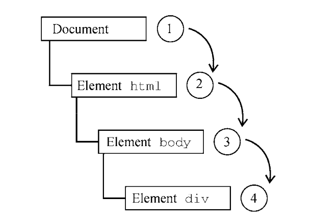

<style>
h1 {
  background-color: #2B90B6;
  background-image: linear-gradient(45deg, #4EC5D4 10%, #146b8c 20%);
  background-size: 100%;
  -webkit-background-clip: text;
  -moz-background-clip: text;
  -webkit-text-fill-color: transparent;
  -moz-text-fill-color: transparent;
}
h2 {
  background-color: #2B90B6;
  background-image: linear-gradient(45deg, #4EC5D4 10%, #146b8c 20%);
  background-size: 100%;
  -webkit-background-clip: text;
  -moz-background-clip: text;
  -webkit-text-fill-color: transparent;
  -moz-text-fill-color: transparent;
}

details {
    border: 1px solid #aaa;
    border-radius: 4px;
    padding: .5em .5em 0;
}

summary {
    font-weight: bold;
    margin: -.5em -.5em 0;
    padding: .5em;
}

details[open] {
    padding: .5em;
}

details[open] summary {
    border-bottom: 1px solid #aaa;
    margin-bottom: .5em;
}
</style>


<details><summary>目录</summary><p>

- [事件流](#事件流)
  - [事件冒泡](#事件冒泡)
    - [事件冒泡介绍](#事件冒泡介绍)
    - [事件冒泡示例](#事件冒泡示例)
  - [事件捕获](#事件捕获)
    - [事件捕获介绍](#事件捕获介绍)
    - [事件捕获示例](#事件捕获示例)
  - [DOM 事件流](#dom-事件流)
    - [DOM 事件流示例](#dom-事件流示例)
- [事件处理程序](#事件处理程序)
  - [HTML 事件处理程序](#html-事件处理程序)
    - [HTML 事件处理程序示例](#html-事件处理程序示例)
    - [HTML 事件处理程序问题](#html-事件处理程序问题)
  - [DOM0 事件处理程序](#dom0-事件处理程序)
    - [赋值事件处理程序属性一个函数](#赋值事件处理程序属性一个函数)
    - [事件处理程序在元素的作用域中运行](#事件处理程序在元素的作用域中运行)
    - [移除事件处理程序](#移除事件处理程序)
  - [DOM2 事件处理程序](#dom2-事件处理程序)
    - [DOM2 事件处理程序方法](#dom2-事件处理程序方法)
    - [addEventListener()](#addeventlistener)
    - [removeEventListener()](#removeeventlistener)
  - [IE 事件处理程序](#ie-事件处理程序)
    - [attachEvent()](#attachevent)
    - [detachEvent()](#detachevent)
  - [跨浏览器事件处理程序](#跨浏览器事件处理程序)
- [事件对象](#事件对象)
  - [DOM 事件对象](#dom-事件对象)
  - [IE 事件对象](#ie-事件对象)
  - [跨浏览器事件对象](#跨浏览器事件对象)
- [事件类型](#事件类型)
  - [用户界面事件](#用户界面事件)
  - [焦点事件](#焦点事件)
  - [鼠标和滚轮事件](#鼠标和滚轮事件)
  - [键盘与输入事件](#键盘与输入事件)
  - [合成事件](#合成事件)
  - [变化事件](#变化事件)
  - [HTML 事件](#html-事件)
  - [设备事件](#设备事件)
  - [触摸及手势事件](#触摸及手势事件)
  - [事件参考](#事件参考)
- [内存与性能](#内存与性能)
  - [事件委托](#事件委托)
  - [删除事件处理程序](#删除事件处理程序)
- [模拟事件](#模拟事件)
  - [DOM 事件模拟](#dom-事件模拟)
  - [IE 事件模拟](#ie-事件模拟)
</p></details><p></p>


JavaScript 与 HTML 的交互是通过事件实现的，
事件代表文档或浏览器窗口中某个有意义的时刻。
可以使用仅在事件发生时执行的监听器(也叫处理程序)订阅事件

在传统软件工程领域，这个模型叫做“观察者模式”，
其能够做到页面行为(在 JavaScript 中定义)与页面展示(在 HTML 和 CSS 中定义)的分离

# 事件流

> 在第四代 Web 浏览器(IE4 和 Netscape Communicator 4)开始开发时，开发团队碰到一个有意思的问题：
> **页面哪个部分拥有特定的事件呢？**
> 要理解这个问题，可以在一张纸上画几个同心圆。把手指放到圆心上，
> 则手指不仅是在一个圆圈里，而且是在所有的圆圈里。
> 两家浏览器的开发团队都是以同样的方式看待浏览器事件的。
> 当你点击一个按钮时，实际上不光点击了这个按钮，还点击了它的容器以及整个页面

事件流描述了页面接收事件的顺序。结果非常有意思，
IE 和 Netscape 开发团队提出了几乎完全相反的事件流方案:

* IE 支持事件冒泡流
* Netscape Communicator 支持事件捕获流

## 事件冒泡

### 事件冒泡介绍

IE 事件流被称为事件冒泡，这是因为事件被定义为从最具体的元素(文档树中最深的节点)开始触发，
然后向上传播至没有那么具体的元素(文档)

所有的现代浏览器都支持事件冒泡，只是在实现方式上会有一些变化:

* IE5.5 及早期版本会跳过 `<html>`元素(从 `<body>`直接到 `document`)
* 现代浏览器中的事件会一直冒泡到 `window` 对象

### 事件冒泡示例

* HTML 页面

```html
<!DOCTYPE html>
<html>
    <head>
        <title>Event Building Example</title>
    </head>
    <body>
        <div id="myDiv">
            Click Me
        </div>
    </body>
</html>
```

* 在点击页面中的 `<div>` 元素后，`click` 事件会以如下顺序发生：
  1. `<div>`
  2. `<body>`
  3. `<html>`
  4. `document`

* 过程图


## 事件捕获

### 事件捕获介绍

Netscape Communicator 团队提出了另一种名为事件捕获的事件流。
事件捕获的意思是最不具体的节点应该最先收到事件，
而最具体的节点应该最后收到事件。
事件捕获实际上是为了在事件到达最终目标前拦截事件

虽然这是 Netscape Communicator 唯一的事件流模型，
但事件捕获得到了所有现代浏览器的支持

* 所有浏览器都是从 `window` 对象开始捕获事件
* DOM2 Events 规范规定的是从 `document` 开始

由于旧版浏览器不支持，因此实际当中几乎不会使用事件捕获。
通常建议使用事件冒泡，特殊情况下可使用事件捕获

### 事件捕获示例

* HTML 页面

```html
<!DOCTYPE html>
<html>
    <head>
        <title>Event Building Example</title>
    </head>
    <body>
        <div id="myDiv">
            Click Me
        </div>
    </body>
</html>
```

* 在点击页面中的 `<div>` 元素后，`click` 事件会以如下顺序发生：
    1. `document`
    2. `<html>`
    3. `<body>`
    4. `<div>`

* 过程图



## DOM 事件流

DOM2 Events 规范规定事件流分为 3 个阶段：

* 事件捕获：事件捕获最先发生，为提前拦截事件提供了可能
* 到达目标：然后，实际的目标元素接收到事件后
* 事件冒泡：最后一个阶段是冒泡，最迟要在这个阶段响应事件

大多数支持 DOM 事件流的浏览器实现了一个小小拓展。
虽然 DOM2 Events 规范明确捕获阶段不命中事件目标，
但现代浏览器都会在捕获阶段在事件目标上触发事件。
最终的结果是在事件目标上有两个机会来处理事件

所有现代浏览器都支持 DOM 事件流，只有 IE8 及更早版本不支持

### DOM 事件流示例

* HTML 页面

```html
<!DOCTYPE html>
<html>
    <head>
        <title>Event Building Example</title>
    </head>
    <body>
        <div id="myDiv">
            Click Me
        </div>
    </body>
</html>
```

* 在点击页面的 `<div>` 元素后，`click` 事件会以如下顺序发生
    1. 在 DOM 事件流中，实际的目标(`<div>` 元素)在捕获阶段不会接收到事件。
       这是因为捕获阶段从 `document` 到 `<html>` 再到 `<body>` 就结束了
    2. 下一阶段，即会在 `<div>` 元素上触发事件的“到达目标”阶段。
       通常在事件处理时被认为是冒泡阶段的一部分
    3. 然后，冒泡阶段开始，事件反向传播至文档

* 过程图


# 事件处理程序

事件意味着用户或浏览器执行的某种动作:

* 单击(`click`)
* 加载(`load`)
* 鼠标悬停(`mouseover`)

为响应事件而调用的函数被称为**事件处理程序**(或**事件监听器**)。
事件处理程序的名字以 `on` 开头:

* `click` 事件的处理程序叫作 `onclick`
* `load` 事件的处理程序叫作 `onload`

有很多方式可以指定事件处理程序:

* HTML
* DOM0
* DOM2
* IE
* 跨浏览器事件处理程序

## HTML 事件处理程序

特定元素支持的每个事件都可以使用事件处理程序的名字以 HTML 属性的形式来指定，
此时属性的值必须是能够执行的 JavaScript 代码

### HTML 事件处理程序示例

(1) 要在按钮被点击时执行某些 JavaScript 代码，可以使用以下 HTML 属性，
点击这个按钮后，控制台会输出一条消息，这种交互能力是通过为 `onclick` 属性指定 JavaScript 代码来实现的

* 因为属性的值是 JavaScript 代码，所以不能在未经转义的情况下使用 HTML 语法字符，比如：`&`、`"`、`<`、`>`
* 为了避免使用 HTML 实体，可以使用单引号代替双引号，如果确实需要使用双引号，将双引号用 `&quot;` 代替

```html
<input type="button" value="Click Me" onclick="console.log('Clicked')" />
<input type="button" value="Click Me" onclick="console.log(&quot;Clicked&quot;)" />
```

(2) 在 HTML 中定义的事件处理程序可以包含精确的动作指令，也可以调用在页面其他地方定义的脚本。
作为事件处理程序执行的代码可以访问全局作用域中的一切

```html
// 单击按钮会调用 showMessage() 函数，
// showMessage() 函数是在单独的 script 元素中定义的，
//  而且也可以在外部文件中定义
<script>
    function showMessage() {
        console.log("Hello World!");
    }
</script>
<input type="button" value="Click Me" onclick="showMessage()">
```

(3) 上面两种方式指定的事件处理程序有一些特殊的地方

* 首先，会创建一个函数来封装属性的值，这个函数有一个特殊的局部变量 `event`，
  其中保存的就是 `event` 对象，有了这个对象，就不用开发者另外定义其他变量，
  也不用从包装函数的参数列表中去取了

```html
<!-- 输出 "click" -->
<input type="button" value="Click Me" onclick="console.log(event.type)">
```

* 其次，在这个函数中，`this` 值相当于事件的目标元素

```html
<!-- 输出 "Click Me" -->
<input type="button" value="Click Me" onclick="console.log(this.value)">
```

* 最后，这个动态创建的包装函数其作用域链被扩展了。
  在这个函数中，`document` 和元素自身的成员都可以被当成局部变量来访问，
  这是通过使用 `with` 实现的

```js
function () {
    with(document) {
        with(this) {
            // 属性值
        }
    }
}
```

* 这意味着事件处理程序可以更方便地访问自己的属性

```html
<!-- 1. 输出 "Click Me" -->
<input type="button" value="Click Me" onclick="console.log(value)">
```

* 如果这个元素是一个表单输入框，则作用域中还会包含表单元素，事件处理程序对应的函数等价于

```js
function () {
    with(document) {
        with(this.form) {
            with(this) {
                // 属性值
            }
        }
    }
}
```

* 本质上，经过这样的扩展，事件处理程序的代码就可以不必引用表单元素，
  而直接访问同一表单中的其他成员了 

```html
<form method="post">
    <input type="text" name="username" value="">
    <input type="button" value="Echo Username" onclick="console.log(username.value)">
</form>
```

* (4)try/catch

```html
<input type="button" value="Click Me" onclick="try{showMessage();} catch(ex) {}">
```

### HTML 事件处理程序问题

在 HTML 中指定事件处理程序有一些问题：

* (1) 时机问题：有可能 HTML 元素已经显示在页面上，用户都与其交互了，而事件处理程序的代码还无法执行。
  为此，大多数 HTML 事件处理程序会封装在 `try/catch` 块中，以便在这种情况下静默失败
* (2) 对事件处理程序作用域链的扩展在不同浏览器中可能导致不同的结果。
  不同 JavaScript 引擎中标识符解析的规则存在差异，因此访问无限定的对象成员可能导致错误
* (3) HTML 与 JavaScript 强耦合。如果需要修改事件处理程序，则必须在两个地方，
  即 HTML 和 JavaScript 中，修改代码。这也是很多开发者不使用 HTML 事件处理程序，
  而使用 JavaScript 指定事件处理程序的主要原因

## DOM0 事件处理程序

在 JavaScript 中指定事件处理程序的传统方式是把一个函数赋值给(DOM元素的)一个事件处理程序属性。
这也是在第四代 Web 浏览器中开始支持的事件处理程序赋值方法，直到现在所有现代浏览器仍然都支持此方法，
主要原因是简单，要使用 JavaScript 指定事件处理程序，必须先取得要操作对象的引用

### 赋值事件处理程序属性一个函数

每个元素(包括 `window` 和 `document`)都有通常小写的事件处理程序属性，
比如：`onclick`，只要把这个属性赋值为一个函数即可

```js
let btn = document.getElementById("myBtn");

btn.onclick = function() {
    console.log("Clicked");
}
```

### 事件处理程序在元素的作用域中运行

像这样使用 DOM0 方式为事件处理程序赋值时，所赋函数被视为元素的方法，
因此，事件处理程序会在元素的作用域中运行，即 `this` 等于元素

在事件处理程序里通过 `this` 可以访问元素的任何属性和方法。
以这种方式添加事件处理程序是注册在事件流的冒泡阶段的

```js
let btn = document.getElementById("myBtn");
btn.onclick = function () {
    console.log(this.id); // "myBtn"
}
```

### 移除事件处理程序

通过将事件处理程序属性的值设置为 `null`，可以移除通过 DOM0 方式添加的事件处理程序，
把事件处理程序设置为 `null`，再点击按钮就不会执行任何操作了

```js
btn.onclick = null; // 移除事件处理程序
```

如果事件处理程序是在 HTML 中指定的，则 `onclick` 属性的值是一个包装相应 HTML 事件处理程序属性值的函数。
这些事件处理程序也可以通过在 JavaScript 中将相应 属性设置为 `null` 来移除

## DOM2 事件处理程序

### DOM2 事件处理程序方法

DOM2 Events 为事件处理程序的赋值和移除定义了两个方法:

* `addEventListener()`
* `removeEventListener()`

这两个方法暴露在所有 DOM 节点上，他们接收 3 个参数:

* 事件名
* 事件处理函数
* 一个布尔值
    - `true` 表示在捕获阶段调用事件处理程序
    - `false` 默认值，表示在冒泡阶段调用事件处理程序

大多数情况下，事件处理程序会被添加到事件流的冒泡阶段，主要原因是跨浏览器兼容性好。
把事件处理程序注册到捕获阶段通常用于在事件到达其指定目标之前拦截事件。
如果不需要拦截，则不要使用事件捕获

### addEventListener()

* 为按钮添加了会在时间冒泡阶段触发的 onclick 事件处理程序

```js
let btn = document.getElementById("myBtn");

btn.addEventListener("click", () => {
    console.log(this.id);
}, false);
```

* 与 DOM0 方式类似，这个事件处理程序同样被附加到元素的作用域中运行。
  使用 DOM2 方式的主要优势是可以为同一个事件添加多个事件处理程序。
  多个事件处理程序以添加的顺序来触发

```js
let btn = document.getElementById("myBtn");

btn.addEventListener("click", () => {
    console.log(this.id);
}, false);

btn.addEventListener("click", () => {
    console.log("Hello world!");
}, false);
```

### removeEventListener()

通过 `addEventListener()` 添加的事件处理程序，
只能使用 `removeEventListener()` 并传入与添加时同样的参数来移除。
这意味着使用 `addEventListener()` 添加的匿名函数无法移除

```js
let btn = document.getElementById("myBtn");
btn.addEventListener("click", () => {
    console.log(this.id);
}, false);

// 其他代码

btn.removeEventListener("click", function() {  // 没有效果
    console.log(this.id);
}, false);
```

传给 `removeEventListener()` 的事件处理函数必须与传给 `addEventListener()` 的是同一个

```js
let btn = document.getElementById("myBtn");

let handler = function() {
    console.log(this.id);
};

btn.addEventListener("click", handler, false);

// 其他代码

btn.removeEventListener("click", handler, false);  // 有效果
```

## IE 事件处理程序

IE 实现了与 DOM 类似的方法:

* `attachEvent()`
* `detachEvent()`

这两个方法接收两个同样的参数:

* 事件处理程序的名字
* 事件处理函数

### attachEvent()

因为 IE8 及更早的版本只支持事件冒泡，
所以使用 `attachEvent()` 添加的事件处理程序会添加到冒泡阶段

在 IE 中使用 `attachEvent()` 与使用 DOM0 方式的主要区别是事件处理程序的作用域。
使用 DOM0 方式时，事件处理程序中的 `this` 值等于目标元素，而使用 `attachEvent()` 时，
事件处理程序是在全局作用域中运行的，因此 `this` 等于 `window`

```js
var btn = document.getElementById("myBtn");

btn.attachEvent("onclick", function() {
    console.log("Clicked");
});
```


### detachEvent()


## 跨浏览器事件处理程序


# 事件对象

## DOM 事件对象


## IE 事件对象

## 跨浏览器事件对象


# 事件类型

Web 浏览器中可以发生很多事件。发生事件的类型决定了事件对象中会保存什么信息

DOM3 Events 定义了如下事件类型:

* 用户界面事件(`UIEvent`): 涉及与 BOM 交互的通用浏览器事件
* 焦点事件(`FocusEvent`): 在元素获得和失去焦点时触发
* 鼠标事件(`MouseEvent`): 使用鼠标在页面上执行某些操作时触发
* 滚轮事件(`WheelEvent`): 使用鼠标滚轮(或类似设备)时触发
* 输入事件(`InputEvent`): 向文档中输入文本时触发
* 键盘事件(`KeyboardEvent`): 使用键盘在页面上执行某些操作时触发
* 合成事件(`CompositionEvent`): 在使用某种(Input Method Editor，输入法编辑器)输入字符时触发

HTML5 定义了专有事件:

* 除了这些事件类型之外，HTML5 还定义了另一组事件，而浏览器通常在 DOM 和 BOM 上实现专有事件。
  这些专有事件基本上都是根据开发者需求而不是按照规范增加的，因此不同浏览器的实现可能不同

DOM3 Events 在 DOM2 Events 基础上重新定义了事件，并增加了新的事件类型。
所有主流浏览器都支持 DOM2 Events 和 DOM3 Events

## 用户界面事件


## 焦点事件


## 鼠标和滚轮事件

## 键盘与输入事件

## 合成事件

## 变化事件

## HTML 事件

## 设备事件

## 触摸及手势事件

## 事件参考


# 内存与性能

## 事件委托

## 删除事件处理程序


# 模拟事件

## DOM 事件模拟


## IE 事件模拟

