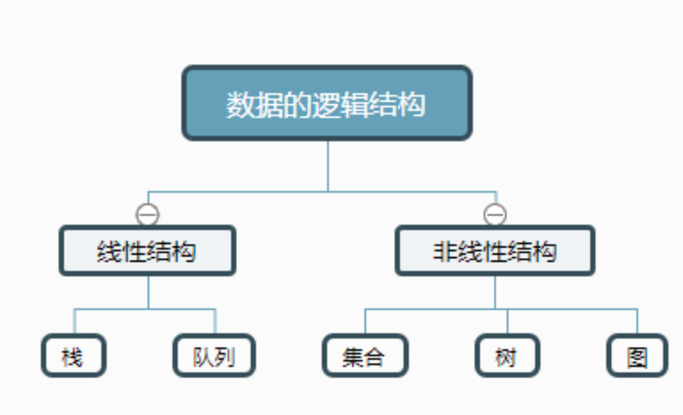

目录

- [复杂度](#复杂度)
  - [什么是复杂度分析](#什么是复杂度分析)
  - [为什么要进行复杂度分析](#为什么要进行复杂度分析)
  - [常用的复杂度分析方法](#常用的复杂度分析方法)
  - [时间复杂度](#时间复杂度)
  - [空间复杂度](#空间复杂度)
  - [其他复杂度](#其他复杂度)
- [数据结构](#数据结构)
  - [逻辑结构](#逻辑结构)
  - [存储结构](#存储结构)
  - [时间复杂度](#时间复杂度-1)
  - [数组](#数组)
    - [顺序线性表 Array List](#顺序线性表-array-list)
  - [链表](#链表)
  - [树和图](#树和图)
  - [哈希表](#哈希表)
  - [大小跟堆和可并堆](#大小跟堆和可并堆)
  - [字符串](#字符串)

# 复杂度

## 什么是复杂度分析

1. 数据结构与算法的作用是什么？
   - 数据结构与算法的诞生是让计算机执行得更快、更省空间
2. 用什么来评判数据结构与算法的好坏？
   - 可以从执行时间和占用空间两个方面来评判数据结构与算法的好坏
3. 什么是复杂度？
   - 用时间复杂度和空间复杂度来描述性能问题, 两者统称为复杂度
4. 复杂度描述了什么？
   - 复杂度描述的是算法执行时间(或占用空间)与数据规模的增长关系

## 为什么要进行复杂度分析

1. 复杂度分析和性能分析相比有什么有点？
   - 复杂度分析有不依赖于环境、成本低、效率高、易操作、指导性强的特点
2. 为什么要进行复杂度分析？
   - 复杂度描述的是算法执行时间(或占用空间)与数据规模的增长关系

## 常用的复杂度分析方法

一般而言, 应选择效率最高的算法, 以最大限度地介绍运行时间或占用空间. 

1. 什么方法可以进行复杂度分析？
    - 大 O 表示法
2. 什么是大 O 表示法？
    - 算法的执行时间与每行代码的执行次数成正比 `$T(n) = O(f(n))$`,
     其中 `$T(n)$` 表示算法执行总时间,  `$f(n)$` 表示每行代码执行总次数, 
     而 `$n$` 往往表示数据的规模
    - 大 O 表示法是一种特殊的表示法, 指出了随着输入的增加, 算法的运行和时间将以什么样的速度增加
    - 大 O 表示法指的并非算法以秒为单(时间)位的速度 
    - 大 O 表示法能够比较 **操作数**, 它指出了算法操作数的增速
    - 大 O 表示法指出了最糟糕情况下的运行时间
3. 大 O 表示法的特点？
    - 由于时间复杂度描述的是算法执行时间与数据规模的增长变化趋势, 
      常量阶、低阶以及系数实际上对这种增长趋势不产决定性影响, 
      所以在做时间复杂度分析时忽略这些项
4. 复杂度分析法则
    - 单段代码看频率: 看代码片段中循环代码的时间复杂度
    - 多段代码看最大: 如果多个 for 循环, 看嵌套循环最多的那段代码的时间复杂度
    - 嵌套代码求乘积: 循环、递归代码, 将内外嵌套代码求乘积取时间复杂度
    - 多个规模求加法: 假如有两个参数控制两个循环的次数, 那么这时就取二者复杂度相加
5. 常见的大 O 运行时间(由块到慢)
    - `$O(\log n)$` 
        - 对数时间(log time)
        - 例如: 二分查找
    - `$O(n)$` 
        - 线性时间(linear time)
        - 例如: 简单查找
    - `$O(n \cdot \log n)$`
        - 快速排序
    - `$O(n^{2})$` 
        - 选择排序
    - `$O(n!)$` 
        - 旅行商问题

## 时间复杂度

1. 什么是时间复杂度？
    - 所有代码的执行时间 T(n) 与每行代码的执行次数 n 成正比: `$T(n) = O(f(n))$`
2. 分析的三个方法
    - 最多法则：忽略掉公式中的常量、低阶、系数，取最大循环次数就可以了，也就是循环次数最多的那行代码
    - 加法法则：总复杂度等于循环次数最多的那段复杂度
    - 乘法法则：当遇到嵌套的 `for` 循环的时候，时间复杂度就是内外循环的乘积

## 空间复杂度

1. 什么是空间复杂度？
    - 表示算法存储空间与数据规模之间的增长关系
2. 最常见的空间复杂度
    - `$O(1)$`：常量级的空间复杂度表示方法，无论是一行代码，还是多行，只要是常量级的就用 O(1) 表示
    - `$O(n)$`
    - `$O(n^{2})$`
    - `$O(log n) | O(n log n)$`：对数阶空间复杂度，最难分析的一种空间复杂度
    - `$O(m+n)$`：加法法则
    - `$O(m \times n)$`：乘法法则

## 其他复杂度

1. 最好、最坏时间复杂度
    - 所谓的最好、最坏时间复杂度分别对应代码最好的情况和最坏的情况下的执行
2. 平均时间复杂度
    - 平均时间复杂度需要借助概率论的知识去分析，也就是我们概率论中所说的加权平均值，也叫做期望值
3. 均摊时间复杂度
    - 什么是均摊时间复杂度
        - 比如我们每 n 次插入数据的时间复杂度为 O(1)，就会有一次插入数据的时间复杂度为 O(n)，
          将这一次的时间复杂度平均到 n 次插入数据上，时间复杂度还是 O(1)
    - 适用场景
        - 一般应用于某一数据结构，连续操作时间复杂度比较低，但是个别情况时间复杂度特别高，
          将特别高的这一次进行均摊到较低的操作上
    - 几种复杂度性能对比
        - `$O(n^{2}) > O(n logn) > O(n) > O(logn)$`

# 数据结构

数据结构的三要素：

* 逻辑结构
* 存储结构
* 运算

逻辑结构是独立于存储结构的，数据的存储结构是逻辑结构在计算机上的映射，不能独立于逻辑结构

## 逻辑结构

## 存储结构

## 时间复杂度

算法原地工作所需额外的辅助空间为一个常量，即 空间辅复杂度为 `$O(1)$`。
其实可以理解为只要这个辅助空间可以用一个确定的常数来表示，
与问题规模 `$n$` 无关，就算开辟 100 个空间在空间复杂度上也算作是 `$O(1)$`

求时间复杂度可以理解为求循环最深处一共执行循环的次数，记为 `$t$` 次循环。
最后解出 `$t$` 就为时间复杂度, 因为 `$t$` 是一共执行的次数，即时间复杂度

## 数组

### 顺序线性表 Array List

线性表是由同类型数据元素构成有序序列的线性结构，表中元素个数称为线性表的长度，
线性表中没有元素时，称为空表。表的其实位置称为表头，表结束位置称为表尾。

顺序线性表就是内存中连续存放的线性表，可以理解为它额存放地址是一个数组

## 链表

## 树和图

## 哈希表

散列表
HashTable Map  Dict

## 大小跟堆和可并堆

## 字符串

* 字典树
* 后缀树

