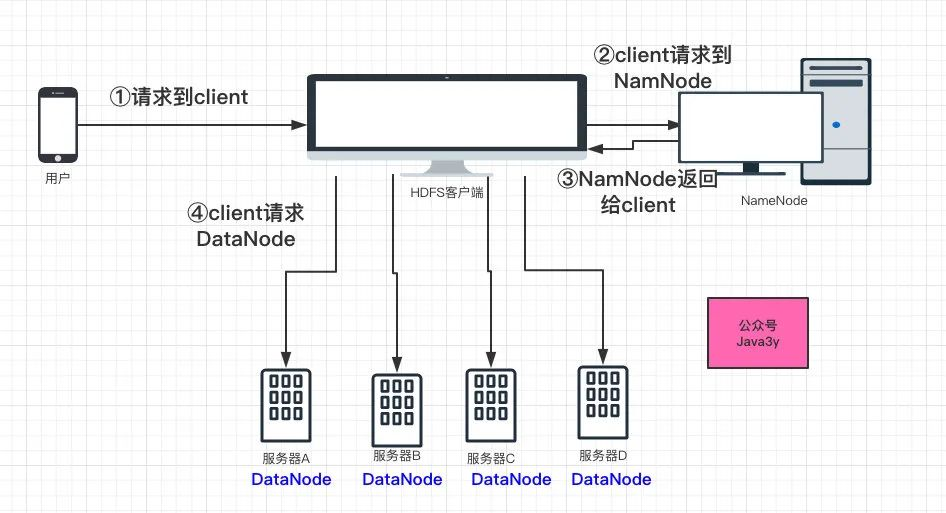
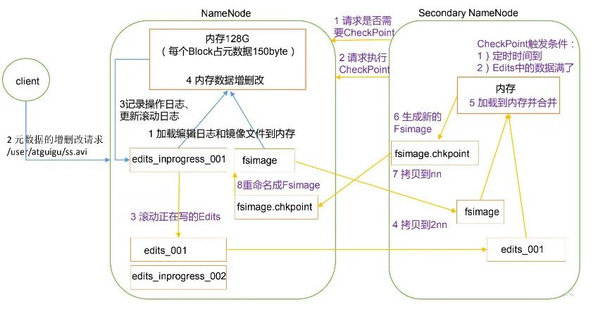

目录

- [HDFS 介绍](#hdfs-介绍)
- [HDFS 备份](#hdfs-备份)
- [NameNode](#namenode)
  - [editlog](#editlog)
  - [fsimage](#fsimage)
  - [SecondNameNode](#secondnamenode)
  - [ZooKeeper](#zookeeper)
  - [JournalNode](#journalnode)
- [DataNode](#datanode)
- [HDFS 文件操作](#hdfs-文件操作)

# HDFS 介绍

随着数据量越来越大，在一台机器上已经无法存储所有的数据了，那我们会将这些数据分配到不同的机器来进行存储，
但是这就带来一个问题：不方便管理。所以，希望有一个系统可以将这些分布在不同操作服务器上的数据进行统一管理，
这就有了分布式文件系统。HDFS 就是分布式文件系统的其中一种(目前用得最广泛的一种)

在使用 HDFS 的时候是非常简单的：虽然 HDFS 是将文件存储到不同的机器上，
但是使用的时候是把这些文件当做是存储在一台机器的方式去使用(背后却是多台机器在执行)。
好比，调用了一个 RPC 接口，给它参数，它返回了一个 response。RPC 接口做了什么事情其实不知道，
可能这个 RPC 接口又调用了其他的 RPC 接口，屏蔽掉实现细节，对用户友好。
HDFS 就是一个分布式文件系统，用来存储数据

HDFS 作为一个分布式文件系统，那么它的数据是保存在多个系统上的。例如：一个 1GB 的文件，
会被切分成几个小文件，每个服务器都会存放一部分，默认以 128MB 的大小来切分，每个 128MB 的文件，
在 HDFS 叫做块(block)

> 显然，这个 128MB 大小是可配的。如果设置为太小或者太大都不好。如果切分的文件太小，
> 那一份数据可能分布到多台的机器上(寻址时间就很慢)。如果切分的文件太大，
> 那数据传输时间的时间就很慢
> 
> PS：老版本默认是 64MB

一个用户发出了一个 1GB 的文件请求给 HDFS 客户端，HDFS 客户端会根据配置对这个文件进行切分，
所以 HDFS 客户端会切分为 8 个文件(也叫作 block)，然后每个服务器都会存储这些切分后的文件(block)。
现在假设每个服务器都存储两份，这些存放真实数据的服务器，在 HDFS 领域叫做 DataNode

现在问题来了，HDFS 客户端按照配置切分完以后，怎么知道往哪个服务器(DataNode)放数据呢？
这个时候，就需要另一个角色了，管理者 NameNode。
NameNode 实际上就是管理文件的各种信息(这种信息专业点我们叫做 MetaData 元数据)，
其中包括：文文件路径名，每个 Block 的 ID 和存放的位置等等。所以，无论是读还是写，
HDFS 客户端都会先去找 NameNode，通过 NameNode 得知相应的信息，再去找 DataNode

* 如果是写操作，HDFS 切分完文件以后，会询问 NameNode 应该将这些切分好的 block 往哪几台 DataNode 上写
* 如果是读操作，HDFS 拿到文件名，也会去询问 NameNode 应该往哪几台 DataNode 上读数据

# HDFS 备份

作为一个分布式系统(把大文件切分为多个小文件，存储到不同的机器上)，如果没有备份的话，
只要有其中的一台机器挂了，那就会导致数据是不可用状态的。Kafka 对 partition 备份，
ElasticSearch 对分片进行备份，而到 HDFS 就是对 Block 进行备份。

尽可能将数据备份到不同的机器上，即便某台机器挂了，那就可以将备份数据拉出来了。
这里的备份并不需要 HDFS 客户端去写，只要 DataNode 之间互相传递数据就好了

# NameNode

NameNode 是需要处理 HDFS 客户端请求的。因为它是存储元数据的地方，无论读写都需要经过它。
现在问题就来了，NameNode 是怎么存放元数据的呢？

* 如果 NameNode 只是把元数据放到内存中，那如果 NameNode 这台机器重启了，那元数据就没了
* 如果 NameNode 将每次写入的数据都存储到硬盘中，那如果只针对磁盘查找和修改又会很慢(因为这个是纯 IO 的操作)

## editlog

说到这里，又想起了 Kafka。Kafka 也是将 partition 写到磁盘里边的，
但人家是怎么写的？顺序 IO

NameNode 同样也是做了这个事：修改内存中的元数据，
然后把修改的信息 append(追加)到一个名为 `editlog` 的文件上。
由于 append 是顺序 IO，所以效率也不会低。现在我们增删改查都是走内存，
只不过增删改的时候往磁盘文件 `editlog` 里边追加一条。这样我们即便重启了 NameNode，
还是可以通过 `editlog` 文件将元数据恢复

## fsimage

现在也有个问题：如果 NameNode 一直长期运行的话，
那 `editlog` 文件应该会越来越大(因为所有的修改元数据信息都需要在这追加一条)。
重启的时候需要依赖 `editlog` 文件来恢复数据，如果文件特别大，那启动的时候不就特别慢了吗？
的确是如此的，那 HDFS 是怎么做的呢？

为了防止 `editlog` 过大，导致在重启的时候需要较长的时间恢复数据，
所以 NameNode 会有一个内存快照，叫做 `fsimage`。
这样一来，重启的时候只需要加载内存快照 fsimage + 部分的 editlog 就可以了。
想法很美好，现实还需要解决一些事：我什么时候生成一个内存快照 fsimage？
我怎么知道加载哪一部分的 editlog？

## SecondNameNode

问题看起来好像复杂，其实我们就只需要一个定时任务。如果让我自己做的话，
我可能会想：我们加一份配置，设置个时间就 OK 了

* 如果 `editlog` 大到什么程度或者隔了多长时间，我们就把 `editlog` 文件的数据跟内存快照 `fsiamge` 给合并起来。
  然后生成一个新的 fsimage，把 editlog 给清空，覆盖旧的 fsimage 内存快照
* 这样一来，NameNode 每次重启的时候，拿到的都是最新的 fsimage 文件，editlog 里边的都是没合并到 fsimage的。
  根据这两个文件就可以恢复最新的元数据信息了

HDFS 也是类似上面这样干的，只不过它不是在 NameNode 起个定时的任务跑，
而是用了一个新的角色：SecondNameNode。至于为什么？可能 HDFS 觉得合并所耗费的资源太大了，
不同的工作交由不同的服务器来完成，也符合分布式的理念

## ZooKeeper

现在问题还是来了，此时的架构 NameNode 是单机的。
SecondNameNode 的作用只是给 NameNode 合并 editlog 和 fsimage文件，
如果 NameNode 挂了，那 client 就请求不到了，而所有的请求都需要走 NameNode，
这导致整个 HDFS 集群都不可用了

于是我们需要保证 NameNode 是高可用的。一般现在我们会通过 Zookeeper 来实现。架构图如下：

## JournalNode

主 NameNode 和从 NameNode 需要保持元数据的信息一致，因为如果主 NameNode 挂了，
那从 NameNode 需要顶上，这时从 NameNode 需要有主 NameNode 的信息

所以，引入了 Shared Edits 来实现主从 NameNode 之间的同步，Shared Edits 也叫做 JournalNode。
实际上就是主 NameNode 如果有更新元数据的信息，它的 editlog 会写到 JournalNode，
然后从 NameNode 会在 JournalNode 读取到变化信息，然后同步。
从 NameNode 也实现了上面所说的 SecondNameNode 功能(合并 editlog 和 fsimage）

稍微总结一下：

* NameNode 需要处理 client 请求，它是存储元数据的地方
* NameNode 的元数据操作都在内存中，会把增删改以 editlog 持续化到硬盘中(因为是顺序 IO，所以不会太慢)
* 由于 editlog 可能存在过大的问题，导致重新启动 NameNode 过慢(因为要依赖 editlog 来恢复数据)，
  引出了 fsimage 内存快照。需要跑一个定时任务来合并 fsimage 和 editlog，引出了 SecondNameNode
* 又因为 NameNode 是单机的，可能存在单机故障的问题。所以我们可以通过 Zookeeper 来维护主从 NameNode，
  通过 JournalNode(Share Edits) 来实现主从 NameNode 元数据的一致性。最终实现 NameNode 的高可用

# DataNode

从上面我们就知道，我们的数据是存放在 DataNode 上的，还会备份。
如果某个 DataNode 掉线了，那 HDFS 是怎么知道的呢？
DataNode 启动的时候会去 NameNode 上注册，他俩会维持心跳，
如果超过时间阈值没有收到 DataNode 的心跳，那 HDFS 就认为这个 DataNode 挂了

还有一个问题就是：我们将 Block 存到 DataNode 上，那还是有可能这个 DataNode 的磁盘损坏了部分，
而我们 DataNode 没有下线，但我们也不知道损坏了。
一个 Block 除了存放数据的本身，还会存放一份元数据，包括数据块的长度，块数据的校验和，以及时间戳。
DataNode 还是会定期向 NameNode 上报所有当前所有 Block 的信息，
通过元数据就可校验当前的 Block 是不是正常状态

# HDFS 文件操作

HDFS 是一种文件系统, 专为 MapReduce 这类框架下的大规模分布式数据处理设计, 
可以把一个大数据集在 HDFS 中存储位单个文件, 而大多数其它的文件系统无力实现这一点 

HDFS 并不是一个天生的 Unix 文件系统, 不支持标准的 Unix 文件命令和操作; 
Hadoop 提供了一套与 Linux 文件命令类似的命令行工具, 即 Hadoop 操作文件的 Shell 命令, 
它们是与 HDFS 系统的主要接口

一个典型的 Hadoop 工作流会:  

* 在别的地方生成数据文件(如日志文件), 再将其复制到 HDFS 中 
* 接着由 MapReduce 程序处理这个数据, 但它们通常不会直接读任何一个 HDFS 文件, 
  相反, 它们依靠 MapReduce 框架来读取 HDFS 文件, 并将其解析为独立的记录(键值对),
  这些记录才是 MapReduce 程序所处理的数据单元, 除非需要定制数据的导入与导出, 
  否则几乎不必编程来读写 HDFS 文件

