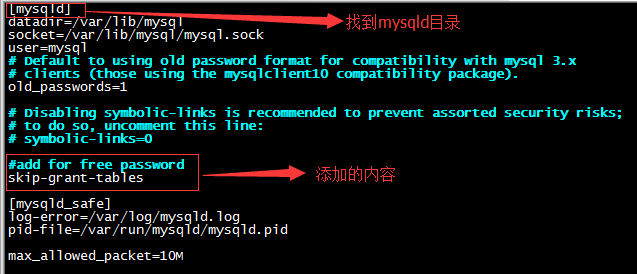

<style>
details {
    border: 1px solid #aaa;
    border-radius: 4px;
    padding: .5em .5em 0;
}

summary {
    font-weight: bold;
    margin: -.5em -.5em 0;
    padding: .5em;
}

details[open] {
    padding: .5em;
}

details[open] summary {
    border-bottom: 1px solid #aaa;
    margin-bottom: .5em;
}
img {
    pointer-events: none;
}
</style>


<details><summary>目录</summary><p>

- [MySQL 介绍](#mysql-介绍)
  - [DBS](#dbs)
  - [MySQL](#mysql)
  - [MySQL 存储引擎](#mysql-存储引擎)
    - [查看 MySQL 可用存储引擎](#查看-mysql-可用存储引擎)
    - [存储引擎比较及选择](#存储引擎比较及选择)
    - [修改存储引擎](#修改存储引擎)
- [MySQL 环境](#mysql-环境)
  - [Windows](#windows)
    - [服务启停和状态查看](#服务启停和状态查看)
    - [初始化设置](#初始化设置)
    - [启动和关闭 MySQL CLI](#启动和关闭-mysql-cli)
  - [Linux](#linux)
  - [MacOS](#macos)
    - [环境变量配置](#环境变量配置)
    - [服务启停和状态查看](#服务启停和状态查看-1)
    - [初始化设置](#初始化设置-1)
    - [启动和关闭 MySQL CLI](#启动和关闭-mysql-cli-1)
    - [配置](#配置)
- [MySQL 数据类型](#mysql-数据类型)
- [MySQL 运算符](#mysql-运算符)
- [MySQL 约束](#mysql-约束)
  - [主键约束](#主键约束)
    - [主键介绍](#主键介绍)
    - [主键规则](#主键规则)
    - [创建主键](#创建主键)
    - [删除主键](#删除主键)
  - [外键约束](#外键约束)
    - [外键介绍](#外键介绍)
    - [外键规则](#外键规则)
    - [创建外键](#创建外键)
    - [删除外键](#删除外键)
  - [唯一约束](#唯一约束)
- [MySQL 索引](#mysql-索引)
  - [索引介绍](#索引介绍)
    - [索引](#索引)
    - [为什么要使用索引](#为什么要使用索引)
    - [索引的优缺点](#索引的优缺点)
    - [索引的类型](#索引的类型)
  - [建立索引](#建立索引)
    - [创建索引的语法](#创建索引的语法)
    - [创建普通索引](#创建普通索引)
    - [创建唯一索引](#创建唯一索引)
  - [查看索引](#查看索引)
  - [删除索引](#删除索引)
    - [使用 `DROP INDEX` 语句](#使用-drop-index-语句)
    - [使用 `ALTER TABLE` 语句](#使用-alter-table-语句)
- [MySQL 数据库](#mysql-数据库)
- [MySQL 表](#mysql-表)
  - [临时表](#临时表)
    - [临时表介绍](#临时表介绍)
    - [MySQL 两种临时表](#mysql-两种临时表)
    - [MySQL 外部临时表](#mysql-外部临时表)
    - [Oracle](#oracle)
    - [SQL Server](#sql-server)
  - [多表关联更新](#多表关联更新)
  - [多表关联删除](#多表关联删除)
    - [删除某张表中的数据](#删除某张表中的数据)
    - [两表关联删除](#两表关联删除)
    - [三表关联删除](#三表关联删除)
  - [多表查询: 笛卡尔积](#多表查询-笛卡尔积)
  - [多个字段求最大值](#多个字段求最大值)
  - [Pivot 透视表](#pivot-透视表)
- [MySQL 游标](#mysql-游标)
  - [游标介绍](#游标介绍)
  - [游标使用](#游标使用)
  - [游标示例](#游标示例)
- [MySQL 变量](#mysql-变量)
- [MySQL 函数](#mysql-函数)
  - [日期时间函数](#日期时间函数)
  - [开窗函数](#开窗函数)
    - [分组排序](#分组排序)
    - [row\_number 实现](#row_number-实现)
- [MySQL 忘记 root 密码的完美解决方法](#mysql-忘记-root-密码的完美解决方法)
  - [更改 my.cnf 配置文件](#更改-mycnf-配置文件)
  - [更改 root 用户名](#更改-root-用户名)
- [参考](#参考)
</p></details><p></p>

# MySQL 介绍

## DBS

数据库系统(DataBase System)简称 DBS，DBS 是个大的概念，包括：

* 数据库(DataBase)简称 DB
    - DB 是专门存数据的集合。DB 是长期存储在计算机内的有组织、可共享的大量的数据集合。
      它可以供各种用户共享，具有最小冗余度和较高的数据独立性
* 数据库管理系统(DataBase Management System)简称 DBMS
    - DBMS 是由 DBA 对 DB 的查询、更新、删除、修改操作。DBMS 是用来操纵和管理 DB 的软件，用于建立、使用和维护 DB。
      它对 DB 进行统一的管理和控制，以保证 DB 的安全性和完整性，用户可以通过 DBMS 访问 DB 中的数据 
* 应用系统
* 数据库管理员(DataBase Administrator)简称 DBA
    - DBA 也可以通过 DBMS 进行 DB 的维护工作，它可使多个应用程序和用户拥有不同的方法在同时或不同时刻去建立、
      修改和询问 DB(也就是说 DBMS 可以将控制权发挥到极致(也就是所说的安全性)) 

DBS 中的“系统”是指能够提供一系列数据库相关服务组件的有机结合体。
它应该包括：DB、DBMS(以及开发工具)、应用系统、DBA 和用户构成。
所以联系就是 DBS 包括 DBMS 和 DB

目前占据中低端市场大半江山的 Oracle 就是数据库管理系统，
也称之为关系型数据库管理系统(Relational DataBase Management System)简称 RDBMS。
这里需要注意的是，虽然有时候把 Oracle、MySQL 等称之为数据库，但确切讲，
它们应该是数据库管理系统，即 DBMS

## MySQL

MySQL 是一个关系型数据库管理系统, 也是最流行的关系型数据库管理系统之一, 在 WEB 应用方面, 
MySQL 是最好的 RDBMS(Relational Database Management System, 关系数据库管理系统) 应用软件

MySQL 是一个开放源码的数据库管理系统(DBMS)。数据库管理系统有三个主要组成部分：

* 数据库(DB)：存储数据的地方
* 数据库管理系统(DBMS)：用于管理数据库的软件
* 数据库应用程序(DBAS)：为了提高数据库系统的处理能力所使用的管理数据库的软件补充

MySQL 链接数据库的方式：

* 操作系统
    - CMD 链接
    - ODBC API：给所有的数据库提供一个共同的接口
* Java API(JDBC)：Java 应用程序连接数据库的接口
* Python API：Python 下载接口连接
* ...

MySQL 版本：

* 社区版：完全免费，官方不提供技术支持
* 企业版：付费使用，支持 ACID，官方提供电话技术支持

MySQL 客户端：

* Navicat for MySQL
* MySQL workbench

## MySQL 存储引擎

MySQL 的核心是存储引擎，不同的存储引擎提供不同的存储机制，索引技巧，锁定水平，等功能。
在 MySQL 中，不需要在整个服务器中使用同一存储引擎，正对具体的要求，可以对每个表使用不同的存储引擎

### 查看 MySQL 可用存储引擎

```bash
mysql> show engines;
+--------------------+---------+----------------------------------------------------------------+--------------+------+------------+
| Engine             | Support | Comment                                                        | Transactions | XA   | Savepoints |
+--------------------+---------+----------------------------------------------------------------+--------------+------+------------+
| ARCHIVE            | YES     | Archive storage engine                                         | NO           | NO   | NO         |
| BLACKHOLE          | YES     | /dev/null storage engine (anything you write to it disappears) | NO           | NO   | NO         |
| MRG_MYISAM         | YES     | Collection of identical MyISAM tables                          | NO           | NO   | NO         |
| FEDERATED          | NO      | Federated MySQL storage engine                                 | NULL         | NULL | NULL       |
| MyISAM             | YES     | MyISAM storage engine                                          | NO           | NO   | NO         |
| PERFORMANCE_SCHEMA | YES     | Performance Schema                                             | NO           | NO   | NO         |
| InnoDB             | DEFAULT | Supports transactions, row-level locking, and foreign keys     | YES          | YES  | YES        |
| MEMORY             | YES     | Hash based, stored in memory, useful for temporary tables      | NO           | NO   | NO         |
| CSV                | YES     | CSV storage engine                                             | NO           | NO   | NO         |
+--------------------+---------+----------------------------------------------------------------+--------------+------+------------+
9 rows in set (0.00 sec)
```

### 存储引擎比较及选择

比较：

| 功能       | MyISAM | MEMORY | InnoDB | ARCHIVE |
|-----------|--------|--------|--------|----------|
| 存储限制    | 256TB  | RAM    | 64TB   | None    |
| 支持事务    | :negative_squared_cross_mark: | :negative_squared_cross_mark: | :white_check_mark: | :negative_squared_cross_mark: |
| 支持全文索引 | :white_check_mark: | :negative_squared_cross_mark: | :negative_squared_cross_mark: | :negative_squared_cross_mark: |
| 支持数索引   | :white_check_mark:| :white_check_mark: | :white_check_mark: | :negative_squared_cross_mark: |
| 支持哈希索引 | :negative_squared_cross_mark: | :white_check_mark: | :negative_squared_cross_mark: | :negative_squared_cross_mark: |
| 支持数据缓存 | :negative_squared_cross_mark: | N/A | :white_check_mark: | :negative_squared_cross_mark: |
| 支持外键    | :negative_squared_cross_mark: | :negative_squared_cross_mark: | :white_check_mark: | :negative_squared_cross_mark: |

选择：
 
| 存储引擎 | 选择时机 |
|---------|----|
| MyISAM  | 当数据表主要用来插入和查询数据 |
| MEMORY  | 当临时表存放数据，数据量不大，并且不需要较高的数据安全性(MySQL 中使用了该引擎作为临时表，存储查询中间信息)|
| InnoDB  | 当需要提交、回滚和崩溃恢复能力的事务安全能力，并且需要实现并发控制 |
| ARCHIVE | 当只有 INSERT 和 SELECT 操作时，支持高并发插入，但不是事务安全的，适合存储归档数据，如日志信息 |

存储引擎的选择不是完全随意的，父表与子表之间必须有相同的存储引擎；
并且只有 innodb 支持外键；只有两张表都是 innodb 引擎才能建立外键


### 修改存储引擎

修改用户的存储引擎：

* 修改 `\etc\my-default.cnf` 中的配置

修改数据库的存储引擎：


修改表的存储引擎：

```bash
mysql> alter table table_name engine=myisam;
```

# MySQL 环境

## Windows

### 服务启停和状态查看

```bash
# 开启 MySQL 服务
$ service mysqld start

# 关闭 MySQL 服务
$ service mysqld stop
$ mysqladmin -uroot -p123456 shutdown

# 检查端口是否运行
$ lsof -i:3306
```

### 初始化设置

```bash
# 方法 1
$ mysqladmin -u root -p123456 password 'abc123'

# 方法 2
mysql> set password for root@localhost = '123456';
mysql> exit;
```

### 启动和关闭 MySQL CLI

启动：

```bash
# 单实例登录
$ mysql -uroot -p123456

# 多实例登录
$ mysql -uroot -p123456 -S /data/3306/mysql.sock
```

关闭：

```
Ctrl + D

# or 
mysql> exit;
```

## Linux

1. 查看是否安装 MySQL

```bash
$ sudo dpkg -l | grep mysql
```

2. 安装 MySQL

```bash
$ sudo apt install mysql-server
```

如果安装时报错，无法获得锁，运行以下命令，强制解锁：

```bash
$ sudo rm /var/cache/apt/archives/lock
$ sudo rm /var/lib/dpkg/lock
```

3. 验证是否安装成功

```bash
$ netstat -tap | grep mysql
$ dpkg -l | grep mysql
```

4. 检查 MySQL 启动状态

```bash
$ systemctl status mysql
```

5. 查看登录密码

```bash
$ sudo cat /etc/mysql/debian.cnf
```

6. 登录 MySQL CLI

```bash
$ mysql -uroot -p
```

7. 修改密码

```bash
mysql> use mysql;
mysql> update mysql.user set authentication_string=password('your_new_pasword') where user='root' and Host ='localhost';
mysql> update user set plugin="mysql_native_password";
mysql> flush privileges;
```

8. 重启数据库

```bash
$ sudo service mysql restart
```

9. 设置允许远程连接

```bash
$ sudo vi /etc/mysql/mysql.conf.d/mysql.cnf
```

注释掉 `bind-address = 127.0.0.1`

10. 保存退出，然后登录 MySQL 服务，执行如下命令，
    其中 `connect_pasword` 建议与你本地的登录密码保持一致

```bash
mysql> grant all on *.* to root@'%' identified by 'connect_pasword' with grant option;
# 刷新权限
mysql> flush privileges;
```

11. 重启 mysql，远程客户端连接测试

注意：一定要重启，否则客户端连接可能会报错：2003 - Can’t connect to MySQL server on ‘192.168.186.131’ (10038)

## MacOS

### 环境变量配置

在终端切换到根目录, 编辑 `~/.zshrc` 或者 `~/.bash_profile`

```bash
$ cd ~
$ vim ~/.zshrc
```

在 `~/.zhsrc` 文件中添加配置项

```bash
export PATH=$PATH:/usr/local/mysql/bin
export PATH=$PATH:/usr/local/mysql/support-files
```

保存并启用配置项

```bash
:wq
$ source ~/.zshrc
$ echo $PATH
```

### 服务启停和状态查看

```bash
# 开启 MySQL 服务
$ sudo mysql.server start

# 停止 MySQL 服务
$ sudo mysql.server stop

# 重启 MySQL 服务
$ sudo mysql.server restart

# 查看 MySQL 服务状态
$ sudo mysql.server status
```

### 初始化设置

设置初始化密码，进入数据库 MySQL 数据库之后执行下面的语句，设置当前 root 用户的密码为 `123456`

```bash
# 方法 1
$ mysqladmin -u root -p123456 password 'abc123'

# 方法 2
mysql> set password for root@localhost = '123456';
mysql> exit;
```

### 启动和关闭 MySQL CLI

启动：

```bash
$ sudo mysql.server start
$ mysql -uroot -p123456
```

```bash
Welcome to the MySQL monitor.  Commands end with ; or \g.
Your MySQL connection id is 8
Server version: 8.0.17 MySQL Community Server - GPL

Copyright (c) 2000, 2019, Oracle and/or its affiliates. All rights reserved.

Oracle is a registered trademark of Oracle Corporation and/or its
affiliates. Other names may be trademarks of their respective
owners.

Type 'help;' or '\h' for help. Type '\c' to clear the current input statement.

mysql>
```

关闭：

```
Ctrl + D

# or 
mysql> exit;
```

查看 MySQL 版本：

```bash
mysql> select version();
```

```
+-----------+
| version() |
+-----------+
| 8.0.17    |
+-----------+
1 row in set (0.00 sec)
```

查看 MySQL 当前用户：

```bash
mysql> select user();
```

```
+----------------+
| user()         |
+----------------+
| root@localhost |
+----------------+
1 row in set (0.00 sec)
```

### 配置

MySQL 配置文件在 `/usr/local/mysql/support-files` 目录下

```bash
$ cd /etc

$ sudo touch my-default.cnf
$ sudo chmod -R 777 /etc/my-default.cnf
$ vim /Users/zfwang/Desktop/my-default.cnf
```

```
[mysqld]
default-storage-engine=INNODB
character-set-server=utf8
port = 3306

[client]
default-character-set=utf8
```

验证配置：

```bash
$ mysql -u root -p123456
$ mysql> show variables like '%char%';
```

```
+--------------------------+-----------------------------------------------------------+
| Variable_name            | Value                                                     |
+--------------------------+-----------------------------------------------------------+
| character_set_client     | utf8mb4                                                   |
| character_set_connection | utf8mb4                                                   |
| character_set_database   | utf8mb4                                                   |
| character_set_filesystem  | binary                                                    |
| character_set_results    | utf8mb4                                                   |
| character_set_server     | utf8mb4                                                   |
| character_set_system     | utf8                                                      |
| character_sets_dir       | /usr/local/mysql-8.0.17-macos10.14-x86_64/share/charsets/ |
+--------------------------+-----------------------------------------------------------+
8 rows in set (0.01 sec)
```

# MySQL 数据类型

* 整数
    - int： 4 字节
    - float：  4 字节
    - double： 8 字节
* 字符串
    - char
    - varchar
    - binary
    - blob
    - text
    - set
* 日期时间
    - year：1 字节
    - time： (hh:mi:ss) 3 字节
    - date： (yyyy-mm-dd) 3字节
    - datetime：(yyyy-mm-dd hh24:mi:ss) 8 字节
    - timestamp：(yyyy-mm-dd hh24:mi:ss) 4 字节
* 二进制
    - bit
    - binary
    - blob
    - longblob

# MySQL 运算符

* 算数运算符：+、-、*、/、%
* 比较运算符：
    - `=`
    - `!=`
    - `is null`
    - `is not null`
    - `in`
    - LikeRegexp 正则表达式匹配
* 逻辑运算符
    - `not`
    - `and`、`&&`
    - `or`、`||`
    - `xor`


# MySQL 约束

在 MySQL 中, 约束是指对表中数据的一种约束, 能够帮助数据库管理员更好地管理数据库, 
并且能够确保数据库中数据的正确性和有效性

在 MySQL 中, 主要支持以下 6 种约束: 

* **主键约束** (`PRIMARY KEY`)
    - 主键约束是使用最频繁的约束
    - 在设计数据表时, 一般情况下, 都会要求表中设置一个主键
    - 主键是表的一个特殊字段, 该字段能唯一标识表中的每条信息
    - 设置主键约束的字段不允许为空值
* **外键约束** (`FOREIGN KEY`)
    - 外键约束经常和主键一起使用, 用来确保数据的一致性
* **唯一约束**
    - 唯一约束与主键约束有一个相似的地方, 就是它们都能够确保列的唯一性
    - 与主键约束不同的是, 唯一约束在一个表中可以有多个, 
      并且设置唯一约束的列是允许有空值的, 虽然只能有一个空值
* **检查约束**
    - 检查约束是用来检查数据表中的字段值是否有效的一个手段
* **非空约束** (`NOT NULL`)
    - 非空约束用来约束表中的字段不能为空
* **默认值约束** (`DEFAULT`)
    - 默认值约束用来约束当数据表中某个字段不输入值时, 自动为其添加一个已经设置好的值
    - 默认值约束通常用在已经设置了非空约束的列, 这样能够防止数据表在录入数据时出现错误

以上 6 种约束中, 一个数据表中只能有一个主键约束, 其它约束可以有多个

## 主键约束

### 主键介绍

主键(`PRIMARY KEY`)的完整称呼是 "主键约束", 是 MySQL 中使用最为频繁的约束. 
一般情况下, 为了便于 DBMS 更快的查找到表中的记录, 都会在表中设置一个主键 

主键分为单字段主键和多字段联合主键, 本节将分别讲解这两种主键约束的创建、修改和删除 

### 主键规则

* 每个表只能定义一个主键
* 主键值必须唯一标识表中的每一行, 且不能为 `NULL`, 
  即表中不可能存在有相同主键值的两行数据. 这是唯一性原则
* 一个字段名只能在联合主键字段表中出现一次
* 联合主键不能包含不必要的多余字段。当把联合主键的某一字段删除后，
  如果剩下的字段构成的主键仍然满足唯一性原则, 那么这个联合主键是不正确的。
  这是最小化原则

### 创建主键

### 删除主键

## 外键约束

### 外键介绍

外键约束(`FOREIGN KEY`)是表的一个特殊字段, 经常与主键约束一起使用. 
对于两个具有关联关系的表而言, 相关联字段中主键所在的表就是主表(父表), 
外键所在的表就是从表(子表) 

外键用来建立主表与从表的关联关系, 为两个表的数据建立连接, 
约束两个表中数据的一致性和完整性。主表删除某条记录时, 
从表中与之对应的记录也必须有相应的改变. 

一个表可以有一个或多个外键, 外键可以为空值, 若不为空值, 
则每一个外键的值必须等于主表中主键的某个值 

### 外键规则

* 主表必须已经存在于数据库中, 或者是当前正在创建的表. 如果是后一种情况, 
  则主表与从表是同一个表, 这样的表称为自参照表, 这种结构称为自参照完整性
* 必须为主表定义主键
* 主键不能包含空值, 但允许在外键中出现空值. 也就是说, 只要外键的每个非空值出现在指定的主键中, 
  这个外键的内容就是正确的 
* 在主表的表名后面指定列名或列名的组合. 这个列或列的组合必须是主表的主键或候选键
* 外键中列的数目必须和主表的主键中列的数目相同
* 外键中列的数据类型必须和主表主键中对应列的数据类型相同

### 创建外键

在创建表时设置外键约束

```sql
[CONSTRAINT <外键名>] FOREIGN KEY 字段名 [, 字段名2, …]
REFERENCES <主表名> 主键列1 [, 主键列2, …]
```

在修改表时添加外键约束

```sql
ALTER TABLE <数据表名> 
ADD CONSTRAINT <外键名>
FOREIGN KEY(<列名>) 
REFERENCES <主表名> (<列名>);
```

### 删除外键

当一个表中不需要外键约束时, 就需要从表中将其删除. 
外键一旦删除, 就会解除主表和从表间的关联关系

```sql
ALTER TABLE <表名> 
DROP FOREIGN KEY <外键约束名>;
```

## 唯一约束

可以通过为表主键添加 `auto_increment` 关键字来实现字段自增；
默认的初始值是 1，每新增一条记录，字段值加1；一个表只有一个auto_increment约束

可以设置自增长序列的初始值为100：

```bash
mysql> create table db_test5(
           id int(11) primary key auto_increment,
           name varchar(24),
           deptID int(11), 
           salary float
       ) auto_increment=100;
```

可以设置自增长序列的步长为 40：

```bash
$ set auto_increment=40
```

# MySQL 索引

## 索引介绍

### 索引

索引是一种特殊的数据库结构, 由数据表中的一列或多列组合而成, 
可以用来快速查询数据表中有某一特定值的记录

通过索引, 查询数据时不用读完记录的所有信息, 而只是查询索引列. 
否则, 数据库系统将读取每条记录的所有信息进行匹配. 

可以把索引比作新华字典的音序表. 例如, 要查"库"字, 如果不使用音序, 
就需要从字典的 400 页中逐页来找. 但是, 如果提取拼音出来, 构成音序表, 
就只需要从 10 多页的音序表中直接查找. 这样就可以大大节省时间. 

> MySQL 会自动为所有表的主键进行索引, 但是外键字段必须由用户进行明确的索引

### 为什么要使用索引

索引就是根据表中的一列或若干列按照一定顺序建立的列值与记录行之间的对应关系表, 
实质上是一张描述索引列的列值与原表中记录行之间一一对应关系的有序表. 

索引是 MySQL 中十分重要的数据库对象, 是数据库性能调优技术的基础, 常用于实现数据的快速检索. 

在 MySQL 中, 通常有以下两种方式访问数据库表的行数据: 

- (1) 顺序访问
    - 顺序访问是在表中实行全表扫描, 从头到尾逐行遍历, 直到在无序的行数据中找到符合条件的目标数据. 
    - 顺序访问实现比较简单, 但是当表中有大量数据的时候, 效率非常低下. 例如, 在几千万条数据中查找少量的数据时, 
        使用顺序访问方式将会遍历所有的数据, 花费大量的时间, 显然会影响数据库的处理性能. 
- (2) 索引访问
    - 索引访问是通过遍历索引来直接访问表中记录行的方式. 
    - 使用这种方式的前提是对表建立一个索引, 在列上创建了索引之后, 查找数据时可以直接根据该列上的索引找到对应记录行的位置, 从而快捷地查找到数据. 索引存储了指定列数据值的指针, 根据指定的排序顺序对这些指针排序. 
        - 例如, 在学生基本信息表 tb_students 中, 如果基于 student_id 建立了索引, 系统就建立了一张索引列到实际记录的映射表. 当用户需要查找 student_id 为 12022 的数据的时候, 系统先在 student_id 索引上找到该记录, 然后通过映射表直接找到数据行, 并且返回该行数据. 因为扫描索引的速度一般远远大于扫描实际数据行的速度, 所以采用索引的方式可以大大提高数据库的工作效率. 


简而言之, 不使用索引, MySQL 就必须从第一条记录开始读完整个表, 直到找出相关的行. 
表越大, 查询数据所花费的时间就越多. 如果表中查询的列有一个索引, MySQL 就能快速到达一个位置去搜索数据文件, 
而不必查看所有数据, 这样将会节省很大一部分时间. 

### 索引的优缺点

索引有其明显的优势, 也有其不可避免的缺点. 

- 优点
    - 通过创建唯一索引可以保证数据库表中每一行数据的唯一性. 
    - 可以给所有的 MySQL 列类型设置索引. 
    - 可以大大加快数据的查询速度, 这是使用索引最主要的原因. 
    - 在实现数据的参考完整性方面可以加速表与表之间的连接. 
    - 在使用分组和排序子句进行数据查询时也可以显著减少查询中分组和排序的时间    
- 缺点
    - 创建和维护索引组要耗费时间, 并且随着数据量的增加所耗费的时间也会增加. 
    - 索引需要占磁盘空间, 除了数据表占数据空间以外, 每一个索引还要占一定的物理空间. 如果有大量的索引, 索引文件可能比数据文件更快达到最大文件尺寸. 
    - 当对表中的数据进行增加、删除和修改的时候, 索引也要动态维护, 这样就降低了数据的维护速度. 

.. note:: 

使用索引时, 需要综合考虑索引的优点和缺点. 

索引可以提高查询速度, 但是会影响插入记录的速度. 因为, 向有索引的表中插入记录时, 数据库系统会按照索引进行排序, 
这样就降低了插入记录的速度, 插入大量记录时的速度影响会更加明显. 这种情况下, 最好的办法是先删除表中的索引, 
然后插入数据, 插入完成后, 再创建索引. 

### 索引的类型

## 建立索引

MySQL 提供了三种创建索引的方法

### 创建索引的语法

(1)使用 `CREATE INDEX` 语句

```sql
CREATE <索引名> ON <表名> (<列名> [<长度>] [ ASC | DESC])
```
- 语法说明如下: 
    - `<索引名>`: 指定索引名. 一个表可以创建多个索引, 但每个索引在该表中的名称是唯一的. 
    - `<表名>`: 指定要创建索引的表名. 
    -` <列名>`: 指定要创建索引的列名. 通常可以考虑将查询语句中在 JOIN 子句和 WHERE 子句里经常出现的列作为索引列. 
    - `<长度>`: 可选项. 指定使用列前的 length 个字符来创建索引. 使用列的一部分创建索引有利于减小索引文件的大小, 节省索引列所占的空间. 在某些情况下, 只能对列的前缀进行索引. 索引列的长度有一个最大上限 255 个字节(MyISAM 和 InnoDB 表的最大上限为 1000 个字节), 如果索引列的长度超过了这个上限, 就只能用列的前缀进行索引. 另外, BLOB 或 TEXT 类型的列也必须使用前缀索引. 
    - `ASC|DESC`: 可选项. ASC指定索引按照升序来排列, DESC指定索引按照降序来排列, 默认为ASC. 

(2)使用 `CREATE TABLE`  语句

```sql
-- 在 CREATE TABLE 语句中添加此语句, 表示在创建新表的同时创建该表的主键. 
CONSTRAINT PRIMARY KEY [索引类型] (<列名>,…)

-- 在 CREATE TABLE 语句中添加此语句, 表示在创建新表的同时创建该表的索引. 
KEY | INDEX [<索引名>] [<索引类型>] (<列名>,…)

-- 在 CREATE TABLE 语句中添加此语句, 表示在创建新表的同时创建该表的唯一性索引. 
UNIQUE [ INDEX | KEY] [<索引名>] [<索引类型>] (<列名>,…)

-- 在 CREATE TABLE 语句中添加此语句, 表示在创建新表的同时创建该表的外键. 
FOREIGN KEY <索引名> <列名>
```

.. note:: 
在使用 CREATE TABLE 语句定义列选项的时候, 可以通过直接在某个列定义后面添加 PRIMARY KEY 的方式创建主键. 
而当主键是由多个列组成的多列索引时, 则不能使用这种方法, 只能用在语句的最后加上一个 PRIMARY KRY(<列名>, …) 
子句的方式来实现. 

(3)使用 `ALTER TABLE` 语句

```sql
-- 在 ALTER TABLE 语句中添加此语法成分, 表示在修改表的同时为该表添加索引. 
ADD INDEX [<索引名>] [<索引类型>] (<列名>,…)

-- 在 ALTER TABLE 语句中添加此语法成分, 表示在修改表的同时为该表添加主键. 
ADD PRIMARY KEY [<索引类型>] (<列名>,…)

-- 在 ALTER TABLE 语句中添加此语法成分, 表示在修改表的同时为该表添加唯一性索引. 
ADD UNIQUE [ INDEX | KEY] [<索引名>] [<索引类型>] (<列名>,…)

-- 在 ALTER TABLE 语句中添加此语法成分, 表示在修改表的同时为该表添加外键. 
ADD FOREIGN KEY [<索引名>] (<列名>,…)
```

示例：

```sql
-- ==================================================
-- 创建索引
-- ==================================================
USE classicmodels;

EXPLAIN SELECT 
    a.employeeNumber,
    a.lastName,
    a.firstName
FROM employees as a
WHERE a.jobTitle = "Sales Rep";

CREATE INDEX jobTitle ON employees (jobTitle);

EXPLAIN SELECT 
    a.employeeNumber,
    a.lastName,
    a.firstName
FROM employees as a
WHERE a.jobTitle = "Sales Rep";

SHOW INDEXES FROM employees;
```

### 创建普通索引

创建普通索引时, 通常使用 INDEX 关键字. 

```sql
CREATE TABLE table_name (
    id INT NOT NULL,
    name CHAR(45) DEFAULT NULL,
    dept_id INT DEFAULT NULL,
    age INT DEFAULT NULL,
    height INT DEFAULT NULL,
    INDEX(height)
);
```

### 创建唯一索引

创建唯一索引, 通常使用 UNIQUE 参数. 

```sql

    CREATE TABLE table_name (
        id INT NOT NULL,
        name CHAR(45) DEFAULT NULL,
        dept_id INT DEFAULT NULL,
        age INT DEFAULT NULL,
        height INT DEFAULT NULL,
        UNIQUE INDEX(height)
    );
```

## 查看索引

索引创建完成后, 可以利用 SQL 语句查看已经存在的索引. 
在 MySQL 中, 可以使用 SHOW INDEX 语句查看表中创建的索引. 

```sql
SHOW INDEX FROM <表名> [ FROM <数据库名>]
```

## 删除索引

删除索引是指将表中已经存在的索引删除掉. 不用的索引建议进行删除, 
因为它们会降低表的更新速度, 影响数据库的性能. 
对于这样的索引, 应该将其删除. 


### 使用 `DROP INDEX` 语句

```slq
DROP INDEX <索引名> ON <表名>
```

### 使用 `ALTER TABLE` 语句

根据 ALTER TABLE 语句的语法可知, 该语句也可以用于删除索引. 
具体使用方法是将 `ALTER TABLE` 语句的语法中部分指定为以下子句中的某一项. 

- DROP PRIMARY KEY: 表示删除表中的主键. 一个表只有一个主键, 主键也是一个索引. 
- DROP INDEX index_name: 表示删除名称为 index_name 的索引. 
- DROP FOREIGN KEY fk_symbol: 表示删除外键. 

示例：

```sql
-- ==================================================
-- 删除索引
-- ==================================================
CREATE TEMPORARY TABLE leads (
    lead_id INT auto_increment,
    first_name VARCHAR(255) NOT NULL,
    last_name VARCHAR(255) NOT NULL,
    email VARCHAR(255) NOT NULL,
    information_source VARCHAR(255),
    INDEX name(first_name, last_name),
    UNIQUE email(email),
    PRIMARY KEY(lead_id)
);

-- 删除索引
DROP INDEX name ON leads;

DROP INDEX email ON leads
ALGORITHM = COPY
LOCK DEFAULT;

-- 删除主键
DROP INDEX `PRIMARY` ON leads;

SHOW INDEXES FROM leads;
```

# MySQL 数据库

* TODO

# MySQL 表

## 临时表

### 临时表介绍

* 临时表在需要保存一些临时数据时是非常有用的
* 临时表只在当前连接可见，当关闭连接时，MySQL 会自动删除表并释放所有空间
* 使用其他 MySQL 客户端程序连接 MySQL 数据库服务器来创建临时表时，
  只有在关闭客户端程序时才会销毁临时表，当然也可以手动删除

### MySQL 两种临时表

* 外部临时表
    - 通过 `CREATE TEMPORARY TABLE` 创建的临时表，这种临时表称为外部临时表
    - 外部临时表只对当前用户可见，当前会话结束的时候，该临时表会自动关闭
    - 外部临时表的命名与非临时表可以同名，同名后非临时表将对当前会话不可见，直到临时表被删除
* 内部临时表
    - 内部临时表是一种特殊轻量级的临时表，用来进行性能优化。这种临时表会被 MySQL 自动创建并用来存储某些操作的中间结果
      这些操作可能包括在优化阶段或者执行阶段
    - 内部临时表对用户来说是不可见的，但是通过 `EXPLAIN` 或者 `SHOW STATUS` 可以查看 MySQL 是否使用了内部临时表用来帮助完成某个操作
    - 内部临时表在 SQL 语句的优化过程中扮演着非常重要的角色，MySQL 中的很多操作都要依赖于内部临时表来进行优化。
      但是使用内部临时表需要创建表以及中间数据的存取代价，所以用户在写 SQL 语句的时候应该尽量的去避免使用临时表
    - 内部临时表有两种类型：
        - 一种是 HEAP 临时表，这种临时表的所有数据都会存在内存中，对于这种表的操作不需要 IO 操作
        - 另一种是 OnDisk 临时表，顾名思义，这种临时表会将数据存储在磁盘上。
         OnDisk 临时表用来处理中间结果比较大的操作。
         如果 HEAP 临时表存储的数据大于 `MAX_HEAP_TABLE_SIZE`(详情请参考 MySQL 手册中系统变量部分)，
         HEAP 临时表将会被自动转换成 OnDisk 临时表。
         OnDisk 临时表在 MySQL 5.7 中可以通过 `INTERNAL_TMP_DISK_STORAGE_ENGINE` 系统变量选择使用 MyISAM 引擎或者 InnoDB 引擎

### MySQL 外部临时表

外部临时表是通过 `CREATE TEMPORARY TABLE` 来创建的，
但是 `SHOW TABLES` 命令显示数据表列表时，无法看到创建的外部临时表。
在退出当前会话后，临时表就会被自动销毁，当然也可以用 `DROP TABLE` 手动销毁

外部临时表支持的引擎类型：

* Memory(HEAP)
* MyISAM
* Merge
* Innodb
* 不支持 MySQL Cluster(簇)

创建语法：

```sql
CREATE TEMPORARY TABLE tab (
    -- ...
);
```

删除语法：

```sql
DROP TABLE tab;
```

外部临时表使用时注意以下几点：

1. 自己所用的数据库账号要有建立临时表的权限
2. 在同一条 SQL 中，不能关联两次相同的临时表，不然会报错

```bash
mysql> select * from temp_table, temp_table as t2
    error 1137: can't reopen table: 'temp_table'
```

3. 外部临时表在建立连接时可见，关闭时会清除空间，删除临时表
4. `SHOW TABLES` 不会列出临时表
5. 不能使用 `RENAME` 重新命名临时表，但是可以 `ALTER TABLE`

```sql
ALTER TABLE old_temp_table_name RENAME new_temp_table_name;
```

6. 外部临时表影响使用 `replication` 功能
7. 如果为一个临时表声明了别名，当指向这个表的时候，就必须使用别名


### Oracle

```sql
WITH temp1 as (
    -- ...
)
,temp2 as (
    -- ...
)
```

### SQL Server

创建：

```sql
IF OBJECTID tab IS NOT NOT NULL BEGIN DROP TABLE tab END
-- ...
```

删除：

```sql
DROP TABLE tab
```

## 多表关联更新

问题描述：现有 `tdb_goods` 表(含有具体信息)和 `tdb_goods_cates` 表(没有具体信息)，
需要查询 `tdb_goods` 表的所有记录，并且按"类别"分组，且将分组结果写入到 `tdb_goods_cates` 数据表。
然后通过 `tdb_goods_cates` 数据表来更新 `tdb_goods` 表

```sql
-- 查询 tdb_goods 表的所有记录，并且按"类别"分组
SELECT goods_cate
FROM tdb_goods 
GROUP BY goods_cate;

-- 将分组结果写入到 tdb_goods_cates 数据表
INSERT tdb_goods_cates (cate_name)
SELECT goods_cate
FROM tdb_goods
GROUP BY goods_cate;

-- 通过 tdb_goods_cates 数据表来更新 tdb_goods 表
UPDATE tdb_goods
INNER JOIN tdb_goods_cates
    ON goods_cate == cate_name
SET goods_cate = cate_id;
```

## 多表关联删除

### 删除某张表中的数据

从数据表 `t1` 中把那些 `id` 值在数据表 `t2` 里有匹配的记录全删除掉

```sql
DELETE t1 
FROM t1，t2 
WHERE t1.id = t2.id;

-- or

DELETE FROM t1 
USING t1，t2 
WHERE t1.id = t2.id;
```

从数据表 `t1` 里在数据表 `t2` 里没有匹配的记录查找出来并删除掉

```sql
DELETE t1 
FROM t1 
LEFT JOIN t2 
    ON t1.id = t2.id
WHERE t2.id IS NULL

-- or

DELETE FROM t1 
USING t1 
LEFT JOIN t2 
    ON t1.id = t2.id 
WHERE t2.id IS NULL
```

### 两表关联删除

从两个表中找出相同记录的数据，并把两个表中的数据都删除掉

```sql
DELETE t1，t2 
FROM t1 
LEFT JOIN t2 
    ON t1.id = t2.id 
WHERE t1.id = 25

-- or

DELETE a, b 
FROM table1 a 
INNER JOIN table2 b 
    ON a.id = b.aid 
WHERE a.id = '1';

-- or

DELETE a, b 
FROM table1 a, table2 b 
WHERE a.id = b.aid AND a.id = '1';
```

### 三表关联删除

```sql
DELETE a, b, c 
FROM table1 a 
INNER JOIN table2 b 
    ON a.id = b.aid
INNER JOIN table3 c 
    ON a.id = c.aid 
WHERE a.id = '1';
```

不过这样有一个问题，就是如果 a 表里数据，而 b 表或者 c 表里没数据，
那么整个删除就失败，即删除 0 条数据

如果主表一定有数据，而关联的表有可能有数据也有可能没数据的话，
可以通过左连接删除的方式，把两张表都删除。无论关联的表有没有数据，
主表都可以删除成功

```sql
DELETE a, b, c 
FROM table1 a 
LEFT JOIN table2 b 
    ON a.id = b.aid
LEFT JOIN table3 c 
    ON a.id = c.aid 
WHERE a.id = 1
```

## 多表查询: 笛卡尔积

```sql
select *
from temp1 a, temp2 b
WHERE A.var1 = b.var2
```

## 多个字段求最大值

```sql
create table #Demo(
    Guid varchar(50) not null default newid() primary key,
    Date1 datetime null,
    Date2 datetime null,
    Date3 datetime null
)

insert into #Demo(Date1, Date2, Date3) 
values
    ('2016-9-5','2016-8-6','2016-10-9'),
    ('2015-5-6','2015-8-6','2015-6-3'),
    ('2016-10-6','2015-6-6','2016-9-6')

select * from #Demo

-- ***********************
-- method 1 
-- ***********************
select 
    Guid,
    (
        select Max(NewDate) 
        from (values (Date1), (Date2), (Date3)) as #temp (NewDate)
    ) as MaxDate 
from #Demo

-- ***********************
-- method 2 
-- ***********************
select 
    Guid, 
    max(NewDate) MaxDate 
from #Demo 
unpivot (NewDate for DateVal in (Date1, Date2, Date3)) as u 
group by Guid
```

## Pivot 透视表

方法一：

```sql
SELECT 
    A.YEARS,
    SUM(ORDERCOUNT_1) AS 第一季度,
    SUM(ORDERCOUNT_2) AS 第二季度,
    SUM(ORDERCOUNT_3) AS 第三季度,
    SUM(ORDERCOUNT_4) AS 第四季度
FROM (
    SELECT 
        A.YEARS,
        A.SEASON,
        CASE WHEN A.SEASON = '一季度' THEN A.ORDERCOUNT END AS ORDERCOUNT_1,
        CASE WHEN A.SEASON = '二季度' THEN A.ORDERCOUNT END AS ORDERCOUNT_2,
        CASE WHEN A.SEASON = '三季度' THEN A.ORDERCOUNT END AS ORDERCOUNT_3,
        CASE WHEN A.SEASON = '四季度' THEN A.ORDERCOUNT END AS ORDERCOUNT_4
    FROM tinker.year_season_ordercount A
) A
GROUP BY 
    A.YEARS;
```

方法二：

```sql
SELECT
    A.YEARS,
    SUM(IF(A.SEASON = '一季度', A.ORDERCOUNT, NULL)) AS '第一季度',
    SUM(IF(A.SEASON = '二季度', A.ORDERCOUNT, NULL)) AS '第二季度',
    SUM(IF(A.SEASON = '三季度', A.ORDERCOUNT, NULL)) AS '第三季度',
    SUM(IF(A.SEASON = '四季度', A.ORDERCOUNT, NULL)) AS '第四季度'
FROM tinker.year_season_ordercount A
GROUP BY A.YEARS;
```

# MySQL 游标

## 游标介绍

一条 SQL, 对应 N 条资源, 取出资源的接口, 就是游标, 
沿着游标, 可以一次取出 1 行 

## 游标使用

声明:

```sql
declare cursor_name cursor for select_statement;
```

打开游标:

```sql
open cursor_name;
```

从游标中取值:

```sql
fetch cursor into var1, var2[,...]
```

关闭游标:

```sql
close cursor;
```

## 游标示例

```sql
-- 创建存储过程
create procedure p12()
begin

-- 定义三个变量用于存放商品 id, 商品名称, 商品库存量
declare row_gid int ; 
declare row_name varchar(20);
declare row_num int;

-- 定义游标
declare getgoods cursor for 
select gid, name, num 
from goods;

-- 打开游标
open getgoods; 

-- 从游标中取值
fetch getgoods into row_gid, row_name, row_num;

-- 显示操作
select row_name, row_num;

-- 关闭游标
close getgoods;

end$
```

# MySQL 变量


# MySQL 函数

## 日期时间函数

```sql
YEAR()
MONTH()
DAY()
WEEK()
WEEKDAY()
```

## 开窗函数

支持 oracle, MySQL(>=8.0)

### 分组排序

```sql
-- 分组排序
row_number() over(partition by field_name order by field_name) as rankid

-- 排序
rank() over(partition by var1 order by var1)
dense_rank() over(partition by var2 order by var2)
```

### row_number 实现

MySQL(<8.0)使用会话变量(session variables) 实现 `row_number() over(partition by var1 order by var2)`

示例数据如下：

```sql
SELECT
    customerNumber, 
    paymentDate, 
    amount
FROM
    payments
ORDER BY 
   customerNumber;
```


实现 `row_number() over(partition by var1 order by var2)`：

```sql
-- adding a row number for each row
SET @row_number = 0;
SELECT
    (@row_number:=@row_number + 1) AS rankid,
    firstName,
    lastName
FROM employees
ORDER BY firstName, lastName
LIMIT 5;

-- adding a row number to each group
SET @row_number := 0;
SELECT
    @row_number:=CASE 
        WHEN @customer_no = customerNumber 
            THEN 
                @row_number + 1 
            ELSE 
                1 
        END AS num, 
    @customer_no:=customerNumber as customerNumber,
    paymentDate,
    amount
FROM payments
ORDER BY customerNumber;
```


# MySQL 忘记 root 密码的完美解决方法

> Linux

通常在使用 MySQL 数据库时，如果长时间没有登陆，或者由于工作交接完成度不高，
会导致数据库 root 登陆密码忘记，本文给大家介绍一种当忘记 MySQL root 密码时的解决办法

## 更改 my.cnf 配置文件

1. 用命令编辑 `/etc/my.cnf` 配置文件


2. 在 `[mysqld]` 下添加 `skip-grant-tables`，然后保存并退出



3. 重启 MySQL 服务：

```bash
$ service mysqld restart
```

## 更改 root 用户名

1. 重启以后，执行 `mysql` 命令，进入 MySQL 命令行

```bash
$ mysql
```


2. 修改 root 用户密码

```bash
$ mysql> UPDATE mysql.user SET Password=PASSWORD('new_password') WHERE USER='root';
$ mysql> flush privileges;
$ exit
```

3. 把 `/etc/my.cnf` 中的 `skip-grant-tables` 注释掉，
   然后重启 MySQL，即：

```bash
$ service mysqld restart
```

# 参考

* [MySQL 教程](http://c.biancheng.net/mysql/)
* [MySQL Tutorial](https://www.mysqltutorial.org/)
* [MySQL中的两种临时表](https://www.cnblogs.com/duanxz/p/3724120.html)
* [MySQL ROW_NUMBER, This is How You Emulate It](https://www.mysqltutorial.org/mysql-row_number/)
* [Mysql 忘记root密码的完美解决方法](https://www.jb51.net/article/100925.htm)
* [关于mysql数据库在输入密码后，滴的一声直接退出界面的解决办法](https://www.2cto.com/database/201412/361751.html)
* [Ubuntu 16.04安装MySQL及问题解决](https://www.linuxidc.com/Linux/2017-05/143861.htm)
* [数据库八股文背诵版](https://zhuanlan.zhihu.com/p/366840427)
* [主流数据库](https://zhuanlan.zhihu.com/p/70361894)
* [为什么MySQL数据库数据量大了要进行分库分表](https://www.zhihu.com/question/459955079/answer/1904557377)
