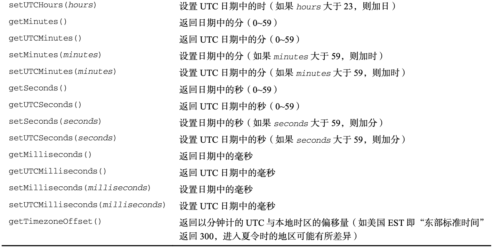

<style>
h1 {
  background-color: #2B90B6;
  background-image: linear-gradient(45deg, #4EC5D4 10%, #146b8c 20%);
  background-size: 100%;
  -webkit-background-clip: text;
  -moz-background-clip: text;
  -webkit-text-fill-color: transparent;
  -moz-text-fill-color: transparent;
}
h2 {
  background-color: #2B90B6;
  background-image: linear-gradient(45deg, #4EC5D4 10%, #146b8c 20%);
  background-size: 100%;
  -webkit-background-clip: text;
  -moz-background-clip: text;
  -webkit-text-fill-color: transparent;
  -moz-text-fill-color: transparent;
}

details {
    border: 1px solid #aaa;
    border-radius: 4px;
    padding: .5em .5em 0;
}

summary {
    font-weight: bold;
    margin: -.5em -.5em 0;
    padding: .5em;
}

details[open] {
    padding: .5em;
}

details[open] summary {
    border-bottom: 1px solid #aaa;
    margin-bottom: .5em;
}
img {
    pointer-events: none;
}
</style>

<details><summary>目录</summary><p>

- [概览](#概览)
- [Date](#date)
  - [创建日期对象](#创建日期对象)
    - [new Date()](#new-date)
    - [new Date(Date.parse())](#new-datedateparse)
    - [new Date(Date.UTC())](#new-datedateutc)
    - [Date.now()](#datenow)
  - [继承的方法](#继承的方法)
  - [日期格式化方法](#日期格式化方法)
  - [日期/时间组件方法](#日期时间组件方法)
- [RegExp](#regexp)
  - [正则表达式语法](#正则表达式语法)
    - [字面量语法](#字面量语法)
      - [pattern](#pattern)
      - [flat](#flat)
      - [示例](#示例)
    - [元字符](#元字符)
    - [构造函数语法](#构造函数语法)
      - [pattern](#pattern-1)
      - [flag](#flag)
  - [RegExp 实例属性](#regexp-实例属性)
  - [RegExp 实例方法](#regexp-实例方法)
  - [RegExp 构造函数属性](#regexp-构造函数属性)
  - [模式局限](#模式局限)
- [Function](#function)
- [原始值包装类型](#原始值包装类型)
  - [原始包装类型简介](#原始包装类型简介)
    - [原始值调用方法的原理](#原始值调用方法的原理)
    - [引用类型和原始包装类型的区别](#引用类型和原始包装类型的区别)
    - [Object 构造函数创建原始包装类型实例](#object-构造函数创建原始包装类型实例)
    - [转型函数与原始包装类型构造函数](#转型函数与原始包装类型构造函数)
    - [原始包装类型的用途](#原始包装类型的用途)
  - [Boolean](#boolean)
    - [Boolean 引用类型对象](#boolean-引用类型对象)
    - [valueOf()](#valueof)
    - [toString()](#tostring)
    - [原始值与引用值的区别](#原始值与引用值的区别)
  - [Number](#number)
    - [Number 引用类型对象](#number-引用类型对象)
    - [重写方法](#重写方法)
    - [格式化数值为字符串](#格式化数值为字符串)
    - [原始值与引用值的区别](#原始值与引用值的区别-1)
    - [isInteger() 方法](#isinteger-方法)
    - [isSafeInteger() 方法](#issafeinteger-方法)
  - [String](#string)
    - [String 引用类型对象](#string-引用类型对象)
    - [重写方法](#重写方法-1)
    - [length 属性](#length-属性)
    - [JavaScript 字符](#javascript-字符)
      - [length](#length)
      - [charAt()](#charat)
      - [charCodeAt()](#charcodeat)
      - [fromCharCode()](#fromcharcode)
    - [normalize() 方法](#normalize-方法)
    - [字符串操作方法](#字符串操作方法)
      - [字符串拼接](#字符串拼接)
      - [字符串提取](#字符串提取)
    - [字符串位置方法](#字符串位置方法)
    - [字符串包含方法](#字符串包含方法)
    - [trim() 方法](#trim-方法)
    - [repeat() 方法](#repeat-方法)
    - [padStart() 和 padEnd() 方法](#padstart-和-padend-方法)
    - [字符串迭代与解构](#字符串迭代与解构)
    - [字符串大小写转换](#字符串大小写转换)
    - [字符串模式匹配方法](#字符串模式匹配方法)
    - [localeCompare() 方法](#localecompare-方法)
    - [HTML 方法](#html-方法)
- [单例内置对象](#单例内置对象)
  - [Global](#global)
    - [URL 编码方法](#url-编码方法)
    - [eval() 方法](#eval-方法)
    - [Global 对象属性](#global-对象属性)
    - [window 对象](#window-对象)
  - [Math](#math)
    - [Math 对象属性](#math-对象属性)
    - [Math.min() 和 Math.max() 方法](#mathmin-和-mathmax-方法)
    - [舍入方法](#舍入方法)
    - [Math.random() 方法](#mathrandom-方法)
    - [其他方法](#其他方法)
</p></details><p></p>


# 概览

* 引用值
    - 引用值(或者对象)是某个特定**引用类型**的实例
* 引用类型
    - 在 ECMAScript 中，引用类型是把数据和功能组织到一起的结构，经常被人错误地称作“类”
    - 引用类型虽然有点像类，但跟类并不是一个概念
    - 虽然从技术上讲 JavaScript 是一门面向对象语言，但 ECMAScript 缺少传统的面向对象语言所具备的某些基本结构，包括类和接口
    - 引用类型有时候也被称为**对象定义**，因为它们描述了自己的对象应有的属性和方法
* 对象
    - 对象被认为是某个**特定引用类型**的实例
    - 新对象通过使用 `new` 操作符后跟一个**构造函数(constructor)**来构建。构造函数就是用来创建新对象的函数
* 原生引用类型: ECMAScript 提供了很多的**原生引用类型**，帮助开发者实现常见的任务
    - `Date`
    - `Regexp`
    - `Function`


# Date

ECMAScript 的 `Date` 类型参考了 Java 早期版本中的 `java.util.Date`。
为此，`Date` 类型将日期保存为自协调世界时(UTC，Universal Time Coordinated)时间 
1970 年 1 月 1 日午夜(零时)至今所经过的毫秒数。
使用这种存储格式，`Date` 类型可以精确表示 1970 年 1 月 1 日之前及之后 285616 年的日期

## 创建日期对象

* `new Date()`
* 要基于其他日期和时间创建日期对象，比如传入其毫秒表示(UNIX 纪元 1970 年 1 月 1 日 午夜之后的毫秒数)，
  ES 为此提供了两个辅助函数
    - `new Date(Date.parse())`
    - `new Date(Date.UTC())`

### new Date()

* 在不给 `Date` 构造函数传参数的情况下，创建的对象将保存当前日期和时间

```js
// 当前日期和时间
let now = new Date();
```

### new Date(Date.parse())

* `Date.parse()` 接收一个表示日期的字符串参数，尝试将这个字符串转换为表示该日期的毫秒数。
  ECMA-262 第 5 版定义了 `Date.parse()` 应该支持的日期格式，所有实现都必须支持下列日期格式
    - "月/日/年"，如:
        - `"5/23/2019"`
    - "月名 日, 年"，如:
        - `"May 23, 2019"`
    - "周几 月名 日 年 时:分:秒 时区"，如: 
        - `"Tue May 23 2019 00:00:00 GMT-0700"`
    - ISO 8601 扩展格式 "YYYY-MM-DDTHH:mm:ss.sssZ"，如: 
        - `"2019-05-23T00:00:00"`
* 如果传给 `Date.parse()` 的字符串并不表示日期，则该方法会返回 `NaN`
* 如果直接把表示日期的字符串传给 `Date` 构造函数，那么 `Date` 会在后台调用 `Date.parse()`

```js
let someDate = new Date(Date.parse("May 23, 2019"));
// 等价
let someDate = new Date("May 23, 2019");
```

### new Date(Date.UTC())

* `Date.UTC()` 方法返回日期的毫秒表示，但使用的是跟 `Date.parse()` 不同的信息来生成这个值
* 传给 `Date.UTC()` 的参数是
    - 年 - 必需
    - 零起点月数(1月是0，2月是1，以此类推) - 必需
    - 日(1~31) - 默认 1
    - 时(0~23) - 默认 0
    - 分 - 默认 0
    - 秒 - 默认 0
    - 毫秒 - 默认 0
* 与 `Date.parse()` 一样，`Date.UTC()` 也会被 `Date` 构造函数隐式调用，
  但有一个区别：这种情况下创建的是本地时间，不是 GMT 日期。
  不过 `Date` 构造函数跟 `Date.UTC()` 接收的参数是一样的。
  因此第一个参数是数值，则构造函数假设它是日期中的年，第二个参数是月，以此类推

```js
// GMT 时间 2000年1月1日零点
let y2k = new Date(Date.UTC(2000, 0));

// GMT 时间 2005年5月5日下午5点55分55秒
let allFives = new Date(Date.UTC(2005, 4, 5, 17, 55, 55));

// 本地时间 2000年1月1日零点
let y2k_2 = new Date(2000, 0);

// 本地时间 时间 2005年5月5日下午5点55分55秒
let allFives_local = new Date(2005, 4, 5, 17, 55, 55);
```

### Date.now()

- ECMAScript 还提供了 Date.now() 方法，返回表示方法执行时日期和时间的毫秒数

```js
// 起始时间
let start = Date.now();

// 调用函数
doSomething();

// 结束时间
let stop = Date.now();

result = stop - start;
```

## 继承的方法

与其他类型一样，`Date` 类型重写了 `toLocaleString()`、`toString()`、`valueOf()` 方法，
但与其他类型不同，重写这些方法的返回值不一样

- `toLocaleString()` 方法返回与浏览器运行的本地环境一致的日期和时间，
  这通常意味着格式中包含针对时间的 AM(上午)或PM(下午)，
  但不包含时区信息(具体格式可能因浏览器而不同)

```js
// TODO
toLocaleString() // 2/1/2019 12:00:00 AM
```

- `toString()` 方法通常返回带时区信息的日期和时间，
  而时间也是以 24小时制(0~23)表示的

```js
// TODO
toString()       // Thu Feb 1 2019 00:00:00 GMT-0800 (Pacific Standard Time)
```

- `valueOf()` 方法根本就不返回字符串，这个方法被重写后返回的是日期的毫秒表示，
  因此，操作符(如大于号和小于号)可以直接使用它返回的值

```js
let date1 = new Date(2019, 0, 1); // 2019年1月1日
let date2 = new Date(2019, 1, 1); // 2019年2月1日
console.log(date1 < date2); // true
console.log(date1 > date2); // false
```

## 日期格式化方法

Date 类型有几个专门用于格式化日期的方法，它们都返回字符串


## 日期/时间组件方法

Date 类型还有直接涉及取得或设置日期值的特定部分，
表中的 "UTC 日期" 指的是没有时区偏移(将日期转换为 GMT)时的日期




# RegExp

## 正则表达式语法

ECMAScript 通过 `RegExp` 类型支持正则表达式

### 字面量语法

```js
// 字面量
let expression = /pattern/flags;
```

#### pattern

正则表达式的 `pattern` (模式)可以是任何简单或复杂的正则表达式，包括

* 字符类
* 限定符
* 分组
* 向前查找
* 反向引用

#### flat

每个正则表达式可以带零个或多个 `flag`(标记)，用于控制正则表达式的行为。 表示匹配模式的标记如下:

- `g`: 全局模式，表示查找字符串的全部内容，而不是找到第一个匹配的内容就结束
- `i`: 不区分大小写，表示在查找匹配时忽略 `pattern` 和字符串的大小写
- `m`: 多行模式，表示查找到一行文本末尾时会继续查找
- `y`: 粘贴模式，表示只查找从 lastIndex 开始以之后的字符串
- `u`: Unicode 模式，启用 Unicode 匹配
- `s`: dotAll 模式，表示元字符. 匹配任何字符(包括 \n 或 \r)

#### 示例

```js
// 匹配字符串中的所有 "at"
let pattern1 = /at/g;

// 匹配第一个 "bat" 或 "cat"，忽略大小写
let pattern2 = /[bc]at/i;

// 匹配所有以 "at"结尾的三字符组合，忽略大小写
let pattern3 = /.at/gi;
```

### 元字符 

元字符在正则表达式中都有一种或多种特殊功能，所以要匹配这些字符，就必须使用反斜杠来转义。
即所有元字符在模式(pattern)中必须转义

* `(`
* `)`
* `[`
* `]`
* `{`
* `}`
* `\`
* `^`
* `$`
* `|`
* `?`
* `*`
* `+`
* `.`


```js
// 匹配第一个 "bat" 或 "cat"，忽略大小写
let pattern1 = /[bc]at/i;

// 匹配第一个 "[bc]at"，忽略大小写
let pattern4 = /\[bc\]at/i;

// 匹配所有以 "at" 结尾的三字符组合，忽略大小写
let pattern3 = /.at/gi;

// 匹配所有 ".at"，忽略大小写
let pattern5 = /\.at/gi;
```

### 构造函数语法

```js
// 构造函数
let expression = new RegExp(/pattern, /flag)
```

任何使用字面量定义的正则表达式也可以使用 `RegExp()` 构造函数来创建，它接收两个参数：

* 模式字符串
* 可选的标记字符串

```js
// 匹配第一个 "bat" 或 "cat"，忽略大小写
let pattern = /[bc]at/i;
// 等价于
let pattern1 = new RegExp("[bc]at", "i");
```

#### pattern

因为 RegExp 的模式参数是字符串，所以在某些情况下需要二次转义。
所有元字符都必须二次转义，包括转义字符序列

| 字面量模式           | 对应的字符串             |
| ------------------ | ---------------------- |
| `/\[bc\]at/`       | `\\[bc\\]at`           |
| `/\.at/`           | `\\.at`                |
| `/name\/age/\`     | `name\\/age`           |
| `/\d.\d{1,2}/`     | `\\d.\\d{1,2}`         |
| `/\w\\hello\\123/` | `\\w\\\\\hello\\\\123` |

#### flag
   
使用 `RegExp` 可以基于已有的正则表达式实例，并可选择性地修改它们的标记

```js
const re1 = /cat/g;
console.log(re1); // "/cat/g"

const re2 = new RegExp(rel1);
console.log(re2); // "/cat/g"

const re3 = new RegExp(re1, "i")
console.log(re3); // "/cat/i"
```

## RegExp 实例属性

每个 `RegExp` 实例都有下列属性，通过这些属性可以全面了解正则表达式的信息，
不过实际开发中用得不多，因为模式声明中包含这些信息

* `global`: 布尔值，表示是否设置了 `g` 标记
* `ignoreCase`: 布尔值，表示是否设置了 `i` 标记
* `unicode`: 布尔值，表示是否设置了 `u` 标记
* `sticky`: 布尔值，表示是否设置了 `y` 标记
* `lastIndex`: 整数，表示在元字符中下一次搜索的开始位置，始终从 0 开始
* `multiline`: 布尔值，表示是否设置了 `m` 标记
* `dotAll`: 布尔值，表示是否设置了 `s` 标记
* `source`: 正则表达式的字面量字符串(不是传给构造函数的模式字符串)，没有开头和结尾的斜杆
* `flags`: 正则表达式的标记字符串，始终以字面量而非传入构造函数的字符串模式形式返回(没有前后斜杆)

```js
let pattern1 = /\[bc\]at/i;
console.log(pattern1.global); // false
console.log(pattern1.ignoreCase); // true
console.log(pattern1.multiline); // false
console.log(pattern1.lastIndex); // 0
console.log(pattern1.source); // "\[bc\]at"
console.log(pattern1.flags); // "i"
```

```js
let pattern2 = new RegExp("\\[bc\\]at", "i");
console.log(pattern2.global);      // false
console.log(pattern2.ignoreCase);  // true 
console.log(pattern2.multiline); // false
console.log(pattern2.lastIndex);//0
console.log(pattern2.source); // "\[bc\]at" 
console.log(pattern2.flags); // "i"
```

## RegExp 实例方法

#TODO

## RegExp 构造函数属性

#TODO

## 模式局限

- 虽然 ECMAScript 对正则表达式的支持有了长足的进步，但仍然缺少 Perl 语言中的一些高级特性。 下列特性目前还没有得到 ECMAScript 的支持
    - \A 和 \Z 锚（分别匹配字符串的开始和末尾）
    - 联合及交叉类
    - 原子组
    - x （忽略空格）匹配模式
    - 条件匹配
    - 正则表达式注释

# Function

* 见第 10 章[《函数》](https://wangzhefeng.com/note/2020/08/01/js-function/)

# 原始值包装类型

## 原始包装类型简介

### 原始值调用方法的原理

为了方便操作原始值，ECMAScript 提供了 3 种特殊的引用类型，原始包装类型：

* `Boolean`
* `Number`
* `String`

这些类型具有引用类型一样的特点，但也具有与各自原始类型对应的特殊行为。
每当用到某个原始值的方法或属性时，后台都会创建一个相应原始包装类型的对象，
即 `Boolean`, `Number`, `String` 类型的实例，从而暴露出操作原始值的各种方法

原始值本身不是对象，因此逻辑上不应该有方法。而实际上上述例子又确实按照预期运行了。
这是因为后天进行了很多处理，从而实现了上述操作。具体来说，当在原始值上调用方法时，
实际上是以读模式访问的，也就是要从内存中读取变量保存的值。
在以读模式访问原始值的任何时候，后台都会执行以下 3 步，
这种行为可以让原始值拥有对象的行为：

> 1. 创建一个 `Boolean`/`Number`/`String` 类型的实例
> 2. 调用实例上的特定方法
> 3. 销毁实例

```js
// JavaScript 代码
let s1 = "some text";      // 原始值
let s2 = s1.substring(2);  // 原始值上调用 substring 方法

// 上面的代码与下面的步骤等价

// ECMAScript 代码
let s1 = new String("some text");
let s2 = s1.substring(2);
s1 = null;
```

### 引用类型和原始包装类型的区别

> **引用类型** 与 **原始值包装类型** 的主要区别在于**对象的生命周期**。
  在通过 `new` 实例化引用类型后，得到的实例会在离开作用域时被销毁。
  而自动创建的原始包装对象则只存在于访问它的那行代码执行期间。
  这意味着不能在运行时给原始值添加属性和方法

- 可以显示地使用 `Boolean`、`Number`、`String` 构造函数创建原始包装对象。
  不过应该在确实必要时再这么做，否则容易让开发者疑惑，
  分不清它们到底是原始值还是原始包装对象
- 在原始值包装类型的实例上调用 `typeof` 会返回 `"object"`
- 所有原始值包装对象都会转换为布尔值 `true`

```js
let s1 = "some text";
s1.color = "red";
console.log(s1.color); // undefined
```

### Object 构造函数创建原始包装类型实例

`Object` 构造函数作为一个工厂方法，能够根据传入值的类型返回相应的原始包装类型的实例

```js
let obj_string = new Object("some text");
console.log(obj_string instanceof String); // true

let obj_number = new Object(1);
console.log(obj_number instanceof Number); // true

let obj_boolean = new Object(true);
console.log(obj_boolean instanceof Boolean); // true
```

### 转型函数与原始包装类型构造函数

- 原始值类型
    - `Boolean`
    - `Number`
    - `String`
- 转型函数
    - `Boolean()`
    - `Number()`
    - `Strings()`
* 构造函数
    - `new Boolean()`
    - `new Number()`
    - `new String()`


使用 `new` 调用原始值包装类型的构造函数，与调用同名的转型函数并不一样

```js
let value = "25";

let number = Number(value); // 转型函数, 变量 number 中保存的是一个值为 25 的原始数值
console.log(typeof number); // "number"

let obj = new Number(value); // 构造函数, 变量 obj 中保存的是一个 Number 的实例
console.log(typeof obj);     // object
```

### 原始包装类型的用途

虽然不推荐显式创建原始值包装类型的实例，但他们对于操作原始值的功能是很重要的。
每个原始值包装类型都有相应的一套方法来方便数据操作

## Boolean

### Boolean 引用类型对象

`Boolean` 是对应布尔值的引用类型。要创建一个 Boolean 对象，
就使用 `Boolean()` 构造函数 并传入 `true` 或 `false`

```js
let booleanObject = new Boolean(true);
```

### valueOf()

`Boolean` 的实例会重写 `valueOf()` 方法，
返回一个原始值 `true` 或 `false`

```js
let booleanObject = new Boolean(true);
console.log(booleanObject.valueOf()); // ture

let trueValue = true;
console.log(trueValue.valueOf()); // ture
```

### toString()

`toString()` 方法被调用时也会被覆盖，
返回字符串 `"true"` 或 `"false"`

```js
let booleanObject = new Boolean(true); 
console.log(booleanObject.toString()); // "true"

let trueValue = true;
console.log(trueValue.toString()); // "true"
```

### 原始值与引用值的区别

理解原始布尔值和 Boolean 对象之间的区别非常重要，强烈建议永远不要使用后者。
Boolean 原始值与引用值(`Boolean` 对象)有几个区别：

1. `typeof` 操作符对原始值返回 `"boolean"`，对引用值返回 `"object"`

```js
let falseObject = new Boolean(false); // Boolean 对象
let falseValue = false;  // 原始值

console.log(typeof falseObject); // object
console.log(typeof falseValue); // boolean
```

2. `Boolean` 对象是 `Boolean` 类型的实例，在使用 `instanceof` 操作符时返回 `true`，
   但对原始值则返回 `false`

```js
let falseObject = new Boolean(false); // Boolean 对象
let falseValue = false;  // 原始值

console.log(falseObject instanceof Boolean); // true
console.log(falseValue instanceof Boolean); // false
```

## Number

### Number 引用类型对象

`Number` 是对应数值的引用类型。要创建一个 Number 对象，
就使用 `Number()` 构造函数并传入一个数值

```js
let numberObject = new Number(10);
```

### 重写方法

`Number` 类型重写了 `valueOf()`、`toLocaleString()`、`toString()` 等从 Object 继承的方法

- `valueOf()` 方法返回 Number 对象表示的原始值

```js
let num = 10;
console.log(num.valueOf()); // 10

let numberObject = new Number(10);
console.log(numberObject.valueOf()); // 10
```

- `toLocaleString()` 方法返回数值字符串

```js
let num = 10;
console.log(num.toLocalString()); // "10"

let numberObject = new Number(10);
console.log(numberObject.toLocalString()); // "10"
```

- `toString()` 方法返回数值字符串，并且可以选择地接收一个表示基数的参数，
  并返回相应基数形式的数值字符串

```js
let num = 10;
console.log(num.toString()); // "10"
console.log(num.toString(2)); // "1010"
console.log(num.toString(8)); // "12"
console.log(num.toString(10)); // "10"
console.log(num.toString(16)); // "a"

let numberObject = new Number(10);
console.log(numberObject.toString()); // "10"
console.log(numberObject.toString(2)); // "1010"
console.log(numberObject.toString(8)); // "12"
console.log(numberObject.toString(10)); // "10"
console.log(numberObject.toString(16)); // "a"
```

### 格式化数值为字符串

Number 类型提供了几个用于将数值格式化为字符串的方法

- `toFixed()` 返回包含指定小数点位数的数值字符串，
  如果数值超过了参数指定的位数，则四舍五入到最近的小数位

```js
let num = 10;
console.log(num.toFixed(2)); // "10.00"

let num = 10.005;
console.log(num.toFixed(2)); // "10.01"
```

- `toExponential()` 返回以科学计数法(也称指数计数法)表示的数值字符串

```js
let num = 10;
console.log(num.toExponential(1)); // "1.0e+1"
```

- `toPrecision()` 会根据情况返回最合理的输出结果，
  可能是固定精度，也可能是科学计数法形式

```js
let num = 99;
console.log(num.toPrecision(1)); // "1e+2"
console.log(num.toPrecision(2)); // "99"
console.log(num.toPrecision(3)); // "99.0"
```

### 原始值与引用值的区别

与 Boolean 对象类似，Number 对象也为数值提供了重要能力。
但是，考虑到两者存在同样的潜在问题，因此并不建议直接实例化 Number 对象。

在处理原始数值和引用数值时，`typeof` 和 `instacnceof` 操作符会返回不同的结果

```js
let numberObject = new Number(10);
let numberValue = 10;

console.log(typeof numberObject);	// "object"
console.log(typeof numberValue);	// "number"

console.log(numberObject instanceof Number); // ture
console.log(numberObject instanceof Number); // false
```

### isInteger() 方法

ES6 新增了 `Number.isInteger()` 方法，用于辨别一个数值是否保存整数。
有时候，小数位的 0 可能会让人误以为数值是一个浮点数

```js
console.log(Number.isInteger(1)); 	 // true
console.log(Number.isInteger(1.00)); // true
console.log(Number.isInteger(1.01)); // false
```

### isSafeInteger() 方法

IEEE 754 数值格式有一个特殊的数值范围，在这个范围内二进制数值可以表示一个整数值。
数值范围从 `Number.MIN_SAFE_INTEGER`(`$-2^{53}+1$`) 到 `Number.MAX_SAFE_INTEGER`(`$2^{52}-1$`)。
对超出这个范围的数值，即使尝试保存为整数，IEEE 754 编码格式也意味着二进制值会表示一个完全不同的数值。
为了鉴别一个整数是否在这个范围内，可以使用 `Number.isSafeInteger()` 方法

```js
console.log(Number.isSafeInteger(-1 * (2 ** 53)));     //false
console.log(Number.isSafeInteger(-1 * (2 ** 53) + 1)); // ture
console.log(Number.isSafeInteger(2 ** 53)); 	       // false
console.log(Number.isSafeInteger((2 ** 53) - 1));      // true
```

## String

### String 引用类型对象

`String` 是对应字符串的引用类型。要创建一个 String 对象，
就使用 String 构造函数并传入一个数值

```js
let stringObject = new String("hello world");
```

### 重写方法

String 对象的方法可以在所有字符串原始值上调用。下面三个继承的方法都返回对象的原始字符串值：

- `valueOf()`
- `toLocaleString()`
- `toString()`

```js
let stringValue = "hello world";

console.log(stringObject.valueOf()); // "hello world"
console.log(stringObject.toLocaleString()); // "hello world"
console.log(stringObject.toString()); // "hello world"
```

### length 属性

String 对象都有一个 `length` 属性，表示字符串中字符的数量

```js
let stringValue = "hello world";
console.log(stringValue.length); // "11"
```

### JavaScript 字符

JavaScript 字符串由 16 位码元(code unit)组成。对多数字符来说，每 16 位码元对应一个字符

JavaScript 字符串使用了两种 Unicode 编码混合的策略：UCS-2 和 UTF-16。
对于可以采用 16位编码的字符(U+0000~U+FFFF)，这两种编码实际上是一样的

#### length

* 字符串的 `length` 属性表示字符串包含多少 16 位码元

```js
let message = "abcde";
console.log(message.length); // 5
```

#### charAt()

* `charAt()` 方法返回给定索引位置的字符，由传给方法的整数参数指定。
  具体来说，这个方法查找指定索引位置的 16 位码元

```js
let message = "abcde";
console.log(message.charAt(2)); // "c"
```

#### charCodeAt()

* `charCodeAt()` 方法可以查看指定码元的字符编码。
  这个方法返回指定索引位置的码元值，索引以整数指定 

```js
let message = "abcde";
// Unicode "Latin small letter C" 的编码是 U+0063
console.log(message.charCodeAt(2)); // 99

// 十进制 99 等于十六进制 63
console.log(99 === 0x63); // true
```

#### fromCharCode()

* `fromCharCode()` 方法用于根据给定的 UTF-16 码元创建字符串中的字符。
  这个方法可以接收任意多个数值，并返回将所有数值对应的字符拼接起来的字符串


* TODO


### normalize() 方法

* TODO

### 字符串操作方法

#### 字符串拼接

- `concat()`：将一个或多个字符串拼接成一个新字符串

```js
let stringValue = "hello";
let result = stringValue.concat(" world");
console.log(result); // "hello world"
console.log(stringValue); // "hello"
```

```js
let stringValue = "hello";
let result = stringValue.concat(" ", "world", "!");
console.log(result); // "hello world!"
console.log(stringValue); // "hello"
```

- `+`：更常用

```js
let result = stringValue + " " + "world" + "!";
console.log(result);
```

#### 字符串提取

- `slice(start[, end])`
- `substr(start[, end])`
- `substring(start[, num])`

```js
let stringValue = "hello world";
console.log(stringValue.slice(3)); 			// "lo world"
console.log(stringValue.substring(3)); 		// "lo world"
console.log(stringValue.substr(3)); 		// "lo world"
console.log(stringValue.slice(3, 7)); 		// "lo w"
console.log(stringValue.substring(3, 7)); 	// "low w"
console.log(stringValue.substr(3, 7)); 		// "lo worl"

// slice 方法将所有负值参数都当成字符串长度加上负参数
console.log(stringValue.slice(-3));        // "rld"
console.log(stringValue.slice(stringValue.length + (-3)));// substring 方法将所有福参数值都转换为0
console.log(stringValue.substring(-3));    // "hello world"

// substr 方法将第一个负参数值当成字符串长度加上改值
console.log(stringValue.substr(-3)); 	   // "rld"
console.log(stringValue.slice(3, -4)); 	   // "lo w"
console.log(stringValue.substring(3, -4)); // "hel"
console.log(stringValue.substr(3, -4));    // "" (empty string)
```

### 字符串位置方法

- `indexOf()`
- `lastIndexOf()`

```js
let stringValue = "hello world";
console.log(stringValue.indexOf("o"));	   // 4
console.log(stringValue.lastIndexOf("o")); // 7
console.log(stringValue.indexOf("o", 6));     // 7
console.log(stringValue.lastIndexOf("o", 6)); // 4
let stringValue = "Lorem ipsum dolor sit amet, consectetur adipisicing elit";
let positions = new Array();
let pos = stringValue.indexOf("e");while(pos > -1) {    
    positions.push(pos);    
    pos = stringValue.indexOf("e", pos + 1);
} // [3, 24, 32, 35, 52]
```

### 字符串包含方法

ECMAScript 6 增加了 3 个用于判断字符串中是否包含另一个字符的方法

- `startsWith()`
    - 检查开始索引 0 的匹配项
    - 可接受可选的第二个参数，表示开始搜索的位置，如果传入第二个参数，则意味着这两个方法会从指定位置向着字符串末尾搜索，忽略该位置之前的所有字符

```js
let message = "foobarbaz";

console.log(message.startsWith("foo")); // true
console.log(message.startsWith("foo", 1)); // false
```

- `endsWith()`

    - 检索开始于索引(string.length - substring.length)的匹配项
    - 可接受可选的第二个参数，表示应该当作字符串末尾的位置，如果不提供这个参数，那么默认就是字符串长度。如果提供这个参数，那么就好像字符串只有那么多字符串一样

```js
let message = "foobarbaz";

console.log(message.endsWith("bar")); // false
console.log(message.endsWith("bar", 6)); // true
```

- `includes()`

    - 检查整个字符串
    - 可接受可选的第二个参数，表示开始搜索的位置，如果传入第二个参数，则意味着这两个方法会从指定位置向着字符串末尾搜索，忽略该位置之前的所有字符

```js
let message = "foobarbaz";

console.log(message.includes("bar")); // true
console.log(message.includes("bar", 4)); // false
```


```js
let message = "foobarbaz";

console.log(message.startsWith("foo")); // true
console.log(message.startsWith("bar")); // false

console.log(message.endsWith("baz")); // true
console.log(message.endsWith("bar")); // false

console.log(message.includes("bar")); // true
console.log(message.includes("qux")); // false
```

### trim() 方法

ECMAScript 在所有字符串上都提供了 `trim()`  方法，
这个方法会创建字符串的一个副本，删除前、后所有空格符，再返回结果

- `trimLeft()`
- `trimRight()`

```js
let stringValue = "  hello world ";
let trimmedStringValue = stringValue.trim();

console.log(stringValue); // "  hello world "
console.log(trimmedStringValue); // "hello world"
```

### repeat() 方法

ECMAScript 在所有字符串上都提供了 `repeat()` 方法，这个方法接收一个整数参数，
表示要将字符串复制多少次，然后返回拼接所有副本后的结果

```js
let stringValue = "na ";
console.log(stringValue.repeat(16) + "batman");
// na na na na na na na na na na na na na na na na batman
```

### padStart() 和 padEnd() 方法

`padStart()` 和 `padEnd()` 方法会复制字符串，如果小于指定长度，则在相应一边填充字符，直至满足长度条件。

- 这两个方法的第一个参数是长度，第二个 参数是可选的填充字符串，默认为空格(U+0020)

```js
let stringValue = "foo";

console.log(stringValue.padStart(6)); // "   foo"
console.log(stringValue.padStart(9, ".")); // "......foo"

console.log(stringValue.padEnd(6)); // "foo   "
console.log(stringValue.padEnd(9, ".")); // "foo......"
```

- 可选的第二个参数并不限于一个字符，如果提供了多个字符的字符串，则会将其拼接并截断以匹配指定长度
- 此外，如果长度小于或等于字符串长度，则会返回原始字符串

```js
let stringValue = "foo";

console.log(stringValue.padStart(8, "bar")); // "barbafoo"
console.log(stringValue.padStart(2)); // "foo"

console.log(stringValue.padEnd(8, "bar")); // "foobarba"
console.log(stringValue.padEnd(2)); // "foo"
```

### 字符串迭代与解构

- 字符串的原型上暴露了一个 `@@iterator` 方法，表示可以迭代字符串的每个字符

```js
let message = "abc";
let stringIterator = message[Symbol.iterator]();

console.log(stringIterator.next()); // {value: "a", done: false}
console.log(stringIterator.next()); // {value: "b", done: false}
console.log(stringIterator.next()); // {value: "c", done: false}
console.log(stringIterator.next()); // {value: undefined, done: true}
```

- 在 `for-of` 循环中可以通过这个迭代器按序访问每个字符

```js
for (const c of "abcde") {
    console.log(c);
}
// a
// b
// c
// d
// e
```

- 有了这个迭代器后，字符串就可以通过解构操作来结构了

```js
let message = "abcde";
console.log([...message]); // ["a", "b", "c", "d", "e"]
```

### 字符串大小写转换

- `toLowerCase()`
- `toLocaleLowerCase()`
    - 基于特定地区的实现，在少数语言中(如土耳其语)，Unicode 大小写转换需应用特殊规则
- `toUpperCase()`
- `toLocaleUpperCase()`
    - 基于特定地区的实现，在少数语言中(如土耳其语)，Unicode 大小写转换需应用特殊规则
- 如果不知道代码设计什么语言，则最好使用地区特定的转换方法

### 字符串模式匹配方法

String 类型专门在为字符串中实现模式匹配设计了几个方法

- `match(正则表达式字符串 or RegExp对象)`
    - 本质上跟 RegExp 对象的 exec() 方法相同

```js
let text = "cat, bat, sat, fat";
let pattern = /.at/;

// 等价于 pattern.exec(text)
let matches = text.match(pattern);
console.log(matches.index); // 0
console.log(matches[0]); // "cat"
console.log(matches.lastIndex); // 0
```

- `search(正则表达式字符串 or RegExp对象)`

```js
let text = "cat, bat, sat, fat";
let pattern = /at/;
let pos = text.search(pattern);
console.log(pos); // 1
```

- `replace(RegExp对象 or 字符串, 字符串 or 函数)`
    - 如果第一个参数是字符串，那么只会替换第一个字符串
    - 想要替换素有字符串，第一个参数必须为正则表达式并且带全局标记`/g`

```js
let text = "cat, bat, sat, fat";
let result = text.replace("at", "ond");
console.log(result); // "cond, bat, sat, fat"

result = text.replace(/at/g, "ond");
console.log(result); // "cond, bond, sond, fond"
```

TOOD

- split()

### localeCompare() 方法

- localeCompare() 方法比较两个字符串，返回如下 3 个值中的一个
    - 如果按照字母表顺序，字符串应该排在字符串参数前头，则返回负值
        - 通常是 -1，具体还要看与实际值相关的实现
    - 如果字符串与字符串参数相等，则返回 0
    - 如果按照字母表顺序，字符串应该排在字符串参数后头，则返回正值
        - 通常是 1，具体还要看与实际值相关的实现
- 示例 1

```js
let stringValue = "yellow";

console.log(stringValue.localCompare("brick")); // 1
console.log(stringValue.localCompare("yellow")); // 0
console.log(stringValue.localCompare("zoo")); // -1
```

- 示例 2：因为返回的具体值可能因具体实现而异，所以这样使用 localeCompare() 方法
    - localeCompare() 的独特之处在于，实现所在的地区(国家和语言)决定了这个方法如何比较字符串，在美国，英语 ECMAScript 实现的标准语言，localeCompare() 区分大小写，大写字母排在小写字母前面，但其他地区未必是这种情况

```js
function determineOrder(value) {
    let result = stringValue.localeCompare(value);
    if (result < 0) {
        console.log(`The string 'yellow' comes before the string '${value}'.`);
    } else if (result > 0) {
        console.log(`The string 'yellow' comes after the string '${value}'.`);
    } else {
        console.log(`The string 'yellow' is equal the string '${value}'.`);
    }
}

determineOrder("brick");
determineOrder("yellow");
determineOrder("zoo");
```

### HTML 方法

早期的浏览器开发商认为使用 JavaScript 动态生成 HTML 标签是一个需求。
因此，早期浏览器扩展了规范，增加了生成 HTML 标签的方法。
不过，这些方法基本上已经没有人使用了，因为结果通常不是语义化的标记


# 单例内置对象

ECMA-262 对内置对象的定义是：**任何由 ECMAScript 实现提供、与宿主环境无关，并在 ECMAScript 程序开始执行时就存在的对象**。
这意味着，开发者不用显式地实例化内置对象，因为它们已经实例化好了。常见的内置对象：

* `Object`
* `Array`
* `String`
* `Global`
* `Math`

## Global

Global 对象是 ECMAScript 中最特别的对象，因为代码不会显式地访问它。
ECMA-262 规定 Global 对象是一种兜底对象，它针对的是不属于任何对象的属性和方法。
事实上，不存在全局变量或全局函数这种东西，在全局作用域中定义的变量和函数都会变成 Global 对象的属性，
下面的函数都是 Global 对象的方法:

* `isNaN()`
* `isFinite()`
* `parseInt()`
* `parseFloat()`
* `encodeURI()`
* `encodeURIComponent()`
* `decodeURI()`
* `decodeURIComponent()`
* `eval()`

### URL 编码方法

- `encodeURI()` 和 `encodeURIComponent()` 方法用于编码统一资源标识符(URI)，
  以便传给浏览器，有效的 URI 不能包含某些字符，比如空格。
  使用 URI 编码方法来编码 URI 可以让浏览器能够理解它们，
  同时又以特殊的 UTF-8 编码替换掉所有无效字符

- `encodeURI()` 方法用于对整个 URI 进行编码
    - 比如: `"www.wrox.com/illegal value.js"`
- `encodeURIComponent()` 方法用于编码 URI 中单独的组件，
    - `"illegal value.js"`
- `encodeURI()` 方法与 `encodeURIComponent()` 的主要区别是，
  `encodeURI()` 不会编码属于 URL 组件的特殊字符，
  比如 冒号、斜杆、问号、井号，而 `encodeURIComponent() ` 会编码它发现的素有非标准字符

```js
let uri = "http://www.wrox.com/illegal value.js#start";

// "http://www.wrox.com/illegal%20value.js#start"
console.log(encodeURI(uri));

// "http%3A%2F%2Fwww.wrox.com%2Fillegal%20value.js%23start"
console.log(encodeURIComponent(uri));
```

- 与 `encodeURI()`  和 `encodeURIComponent()` 相对的是  `decodeURI()` 和 `decodeURIComponent()`

```js
let uri = "http%3A%2F%2Fwww.wrox.com%2Fillegal%20value.js%23start";

// "http%3A%2F%2Fwww.wrox.com%2Fillegal value.js%23start"
console.log(decodeURI(uri));

// "http://www.wrox.com/illegal value.js#start"
console.log(decodeURIComponent(uri));
```

### eval() 方法

`eval()` 可能是 ECMAScript 语言中最强大的方法了，这个方法就是一个完整的 ECMAScript 解释器，
它接受一个参数，即一个要执行的 ECMAScript(JavaScript)字符串。当解释器发现 `eval()` 调用时，
会将参数解释为实际的 ECMAScript 语句，然后将其插入到该位置

- 示例

```js
eval("console.log('hi')");

// 等价于

console.log("hi");
```

- 通过 `eval()` 执行的代码属于该调用所在上下文，被执行的代码与该上下文拥有相同的作用域链，
  这意味着定义在包含上下文中的变量可以在 `eval()` 调用内部被引用

```js
let msg = "hello world";
eval("console.log(msg)"); // "hello world"
```

- 可以在 `eval()` 内部定义一个函数或变量，然后在外部代码中引用

```js
eval("function sayHi() { console.log('hi'); }");
sayHi();
```

- 通过 `eval()` 定义的任何变量和函数都不会被提升，这是因为在解析代码的时候，
  它们是被包含在一个字符串中的。它们只是在 `eval()` 执行的时候才会被创建

```js
eval("let msg = 'hello world';");
console.log(msg); // Reference Error: msg is not defined
```

- 在严格模式下，在 `eval()` 内部创建的变量和函数无法被外部访问
- 在严格模式下，赋值给 `eval` 也会导致错误

```js
"use strict";
eval = "hi"; // 导致错误
```

### Global 对象属性

- Global 对象有很多属性

| 属性            | 说明                    |
| -------------- | ---------------------- |
| undefined       | 特殊值 undefined         |
| NaN            | 特殊值 NaN              |
| Infinity        | 特殊值 Infinity          |
| Object         | Object 的构造函数      |
| Array          | Array 的构造函数       |
| Function       | Function 的构造函数    |
| Boolean        | Boolean 的构造函数     |
| String         | String 的构造函数      |
| Number         | Number 的构造函数      |
| Date           | Date 的构造函数        |
| RegExp         | RegExp 的构造函数      |
| Symbol         | Symbol 的构造函数      |
| Error          | Error 的构造函数       |
| EvalError      | EvalError 的构造函数   |
| RangeError     | RangeError 的构造函数  |
| ReferenceError | Reference 的构造函数   |
| SyntaxError    | SyntaxError 的构造函数 |
| TypeError      | TypeError 的构造函数   |
| URIError       | URIError 的构造函数    |

### window 对象

- 虽然 ECMA-262 没有规定直接访问 Global 对象的方式，
  但浏览器将 `window` 对象实现为 `Global` 对象的代理。
  因此，所有全局作用域中声明的变量和函数都变成了 `window` 的属性

```js
var color = "red";

function sayColor() {
    console.log(window.color);
}
window.sayColor(); // "red"
```

- 当一个函数在没有明确(通过成为某个对象的方法，或者通过 `call()`/`apply()`)指定 `this` 值的情况下执行时，
  `this` 值等于 `Global` 对象，因此，调用一个简单返回 `this` 的函数是在任何执行上下文中获取 `Global` 对象的通用方式

```js
let global = function() {
    return this;
}();
```

## Math

- ECMAScript 提供了 Math 对象作为保存数学公式、信息和计算的地方
- Math 对象提供了一些辅助计算的属性和方法

### Math 对象属性

- Math 对象有一些属性，主要用于保存数学中的一些特殊值


### Math.min() 和 Math.max() 方法

- 多个参数取值

```js
let max = Math.max(3, 54, 32, 16);
console.log(max); // 54

let min = Math.min(3, 54, 32, 16);
console.log(min); // 3
```

- 数组取值

```js
let values = [1, 2, 3, 4, 5, 6, 7, 8];
let max = Math.max(...values);
console.log(max); // 8
```

### 舍入方法

- `Math.ceil()`
    - 始终向上舍入为最近接的整数
- `Math.floor()`
    - 始终向下舍入为最接近的整数
- `Math.round()`
    - 执行四舍五入
- `Math.fround()`
    - 返回数值最接近的单精度(32)位浮点值表示

### Math.random() 方法

- `Math.random()` 方法返回一个 0~1 范围内的随机数，其中包含 0 但不包含 1
    - 对于希望显示随机名言或随机新闻的网页，这个方法非常方便

```js
// 从一组整数中随机选择一个数
let num = Math.floor(Math.random() * total_number_of_choices + first_possible_value);

// 从 1~10 范围内随机选择一个数
let num = Math.floor(Math.random() * 10 + 1); // (0 ~ 0.99999999999999) * 10 = 0 ~ 9.9999999999 + 1 = 1 ~ 10.9999999999

// 从 2~10 范围内随机选择一个数
let num = Math.floor(Math.random() * 9 + 2); // (0 ~ 0.99999999999999) * 9 = 0 ~ 8.9999999991 + 2 = 2 ~ 10.9999999999

// -----------------------------------
// 通过函数来算出可选总数和最小可能的值
// -----------------------------------
function selectFrom(lowerValue, upperValue) {
    let choices = upperValue - lowerValue + 1;
    return Math.floor(Math.random() * choices + lowerValue);
}

// 从 2 ~ 10 范围内随机选择一个数
let num = selectFrom(2, 10);
console.log(num); // 2 ~ 10 范围的值，其中包含 2 和 10

// 从数组中随机选择一个元素
let colors = ["red", "green", "blue", "yellow", "black", "purple", "brown"];
let color = colors[selectFrom(0, colors.length - 1)];
console.log(color);
```

- `Math.random()` 方法在这里出于演示目的是没有问题的。
  如果为了加密而需要生成随机数(传给生成器的输入需要较高的不确定性)，那么建议使用 `window.crypto.getRandomValues()`

### 其他方法


