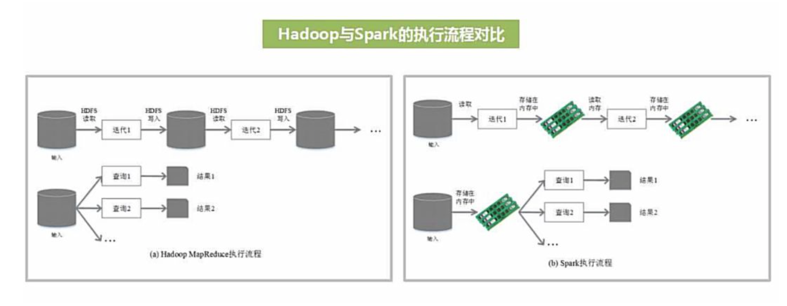

<style>
details {
    border: 1px solid #aaa;
    border-radius: 4px;
    padding: .5em .5em 0;
}
summary {
    font-weight: bold;
    margin: -.5em -.5em 0;
    padding: .5em;
}
details[open] {
    padding: .5em;
}
details[open] summary {
    border-bottom: 1px solid #aaa;
    margin-bottom: .5em;
}
img {
    pointer-events: none;
}
</style>

<details><summary>目录</summary><p>

- [Spark 优势特点](#spark-优势特点)
  - [高效性](#高效性)
  - [易用性](#易用性)
  - [通用性](#通用性)
  - [兼容性](#兼容性)
- [Spark 基本概念](#spark-基本概念)
  - [基本概念](#基本概念)
  - [驱动器程序](#驱动器程序)
  - [执行器节点](#执行器节点)
  - [SparkContext 对象](#sparkcontext-对象)
  - [SparkSession 对象](#sparksession-对象)
    - [创建 SparkSession](#创建-sparksession)
    - [SparkSession 类及其方法](#sparksession-类及其方法)
  - [Application](#application)
- [Spark 架构设计](#spark-架构设计)
  - [Spark](#spark)
  - [PySpark](#pyspark)
- [Spark 运行流程](#spark-运行流程)
  - [运行流程](#运行流程)
  - [运行架构特点](#运行架构特点)
- [Spark 部署方式](#spark-部署方式)
  - [部署方式](#部署方式)
  - [Hadoop 和 Spark 的统一部署](#hadoop-和-spark-的统一部署)
- [Spark API 概览](#spark-api-概览)
- [RDD 数据结构](#rdd-数据结构)
  - [RDD 简介](#rdd-简介)
  - [RDD 创建](#rdd-创建)
  - [RDD 操作](#rdd-操作)
  - [RDD 特性](#rdd-特性)
  - [RDD 依赖](#rdd-依赖)
    - [RDD 窄依赖](#rdd-窄依赖)
    - [RDD 宽依赖](#rdd-宽依赖)
    - [DAG 切分为 Stage](#dag-切分为-stage)
  - [RDD 缓存和持久化](#rdd-缓存和持久化)
  - [键值对 RDD](#键值对-rdd)
- [参考](#参考)
</p></details><p></p>

# Spark 优势特点

> 作为大数据计算框架 MapReduce 的继任者，Spark 具有以下优势特性



* 高效性：运行速度快
    - 使用 DAG 执行引擎以支持循环数据流与内存计算
* 易用性
    - 支持使用 Scala、Java、Python 和 R 语言进行编程，可以通过 Spark Shell 进行交互式编程 
* 通用性
    - Spark 提供了完整而强大的技术栈，包括 SQL 查询、流式计算、机器学习和图算法组件
* 兼容性：运行模式多样
    - 可运行于独立的集群模式中，可运行于 Hadoop 中，
      也可运行于 Amazon EC2 等云环境中，
      并且可以访问 HDFS、Cassandra、HBase、Hive 等多种数据源 

## 高效性

不同于 MapReduce 将中间计算结果放入磁盘中，Spark 采用内存存储中间计算结果，
减少了迭代运算磁盘 IO，并通过并行计算 DAG 图的优化，减少了不同任务之间的依赖，
降低了延迟等待时间。内存计算下，Spark 比 MapReduce 块 100 倍

## 易用性

不同于 MapReduce 仅支持 Map 和 Reduce 两种编程算子，
Spark 提供了超过 80 中不同的 Transformation 和 Action 算子，
如 map, reduce, filter, groupByKey, sortByKey, foreach 等，
并且采用函数式编程风格，实现相同的功能需要的代码量极大缩小

MapReduce 和 Spark 对比：

| Item              | MapReduce                               | Spark                                         |
|-------------------|-----------------------------------------|-----------------------------------------------|
| 数据存储结构        | 磁盘 HDFS 文件系统的分割                   | 使用内存构建弹性分布数据集(RDD)对数据进行运算和 cache |
| 编程范式           | Map + Reduce                             | DAG: Transformation + Action                  |
| 计算中间结果处理方式 | 计算中间结果写入磁盘，IO及序列化、反序列化代价大 | 中间计算结果在内存中维护，存取速度比磁盘高几个数量级   |
| Task 维护方式      | Task 以进程的方式维护                       | Task 以线程的方式维护                            |

## 通用性


Spark 提供了统一的解决方案。Spark 可以用于批处理、交互式查询(Spark SQL)、
实时流式计算(Spark Streaming)、机器学习(Spark MLlib)和图计算(GraphX)。
这些不同类型的处理都可以在同一个应用中无缝使用，这对于企业应用来说，
就可以使用一个平台来进行不同的工程实现，减少了人力开发和平台部署成本

## 兼容性


Spark 能够跟很多开源工程兼容使用，如 Spark 可以使用 Hadoop 的 YARN 和 Apache Mesos 作为它的资源管理和调度器，
并且 Spark 可以读取多种数据源，如 HDFS、HBase、MySQL 等

# Spark 基本概念

## 基本概念

> 在较高的层次上，每个 Spark 应用程序都包含一个驱动程序, 该程序运行用户的 main 函数，并在集群上执行各种并行操作。
> 
> Spark 提供的主要抽象是弹性分布式数据集（RDD），它是跨群集节点分区的元素的集合，可以并行操作
> 
> * RDD 是通过从 Hadoop 文件系统（或任何其他 Hadoop 支持的文件系统）中的文件或驱动程序中的现有 Scala 集合开始, 并对其进行转换而创建的
> * Spark 在内存中保留 RDD，允许它在并行操作中有效地重用
> * RDD 会自动从节点故障中恢复
> 
> Spark 中的第二个抽象是可以在并行操作中使用的共享变量
> 
> * 默认情况下，当 Spark 并行运行一个函数作为不同节点上的一组任务时, 它会将函数中使用的每个变量的副本发送给每个任务。
>   有时，变量需要跨任务共享，或者在任务和驱动程序之间共享
> * Spark 支持两种类型的共享变量：
>     - 广播变量, 可用于缓存所有节点的内存中的值
>     - 累加器, 它们是仅“添加”到的变量, 例如计数器和总和
> 
> Spark 的另一个主要抽象是一个名为 Dataset 的分布式项目集合。
> 可以从 Hadoop InputFormats（例如 HDFS 文件）或通过转换其他数据集来创建数据集

* RDD
    - 弹性分布式数据集(Resilient Distributed Dataset)的简称，
      是分布式内存的一个抽象概念，提供了一种高度受限的共享内存模型
* DAG
    - Directed Acyclic Graph(有向无环图)的简称，反映 RDD 之间的依赖关系
* Master Node
    - 每个 Master Node 上存在一个 Driver Program
    - Driver Program
        - 控制程序，负责为 Application 构建 DAG 图
* Cluster Manager
    - 集群资源管理中心，负责分配计算资源
* Worker Node
    - 工作节点，负责完成具体计算
    - 每个 Worker Node 上存在一个 Executor 进程
* Executor
    - 运行在 Worker Node 上的一个进程
    - 负责运行 Task，一个 Executor 进程中包含多个 Task 线程
    - 并为应用程序存储数据
* Application
    - 用户编写的 Spark 应用程序
    - 一个 Application 包含多个 Job
* Job
    - 作业
    - 一个 Job 包含多个 RDD 及作用于相应 RDD 上的各种操作
* Stage
    - 阶段，Job 的基本调度单位
    - 一个 Job 会分为多组任务，每组任务被称为 Stage
* Task
    - 任务运行在 Executor 上的工作单元，是 Executor 中的一个线程

## 驱动器程序

> driver program

* 每个 Spark 应用都由一个驱动器程序来发起集群上的并行操作
* 包含应用的 main 函数
* 定义了集群上的分布式数据集
* 对分布式数据集应用相关操作
* 即：spark shell

## 执行器节点

> executor

* 要对 RDD 执行操作，驱动器程序一般需要管理多个执行器节点
* 每个执行器节点上都有多个需要执行的任务

传递函数的 API：

Spark 自动将对应的操作(函数)分发到各个执行器节点，
即只需在单个的驱动器程序中编程，并且让代码自动运行在多个节点(集群)上

## SparkContext 对象

* 访问 Spark，代表对计算集群的一个连接
* shell 启动时已经自动创建了一个 SparkContext 对象，即变量 sc
* 利用 SparkContext 对象创建 RDD

## SparkSession 对象

使用 DataFrame 和 Dataset API 进行 Spark 编程的程序入口 SparkSession

### 创建 SparkSession

(1)在命令行模式下,进入spark-shell后SparkSession会默认创建为`spark`

```bash
$ spark-shell
```

- Spark context Web UI: http://192.168.0.111:4040
- Spark context: `sc (master = local[*], app id = local-1556297140303)`
- Spark session: `spark`

(2)编程模式下需要使用SparkSession类手动创建

```scala
import org.apache.spark.sql.SparkSession

val spark = SparkSession
    .builder()
    .master("local")
    .appName("Spark SQL DataFrame and DataSet")
    .config("spark.some.config.option", "some-value")
    .getOrCreate()
```

### SparkSession 类及其方法

```
class SparkSession extends Serializable with Closeable with Logging
```

```scala
spark.version()
spark.newSession()
spark.sparkContext()
spark.catalog()
spark.conf()
spark.listenerManager()
spark.sessionState()
spark.sharedState()

spark.read()
spark.baseRelationToDataFrame()
spark.createDataFrame()
spark.createDataset()
spark.emptyDataFrame()
spark.emptyDataset()
spark.experimental()
spark.implicits()
spark.range()
spark.readStream()
spqrk.sql()
spark.sqlContext()
spark.streams()
spark.table()
spark.time()
spark.udf()
spark.stop()
spark.close()
```


## Application

Application 由多个 Job 组成，Job 由多个 Stage 组成，
Stage 由多个 Task 组成。Stage 是 Task 调度的基本单位

```
Application [Driver]
    - Job 1
        - Stage 1
            - Task 1 [Executor]
            - Task 2
            - ...
            - Task p
        - Stage 2
        - ...
        - Stage n
    - Job 2
    - ...
    - Job m
```

# Spark 架构设计

Spark 集群由 Driver、Cluster Manager(Standalone, Yarn 或 Mesos)，以及 Worker Node 组成

## Spark

对于每个 Spark 应用程序，Worker Node 上存在一个 Executor 进程，Executor 进程中包括多个 Task 线程


## PySpark

对于 PySpark，为了不破坏 Spark 已有的运行架构，Spark 在外围包装了一层 Python API

* 在 Driver 端，借助 Py4j 实现 Python 和 Java 交互，进而实现通过 Python 编写 Spark 应用程序
* 在 Executor 端，则不需要借助 Py4j，因为 Executor 端运行的 Task 逻辑是由 Driver 发过来的，那是序列化后的字节码


# Spark 运行流程

## 运行流程

1. 首先，Driver 为 Application 构建 DAG，并分解为 Stage
2. 然后，Driver 向 Cluster Manager 申请资源
3. Cluster Manager 向某些 Worker Node 发送征召信号
4. 被征召的 Worker Node 启动 Executor 进程响应征召，并向 Driver 申请任务
5. Driver 分配 Task 给 Worker Node
6. Executor 进程以 Stage 为单位执行 Task，期间 Driver 进行监控
7. Driver 收到 Executor 任务完成的信号后向 Cluster Manager 发送注销信号
8. Cluster Manager 向 Worker Node 发送释放资源信号
9. Worker Node 对应的 Executor 进程停止运行

> * Question 1: Task 如何生成？


## 运行架构特点

* 每个 Application 都有自己专属的 Executor 进程，
  并且该进程在 Application 运行期间一直驻留，
  Executor 进程以多线程的方式运行 Task
* Spark 运行过程与资源管理器无关，只要能够获取 Executor 进程并保持通信即可
* Task 采用了数据本地性和推测执行等优化机制

# Spark 部署方式

## 部署方式

* Local
    - 本地运行模式，非分布式
* Standalone
    - 使用 Spark 自带集群管理器，部署后只能运行 Spark 任务
* Yarn
    - Hadoop 集群管理器，部署后可以同时运行 MapReduce、Spark、Storm、HBase 等各种任务
* Mesos
    - 与 Yarn 最大的不同是 Mesos 的资源分配是二次的，Mesos 负责分配一次，计算框架可以选择接受或者拒绝

## Hadoop 和 Spark 的统一部署


# Spark API 概览

Spark has two fundamental sets of APIS:

- Low-level "unstructured" APIs
    - RDD
    - Streaming
- Higher-level structured APIs
    - Dataset
    - DataFrame
        - ``org.apache.spark.sql.functions``
        - Partitions
        - DataFrame(Dataset) Methods
        - DataFrameStatFunctions
        - DataFrameNaFunctions
        - Column Methods
        - alias
        - contains
    - Spark SQL
    - Structured Streaming

# RDD 数据结构

## RDD 简介

RDD 全称 Resilient Distributed Dataset，弹性分布式数据集，是 Spark 的基本数据结构

RDD 是记录的只读分区集合，代表一个不可变、可分区、元素可并行计算的分布式对象集合。
RDD 可以包含 Python、Java、Scala 中的任意类型的对象，甚至可以包含用户自定义的对象

## RDD 创建

一般有两种方式创建 RDD:

* 读取文件中的数据生成 RDD
* 通过将内存中的对象并行化得到 RDD

## RDD 操作

创建 RDD 后，可以使用各种操作对 RDD 进行编程。
RDD 操作有两种类型:

* Transformation 转化操作
    - 转换操作是从已经存在的 RDD 创建一个新的 RDD
* Action 操作
    - 行动操作是在 RDD 上进行计算后返回结果到 Driver

转换操作具有 Lazy 特性，即 Spark 不会立即进行实际的计算，
只会记录执行的轨迹，只有触发 Action 操作的时候，才会根据 DAG 进行执行

常用的 Transformation：

- `sc.map()`
- `sc.filter()`
- `sc.flatMap()`
- `sc.union()`
- `sc.intersection()`
- `sc.distinct()`
- `sc.substract()`
- `sc.cartesian()`
- `sc.sample(withReplacement = true, fraction = 0.5, [seed])`

常用的 Action：

- `sc.count()`
- `sc.countByValue()`
- `sc.first()`
- `sc.reduce()`
- `sc.combine()`
- `sc.fold(init)(func)`
- `sc.aggregate(zeroValue)(seqOp, comOp)`
- `sc.collect()`
- `sc.take(n)`
- `sc.takeOrdered(n)(ordering)`
- `sc.top()`
- `sc.takeSample(withReplacement, num, seed)`
- `sc.foreach()`

## RDD 特性

* Spark 用 Scala 实现了 RDD 的 API，可以通过调用 API 实现 RDD 的各种操作
* RDD 提供了一组丰富的操作以支持常见的数据运算，分为 Action(动作)和 Transformation(转换)两种类型
* 表面上 RDD 功能很受限、不够强大，实际上 RDD 已经被时间证明可以高效地表达许多框架的编程模型，
  比如 MapReduce、SQL、Pregel
* RDD 提供的转换接口都非常简单，都是类似 map、filter、groupby、join 等粒度的数据转换操作，
  而不是针对某个数据项的细粒度(不适合网页爬虫)

## RDD 依赖

RDD 操作确定了 RDD 之间的依赖关系。RDD 之间的依赖关系有两种，即窄依赖、宽依赖

### RDD 窄依赖

窄依赖时，父 RDD 的分区和子 RDD 的分区的关系是一对一或者多对一的关系


### RDD 宽依赖

宽依赖时，父 RDD 的分区和子 RDD 的分区的关系是一对多或者多对多的关系


### DAG 切分为 Stage

RDD 依赖关系确定了 DAG 切分成 Stage 的方式，切割规则为：从后往前，

* 遇到宽依赖就切割 Stage

RDD 之间的依赖关系形成了一个 DAG 有向无环图，DAG 会提交给 DAG Scheduler，
DAG Scheduler 会把 DAG 划分成相互依赖的多个 Stage，划分 Stage 的依据就是 RDD 之间的宽窄依赖。
遇到宽依赖就划分 Stage，每个 Stage 包含一个或多个 Task 任务，
然后将这些 Task 以 TaskSet 的形式提交给 Task Scheduler 运行


## RDD 缓存和持久化

默认情况下，Spark 的 RDD 会在每次对他们进行行动操作时重新计算。
如果想在多个行动中重用一个 RDD，可以使用 `RDD.persist()` 让 Spark 把这个 RDD 缓存下来。
可以让 Spark 把数据持久化到许多不同的地方

在第一次持久化的 RDD 计算之后，Spark 会把 RDD 的内容保存到内存中(以分区方式存储到集群中的个机器上)，
这样在之后的行动操作中，就可以重新用这些数据了

## 键值对 RDD

> Pair RDD

* 键值对 RDD 通常用来进行聚合计算
* 键值对 RDD 提供了一些新的操作接口
* 创建键值对 RDD
* 存储键值对的数据格式会在读取时直接返回由其键值对数据组成的 pair RDD；
* 把一个普通的 RDD 转换为 pair RDD, 调用 map() 函数, 传递的函数需要返回键值对。
* 用 Scala 和 Python 从一个内存中的数据集创建 pari RDD 时, 
  只需要对这个二元组组成的集合调用 SparkContext.parallelize() 方法

键值对 RDD 转化操作：

* `sc.map()`
* `sc.filter()`
* `sc.flatMap()`
* `sc.union()`
* `sc.intersection()`
* `sc.distinct()`
* `sc.substract()`
* `sc.cartesian()`
* `sc.sample(withReplacement = true, fraction = 0.5, [seed])`
* `sc.reduceByKey(func)`
* `sc.foldByKey(init)(func)`
* `sc.groupByKey()`
* `sc.combineByKey(createCombiner, mergeCombiners, partitioner)`
* `sc.sortByKey(ascending = True, )`
* `sc.mapValues(func)`
* `sc.flatMapValues(func)`
* `sc.keys()`
* `sc.values()`
* `sc.subtractByKey(other_sc)`
* `sc.join(other_sc)`
* `sc.leftOuterJoin(other_sc)`
* `sc.rightOuterJoin(other_sc)`
* `sc.cogroup(other_sc)`

键值对 RDD 的行动操作：

* `sc.count()`
* `sc.countByValue()`
* `sc.first()`
* `sc.reduce()`
* `sc.fold(init)(func)`
* `sc.aggregate(zeroValue)(seqOp, comOp)`
* `sc.collect()`
* `sc.take(n)`
* `sc.takeOrdered(n)(ordering)`
* `sc.top()`
* `sc.takeSample(withReplacement, num, seed)`
* `sc.foreach()`
* `sc.collectAsMap()`
* `sc.lookup()`

# 参考

* [Spark 的基本原理](https://mp.weixin.qq.com/s/dontNjAGFyskhHz7tbdWeg)

