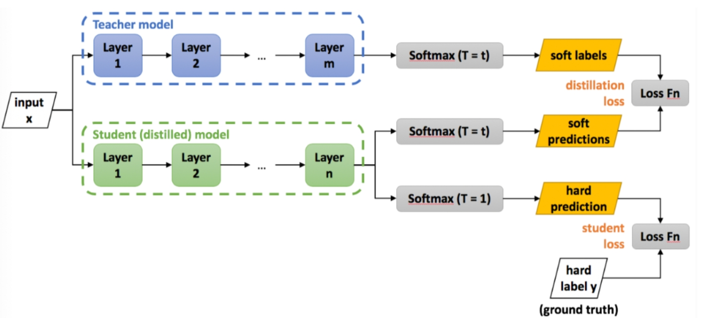

<style>
details {
    border: 1px solid #aaa;
    border-radius: 4px;
    padding: .5em .5em 0;
}
summary {
    font-weight: bold;
    margin: -.5em -.5em 0;
    padding: .5em;
}
details[open] {
    padding: .5em;
}
details[open] summary {
    border-bottom: 1px solid #aaa;
    margin-bottom: .5em;
}
img {
    pointer-events: none;
}
</style>

<details><summary>目录</summary><p>

- [模型蒸馏简介](#模型蒸馏简介)
- [模型蒸馏技术的实现流程](#模型蒸馏技术的实现流程)
- [模型蒸馏的作用](#模型蒸馏的作用)
- [模型蒸馏示例](#模型蒸馏示例)
- [模型压缩和加速的其他技术](#模型压缩和加速的其他技术)
- [参考](#参考)
</p></details><p></p>

# 模型蒸馏简介

> 模型压缩有 **剪枝**、**蒸馏** 和 **量化** 等一些方法，模型蒸馏实现起来比较容易简单。

在深度学习领域，模型压缩与部署是一项重要的研究课题，而模型蒸馏便是其中一种有效的方法。
模型蒸馏（Model Distillation）最初由 Hinton 等人在 2015 年提出，其核心思想是通过知识迁移的方式，
将一个复杂的大模型（教师模型）的知识传授给一个相对简单的小模型（学生模型），
简单概括就是利用教师模型的预测概率分布作为软标签对学生模型进行训练，
从而在保持较高预测性能的同时，极大地降低了模型的复杂性和计算资源需求，实现模型的轻量化和高效化。
模型蒸馏技术在计算机视觉、自然语言处理等领域均取得了显著的成功。



概念解释：

* teacher：原始模型或模型 ensemble
* student：新模型
* transfer set：用来迁移 teacher 知识、训练 student 的数据集合
* soft target：teacher 输出的预测结果（一般是 softmax 之后的概率）
* hard target：样本原本的标签
* temperature：蒸馏目标函数中的超参数
* born-again network：蒸馏的一种，指 student 和 teacher 的结构和尺寸完全一样
* teacher annealing：防止 student 的表现被 teacher 限制，在蒸馏时逐渐减少 soft targets 的权重

为什么蒸馏可以工作？

好模型的目标不是拟合训练数据，而是学习如何泛化到新的数据。
所以蒸馏的目标是让 student 学习到 teacher 的泛化能力，
理论上得到的结果会比单纯拟合训练数据的 student 要好。
另外，对于分类任务，如果 soft targets 的熵比 hard targets 高，
那显然 student 会学习到更多的信息。

# 模型蒸馏技术的实现流程

模型蒸馏技术的实现流程通常包括以下几个步骤：

1. 准备教师模型和学生模型
    - 首先，需要一个已经训练好的教师模型和一个待训练的学生模型。
       教师模型通常是一个性能较好但计算复杂度较高的模型，
       而学生模型则是一个计算复杂度较低的模型。
2. 使用教师模型对数据集进行预测，得到每个样本的预测概率分布（软目标）。
   这些概率分布包含了模型对每个类别的置信度信息。
3. 定义损失函数：
    - 损失函数用于衡量学生模型的输出与教师模型的输出之间的差异。
      在模型蒸馏中，通常会使用一种结合了软标签损失和硬标签损失的混合损失函数（通常这两个损失都可以看作交叉熵损失）。
      软标签损失鼓励学生模型模仿教师模型的输出概率分布，
      这通常使用 KL 散度（Kullback-Leibler Divergence）来度量，
      而硬标签损失则鼓励学生模型正确预测真实标签。
4. 训练学生模型
    - 在训练过程中，将教师模型的输出作为监督信号，通过优化损失函数来更新学生模型的参数。
      这样，学生模型就可以从教师模型中学到有用的知识。
      KL 散度的计算涉及一个温度参数，该参数可以调整软目标的分布。
      温度较高会使分布更加平滑。在训练过程中，可以逐渐降低温度以提高蒸馏效果。
5. 微调学生模型：在蒸馏过程完成后，可以对学生模型进行进一步的微调，以提高其性能表现。

# 模型蒸馏的作用

* 模型轻量化：通过将大型模型的知识迁移到小型模型中，
  可以显著降低模型的复杂度和计算量，从而提高模型的运行效率。
* 加速推理，降低运行成本：简化后的模型在运行时速度更快，
  降低了计算成本和能耗，进一步的，减少了对硬件资源的需求，降低模型运行成本。
* 提升泛化能力：研究表明，模型蒸馏有可能帮助学生模型学习到教师模型中蕴含的泛化模式，
  提高其在未见过的数据上的表现。
* 迁移学习：模型蒸馏技术可以作为一种迁移学习方法，
  将在一个任务上训练好的模型知识迁移到另一个任务上。
* 促进模型的可解释性和可部署性：轻量化后的模型通常更加简洁明了，
  有利于理解和分析模型的决策过程，同时也更容易进行部署和应用。

# 模型蒸馏示例

在这个示例中，将使用一个预训练的 ResNet-18 模型作为教师模型，并使用一个简单的 CNN 模型作为学生模型。
同时，将使用交叉熵损失函数和 L2 正则化项来优化学生模型的性能表现。

```python
import torch
import torch.nn as nn
import torch.optim as optim
from torchvision import datasets, models, transforms

# 定义教师模型和学生模型
teacher_model = models.resnet18(pretrained=True)
student_model = nn.Sequential(
    nn.Conv2d(3, 64, kernel_size=3, stride=1, padding=1),
    nn.ReLU(),
    nn.MaxPool2d(kernel_size=2, stride=2),
    nn.Conv2d(64, 128, kernel_size=3, stride=1, padding=1),
    nn.ReLU(),
    nn.MaxPool2d(kernel_size=2, stride=2),
    nn.Flatten(),
    nn.Linear(128 * 7 * 7, 10)
)

# 定义损失函数和优化器
criterion = nn.CrossEntropyLoss()
optimizer_teacher = optim.SGD(teacher_model.parameters(), lr=0.01, momentum=0.9)
optimizer_student = optim.Adam(student_model.parameters(), lr=0.001)

# 训练数据集
transform = transforms.Compose([
    transforms.ToTensor(),
    transforms.Normalize((0.5,), (0.5,))
])
trainset = datasets.MNIST('../data', train=True, download=True, transform=transform)
trainloader = torch.utils.data.DataLoader(trainset, batch_size=64, shuffle=True)

# 蒸馏过程
for epoch in range(10):
    running_loss_teacher = 0.0
    running_loss_student = 0.0
    
    for inputs, labels in trainloader:
        # 教师模型的前向传播
        outputs_teacher = teacher_model(inputs)
        loss_teacher = criterion(outputs_teacher, labels)
        running_loss_teacher += loss_teacher.item()
        
        # 学生模型的前向传播
        outputs_student = student_model(inputs)
        loss_student = criterion(outputs_student, labels) + 0.1 \
            * torch.sum((outputs_teacher - outputs_student) ** 2)
        running_loss_student += loss_student.item()
        
        # 反向传播和参数更新
        optimizer_teacher.zero_grad()
        optimizer_student.zero_grad()
        loss_teacher.backward()
        optimizer_teacher.step()
        loss_student.backward()
        optimizer_student.step()
    
    print(f'Epoch {epoch+1}/10 \t Loss Teacher: {running_loss_teacher / len(trainloader)} \t Loss Student: {running_loss_student / len(trainloader)}')
```

在这个示例中：

1. 首先定义了教师模型和学生模型，并初始化了相应的损失函数和优化器；
2. 然后，加载了 MNIST 手写数字数据集，并对其进行了预处理；
3. 接下来，进入蒸馏过程：对于每个批次的数据，
   首先使用教师模型进行前向传播并计算损失函数值；
   然后使用学生模型进行前向传播并计算损失函数值（同时加入了L2正则化项以鼓励学生模型学习教师模型的输出）；
4. 最后，对损失函数值进行反向传播和参数更新：
   打印了每个批次的损失函数值以及每个epoch的平均损失函数值。

通过多次迭代训练后，可以得到一个性能较好且轻量化的学生模型。

# 模型压缩和加速的其他技术

除了模型蒸馏技术外，还有一些类似的技术可以用于实现模型的压缩和加速，例如：

* 权重剪枝：通过删除神经网络中冗余的权重来减少模型的复杂度和计算量。
  具体来说，可以通过设定一个阈值来判断权重的重要性，然后将不重要的权重设置为零或删除。
* 模型量化：将神经网络中的权重和激活值从浮点数转换为低精度的整数表示，
  从而减少模型的存储空间和计算量。
* 知识蒸馏（Knowledge Distillation）：这是一种特殊的模型蒸馏技术，
  其中教师模型和学生模型具有相同的架构，但参数不同。通过让学生模型学习教师模型的输出，
  可以实现模型的压缩和加速。
* 知识提炼（Knowledge Carving）：选择性地从教师模型中抽取部分子结构用于构建学生模型。
* 网络剪枝（Network Pruning）：通过删除神经网络中冗余的神经元或连接来减少模型的复杂度和计算量。
  具体来说，可以通过设定一个阈值来判断神经元或连接的重要性，然后将不重要的神经元或连接删除。
* 低秩分解（Low-Rank Factorization）：将神经网络中的权重矩阵分解为两个低秩矩阵的乘积，
  从而减少模型的存储空间和计算量。这种方法可以应用于卷积层和全连接层等不同类型的神经网络层。
* 结构搜索（Neural Architecture Search）：通过自动搜索最优的神经网络结构来实现模型的压缩和加速。
  这种方法可以根据特定任务的需求来定制适合的神经网络结构。

# 参考

* [模型蒸馏](https://blog.csdn.net/HUSTHY/article/details/115174978)
* [Distilling the Knowledge in a Neural Network](https://arxiv.org/pdf/1503.02531.pdf)
* [Knowledge Distillation Tutorial](https://pytorch.org/tutorials/beginner/knowledge_distillation_tutorial.html)
* [深度神经网络模型蒸馏Distillation](https://zhuanlan.zhihu.com/p/71986772)
* [深度学习中的模型蒸馏技术：实现流程、作用及实践案例](https://blog.csdn.net/qq_42533357/article/details/137026170)
