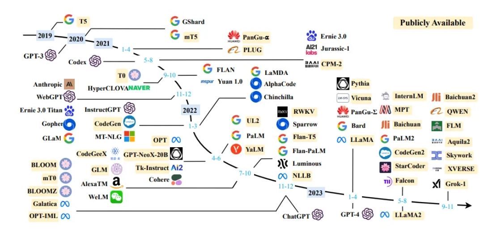
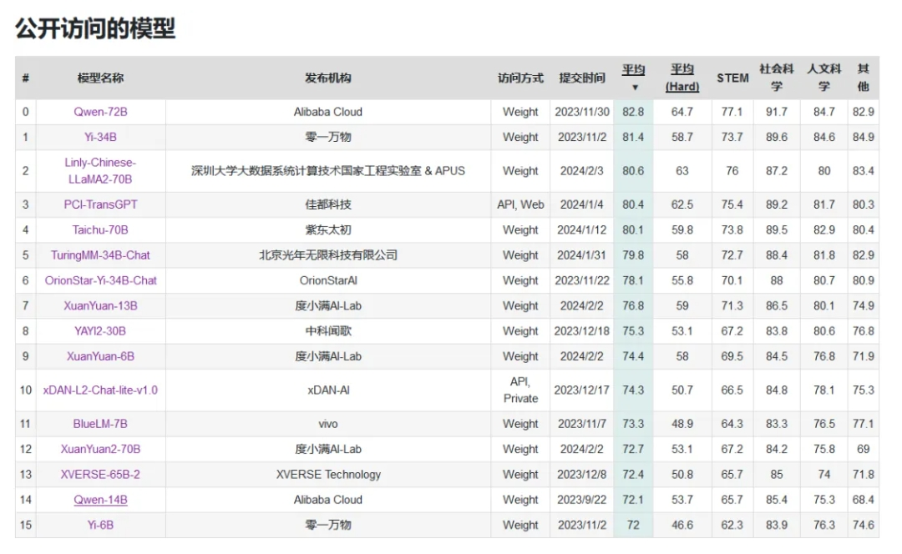

<style>
details {
    border: 1px solid #aaa;
    border-radius: 4px;
    padding: .5em .5em 0;
}
summary {
    font-weight: bold;
    margin: -.5em -.5em 0;
    padding: .5em;
}
details[open] {
    padding: .5em;
}
details[open] summary {
    border-bottom: 1px solid #aaa;
    margin-bottom: .5em;
}
img {
    pointer-events: none;
}
</style>

<details><summary>目录</summary><p>

- [LLM 介绍](#llm-介绍)
  - [LLM 简介](#llm-简介)
  - [LLM 发展](#llm-发展)
  - [LLM 能力](#llm-能力)
    - [涌现能力](#涌现能力)
    - [作为基座模型支持多元应用的能力](#作为基座模型支持多元应用的能力)
    - [支持对话作为统一入口的能力](#支持对话作为统一入口的能力)
  - [LLM 特点](#llm-特点)
  - [LLM 应用与影响](#llm-应用与影响)
- [LLM 模型](#llm-模型)
  - [未开源 LLM](#未开源-llm)
    - [GPT 系列](#gpt-系列)
    - [Claude 系列](#claude-系列)
    - [PaLM 和 Gemini 系列](#palm-和-gemini-系列)
    - [百度文心一言](#百度文心一言)
    - [科大讯飞星火](#科大讯飞星火)
  - [开源 LLM](#开源-llm)
    - [LLaMa 系列](#llama-系列)
    - [通义千问](#通义千问)
    - [GLM 系列](#glm-系列)
    - [Baichuan 系列](#baichuan-系列)
  - [LLM 获取方式](#llm-获取方式)
    - [LLM 名单](#llm-名单)
    - [LLM 本体](#llm-本体)
  - [LLM 调用示例](#llm-调用示例)
    - [查看模型](#查看模型)
    - [下载模型](#下载模型)
    - [模型调用](#模型调用)
- [LLM 应用开发](#llm-应用开发)
  - [LLM 开发简介](#llm-开发简介)
  - [LLM 开发流程](#llm-开发流程)
  - [LLM 项目流程](#llm-项目流程)
    - [项目规划与需求分析](#项目规划与需求分析)
    - [数据准备与向量知识库构建](#数据准备与向量知识库构建)
    - [大模型集成与 API 连接](#大模型集成与-api-连接)
    - [核心功能实现](#核心功能实现)
    - [核心功能迭代优化](#核心功能迭代优化)
    - [前端与用户交互界面开发](#前端与用户交互界面开发)
    - [部署测试与上线](#部署测试与上线)
    - [维护与持续改进](#维护与持续改进)
- [参考和资料](#参考和资料)
</p></details><p></p>

# LLM 介绍

## LLM 简介

大语言模型（LLM，Large Language Model），也称大型语言模型，
是一种旨在理解和生成人类语言的人工智能模型。

LLM 通常指包含数百亿（或更多）参数的语言模型，它们在海量的文本数据上进行训练，
从而获得对语言深层次的理解。目前，国外的知名 LLM 有 GPT-3.5、GPT-4、PaLM、Claude 和 LLaMA 等，
国内的有文心一言、讯飞星火、通义千问、ChatGLM、百川等。

为了探索性能的极限，许多研究人员开始训练越来越庞大的语言模型，例如拥有 1750 亿参数的 GPT-3 和 5400 亿参数的 PaLM 。
尽管这些大型语言模型与小型语言模型（例如 3.3 亿参数的 BERT 和 15 亿参数的 GPT-2）使用相似的架构和预训练任务，
但它们展现出截然不同的能力，尤其在解决复杂任务时表现出了惊人的潜力，这被称为“涌现能力”。
以 GPT-3 和 GPT-2 为例，GPT-3 可以通过学习上下文来解决少样本任务，而 GPT-2 在这方面表现较差。
因此，科研界给这些庞大的语言模型起了个名字，称之为“大语言模型（LLM）”。
LLM 的一个杰出应用就是 ChatGPT ，它是 GPT 系列 LLM 用于与人类对话式应用的大胆尝试，
展现出了非常流畅和自然的表现。

## LLM 发展

2022 年 ChatGPT 的出现标志着人工智能正式进入大模型时代，但在此之前大模型已经走过了很长的发展历程。

自从图灵测试提出以来，如何通过机器智能理解人类语言一直是重要的研究问题，
逐渐发展成为独立的研究领域，即 **自然语言处理（Natural Language Processing, NLP）**。
而在自然语言处理领域，过去几十年里，**统计语言建模**一直是主要的研究方法，随着深度学习的进步，
逐渐从统计语言建模发展为 **神经网络建模**。

语言建模的研究可以追溯到 20 世纪 90 年代，当时的研究主要集中在采用统计学习方法来预测词汇，
通过分析前面的词汇来预测下一个词汇。但在理解复杂语言规则方面存在一定局限性。

随后，研究人员不断尝试改进，
2003 年深度学习先驱 Bengio 在他的经典论文 **《A Neural Probabilistic Language Model》** 中，
首次将深度学习的思想融入到语言模型中。强大的神经网络模型，
相当于为计算机提供了强大的 “大脑” 来理解语言，让模型可以更好地捕捉和理解语言中的复杂关系。

2018 年左右，**Transformer 架构的神经网络模型** 开始崭露头角。通过大量文本数据训练这些模型，
使它们能够通过阅读大量文本来深入理解语言规则和模式，就像让计算机阅读整个互联网一样，
对语言有了更深刻的理解，极大地提升了模型在各种自然语言处理任务上的表现。

近几年，随着 **BERT** 等模型在 NLP 的各种任务上表现出优异的性能，
**预训练模型（Pre-trained Language Models, PLM）** 被广泛认为是提高机器文本处理能力的有效方法。
**预训练 + 微调** 这一 “组合技”，即：首先在大规模通用数据集上进行预训练，
再用具体任务的少量数据进行微调的方法，在各种应用场景中广泛应用并达到了很好的效果。

在预训练模型被证明有效之后，有研究发现 **将模型“扩大”有助于提高性能**，
其中“扩大”包含两层含义：**一方面是将模型加深结构、增加参数**，
**另一方面是提高训练的数据量**。顺着这一方向，一系列模型被提出，
其中比较有名的有谷歌的 **T5**（参数量 11B）和 Open AI 的 **GPT-2**（参数量 1.5B）。
人们惊讶地发现模型变大的同时，不仅在原有能力上表现更优异，而且涌现出强悍的理解能力，
在原先表现很差的许多复杂任务上都有巨大的突破。为了将这些模型与以前的加以区分，
**大语言模型（Large Language Model, LLM）** 概念被提出，通常用来指代参数量在数十亿、
百亿甚至千亿以上的模型。大家都意识到这是一条潜力巨大的发展道路，
许多机构都着手于大模型的工作，大模型时代正式开始。

大语言模型及其背后技术的发展：



* word2vec(2013, Google)
    - 一种从文本数据中学习单词嵌入(word embedding)的技术，它能够捕捉到单词之间的语义关系
* Seq2Seq 模型与 attention 机制(2014~2015, Google)
    - Seq2Seq: sequence-to-seqence
    - attention 机制: 注意力机制
    - 对机器翻译和其他序列生成任务产生了重要影响，提升了模型处理长序列数据的能力
* Transformer 模型(2017, Google)
    - Transformer: Attention Is All You Need
    - 一种全新的基于注意力机制的架构，成为了后来很多大模型的基础
* BERT 模型(2018, Google)
    - BERT: Bidirectional Encoder Representations from Transformers
    - 采用了 Transformer 架构，并通过双向上下文来理解单词的意义，大幅提高了语言理解的准确性
* T5 模型(2019, Google) 
    - Text-to-Text Transfer Transformer
    - 把不同的 NLP 任务，如分类，相似度计算等，都统一到一个文本到文本的框架里进行解决，
      这样的设计使得单一模型能够处理翻译、摘要和问答等多种任务
* GPT-3 模型(2020)
    - GPT-3: Generative Pre-Train Transformer 3
    - 生成式人工智能: Generative Artificial Intelligence, Generative AI
    - 通用人工智能: Artificial General Intelligence, AGI
    - 一个拥有 1750 亿参数的巨大模型，它在很多 NLP 任务上无须进行特定训练即可达到很好的效果，
      显示出令人惊叹的零样本(zero-shot)和小样本(few-shot)学习能力
* ChatGPT(2022.11.30, OpenAI)
    - 基于 GPT-3.5 模型调优的新一代对话式 AI 模型。该模型能够自然地进行多轮对话，
      精确地回答问题，并能生成编码代码、电子邮件、学术论文和小说等多种文本
* LLaMA(2023.2.24, Meta)
    - Meta 开源的大模型，其性能超越了 OpenAI 的 GPT-3
* GPT-4(2023.3.14, OpenAI)
    - 多模态模型，其回答准确度较 GPT-3.5 提升了 40%，在众多领域的测试中超越了大部分人类的水平，
      展示了 AI 在理解复杂任务方面的巨大潜力 
* Vicuna-13B(2023.3.31, 加州大学伯克利分校、CMU、斯坦福、UCSD、MBZUAI)
    - 拥有 130 亿参数的模型仅需要 300 美元的训练成本，为 AI 领域带来了成本效益上的重大突破
* PaLM 2 AI(2023.5.10, Google)
    - 支持对话导出、编码生成以及新增视觉搜索和图像生成功能
* Claude 2(2023.7.12, Anthropic)
    - 支持多达 100k token(4 万至 5 万个汉字)的上下文处理，在安全性和编码、数学及推理方面表现出色，
      提升了 AI 在处理长文本和复杂问题方面的能力
* LLaMA 2(2023.7.19, Meta)
    - 包含 70 亿、130 亿、700 亿参数版本的模型，其性能赶上了 GPT-3.5，
      显示了 AI 模型在不同规模下的多样性和适应性
* 国内
    - GhatGLM-6B(清华大学)
    - 文心一言(百度)
    - 通义千问(阿里)
    - 星火认知大模型(科大讯飞)
    - MaaS: Model as a Service(腾讯)
    - 盘古大模型 3.0(华为)

## LLM 能力

### 涌现能力

> 涌现能力，emergent abilities

区分 **大语言模型（LLM）** 与以前的 **预训练语言模型（PLM）** 最显著的特征之一是它们的 **涌现能力**。
涌现能力是一种令人惊讶的能力，它在小型模型中不明显，但在大型模型中特别突出。
类似物理学中的相变现象，涌现能力就像是模型性能随着规模增大而迅速提升，超过了随机水平，
也就是我们常说的量变引起质变。

涌现能力可以与某些复杂任务有关，但我们更关注的是其通用能力。
接下来，我们简要介绍三个 LLM 典型的涌现能力：

* **上下文学习**
    - 上下文学习能力是由 GPT-3 首次引入的。这种能力允许 **语言模型在提供自然语言指令或多个任务示例的情况下，
      通过理解上下文并生成相应输出的方式来执行任务，而无需额外的训练或参数更新**。
* **指令遵循**
    - 通过使用 **自然语言描述的多任务数据** 进行微调，也就是所谓的 **指令微调**。
      LLM 被证明在使用指令形式化描述的未见过的任务上表现良好。这意味着 LLM 能够根据任务指令执行任务，
      而无需事先见过具体示例，展示了其强大的泛化能力。
* **逐步推理**
    - 小型语言模型通常难以解决涉及多个推理步骤的复杂任务，例如数学问题。
      然而，LLM 通过采用 **思维链(CoT, Chain of Thought)** 推理策略，
      利用包含中间推理步骤的提示机制来解决这些任务，从而得出最终答案。
      据推测，这种能力可能是通过对代码的训练获得的。

这些涌现能力让 LLM 在处理各种任务时表现出色，使它们成为了解决复杂问题和应用于多领域的强大工具。

### 作为基座模型支持多元应用的能力

在 2021 年，斯坦福大学等多所高校的研究人员提出了 **基座模型(foundation model)** 的概念，
清晰了预训练模型的作用。这是一种全新的 AI 技术范式，借助于海量无标注数据的训练，
获得可以适用于大量下游任务的大模型（单模态或者多模态）。
这样，多个应用可以只依赖于一个或少数几个大模型进行统一建设。

大语言模型是这个新模式的典型例子，使用统一的大模型可以极大地提高研发效率。
相比于每次开发单个模型的方式，这是一项本质上的进步。大型模型不仅可以缩短每个具体应用的开发周期，
减少所需人力投入，也可以基于大模型的推理、常识和写作能力，获得更好的应用效果。
因此，大模型可以成为 AI 应用开发的大一统基座模型，这是一个一举多得、全新的范式，值得大力推广。

### 支持对话作为统一入口的能力

让大语言模型真正火爆的契机，是基于对话聊天的 ChatGPT。
业界很早就发现了用户对于对话交互的特殊偏好，
陆奇在微软期间就于 2016 年推进过 “对话即平台(conversation as a platform)” 的战略。
此外，苹果 Siri 、亚马逊 Echo 等基于语音对话的产品也非常受欢迎，
反映出互联网用户对于聊天和对话这种交互模式的偏好。虽然之前的聊天机器人存在各种问题，
但大型语言模型的出现再次让聊天机器人这种交互模式可以重新涌现。
用户愈发期待像钢铁侠中“贾维斯”一样的人工智能，无所不能、无所不知。
这引发我们对于智能体（Agent）类型应用前景的思考，Auto-GPT、微软 Jarvis 等项目已经出现并受到关注，
相信未来会涌现出很多类似的以对话形态让助手完成各种具体工作的项目。

## LLM 特点

大语言模型具有多种显著特点，这些特点使它们在自然语言处理和其他领域中引起了广泛的兴趣和研究。
以下是大语言模型的一些主要特点：

* **巨大的规模**：LLM 通常具有巨大的参数规模，可以达到数十亿甚至数千亿个参数。
  这使得它们能够捕捉更多的语言知识和复杂的语法结构。
* **预训练和微调**：LLM 采用了预训练和微调的学习方法。
  首先在大规模文本数据上进行 **预训练（无标签数据）**，
  学习通用的语言表示和知识。然后通过 **微调（有标签数据）** 适应特定任务，
  从而在各种 NLP 任务中表现出色。
* **上下文感知**：LLM 在处理文本时具有强大的上下文感知能力，
  能够理解和生成依赖于前文的文本内容。这使得它们在对话、文章生成和情境理解方面表现出色。
* **多语言支持**：LLM 可以用于多种语言，不仅限于英语。
  它们的多语言能力使得跨文化和跨语言的应用变得更加容易。
* **多模态支持**：一些 LLM 已经扩展到支持多模态数据，包括文本、图像和声音。
  使得它们可以理解和生成不同媒体类型的内容，实现更多样化的应用。
* **伦理和风险问题**：尽管 LLM 具有出色的能力，但它们也引发了伦理和风险问题，
  包括生成有害内容、隐私问题、认知偏差等。因此，研究和应用 LLM 需要谨慎。
* **高计算资源需求**：LLM 参数规模庞大，需要大量的计算资源进行训练和推理。
  通常需要使用高性能的 GPU 或 TPU 集群来实现。

大语言模型是一种具有强大语言处理能力的技术，已经在多个领域展示了潜力。
它们为自然语言理解和生成任务提供了强大的工具，同时也引发了对其伦理和风险问题的关注。
这些特点使 LLM 成为了当今计算机科学和人工智能领域的重要研究和应用方向。

## LLM 应用与影响

LLM 已经在许多领域产生了深远的影响：

* 在自然语言处理领域，它可以帮助计算机更好地理解和生成文本，
  包括写文章、回答问题、翻译语言等。
* 在信息检索领域，它可以改进搜索引擎，让我们更轻松地找到所需的信息。
* 在计算机视觉领域，研究人员还在努力让计算机理解图像和文字，以改善多媒体交互。
* 最重要的是，LLM 的出现让人们重新思考了 **通用人工智能(AGI)** 的可能性。
  AGI 是一种像人类一样思考和学习的人工智能。LLM 被认为是 AGI 的一种早期形式，
  这引发了对未来人工智能发展的许多思考和计划。

总之，LLM 是一种令人兴奋的技术，它让计算机更好地理解和使用语言，
正在改变着我们与技术互动的方式，同时也引发了对未来人工智能的无限探索。

# LLM 模型

## 未开源 LLM

### GPT 系列

OpenAI 在 2018 年提出的 GPT(Generative Pre-Training) 模型是典型的生成式预训练语言模型之一。
GPT 模型的基本原则是通过语言建模将世界知识压缩到仅解码器(decoder-only) 的 Transformer 模型中，
这样它就可以恢复(或记忆)世界知识的语义，并充当通用任务求解器。它能够成功的两个关键点：

* 训练能够准确预测下一个单词的 decoder-only 的 Transformer 语言模型
* 扩展语言模型的大小

OpenAI 在 LLM 上的研究大致可以分为以下几个阶段：


2022 年 11 月，OpenAI 发布了基于 GPT 模型(GPT-3.5 和 GPT-4) 的会话应用 ChatGPT。
由于与人类交流的出色能力，ChatGPT 自发布以来就引发了人工智能社区的兴奋。
ChatGPT 是基于强大的 GPT 模型开发的，具有特别优化的会话能力。
ChatGPT 从本质上来说是一个 LLM 应用，是基于基座模型开发出来的，与基座模型有本质的区别。
其支持 GPT-3.5 和 GPT-4 两个版本。
现在的 ChatGPT 支持最长达 32,000 个字符，知识截止日期是 2021 年 9 月，它可以执行各种任务，
包括代码编写、数学问题求解、写作建议等。ChatGPT 在与人类交流方面表现出了卓越的能力：
拥有丰富的知识储备，对数学问题进行推理的技能，在多回合对话中准确追踪上下文，
并且与人类安全使用的价值观非常一致。后来，ChatGPT 支持插件机制，
这进一步扩展了 ChatGPT 与现有工具或应用程序的能力。到目前为止，
它似乎是人工智能历史上最强大的聊天机器人。ChatGPT 的推出对未来的人工智能研究具有重大影响，
它为探索类人人工智能系统提供了启示。

2023 年 3 月发布的 GPT-4，它将文本输入扩展到多模态信号。GPT-3.5 拥有 1750 亿 个参数，
而 GPT4 的参数量官方并没有公布，但有相关人员猜测，GPT-4 在 120 层中总共包含了 1.8 万亿参数，
也就是说，GPT-4 的规模是 GPT-3 的 10 倍以上。因此，GPT-4 比 GPT-3.5 解决复杂任务的能力更强，
在许多评估任务上表现出较大的性能提升。
最近的一项研究通过对人为生成的问题进行定性测试来研究 GPT-4 的能力，
这些问题包含了各种各样的困难任务，并表明 GPT-4 可以比之前的 GPT 模型(如 GPT-3.5 )实现更优越的性能。
此外，由于六个月的迭代校准(在 RLHF 训练中有额外的安全奖励信号)，GPT-4 对恶意或挑衅性查询的响应更安全，
并应用了一些干预策略来缓解 LLM 可能出现的问题，如幻觉、隐私和过度依赖。

GPT-3.5 是免费的，而 GPT-4 是收费的。需要开通 plus 会员 20 美元/月。
通常我们可以调用模型 API 来开发自己的应用，[主流模型 API](https://openai.com/api/pricing/) 如下，具体价格见官网介绍：

* 语言模型 API
    - OpenAI-o1
    - OpenAI-o1 mini
    - GPT-4o
    - GPT-4o mini
* Fine-tuning models
    - GPT-4o
    - GPT-4o mini
    - GPT-3.5-turbo 
    - davinci-002
    - babbage-002
* Embedding 模型 API
    - text-embedding-3-small
    - text-embedding-3-large
    - ada v2
* Assistants API
    - Code Interpreter
    - File Search   
* Image models
    - DALL·E 3 Standard
    - DALL·E 3 HD
    - DALL·E 2
* Audio models
    - Whisper
    - TTS
    - TTS HD


### Claude 系列

Claude 系列模型是由 OpenAI 离职人员创建的 Anthropic 公司开发的闭源语言大模型。
最早的 Claude 于 2023 年 3 月 15 日发布，在 2023 年 7 月 11 日，更新至 Claude-2， 
并在 2024 年 3 月 4 日更新至 Claude-3。
Claude 3 系列包括三个不同的模型，分别是 Claude 3 Haiku、Claude 3 Sonnet 和 Claude 3 Opus，
它们的能力依次递增，旨在满足不同用户和应用场景的需求。

### PaLM 和 Gemini 系列

PaLM 系列语言大模型由 Google 开发。其初始版本于 2022 年 4 月发布，并在 2023 年 3 月公开了 API。
2023 年 5 月，Google 发布了 PaLM 2，2024 年 2 月 1 日，
Google 将 Bard(之前发布的对话应用)的底层大模型驱动由 PaLM2 更改为 Gemini，
同时也将原先的 Bard 更名为 Gemini。
目前的 Gemini 是第一个版本，即 Gemini 1.0，根据参数量不同分为 Ultra, Pro 和 Nano 三个版本。

### 百度文心一言

文心一言是基于百度文心大模型的知识增强语言大模型，于 2023 年 3 月在国内率先开启邀测。
文心一言的基础模型文心大模型于 2019 年发布 1.0 版。
更进一步划分，文心大模型包括 NLP 大模型、CV 大模型、跨模态大模型、生物计算大模型、行业大模型。
中文能力相对来说非常不错的闭源模型。文心一言网页版分为免费版和专业版，同时也可以使用 API 进行调用。

* 免费版使用文心 3.5 版本，已经能够满足个人用户或小型企业的大部分需求
* 专业版使用文心 4.0 版本。定价为 59.9 元/月，连续包月优惠价为 49.9 元/月

### 科大讯飞星火

讯飞星火认知大模型是科大讯飞发布的语言大模型，支持多种自然语言处理任务。
该模型于 2023 年 5 月首次发布，后续经过多次升级。2023 年 10 月，
讯飞发布了讯飞星火认知大模型 V3.0。2024 年 1 月，讯飞发布了讯飞星火认知大模型 V3.5，
在语言理解，文本生成，知识问答等七个方面进行了升级，并且支持 system 指令，插件调用等多项功能。

## 开源 LLM

### LLaMa 系列

LLaMA 系列模型是 Meta 开源的一组参数规模 从 7B 到 70B 的基础语言模型。
LLaMA 于 2023 年 2 月发布，2023 年 7 月发布了 LLaMA2 模型，
并于 2024 年 4 月 18 日发布了 LLaMA3 模型。它们都是在数万亿个字符上训练的，
展示了如何仅使用公开可用的数据集来训练最先进的模型，而不需要依赖专有或不可访问的数据集。
这些数据集包括 Common Crawl、Wikipedia、OpenWebText2、RealNews、Books 等。
LLaMA 模型使用了大规模的数据过滤和清洗技术，以提高数据质量和多样性，减少噪声和偏见。
LLaMA 模型还使用了高效的数据并行和流水线并行技术，以加速模型的训练和扩展。
特别地，LLaMA 13B 在 CommonsenseQA 等 9 个基准测试中超过了 GPT-3 (175B)，
而 LLaMA 65B 与最优秀的模型 Chinchilla-70B 和 PaLM-540B 相媲美。
LLaMA 通过使用更少的字符来达到最佳性能，从而在各种推理预算下具有优势。

与 GPT 系列相同，LLaMA 模型也采用了 decoder-only 架构，同时结合了一些前人工作的改进：

* Pre-normalization 正则化：为了提高训练稳定性，
  LLaMA 对每个 Transformer 子层的输入进行了 RMSNorm 归一化，
  这种归一化方法可以避免梯度爆炸和消失的问题，提高模型的收敛速度和性能；
* SwiGLU 激活函数：将 ReLU 非线性替换为 SwiGLU 激活函数，
  增加网络的表达能力和非线性，同时减少参数量和计算量；
* 旋转位置编码（RoPE，Rotary Position Embedding）：模型的输入不再使用位置编码，
  而是在网络的每一层添加了位置编码，RoPE 位置编码可以有效地捕捉输入序列中的相对位置信息，
  并且具有更好的泛化能力。

LLaMA3 在 LLaMA 系列模型的基础上进行了改进，提高了模型的性能和效率：

* 更多的训练数据量：LLaMA3 在 15 万亿个 token 的数据上进行预训练，
  相比 LLaMA2 的训练数据量增加了 7 倍，且代码数据增加了 4 倍。
  LLaMA3 能够接触到更多的文本信息，从而提高了其理解和生成文本的能力。
* 更长的上下文长度：LLaMA3 的上下文长度增加了一倍，从 LLaMA2 的 4096 个 token 增加到了 8192。
  这使得 LLaMA3 能够处理更长的文本序列，改善了对长文本的理解和生成能力。
* 分组查询注意力（GQA，Grouped-Query Attention）：
  通过将查询（query）分组并在组内共享键（key）和值（value），
  减少了计算量，同时保持了模型性能，提高了大型模型的推理效率（LLaMA2 只有 70B 采用）。
* 更大的词表：LLaMA3 升级为了 128K 的 tokenizer，是前两代 32K 的 4 倍，
  这使得其语义编码能力得到了极大的增强，从而显著提升了模型的性能。

### 通义千问

通义千问由阿里巴巴基于 “通义” 大模型研发，于 2023 年 4 月正式发布。
2023 年 9 月，阿里云开源了 Qwen（通义千问）系列工作。2024 年 2 月 5 日，
开源了 Qwen1.5（Qwen2 的测试版）。并于 2024 年 6 月 6 日正式开源了 Qwen2。
Qwen2 是一个 decoder-Only 的模型，采用 SwiGLU 激活、RoPE、GQA 的架构。
中文能力相对来说非常不错的开源模型。

目前，已经开源了 5 种模型大小：0.5B、1.5B、7B、72B 的 Dense 模型和 57B (A14B)的 MoE 模型；
所有模型均支持长度为 32768 token 的上下文。
并将 Qwen2-7B-Instruct 和 Qwen2-72B-Instruct 的上下文长度扩展至 128K token。

### GLM 系列

GLM 系列模型是清华大学和智谱 AI 等合作研发的语言大模型。2023 年 3 月 发布了 ChatGLM。
6 月发布了 ChatGLM 2。10 月推出了 ChatGLM 3。2024 年 1 月 16 日 发布了 GLM4，
并于 2024 年 6 月 6 日正式开源。

GLM-4-9B-Chat 支持多轮对话的同时，还具备网页浏览、代码执行、
自定义工具调用（Function Call）和长文本推理（支持最大 128K 上下文）等功能。

开源了对话模型 GLM-4-9B-Chat、基础模型 GLM-4-9B、
长文本对话模型 GLM-4-9B-Chat-1M（支持 1M 上下文长度）、
多模态模型 GLM-4V-9B 等全面对标 OpenAI。

### Baichuan 系列

Baichuan 是由百川智能开发的开源可商用的语言大模型。其基于 Transformer 解码器架构（decoder-only）。

2023 年 6 月 15 日发布了 Baichuan-7B 和 Baichuan-13B。百川同时开源了 **预训练** 和 **对齐模型**，
**预训练模型是面向开发者的 “基座”**，而 **对齐模型则面向广大需要对话功能的普通用户**。
Baichuan2 于 2023年 9 月 6 日推出。发布了 7B、13B 的 Base 和 Chat 版本，
并提供了 Chat 版本的 4bits 量化。2024 年 1 月 29 日 发布了 Baichuan 3。但是目前还没有开源。

## LLM 获取方式

模型的获取途径分为两部分，一部分是获取模型名单，了解模型信息，
以便挑选适合自己的模型，另一部分是获取模型本体和使用手册。

### LLM 名单

获取模型名单通常有以下几个途径：

1. 权威数据集的排行榜
    - 国内国外有许多大模型测评数据集，大模型发布的论文中一般都会在最权威的几个数据集上测评，
      因此在论文中就可以了解到这些数据集。此处推荐两个：
        - 在 ICLR 上发布的 [MMLU 数据集](https://paperswithcode.com/sota/multi-task-language-understanding-on-mmlu)，主要评测英文文本的各项能力；
        - 由上交、清华和爱丁堡大学共同完成的 [C-Eval 数据集](https://cevalbenchmark.com/)，主要评测中文能力；
    - 在这些数据集的排行榜上，不仅可以看到许多模型的排名，还可以查看其参数量、
      每个子任务的表现和项目链接，有助于根据需要选择合适的模型。
2. 论文
    - 论文作为大模型发布的主要阵地，也是不可或缺的手段。想要获取全面的模型名单，
      综述文章是一个很好的途径，因其一般会系统地梳理一段时间内的所有进展；
      若要寻找某一具体领域或某一系列的的模型，可以从某一篇论文入手，从其引用论文中寻找。
3. 公众号
    - 除了上述两种方法外，也可以从诸如机器之心等输出深度学习内容的公众号中了解最新的大模型。
      在这里需要说明的一点是，选择模型时一定要注意自己的算力资源和任务，
      因为参数量越大的模型虽然性能通常更好，但正式部署所需的算力资源也是成倍上升，
      而且并不是每个任务都需要用到能力最强的大模型，中小体量的模型已经可以胜任大部分文本处理任务了。

### LLM 本体

在选定了要使用的模型后，需要寻找模型本体和使用手册。
在开源的模型中，一小部分模型在专门的官网上，通过其官网即可下载。
但是绝大部分模型可以在以下三个开源社区搜索名称即可找到：

* [魔塔社区：https](https://modelscope.cn/home)
* [Hugging Face](https://huggingface.com)
* [Github](https://github.com) 

而对于不开源的模型，则通常需要在其官网付费购买调用次数，之后根据官网使用说明调用即可。

## LLM 调用示例

下载模型本体后即可根据使用手册调用、与模型进行对话。
以阿里巴巴发布的参数量 14B 的通义千问模型 `Qwen-14B-Chat` 为例，
展示从模型下载、环境配置到正式调用的过程。

### 查看模型

从 [C-Eval 公开访问的模型榜单](https://cevalbenchmark.com/static/leaderboard.html)查询到 `Qwen-14B` 排名 14，
从表中即可看到模型在各方面的得分：



### 下载模型

在确定使用到 `Qwen-14B` 后，在 Hugging Face 中搜索模型名，
即可找到模型介绍界面和下载信息：

[](https://huggingface.co/Qwen/Qwen-14B-Chat)

1. 首先我们根据使用说明进行环境配置，使用大模型的环境配置通常并不复杂，
   在终端中输入以下语句安装调用模型需要的第三方库：

```bash
$ pip install transformers==4.32.0 accelerate tiktoken einops scipy transformers_stream_generator==0.0.4 peft deepspeed
```

2. 环境配置完成后需要下载模型本体，
   而 Hugging Face 的一大好处就在于发布于其上的模型通常都可以通过 `transformer` 包自动下载，
   例如 `Qwen-14B-Chat` 模型只需要以下几行代码即可自动下载并加载：

```python
from transformers import AutoModelForCausalLM, AutoTokenizer

# 加载分词器(若本地没有则自动下载)
tokenizer = AutoTokenizer.from_pretrained(
    "Qwen/Qwen-14B-Chat", 
    trust_remote_code = True,
)

# 加载模型(若本地没有则自动下载)
model = AutoModelForCausalLM.from_pretrained(
    "Qwen/Qwen-14B-Chat",
    # device_map 参数代表模型部署的位置，\
    # auto 代表自动推断 cpu 和 gpu 个数并均匀分布，\
    # 此外还可手动指定，例如"cuda:0"表示只部署在第一块显卡上.
    device_map = "auto", 
    trust_remote_code = True,
).eval()
```

但需要注意的是，运行代码时需要科学上网，否则无法连接到 Hugging Face 网站。若已经将模型手动下载到本地，
则只需要将 `AutoTokenizer.from_pretrained` 和 `AutoModelForCausalLM.from_pretrained` 两个函数中的第一个参数改为本地模型文件夹路径即可。

### 模型调用

加载模型结束后，即可通过模型的函数进行交互，以 `Qwen-14B-Chat` 为例，
我们向其打招呼 `“你好”`，与模型对话：

```python
response, history = model.chat(
    tokenizer, 
    "你好", 
    history = None
)
print(response)
```

* 第一个参数传入分词器；
* 第二个参数传入对话文本；
* `history` 参数传入之前的对话历史，若没有则传入 `None`，函数返回模型回应和对话历史。

代码运行后可以得到模型输出为：

```
“你好！很高兴为你提供帮助。”
```

我们成功得到了模型的回答。在此基础上我们继续与其对话，
传入指令`“给我讲一个年轻人奋斗创业最终取得成功的故事”`，
并且传入上次的对话历史：

```python
response, history = model.chat(
    tokenizer, 
    "给我讲一个年轻人奋斗创业最终取得成功的故事。", 
    history = history
)
print(response)
```

代码运行后得到以下输出：

```
“这是一个关于一个年轻人奋斗创业最终取得成功的故事。
故事的主人公叫李明，他来自一个普通的家庭，父母都是普通的工人。
从小，李明就立下了一个目标：要成为一名成功的企业家。
为了实现这个目标，李明勤奋学习，考上了大学。
在大学期间，他积极参加各种创业比赛，获得了不少奖项。
他还利用课余时间去实习，积累了宝贵的经验。
毕业后，李明决定开始自己的创业之路。
他开始寻找投资机会，但多次都被拒绝了。然而，他并没有放弃。
他继续努力，不断改进自己的创业计划，并寻找新的投资机会。
最终，李明成功地获得了一笔投资，开始了自己的创业之路。
他成立了一家科技公司，专注于开发新型软件。
在他的领导下，公司迅速发展起来，成为了一家成功的科技企业。
李明的成功并不是偶然的。他勤奋、坚韧、勇于冒险，不断学习和改进自己。
他的成功也证明了，只要努力奋斗，任何人都有可能取得成功。”
```

可以看到，模型给出了相当完整且合理的回答。后续即可根据自己的需要进行对话，或者从头开始重新对话。

# LLM 应用开发

## LLM 开发简介

将开发以大语言模型为功能核心，通过大语言模型的强大理解能力和生成能力，
结合特殊的数据或业务逻辑来提供独特功能的应用称为 **大模型开发**。

开发大模型相关应用，其技术核心点虽然在大语言模型上，
但一般通过**调用 API 或开源模型**来实现核心的**语言理解与生成**，
通过 **Prompt Enginnering** 来实现大语言模型的 **控制**，
因此，虽然大模型是深度学习领域的集大成之作，大模型开发却更多是一个工程问题。

在大模型开发中，一般不会去大幅度改动模型，而是将 **大语言模型** 作为一个调用工具，
通过 **Prompt Engineering**、**数据工程**、**业务逻辑分解**等手段来充分发挥大模型能力，
适配应用任务，而不会将精力聚焦在优化模型本身上。因此，作为大模型开发的初学者，
我们并不需要深研大模型内部原理，而更需要掌握使用大模型的实践技巧。

以调用、发挥大模型为核心的大模型开发与传统的 AI 开发在整体思路上有着较大的不同。
大语言模型的两个核心能力 **指令遵循** 与 **文本生成** 提供了复杂业务逻辑的简单平替方案。

* 传统的 AI 开发：首先需要将非常复杂的业务逻辑依次拆解，对于每一个子业务构造训练数据与验证数据，
  对于每一个子业务训练优化模型，最后形成完整的模型链路来解决整个业务逻辑。
* 大模型开发：用 Prompt Engineering 来替代子模型的训练调优，通过 Prompt 链路组合来实现业务逻辑，
  用一个通用大模型 + 若干业务 Prompt 来解决任务，从而将传统的模型训练调优转变成了更简单、
  轻松、低成本的 Prompt 设计调优。

在评估思路上，大模型开发与传统 AI 开发也有质的差异：

* 传统 AI 开发：需要首先构造训练集、测试集、验证集，通过在训练集上训练模型、
  在测试集上调优模型、在验证集上最终验证模型效果来实现性能的评估。
* 大模型开发：流程更为灵活和敏捷。从实际业务需求出发构造小批量验证集，
  设计合理 Prompt 来满足验证集效果。然后，将不断从业务逻辑中收集当下 Prompt 的 Bad Case，
  并将 Bad Case 加入到验证集中，针对性优化 Prompt，最后实现较好的泛化效果。

## LLM 开发流程


1. 确定目标
    - 在进行开发前，我们首先需要确定开发的目标，即 **要开发的应用的应用场景、目标人群、核心价值**。
      对于个体开发者或小型开发团队而言，一般应先设定最小化目标，从构建一个 MVP（最小可行性产品）开始，
      逐步进行完善和优化。
2. 设计功能
    - 在确定开发目标后，需要设计 **应用所要提供的功能，以及每一个功能的大体实现逻辑**。
    - 虽然通过使用大模型来简化了业务逻辑的拆解，但是越清晰、深入的业务逻辑理解往往也能带来更好的 Prompt 效果。
      同样，对于个体开发者或小型开发团队来说，首先要确定应用的核心功能，然后延展设计核心功能的上下游功能。
      例如，想打造一款个人知识库助手，那么核心功能就是结合个人知识库内容进行问题的回答，
      那么其上游功能的用户上传知识库、下游功能的用户手动纠正模型回答就是也必须要设计实现的子功能。
3. 搭建整体架构
    - 目前，绝大部分大模型应用都是采用的 **特定数据库 + Prompt + 通用大模型** 的架构。
      需要针对所设计的功能，搭建项目的整体架构，实现从用户输入到应用输出的全流程贯通。
    - 一般来说，推荐基于 **LangChain 框架** 进行开发。LangChain 提供了 Chain、Tool 等架构的实现，
      可以基于 LangChain 进行个性化定制，实现从用户输入到数据库再到大模型最后输出的整体架构连接。
4. 搭建数据库
    - 个性化大模型应用需要有个性化数据库进行支撑。由于大模型应用需要进行向量语义检索，
      一般使用诸如 **Chroma 的向量数据库**。在该步骤中，需要收集数据并进行预处理，再向量化存储到数据库中。
    - 数据预处理一般包括从多种格式向纯文本的转化，例如 PDF、MarkDown、HTML、音视频等，
      以及对错误数据、异常数据、脏数据进行清洗。
    - 完成预处理后，需要进行切片、向量化构建出个性化数据库。
5. Prompt Engineering
    - 优质的 Prompt 对大模型能力具有极大影响，需要逐步迭代构建优质的 Prompt Engineering 来提升应用性能。
    - 在该步中，首先应该明确 Prompt 设计的一般原则及技巧，构建出一个来源于实际业务的小型验证集，
      基于小型验证集设计满足基本要求、具备基本能力的 Prompt。
6. 验证迭代
    - 验证迭代在大模型开发中是极其重要的一步，
      一般指通过不断发现 Bad Case 并针对性改进 Prompt Engineering 来提升系统效果、应对边界情况。
    - 在完成上一步的初始化 Prompt 设计后，应该进行实际业务测试，探讨边界情况，找到 Bad Case，
      并针对性分析 Prompt 存在的问题，从而不断迭代优化，直到达到一个较为稳定、可以基本实现目标的 Prompt 版本。
7. 前后端搭建
    - 完成 Prompt Engineering 及其迭代优化之后，就完成了应用的核心功能，可以充分发挥大语言模型的强大能力。
      接下来需要搭建前后端，设计产品页面，让应用能够上线成为产品。
    - 前后端开发是非常经典且成熟的领域，此处就不再赘述，采用 **Gradio** 和 **Streamlit**，
      可以帮助个体开发者迅速搭建可视化页面实现 Demo 上线。
8. 体验优化
    - 在完成前后端搭建之后，应用就可以上线体验了。接下来就需要进行长期的用户体验跟踪，
      记录 Bad Case 与用户负反馈，再针对性进行优化即可。

## LLM 项目流程

> 以知识库助手为例，搭建 LLM 项目的流程解析

### 项目规划与需求分析

1. 项目目标：基于个人知识库的问答助手
2. 核心功能
    - 2.1 将爬取并总结的 Markdown 文件及用户上传文档向量化，并创建知识库
    - 2.2 选择知识库，检索用户提问的知识片段
    - 2.3 提供知识片段与提问，获取大模型回答
    - 2.4 流式回复
    - 2.5 历史对话记录
3. 确定技术架构和工具
    - 框架：LangChain
    - Embedding 模型：GPT、智谱、[M3E](https://huggingface.co/moka-ai/m3e-base)
    - 数据库：Chroma
    - 大模型：GPT、星火大模型、文心一言、GLM 等
    - 前后端：Gradio 和 Streamlit

### 数据准备与向量知识库构建

1. 收集和整理用户提供的文档
    - 用户常用文档格式有 PDF、TXT、MD 等。
      首先，我们可以使用 LangChain 的文档加载器模块方便地加载用户提供的文档，
      或者使用一些成熟的 Python 包进行读取。
    - 由于目前大模型使用 token 的限制，我们需要对读取的文本进行切分，
      将较长的文本切分为较小的文本，这时一段文本就是一个单位的知识。
2. 将文档词向量化
    - 首先，使用文本嵌入(Embeddings)技术对分割后的文档进行向量化，
      使语义相似的文本片段具有接近的向量表示；
    - 然后，存入向量数据库，完成索引(index) 的创建；
    - 最后，利用向量数据库对各文档片段进行索引，可以实现快速检索。
3. 将向量化后的文档导入 Chroma 知识库，建立知识库索引
    - Langchain 集成了超过 30 个不同的向量数据库。
      Chroma 数据库轻量级且数据存储在内存中，
      这使得它非常容易启动和开始使用。
    - 将用户知识库内容经过 Embedding 存入向量数据库，
      然后用户每一次提问也会经过 Embedding，
      利用向量相关性算法（例如余弦算法）找到最匹配的几个知识库片段，
      将这些知识库片段作为上下文，与用户问题一起作为 Prompt 提交给 LLM 回答。

### 大模型集成与 API 连接

* 集成 GPT、星火、文心、GLM 等大模型，配置 API 连接。
* 编写代码，实现与大模型 API 的交互，以便获取问题回答。

### 核心功能实现

1. 构建 Prompt Engineering，实现大模型回答功能，根据用户提问和知识库内容生成回答。
2. 实现流式回复，允许用户进行多轮对话。
3. 添加历史对话记录功能，保存用户与助手的交互历史。

### 核心功能迭代优化

1. 进行验证评估，收集 Bad Case。
2. 根据 Bad Case 迭代优化核心功能实现。

### 前端与用户交互界面开发

1. 使用 Gradio 和 Streamlit 搭建前端界面。
2. 实现用户上传文档、创建知识库的功能。
3. 设计用户界面，包括问题输入、知识库选择、历史记录展示等。

### 部署测试与上线

1. 部署问答助手到服务器或云平台，确保可在互联网上访问。
2. 进行生产环境测试，确保系统稳定。
3. 上线并向用户发布。

### 维护与持续改进

1. 监测系统性能和用户反馈，及时处理问题。
2. 定期更新知识库，添加新的文档和信息。
3. 收集用户需求，进行系统改进和功能扩展。

# 参考和资料

* [A Survey of Large Language Models](https://arxiv.org/pdf/2303.18223)
* [狗熊会：大模型简介与调用方法](https://mp.weixin.qq.com/s/P6ke-B9Q40Hy0S2M5V6w3Q)
* 数据集
    - [MMLU 数据集](https://paperswithcode.com/sota/multi-task-language-understanding-on-mmlu)
    - [C-Eval 数据集](https://cevalbenchmark.com/)
* 模型仓库
    - [魔塔社区](https://modelscope.cn/home)
    - [HuggingFace](https://huggingface.com)
    - [GitHub](https://github.com)
* 各厂模型
    - ChatGPT 
        - [使用地址](https://chatgpt.com/?model=text-davinci-002-render-sha&oai-dm=1)
        - [API]()
    - Claude
        - [使用地址](https://claude.ai/)
        - [API]()
    - PaLM & Gemini
        - [PaLM 官网](https://ai.google/discover/palm2/)
        - [Gemini 使用地址](https://gemini.google.com/app)
    - 文心一言
        - [使用地址](https://yiyan.baidu.com/)
        - [API](https://cloud.baidu.com/doc/WENXINWORKSHOP/s/wlmhm7vuo)
        - [HuggingFace Qwen-14B-Chat](https://huggingface.co/Qwen/Qwen-14B-Chat)
        - [文心千帆模型列表](https://console.bce.baidu.com/qianfan/ais/console/onlineService)
    - 讯飞星火
        - [使用地址](https://xinghuo.xfyun.cn/)
        - [API]()
    - LLaMA
        - [使用地址](https://llama.meta.com/)
        - [API]()
        - [开源地址](https://github.com/facebookresearch/llama)
    - 通义千问
        - [使用地址](https://tongyi.aliyun.com/)
        - [开源地址](https://github.com/QwenLM/Qwen2)
    - ChatGLM
        - [使用地址](https://chatglm.cn/)
        - [开源地址](https://github.com/THUDM/GLM-4)
    - 百川
        - [使用地址](https://www.baichuan-ai.com/chat)
        - [开源地址](https://github.com/baichuan-inc)
