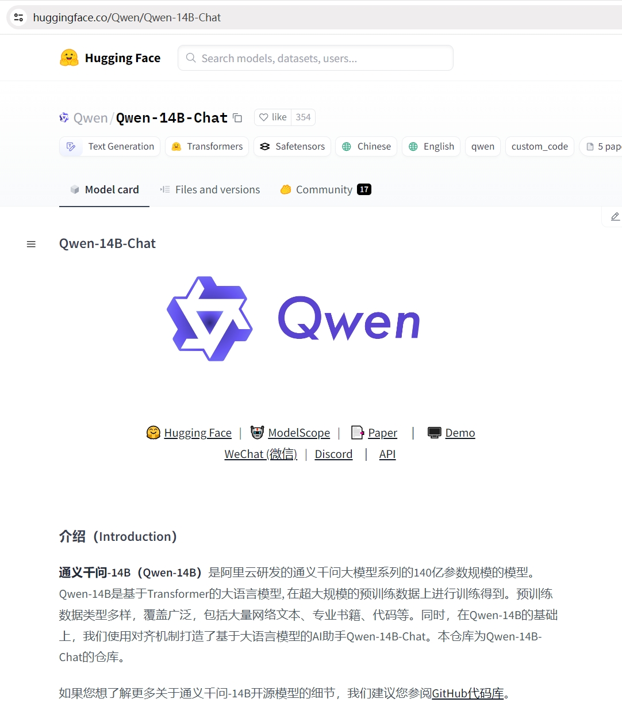

<style>
details {
    border: 1px solid #aaa;
    border-radius: 4px;
    padding: .5em .5em 0;
}
summary {
    font-weight: bold;
    margin: -.5em -.5em 0;
    padding: .5em;
}
details[open] {
    padding: .5em;
}
details[open] summary {
    border-bottom: 1px solid #aaa;
    margin-bottom: .5em;
}
img {
    pointer-events: none;
}
</style>

<details><summary>目录</summary><p>

- [基本概念](#基本概念)
    - [Prompt](#prompt)
    - [Temperature](#temperature)
    - [System Prompt](#system-prompt)
- [LLM 获取方式](#llm-获取方式)
    - [LLM 名单](#llm-名单)
        - [权威数据集的排行榜](#权威数据集的排行榜)
        - [论文](#论文)
        - [公众号](#公众号)
    - [LLM 本体](#llm-本体)
        - [Hugging Face 模型下载](#hugging-face-模型下载)
        - [Hugging Face 镜像下载](#hugging-face-镜像下载)
        - [modelscope 模型下载](#modelscope-模型下载)
        - [git-lfs 模型下载](#git-lfs-模型下载)
        - [Openxlab 模型下载](#openxlab-模型下载)
- [LLM 调用示例](#llm-调用示例)
    - [查看模型](#查看模型)
    - [下载模型](#下载模型)
    - [模型调用](#模型调用)
- [LLM API](#llm-api)
    - [OpenAI ChatGPT](#openai-chatgpt)
        - [API key 申请](#api-key-申请)
        - [API key 配置](#api-key-配置)
        - [加载环境变量](#加载环境变量)
        - [调用 OpenAI API](#调用-openai-api)
    - [百度文心一言](#百度文心一言)
        - [千帆 SDK](#千帆-sdk)
            - [API key 申请](#api-key-申请-1)
            - [API key 配置](#api-key-配置-1)
            - [加载环境变量](#加载环境变量-1)
            - [调用千帆 API](#调用千帆-api)
        - [ERNIE SDK](#ernie-sdk)
            - [API 申请](#api-申请)
            - [API Key 配置](#api-key-配置-2)
            - [加载环境变量](#加载环境变量-2)
            - [调用 Ernie Bot API](#调用-ernie-bot-api)
    - [讯飞星火](#讯飞星火)
        - [API key 申请](#api-key-申请-2)
        - [API key 配置](#api-key-配置-3)
        - [加载环境变量](#加载环境变量-3)
        - [模型调用](#模型调用-1)
            - [SDK 方式](#sdk-方式)
            - [WebSocket 方式](#websocket-方式)
    - [智谱 GLM](#智谱-glm)
        - [API key 申请](#api-key-申请-3)
        - [API key 配置](#api-key-配置-4)
        - [加载环境变量](#加载环境变量-4)
        - [调用智谱 GLM API](#调用智谱-glm-api)
- [LLM 接入 LangChain](#llm-接入-langchain)
    - [OpenAI ChatGPT](#openai-chatgpt-1)
        - [Model](#model)
        - [Prompt](#prompt-1)
        - [Output parser](#output-parser)
        - [完整的流程](#完整的流程)
    - [文心一言](#文心一言)
        - [自定义 LLM 接入 LangChain](#自定义-llm-接入-langchain)
        - [在 LangChain 直接调用文心一言](#在-langchain-直接调用文心一言)
    - [讯飞星火](#讯飞星火-1)
    - [智谱 GLM](#智谱-glm-1)
        - [自定义 ChatGLM](#自定义-chatglm)
        - [自定义 ChatGLM 接入 LangChain](#自定义-chatglm-接入-langchain)
- [参考资料](#参考资料)
</p></details><p></p>

# 基本概念

## Prompt

Prompt 最初是 NLP（自然语言处理）研究者为下游任务设计出来的一种任务专属的输入模板，
类似于一种任务（例如：分类，聚类等）会对应一种 Prompt。
在 ChatGPT 推出并获得大量应用之后，Prompt 开始被推广为给大模型的所有输入。
即，每一次访问大模型的输入为一个 Prompt，而大模型给我们的返回结果则被称为 Completion。

## Temperature

LLM 生成是具有随机性的，在模型的顶层通过选取不同预测概率的预测结果来生成最后的结果。
一般可以通过控制 `temperature` 参数来控制 LLM 生成结果的随机性与创造性。

`temperature` 一般取值在 0~1 之间，当取值较低接近 0 时，预测的随机性会较低，
产生更保守、可预测的文本，不太可能生成意想不到或不寻常的词。
当取值较高接近 1 时，预测的随机性会较高，所有词被选择的可能性更大，
会产生更有创意、多样化的文本，更有可能生成不寻常或意想不到的词。

对于不同的问题与应用场景，可能需要设置不同的 `temperature`。例如，

* 在搭建的个人知识库助手项目中，一般将 `temperature` 设置为 0，
  从而保证助手对知识库内容的稳定使用，规避错误内容、模型幻觉；
* 在产品智能客服、科研论文写作等场景中，同样更需要稳定性而不是创造性；
* 但在个性化 AI、创意营销文案生成等场景中，就更需要创意性，
  从而更倾向于将 `temperature` 设置为较高的值。

## System Prompt

System Prompt 是随着 ChatGPT API 开放并逐步得到大量使用的一个新兴概念，
事实上，它并不在大模型本身训练中得到体现，而是大模型服务方为提升用户体验所设置的一种策略。

具体来说，在使用 ChatGPT API 时，你可以设置两种 Prompt：

* 一种是 System Prompt，该种 Prompt 内容会在整个会话过程中持久地影响模型的回复，
  且相比于普通 Prompt 具有更高的重要性；
* 另一种是 User Prompt，这更偏向于我们平时提到的 Prompt，即需要模型做出回复的输入。

一般设置 System Prompt 来对模型进行一些**初始化设定**，例如，
可以在 System Prompt 中给模型设定希望它具备的人设，如一个个人知识库助手等。
System Prompt 一般在一个会话中仅有一个。在通过 System Prompt 设定好模型的**人设**或是**初始设置**后，
可以通过 User Prompt 给出模型需要遵循的指令。例如，当我们需要一个幽默风趣的个人知识库助手，
并向这个助手提问我今天有什么事时，可以构造如下的 Prompt：

```
{
    "system prompt": "你是一个幽默风趣的个人知识库助手，可以根据给定的知识库内容回答用户的提问，注意，你的回答风格应是幽默风趣的",
    "user prompt": "我今天有什么事务？"
}
```

通过如上 Prompt 的构造，我们可以让模型以幽默风趣的风格回答用户提出的问题。

# LLM 获取方式

模型的获取途径分为两部分，一部分是获取模型名单，了解模型信息，
以便挑选适合自己的模型，另一部分是获取模型本体和使用手册。

## LLM 名单

获取模型名单通常有以下几个途径：

### 权威数据集的排行榜

国内国外有许多大模型测评数据集，大模型发布的论文中一般都会在最权威的几个数据集上测评，
因此在论文中就可以了解到这些数据集。此处推荐两个：

* 在 ICLR 上发布的 [MMLU 数据集](https://paperswithcode.com/sota/multi-task-language-understanding-on-mmlu)，
  主要评测英文文本的各项能力；
* 由上交、清华和爱丁堡大学共同完成的 [C-Eval 数据集](https://cevalbenchmark.com/)，主要评测中文能力。

在这些数据集的排行榜上，不仅可以看到许多模型的排名，还可以查看其参数量、
每个子任务的表现和项目链接，有助于根据需要选择合适的模型。

### 论文

论文作为大模型发布的主要阵地，也是不可或缺的手段。想要获取全面的模型名单，
综述文章是一个很好的途径，因其一般会系统地梳理一段时间内的所有进展；
若要寻找某一具体领域或某一系列的的模型，可以从某一篇论文入手，从其引用论文中寻找。

### 公众号

除了上述两种方法外，也可以从诸如机器之心等输出深度学习内容的公众号中了解最新的大模型。

在这里需要说明的一点是，选择模型时一定要注意自己的算力资源和任务，
因为参数量越大的模型虽然性能通常更好，但正式部署所需的算力资源也是成倍上升，
而且并不是每个任务都需要用到能力最强的大模型，中小体量的模型已经可以胜任大部分文本处理任务了。

## LLM 本体

在选定了要使用的模型后，需要寻找模型本体和使用手册。
在开源的模型中，一小部分模型在专门的官网上，通过其官网即可下载。
但是绝大部分模型可以在以下开源社区搜索名称即可找到：

* [Hugging Face](https://huggingface.com)
* [Hugging Face Mirror](https://hf-mirror.com/)
* [魔塔社区](https://modelscope.cn/home)
* [git-lfs](https://git-lfs.com/)
* [Openxlab]()
* [Github](https://github.com)

而对于不开源的模型，则通常需要在其官网付费购买调用次数，之后根据官网使用说明调用即可。

### Hugging Face 模型下载

使用 HuggingFace 官方提供的 `huggingface-cli` 命令行工具。

安装 `huggingface_hub` 依赖:

```bash
$ pip install -U huggingface_hub
```

然后新建 Python 脚本，填入以下代码，运行即可。

* `resume-download`：断点续下
* `local-dir`：本地存储路径。Linux 环境下需要填写绝对路径

```python
import os

# 下载模型
os.system("huggingface-cli download --resume-download internlm/internlm-chat-7b --local-dir your_path")
```

### Hugging Face 镜像下载

与使用 Hugginge Face 下载相同，只需要填入镜像地址即可。
使用 Hugging Face 官方提供的 `huggingface-cli` 命令行工具。

安装 `huggingface_hub` 依赖:

```bash
$ pip install -U huggingface_hub
```

然后新建 Python 脚本，填入以下代码，运行即可。

* `resume-download`：断点续下
* `local-dir`：本地存储路径。Linux 环境下需要填写绝对路径

```python
import os

# 设置环境变量
os.environ["HF_ENDPOINT"] = "https://hf-mirror.com"

# 下载模型
os.system("huggingface-cli download --resume-download internlm/internlm-chat-7b --local-dir your_path")
```

### modelscope 模型下载

使用 `modelscope` 中的 `snapshot_download` 函数下载模型，第一个参数为模型名称，
参数 `cache_dir` 为模型的下载路径。注意：`cache_dir` 最好为绝对路径。

安装依赖：

```bash
$ pip install modelscope
$ pip install transformers
```

在当前目录下新建 Python 文件，填入以下代码，运行即可：

```python
import os

import torch
from modelscope import (
    snapshot_download,
    AutoModel,
    AutoTokenizer
)

model_dir = snapshot_download(
    "Shanghai_AI_Laboratory/internlm-chat-7b",
    cache_dir = "your_path",
    revision = "master"
)
```

### git-lfs 模型下载

来到 git-lfs 网站下载安装包，然后安装 `git-lfs`。安装好之后在终端输入 `git lfs install`，
然后就可以使用 `git-lfs` 下载模型了。

```bash
$ git clone https://huggingface.co/internlm/internlm-7b
```

### Openxlab 模型下载

Openxlab 可以通过指定模型仓库的地址，以及需要下载的文件的名称，
文件所需下载的位置等，直接下载模型权重文件。

使用 Python 脚本下载模型首先要安装依赖，安装代码如下：

```bash
$ pip isntall -U openxlab
```

安装完成后使用 `download` 函数导入模型中心的模型：

```python
from openxlab.model import download

download(
    model_repo = "OpenLMLab/InternLM-7b",
    model_name = "InternLM-7b",
    output = "you_paht"
)
```

# LLM 调用示例

下载模型本体后即可根据使用手册调用、与模型进行对话。
以阿里巴巴发布的参数量 14B 的通义千问模型 `Qwen-14B-Chat` 为例，
展示从模型下载、环境配置到正式调用的过程。

## 查看模型

从 [C-Eval 公开访问的模型榜单](https://cevalbenchmark.com/static/leaderboard.html)查询到 `Qwen-14B` 排名 14，
从表中即可看到模型在各方面的得分：


## 下载模型

在确定使用到 `Qwen-14B` 后，在 Hugging Face 中搜索模型名，
即可找到模型介绍界面和下载信息：

[](https://huggingface.co/Qwen/Qwen-14B-Chat)

1. 首先我们根据使用说明进行环境配置，使用大模型的环境配置通常并不复杂，
   在终端中输入以下语句安装调用模型需要的第三方库：

```bash
$ pip install transformers==4.32.0 
$ pip install accelerate 
$ pip install tiktoken 
$ pip install einops 
$ pip install scipy 
$ pip install transformers_stream_generator==0.0.4 
$ pip install peft 
$ pip install deepspeed
```

2. 环境配置完成后需要下载模型本体，
   而 Hugging Face 的一大好处就在于发布于其上的模型通常都可以通过 `transformer` 包自动下载，
   例如 `Qwen-14B-Chat` 模型只需要以下几行代码即可自动下载并加载：

```python
from transformers import AutoModelForCausalLM, AutoTokenizer

# 加载分词器(若本地没有则自动下载)
tokenizer = AutoTokenizer.from_pretrained(
    "Qwen/Qwen-14B-Chat", 
    trust_remote_code = True,
)

# 加载模型(若本地没有则自动下载)
model = AutoModelForCausalLM.from_pretrained(
    "Qwen/Qwen-14B-Chat",
    # device_map 参数代表模型部署的位置，\
    # auto 代表自动推断 cpu 和 gpu 个数并均匀分布，\
    # 此外还可手动指定，例如"cuda:0"表示只部署在第一块显卡上.
    device_map = "auto", 
    trust_remote_code = True,
).eval()
```

但需要注意的是，运行代码时需要科学上网，否则无法连接到 Hugging Face 网站。若已经将模型手动下载到本地，
则只需要将 `AutoTokenizer.from_pretrained` 和 `AutoModelForCausalLM.from_pretrained` 两个函数中的第一个参数改为本地模型文件夹路径即可。

## 模型调用

加载模型结束后，即可通过模型的函数进行交互，以 `Qwen-14B-Chat` 为例，
我们向其打招呼 `“你好”`，与模型对话：

```python
response, history = model.chat(
    tokenizer, 
    "你好", 
    history = None
)
print(response)
```

* 第一个参数传入分词器；
* 第二个参数传入对话文本；
* `history` 参数传入之前的对话历史，若没有则传入 `None`，函数返回模型回应和对话历史。

代码运行后可以得到模型输出为：

```
“你好！很高兴为你提供帮助。”
```

我们成功得到了模型的回答。在此基础上我们继续与其对话，
传入指令`“给我讲一个年轻人奋斗创业最终取得成功的故事”`，
并且传入上次的对话历史：

```python
response, history = model.chat(
    tokenizer, 
    "给我讲一个年轻人奋斗创业最终取得成功的故事。", 
    history = history
)
print(response)
```

代码运行后得到以下输出：

```
“这是一个关于一个年轻人奋斗创业最终取得成功的故事。
故事的主人公叫李明，他来自一个普通的家庭，父母都是普通的工人。
从小，李明就立下了一个目标：要成为一名成功的企业家。
为了实现这个目标，李明勤奋学习，考上了大学。
在大学期间，他积极参加各种创业比赛，获得了不少奖项。
他还利用课余时间去实习，积累了宝贵的经验。
毕业后，李明决定开始自己的创业之路。
他开始寻找投资机会，但多次都被拒绝了。然而，他并没有放弃。
他继续努力，不断改进自己的创业计划，并寻找新的投资机会。
最终，李明成功地获得了一笔投资，开始了自己的创业之路。
他成立了一家科技公司，专注于开发新型软件。
在他的领导下，公司迅速发展起来，成为了一家成功的科技企业。
李明的成功并不是偶然的。他勤奋、坚韧、勇于冒险，不断学习和改进自己。
他的成功也证明了，只要努力奋斗，任何人都有可能取得成功。”
```

可以看到，模型给出了相当完整且合理的回答。后续即可根据自己的需要进行对话，或者从头开始重新对话。


# LLM API

主要介绍四种大语言模型：ChatGPT、文心一言、讯飞星火、智谱 GLM 的 API 申请指引和 Python 版本的原生 API 调用方法，
可以按照实际情况选择一种自己可以申请的 API 进行使用即可。

* ChatGPT：推荐可科学上网的读者使用；
* 文心一言：当前无赠送新用户 tokens 的活动，推荐已有文心 tokens 额度用户和付费用户使用；
* 讯飞星火：新用户赠送 tokens，推荐免费用户使用；
* 智谱 GLM：新用户赠送 tokens，推荐免费用户使用。

如果你需要在 LangChain 中使用 LLM，可以参照 LangChain 中的调用方式。

## OpenAI ChatGPT

### API key 申请

* OpenAI API 调用服务是付费的，每一个开发者都需要首先获取并配置 OpenAI API key，
  才能在自己构建的应用中访问 ChatGPT。
* 在获取 OpenAI API key 之前需要在 OpenAI 官网注册一个账号。
  选择 `API`，然后点击左侧边栏的 `API keys`。
* 点击 `Create new secret key` 按钮创建 `OpenAI API key`。

### API key 配置

将创建好的 API key 以 `OPENAI_API_KEY="sk-..."` 的形式保存到 `.env` 文件中，
并将 `.env` 文件保存在项目根目录下。

```env
OPNEAI_API_KEY=""
```

### 加载环境变量

读取 `.env` 文件，将密钥加载到环境变量：

```python
import os
from dotenv import load_dotenv, find_dotenv

# 读取本地/项目的环境变量
# find_dotenv(): 寻找并定位 `.env` 文件的路基那个
# load_dotenv(): 读取 `.env` 文件，并将其中的环境变量加载到当前的运行环境中，如果设置的是环境变量，代码没有任何作用
_ = load_dotenv(find_dotenv())

# 如果需要通过代理端口访问，还需要做如下配置
os.environ["HTTPS_PROXY"] = "http://127.0.0.1:7890"
os.environ["HTTP_PROXY"] = "http://127.0.0.1:7890"
```

### 调用 OpenAI API

调用 ChatGPT 需要使用 [`ChatCompletion` API](https://platform.openai.com/docs/api-reference/chat)，
该 API 提供了 ChatGPT 系列模型的调用，包括 ChatGPT-3.5、GPT-4 等。

`ChatCompletion` API 的调用方法如下：

```python
from openai import OpenAI

client = OpenAI(api_key = os.environ.get("OPENAI_API_KEY"))

completion = client.chat.completions.create(
    # 调用模型
    model = "gpt-3.5-turbo",
    # 对话列表
    messages = [
        {
            "role": "system",
            "content": "You are a helpful assistant."
        },
        {
            "role": "user",
            "content": "Hello!"
        },
    ]
)
```

调用该 API 会返回一个 `ChatCompletion` 对象，其中包括了回答文本、创建时间、id 等属性。
我们一般需要的是回答文本，也就是回答对象中的 `content` 信息。

```python
completion
```

```
ChatCompletion(id='chatcmpl-9FAKG4M6HXML257axa12PUuCXbJJz', choices=[Choice(finish_reason='stop', index=0, logprobs=None, message=ChatCompletionMessage(content='Hello! How can I assist you today?', role='assistant', function_call=None, tool_calls=None))], created=1713401640, model='gpt-3.5-turbo-0125', object='chat.completion', system_fingerprint='fp_c2295e73ad', usage=CompletionUsage(completion_tokens=9, prompt_tokens=19, total_tokens=28))
```

```python
print(completion.choices[0].message.content)
```

```
Hello! How can I assist you today?
```

`ChatCompletion` 常用的几个参数：

* `model`：即调用的模型，一般取值包括 `"gpt-3.5-turbo"`（ChatGPT-3.5）、
    `"gpt-3.5-turbo-16k-0613"`（ChatGPT-3.5 16K 版本）、`"gpt-4"`（ChatGPT-4）。
    注意，不同模型的成本是不一样的。
* `messages`：即 prompt。`ChatCompletion` 的 `messages` 需要传入一个列表，
    列表中包括多个不同角色的 prompt。可以选择的角色一般包括：
    - `system`：即前文中提到的 system prompt；
    - `user`：用户输入的 prompt；
    - `assistant`：助手，一般是模型历史回复，作为提供给模型的参考内容。
* `temperature`：温度。即前文中提到的 Temperature 系数。
* `max_tokens`：最大 token 数，即模型输出的最大 token 数。
    OpenAI 计算 token 数是合并计算 Prompt 和 Completion 的总 token 数，
    要求总 token 数不能超过模型上限（如默认模型 token 上限为 4096）。
    因此，如果输入的 prompt 较长，需要设置较大的 max_token 值，否则会报错超出限制长度。

另外，OpenAI 提供了充分的自定义空间，支持通过自定义 prompt 来提升模型回答效果，
下面是一个简答的封装 OpenAI 接口的函数，支持直接传入 prompt 并获得模型的输出。

```python
from openai import OpenAI

client = OpenAI(api_key = os.environ.get("OPENAI_API_KEY"))

def gen_gpt_messages(prompt):
    """
    构造 GPT 模型请求参数 messages

    Params:
        prompt: 对应的用户提示词
    """
    messages = [
        {
            "role": "user",
            "content": prompt,
        }
    ]

    return messages

def get_completion(prompt, model = "gpt-3.5-turbo", temperature = 0):
    """
    获取 GPT 模型调用结果

    Params:
        prompt: 对应的提示词
        model: 调用的模型，默认为 gpt-3.5-turbo，也可以按需选择 gpt-4 等其他模型
        temperature: 模型输出的温度系数，控制输出的随机程度，取值范围是 0~2。温度系数越低，输出内容越一致。
    """
    response = client.chat.completion.create(
        model = model,
        messages = gen_gpt_messages(prompt),
        temperature = temperature,
    )
    if len(response.choices) > 0:
        return response.choices[0].message.content
    
    return "generate answer error"

get_completion("你好")
```

```
'你好！有什么可以帮助你的吗？'
```

## 百度文心一言

百度同样提供了 **文心一言的 API 接口**，其在推出大模型的同时，
也推出了 **文心千帆企业级大语言模型服务平台**，包括了百度整套大语言模型开发工作链。
对于不具备大模型实际落地能力的中小企业或传统企业，考虑文心千帆是一个可行的选择。

### 千帆 SDK

#### API key 申请

百度智能云千帆大模型平台提供了[多种语言的千帆 SDK](https://cloud.baidu.com/doc/WENXINWORKSHOP/s/wlmhm7vuo)，
[Python SKD](https://cloud.baidu.com/doc/WENXINWORKSHOP/s/7lq3ft3pb) 在这里。
开发者可使用 SDK 快捷地开发功能，提升开发效率。在使用千帆 SDK 之前，需要先获取文心一言调用密钥，
在代码中需要配置自己的密钥才能实现对模型的调用。

1. 首先需要有一个经过实名认证的百度账号，每一个账户可以创建若干个应用，
  每个应用会对应一个 `API_Key` 和 `Secret_Key`。
2. 进入[文心千帆服务平台](https://login.bce.baidu.com/?account=&redirect=https%3A%2F%2Fconsole.bce.baidu.com%2Fqianfan%2Foverview)
    - 点击上述 `应用接入` 按钮，创建一个调用文心大模型的应用
    - 接着点击去 `创建` 按钮，进入应用创建界面。简单输入基本信息，选择默认配置，创建应用即可。
    - 创建完成后，可以在控制台看到创建的应用的 `API Key`、`Secret Key`。

> 需要注意的是，千帆目前只有 [**Prompt 模板**](https://cloud.baidu.com/doc/WENXINWORKSHOP/s/Alisj3ard)、[**Yi-34B-Chat**](https://cloud.baidu.com/doc/WENXINWORKSHOP/s/vlpteyv3c) 和 [**Fuyu-8B公有云在线调用体验服务**](https://cloud.baidu.com/doc/WENXINWORKSHOP/s/Qlq4l7uw6) 这三个服务是免费调用的，如果想体验其他的模型服务，
需要在计费管理处开通相应模型的付费服务才能体验。

#### API key 配置

将上面获取到的 `API Key`、`Secret Key` 填写至 `.env` 文件的 `QIANFAN_AK` 和 `QIANFAN_SK` 参数。

```env
## 方式 1：使用应用 AK/SK 鉴权
QIANFAN_AK = ""

## 方式 2: 使用安全认证 AK/SK 鉴权
### 安全认证方式获取的 Access Key
QIANFAN_ACCESS_KEY = ""
### 安全认证方式获取的 Secret Key
QIANFAN_SECRET_KEY = ""
```

> 如果使用的是安全认证的参数校验，
> 需要在 [百度智能云控制台-用户账户-安全认证](https://console.bce.baidu.com/iam/#/iam/accesslist) 页，
> 查看 `Access Key`、`Secret Key`，并将获取到的参数相应的填写到 `.env` 文件的 `QIANFAN_ACCESS_KEY`
> `QIANFAN_SECRET_KEY`。

#### 加载环境变量

读取 `.env` 文件，将密钥加载到环境变量：

```python
import os
from dotenv import load_dotenv, find_dotenv

# 读取本地/项目的环境变量
_ = load_dotenv(find_dotenv())

# 如果需要通过代理端口访问，还需要做如下配置
os.environ["HTTPS_PROXY"] = "http://127.0.0.1:7890"
os.environ["HTTP_PROXY"] = "http://127.0.0.1:7890"
```

#### 调用千帆 API

百度文心同样支持在传入参数的 `messages` 字段中配置 `user`、`assistant` 两个成员角色的 prompt，
但与 OpenAI 的 prompt 格式不同的是，模型人设是通过另一个参数 `system` 字段传入的，而不是在 `messages` 字段中。

如果账户中没有免费的或者购买的额度，在执行下述代码调用文心 `ERNIE-Bot` 时，会报错。
参考：[千帆支持的全部模型列表](https://console.bce.baidu.com/qianfan/ais/console/onlineService)。

```python
import qianfan

def gen_wenxin_messages(prompt):
    """
    构造文心模型请求参数 message

    Params:
        prompt: 对应的用户提示词
    """
    messages = [{
        "role": "user",
        "content": prompt,
    }]

    return messages


def get_completion(prompt, model = "ERNIE-Bot", temperature = 0.01):
    """
    获取文心模型调用结果

    Params:
        prompt: 对应的提示词
        model: 调用的模型，默认为 ERNIE-Bot，也可以按需选择 Yi-34B-Chat 等其他模型
        temperature: 模型输出的温度系数，控制输出的随机程度，取值范围是 0~1.0，
                        且不能设置为 0。温度系数越低，输出内容越一致。
    """
    chat_comp = qianfan.ChatCompletion()
    message = gen_wenxin_messages(prompt)
    resp = chat_comp.do(
        messages = message,
        model = model,
        temperature = temperature,
        system = "你是一名个人助理"
    )

    return resp["result"]

# 如果是免费用户，在使用上述函数时，可以在入参中指定一个免费的模型（例如 Yi-34B-Chat）再运行
get_completion(prompt = "你好，介绍以下你自己", model = "Yi-34B-Chat")

# 如果你有文心系列模型 ERNIE-Bot 的使用额度，则可直接运行如下函数
get_completion(prompt = "你好，介绍以下你自己")
```

百度千帆提供了多种模型接口供调用，其中，上述使用的 `ERNIE-Bot` 模型的对话 `chat` 接口，
也就是常说的百度文心大模型。此处简要介绍文心大模型接口的常用参数：

* `messages`: 即调用的 prompt；
    - 文心的 `messages` 配置与 ChatGPT 有一定区别，其不支持 `max_token` 参数，
      由模型自行控制最大 token 数，`messages` 中的 content 总长度、
      `functions` 和 `system` 字段总内容不能超过 20480 个字符，且不能超过 5120 tokens，
      否则模型就会自行对前文依次遗忘。
    - 文心的 `messages` 有以下几点要求：
        - 一个成员为单轮对话，多个成员为多轮对话
        - 最后一个 `message` 为当前对话，前面的 `message` 为历史对话
        - 成员数目必须为奇数，`message` 中的 `role` 必须依次是 `user`、`assistant`
        - 注：这里介绍的是 `ERNIE-Bot` 模型的字符数和 tokens 限制，而参数限制因模型而异，
          请在文心千帆官网查看对应模型的参数说明
* `stream`: 是否使用流式传输；
* `temperature`: 温度系数，默认 0.8，文心的 `temperature` 参数要求范围为 `(0, 1.0]`，不能设置为 0。

### ERNIE SDK

使用 ERNIE SDK 中的 [`ERNIE Bot`](https://ernie-bot-agent.readthedocs.io/zh-cn/latest/sdk/) 来调用文心一言。
`ERNIE Bot` 为开发者提供了便捷易用的接口，使其能够轻松调用文心大模型的强大功能，
涵盖了文本创作、通用对话、语义向量以及 AI 作图等多个基础功能。

ERNIE SDK 并不像千帆 SDK 那样支持各种大语言模型，
而是只支持百度自家的文心大模型。目前 ERNIE Bot 支持的模型有：

* ernie-3.5               文心大模型（ernie-3.5）
* ernie-lite              文心大模型（ernie-lite）
* ernie-4.0               文心大模型（ernie-4.0）
* ernie-longtext          文心大模型（ernie-longtext）
* ernie-speed             文心大模型（ernie-speed）
* ernie-speed-128k        文心大模型（ernie-speed-128k）
* ernie-tiny-8k           文心大模型（ernie-tiny-8k）
* ernie-char-8k           文心大模型（ernie-char-8k）
* ernie-text-embedding    文心百中语义模型
* ernie-vilg-v2           文心一格模型

#### API 申请

在使用 ERNIE SDK 之前，需要先获取 AI Studio 后端的认证鉴权（access token），
在代码中需要配置自己的密钥才能实现对模型的调用。

1. 首先需要在 [AI Studio 星河社区](https://aistudio.baidu.com/index) 注册并登录账号，
   新用户会送 100 万 token 的免费额度，为期 3 个月；
2. 然后，点击 **访问令牌** 获取账户的 `access token`。

#### API Key 配置

复制上面申请的 `access token` 并且以 `EB_ACCESS_TOKEN="..."` 形式保存到 `.env` 文件中。

```
# Ernie SDK 文心 API 访问密钥配置
EB_ACCESS_TOKEN = ""
```

#### 加载环境变量

读取 `.env` 文件，将密钥加载到环境变量：

```python
import os
from dotenv import load_dotenv, find_dotenv

# 读取本地/项目的环境变量
_ = load_dotenv(find_dotenv())

# 如果需要通过代理端口访问，还需要做如下配置
os.environ["HTTPS_PROXY"] = "http://127.0.0.1:7890"
os.environ["HTTP_PROXY"] = "http://127.0.0.1:7890"
```

#### 调用 Ernie Bot API

Ernie Bot API 的调用方式和参数基本和千帆 API 一样，
除了在创建 `ChatCompletion` 时使用的是 `.create()` 函数。

```python
import os
import erniebot

erniebot.api_type = "aistudio"
erniebot.access_token = os.environ.get("EB_ACCESS_TOKEN")

def gen_wenxin_messages(prompt):
    """
    构造文心模型请求参数 messages

    Params:
        prompt: 对应的用户提示词
    """
    messages = [{
        "role": "user",
        "content": prompt
    }]

    return messages


def get_completion(prompt, model = "ernie-3.5", temperature = 0.01):
    """
    获取文心模型调用结果

    Params:
        prompt: 对应的提示词
        model: 调用的模型
        temperature: 模型输出的温度系数，控制输出的随机程度，取值范围是 0~1.0，
        且不能设置为 0。温度系数越低，输出内容越一致。
    """
    chat_comp = erniebot.ChatCompletion()
    message = gen_wenxin_messages(prompt)
    resp = chat_comp.create(
        messages = message,
        model = model,
        temperature = temperature,
        system = "你是一名个人助理",
    )

    return resp["result"]


get_completion("你好，介绍一下你自己")
```

## 讯飞星火

讯飞星火认知大模型，由科大讯飞于 2023 年 5 月推出的中文大模型，也是国内大模型的代表产品之一。

### API key 申请

讯飞星火大模型 API key 的申请地址是：[星火大模型 API](https://xinghuo.xfyun.cn/sparkapi?ch=dwKeloHY)。

如果是没有领取过免费试用包的用户，可以领取到 100000 tokens 的试用量，
完成个人身份认证后，还可以免费领取 2000000 tokens 的试用量。

完成领取后，点击进入控制台并创建应用，创建完成后，
就可以看到获取到的 `APPID`、`APISecret` 和 `APIKey` 了。

### API key 配置

将上面获取的 `APPID`、`APISecret` 和 `APIKey` 写入 `.env`

```
## 讯飞星火 API 访问密钥配置
### 控制台中获取的 APPID 信息
SPARK_APPID = ""
### 控制台中获取的 APIKey 信息
SPARK_API_KEY = ""
### 控制台中获取的 APISecret 信息
SPARK_API_SECRET = ""
```

### 加载环境变量

读取 `.env` 文件，将密钥加载到环境变量：

```python
import os
from dotenv import load_dotenv, find_dotenv

# 读取本地/项目的环境变量
_ = load_dotenv(find_dotenv())

# 如果需要通过代理端口访问，还需要做如下配置
os.environ["HTTPS_PROXY"] = "http://127.0.0.1:7890"
os.environ["HTTP_PROXY"] = "http://127.0.0.1:7890"
```

### 模型调用

星火提供了两种调用模型的方式：

* 一种是 SDK 方式调用，上手难度小，推荐初学者使用；
* 另一种是 WebSocket 方式调用，对企业友好，但对初学者、新手开发者来说调用难度较大。

#### SDK 方式

使用 SDK，封装一个 `get_completion()` 函数

```python
from sparkai.llm.llm import ChatSparkLLM, ChunkPrintHandler
from sparkai.core.messages import ChatMessage


def gen_spark_params(model):
    """
    构造星火模型请求参数
    """
    spark_url_tpl = "wss://spark-api.xf-yun.com/{}/chat"
    model_params_dict = {
        # v1.5 版本
        "v1.5": {
            "domain": "general", # 用于配置大模型版本
            "spark_url": spark_url_tpl.format("v1.1") # 云端环境的服务地址
        },
        # v2.0 版本
        "v2.0": {
            "domain": "generalv2", # 用于配置大模型版本
            "spark_url": spark_url_tpl.format("v2.1") # 云端环境的服务地址
        },
        # v3.0 版本
        "v3.0": {
            "domain": "generalv3", # 用于配置大模型版本
            "spark_url": spark_url_tpl.format("v3.1") # 云端环境的服务地址
        },
        # v3.5 版本
        "v3.5": {
            "domain": "generalv3.5", # 用于配置大模型版本
            "spark_url": spark_url_tpl.format("v3.5") # 云端环境的服务地址
        }
    }

    return model_params_dict[model]


def gen_spark_messages(prompt):
    """
    构造星火模型请求参数 messages

    Params:
        prompt: 对应的用户提示词
    """
    messages = [
        ChatMessage(role = "user", content = prompt)
    ]

    return messages


def get_completion(prompt, model = "v3.5", temperature = 0.1):
    """
    获取星火模型调用结果

    Params:
        prompt: 对应的提示词
        model: 调用的模型，默认为 v3.5，也可以按需选择 v3.0 等其他模型
        temperature: 模型输出的温度系数，控制输出的随机程度，
            取值范围是 0~1.0，且不能设置为 0。温度系数越低，输出内容越一致。
    """
    spark_llm = ChatSparkLLM(
        spark_api_url = gen_spark_params(model)["spark_url"],
        spark_app_id = os.environ["SPARK_APPID"],
        spark_api_key = os.environ["SPARK_API_KEY"],
        spark_api_secret = os.environ["SPARK_API_SECRET"],
        spark_llm_domain = gen_spark_params(model)["domain"],
        temperature = temperature,
        streaming = False,
    )
    messages = gen_spark_messages(prompt)
    handler = ChunkPrintHandler()
    # 当 streaming设置为 False的时候, callbacks 并不起作用
    resp = spark_llm.generate([messages], callbacks=[handler])

    return resp

get_completion("你好").generations[0][0].text
```

#### WebSocket 方式

通过 WebSocket 进行连接的方式相对来说配置较为复杂，
讯飞给出了[调用示例](https://www.xfyun.cn/doc/spark/Web.html#_3-%E8%B0%83%E7%94%A8%E7%A4%BA%E4%BE%8B)，
点击对应的语言调用示例下载即可。下载后可以得到一个 `sparkAPI.py` 文件，
文件中包含了服务端封装和客户端调用的实现。

需要注意的是，直接运行官方示例的 `sparkAPI.py` 文件会有报错，需要做如下修改：

* 注释掉如下行：`import openpyxl`（代码中并未使用到这个包，如未安装，则会提示 ModuleNotFoundError）；
* 修改 `on_close` 函数（该函数接收 3 个入参），修改后的函数如下：

```python
def on_close(ws, close_status_code, close_msg):  
    """
    收到 websocket 关闭的处理
    """
    print("### closed ###")
```

然后运行一下修改后的官方示例代码。注意：在运行之前，
还需要把在上一节中获取到的 API 的密钥赋值给 `main` 函数的入参 `appid`、
`api_secret`、`api_key`。

执行 `python sparkAPI.py`，可以得到如下的输出结果

```

```

可以注意到，官方示例的输出结果中除了 LLM 的回答内容外，
还包含标识回答结束（`#### 关闭会话`、`### close ###`）的打印日志，
如果只想保留原始输出内容，可以通过修改源代码来进行优化。

首先执行如下代码，读取 `.env` 文件的密钥配置。

```python
import os
import sparkAPI

from dotenv import load_dotenv, find_dotenv

# 读取本地/项目的环境变量
_ = load_dotenv(find_dotenv())
```

星火大模型 API 当前有多个版本，每个版本独立计量 tokens。
`get_completion` 函数封装如下：

```python
def gen_spark_params(model):
    '''
    构造星火模型请求参数
    '''

    spark_url_tpl = "wss://spark-api.xf-yun.com/{}/chat"
    model_params_dict = {
        # v1.5 版本
        "v1.5": {
            "domain": "general", # 用于配置大模型版本
            "spark_url": spark_url_tpl.format("v1.1") # 云端环境的服务地址
        },
        # v2.0 版本
        "v2.0": {
            "domain": "generalv2", # 用于配置大模型版本
            "spark_url": spark_url_tpl.format("v2.1") # 云端环境的服务地址
        },
        # v3.0 版本
        "v3.0": {
            "domain": "generalv3", # 用于配置大模型版本
            "spark_url": spark_url_tpl.format("v3.1") # 云端环境的服务地址
        },
        # v3.5 版本
        "v3.5": {
            "domain": "generalv3.5", # 用于配置大模型版本
            "spark_url": spark_url_tpl.format("v3.5") # 云端环境的服务地址
        }
    }
    return model_params_dict[model]


def get_completion(prompt, model="v3.5", temperature = 0.1):
    '''
    获取星火模型调用结果

    请求参数：
        prompt: 对应的提示词
        model: 调用的模型，默认为 v3.5，也可以按需选择 v3.0 等其他模型
        temperature: 模型输出的温度系数，控制输出的随机程度，取值范围是 0~1.0，且不能设置为 0。温度系数越低，输出内容越一致。
    '''

    response = sparkAPI.main(
        appid=os.environ["SPARK_APPID"],
        api_secret=os.environ["SPARK_API_SECRET"],
        api_key=os.environ["SPARK_API_KEY"],
        gpt_url=gen_spark_params(model)["spark_url"],
        domain=gen_spark_params(model)["domain"],
        query=prompt
    )
    return response

get_completion("你好")
```

需要注意的是，在官方示例 sparkAPI.py 文件中，temperature 参数并不支持外部传入，
而是固定值为 0.5，如果不想使用默认值，可以通过修改源代码实现支持外部参数传入。

## 智谱 GLM

### API key 申请

* 首先进入到 [智谱 AI 开放平台](https://open.bigmodel.cn/overview)，
  点击开始使用或者开发工作台进行注册。
    - 新注册的用户可以免费领取有效期 1 个月的 100w token 的体验包，
      进行个人实名认证后，还可以额外领取 400w token 体验包。
    - 智谱 AI 提供了 `GLM-4` 和 `GLM-3-Turbo` 这两种不同模型的体验入口，
      可以点击立即体验按钮直接体验。
* 对于需要使用 API key 来搭建应用的话，需要点击右侧的查看 API key 按钮，
  就会进入到个人的 API 管理列表中。在该界面，
  就可以看到获取到的 API 所对应的应用名字和 API key 了。
* 可以点击 添加新的 API key 并输入对应的名字即可生成新的 API key。

### API key 配置

首先需要配置密钥信息，将前面获取到的 API key 设置到 `.env`  文件中的 `ZHIPUAI_API_KEY`  参数：

```
ZHIPUAI_API_KEY = ""
```

### 加载环境变量

读取 `.env` 文件，将密钥加载到环境变量：

```python
import os
from dotenv import load_dotenv, find_dotenv

# 读取本地/项目的环境变量
_ = load_dotenv(find_dotenv())

# 如果需要通过代理端口访问，还需要做如下配置
os.environ["HTTPS_PROXY"] = "http://127.0.0.1:7890"
os.environ["HTTP_PROXY"] = "http://127.0.0.1:7890"
```

### 调用智谱 GLM API

智谱 AI 提供了 SDK 和原生 HTTP 来实现模型 API 的调用，建议使用 SDK 进行调用以获得更好的编程体验。

智谱的调用传参和其他类似，也需要传入一个 `message` 列表，列表中包括 `role` 和 `prompt`。
封装如下的 `get_completion` 函数：

```python
from zhipuai import ZhipuAI

client = ZhipuAI(api_key = os.environ["ZHIPUAI_API_KEY"])


def gen_glm_params(prompt):
    '''
    构造 GLM 模型请求参数 messages

    请求参数：
        prompt: 对应的用户提示词
    '''
    messages = [{"role": "user", "content": prompt}]
    return messages


def get_completion(prompt, model="glm-4", temperature=0.95):
    '''
    获取 GLM 模型调用结果

    请求参数：
        prompt: 对应的提示词
        model: 调用的模型，默认为 glm-4，
               也可以按需选择 glm-3-turbo 等其他模型
        temperature: 模型输出的温度系数，控制输出的随机程度，
                     取值范围是 0~1.0，且不能设置为 0。
                     温度系数越低，输出内容越一致。
    '''
    messages = gen_glm_params(prompt)
    response = client.chat.completions.create(
        model=model,
        messages=messages,
        temperature=temperature
    )
    if len(response.choices) > 0:
        return response.choices[0].message.content
    return "generate answer error"
```

对传入 `zhipuai` 的参数进行简单介绍：

* `messages(list)`，调用对话模型时，将当前对话信息列表作为提示输入给模型；
  按照 `{"role": "user", "content": "你好"}` 的键值对形式进行传参；
  总长度超过模型最长输入限制后会自动截断，需按时间由旧到新排序
* `temperature` (float)，采样温度，控制输出的随机性，必须为正数取值范围是：(0.0, 1.0)，
  不能等于 0，默认值为 0.95。值越大，会使输出更随机，更具创造性；值越小，输出会更加稳定或确定
* top_p (float)，用温度取样的另一种方法，称为核取样。取值范围是：(0.0, 1.0) 开区间，
  不能等于 0 或 1，默认值为 0.7。模型考虑具有 top_p 概率质量 tokens 的结果。
  例如：0.1 意味着模型解码器只考虑从前 10% 的概率的候选集中取 tokens
* request_id (string)，由用户端传参，需保证唯一性；用于区分每次请求的唯一标识，
  用户端不传时平台会默认生成

建议根据应用场景调整 `top_p` 或 `temperature` 参数，但不要同时调整两个参数。

# LLM 接入 LangChain

LangChain 为基于 LLM 开发自定义应用提供了高效的开发框架，便于开发者迅速地激发 LLM 的强大能力，
搭建 LLM 应用。LangChain 也同样支持多种大模型，内置了 OpenAI、LLAMA 等大模型的调用接口。
但是，LangChain 并没有内置所有大模型，它通过允许用户自定义 LLM 类型，来提供强大的可扩展性。

## OpenAI ChatGPT

LangChain 提供了对于多数大模型的封装，
基于 LangChain 的接口可以便捷地调用 ChatGPT 并将其集合在以 LangChain 为基础框架搭建的个人应用中。

注：基于 LangChain 接口调用 ChatGPT 同样需要配置个人密钥。

### Model

从 `langchain.chat_models` 导入 OpenAI 的对话模型 `ChatOpenAI`。除了 OpenAI 以外，
`langchain.chat_models` 还集成了其他对话模型。

```python
import os
from dotenv import load_dotenv, find_dotenv
from langchain_community.chat_models import ChatOpenAI

# 读取本地的环境变量
_ = load_dotenv(find_dotenv())

# 获取环境变量 OPENAI_API_KEY
openai_api_key = os.environ("OPENAI_API_KEY")

# OpenAI API 密钥在环境变量中设置
llm = ChatOpenAI(temperature = 0.0)
# 手动指定 API 密钥
llm = ChatOpenAI(temperature = 0.0, openai_api_key = "YOUR_API_KEY")

# localtest
# ----------
output = llm.invoke("请你自我介绍以下自己！")
output
```

可以看到，默认调用的是 ChatGPT-3.5 模型。另外，几种常用的超参数设置包括：

* `model_name`：所要使用的模型，默认为 `'gpt-3.5-turbo'`，参数设置与 OpenAI 原生接口参数设置一致。
* `temperature`：温度系数，取值同原生接口。
* `openai_api_key`：OpenAI API key，如果不使用环境变量设置 API Key，也可以在实例化时设置。
* `openai_proxy`：设置代理，如果不使用环境变量设置代理，也可以在实例化时设置。
* `streaming`：是否使用流式传输，即逐字输出模型回答，默认为 `False`，此处不赘述。
* `max_tokens`：模型输出的最大 token 数，意义及取值同上。

### Prompt

在开发大模型应用时，大多数情况下不会直接将用户的输入直接传递给 LLM。
通常，他们会将用户输入添加到一个较大的文本中，称为提示模板(Prompt Template)，
该文本提供有关当前特定任务的附加上下文。

`PromptTemplates` 正是帮助解决这个问题，它们捆绑了从用户输入到完全格式化的提示的所有逻辑。
这可以非常简单地开始。例如，生成上述字符串的提示就是。

聊天模型的接口是基于消息（message），而不是原始的文本。
`PromptTemplates` 也可以用于产生消息列表，在这种样例中，
prompt 不仅包含了输入内容信息，也包含了每条 message 的信息(角色、在列表中的位置等)。
通常情况下，一个 `ChatPromptTemplate` 是一个 `ChatMessageTemplate` 的列表。
每个 `ChatMessageTemplate` 包含格式化该聊天消息的说明（其角色以及内容）。

```python
from langchain.prompts.chat import ChatPromptTemplate

template = "你是一个翻译助手，可以帮助我将 {input_language} 翻译成 {output_language}"
human_template = "{text}"
chat_prompt = ChatPromptTemplate([
     ("system", template),
     ("human", human_template),
])

# localtest
# ----------
text = "我带着比身体重的行李，\
游入尼罗河底，\
经过几道闪电 看到一堆光圈，\
不确定是不是这里。\
"
message = chat_prompt.format_messages(
     input_language = "中文", 
     output_language = "英文", 
     text = text
)
print(message)

output = llm.invoke(message)
print(output)
```

### Output parser

`OutputParsers` 将语言模型的原始输出转换为可以在下游使用的格式。
`OutputParser` 有几种主要类型，包括：

* 将 LLM 文本转换为结构化信息(例如 JSON)
* 将 `ChatMessage` 转换为字符串
* 将除消息之外的调用返回的额外信息（如 OpenAI 函数调用）转换为字符串

最后，我们将模型输出传递给 `output_parser`，它是一个 `BaseOutputParser`，
这意味着它接受字符串或 `BaseMessage` 作为输入。
`StrOutputParser` 特别简单地将任何输入转换为字符串。

```python
from langchain_core.output_parsers import StrOutputParser

output_parser = StrOutputParser()

# localtest
# ----------
output_parser.invoke(output)
```

从上面结果可以看到，我们通过输出解析器成功将 ChatMessage 类型的输出解析为了字符串。

### 完整的流程

现在可以将所有这些组合成一条链，该链将获取输入变量，将这些变量传递给提示模板以创建提示，
将提示传递给语言模型，然后通过（可选）输出解析器传递输出。下面使用 LCEL 这种语法去快速实现一条链（chain）。

```python
chain = chat_prompt | llm | output_parser
chain.invoke({
     "input_language": "英文", 
     "output_language": "中文",
     "text": text
})
```

## 文心一言

通过 LangChain 框架来调用百度文心大模型，以将文心模型接入到应用框架中。

### 自定义 LLM 接入 LangChain

模型自定义：

```python
# wenxin_llm.py
# -*- coding: utf-8 -*-

# ***************************************************
# * File        : wenxin_llm.py
# * Author      : Zhefeng Wang
# * Email       : zfwang7@gmail.com
# * Date        : 2024-09-23
# * Version     : 1.0.092315
# * Description : 基于 LangChain 定义文心模型调用方式
# * Link        : https://github.com/datawhalechina/llm-universe/blob/cace9198cf14d98c3a266da543d58bd24b07861f/notebook/C4%20%E6%9E%84%E5%BB%BA%20RAG%20%E5%BA%94%E7%94%A8/wenxin_llm.py
# * Requirement : 相关模块版本需求(例如: numpy >= 2.1.0)
# * TODO        : 1.
# ***************************************************

__all__ = []

# python libraries
import os
import sys
ROOT = os.getcwd()
if str(ROOT) not in sys.path:
    sys.path.append(str(ROOT))
from typing import Any, List, Mapping, Optional, Dict

import qianfan
from langchain_core.callbacks.manageer import CallbackManagerForLLMRun
from langchain_core.language_models.llms import LLM

# global variable
LOGGING_LABEL = __file__.split('/')[-1][:-3]


class Wenxin_LLM(LLM):
    """
    百度文心大模型接入 LangChain
    """
    # 默认选用 ERNIE-Bot-turbo 模型，即目前一般所说的百度文心大模型
    model: str = "ERNIE-Bot-turbo"
    # 温度系数
    temperature: float = 0.1
    # API_Key
    api_key: str = None
    # Secret_Key
    secret_key: str = None
    # 系统消息
    system: str = None
    
    def _call(self, 
              prompt: str, 
              stop: Optional[List[str]] = None, 
              run_manager: Optional[CallbackManagerForLLMRun]  = None,
              **kwargs: Any):
        def gen_wenxin_messages(prompt: str):
            """
            构造文心模型请求参数 message

            Args:
                prompt (str): 对应的用户提示词
            """
            messages = [{
                "role": "user",
                "content": prompt,
            }]
            return messages
        # Completion
        chat_comp = qianfan.ChatCompletion(ak = self.api_key, sk = self.secret_key)
        # message
        messages = gen_wenxin_messages(prompt)
        # result
        response = chat_comp.do(
            messages = messages,
            model = self.model,
            temperature = self.temperature,
            system = self.system,
        )
        return response["result"]
    
    @property
    def _default_params(self) -> Dict[str, Any]:
        """
        定义一个返回默认参数的方法
        获取调用 Ernie API 的默认参数
        """
        normal_params = {
            "temperature": self.temperature,
        }
        return {**normal_params}
    
    @property
    def _llm_type(self) -> str:
        return "Wenxin"
    
    @property
    def _identifying_params(self) -> Mapping[str, Any]:
        """
        Get the identifying parameters.
        """
        return {
            **{"model": self.model}, 
            **self._default_params
        }


# 测试代码 main 函数
def main():
    pass

if __name__ == "__main__":
    main()
```

模型调用：

```python
import os
from dotenv import find_dotenv, load_dotenv

from wenxin_llm import WenxinLLM

# 读取本地/项目的环境变量
_ = load_dotenv(find_dotenv())

# 获取环境变量 API_KEY
wenxin_api_key = os.environ["QIANFAN_AK"]
wenxin_secret_key = os.environ["QIANFAN_SK"]

# 模型调用
llm = Wenxin_LLM(api_key = wenxin_api_key, secret_key = wenxin_secret_key, system = "你是一个助手！")
llm.invoke("你好，请你自我介绍一下！")
# or
llm(prompt = "你好，请你自我介绍一下！")
```

### 在 LangChain 直接调用文心一言

安装环境依赖：

```bash
$ pip install -qU langchain langchain-community
```

使用新版 LangChain，来直接调用文心一言大模型：

```python
import os
from dotenv import find_dotenv, load_dotenv
from langchain_community.llms import QianfanLLMEndpoint

# 读取本地、项目的环境变量
_ = load_dotenv(find_dotenv())

# 获取环境变量
QIANFAN_AK = os.environ["QIANFAN_AK"]
QIANFAN_SK = os.environ["QIANFAN_SK"]

# 模型调用
llm = QianfanLLMEndpoint(streaming = True)
response = llm("你好，请你介绍一下自己！")
print(response)
```

## 讯飞星火

可以[通过 LangChain 框架来调用讯飞星火大模型](https://python.langchain.com/docs/integrations/llms/sparkllm/)。

```python
import os
from dotenv import find_dotenv, load_dotenv

from langchain_community.llms import SparkLLM

# 读取本地/项目的环境变量
_ = load_dotenv(find_dotenv())

# 获取环境变量 API_KEY
IFLYTEK_SPARK_APP_ID = os.environ["IFLYTEK_SPARK_APP_ID"]
IFLYTEK_SPARK_APP_KEY = os.environ["IFLYTEK_SPARK_APP_KEY"]
IFLYTEK_SPARK_APP_SECRET = os.environ["IFLYTEK_SPARK_APP_SECRET"]

# 模型调用
def gen_spark_params(model):
    """
    构造星火模型请求参数
    """
    spark_url_tpl = "wss://spark-api.xf-yun.com/{}/chat"
    model_params_dict = {
        # v1.5 版本
        "v1.5": {
            "domain": "general", # 用于配置大模型版本
            "spark_url": spark_url_tpl.format("v1.1") # 云端环境的服务地址
        },
        # v2.0 版本
        "v2.0": {
            "domain": "generalv2", # 用于配置大模型版本
            "spark_url": spark_url_tpl.format("v2.1") # 云端环境的服务地址
        },
        # v3.0 版本
        "v3.0": {
            "domain": "generalv3", # 用于配置大模型版本
            "spark_url": spark_url_tpl.format("v3.1") # 云端环境的服务地址
        },
        # v3.5 版本
        "v3.5": {
            "domain": "generalv3.5", # 用于配置大模型版本
            "spark_url": spark_url_tpl.format("v3.5") # 云端环境的服务地址
        }
    }

    return model_params_dict[model]


spark_api_url = gen_spark_params(model = "v1.5")["spark_url"]
llm = SparkLLM(spark_api_url = spark_api_url) 
response = llm("你好，请你自我介绍一下自己！")
print(response)
```

## 智谱 GLM

### 自定义 ChatGLM

由于 LangChain 中提供的 ChatGLM 已不可用，因此需要自定义一个 LLM。

> 根据智谱官方宣布有些模型即将弃用，在这些模型弃用后，会将它们自动路由至新的模型。
> 请用户注意在弃用日期之前，将新模型编码更新为最新版本，以确保服务的顺畅过渡。

```python
# -*- coding: utf-8 -*-

# ***************************************************
# * File        : zhipuai_llm.py
# * Author      : Zhefeng Wang
# * Email       : wangzhefengr@163.com
# * Date        : 2024-08-04
# * Version     : 0.1.080418
# * Description : description
# * Link        : https://github.com/datawhalechina/llm-universe/blob/0ce94e828ce2fb63d47741098188544433c5e878/notebook/C4%20%E6%9E%84%E5%BB%BA%20RAG%20%E5%BA%94%E7%94%A8/zhipuai_llm.py
# * Requirement : 相关模块版本需求(例如: numpy >= 2.1.0)
# ***************************************************

# python libraries
import os
import sys
ROOT = os.getcwd()
if str(ROOT) not in sys.path:
    sys.path.append(str(ROOT))
from typing import Any, List, Mapping, Optional, Dict

from zhipuai import ZhipuAI
from langchain_core.callbacks.manager import CallbackManagerForLLMRun
from langchain_core.language_models.llms import LLM

# global variable
LOGGING_LABEL = __file__.split('/')[-1][:-3]


class ZhipuAILLM(LLM):
    """
    LangChain ChatGLM:
        https://python.langchain.com/v0.2/docs/integrations/llms/chatglm/
    ChatGLM model:
        https://open.bigmodel.cn/dev/howuse/model
    """
    # 默认选用 glm-4
    model: str = "glm-4"
    # 温度系数
    temperature: float = 0.1
    # API key
    api_key: str = None

    def _call(self, 
              prompt: str, 
              stop: Optional[List[str]] = None,
              run_manager: Optional[CallbackManagerForLLMRun] = None,
              **kwargs: Any):
        client = ZhipuAI(api_key = self.api_key)

        def gen_glm_params(prompt):
            """
            构造 GLM 模型请求参数 message

            Params:
                prompt: 对应的用户提示词
            """
            message = [{"role": "user", "content": prompt}]

            return message
        
        messages = gen_glm_params(prompt)
        response = client.chat.completions.create(
            model = self.model,
            messages = messages,
            temperature = self.temperature,
        )

        if len(response.choices) > 0:
            return response.choices[0].message.content
        
        return "generate answer erro"
    
    @property
    def _default_params(self) -> Dict[str, Any]:
        """
        定义一个返回默认参数的方法
        获取调用 API 的默认参数
        """
        normal_params = {
            "temperature": self.temperature,
        }
        # print(type(self.model_kwargs))
        return {**normal_params}
    
    @property
    def _llm_type(self) -> str:
        return "Zhipu"

    def _identifying_params(self) -> Mapping[str, Any]:
        """
        Get the identifying parameters.
        """
        return {
            **{"model": self.model}, 
            **self._default_params
        }


# 测试代码 main 函数
def main():
    pass

if __name__ == "__main__":
    main()
```

### 自定义 ChatGLM 接入 LangChain

```python
import os
from dotenv import find_dotenv, load_dotenv

from zhipuai_llm import ZhipuAILLM

# 读取本地/项目的环境变量
_ = load_dotenv(find_dotenv())

# 获取环境变量 API_KEY
api_key = os.environ["ZHIPUAI_API_KEY"]

zhipuai_model = ZhipuAILLM(model = "glm-4", temperature = 0.1, api_key = api_key)  # model="glm-4-0520"
zhipuai_model("你好，请自我介绍以下！")
```

# 参考资料

* [使用 LLM API](https://github.com/datawhalechina/llm-universe/blob/0ce94e828ce2fb63d47741098188544433c5e878/notebook/C2%20%E4%BD%BF%E7%94%A8%20LLM%20API%20%E5%BC%80%E5%8F%91%E5%BA%94%E7%94%A8/2.%20%E4%BD%BF%E7%94%A8%20LLM%20API.ipynb)
* [将LLM 接入 LangChain](https://github.com/datawhalechina/llm-universe/blob/main/notebook/C4%20%E6%9E%84%E5%BB%BA%20RAG%20%E5%BA%94%E7%94%A8/1.LLM%20%E6%8E%A5%E5%85%A5%20LangChain.ipynb)
