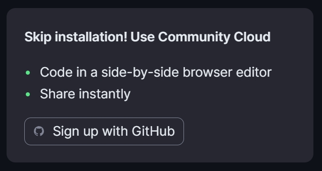

<style>
details {
    border: 1px solid #aaa;
    border-radius: 4px;
    padding: .5em .5em 0;
}
summary {
    font-weight: bold;
    margin: -.5em -.5em 0;
    padding: .5em;
}
details[open] {
    padding: .5em;
}
details[open] summary {
    border-bottom: 1px solid #aaa;
    margin-bottom: .5em;
}
img {
    pointer-events: none;
}
</style>

<details><summary>目录</summary><p>

- [Streamlit 介绍](#streamlit-介绍)
    - [Streamlit 简介](#streamlit-简介)
    - [Streamlit 构建原则](#streamlit-构建原则)
    - [Streamlit 生态](#streamlit-生态)
- [Streamlit 安装](#streamlit-安装)
    - [本地开发模式](#本地开发模式)
    - [社区云](#社区云)
- [Streamlit 概念](#streamlit-概念)
    - [Streamlit 运行命令](#streamlit-运行命令)
    - [开发流](#开发流)
    - [数据流](#数据流)
    - [数据展示和样式](#数据展示和样式)
        - [魔法命令](#魔法命令)
        - [写入 data frame](#写入-data-frame)
        - [绘制图表和地图](#绘制图表和地图)
        - [绘制折线图](#绘制折线图)
        - [绘制地图](#绘制地图)
    - [组件](#组件)
        - [复选框显示和隐藏数据](#复选框显示和隐藏数据)
        - [选择框](#选择框)
    - [布局](#布局)
    - [显示进度](#显示进度)
    - [缓存](#缓存)
    - [会话状态](#会话状态)
    - [连接](#连接)
- [Streamlit API](#streamlit-api)
- [Streamlit 部署](#streamlit-部署)
- [参考](#参考)
</p></details><p></p>


# Streamlit 介绍

## Streamlit 简介

Streamlit 是一个用于快速创建数据应用程序的开源 Python 库。
它的设计目标是让数据科学家能够轻松地将数据分析和机器学习模型转化为具有交互性的 Web 应用程序，
而无需深入了解 Web 开发。和常规 Web 框架，如 Flask/Django 的不同之处在于，
它不需要你去编写任何客户端代码（HTML/CSS/JS），只需要编写普通的 Python 模块，
就可以在很短的时间内创建美观并具备高度交互性的界面，从而快速生成数据分析或者机器学习的结果；
另一方面，和那些只能通过拖拽生成的工具也不同的是，你仍然具有对代码的完整控制权。

## Streamlit 构建原则

* 使用我们神奇简单的 API，仅用几行代码构建一个应用。然后，当你迭代保存源文件时，看到它自动更新。
* 添加一个插件与声明一个变量相同。无需编写后端，定义路由，处理 HTTP 请求，连接前端，编写 HTML，CSS，JavaScript，...
* 轻松地从 Streamlit 分享、管理和部署您的应用，全部免费！

## Streamlit 生态

Streamlit 与下面的 Python 框架兼容：

* bokeh
* Altair
* OpenCV
* DECK.GL
* Vega-Lite
* Pytorch
* TensorFlow
* Keras
* Numpy
* Pandas
* Matplotlib
* Sklearn
* plotly


# Streamlit 安装

## 本地开发模式

```bash
$ pip install streamlit
$ streamlit hello
```

## 社区云




# Streamlit 概念

## Streamlit 运行命令

```bash
$ streamlit run your_script.py [-- script args]
$ # or
$ python -m streamlit run your_script.py [-- script args]
$ # or
$ streamlit run https://raw.githubusercontent.com/streamlit/demo-uber-nyc-pickups/master/streamlit_app.py
```

## 开发流

开发 Streamlit 应用程序时，建议并排布局编辑器和浏览器窗口，以便可以同时看到代码和应用程​​序。

从 Streamlit 版本 1.10.0 及更高版本开始，Streamlit 应用程序无法从 Linux 发行版的根目录运行。
如果使用的是 Streamlit 版本 1.10.0 或更高版本，主脚本应位于根目录以外的目录中。

使用 Docker 时，可以使用 `WORKDIR` 命令指定主脚本所在的目录。

## 数据流

Streamlit 的架构允许用户像编写普通 Python 脚本一样编写应用程序。
为了解决这个问题，Streamlit 应用程序具有独特的数据流：**每当屏幕上需要更新某些内容时，
Streamlit 都会从上到下重新运行整个 Python 脚本**。这种运行方式会在以下两种情况发生：

* 用户修改应用的源代码
* 用户与应用中的组件交互。例如：拖动滑块、在输入框中输入文本或单击按钮

当通过 `on_change` 或 `on_click` 参数将回调函数传递给组件时，回调函数始终在脚本的其余部分之前运行。
Streamlit 通过 `@st.cache_data` 装饰器让应用重新运行时跳过某些昂贵的运算。 

## 数据展示和样式

在 Streamlit 应用中显示数据（表、数组、数据框）的方法有多种，
Streamlit 的魔法命令和 `st.write()` 可以用于写入从文本到表格的任何内容。

### 魔法命令

Streamlit 支持魔法命令（magic commands），可以在不调用任何 Streamlit 方法的情况下将内容写入应用。
这意味着写入内容是可以根本不使用 `st.write()` 方法。

```python
"""
# My first app
Here's our first attempt at using data to create a table:
"""

import streamlit as st
import pandas as pd

df = pd.DataFrame({
  'first column': [1, 2, 3, 4],
  'second column': [10, 20, 30, 40]
})

df
```

在上面的例子中，当 Streamlit 看到变量或文字时，它会使用 `st.write()` 自动将其写入应用。

### 写入 data frame

`st.write()` 几乎可以将任何传递给它的内容吸入应用，比如：文本、Matplotlib 图形、Altair 图形等。

```python
import streamlit as st
import pandas as pd

st.write("Here's our first attempt at using data to create a table:")
st.write(pd.DataFrame({
    'first column': [1, 2, 3, 4],
    'second column': [10, 20, 30, 40]
}))
```

除了 `st.write()` 方法外，还有针对显示特定数据的函数，例如：`st.dataframe()` 和 `st.table()`。

```python
import streamlit as st
import pandas as pd

dataframe = np.random.randn(10, 20)
st.dataframe(dataframe)
```

```python
import streamlit as st
import pandas as pd
import numpy as np

dataframe = pd.DataFrame(
    np.random.randn(10, 20),
    columns = ('col %d' % i for i in range(20))
)
st.dataframe(dataframe.style.highlight_max(axis = 0))
```

```python
import streamlit as st
import pandas as pd
import numpy as np

dataframe = pd.DataFrame(
    np.random.randn(10, 20),
    columns=('col %d' % i for i in range(20))
)
st.table(dataframe.style.highlight_max(axis = 0))
```

### 绘制图表和地图

Streamlit 支持多种流行的数据图表库，例如 Matplotlib、Altair、deck.gl 等。

```python

```

### 绘制折线图

可以使用 `st.line_chart()` 轻松地将折线图添加到应用中。

```python
import streamlit as st
import pandas as pd
import numpy as np

chart_data = pd.DataFrame(
    np.random.randn(20, 3),
    columns = ["a", "b", "c"]
)
st.line_chart(chart_data)
```

### 绘制地图

使用 `st.map()` 您可以在地图上显示数据点

```python
import streamlit as st
import pandas as pd
import numpy as np

map_data = pd.DataFrame(
    np.random.randn(1000, 2) / [50, 50] + [37.76, -122.4],
    columns = ['lat', 'lon']
)
st.map(map_data)
```

## 组件

### 复选框显示和隐藏数据

```python
import streamlit as st
import numpy as np
import pandas as pd

if st.checkbox('Show dataframe'):
    chart_data = pd.DataFrame(
       np.random.randn(20, 3),
       columns=['a', 'b', 'c'])

    chart_data
```

### 选择框

```python
import streamlit as st
import pandas as pd

df = pd.DataFrame({
    'first column': [1, 2, 3, 4],
    'second column': [10, 20, 30, 40]
    })

option = st.selectbox(
    'Which number do you like best?',
     df['first column'])

'You selected: ', option
```

## 布局

在 Streamlit 中可以使用 `st.sidebar` 轻松地在左侧面板侧边栏中组织组件。
传递到 `st.sidebar` 的每个元素都固定在左侧，允许用户专注于应用程序中的内容，
同时仍然可以访问 UI 控件。

例如，如果要将选择框和滑块添加到侧边栏，
请使用 `st.sidebar.slider` 和 `st.sidebar.selectbox` 而不是 `st.slider` 和 `st.selectbox`。

```python
import streamlit as st

# Add a selectbox to the sidebar:
add_selectbox = st.sidebar.selectbox(
    "How would you like to be contacted?",
    ("Email", "Home phone", "Mobile phone")
)

# Add a slider to the sidebar
add_slider = st.sidebar.slider(
    "Select a range of values",
    0.0, 
    100.0, 
    (25.0, 75.0)
)
```

除了侧边栏之外，Streamlit 还提供了几种其他方法来控制应用程序的布局。
`st.columns` 可让您并排放置小部件，而 `st.expander` 可让您通过隐藏大内容来节省空间。

```python
left_column, right_column = st.columns(2)
# You can use a column just like st.sidebar:
left_column.button("Press me!")

# or even better, call Streamlit functions inside a "with" block
with right_column:
    chosen = st.radio(
        "Sorting hat",
        ("Gryffindor", "Ravenclaw", "Hufflepuff", "Slytherin")
    )
    st.write(f"You are in {chosen} house!")
```

## 显示进度

当向应用程序添加长时间运行的计算时，可以使用 `st.progress()` 来实时显示状态。

```python
import time
import streamlit as st

"Starting a long computation..."

# Add a placeholder
latest_iteration = st.empty()
bar = st.progress(0)

for i in range(100):
    # Update the progress bar with each iteration
    latest_iteration.text(f"Iteration {i + 1}")
    bar.progress(i + 1)
    time.sleep(0.1)

"...and now we\'re done!"
```

## 缓存


## 会话状态


## 连接


# Streamlit API

Streamlit 提供了一组简单而强大的基础模块，用于构建数据应用程序：

* `st.write()`：这是最基本的模块之一，用于在应用程序中呈现文本、图像、表格等内容。
* `st.title()`、`st.header()`、`st.subheader()`：这些模块用于添加标题、子标题和分组标题，以组织应用程序的布局。
* `st.text()`、`st.markdown()`：用于添加文本内容，支持 Markdown 语法。
* `st.image()`：用于添加图像到应用程序中。
* `st.dataframe()`：用于呈现 Pandas 数据框。
* `st.table()`：用于呈现简单的数据表格。
* `st.pyplot()`、`st.altair_chart()`、`st.plotly_chart()`：用于呈现 Matplotlib、Altair 或 Plotly 绘制的图表。
* `st.selectbox()`、`st.multiselect()`、`st.slider()`、`st.text_input()`：用于添加交互式小部件，
  允许用户在应用程序中进行选择、输入或滑动操作。
* `st.button()`、`st.checkbox()`、`st.radio()`：用于添加按钮、复选框和单选按钮，以触发特定的操作。

这些基础模块使得通过 Streamlit 能够轻松地构建交互式数据应用程序，并且在使用时可以根据需要进行组合和定制，
更多内容请查看[Streamlit 官方文档](https://streamlit.io/)


# Streamlit 部署

# 参考

* [Streamlit 官方文档](https://streamlit.io/)
